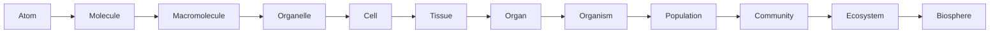

# Cách tư duy trong Sinh học — Scientific Thinking, Scale and Models (과학적 사고, 규모와 모델)

Sinh học (Biology / 생물학) thường được nhớ như một môn có rất nhiều tên gọi: tế bào, DNA, enzyme, hormone, neuron, loài, quần thể, hệ sinh thái. Nếu học từng thuật ngữ riêng lẻ, môn học nhanh chóng trở thành một danh sách dài phải ghi nhớ. Nhưng nếu nhìn từ bản chất, Sinh học chỉ đang theo đuổi một nhóm câu hỏi liên kết rất chặt với nhau: **vật chất phải được tổ chức như thế nào để tạo nên sự sống; hệ sống lấy và sử dụng năng lượng ra sao; thông tin được lưu, đọc và truyền thế nào; hệ thống tự điều chỉnh bằng cách nào; và vì sao các dạng sống thay đổi qua thời gian?**

File này là cửa vào của toàn bộ thư viện. Nó không dạy trước một chương Sinh học cụ thể mà xây “ngôn ngữ tư duy” sẽ được dùng lại ở tất cả các chương sau. Khi gặp một khái niệm mới, thay vì hỏi ngay “định nghĩa là gì?”, ta sẽ tập hỏi: **vấn đề nào khiến khái niệm đó cần tồn tại, nó thuộc scale nào, vật chất–năng lượng–thông tin đang đi đâu, và cơ chế nào nối nguyên nhân với kết quả?**

> **Mental model:** Sinh học không phải bản danh mục các bộ phận của sinh vật. Nó là khoa học về những hệ thống vật chất có khả năng duy trì chính mình, xử lý thông tin, điều chỉnh trước môi trường và để lại hậu duệ có thể tiếp tục tiến hóa.

## 1. Từ “đồ vật” sang “quá trình”

Hãy tưởng tượng ta có một tế bào đã chết nhưng cấu trúc của nó vẫn còn tương đối nguyên vẹn. Trong một thời gian ngắn, DNA vẫn ở đó, màng vẫn có thể quan sát được, nhiều protein vẫn chưa phân hủy. Nếu chỉ dựa vào danh sách thành phần, tế bào sống và tế bào vừa chết gần như giống nhau. Điều mất đi trước tiên không phải toàn bộ vật chất, mà là **mạng lưới quá trình có tổ chức**.

Một tế bào sống liên tục lấy chất từ môi trường, biến đổi phân tử, duy trì chênh lệch ion giữa trong và ngoài màng, sửa protein bị hỏng, sao chép DNA khi cần và điều chỉnh hoạt động theo tín hiệu. Những quá trình này phụ thuộc lẫn nhau. Không có năng lượng, bơm ion ngừng hoạt động. Gradient ion sụp đổ làm nhiều transport process dừng lại. Metabolism mất ổn định khiến tế bào không còn nguyên liệu để sửa chữa. Một thay đổi nhỏ có thể lan thành sự sụp đổ của toàn hệ.

Đây là lý do **tư duy hệ thống (systems thinking / 시스템 사고)** quan trọng. Một thành phần sinh học hiếm khi có ý nghĩa khi đứng một mình. Protein chỉ có chức năng trong một môi trường hóa học nhất định. Gene chỉ có ý nghĩa khi có machinery đọc nó. Hormone chỉ có tác dụng ở tế bào có receptor phù hợp. Một loài chỉ tồn tại trong mạng lưới quan hệ với môi trường và các loài khác.

Từ đây xuất hiện nguyên tắc đầu tiên của thư viện:

> Khi học một thành phần, luôn hỏi thêm: **nó nằm trong hệ nào, nhận input gì, tạo output gì, phụ thuộc vào cái gì và ảnh hưởng ngược lại lên hệ ra sao?**

Cách nghĩ này sẽ quay lại ở [[../01_cell_biology/02_cell_signaling_and_cell_cycle]], [[../04_organismal_biology/01_animal_physiology_and_homeostasis]] và [[../05_ecology/00_population_community_and_behavior]].

## 2. Quan sát, giải thích và cơ chế không phải cùng một thứ

Khoa học thường bắt đầu bằng một **hiện tượng (phenomenon / 현상)**. Sau khi chạy nhanh, bạn thở gấp hơn. Đây là điều quan sát được. Nhưng “thở gấp” chưa phải lời giải thích.

Một lời giải thích cơ học phải nối nhiều tầng. Cơ đang co nhiều hơn nên cần ATP nhanh hơn. Để tái tạo ATP, hô hấp tế bào tăng tốc. Quá trình đó tiêu thụ nhiều oxygen và tạo nhiều carbon dioxide. CO₂ làm thay đổi cân bằng acid–base trong máu. Các receptor cảm nhận thay đổi này, hệ thần kinh điều chỉnh nhịp thở và tim, và cuối cùng ta quan sát thấy thở nhanh hơn.

Chuỗi đó minh họa **suy luận nhân quả (causal reasoning / 인과 추론)**. Trong Sinh học, câu hỏi quan trọng không chỉ là “A đi cùng B không?” mà là “A tác động lên B qua những bước trung gian nào?”.

Ta có thể hình dung một cơ chế theo dạng:

```text
thay đổi ban đầu
    ↓
sensor hoặc thành phần bị ảnh hưởng đầu tiên
    ↓
tín hiệu hoặc dòng vật chất trung gian
    ↓
thay đổi ở process bên trong
    ↓
response quan sát được
```

Nếu ta chỉ thấy hai đại lượng cùng thay đổi, ta mới có **tương quan (correlation / 상관관계)**. Muốn nói đến **nhân quả (causation / 인과관계)**, cần thêm bằng chứng: temporal order, mechanism, experiment hoặc các phương pháp kiểm soát confounder phù hợp.

Khác biệt này đặc biệt quan trọng khi đọc nghiên cứu về dinh dưỡng, gene, bệnh, microbiome hay môi trường. “Người có X thường có Y” chưa đủ để kết luận “X gây Y”.

## 3. Model: công cụ để suy luận, không phải bản sao của thực tại

Một hệ sinh học thật thường quá phức tạp để giữ toàn bộ trong đầu. Vì vậy khoa học xây **mô hình (model / 모델)**. Model có thể là một hình vẽ, phương trình, sơ đồ causal, mạng lưới hoặc simulation.

Khi nói màng tế bào là một **phospholipid bilayer**, ta cố tình bỏ qua rất nhiều chi tiết để làm nổi bật một điều quan trọng: phần đầu ưa nước hướng về nước, phần đuôi kỵ nước tránh nước, vì thế các phospholipid tự tổ chức thành một lớp kép tạo boundary. Model này đủ tốt để giải thích tính thấm chọn lọc, nhưng chưa đủ để mô tả cholesterol, membrane protein, lipid raft, cytoskeleton hay sự thay đổi composition giữa các vùng màng.

Một model tốt không cần “giống thực tế ở mọi chi tiết”. Nó cần giữ đúng những relationship quan trọng cho câu hỏi đang xét.

Ví dụ, trong ecology ta sẽ gặp:

\[
\frac{dN}{dt}=rN
\]

Mô hình này nói tốc độ tăng quần thể tỷ lệ với kích thước quần thể hiện tại. Nó rất hữu ích để hiểu exponential growth, nhưng không có nghĩa quần thể thật có tài nguyên vô hạn. Khi assumption này không còn hợp lý, ta cần model khác như logistic growth.

Do đó, mỗi khi gặp một phương trình trong Sinh học, hãy hỏi ba câu: **biến đại diện cho điều gì, relationship nào đang được giả định, và model bỏ qua điều gì?**

## 4. Scale: cùng một hiện tượng phải được nhìn ở nhiều tầng

Sự sống tồn tại đồng thời ở nhiều **quy mô (scale / 규모)**. Một nucleotide dài cỡ nanomet. Protein và membrane cũng ở scale nanomet. Tế bào thường ở micromet. Mô và cơ quan từ milimet đến centimet. Cơ thể người ở khoảng mét. Quần thể và ecosystem có thể trải dài hàng kilomet.



Điều quan trọng không phải chỉ nhớ thứ tự, mà hiểu rằng **mỗi tầng sinh ra những property mới từ tương tác của tầng dưới**. Một phân tử protein riêng lẻ không “co cơ”. Nhưng hàng triệu protein actin–myosin được tổ chức trong muscle fiber có thể tạo lực. Một neuron riêng lẻ không tạo ký ức theo nghĩa tâm lý, nhưng mạng neuron với plasticity có thể tạo các pattern liên quan tới học và nhớ.

Hiện tượng property mới xuất hiện ở cấp tổ chức cao hơn được gọi là **tính nổi trội (emergent property / 창발적 특성)**. Emergence không có nghĩa vi phạm vật lý. Nó có nghĩa description ở tầng thấp chưa đủ thuận tiện để dự đoán hành vi ở tầng cao.

Một thay đổi có thể đi **từ dưới lên**. Mutation một nucleotide có thể đổi amino acid, làm protein đổi folding, ảnh hưởng cell function và cuối cùng thay đổi phenotype của organism.

Nhưng tác động cũng có thể đi **từ trên xuống** theo nghĩa causal context. Nhiệt độ môi trường ảnh hưởng physiology của cơ thể; trạng thái hormone ảnh hưởng gene expression; ecological pressure ảnh hưởng việc allele nào được giữ lại qua nhiều thế hệ.

Sinh học vì vậy không thể chỉ học “molecular” hoặc chỉ học “organism”. Ta phải biết chuyển scale.

## 5. Structure–function: hình dạng không phải trang trí

Một trong những câu hỏi mạnh nhất trong Sinh học là: **cấu trúc này khiến chức năng nào trở nên khả thi?** Đây là quan hệ cấu trúc–chức năng (structure–function relationship / 구조-기능 관계).

Protein enzyme có active site với hình học và phân bố điện tích phù hợp substrate. Alveoli của phổi có thành rất mỏng và diện tích bề mặt lớn, giúp diffusion khí hiệu quả. Ruột non có villi và microvilli để tăng diện tích hấp thu. Lá cây mỏng giúp ánh sáng tiếp cận chloroplast và CO₂ khuếch tán, nhưng cấu trúc đó đồng thời làm tăng nguy cơ mất nước, vì vậy thực vật cần cuticle và stomata.

Điểm quan trọng là structure luôn đi kèm **trade-off (đánh đổi / 절충)**. Một màng càng dễ thấm thì exchange càng nhanh nhưng control càng khó. Xương càng dày có thể chịu lực tốt hơn nhưng nặng hơn. Hemoglobin giữ oxygen quá chặt sẽ khó nhả oxygen cho mô.

Vì thế evolutionary adaptation hiếm khi tạo ra “thiết kế hoàn hảo”. Nó tạo ra giải pháp đủ tốt trong một tập constraint cụ thể.

## 6. Ba dòng xuyên suốt Sinh học: vật chất, năng lượng, thông tin

Nếu muốn nén toàn bộ môn Sinh học thành ba câu hỏi, có thể hỏi:

**Vật chất đi đâu? Năng lượng chuyển như thế nào? Thông tin được lưu và truyền ra sao?**

### 6.1 Dòng vật chất

Nguyên tử không biến mất khi sinh vật sử dụng chúng. Carbon trong CO₂ có thể được cây cố định vào carbohydrate nhờ photosynthesis. Động vật ăn cây, carbon đi vào mô động vật. Khi respiration diễn ra, một phần carbon trở lại CO₂. Khi organism chết, decomposer tiếp tục chuyển các hợp chất carbon.

Điều này dẫn thẳng đến ecology: **matter cycles**, trong khi energy thường flow một chiều rồi phân tán dưới dạng nhiệt.

### 6.2 Dòng năng lượng

Sự sống liên tục làm những việc “không tự xảy ra” theo chiều thuận: tổng hợp protein, duy trì ion gradient, vận chuyển chất ngược gradient, sửa chữa cấu trúc. Để làm được, tế bào cần ghép các process này với nguồn năng lượng thích hợp.

Ánh sáng có thể trở thành năng lượng hóa học trong photosynthesis. Chất dinh dưỡng được oxy hóa trong respiration. Năng lượng được chuyển tạm vào ATP và ion gradient để dùng cho cellular work.

Phần này sẽ được xây từ Hóa học trong [[01_chemistry_energy_and_water]] và [[02_biomolecules_enzymes_and_energy]], sau đó trở thành metabolism trong [[../01_cell_biology/01_metabolism_respiration_photosynthesis]].

### 6.3 Dòng thông tin

DNA lưu sequence. Nhưng sequence chỉ có ý nghĩa khi được đọc, điều hòa và chuyển thành function. RNA mang hoặc xử lý information. Protein thực hiện rất nhiều function. Receptor nhận signal. Neuron truyền electrical–chemical information. Hormone tạo long-range communication giữa các organ.

Dòng thông tin không độc lập với vật chất và năng lượng. DNA là vật chất. Transcription cần nucleotide và enzyme. Translation cần ATP/GTP. Signal transduction cần protein và ion gradient.

Do đó không nên nghĩ “gene điều khiển mọi thứ” theo kiểu gene đứng ngoài hệ thống. Gene là một lớp thông tin nằm bên trong một network vật chất–năng lượng.

## 7. Feedback: cách hệ sống giữ mình trong vùng hoạt động được

Một hệ sống không thể để mọi đại lượng thay đổi tự do. Nhiệt độ, pH, ion, glucose, oxygen và nhiều đại lượng khác phải nằm trong vùng tương thích với protein và membrane.

**Phản hồi âm (negative feedback / 음성 피드백)** xảy ra khi response làm giảm deviation ban đầu. Glucose máu tăng → insulin tăng → uptake/storage glucose tăng → glucose máu hạ. Đây là logic nền của **cân bằng nội môi (homeostasis / 항상성)**.

Có thể biểu diễn bằng control model:

```text
controlled variable
      ↓ measured by
sensor
      ↓
controller
      ↓ command
actuator / effector
      ↓
response changes controlled variable
```

Trong engineering, model này gần với feedback control. Trong biology, các component thường distributed hơn và nhiều loop chồng lên nhau, nhưng intuition vẫn rất hữu ích.

**Phản hồi dương (positive feedback / 양성 피드백)** ngược lại khuếch đại thay đổi. Blood clotting và uterine contraction khi sinh là ví dụ. Positive feedback hữu ích để chuyển hệ nhanh sang một trạng thái mới, nhưng phải có stopping condition; nếu không nó có thể runaway.

Feedback sẽ xuất hiện lại trong gene regulation, endocrine, immune response, neural circuits và ecology.

## 8. Variation và probability: Sinh học là khoa học của phân bố, không chỉ của “giá trị chuẩn”

Hai người cùng tuổi, cùng giới tính và cùng cân nặng vẫn khác nhau về genome, developmental history, microbiome, hormone, sleep, diet và vô số yếu tố khác. Vì vậy Sinh học hiếm khi cho ta một giá trị tuyệt đối đúng với mọi cá thể.

**Biến dị (variation / 변이)** vừa là thách thức khi đo lường vừa là nguyên liệu của evolution.

Meiosis phân phối chromosome theo probability. Mutation xảy ra không theo nhu cầu của organism. Molecule chuyển động nhiệt có thành phần ngẫu nhiên. Gene expression ở single-cell level có noise. Disease risk thường được mô tả bằng probability.

Khi nói một allele có 50% cơ hội được truyền từ một heterozygous parent, điều đó không có nghĩa hai đứa con sẽ chắc chắn một đứa nhận, một đứa không. Mỗi conception là một event riêng. Pattern 1:1 chỉ nổi rõ khi sample đủ lớn.

Đây là lý do probability và statistics không phải “phần toán thêm vào Sinh học”; chúng là ngôn ngữ cần thiết để mô tả variation.

## 9. Rate, gradient và network: ba kiểu relationship sẽ lặp lại liên tục

Một số cấu trúc toán học xuất hiện nhiều lần đến mức đáng nhận diện sớm.

**Rate (tốc độ thay đổi / 변화율)** hỏi một đại lượng thay đổi nhanh thế nào theo thời gian. Heart rate, population growth rate, enzyme reaction rate và mutation rate đều là rate.

**Gradient (chênh lệch theo không gian / 기울기)** mô tả sự khác biệt giữa hai vùng. Diffusion, osmosis, membrane potential và morphogen gradient đều dựa vào gradient.

**Network (mạng / 네트워크)** xuất hiện khi nhiều node tương tác. Gene regulatory network, metabolic network, neural network và food web đều có thể được nhìn bằng graph theory.

Nhận ra ba pattern này giúp chuyển kiến thức từ chương này sang chương khác thay vì học lại từ đầu.

## 10. Một ví dụ nối toàn bộ các tầng: tại sao chạy làm tim đập nhanh?

Ta có thể dùng một câu hỏi đời thường để thấy các tầng kiến thức kết nối.

Khi bắt đầu chạy, muscle contraction tăng. Ở molecular scale, actin và myosin sử dụng ATP. ATP được tái tạo bằng metabolism. Respiration cần oxygen và tạo CO₂. Ở cell/tissue scale, muscle cell tăng consumption; blood cần mang oxygen tới và đưa CO₂ đi. Ở organ scale, heart tăng cardiac output, lung tăng ventilation. Ở control scale, nervous system và chemical sensor điều chỉnh response. Ở organism scale, toàn hệ cố giữ pH, oxygen delivery, temperature và blood pressure trong vùng hoạt động.

Không có một “nguyên nhân duy nhất” cho nhịp tim tăng. Đó là response của một network nhiều tầng.

Khi sau này học từng chapter riêng, hãy nhớ ví dụ này: mỗi file chỉ zoom vào một phần của cùng một hệ thống.

## 11. Những cách học Sinh học dễ sai

Một sai lầm phổ biến là học theo câu “X có chức năng Y”. Câu đó có thể đúng nhưng không đủ. Ví dụ “mitochondria tạo ATP” dễ biến mitochondria thành một chiếc hộp ma thuật. Câu hỏi đúng phải là: electron đến từ đâu, được truyền qua đâu, proton gradient hình thành vì sao, và ATP synthase khai thác gradient đó thế nào?

Sai lầm thứ hai là dùng ngôn ngữ mục đích quá mức. Ta thường nói “cây tạo stomata để trao đổi khí”, nhưng evolution không lập kế hoạch trước. Những cấu trúc hiện tại tồn tại vì lineage mang chúng có reproductive success phù hợp trong lịch sử chọn lọc.

Sai lầm thứ ba là xem diagram như ảnh chụp thực tế. Diagram cố ý bỏ chi tiết. Mũi tên thường đại diện một chuỗi process rất dài.

Sai lầm thứ tư là tách các chương. Metabolism không kết thúc khi sang genetics; ATP vẫn cần cho DNA replication. Evolution không chỉ nằm ở chương evolution; nó giải thích enzyme, immunity, anatomy và behavior.

## 12. Từ tư duy sang vật chất: câu hỏi tiếp theo bắt buộc là gì?

Đến đây ta có một framework để hỏi đúng câu hỏi, nhưng vẫn chưa biết hệ sống “được làm bằng gì”. Nếu mọi process sinh học đều phải xảy ra trong thế giới vật chất, thì bước tiếp theo bắt buộc là hiểu các interaction vật lý–hóa học đủ để giải thích nước, ion, bond, pH và energy.

Đó là lý do chương tiếp theo không đi thẳng vào tế bào. Ta sẽ zoom xuống một tầng và hỏi:

> Tại sao carbon đặc biệt hữu ích cho sự sống? Tại sao nước có thể trở thành môi trường phản ứng? Vì sao một số phân tử tan còn số khác tự gom thành membrane? Và “energy” trong phản ứng hóa học thực sự có nghĩa gì?

Tiếp tục với [[01_chemistry_energy_and_water]].