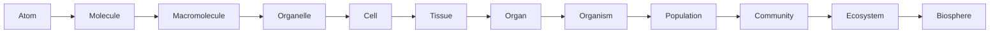
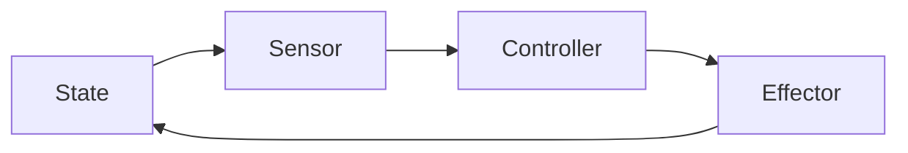

# Cách tư duy trong Sinh học — Scientific Thinking, Scale and Models (과학적 사고, 규모와 모델)

Sinh học (Biology / 생물학) thường được nhớ như một môn có rất nhiều tên gọi: tế bào, DNA, enzym (enzyme), hoóc-môn (hormone), nơron (neuron), loài, quần thể, hệ sinh thái. Nếu học từng thuật ngữ riêng lẻ, môn học nhanh chóng biến thành một danh sách dài phải ghi nhớ. Nhưng nếu nhìn từ bản chất, Sinh học chỉ đang theo đuổi một số câu hỏi liên kết chặt với nhau: **vật chất phải được tổ chức như thế nào để tạo nên sự sống; hệ sống lấy và sử dụng năng lượng ra sao; thông tin được lưu, đọc và truyền thế nào; hệ thống tự điều chỉnh bằng cách nào; và vì sao các dạng sống thay đổi qua thời gian?**

File này là cửa vào của toàn bộ thư viện. Nó không yêu cầu bạn nhớ Hóa học hay Sinh học phổ thông. Mục tiêu là xây một “ngôn ngữ tư duy” được dùng lại ở mọi chapter sau. Khi gặp một khái niệm mới, thay vì hỏi ngay “định nghĩa là gì?”, ta sẽ tập hỏi: **vấn đề nào khiến khái niệm này cần tồn tại, nó hoạt động ở scale nào, vật chất–năng lượng–thông tin đang đi đâu, và cơ chế nào nối nguyên nhân với kết quả?**

> **Mô hình tư duy (mental model):** Sinh học không phải bản danh mục các bộ phận của sinh vật. Nó là khoa học về những hệ thống vật chất có khả năng duy trì chính mình, xử lý thông tin, điều chỉnh trước môi trường và để lại hậu duệ có thể tiếp tục tiến hóa.

## 1. Từ “đồ vật” sang “quá trình”

Hãy tưởng tượng một tế bào vừa chết nhưng cấu trúc vẫn còn tương đối nguyên vẹn. DNA vẫn ở đó, màng vẫn quan sát được, nhiều protein chưa phân hủy. Nếu chỉ dựa vào danh sách thành phần, tế bào sống và tế bào vừa chết có thể khá giống nhau. Điều mất đi trước tiên không phải toàn bộ vật chất, mà là **mạng lưới quá trình có tổ chức**.

Một tế bào sống liên tục lấy chất từ môi trường, biến đổi phân tử, duy trì chênh lệch ion giữa trong và ngoài màng, sửa protein bị hỏng, sao chép DNA khi cần và điều chỉnh hoạt động theo tín hiệu. Các quá trình này phụ thuộc lẫn nhau. Không có năng lượng, bơm ion ngừng hoạt động. Gradient ion sụp đổ làm nhiều quá trình vận chuyển (transport process) dừng lại. Metabolism mất ổn định khiến tế bào không còn nguyên liệu để sửa chữa. Một thay đổi nhỏ có thể lan thành sự sụp đổ của toàn hệ.

Đây là lý do **tư duy hệ thống (systems thinking / 시스템 사고)** quan trọng. Một thành phần sinh học hiếm khi có ý nghĩa khi đứng một mình. Protein chỉ có chức năng trong một môi trường hóa học nhất định. Gene chỉ có ý nghĩa khi có bộ máy (machinery) đọc nó. Hormone chỉ tác động ở tế bào có receptor phù hợp. Một loài chỉ tồn tại trong mạng lưới quan hệ với môi trường và các loài khác.

Khi học một thành phần, hãy đặt thêm bốn câu hỏi: nó nhận input gì, biến đổi cái gì, tạo output gì, và đầu ra (output) đó ảnh hưởng ngược lại hệ thống ra sao. Cách nghĩ này sẽ quay lại khi học receptor trong truyền tín hiệu (signaling), kidney trong cân bằng nội môi (homeostasis), vật săn mồi–con mồi (predator–prey) trong ecology và mạng lưới điều hòa gen (gene-regulatory network) trong phát triển (development).

## 2. Quan sát, giải thích và cơ chế không phải cùng một thứ

Khoa học thường bắt đầu bằng một **hiện tượng (phenomenon / 현상)**. Sau khi chạy nhanh, bạn thở gấp hơn. Đây là điều quan sát được. Nhưng “thở gấp” chưa phải lời giải thích.

Một lời giải thích cơ học phải nối nhiều tầng. Cơ co nhiều hơn nên cần ATP nhanh hơn. Để tái tạo ATP, hô hấp tế bào tăng tốc. Quá trình đó tiêu thụ nhiều oxygen và tạo nhiều carbon dioxide (carbon dioxide). CO₂ làm thay đổi cân bằng axit–bazơ (acid–base) trong máu. Các receptor cảm nhận thay đổi này, hệ thần kinh điều chỉnh nhịp thở và tim, rồi ta quan sát thấy thở nhanh hơn.

Chuỗi đó minh họa **suy luận nhân quả (causal reasoning / 인과 추론)**. Trong Sinh học, câu hỏi quan trọng không chỉ là “A đi cùng B không?” mà là “A tác động lên B qua những bước trung gian nào?”.

```text
thay đổi ban đầu
    ↓
sensor hoặc thành phần bị ảnh hưởng đầu tiên
    ↓
tín hiệu hay dòng vật chất trung gian
    ↓
thay đổi process bên trong
    ↓
response quan sát được
```

Nếu chỉ thấy hai đại lượng cùng thay đổi, ta mới có **tương quan (correlation / 상관관계)**. Muốn nói đến **nhân quả (causation / 인과관계)** cần thêm thứ tự thời gian (temporal order), cơ chế (mechanism), experiment hoặc cách kiểm soát confounder phù hợp. Khác biệt này đặc biệt quan trọng khi đọc nghiên cứu về dinh dưỡng, gen (gene), bệnh, hệ vi sinh (microbiome) hay môi trường. “Người có X thường có Y” chưa đủ để kết luận “X gây Y”.

### 2.1 Tại sao experiment cần control?

Giả sử ta muốn biết một loại phân bón có làm cây cao hơn không. Nếu nhóm dùng phân bón được đặt cạnh cửa sổ còn nhóm đối chứng nằm trong góc tối, ánh sáng trở thành **biến gây nhiễu (confounder / 교란 변수)**. Ta không còn biết khác biệt chiều cao do phân bón hay do ánh sáng.

Vì vậy, experiment thường cần **nhóm đối chứng (control group / 대조군)** và cố giữ các điều kiện khác tương tự. Trong thí nghiệm thuốc, thử nghiệm đối chứng ngẫu nhiên (randomized controlled trial) cố phân bố các yếu tố khác nhau ngẫu nhiên giữa các nhóm để giảm bias. Trong sinh học phân tử (molecular biology), đối chứng âm (negative control) giúp biết tín hiệu có xuất hiện ngay cả khi thành phần cần thiết bị bỏ đi hay không.

Control không phải thủ tục hành chính. Nó là cách tách tín hiệu nhân quả (causal signal) khỏi noise.

## 3. Mô hình (model): công cụ để suy luận, không phải bản sao thực tại

Một hệ sinh học thật thường quá phức tạp để giữ toàn bộ trong đầu. Vì vậy khoa học xây **mô hình (model / 모델)**. Model có thể là hình vẽ, phương trình, sơ đồ nhân quả (causal diagram), mạng lưới hoặc simulation.

Khi nói màng tế bào là một **lớp kép phospholipid (phospholipid bilayer)**, ta cố tình bỏ qua nhiều chi tiết để làm nổi bật một điều: phần đầu ưa nước hướng về nước, phần đuôi kỵ nước tránh nước, vì thế phospholipid tự tổ chức thành lớp kép tạo ranh giới (boundary). Model này đủ tốt để hiểu tính thấm chọn lọc, nhưng chưa đủ để mô tả cholesterol, protein màng (membrane protein), miền lipid (lipid domain) hay sự tương tác với cytoskeleton.

Một model tốt không cần giống thực tế ở mọi chi tiết. Nó cần giữ đúng những relationship quan trọng cho câu hỏi đang xét.

Trong sinh thái học (ecology) ta sẽ gặp:

\[
\frac{dN}{dt}=rN
\]

Mô hình này nói tốc độ tăng quần thể tỷ lệ với kích thước quần thể hiện tại. Nó hữu ích để hiểu tăng trưởng theo hàm mũ (exponential growth), nhưng không có nghĩa quần thể thật có tài nguyên vô hạn. Khi giả định (assumption) đó không còn hợp lý, ta cần model khác như tăng trưởng logistic (logistic growth).

Mỗi khi gặp phương trình, hãy hỏi: biến đại diện cho điều gì, relationship nào đang được giả định, model bỏ qua điều gì, và khi nào assumption có thể vỡ.

## 4. Scale: cùng một sự sống nhưng nhiều tầng kích thước

Sự sống tồn tại đồng thời ở nhiều **quy mô (scale / 규모)**. Một nucleotide dài cỡ nanomet. Protein và membrane cũng ở nanomet. Tế bào thường ở micromet. Mô và cơ quan từ milimet đến centimet. Cơ thể người ở khoảng mét. Quần thể và ecosystem có thể trải hàng kilomet.



Điều quan trọng không phải chỉ nhớ thứ tự, mà hiểu rằng **mỗi tầng xuất hiện những property mới từ tương tác của tầng dưới**. Một phân tử actin không “co cơ”, nhưng hàng triệu protein actin–myosin được tổ chức trong muscle fiber có thể tạo lực. Một neuron riêng lẻ không tạo ký ức theo nghĩa tâm lý, nhưng network neuron với plasticity có thể hình thành pattern liên quan học và nhớ.

Property mới ở cấp tổ chức cao hơn được gọi là **tính nổi trội (emergent property / 창발적 특성)**. Emergence không có nghĩa vi phạm vật lý. Nó có nghĩa description ở tầng thấp chưa đủ thuận tiện để dự đoán hành vi ở tầng cao.

Một thay đổi có thể đi từ dưới lên. Mutation một nucleotide có thể đổi axit amin (amino acid), làm protein đổi folding, ảnh hưởng cell function và cuối cùng thay đổi phenotype. Nhưng tác động cũng đi từ trên xuống theo nghĩa context: hormone toàn cơ thể thay đổi biểu hiện gen (gene expression) trong tế bào; nhiệt độ môi trường thay đổi physiology; áp lực sinh thái (ecological pressure) làm allele nào đó tăng tần số qua nhiều thế hệ.

## 5. Scale còn thay đổi cả định luật “hiệu quả” của hệ

Một lý do sinh vật nhỏ và lớn không thể chỉ là phiên bản phóng to của nhau là **tỉ lệ diện tích bề mặt/thể tích (surface-area-to-volume ratio / 표면적-부피비)**.

Nếu một vật thể có kích thước đặc trưng là \(L\), diện tích bề mặt tăng xấp xỉ theo \(L^2\), còn thể tích tăng theo \(L^3\). Vì vậy:

\[
\frac{Surface\ Area}{Volume}\propto\frac{1}{L}
\]

Khi kích thước tăng, diện tích bề mặt trên mỗi đơn vị thể tích giảm. Một tế bào quá lớn sẽ khó trao đổi đủ vật chất qua màng (membrane) cho toàn bộ volume bên trong. Đây là một lý do tế bào thường nhỏ và sinh vật lớn cần hệ tuần hoàn, phổi, mạch dẫn hay các bề mặt gấp nếp để tăng area.

Math ở đây không phải phụ kiện. Nó giải thích vì sao architecture sinh học thay đổi theo scale.

## 6. Cấu trúc (structure)–chức năng (function): hình dạng tạo điều kiện và giới hạn

Một trong những câu hỏi mạnh nhất trong Sinh học là: **cấu trúc này khiến chức năng nào khả thi?** Đây là quan hệ cấu trúc–chức năng (structure–function relationship / 구조-기능 관계).

Protein (protein) enzyme có trung tâm hoạt động (active site) với hình học và phân bố điện tích phù hợp substrate. Alveoli của phổi có thành mỏng và diện tích bề mặt lớn để diffusion khí hiệu quả. Ruột non có villi và microvilli để tăng diện tích hấp thu. Lá cây mỏng giúp ánh sáng tiếp cận chloroplast và CO₂ khuếch tán, nhưng cấu trúc đó làm tăng nguy cơ mất nước nên thực vật cần cuticle và khí khổng (stomata).

Structure luôn đi kèm **trade-off (đánh đổi / 절충)**. Một màng càng dễ thấm thì exchange càng nhanh nhưng control càng khó. Xương dày hơn có thể chịu lực tốt nhưng nặng hơn. Hemoglobin giữ oxygen quá chặt thì khó nhả cho mô.

Vì vậy adaptation tiến hóa thường không tạo “thiết kế hoàn hảo”. Nó tạo lời giải đủ tốt dưới những constraint cụ thể.

## 7. Ba dòng xuyên suốt Sinh học: vật chất, năng lượng, thông tin

Nếu muốn nén toàn bộ Sinh học thành ba câu hỏi, hãy hỏi: **vật chất đi đâu, năng lượng chuyển như thế nào, thông tin được lưu và truyền ra sao?**

### 7.1 Dòng vật chất

Nguyên tử không biến mất khi sinh vật dùng chúng. Carbon trong CO₂ có thể đi vào glucose qua quang hợp (photosynthesis), sau đó vào thức ăn, cơ thể động vật, rồi trở lại CO₂ qua hô hấp (respiration). Nitrogen từ đất đi vào axit amin, protein, cơ thể sinh vật và quay về môi trường qua decomposition.

Theo dõi dòng vật chất (matter flow) giúp hiểu metabolism và ecology cùng bằng một ngôn ngữ.

### 7.2 Dòng năng lượng

Năng lượng không “chạy vòng tròn” giống vật chất. Ánh sáng được capture thành chemical energy, đi qua lưới thức ăn (food web) và dần phân tán dưới dạng nhiệt. Trong tế bào, năng lượng tự do (free energy) từ phản ứng hóa học được coupling với ATP hoặc chênh lệch ion (ion gradient) để làm công việc.

Điểm này sẽ trở thành trục chính của [Biomolecule, Enzyme và Năng lượng tế bào](02_biomolecules_enzymes_and_energy.md) và [Chuyển hóa, Hô hấp tế bào và Quang hợp](../01_cell_biology/01_metabolism_respiration_photosynthesis.md).

### 7.3 Dòng thông tin

DNA lưu thông tin di truyền; RNA và protein triển khai thông tin; receptor nhận tín hiệu; neuron truyền xung; hormone mang message giữa cơ quan; behavior cũng có thể truyền information giữa cá thể.

“Thông tin (information)” trong Sinh học không phải khái niệm thần bí. Nó luôn cần vật mang tin, cơ chế mã hóa, cơ chế đọc và bối cảnh (context) giải mã. DNA sequence chỉ có tác dụng vì tế bào có bộ máy đọc sequence thành RNA/protein.

## 8. Phản hồi (feedback): tại sao hệ sống không chạy mất kiểm soát?

Hệ sống cần regulation. Nếu một process chỉ tăng mãi, hệ sẽ sụp đổ. Vì vậy Sinh học chứa rất nhiều **phản hồi (phản hồi / 피드백)**.

Trong **phản hồi âm (negative feedback / 음성 피드백)**, response làm giảm deviation ban đầu. Khi glucose máu tăng, insulin thúc đẩy uptake và storage, kéo glucose về vùng phù hợp. Đây là nền của **cân bằng nội môi (cân bằng nội môi / 항상성)**.

Trong **phản hồi dương (positive feedback / 양성 피드백)**, response làm process tăng thêm. Trong sinh nở, contraction kích hoạt tín hiệu tăng oxytocin, oxytocin làm contraction mạnh hơn, cho tới khi birth kết thúc vòng feedback.

Một loop điều khiển có thể hình dung như:



Mô hình tư duy này sẽ tái xuất ở hệ nội tiết (endocrine system), osmoregulation, chu kỳ tế bào (cell cycle), điều hòa gen (gene regulation) và ecosystem stability.

## 9. Variation và xác suất (probability): Sinh học hiếm khi tuyệt đối

Sinh vật giống nhau nhưng không hoàn toàn giống nhau. **Biến dị (variation / 변이)** đến từ đột biến (mutation), tái tổ hợp (recombination), môi trường (environment), lịch sử phát triển (developmental history) và stochastic process. Vì vậy nhiều phát biểu Sinh học mô tả distribution chứ không mô tả một giá trị cố định.

Khi nói allele có xác suất 50% được truyền, điều đó không có nghĩa cứ hai đứa con thì đúng một đứa nhận allele. Probability mô tả mẫu hình (pattern) khi lặp nhiều lần; từng outcome riêng lẻ vẫn không chắc chắn.

Điều tương tự xảy ra trong medicine. Một yếu tố nguy cơ (risk factor) tăng probability bệnh không có nghĩa mọi người có factor đó đều bệnh. Đọc Sinh học tốt đòi hỏi phân biệt **deterministic relationship** với **probabilistic relationship**.

## 10. Tốc độ (rate), gradient và mạng lưới (network) — ba kiểu relationship sẽ xuất hiện liên tục

Ngoài ba dòng vật chất–năng lượng–thông tin, có ba motif toán học rất hay gặp.

**Tốc độ (tốc độ / 속도)** mô tả một đại lượng thay đổi nhanh đến đâu. Nhịp tim (heart rate), enzyme tốc độ phản ứng (reaction rate), population tốc độ tăng trưởng (growth rate) hay tốc độ phiên mã (transcription rate) đều dùng ý tưởng này.

**Chênh lệch (gradient) (độ dốc/chênh lệch / 기울기·구배)** mô tả khác biệt theo không gian. Molecule diffuse từ nơi concentration cao sang thấp; chênh lệch proton (proton gradient) qua membrane có thể drive ATP synthesis; thế nước (water potential) chênh lệch giúp nước đi trong cây.

**Mạng lưới (mạng lưới / 네트워크)** xuất hiện khi nhiều node tương tác: mạng lưới chuyển hóa (metabolic network), truyền tín hiệu (signaling) mạng lưới (network), mạng lưới điều hòa gen, neural network, lưới thức ăn.

Nhận ra motif giúp chuyển kiến thức từ chapter này sang chapter khác thay vì học lại từ đầu.

## 11. Các hiểu lầm phổ biến (common misconceptions)

Một hiểu lầm phổ biến là nghĩ “Sinh học chỉ mô tả”. Thực tế modern biology dùng chemistry, vật lý (physics), toán học (mathematics), statistics và computation để xây causal model và prediction.

Hiểu lầm thứ hai là nghĩ một gene “quyết định” một trait. Nhiều trait là kết quả của nhiều gene, environment và interaction. Gene thường thay đổi probability hoặc range của outcome hơn là viết sẵn một kết quả duy nhất.

Hiểu lầm thứ ba là nghĩ adaptation tồn tại vì sinh vật “cần” nó. Chọn lọc tự nhiên (natural selection) không nhìn trước tương lai. Variation xuất hiện trước; môi trường làm một số biến dị (variation) để lại nhiều offspring hơn.

Hiểu lầm thứ tư là nghĩ cân bằng nội môi giữ mọi thứ hoàn toàn cố định. Thực tế biological variable thường dao động quanh một vùng phù hợp; điểm đặt (set point) cũng có thể thay đổi theo bối cảnh.

## 12. Một ví dụ xuyên scale: tại sao bạn thở nhanh khi chạy?

Ta có thể dùng toàn bộ framework của chapter để phân tích một hiện tượng quen thuộc.

Ở quy mô phân tử (molecular scale), ATP bị thủy phân để muscle protein tạo lực. Ở cellular scale, mitochondria tăng oxidation fuel để tái tạo ATP. Ở tissue scale, muscle tạo nhiều CO₂ và heat hơn. Ở organ scale, lung và heart phải tăng exchange/vận chuyển (transport). Ở control scale, chemoreceptor phát hiện thay đổi CO₂/pH và hệ thần kinh (nervous system) điều chỉnh ventilation. Ở quy mô sinh vật (organism scale), hành vi (behavior) “thở nhanh” xuất hiện.

Không có một tầng duy nhất là “lời giải đúng”. Lời giải đầy đủ là chuỗi causal đi xuyên các tầng.

## 13. Từ cách tư duy sang câu hỏi “sự sống là gì?”

Sau chapter này ta đã có bộ công cụ: hệ thống (system), cơ chế, scale, mô hình, cấu trúc–chức năng, vật chất (matter)/năng lượng (energy)/thông tin, phản hồi, biến dị, rate và chênh lệch. Nhưng một câu hỏi vẫn chưa được trả lời: **điều gì khiến một hệ vật chất được xem là sống?**

Đó là nơi [Sự sống là gì?](00_what_is_life.md) bắt đầu. Từ đó, câu hỏi sẽ tiếp tục thu nhỏ: nếu sự sống là quá trình (process), vật chất nào tạo quá trình đó? Vì sao nước quan trọng? Carbon tạo được những cấu trúc nào? Năng lượng hóa học được quản lý ra sao? Những câu hỏi ấy dẫn tự nhiên sang [Hóa học của sự sống](01_chemistry_energy_and_water.md) và [Biomolecule, Enzyme và Năng lượng tế bào](02_biomolecules_enzymes_and_energy.md).

> **Mô hình tư duy cuối chapter:** khi gặp bất kỳ khái niệm Sinh học nào, đừng hỏi “tôi phải nhớ gì?”. Hãy hỏi “hệ đang giải quyết vấn đề gì, bằng cơ chế nào, ở scale nào, và nó nối với dòng vật chất–năng lượng–thông tin ra sao?”. Khi làm được điều đó, các chapter sau sẽ không còn là những mẩu kiến thức rời rạc.

---

<!-- biology-learning-navigation -->
**Điều hướng học:** [Mục lục Biology](../README.md) · [Sự sống là gì? →](00_what_is_life.md)
