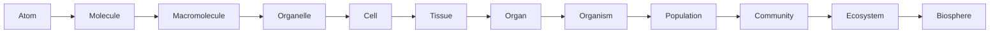

# Cách tư duy trong Sinh học — Scientific Thinking, Scale and Models (과학적 사고, 규모와 모델)

Sinh học (Biology / 생물학) không phải là môn học bắt đầu bằng việc thuộc tên các bộ phận của tế bào. Nó bắt đầu bằng một câu hỏi khó hơn: **một hệ vật chất phải hoạt động như thế nào để được xem là sống?** Từ câu hỏi đó, ta dần phải tìm hiểu vật chất, năng lượng, thông tin, cấu trúc, điều hòa, sinh sản và tiến hóa.

File này là điểm bắt đầu cho toàn bộ thư viện. Nó không giả định bạn đã nhớ Hóa học, Vật lý hay Sinh học ở trường. Mục tiêu là xây cách nhìn để khi gặp một khái niệm mới — DNA, enzyme, neuron, hormone hay ecosystem — bạn biết nên hỏi điều gì trước.

## Sinh học nghiên cứu hệ thống, không chỉ nghiên cứu “đồ vật”

Một viên đá có thể được mô tả bằng khối lượng, thành phần hóa học và hình dạng. Một tế bào thì khác. Nếu chỉ liệt kê các phân tử trong tế bào, ta vẫn chưa giải thích được vì sao tế bào sống.

Điểm khác biệt nằm ở **relationship** giữa các thành phần. Tế bào phải lấy vật chất từ môi trường, chuyển đổi năng lượng, xây và sửa cấu trúc, duy trì nồng độ ion, sao chép thông tin di truyền và phản ứng với thay đổi. Những quá trình này xảy ra đồng thời và ảnh hưởng lẫn nhau.

Vì vậy, một cách nghĩ quan trọng trong sinh học là **systems thinking (tư duy hệ thống / 시스템 사고)**: thay vì chỉ hỏi “thành phần này là gì?”, hãy hỏi thêm “nó tương tác với cái gì?”, “dòng vật chất hoặc thông tin đi qua đâu?”, “nếu thay đổi thành phần này thì toàn hệ phản ứng thế nào?”.

> **Mental model:** cơ thể sống giống một mạng lưới process hơn là một chiếc hộp chứa nhiều linh kiện. Linh kiện quan trọng, nhưng chính các dòng vật chất, năng lượng và thông tin mới làm hệ thống sống được.

## Từ quan sát đến mô hình

Khoa học thường bắt đầu từ một **hiện tượng (phenomenon / 현상)**. Ví dụ, sau khi chạy nhanh bạn thở gấp hơn. Đây là quan sát. Sinh học cố tìm cơ chế: cơ đang dùng ATP nhanh hơn, hô hấp tế bào cần nhiều oxygen hơn, carbon dioxide tăng, hệ thần kinh và tuần hoàn điều chỉnh nhịp thở và nhịp tim.

Một **giả thuyết (hypothesis / 가설)** là lời giải thích có thể kiểm tra được. Một **mô hình (model / 모델)** là cách biểu diễn hệ thống đủ đơn giản để ta suy luận. Mô hình có thể là sơ đồ, phương trình, mô phỏng máy tính hoặc hình ảnh khái niệm.

Mô hình luôn là sự đơn giản hóa. Ví dụ, khi nói màng tế bào là một “phospholipid bilayer”, ta đang nén một cấu trúc động gồm lipid, protein, carbohydrate, cholesterol và tương tác với cytoskeleton thành một mô hình đủ tốt để hiểu tính thấm chọn lọc.

Điều quan trọng là không nhầm mô hình với chính thực tại.

## Causal reasoning — nghĩ theo nguyên nhân và cơ chế

Trong sinh học, hai sự kiện cùng xảy ra chưa chắc một cái gây ra cái còn lại. **Correlation (tương quan / 상관관계)** chỉ nói rằng hai biến thay đổi cùng nhau. **Causation (quan hệ nhân quả / 인과관계)** đòi hỏi một cơ chế hoặc bằng chứng mạnh hơn.

Ví dụ, người sốt thường có nhịp tim tăng. Hai hiện tượng tương quan. Nhưng để hiểu nhân quả, ta phải đi vào cơ chế: nhiệt độ và tín hiệu viêm ảnh hưởng đến chuyển hóa, mạch máu và hệ thần kinh tự chủ; cơ thể điều chỉnh nhịp tim để đáp ứng nhu cầu mới.

Cách suy luận tốt thường đi theo chuỗi:

```text
thay đổi ban đầu
    ↓
thành phần nào cảm nhận thay đổi?
    ↓
tín hiệu được truyền bằng cách nào?
    ↓
process nào thay đổi?
    ↓
kết quả quan sát được là gì?
```

Chuỗi này sẽ xuất hiện lại ở signaling, hormone, immunity, ecology và gene regulation.

## Scale — cùng một sự sống nhưng nhiều tầng kích thước

Một trong những nguyên nhân làm Sinh học khó là cùng một hiện tượng phải được nhìn ở nhiều **scale (quy mô / 규모)**.

DNA có đường kính cỡ nanomet. Protein nằm ở quy mô nanomet. Tế bào thường ở micromet. Mô và cơ quan ở milimet đến centimet. Cơ thể ở mét. Quần thể và hệ sinh thái trải rộng từ mét đến hàng nghìn kilomet.

Các cấp tổ chức thường được nhìn như sau:



**Nguyên tử (atom / 원자)** là đơn vị vật chất cơ bản trong hóa học. Nhiều nguyên tử liên kết thành **phân tử (molecule / 분자)**. Những phân tử lớn như protein, DNA và polysaccharide thường được gọi là **đại phân tử (macromolecule / 거대분자)**. Nhiều cấu trúc phân tử phối hợp tạo nên **bào quan (organelle / 세포소기관)** và tế bào.

Một thay đổi ở scale nhỏ có thể lan lên scale lớn. Một thay đổi chỉ một nucleotide trong DNA có thể làm protein đổi cấu trúc; protein đổi có thể làm tế bào hoạt động khác; điều đó có thể ảnh hưởng toàn cơ thể. Chiều ngược lại cũng xảy ra: môi trường sống có thể tạo áp lực chọn lọc lên quần thể, khiến tần số gene thay đổi qua nhiều thế hệ.

> **Mental model:** Sinh học là khoa học của các tầng lồng nhau. Không có tầng nào “thực hơn” tầng khác; mỗi tầng trả lời một loại câu hỏi khác nhau.

## Structure and function — cấu trúc tạo giới hạn cho chức năng

Một ý tưởng xuyên suốt Sinh học là **structure–function relationship (quan hệ cấu trúc–chức năng / 구조-기능 관계)**.

Protein có chức năng khác nhau vì hình dạng ba chiều khác nhau. Phổi trao đổi khí hiệu quả vì có diện tích bề mặt lớn và hàng rào khuếch tán rất mỏng. Ruột non hấp thu tốt nhờ các nếp gấp và vi nhung mao làm tăng diện tích tiếp xúc. Lá cây mỏng giúp ánh sáng và khí đi vào dễ hơn, nhưng đồng thời khiến cây phải có cơ chế hạn chế mất nước.

Khi học một cấu trúc, hãy hỏi: **hình dạng và vật liệu của nó khiến điều gì trở nên dễ, điều gì trở nên khó?** Đây là cách biến việc học anatomy thành reasoning.

## Flow — ba dòng quan trọng: vật chất, năng lượng, thông tin

Hầu hết sinh học có thể được đọc qua ba dòng.

**Dòng vật chất (matter flow / 물질 흐름)** cho biết nguyên tử và phân tử đi đâu. Carbon từ CO₂ có thể đi vào glucose nhờ photosynthesis, sau đó đi qua thức ăn, mô cơ thể, respiration và trở lại CO₂.

**Dòng năng lượng (energy flow / 에너지 흐름)** cho biết khả năng thực hiện công việc được chuyển đổi như thế nào. Ánh sáng có thể được chuyển thành năng lượng hóa học; năng lượng hóa học trong chất dinh dưỡng có thể được đóng gói tạm thời trong ATP để tế bào sử dụng.

**Dòng thông tin (information flow / 정보 흐름)** cho biết hệ thống “biết” phải làm gì. DNA lưu thông tin di truyền; RNA và protein triển khai thông tin; receptor nhận tín hiệu môi trường; neuron truyền tín hiệu điện–hóa học.

Ba dòng này liên kết với nhau. Gene chỉ có tác dụng nếu tế bào có năng lượng để biểu hiện gene; metabolism thay đổi khi hormone truyền tín hiệu; môi trường thay đổi có thể ảnh hưởng gene expression.

## Feedback — tại sao hệ sống không chạy mất kiểm soát?

Hệ sống cần điều chỉnh. Nếu một process cứ tăng mãi, hệ thường sẽ sụp đổ. Vì vậy sinh học sử dụng rất nhiều **feedback (phản hồi / 피드백)**.

Trong **negative feedback (phản hồi âm / 음성 피드백)**, kết quả của process làm giảm nguyên nhân ban đầu. Khi glucose máu tăng, insulin giúp mô hấp thu và lưu trữ glucose, khiến glucose máu giảm về vùng thích hợp. Đây là nguyên lý trung tâm của **homeostasis (cân bằng nội môi / 항상성)**.

Trong **positive feedback (phản hồi dương / 양성 피드백)**, kết quả làm process mạnh thêm. Trong quá trình sinh nở, co tử cung kích thích tín hiệu làm tăng oxytocin, oxytocin lại làm co mạnh hơn cho đến khi em bé được sinh ra. Positive feedback thường cần một điểm kết thúc rõ ràng.

Trong control theory của kỹ thuật, ta cũng gặp ý tưởng tương tự: sensor đo trạng thái, controller so với target và actuator tạo phản ứng. Sinh học không phải máy điều khiển đơn giản, nhưng mental model này giúp hiểu endocrine, nervous system và physiology.

## Variation — sinh vật giống nhau nhưng không hoàn toàn giống nhau

Sinh học không chỉ nghiên cứu “một cơ thể điển hình”. Cá thể khác nhau vì gene, môi trường, lịch sử phát triển và ngẫu nhiên sinh học.

**Variation (biến dị / 변이)** không phải noise vô nghĩa. Nó là nguyên liệu cho evolution, đồng thời là lý do y học không thể giả định mọi người phản ứng giống hệt nhau với thuốc hay dinh dưỡng.

Khi gặp một kết luận sinh học, luôn nên hỏi nó mô tả mức trung bình, một quy luật tuyệt đối hay một phân bố có ngoại lệ.

## Probability and statistics — vì sao Sinh học cần Toán

Nhiều process sinh học mang tính xác suất. Một phân tử có thể va chạm theo chuyển động nhiệt; allele được truyền qua meiosis theo xác suất; mutation xuất hiện ngẫu nhiên; disease risk thường là probability chứ không phải định mệnh.

Khi nói một allele có xác suất 50% được truyền, điều đó không có nghĩa cứ hai đứa con thì chính xác một đứa nhận allele. Xác suất mô tả pattern khi số lần quan sát lớn, không hứa hẹn một sequence cố định.

Các file sau sẽ sử dụng probability, logarithm, exponential growth, rate of change và network. Khi cần, chúng sẽ được giải thích ngay trong context và liên kết tới thư viện Toán.

Xem thêm: [Probability](../../mathematics/06_probability_statistics/00_probability_foundations.md) nếu file tương ứng tồn tại trong thư viện Toán.

## Scientific evidence — bằng chứng không phải mọi loại đều mạnh như nhau

Sinh học sử dụng nhiều loại bằng chứng: observation, experiment, comparative data, clinical data, genomic data và simulation. Một thí nghiệm có **control group (nhóm đối chứng / 대조군)** giúp tách tác động của biến đang quan tâm khỏi các yếu tố khác.

**Replication (lặp lại / 반복 검증)** quan trọng vì kết quả một lần có thể do ngẫu nhiên hoặc lỗi đo. **Sample size (cỡ mẫu / 표본 크기)** ảnh hưởng độ ổn định của ước lượng. **Bias (thiên lệch / 편향)** có thể xuất hiện từ cách chọn mẫu, cách đo hoặc cách phân tích.

Từ đây, khi đọc một claim kiểu “X làm tăng Y”, hãy tập hỏi: đo X và Y thế nào, trên population nào, có control không, effect lớn đến đâu, có replication không, và cơ chế sinh học có hợp lý không.

## Common misconceptions

Một hiểu lầm phổ biến là “Sinh học chủ yếu là học thuộc”. Cảm giác đó xuất hiện vì môn học có rất nhiều thuật ngữ. Nhưng thuật ngữ chỉ là tên gọi cho các pattern và mechanism. Nếu hiểu cơ chế, số thứ phải nhớ giảm mạnh.

Hiểu lầm thứ hai là “một gene quyết định một đặc điểm”. Một số trait đơn giản có quan hệ gần như vậy, nhưng phần lớn đặc điểm phức tạp đến từ nhiều gene, regulation, development và environment.

Hiểu lầm thứ ba là “cơ thể luôn cố đạt trạng thái hoàn hảo”. Evolution không thiết kế từ đầu. Nó sửa đổi cấu trúc có sẵn dưới các constraint lịch sử. Vì vậy sinh vật thường là compromise đủ tốt để sống và sinh sản trong một môi trường, không phải thiết kế tối ưu tuyệt đối.

## Cách đọc tiếp

Sau file này, [[00_what_is_life]] sẽ trả lời câu hỏi “sự sống có những tính chất gì và vì sao tế bào là đơn vị nền tảng?”. [[01_chemistry_energy_and_water]] xây phần hóa học tối thiểu cần thiết. [[02_biomolecules_enzymes_and_energy]] nối nguyên tử và phân tử sang protein, DNA, membrane và ATP. Sau đó mới bước vào cell biology.

Nếu trong một file sau bạn gặp thuật ngữ khó, đừng cố học thuộc trước. Hãy quay lại ba câu hỏi: **thành phần nào đang tương tác, vật chất/năng lượng/thông tin đang đi đâu, và feedback nào đang giữ hệ ổn định?** Ba câu hỏi đó là khung suy nghĩ chung cho gần như toàn bộ thư viện.