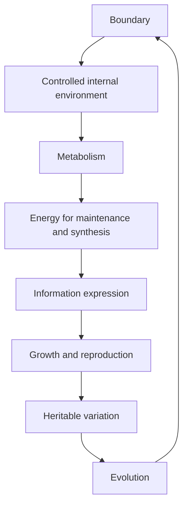

# Sự sống là gì? — What Is Life? (생명이란 무엇인가)

Sau khi có cách tư duy về scale, model, feedback và dòng vật chất–năng lượng–thông tin, ta có thể quay lại câu hỏi trung tâm của Sinh học: **điều gì khiến một hệ vật chất trở thành một hệ sống?**

Câu hỏi này khó hơn tưởng tượng. Một ngọn lửa lấy nhiên liệu, thải sản phẩm và lan rộng. Một tinh thể có thể tăng kích thước. Một virus mang thông tin di truyền và tiến hóa. Một hạt giống khô gần như không trao đổi chất trong thời gian dài nhưng vẫn có thể nảy mầm. Vì vậy không có một dấu hiệu đơn lẻ nào đủ để phân loại mọi trường hợp.

Thay vì tìm một câu định nghĩa ngắn, chương này xây một mental model: **sự sống là một kiểu tổ chức động của vật chất, trong đó một boundary duy trì các quá trình trao đổi chất, lưu trữ và sử dụng thông tin, tự điều chỉnh, sinh sản ở cấp lineage và tham gia vào evolution.**

## 1. Sự sống không phải một chất đặc biệt

Lịch sử khoa học từng có ý tưởng rằng vật sống chứa một “sinh lực” đặc biệt. Modern biology không cần giả thuyết đó. Cơ thể sống được tạo từ cùng loại nguyên tử có trong vật không sống: carbon, hydrogen, oxygen, nitrogen, phosphorus, sulfur và nhiều ion khác.

Điều khác biệt nằm ở **organization**. Carbon trong than và carbon trong DNA vẫn là nguyên tố carbon, nhưng cách các atom được liên kết và cách những molecule đó tham gia vào network reaction hoàn toàn khác.

Một ví dụ dễ hình dung là máy tính. Silicon, copper và plastic tự chúng không “chạy chương trình”. Chức năng xuất hiện khi chúng được tổ chức thành circuit và các state thay đổi theo rule. Sinh vật khác máy tính rất nhiều, nhưng analogy này giúp thấy rằng **property của hệ không thể suy ra chỉ bằng cách liệt kê vật liệu cấu thành**.

## 2. Boundary: muốn có “bên trong”, trước hết phải có ranh giới

Một hệ sống cần duy trì điều kiện bên trong khác với môi trường. Tế bào có nồng độ ion, pH và composition không giống môi trường ngoài. Muốn giữ khác biệt này, cần một **ranh giới (boundary / 경계)**.

Trong tế bào hiện đại, boundary chính là **màng sinh chất (plasma membrane / 세포막)**. Màng không phải bức tường kín. Nếu kín hoàn toàn, tế bào sẽ không lấy được nutrient và không thải waste. Nếu mở hoàn toàn, bên trong và bên ngoài sẽ nhanh chóng cân bằng, làm mất các gradient cần thiết.

Vì vậy sự sống cần một boundary có tính **selective permeability (tính thấm chọn lọc / 선택적 투과성)**: cho phép một số chất qua, cản một số chất khác, và dùng protein để điều khiển exchange.

Ngay từ đây ta thấy một principle lặp lại ở nhiều scale: **sống nghĩa là duy trì một số khác biệt có tổ chức khỏi xu hướng cân bằng tự phát**.

Chương [[../01_cell_biology/00_cells_membranes_and_transport]] sẽ quay lại câu hỏi này ở mức chi tiết hơn.

## 3. Metabolism: boundary thôi chưa đủ

Một túi lipid rỗng có boundary nhưng chưa sống. Hệ sống phải liên tục thực hiện phản ứng hóa học để xây cấu trúc, phân hủy chất, sửa chữa và tạo năng lượng sử dụng được.

Tổng thể những reaction này gọi là **chuyển hóa (metabolism / 대사)**.

Metabolism có hai chiều bổ sung nhau. **Catabolism (dị hóa / 이화작용)** phá molecule phức tạp thành molecule đơn giản hơn và thường giải phóng free energy. **Anabolism (đồng hóa / 동화작용)** dùng energy để xây molecule phức tạp như protein, lipid, nucleic acid.

Nếu chỉ có catabolism, hệ sẽ tự phá nhỏ mình. Nếu chỉ có anabolism, hệ không có nguồn energy và nguyên liệu. Life cần coupling giữa hai phía.

Điều này dẫn tới câu hỏi tiếp theo: năng lượng trong biology thực sự được chuyển bằng cách nào? Câu trả lời sẽ cần chemistry và ATP, được xây ở [[01_chemistry_energy_and_water]] và [[02_biomolecules_enzymes_and_energy]].

## 4. Homeostasis: sống không có nghĩa giữ mọi thứ bất biến

Một cơ thể sống liên tục thay đổi nhưng vẫn giữ nhiều variable trong vùng phù hợp. Đây là **cân bằng nội môi (homeostasis / 항상성)**.

Homeostasis thường bị hiểu sai thành “giữ nguyên”. Chính xác hơn, nó là **dynamic regulation**. Body temperature không đứng yên ở một con số tuyệt đối; glucose blood không cố định; pH có dao động nhỏ. Hệ thống liên tục đo, phản hồi và điều chỉnh để không đi quá xa khỏi vùng hoạt động.

Hãy nghĩ tới cruise control của ô tô. Xe lên dốc thì controller tăng power; xuống dốc thì giảm. Speed vẫn dao động nhẹ, nhưng feedback giữ nó quanh target.

Sinh học dùng logic tương tự ở nhiều nơi: insulin–glucagon điều chỉnh glucose, ventilation điều chỉnh CO₂/pH, kidney điều chỉnh water/ion, plant stomata điều chỉnh gas exchange và water loss.

Homeostasis sẽ trở thành backbone của [[../04_organismal_biology/01_animal_physiology_and_homeostasis]].

## 5. Information: hệ sống phải biết “xây cái gì” và “khi nào làm”

Metabolism cần enzyme. Enzyme là protein. Protein phải được tổng hợp với sequence cụ thể. Điều đó đòi hỏi một hệ lưu trữ và truyền **thông tin sinh học (biological information / 생물학적 정보)**.

Ở hầu hết organism, storage medium chính là DNA. Nhưng DNA không phải bản thiết kế tĩnh cho toàn bộ organism theo nghĩa đơn giản. DNA chứa sequence có thể được transcribe, regulate, recombine và tương tác với môi trường tế bào.

Một gene chỉ có effect khi được **expressed** trong đúng cell, đúng time và đúng amount. Liver cell và neuron trong cùng người có gần như cùng genome nhưng hoạt động rất khác vì gene regulation khác nhau.

Vì vậy information trong biology có ba lớp cần phân biệt:

```text
stored sequence
      ↓
regulated expression
      ↓
functional state of the cell
```

Ta sẽ xây kỹ dòng này ở [[../02_genetics_molecular_biology/00_dna_genes_and_gene_expression]].

## 6. Reproduction: cá thể không cần bất tử, lineage cần tiếp tục

Một organism có thể chết, nhưng life vẫn tiếp tục nếu information và organization được truyền sang thế hệ tiếp theo.

**Sinh sản (reproduction / 생식)** vì thế không chỉ là “tạo thêm cá thể”. Nó là quá trình truyền biological information và tái tạo một hệ có khả năng tiếp tục metabolism, regulation và reproduction.

Có hai chiến lược lớn. **Asexual reproduction (sinh sản vô tính / 무성생식)** tạo offspring gần giống parent về genetic material. **Sexual reproduction (sinh sản hữu tính / 유성생식)** kết hợp genetic material từ hai gamete, làm tăng recombination và variation.

Điểm quan trọng là reproduction tạo cầu nối từ cell biology sang genetics, rồi từ genetics sang evolution.

## 7. Variation và evolution: reproduction luôn đi kèm sai khác

Nếu mọi bản sao hoàn toàn giống nhau mãi mãi, evolutionary change sẽ không xảy ra. Trong thực tế, DNA replication có error rất hiếm nhưng không bằng zero; meiosis tạo recombination; sexual reproduction trộn allele; environment tạo khác biệt phenotype.

Những khác biệt có thể di truyền tạo **biến dị di truyền (genetic variation / 유전적 변이)**.

Trong một population, nếu một variant ảnh hưởng reproductive success, frequency của nó có thể thay đổi qua generation. Đây là nền của **tiến hóa (evolution / 진화)**.

Ta có thể viết relationship lớn:

```text
reproduction
    +
heritable variation
    +
differential reproductive success
    ↓
evolution across generations
```

Evolution không phải một “chương cuối”. Nó giải thích vì sao protein, pathway, anatomy và behavior có cấu trúc hiện tại.

## 8. Cell theory: vì sao tế bào trở thành đơn vị trung tâm?

Modern biology dựa mạnh vào **học thuyết tế bào (cell theory / 세포설)**. Ý tưởng cốt lõi là organism được tạo từ cell, cell là unit cơ bản của life, và cell mới sinh từ cell có trước.

Tại sao cell lại là unit phù hợp?

Vì cell gom được tất cả yêu cầu vừa xây: có boundary, metabolism, information, regulation và machinery để reproduce. Molecule riêng lẻ thường chỉ đáp ứng một phần. Organism đa bào thì lại gồm nhiều cell phối hợp.

Cell vì thế là scale nhỏ nhất mà toàn bộ package của sự sống được tích hợp tương đối đầy đủ.

## 9. Prokaryote và eukaryote: hai cách tổ chức cell

Không phải mọi cell giống nhau.

**Prokaryotic cell (tế bào nhân sơ / 원핵세포)**, như bacteria và archaea, không có nucleus bao bởi membrane. DNA thường nằm ở nucleoid region. Dù cấu trúc gọn hơn, chúng vẫn có metabolism rất đa dạng và evolutionary success khổng lồ.

**Eukaryotic cell (tế bào nhân thực / 진핵세포)** có nucleus và nhiều membrane-bound organelle. Compartmentalization cho phép các reaction khác nhau diễn ra trong microenvironment khác nhau.

Sự khác nhau này không phải “đơn giản vs cao cấp”. Bacteria không phải phiên bản chưa hoàn thiện của animal cell. Chúng là lineage đã tiến hóa độc lập hàng tỷ năm.

## 10. Emergence: multicellular organism không chỉ là nhiều cell cộng lại

Khi nhiều cell cùng tồn tại, chúng có thể specialization. Một neuron tối ưu cho signal transmission. Muscle cell tối ưu cho contraction. Red blood cell tối ưu cho gas transport.

Nhưng specialization tạo dependency: neuron không tự lấy nutrient từ intestine; muscle không tự trao đổi gas với air. Organism đa bào cần tissue, organ và communication system.

Từ đó xuất hiện **tính nổi trội (emergence / 창발)** ở scale organism: circulation, immunity, behavior và cognition không nằm trọn trong một cell riêng lẻ.

Chính vì vậy library sẽ không dừng ở molecular biology. Ta phải đi từ cell → tissue → organ → organism → population → ecosystem.

## 11. Virus nằm ở đâu trong câu hỏi “sống hay không sống?”

Virus là case hữu ích vì nó buộc ta kiểm tra definition.

Virus có genome, mutation và evolution. Nhưng chúng không tự metabolism và không tự reproduce nếu không sử dụng host cell machinery.

Vì vậy tùy definition, virus có thể được đặt ở boundary của life. Quan trọng hơn việc tranh luận “có sống hay không” là nhận ra **các property của life có thể tách rời**. Genome/evolution có thể tồn tại trong entity không tự metabolism.

Điều này nhắc ta rằng “life” là một cluster of properties chứ không nhất thiết một checkbox duy nhất.

## 12. Sự sống và nhiệt động lực học: có mâu thuẫn không?

Organism duy trì organization rất cao. Điều này đôi khi gây hiểu lầm rằng life “chống entropy”. Không phải.

Living system là **open system**: nhận energy/matter và thải heat/waste. Nó có thể giảm disorder cục bộ trong cơ thể bằng cách làm tổng entropy của system + environment tăng.

Ví dụ, cell dùng energy từ nutrient để xây protein có structure cụ thể, nhưng đồng thời respiration thải heat và products ra môi trường.

Vì vậy life không vi phạm thermodynamics. Ngược lại, thermodynamics đặt constraint lên mọi process sống.

## 13. Một mental model thống nhất

Đến đây ta có thể mô tả life bằng một chuỗi liên kết:



Sơ đồ là vòng chứ không phải line đơn giản. Evolution qua nhiều generation định hình membrane, metabolism và information system; những hệ đó lại tạo điều kiện cho reproduction và variation tiếp tục.

> **Mental model:** một organism sống không phải vật thể đứng yên mà là một pattern được duy trì liên tục bằng exchange với environment. Vật chất cấu thành có thể thay dần, nhưng organization và information được giữ đủ ổn định để system tiếp tục hoạt động.

## 14. Tại sao chương tiếp theo phải là Hóa học?

Ta vừa dùng nhiều từ như molecule, membrane, ion, pH, energy, reaction và protein. Nếu không hiểu chúng, mọi chương sau sẽ buộc phải ghi nhớ bằng hình ảnh mơ hồ.

Do đó bước tiếp theo không phải “học organelle”, mà phải xuống một tầng và hỏi:

**Atom liên kết bằng cách nào? Vì sao water có property đặc biệt? Vì sao lipid tự tạo membrane? pH là gì? Chemical reaction có thể tự diễn ra khi nào?**

Những câu hỏi này xây nền vật lý–hóa học để giải thích sự sống thay vì chỉ mô tả nó.

Tiếp tục: [[01_chemistry_energy_and_water]].