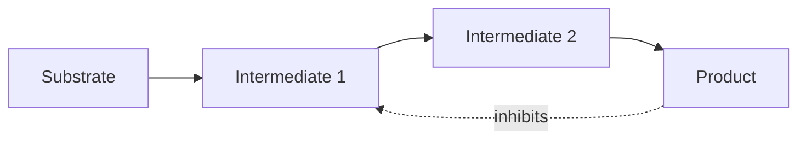

# Biomolecule, Enzyme và Năng lượng tế bào — Biomolecules, Enzymes and Cellular Energy (생체분자, 효소와 세포 에너지)

Chương (chapter) chemistry trước đã cho ta atom, bond, nước (water), pH, năng lượng tự do (free energy), redox và khuếch tán (diffusion). Nhưng cell không được xây từ một hỗn hợp molecule ngẫu nhiên. Life dựa trên một số class molecule có kiến trúc (architecture) đặc biệt và được tổ chức thành network. Đây là bước chuyển từ **chemistry nói chung** sang **biochemistry (hóa sinh / 생화학)**.

Bốn nhóm lớn thường được nhắc tới là carbohydrate, lipid, protein và axit nucleic (nucleic acid). Nhưng mục tiêu ở đây không phải thuộc bốn dòng định nghĩa. Ta sẽ hỏi: mỗi nhóm giải quyết vấn đề gì, structure của nó tạo chức năng (function) ra sao, và chúng liên kết thành một cell như thế nào?

> **Mô hình tư duy (mental model):** biomolecule là “vật liệu và máy móc” của cell; enzyme làm reaction đủ nhanh; ATP và chất mang electron (electron carrier) nối reaction giải phóng energy với reaction cần energy. Không có nhóm nào hoạt động độc lập.

## 1. Monomer và polyme (polymer): vì sao life thích xây molecule lớn từ unit lặp lại?

Nhiều biomolecule được tạo từ unit nhỏ gọi là **monomer (đơn phân / 단량체)** và ghép thành **polyme (đa phân / 중합체)**.

Axit amin (amino acid) ghép thành polypeptide/protein (protein). Nucleotide ghép thành DNA/RNA. Đường đơn (monosaccharide) có thể ghép thành đa đường (polysaccharide).

Kiến trúc modular có hai lợi ích lớn. Thứ nhất, cell chỉ cần một set khối cấu tạo (building block) tương đối nhỏ nhưng có thể tạo rất nhiều sequence. Thứ hai, sequence trở thành một cách mã hóa information. Hai protein có cùng loại axit amin nhưng thứ tự khác có thể có shape và function hoàn toàn khác.

Điều này tương tự software: alphabet ký tự nhỏ có thể tạo vô số source code khác nhau nhờ order.

## 2. Condensation và hydrolysis: xây và tháo polyme

Khi monomer được nối lại, cell thường dùng reaction kiểu **condensation/dehydration**; khi phá polyme, **hydrolysis (thủy phân / 가수분해)** dùng water để cắt bond.

Điều quan trọng là các reaction này trong cell không tự diễn ra với tốc độ hữu ích chỉ vì khả thi về nhiệt động học (thermodynamically possible). Chúng cần enzyme và thường cần ghép năng lượng (energy coupling).

Một protein không tự “mọc” từ axit amin trong cytoplasm. Ribosome, RNA, enzyme và GTP/ATP phối hợp theo sequence encoded trong mRNA.

Ngay từ đây ta thấy matter, energy và thông tin (information) đã gắn với nhau.

## 3. Carbohydrate: không chỉ là “đường để lấy năng lượng”

**Carbohydrate (탄수화물)** gồm đường đơn như glucose và polymer như starch, glycogen, cellulose.

Glucose có thể đi vào đường phân (glycolysis) để cung cấp fuel cho hô hấp tế bào (cellular respiration). Nhưng carbohydrate còn có role structural và nhận dạng (recognition).

**Glycogen** là polymer glucose được động vật dùng làm storage ngắn/trung hạn, đặc biệt ở liver và muscle. Branching nhiều tạo nhiều đầu chain, giúp enzyme thêm hoặc lấy glucose nhanh.

**Starch** là storage polymer phổ biến ở plant. **Cellulose** cũng được tạo từ glucose nhưng bond geometry khác, làm chain thẳng và tạo fiber bền trong thành tế bào (cell wall).

Một thay đổi nhỏ về cách monomer nối nhau tạo material property khác hẳn. Đây là cấu trúc (structure)–chức năng ở quy mô phân tử (molecular scale).

### 3.1 Tại sao con người tiêu hóa starch nhưng không cellulose?

Enzyme digestive của người nhận dạng linkage trong starch nhưng không có cellulase để phá beta linkage của cellulose hiệu quả. Vì vậy cellulose chủ yếu trở thành chất xơ thực phẩm (dietary fiber).

Ruminant như cow giải quyết bài toán bằng microbial symbiont trong gut có enzyme thích hợp. Connection này nối biochemistry với ecology và hệ vi sinh (microbiome).

## 4. Lipid: molecule kỵ nước tạo boundary và storage

“Lipid” không phải một polymer thống nhất như protein. Đây là nhóm molecule có tính hydrophobic đáng kể.

**Triglyceride** gồm glycerol gắn ba axit béo (fatty acid) và là energy storage rất dense. Axit béo giàu C–H bond nên oxidation của chúng có thể cung cấp nhiều energy.

**Phospholipid** có head hydrophilic và tail hydrophobic, vì vậy tự tổ chức thành bilayer trong nước. Đây là nền vật liệu của màng tế bào (cell membrane).

**Steroid** như cholesterol có ring structure. Cholesterol không chỉ là “chất xấu trong máu”; nó là thành phần (component) membrane và precursor của steroid hormone.

### 4.1 Saturated và unsaturated axit béo

Axit béo **saturated** không có C=C double bond trong chain; **unsaturated** có một hoặc nhiều double bond. Cis double bond tạo kink, làm chain khó pack chặt và thường tăng độ lỏng của màng (membrane fluidity).

Cell có thể điều chỉnh lipid composition để membrane không quá cứng hoặc quá lỏng khi nhiệt độ (temperature) đổi. Đây là cân bằng nội môi (homeostasis) ở molecular level.

## 5. Protein: từ sequence tới machine phân tử

**Protein (단백질)** được tạo từ axit amin nối bằng peptide bond. Có khoảng hai mươi axit amin phổ biến trong protein, nhưng mạch bên (side chain) của chúng khác nhau về charge, tính phân cực (polarity), size và reactivity.

Chức năng protein (protein function) không chỉ phụ thuộc sequence mà còn phụ thuộc **gấp cuộn (folding)** thành structure ba chiều.

Ta thường nói bốn level structure:

- primary: amino-acid sequence;
- secondary: local pattern như alpha helix, beta sheet;
- tertiary: overall 3D fold của một polypeptide;
- quaternary: arrangement của nhiều subunit.

Danh sách này chỉ hữu ích nếu hiểu causal chain:

```text
sequence
  ↓
chemical properties của side chain
  ↓
interaction với water và nhau
  ↓
folding
  ↓
3D shape + dynamics
  ↓
function
```

Đột biến (mutation) đổi một axit amin có thể làm chain interaction khác, folding khác và function khác. Genetics vì vậy có thể ảnh hưởng phenotype qua chemistry của protein.

## 6. Protein không phải vật thể cứng

Hình protein trong textbook thường trông như một khối cố định. Thực tế protein liên tục rung, đổi conformation và tương tác với solvent.

Nhiều protein hoạt động bằng **conformational change**. Thụ thể (receptor) đổi shape khi ligand bind. Protein vận động (motor protein) đổi conformation khi hydrolyze ATP. Enzym (enzyme) đóng quanh substrate.

Vì vậy structure–function nên hiểu là **cấu trúc + động lực học (dynamics) → chức năng**.

## 7. Denaturation và protein kiểm soát chất lượng (quality control)

Nhiệt độ, pH hoặc chemical environment có thể phá interaction giữ protein fold, gây **denaturation (biến tính / 변성)**.

Cell có **chaperone protein** hỗ trợ folding và hệ phân giải (degradation) để loại protein hỏng. Nếu misfolded protein tích tụ, tế bào (cell) stress tăng; một số disease liên quan protein aggregation.

Điều này cho thấy maintenance của life không chỉ là tạo molecule mới mà còn quản lý quality của molecule cũ.

## 8. Enzym: làm reaction nhanh mà không đổi hướng thermodynamics

**Enzym (효소)** là catalyst sinh học, phần lớn là protein, một số RNA cũng có catalytic activity.

Reaction cần vượt **năng lượng hoạt hóa (activation energy)**. Enzyme tạo pathway có activation barrier thấp hơn, nhờ vậy tăng tốc độ phản ứng (reaction rate).

Điểm cực kỳ quan trọng:

> Enzyme không làm \(\Delta G\) của reaction favorable hơn, không cung cấp năng lượng tự do, và không đổi equilibrium. Nó chỉ giúp system đạt equilibrium nhanh hơn.

Nếu một reaction endergonic cần energy, cell phải couple nó với reaction favorable như ATP hydrolysis.

## 9. Trung tâm hoạt động (active site) và độ đặc hiệu (specificity)

**Trung tâm hoạt động (활성 부위)** là vùng enzyme bind substrate và thực hiện catalysis. Độ đặc hiệu đến từ shape, charge, hydrophobic interaction và động lực học.

Mô hình (model) “lock and key” hữu ích ban đầu nhưng quá cứng. **Khớp cảm ứng (induced fit)** chính xác hơn trong nhiều trường hợp: cơ chất (substrate) binding làm enzyme thay conformation, đặt catalytic group vào vị trí phù hợp.

Enzyme có thể stabilize transition state, orient substrate, tạo microenvironment acid/base hoặc tạo temporary covalent intermediate.

“Enzyme làm nhanh” vì vậy có mechanism cụ thể, không phải phép màu.

## 10. Động học enzym (enzyme kinetics): tại sao tăng substrate không làm rate tăng mãi?

Một model cơ bản là Michaelis–Menten:

\[
v=\frac{V_{max}[S]}{K_m+[S]}
\]

Ở nồng độ cơ chất (substrate concentration) thấp, tăng \([S]\) làm rate tăng gần tuyến tính. Khi hầu hết trung tâm hoạt động đã occupied, enzyme gần saturation và rate tiến gần \(V_{max}\).

\(K_m\) trong mô hình đơn giản là nồng độ cơ chất khi rate bằng một nửa \(V_{max}\). Nó thường được dùng như thông tin về enzym–cơ chất hành vi (behavior), nhưng không nên luôn đồng nhất máy móc với “affinity” trong mọi mechanism.

Math ở đây giúp ta thấy một hệ thống sinh học (biological system) có ceiling do số enzyme hữu hạn.

## 11. Điều hòa enzyme: metabolism phải có traffic control

Nếu mọi enzyme chạy tối đa cùng lúc, cell sẽ waste resource và tạo incompatible flux.

Enzym được regulation qua nhiều cơ chế: thay substrate, product inhibition, phosphorylation, điều hòa dị lập thể (allosteric regulation), localization và biểu hiện gen (gene expression).

**Điều hòa dị lập thể (조절 부위 조절)** xảy ra khi molecule bind ở vị trí khác trung tâm hoạt động và thay conformation/function của enzyme.

Trong **ức chế phản hồi (feedback inhibition)**, product cuối pathway ức chế enzyme sớm. Khi đủ product, pathway tự giảm flux.



Đây là phản hồi âm (negative feedback) ở quy mô phân tử, cùng logic với insulin ở quy mô sinh vật (organism scale).

## 12. ATP: đồng tiền năng lượng (energy currency) nhưng không phải “kho năng lượng vô hạn”

**ATP — adenosine triphosphate (아데노신 삼인산)** gồm adenine, ribose và ba phosphate.

Hydrolysis thường viết:

\[
ATP+H_2O\rightarrow ADP+P_i
\]

Reaction này có negative free-energy change trong cellular condition. Cell dùng nó để couple với process không favorable.

Nhưng câu “bond phosphate chứa nhiều năng lượng” dễ gây hiểu lầm. Phá bond cần energy; net energy release đến vì products được stabilized tốt hơn reactant qua resonance, hydration và giảm repulsion.

ATP giống currency vì nó là intermediate phổ biến: energy từ chất dinh dưỡng (nutrient)/light được dùng để regenerate ATP, rồi ATP được tiêu cho vận chuyển (transport), synthesis và motion.

Cell không dự trữ ATP cho nhiều ngày. ATP turnover rất nhanh; organism phải liên tục regenerate nó.

## 13. Ghép năng lượng: làm sao ATP drive reaction khác?

Giả sử reaction A có \(\Delta G>0\) và không favorable. Nếu enzyme couple reaction A với ATP hydrolysis có \(\Delta G\) âm đủ lớn, tổng:

\[
\Delta G_{total}=\Delta G_A+\Delta G_{ATP}
\]

có thể trở nên âm.

Coupling thường không phải chỉ “đặt hai reaction cạnh nhau”. Enzyme transfer phosphate hoặc tạo intermediate để chemical pathway thực sự nối với nhau.

Đây là cách cell biến năng lượng tự do thành work cụ thể.

## 14. NADH, FADH₂ và chất mang electron

ATP không phải carrier duy nhất. **NAD⁺/NADH** và **FAD/FADH₂** mang high-energy electron.

Trong dị hóa (catabolism), fuel molecule bị oxidized và electron được transfer sang NAD⁺ tạo NADH. NADH sau đó đưa electron tới chuỗi chuyền electron (electron transport chain).

Tách energy thành chất mang electron giúp cell không release toàn bộ energy của glucose trong một bước.

Ta có thể hình dung:

```text
fuel
 ↓ oxidation
NADH/FADH2
 ↓ electron transport
proton gradient
 ↓ ATP synthase
ATP
 ↓
cellular work
```

Đây là bridge trực tiếp sang respiration.

## 15. Axit nucleic: polymer có sequence làm information

**Nucleotit (nucleotide) (뉴클레오타이드)** gồm sugar, phosphate và nitrogenous base. Nucleotide nối thành axit nucleic.

DNA dùng deoxyribose và bases A, T, G, C. RNA dùng ribose và thường có U thay T.

Điều đặc biệt là **trình tự (sequence)** của base có thể mang information. Complementary pairing cho phép một strand làm template để copy strand khác.

Ở đây chemistry tạo ra đặc tính (property) thông tin (information). Không có “thông tin” tách khỏi vật chất; sequence là arrangement vật lý của base.

## 16. DNA và RNA khác nhau vì chemistry khác nhau

DNA thường ổn định hơn RNA một phần vì deoxyribose thiếu 2′-OH, làm backbone ít susceptible với hydrolysis hơn. DNA double strand và repair system phù hợp lưu trữ dài hạn (long-term storage).

RNA linh động hơn: có thể làm messenger, adapter, structural molecule, regulator và chất xúc tác (catalyst).

Điều này phù hợp với phân công chức năng (division of labor): DNA thiên về archive; RNA thiên về bản sao làm việc (working copy) và functional intermediate.

## 17. Nhận dạng phân tử (molecular recognition): làm sao phân tử (molecule) “nhận ra” nhau?

Enzym–cơ chất (substrate), thụ thể–ligand, kháng thể (antibody)–antigen và DNA base pairing đều phụ thuộc **nhận dạng phân tử**.

Không có ý thức ở molecular level. Recognition xuất hiện vì shape, charge, liên kết hydro (hydrogen bond), hydrophobic surface và dynamics tạo binding favorable hơn cho một số partner.

Specificity thường là tương đối, không tuyệt đối. Drug có thể bind off-target protein; enzym đôi khi nhận substrate tương tự. Đây là nguồn của side effect và metabolic cross-reactivity.

## 18. Compartmentalization: cùng chemistry nhưng khác location tạo outcome khác

Một reaction có thể có enzyme và substrate nhưng vẫn bị regulation bằng cách đặt chúng ở compartment khác nhau.

Trong eukaryotic cell, fatty-acid oxidation chủ yếu ở mitochondria/peroxisome; DNA replication ở nucleus; protein secretion đi qua ER/Golgi; lysosome chứa hydrolase trong environment acid.

Location trở thành một layer của regulation.

Đây là lý do chapter tiếp theo phải học organelle, không thể chỉ học molecule.

## 19. Một ví dụ tích hợp: từ miếng bánh mì tới ATP

Starch trong bánh mì được digestive enzyme cắt thành glucose. Glucose đi vào bloodstream rồi vào tế bào qua transporter.

Trong cytoplasm, đường phân chuyển glucose thành pyruvate và tạo một ít ATP/NADH. Trong mitochondria, carbon tiếp tục bị oxidized; electron đi vào carrier; chuỗi chuyền electron tạo chênh lệch proton (proton gradient); ATP synthase (ATP synthase) dùng gradient để tạo ATP.

ATP sau đó có thể drive co cơ (muscle contraction), ion pump hoặc tổng hợp protein (protein synthesis).

Nếu ta chỉ nói “carbohydrate cung cấp năng lượng”, ta bỏ mất toàn bộ cơ chế (mechanism). Thực tế là một chain matter–electron–chênh lệch (gradient)–ATP–work.

## 20. Một ví dụ tích hợp khác: mutation có thể ảnh hưởng protein ra sao?

DNA sequence thay đổi một nucleotide. Nếu thay đổi nằm trong coding region, codon có thể đổi. Axit amin được đưa vào protein có thể đổi. Side-chain property khác làm folding hoặc trung tâm hoạt động khác. Enzym (enzyme) hoạt động (activity) đổi. Dòng chuyển hóa (metabolic flux) đổi. Tế bào phenotype và sinh vật (organism) phenotype có thể đổi.

Chuỗi này nối chemistry với genetics:

```text
DNA sequence
→ amino-acid sequence
→ molecular interaction
→ protein structure/dynamics
→ function
→ cell behavior
→ phenotype
```

Không phải mutation nào cũng có effect, nhưng khi effect xuất hiện, molecular mechanism thường đi qua chain kiểu này.

## 21. Các hiểu lầm phổ biến (common misconceptions)

“Carbohydrate chỉ để lấy energy” sai vì chúng còn làm structure và nhận dạng.

“Fat là chất không cần thiết” sai vì lipid tạo màng (membrane), hoóc-môn (hormone) precursor và energy storage.

“Protein chỉ là cơ bắp” sai vì enzym, thụ thể, kháng thể, channel, motor và yếu tố phiên mã (transcription factor) đều là protein.

“DNA tự điều khiển cell” sai vì DNA cần protein/RNA machinery và cellular context.

“ATP là energy itself” không chính xác. ATP là molecule tham gia transfer năng lượng tự do qua reaction coupling.

“Enzyme càng nhiều thì reaction tăng vô hạn” sai vì cơ chất, product, cofactor và regulation cũng giới hạn flux.

## 22. Từ molecule sang cell: tại sao phải có membrane và organelle?

Sau chapter này, ta đã có material: carbohydrate, lipid, protein, axit nucleic; có chất xúc tác: enzym; có energy intermediate: ATP/NADH; có principle regulation.

Nhưng một túi biomolecule chưa phải cell. Chúng cần được **đặt vào architecture có ranh giới (boundary)**, giữ concentration phù hợp, tạo chênh lệch, phân chia compartment và điều phối transport.

Đó chính là điểm bắt đầu của [Tế bào, màng và vận chuyển](../01_cell_biology/00_cells_membranes_and_transport.md). Sau khi cấu trúc tế bào được dựng, [Chuyển hóa, Hô hấp tế bào và Quang hợp](../01_cell_biology/01_metabolism_respiration_photosynthesis.md) sẽ cho thấy network reaction thực sự chạy như thế nào; [Truyền tín hiệu và Chu kỳ tế bào](../01_cell_biology/02_cell_signaling_and_cell_cycle.md) sẽ giải thích cell điều khiển network đó và quyết định khi nào phân chia (division).

> **Mô hình tư duy cuối chapter:** biomolecule không phải bốn danh mục để học thuộc. Chúng là những lớp vật liệu phối hợp: lipid tạo ranh giới, protein thực hiện phần lớn work, carbohydrate cung cấp/giữ carbon và năng lượng (energy), axit nucleic lưu/triển khai information; enzym, ATP và chất mang electron nối chúng thành một hệ động có thể trở thành cell.

<!-- depth-audit-2026:enzyme-control -->
## Từ cấu trúc enzym đến tốc độ, điều hòa và failure

Một enzym không chỉ “làm phản ứng nhanh hơn”. Cấu trúc ba chiều tạo **trung tâm hoạt động (active site)** có hình học, điện tích và độ linh động phù hợp để ổn định trạng thái chuyển tiếp. Vì vậy thay một amino acid ở vị trí xa active site vẫn có thể đổi hoạt tính nếu nó làm protein gấp cuộn khác, thay chuyển động miền (domain motion) hoặc phá tương tác allosteric.

Với nhiều enzym đơn giản, tốc độ ban đầu được mô tả gần đúng bằng phương trình Michaelis–Menten:

\[
v_0=\frac{V_{max}[S]}{K_m+[S]},\qquad V_{max}=k_{cat}[E]_T
\]

\(k_{cat}\) cho biết một phân tử enzym có thể xử lý bao nhiêu cơ chất mỗi đơn vị thời gian khi bão hòa. \(K_m\) là tham số động học; trong một số điều kiện nó gần trực giác về ái lực nhưng không nên đồng nhất máy móc với hằng số liên kết. Khi cơ chất thấp, tỉ số \(k_{cat}/K_m\) hữu ích để mô tả **hiệu suất xúc tác (catalytic efficiency)**.

Regulation thường nằm ở chính cấu trúc. **Điều hòa dị lập thể (allostery)** cho phép phân tử gắn ở vị trí khác active site đổi trạng thái cấu dạng và do đó đổi hoạt tính. Ở protein nhiều tiểu đơn vị, **tính hiệp đồng (cooperativity)** có thể tạo đáp ứng dạng ngưỡng thay vì tuyến tính. Đây là lý do một pathway có thể chuyển nhanh giữa trạng thái thấp và cao mà không cần thay số lượng enzym ngay lập tức.

Failure cũng đi theo structure → mechanism. Nhiệt, pH, oxy hóa hoặc mutation có thể làm protein mất cấu trúc; hệ chaperone, proteasome và autophagy giúp duy trì **cân bằng protein (proteostasis)**. Nếu tốc độ hỏng vượt khả năng sửa và loại bỏ, aggregate tích tụ và chức năng mạng lưới giảm. Evolution vì vậy không chỉ tối ưu active site; nó còn chịu áp lực giữ protein đủ ổn định, đủ linh động và đủ dễ điều hòa trong môi trường thật.

---

<!-- biology-learning-navigation -->
**Điều hướng học:** [← Hóa học của sự sống](01_chemistry_energy_and_water.md) · [Mục lục Biology](../README.md) · [Nguồn gốc sự sống và tiến hóa sớm →](03_origin_of_life_and_early_evolution.md)
