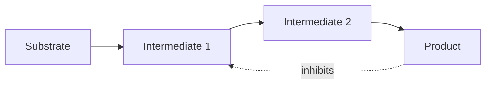

# Biomolecule, Enzyme và Năng lượng tế bào — Biomolecules, Enzymes and Cellular Energy (생체분자, 효소와 세포 에너지)

Chapter chemistry trước đã cho ta atom, bond, water, pH, free energy, redox và diffusion. Nhưng cell không được xây từ một hỗn hợp molecule ngẫu nhiên. Life dựa trên một số class molecule có architecture đặc biệt và được tổ chức thành network. Đây là bước chuyển từ **chemistry nói chung** sang **biochemistry (hóa sinh / 생화학)**.

Bốn nhóm lớn thường được nhắc tới là carbohydrate, lipid, protein và nucleic acid. Nhưng mục tiêu ở đây không phải thuộc bốn dòng định nghĩa. Ta sẽ hỏi: mỗi nhóm giải quyết vấn đề gì, structure của nó tạo function ra sao, và chúng liên kết thành một cell như thế nào?

> **Mental model:** biomolecule là “vật liệu và máy móc” của cell; enzyme làm reaction đủ nhanh; ATP và electron carrier nối reaction giải phóng energy với reaction cần energy. Không có nhóm nào hoạt động độc lập.

## 1. Monomer và polymer: vì sao life thích xây molecule lớn từ unit lặp lại?

Nhiều biomolecule được tạo từ unit nhỏ gọi là **monomer (đơn phân / 단량체)** và ghép thành **polymer (đa phân / 중합체)**.

Amino acid ghép thành polypeptide/protein. Nucleotide ghép thành DNA/RNA. Monosaccharide có thể ghép thành polysaccharide.

Kiến trúc modular có hai lợi ích lớn. Thứ nhất, cell chỉ cần một set building block tương đối nhỏ nhưng có thể tạo rất nhiều sequence. Thứ hai, sequence trở thành một cách mã hóa information. Hai protein có cùng loại amino acid nhưng thứ tự khác có thể có shape và function hoàn toàn khác.

Điều này tương tự software: alphabet ký tự nhỏ có thể tạo vô số source code khác nhau nhờ order.

## 2. Condensation và hydrolysis: xây và tháo polymer

Khi monomer được nối lại, cell thường dùng reaction kiểu **condensation/dehydration**; khi phá polymer, **hydrolysis (thủy phân / 가수분해)** dùng water để cắt bond.

Điều quan trọng là các reaction này trong cell không tự diễn ra với tốc độ hữu ích chỉ vì thermodynamically possible. Chúng cần enzyme và thường cần energy coupling.

Một protein không tự “mọc” từ amino acid trong cytoplasm. Ribosome, RNA, enzyme và GTP/ATP phối hợp theo sequence encoded trong mRNA.

Ngay từ đây ta thấy matter, energy và information đã gắn với nhau.

## 3. Carbohydrate: không chỉ là “đường để lấy năng lượng”

**Carbohydrate (탄수화물)** gồm monosaccharide như glucose và polymer như starch, glycogen, cellulose.

Glucose có thể đi vào glycolysis để cung cấp fuel cho cellular respiration. Nhưng carbohydrate còn có role structural và recognition.

**Glycogen** là polymer glucose được động vật dùng làm storage ngắn/trung hạn, đặc biệt ở liver và muscle. Branching nhiều tạo nhiều đầu chain, giúp enzyme thêm hoặc lấy glucose nhanh.

**Starch** là storage polymer phổ biến ở plant. **Cellulose** cũng được tạo từ glucose nhưng bond geometry khác, làm chain thẳng và tạo fiber bền trong cell wall.

Một thay đổi nhỏ về cách monomer nối nhau tạo material property khác hẳn. Đây là structure–function ở molecular scale.

### 3.1 Tại sao con người tiêu hóa starch nhưng không cellulose?

Enzyme digestive của người nhận dạng linkage trong starch nhưng không có cellulase để phá beta linkage của cellulose hiệu quả. Vì vậy cellulose chủ yếu trở thành dietary fiber.

Ruminant như cow giải quyết bài toán bằng microbial symbiont trong gut có enzyme thích hợp. Connection này nối biochemistry với ecology và microbiome.

## 4. Lipid: molecule kỵ nước tạo boundary và storage

“Lipid” không phải một polymer thống nhất như protein. Đây là nhóm molecule có tính hydrophobic đáng kể.

**Triglyceride** gồm glycerol gắn ba fatty acid và là energy storage rất dense. Fatty acid giàu C–H bond nên oxidation của chúng có thể cung cấp nhiều energy.

**Phospholipid** có head hydrophilic và tail hydrophobic, vì vậy tự tổ chức thành bilayer trong water. Đây là nền vật liệu của cell membrane.

**Steroid** như cholesterol có ring structure. Cholesterol không chỉ là “chất xấu trong máu”; nó là component membrane và precursor của steroid hormone.

### 4.1 Saturated và unsaturated fatty acid

Fatty acid **saturated** không có C=C double bond trong chain; **unsaturated** có một hoặc nhiều double bond. Cis double bond tạo kink, làm chain khó pack chặt và thường tăng membrane fluidity.

Cell có thể điều chỉnh lipid composition để membrane không quá cứng hoặc quá lỏng khi temperature đổi. Đây là homeostasis ở molecular level.

## 5. Protein: từ sequence tới machine phân tử

**Protein (단백질)** được tạo từ amino acid nối bằng peptide bond. Có khoảng hai mươi amino acid phổ biến trong protein, nhưng side chain của chúng khác nhau về charge, polarity, size và reactivity.

Protein function không chỉ phụ thuộc sequence mà còn phụ thuộc **folding** thành structure ba chiều.

Ta thường nói bốn level structure:

- primary: amino-acid sequence;
- secondary: local pattern như alpha helix, beta sheet;
- tertiary: overall 3D fold của một polypeptide;
- quaternary: arrangement của nhiều subunit.

Danh sách này chỉ hữu ích nếu hiểu causal chain:

```text
sequence
  ↓
chemical properties của side chain
  ↓
interaction với water và nhau
  ↓
folding
  ↓
3D shape + dynamics
  ↓
function
```

Mutation đổi một amino acid có thể làm chain interaction khác, folding khác và function khác. Genetics vì vậy có thể ảnh hưởng phenotype qua chemistry của protein.

## 6. Protein không phải vật thể cứng

Hình protein trong textbook thường trông như một khối cố định. Thực tế protein liên tục rung, đổi conformation và tương tác với solvent.

Nhiều protein hoạt động bằng **conformational change**. Receptor đổi shape khi ligand bind. Motor protein đổi conformation khi hydrolyze ATP. Enzyme đóng quanh substrate.

Vì vậy structure–function nên hiểu là **structure + dynamics → function**.

## 7. Denaturation và protein quality control

Temperature, pH hoặc chemical environment có thể phá interaction giữ protein fold, gây **denaturation (biến tính / 변성)**.

Cell có **chaperone protein** hỗ trợ folding và hệ degradation để loại protein hỏng. Nếu misfolded protein tích tụ, cell stress tăng; một số disease liên quan protein aggregation.

Điều này cho thấy maintenance của life không chỉ là tạo molecule mới mà còn quản lý quality của molecule cũ.

## 8. Enzyme: làm reaction nhanh mà không đổi hướng thermodynamics

**Enzyme (효소)** là catalyst sinh học, phần lớn là protein, một số RNA cũng có catalytic activity.

Reaction cần vượt **activation energy**. Enzyme tạo pathway có activation barrier thấp hơn, nhờ vậy tăng reaction rate.

Điểm cực kỳ quan trọng:

> Enzyme không làm \(\Delta G\) của reaction favorable hơn, không cung cấp free energy, và không đổi equilibrium. Nó chỉ giúp system đạt equilibrium nhanh hơn.

Nếu một reaction endergonic cần energy, cell phải couple nó với reaction favorable như ATP hydrolysis.

## 9. Active site và specificity

**Active site (활성 부위)** là vùng enzyme bind substrate và thực hiện catalysis. Specificity đến từ shape, charge, hydrophobic interaction và dynamics.

Model “lock and key” hữu ích ban đầu nhưng quá cứng. **Induced fit** chính xác hơn trong nhiều trường hợp: substrate binding làm enzyme thay conformation, đặt catalytic group vào vị trí phù hợp.

Enzyme có thể stabilize transition state, orient substrate, tạo microenvironment acid/base hoặc tạo temporary covalent intermediate.

“Enzyme làm nhanh” vì vậy có mechanism cụ thể, không phải phép màu.

## 10. Enzyme kinetics: tại sao tăng substrate không làm rate tăng mãi?

Một model cơ bản là Michaelis–Menten:

\[
v=\frac{V_{max}[S]}{K_m+[S]}
\]

Ở substrate concentration thấp, tăng \([S]\) làm rate tăng gần tuyến tính. Khi hầu hết active site đã occupied, enzyme gần saturation và rate tiến gần \(V_{max}\).

\(K_m\) trong model đơn giản là substrate concentration khi rate bằng một nửa \(V_{max}\). Nó thường được dùng như thông tin về enzyme–substrate behavior, nhưng không nên luôn đồng nhất máy móc với “affinity” trong mọi mechanism.

Math ở đây giúp ta thấy một biological system có ceiling do số enzyme hữu hạn.

## 11. Điều hòa enzyme: metabolism phải có traffic control

Nếu mọi enzyme chạy tối đa cùng lúc, cell sẽ waste resource và tạo incompatible flux.

Enzyme được regulation qua nhiều cơ chế: thay substrate, product inhibition, phosphorylation, allosteric regulation, localization và gene expression.

**Allosteric regulation (조절 부위 조절)** xảy ra khi molecule bind ở vị trí khác active site và thay conformation/function của enzyme.

Trong **feedback inhibition**, product cuối pathway ức chế enzyme sớm. Khi đủ product, pathway tự giảm flux.



Đây là negative feedback ở molecular scale, cùng logic với insulin ở organism scale.

## 12. ATP: energy currency nhưng không phải “kho năng lượng vô hạn”

**ATP — adenosine triphosphate (아데노신 삼인산)** gồm adenine, ribose và ba phosphate.

Hydrolysis thường viết:

\[
ATP+H_2O\rightarrow ADP+P_i
\]

Reaction này có negative free-energy change trong cellular condition. Cell dùng nó để couple với process không favorable.

Nhưng câu “bond phosphate chứa nhiều năng lượng” dễ gây hiểu lầm. Phá bond cần energy; net energy release đến vì products được stabilized tốt hơn reactant qua resonance, hydration và giảm repulsion.

ATP giống currency vì nó là intermediate phổ biến: energy từ nutrient/light được dùng để regenerate ATP, rồi ATP được tiêu cho transport, synthesis và motion.

Cell không dự trữ ATP cho nhiều ngày. ATP turnover rất nhanh; organism phải liên tục regenerate nó.

## 13. Energy coupling: làm sao ATP drive reaction khác?

Giả sử reaction A có \(\Delta G>0\) và không favorable. Nếu enzyme couple reaction A với ATP hydrolysis có \(\Delta G\) âm đủ lớn, tổng:

\[
\Delta G_{total}=\Delta G_A+\Delta G_{ATP}
\]

có thể trở nên âm.

Coupling thường không phải chỉ “đặt hai reaction cạnh nhau”. Enzyme transfer phosphate hoặc tạo intermediate để chemical pathway thực sự nối với nhau.

Đây là cách cell biến free energy thành work cụ thể.

## 14. NADH, FADH₂ và electron carrier

ATP không phải carrier duy nhất. **NAD⁺/NADH** và **FAD/FADH₂** mang high-energy electron.

Trong catabolism, fuel molecule bị oxidized và electron được transfer sang NAD⁺ tạo NADH. NADH sau đó đưa electron tới electron transport chain.

Tách energy thành electron carrier giúp cell không release toàn bộ energy của glucose trong một bước.

Ta có thể hình dung:

```text
fuel
 ↓ oxidation
NADH/FADH2
 ↓ electron transport
proton gradient
 ↓ ATP synthase
ATP
 ↓
cellular work
```

Đây là bridge trực tiếp sang respiration.

## 15. Nucleic acid: polymer có sequence làm information

**Nucleotide (뉴클레오타이드)** gồm sugar, phosphate và nitrogenous base. Nucleotide nối thành nucleic acid.

DNA dùng deoxyribose và bases A, T, G, C. RNA dùng ribose và thường có U thay T.

Điều đặc biệt là **sequence** của base có thể mang information. Complementary pairing cho phép một strand làm template để copy strand khác.

Ở đây chemistry tạo ra property information. Không có “information” tách khỏi vật chất; sequence là arrangement vật lý của base.

## 16. DNA và RNA khác nhau vì chemistry khác nhau

DNA thường ổn định hơn RNA một phần vì deoxyribose thiếu 2′-OH, làm backbone ít susceptible với hydrolysis hơn. DNA double strand và repair system phù hợp long-term storage.

RNA linh động hơn: có thể làm messenger, adapter, structural molecule, regulator và catalyst.

Điều này phù hợp với division of labor: DNA thiên về archive; RNA thiên về working copy và functional intermediate.

## 17. Molecular recognition: làm sao molecule “nhận ra” nhau?

Enzyme–substrate, receptor–ligand, antibody–antigen và DNA base pairing đều phụ thuộc **molecular recognition**.

Không có ý thức ở molecular level. Recognition xuất hiện vì shape, charge, hydrogen bond, hydrophobic surface và dynamics tạo binding favorable hơn cho một số partner.

Specificity thường là tương đối, không tuyệt đối. Drug có thể bind off-target protein; enzyme đôi khi nhận substrate tương tự. Đây là nguồn của side effect và metabolic cross-reactivity.

## 18. Compartmentalization: cùng chemistry nhưng khác location tạo outcome khác

Một reaction có thể có enzyme và substrate nhưng vẫn bị regulation bằng cách đặt chúng ở compartment khác nhau.

Trong eukaryotic cell, fatty-acid oxidation chủ yếu ở mitochondria/peroxisome; DNA replication ở nucleus; protein secretion đi qua ER/Golgi; lysosome chứa hydrolase trong environment acid.

Location trở thành một layer của regulation.

Đây là lý do chapter tiếp theo phải học organelle, không thể chỉ học molecule.

## 19. Một ví dụ tích hợp: từ miếng bánh mì tới ATP

Starch trong bánh mì được digestive enzyme cắt thành glucose. Glucose đi vào bloodstream rồi vào cell qua transporter.

Trong cytoplasm, glycolysis chuyển glucose thành pyruvate và tạo một ít ATP/NADH. Trong mitochondria, carbon tiếp tục bị oxidized; electron đi vào carrier; electron transport chain tạo proton gradient; ATP synthase dùng gradient để tạo ATP.

ATP sau đó có thể drive muscle contraction, ion pump hoặc protein synthesis.

Nếu ta chỉ nói “carbohydrate cung cấp năng lượng”, ta bỏ mất toàn bộ mechanism. Thực tế là một chain matter–electron–gradient–ATP–work.

## 20. Một ví dụ tích hợp khác: mutation có thể ảnh hưởng protein ra sao?

DNA sequence thay đổi một nucleotide. Nếu thay đổi nằm trong coding region, codon có thể đổi. Amino acid được đưa vào protein có thể đổi. Side-chain property khác làm folding hoặc active site khác. Enzyme activity đổi. Metabolic flux đổi. Cell phenotype và organism phenotype có thể đổi.

Chuỗi này nối chemistry với genetics:

```text
DNA sequence
→ amino-acid sequence
→ molecular interaction
→ protein structure/dynamics
→ function
→ cell behavior
→ phenotype
```

Không phải mutation nào cũng có effect, nhưng khi effect xuất hiện, molecular mechanism thường đi qua chain kiểu này.

## 21. Common misconceptions

“Carbohydrate chỉ để lấy energy” sai vì chúng còn làm structure và recognition.

“Fat là chất không cần thiết” sai vì lipid tạo membrane, hormone precursor và energy storage.

“Protein chỉ là cơ bắp” sai vì enzyme, receptor, antibody, channel, motor và transcription factor đều là protein.

“DNA tự điều khiển cell” sai vì DNA cần protein/RNA machinery và cellular context.

“ATP là energy itself” không chính xác. ATP là molecule tham gia transfer free energy qua reaction coupling.

“Enzyme càng nhiều thì reaction tăng vô hạn” sai vì substrate, product, cofactor và regulation cũng giới hạn flux.

## 22. Từ molecule sang cell: tại sao phải có membrane và organelle?

Sau chapter này, ta đã có material: carbohydrate, lipid, protein, nucleic acid; có catalyst: enzyme; có energy intermediate: ATP/NADH; có principle regulation.

Nhưng một túi biomolecule chưa phải cell. Chúng cần được **đặt vào architecture có boundary**, giữ concentration phù hợp, tạo gradient, phân chia compartment và điều phối transport.

Đó chính là điểm bắt đầu của [[../01_cell_biology/00_cells_membranes_and_transport]]. Sau khi structure cell được dựng, [[../01_cell_biology/01_metabolism_respiration_photosynthesis]] sẽ cho thấy network reaction thực sự chạy như thế nào; [[../01_cell_biology/02_cell_signaling_and_cell_cycle]] sẽ giải thích cell điều khiển network đó và quyết định khi nào division.

> **Mental model cuối chapter:** biomolecule không phải bốn danh mục để học thuộc. Chúng là những lớp vật liệu phối hợp: lipid tạo boundary, protein thực hiện phần lớn work, carbohydrate cung cấp/giữ carbon và energy, nucleic acid lưu/triển khai information; enzyme, ATP và electron carrier nối chúng thành một hệ động có thể trở thành cell.