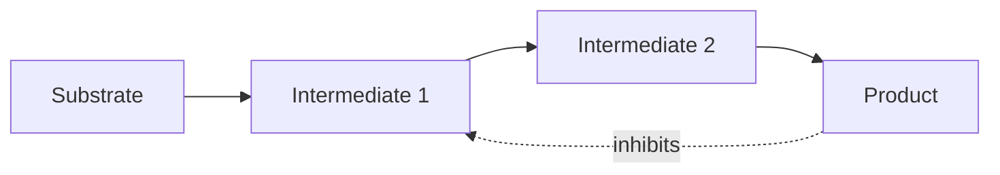

# Biomolecule, Enzyme và Năng lượng tế bào — Biomolecules, Enzymes and Cellular năng lượng (energy / 에너지)

> **Mạch đọc:** [README](../README.md) là bản đồ owner của **Biomolecule, Enzyme và Năng lượng tế bào — Biomolecules, Enzymes and Cellular năng lượng (energy / 에너지)**; nhìn vào vị trí đó trước để biết file này đang phục vụ nhánh kiến thức nào. **1. Monomer và polyme (polymer): vì sao life thích xây molecule lớn từ đơn vị (unit / 단위) lặp lại?** mở đối tượng chính của file và câu hỏi cần theo dõi; sau đó sang **2. Condensation và hydrolysis: xây và tháo polyme** để mở rộng đối tượng sang phạm vi kế cận. Cách đi này giữ lại điểm tựa của section đầu và cho biết kết luận sẽ được dùng ở đâu, thay vì dừng ở định nghĩa đầu tiên.

Chương (chapter) chemistry trước đã cho ta atom, bond, nước (water), pH, năng lượng tự do (free energy), redox và khuếch tán (diffusion). Nhưng cell không được xây từ một hỗn hợp molecule ngẫu nhiên. Life dựa trên một số lớp (class / 클래스) molecule có kiến trúc (architecture / 아키텍처) đặc biệt và được tổ chức thành mạng (network / 네트워크). Đây là bước chuyển từ **chemistry nói chung** sang **biochemistry (hóa sinh / 생화학)**.

Bốn nhóm lớn thường được nhắc tới là carbohydrate, lipid, protein và axit nucleic (nucleic acid). Nhưng mục tiêu ở đây không phải thuộc bốn dòng định nghĩa. Ta sẽ hỏi: mỗi nhóm giải quyết vấn đề gì, cấu trúc (structure / 구조) của nó tạo chức năng (function) ra sao, và chúng liên kết thành một cell như thế nào?

> **mô hình tư duy (mental model / 사고 모델):** biomolecule là “vật liệu và máy móc” của cell; enzyme làm reaction đủ nhanh; ATP và chất mang electron (electron carrier) nối reaction giải phóng năng lượng (energy / 에너지) với reaction cần năng lượng (energy / 에너지). Không có nhóm nào hoạt động độc lập.

## 1. Monomer và polyme (polymer): vì sao life thích xây molecule lớn từ đơn vị (unit / 단위) lặp lại?

Nhiều biomolecule được tạo từ đơn vị (unit / 단위) nhỏ gọi là **monomer (đơn phân / 단량체)** và ghép thành **polyme (đa phân / 중합체)**.

Axit amin (amino acid) ghép thành polypeptide/protein (protein). Nucleotide ghép thành DNA/RNA. Đường đơn (monosaccharide) có thể ghép thành đa đường (polysaccharide).

Kiến trúc modular có hai lợi ích lớn. Thứ nhất, cell chỉ cần một set khối cấu tạo (building block) tương đối nhỏ nhưng có thể tạo rất nhiều chuỗi (sequence / 시퀀스). Thứ hai, chuỗi (sequence / 시퀀스) trở thành một cách mã hóa thông tin (information / 정보). Hai protein có cùng loại axit amin nhưng thứ tự khác có thể có shape và hàm (function / 함수) hoàn toàn khác.

Điều này tương tự software: alphabet ký tự nhỏ có thể tạo vô số mã nguồn (source code / 소스 코드) khác nhau nhờ thứ tự (order / 순서).

> **Chuyển mạch:** Trong **Biomolecule, Enzyme và Năng lượng tế bào — Biomolecules, Enzymes and Cellular năng lượng (energy / 에너지)**, **2. Condensation và hydrolysis: xây và tháo polyme** tiếp nhận điểm tựa từ **1. Monomer và polyme (polymer): vì sao life thích xây molecule lớn từ đơn vị (unit / 단위) lặp lại?** nhưng đổi góc nhìn sang câu hỏi của chính nó; đọc liền hai mục để thấy mối quan hệ đó. Từ đây, **3. Carbohydrate: không chỉ là “đường để lấy năng lượng”** sẽ cho biết hệ quả hoặc giới hạn ấy hiện ra ở đâu.

## 2. Condensation và hydrolysis: xây và tháo polyme

Khi monomer được nối lại, cell thường dùng reaction kiểu **condensation/dehydration**; khi phá polyme, **hydrolysis (thủy phân / 가수분해)** dùng water để cắt bond.

Điều quan trọng là các reaction này trong cell không tự diễn ra với tốc độ hữu ích chỉ vì khả thi về nhiệt động học (thermodynamically possible). Chúng cần enzyme và thường cần ghép năng lượng (energy coupling).

Một protein không tự “mọc” từ axit amin trong cytoplasm. Ribosome, RNA, enzyme và GTP/ATP phối hợp theo chuỗi (sequence / 시퀀스) encoded trong mRNA.

Ngay từ đây ta thấy matter, năng lượng (energy / 에너지) và thông tin (information / 정보) đã gắn với nhau.

> **Chuyển mạch:** Ở chặng này của **Biomolecule, Enzyme và Năng lượng tế bào — Biomolecules, Enzymes and Cellular năng lượng (energy / 에너지)**, **3. Carbohydrate: không chỉ là “đường để lấy năng lượng”** tiếp nhận điểm tựa từ **2. Condensation và hydrolysis: xây và tháo polyme** nhưng đổi góc nhìn sang câu hỏi của chính nó; đọc liền hai mục để thấy mối quan hệ đó. Từ đây, **4. Lipid: molecule kỵ nước tạo ranh giới (boundary / 경계) và lưu trữ (storage / 저장소)** sẽ cho biết hệ quả hoặc giới hạn ấy hiện ra ở đâu.

## 3. Carbohydrate: không chỉ là “đường để lấy năng lượng”

**Carbohydrate (탄수화물)** gồm đường đơn như glucose và polymer như starch, glycogen, cellulose.

Glucose có thể đi vào đường phân (glycolysis) để cung cấp fuel cho hô hấp tế bào (cellular respiration). Nhưng carbohydrate còn có role structural và nhận dạng (recognition).

**Glycogen** là polymer glucose được động vật dùng làm lưu trữ (storage / 저장소) ngắn/trung hạn, đặc biệt ở liver và muscle. Branching nhiều tạo nhiều đầu chuỗi (chain / 사슬), giúp enzyme thêm hoặc lấy glucose nhanh.

**Starch** là lưu trữ (storage / 저장소) polymer phổ biến ở plant. **Cellulose** cũng được tạo từ glucose nhưng bond hình học (geometry / 기하학) khác, làm chuỗi (chain / 사슬) thẳng và tạo fiber bền trong thành tế bào (cell wall).

Một thay đổi nhỏ về cách monomer nối nhau tạo material thuộc tính (property / 속성) khác hẳn. Đây là cấu trúc (structure / 구조)–chức năng ở quy mô phân tử (molecular scale).

### 3.1 Tại sao con người tiêu hóa starch nhưng không cellulose?

Enzyme digestive của người nhận dạng linkage trong starch nhưng không có cellulase để phá beta linkage của cellulose hiệu quả. Vì vậy cellulose chủ yếu trở thành chất xơ thực phẩm (dietary fiber).

Ruminant như cow giải quyết bài toán bằng microbial symbiont trong gut có enzyme thích hợp. liên kết (connection / 연결) này nối biochemistry với ecology và hệ vi sinh (microbiome).

> **Chuyển mạch:** Đặt trong câu hỏi lớn của **Biomolecule, Enzyme và Năng lượng tế bào — Biomolecules, Enzymes and Cellular năng lượng (energy / 에너지)**, **3. Carbohydrate: không chỉ là “đường để lấy năng lượng”** đã nêu tiêu chí phân biệt, còn **4. Lipid: molecule kỵ nước tạo ranh giới (boundary / 경계) và lưu trữ (storage / 저장소)** dùng tiêu chí đó để soi ranh giới và điểm dễ nhầm. Từ đây, **5. Protein: từ chuỗi (sequence / 시퀀스) tới machine phân tử** sẽ cho biết hệ quả hoặc giới hạn ấy hiện ra ở đâu.

## 4. Lipid: molecule kỵ nước tạo ranh giới (boundary / 경계) và lưu trữ (storage / 저장소)

“Lipid” không phải một polymer thống nhất như protein. Đây là nhóm molecule có tính hydrophobic đáng kể.

**Triglyceride** gồm glycerol gắn ba axit béo (fatty acid) và là năng lượng (energy / 에너지) lưu trữ (storage / 저장소) rất dense. Axit béo giàu C–H bond nên oxidation của chúng có thể cung cấp nhiều năng lượng (energy / 에너지).

**Phospholipid** có head hydrophilic và tail hydrophobic, vì vậy tự tổ chức thành bilayer trong nước. Đây là nền vật liệu của màng tế bào (cell membrane).

**Steroid** như cholesterol có ring cấu trúc (structure / 구조). Cholesterol không chỉ là “chất xấu trong máu”; nó là thành phần (component / 컴포넌트) membrane và precursor của steroid hormone.

### 4.1 Saturated và unsaturated axit béo

Axit béo **saturated** không có C=C double bond trong chuỗi (chain / 사슬); **unsaturated** có một hoặc nhiều double bond. Cis double bond tạo kink, làm chuỗi (chain / 사슬) khó pack chặt và thường tăng độ lỏng của màng (membrane fluidity).

Cell có thể điều chỉnh lipid composition để membrane không quá cứng hoặc quá lỏng khi nhiệt độ (temperature) đổi. Đây là cân bằng nội môi (homeostasis) ở molecular mức (level / 수준).

> **Chuyển mạch:** Trong **Biomolecule, Enzyme và Năng lượng tế bào — Biomolecules, Enzymes and Cellular năng lượng (energy / 에너지)**, **4. Lipid: molecule kỵ nước tạo ranh giới (boundary / 경계) và lưu trữ (storage / 저장소)** đã nêu tiêu chí phân biệt, còn **5. Protein: từ chuỗi (sequence / 시퀀스) tới machine phân tử** dùng tiêu chí đó để soi ranh giới và điểm dễ nhầm. Từ đây, **6. Protein không phải vật thể cứng** sẽ cho biết hệ quả hoặc giới hạn ấy hiện ra ở đâu.

## 5. Protein: từ chuỗi (sequence / 시퀀스) tới machine phân tử

**Protein (단백질)** được tạo từ axit amin nối bằng peptide bond. Có khoảng hai mươi axit amin phổ biến trong protein, nhưng mạch bên (side chain) của chúng khác nhau về charge, tính phân cực (polarity), kích thước (size / 크기) và reactivity.

Chức năng protein (protein function) không chỉ phụ thuộc chuỗi (sequence / 시퀀스) mà còn phụ thuộc **gấp cuộn (folding)** thành cấu trúc (structure / 구조) ba chiều.

Ta thường nói bốn mức (level / 수준) cấu trúc (structure / 구조):

- primary: amino-acid chuỗi (sequence / 시퀀스);
- secondary: cục bộ (local / 로컬) mẫu (pattern / 패턴) như alpha helix, beta sheet;
- tertiary: overall 3D fold của một polypeptide;
- quaternary: arrangement của nhiều subunit.

Danh sách này chỉ hữu ích nếu hiểu chuỗi nhân quả (causal chain / 인과 사슬):

```text
sequence
  ↓
chemical properties của side chain
  ↓
interaction với water và nhau
  ↓
folding
  ↓
3D shape + dynamics
  ↓
function
```

Đột biến (mutation) đổi một axit amin có thể làm chuỗi (chain / 사슬) tương tác (interaction / 상호작용) khác, folding khác và hàm (function / 함수) khác. Genetics vì vậy có thể ảnh hưởng phenotype qua chemistry của protein.

> **Chuyển mạch:** Ở chặng này của **Biomolecule, Enzyme và Năng lượng tế bào — Biomolecules, Enzymes and Cellular năng lượng (energy / 에너지)**, **5. Protein: từ chuỗi (sequence / 시퀀스) tới machine phân tử** xác định đầu vào; **6. Protein không phải vật thể cứng** giải thích bước vận hành tạo ra kết quả kế tiếp. Từ đây, **7. Denaturation và protein kiểm soát chất lượng (quality control)** sẽ cho biết hệ quả hoặc giới hạn ấy hiện ra ở đâu.

## 6. Protein không phải vật thể cứng

Hình protein trong textbook thường trông như một khối cố định. Thực tế protein liên tục rung, đổi conformation và tương tác với solvent.

Nhiều protein hoạt động bằng **conformational thay đổi (change / 변경)**. Thụ thể (receptor) đổi shape khi ligand bind. Protein vận động (motor protein) đổi conformation khi hydrolyze ATP. Enzym (enzyme) đóng quanh substrate.

Vì vậy cấu trúc (structure / 구조)–hàm (function / 함수) nên hiểu là **cấu trúc + động lực học (dynamics) → chức năng**.

> **Chuyển mạch:** Đặt trong câu hỏi lớn của **Biomolecule, Enzyme và Năng lượng tế bào — Biomolecules, Enzymes and Cellular năng lượng (energy / 에너지)**, **7. Denaturation và protein kiểm soát chất lượng (quality control)** tiếp nhận điểm tựa từ **6. Protein không phải vật thể cứng** nhưng đổi góc nhìn sang câu hỏi của chính nó; đọc liền hai mục để thấy mối quan hệ đó. Từ đây, **8. Enzym: làm reaction nhanh mà không đổi hướng thermodynamics** sẽ cho biết hệ quả hoặc giới hạn ấy hiện ra ở đâu.

## 7. Denaturation và protein kiểm soát chất lượng (quality control)

Nhiệt độ, pH hoặc chemical môi trường (environment / 환경) có thể phá tương tác (interaction / 상호작용) giữ protein fold, gây **denaturation (biến tính / 변성)**.

Cell có **chaperone protein** hỗ trợ folding và hệ phân giải (degradation) để loại protein hỏng. Nếu misfolded protein tích tụ, tế bào (cell) stress tăng; một số disease liên quan protein aggregation.

Điều này cho thấy maintenance của life không chỉ là tạo molecule mới mà còn quản lý chất lượng (quality / 품질) của molecule cũ.

> **Chuyển mạch:** Trong **Biomolecule, Enzyme và Năng lượng tế bào — Biomolecules, Enzymes and Cellular năng lượng (energy / 에너지)**, **8. Enzym: làm reaction nhanh mà không đổi hướng thermodynamics** tiếp nhận điểm tựa từ **7. Denaturation và protein kiểm soát chất lượng (quality control)** nhưng đổi góc nhìn sang câu hỏi của chính nó; đọc liền hai mục để thấy mối quan hệ đó. Từ đây, **9. Trung tâm hoạt động (active site) và độ đặc hiệu (specificity)** sẽ cho biết hệ quả hoặc giới hạn ấy hiện ra ở đâu.

## 8. Enzym: làm reaction nhanh mà không đổi hướng thermodynamics

**Enzym (효소)** là catalyst sinh học, phần lớn là protein, một số RNA cũng có catalytic activity.

Reaction cần vượt **năng lượng hoạt hóa (activation energy)**. Enzyme tạo pathway có activation barrier thấp hơn, nhờ vậy tăng tốc độ phản ứng (reaction rate).

Điểm cực kỳ quan trọng:

> Enzyme không làm \(\Delta G\) của reaction favorable hơn, không cung cấp năng lượng tự do, và không đổi equilibrium. Nó chỉ giúp hệ thống (system / 시스템) đạt equilibrium nhanh hơn.

Nếu một reaction endergonic cần năng lượng (energy / 에너지), cell phải couple nó với reaction favorable như ATP hydrolysis.

> **Chuyển mạch:** Ở chặng này của **Biomolecule, Enzyme và Năng lượng tế bào — Biomolecules, Enzymes and Cellular năng lượng (energy / 에너지)**, **9. Trung tâm hoạt động (active site) và độ đặc hiệu (specificity)** tiếp nhận điểm tựa từ **8. Enzym: làm reaction nhanh mà không đổi hướng thermodynamics** nhưng đổi góc nhìn sang câu hỏi của chính nó; đọc liền hai mục để thấy mối quan hệ đó. Từ đây, **10. Động học enzym (enzyme kinetics): tại sao tăng substrate không làm tỷ lệ (rate / 비율) tăng mãi?** sẽ cho biết hệ quả hoặc giới hạn ấy hiện ra ở đâu.

## 9. Trung tâm hoạt động (active site) và độ đặc hiệu (specificity)

**Trung tâm hoạt động (활성 부위)** là vùng enzyme bind substrate và thực hiện catalysis. Độ đặc hiệu đến từ shape, charge, hydrophobic tương tác (interaction / 상호작용) và động lực học.

Mô hình (model / 모델) “khóa (lock / 잠금) and key” hữu ích ban đầu nhưng quá cứng. **Khớp cảm ứng (induced fit)** chính xác hơn trong nhiều trường hợp: cơ chất (substrate) binding làm enzyme thay conformation, đặt catalytic group vào vị trí phù hợp.

Enzyme có thể stabilize chuyển tiếp (transition / 전이) trạng thái (state / 상태), orient substrate, tạo microenvironment acid/cơ sở (base / 기반) hoặc tạo temporary covalent intermediate.

“Enzyme làm nhanh” vì vậy có cơ chế (mechanism / 메커니즘) cụ thể, không phải phép màu.

> **Chuyển mạch:** Đặt trong câu hỏi lớn của **Biomolecule, Enzyme và Năng lượng tế bào — Biomolecules, Enzymes and Cellular năng lượng (energy / 에너지)**, **10. Động học enzym (enzyme kinetics): tại sao tăng substrate không làm tỷ lệ (rate / 비율) tăng mãi?** tiếp nhận điểm tựa từ **9. Trung tâm hoạt động (active site) và độ đặc hiệu (specificity)** nhưng đổi góc nhìn sang câu hỏi của chính nó; đọc liền hai mục để thấy mối quan hệ đó. Từ đây, **11. Điều hòa enzyme: metabolism phải có traffic điều khiển (control / 제어)** sẽ cho biết hệ quả hoặc giới hạn ấy hiện ra ở đâu.

## 10. Động học enzym (enzyme kinetics): tại sao tăng substrate không làm tỷ lệ (rate / 비율) tăng mãi?

Một mô hình (model / 모델) cơ bản là Michaelis–Menten:

\[
v=\frac{V_{max}[S]}{K_m+[S]}
\]

Ở nồng độ cơ chất (substrate concentration) thấp, tăng \([S]\) làm tỷ lệ (rate / 비율) tăng gần tuyến tính. Khi hầu hết trung tâm hoạt động đã occupied, enzyme gần saturation và tỷ lệ (rate / 비율) tiến gần \(V_{max}\).

\(K_m\) trong mô hình đơn giản là nồng độ cơ chất khi tỷ lệ (rate / 비율) bằng một nửa \(V_{max}\). Nó thường được dùng như thông tin về enzym–cơ chất hành vi (behavior / 동작), nhưng không nên luôn đồng nhất máy móc với “affinity” trong mọi cơ chế (mechanism / 메커니즘).

Math ở đây giúp ta thấy một hệ thống sinh học (biological system) có ceiling do số enzyme hữu hạn.

> **Chuyển mạch:** Trong **Biomolecule, Enzyme và Năng lượng tế bào — Biomolecules, Enzymes and Cellular năng lượng (energy / 에너지)**, **11. Điều hòa enzyme: metabolism phải có traffic điều khiển (control / 제어)** tiếp nhận điểm tựa từ **10. Động học enzym (enzyme kinetics): tại sao tăng substrate không làm tỷ lệ (rate / 비율) tăng mãi?** nhưng đổi góc nhìn sang câu hỏi của chính nó; đọc liền hai mục để thấy mối quan hệ đó. Từ đây, **12. ATP: đồng tiền năng lượng (energy currency) nhưng không phải “kho năng lượng vô hạn”** sẽ cho biết hệ quả hoặc giới hạn ấy hiện ra ở đâu.

## 11. Điều hòa enzyme: metabolism phải có traffic điều khiển (control / 제어)

Nếu mọi enzyme chạy tối đa cùng lúc, cell sẽ waste tài nguyên (resource / 자원) và tạo incompatible flux.

Enzym được regulation qua nhiều cơ chế: thay substrate, sản phẩm (product / 제품) inhibition, phosphorylation, điều hòa dị lập thể (allosteric regulation), localization và biểu hiện gen (gene expression).

**Điều hòa dị lập thể (조절 부위 조절)** xảy ra khi molecule bind ở vị trí khác trung tâm hoạt động và thay conformation/hàm (function / 함수) của enzyme.

Trong **ức chế phản hồi (feedback inhibition)**, sản phẩm (product / 제품) cuối pathway ức chế enzyme sớm. Khi đủ sản phẩm (product / 제품), pathway tự giảm flux.


```mermaid
flowchart LR
A[Substrate] --> B[Intermediate 1] --> C[Intermediate 2] --> D[Product]
D -. inhibits .-> B
```

Đây là phản hồi âm (negative feedback) ở quy mô phân tử, cùng lô-gic (logic / 논리) với insulin ở quy mô sinh vật (organism scale).

> **Chuyển mạch:** Ở chặng này của **Biomolecule, Enzyme và Năng lượng tế bào — Biomolecules, Enzymes and Cellular năng lượng (energy / 에너지)**, **12. ATP: đồng tiền năng lượng (energy currency) nhưng không phải “kho năng lượng vô hạn”** tiếp nhận điểm tựa từ **11. Điều hòa enzyme: metabolism phải có traffic điều khiển (control / 제어)** nhưng đổi góc nhìn sang câu hỏi của chính nó; đọc liền hai mục để thấy mối quan hệ đó. Từ đây, **13. Ghép năng lượng: làm sao ATP drive reaction khác?** sẽ cho biết hệ quả hoặc giới hạn ấy hiện ra ở đâu.

## 12. ATP: đồng tiền năng lượng (energy currency) nhưng không phải “kho năng lượng vô hạn”

**ATP — adenosine triphosphate (아데노신 삼인산)** gồm adenine, ribose và ba phosphate.

Hydrolysis thường viết:

\[
ATP+H_2O\rightarrow ADP+P_i
\]

Reaction này có negative free-energy thay đổi (change / 변경) trong cellular điều kiện (condition / 조건). Cell dùng nó để couple với tiến trình (process / 프로세스) không favorable.

Nhưng câu “bond phosphate chứa nhiều năng lượng” dễ gây hiểu lầm. Phá bond cần năng lượng (energy / 에너지); net năng lượng (energy / 에너지) bản phát hành (release / 릴리스) đến vì products được stabilized tốt hơn reactant qua resonance, hydration và giảm repulsion.

ATP giống currency vì nó là intermediate phổ biến: năng lượng (energy / 에너지) từ chất dinh dưỡng (nutrient)/light được dùng để regenerate ATP, rồi ATP được tiêu cho vận chuyển (transport / 전송), synthesis và motion.

Cell không dự trữ ATP cho nhiều ngày. ATP turnover rất nhanh; organism phải liên tục regenerate nó.

> **Chuyển mạch:** Đặt trong câu hỏi lớn của **Biomolecule, Enzyme và Năng lượng tế bào — Biomolecules, Enzymes and Cellular năng lượng (energy / 에너지)**, **13. Ghép năng lượng: làm sao ATP drive reaction khác?** tiếp nhận điểm tựa từ **12. ATP: đồng tiền năng lượng (energy currency) nhưng không phải “kho năng lượng vô hạn”** nhưng đổi góc nhìn sang câu hỏi của chính nó; đọc liền hai mục để thấy mối quan hệ đó. Từ đây, **14. NADH, FADH₂ và chất mang electron** sẽ cho biết hệ quả hoặc giới hạn ấy hiện ra ở đâu.

## 13. Ghép năng lượng: làm sao ATP drive reaction khác?

Giả sử reaction A có \(\Delta G>0\) và không favorable. Nếu enzyme couple reaction A với ATP hydrolysis có \(\Delta G\) âm đủ lớn, tổng:

\[
\Delta G_{total}=\Delta G_A+\Delta G_{ATP}
\]

có thể trở nên âm.

Coupling thường không phải chỉ “đặt hai reaction cạnh nhau”. Enzyme transfer phosphate hoặc tạo intermediate để chemical pathway thực sự nối với nhau.

Đây là cách cell biến năng lượng tự do thành công việc (work / 작업) cụ thể.

> **Chuyển mạch:** Trong **Biomolecule, Enzyme và Năng lượng tế bào — Biomolecules, Enzymes and Cellular năng lượng (energy / 에너지)**, **14. NADH, FADH₂ và chất mang electron** tiếp nhận điểm tựa từ **13. Ghép năng lượng: làm sao ATP drive reaction khác?** nhưng đổi góc nhìn sang câu hỏi của chính nó; đọc liền hai mục để thấy mối quan hệ đó. Từ đây, **15. Axit nucleic: polymer có chuỗi (sequence / 시퀀스) làm thông tin (information / 정보)** sẽ cho biết hệ quả hoặc giới hạn ấy hiện ra ở đâu.

## 14. NADH, FADH₂ và chất mang electron

ATP không phải carrier duy nhất. **NAD⁺/NADH** và **FAD/FADH₂** mang high-energy electron.

Trong dị hóa (catabolism), fuel molecule bị oxidized và electron được transfer sang NAD⁺ tạo NADH. NADH sau đó đưa electron tới chuỗi chuyền electron (electron transport chain).

Tách năng lượng (energy / 에너지) thành chất mang electron giúp cell không bản phát hành (release / 릴리스) toàn bộ năng lượng (energy / 에너지) của glucose trong một bước.

Ta có thể hình dung:

```text
fuel
 ↓ oxidation
NADH/FADH2
 ↓ electron transport
proton gradient
 ↓ ATP synthase
ATP
 ↓
cellular work
```

Đây là cầu nối (bridge / 브리지) trực tiếp sang respiration.

> **Chuyển mạch:** Ở chặng này của **Biomolecule, Enzyme và Năng lượng tế bào — Biomolecules, Enzymes and Cellular năng lượng (energy / 에너지)**, **14. NADH, FADH₂ và chất mang electron** xác định đầu vào; **15. Axit nucleic: polymer có chuỗi (sequence / 시퀀스) làm thông tin (information / 정보)** giải thích bước vận hành tạo ra kết quả kế tiếp. Từ đây, **16. DNA và RNA khác nhau vì chemistry khác nhau** sẽ cho biết hệ quả hoặc giới hạn ấy hiện ra ở đâu.

## 15. Axit nucleic: polymer có chuỗi (sequence / 시퀀스) làm thông tin (information / 정보)

**Nucleotit (nucleotide) (뉴클레오타이드)** gồm sugar, phosphate và nitrogenous cơ sở (base / 기반). Nucleotide nối thành axit nucleic.

DNA dùng deoxyribose và bases A, T, G, C. RNA dùng ribose và thường có U thay T.

Điều đặc biệt là **trình tự (sequence)** của cơ sở (base / 기반) có thể mang thông tin (information / 정보). Complementary pairing cho phép một strand làm template để bản sao (copy / 복사) strand khác.

Ở đây chemistry tạo ra đặc tính (property) thông tin (information / 정보). Không có “thông tin” tách khỏi vật chất; chuỗi (sequence / 시퀀스) là arrangement vật lý của cơ sở (base / 기반).

> **Chuyển mạch:** Đặt trong câu hỏi lớn của **Biomolecule, Enzyme và Năng lượng tế bào — Biomolecules, Enzymes and Cellular năng lượng (energy / 에너지)**, **15. Axit nucleic: polymer có chuỗi (sequence / 시퀀스) làm thông tin (information / 정보)** xác định đầu vào; **16. DNA và RNA khác nhau vì chemistry khác nhau** giải thích bước vận hành tạo ra kết quả kế tiếp. Từ đây, **17. Nhận dạng phân tử (molecular recognition): làm sao phân tử (molecule) “nhận ra” nhau?** sẽ cho biết hệ quả hoặc giới hạn ấy hiện ra ở đâu.

## 16. DNA và RNA khác nhau vì chemistry khác nhau

DNA thường ổn định hơn RNA một phần vì deoxyribose thiếu 2′-OH, làm backbone ít susceptible với hydrolysis hơn. DNA double strand và repair hệ thống (system / 시스템) phù hợp lưu trữ dài hạn (long-term storage).

RNA linh động hơn: có thể làm messenger, adapter, structural molecule, regulator và chất xúc tác (catalyst).

Điều này phù hợp với phân công chức năng (division of labor): DNA thiên về archive; RNA thiên về bản sao làm việc (working copy) và functional intermediate.

> **Chuyển mạch:** Trong **Biomolecule, Enzyme và Năng lượng tế bào — Biomolecules, Enzymes and Cellular năng lượng (energy / 에너지)**, **17. Nhận dạng phân tử (molecular recognition): làm sao phân tử (molecule) “nhận ra” nhau?** tiếp nhận điểm tựa từ **16. DNA và RNA khác nhau vì chemistry khác nhau** nhưng đổi góc nhìn sang câu hỏi của chính nó; đọc liền hai mục để thấy mối quan hệ đó. Từ đây, **18. Compartmentalization: cùng chemistry nhưng khác location tạo kết quả (outcome / 결과) khác** sẽ cho biết hệ quả hoặc giới hạn ấy hiện ra ở đâu.

## 17. Nhận dạng phân tử (molecular recognition): làm sao phân tử (molecule) “nhận ra” nhau?

Enzym–cơ chất (substrate), thụ thể–ligand, kháng thể (antibody)–antigen và DNA cơ sở (base / 기반) pairing đều phụ thuộc **nhận dạng phân tử**.

Không có ý thức ở molecular mức (level / 수준). Recognition xuất hiện vì shape, charge, liên kết hydro (hydrogen bond), hydrophobic surface và dynamics tạo binding favorable hơn cho một số partner.

Specificity thường là tương đối, không tuyệt đối. Drug có thể bind off-target protein; enzym đôi khi nhận substrate tương tự. Đây là nguồn của side tác động (effect / 효과) và metabolic cross-reactivity.

> **Chuyển mạch:** Ở chặng này của **Biomolecule, Enzyme và Năng lượng tế bào — Biomolecules, Enzymes and Cellular năng lượng (energy / 에너지)**, **18. Compartmentalization: cùng chemistry nhưng khác location tạo kết quả (outcome / 결과) khác** tiếp nhận điểm tựa từ **17. Nhận dạng phân tử (molecular recognition): làm sao phân tử (molecule) “nhận ra” nhau?** nhưng đổi góc nhìn sang câu hỏi của chính nó; đọc liền hai mục để thấy mối quan hệ đó. Từ đây, **19. Một ví dụ tích hợp: từ miếng bánh mì tới ATP** sẽ cho biết hệ quả hoặc giới hạn ấy hiện ra ở đâu.

## 18. Compartmentalization: cùng chemistry nhưng khác location tạo kết quả (outcome / 결과) khác

Một reaction có thể có enzyme và substrate nhưng vẫn bị regulation bằng cách đặt chúng ở compartment khác nhau.

Trong eukaryotic cell, fatty-acid oxidation chủ yếu ở mitochondria/peroxisome; DNA replication ở nucleus; protein secretion đi qua ER/Golgi; lysosome chứa hydrolase trong môi trường (environment / 환경) acid.

Location trở thành một tầng (layer / 계층) của regulation.

Đây là lý do chapter tiếp theo phải học organelle, không thể chỉ học molecule.

> **Chuyển mạch:** Đặt trong câu hỏi lớn của **Biomolecule, Enzyme và Năng lượng tế bào — Biomolecules, Enzymes and Cellular năng lượng (energy / 에너지)**, **18. Compartmentalization: cùng chemistry nhưng khác location tạo kết quả (outcome / 결과) khác** cho ta quy tắc; **19. Một ví dụ tích hợp: từ miếng bánh mì tới ATP** đặt quy tắc ấy vào tình huống cụ thể để thấy nó hoạt động đến đâu. Từ đây, **20. Một ví dụ tích hợp khác: mutation có thể ảnh hưởng protein ra sao?** sẽ cho biết hệ quả hoặc giới hạn ấy hiện ra ở đâu.

## 19. Một ví dụ tích hợp: từ miếng bánh mì tới ATP

Starch trong bánh mì được digestive enzyme cắt thành glucose. Glucose đi vào bloodstream rồi vào tế bào qua transporter.

Trong cytoplasm, đường phân chuyển glucose thành pyruvate và tạo một ít ATP/NADH. Trong mitochondria, carbon tiếp tục bị oxidized; electron đi vào carrier; chuỗi chuyền electron tạo chênh lệch proton (proton gradient); ATP synthase (ATP synthase) dùng độ dốc (gradient / 기울기) để tạo ATP.

ATP sau đó có thể drive co cơ (muscle contraction), ion pump hoặc tổng hợp protein (protein synthesis).

Nếu ta chỉ nói “carbohydrate cung cấp năng lượng”, ta bỏ mất toàn bộ cơ chế (mechanism / 메커니즘). Thực tế là một chuỗi (chain / 사슬) matter–electron–chênh lệch (gradient)–ATP–công việc (work / 작업).

> **Chuyển mạch:** Trong **Biomolecule, Enzyme và Năng lượng tế bào — Biomolecules, Enzymes and Cellular năng lượng (energy / 에너지)**, **19. Một ví dụ tích hợp: từ miếng bánh mì tới ATP** cho ta quy tắc; **20. Một ví dụ tích hợp khác: mutation có thể ảnh hưởng protein ra sao?** đặt quy tắc ấy vào tình huống cụ thể để thấy nó hoạt động đến đâu. Từ đây, **21. Các hiểu lầm phổ biến (common misconceptions)** sẽ cho biết hệ quả hoặc giới hạn ấy hiện ra ở đâu.

## 20. Một ví dụ tích hợp khác: mutation có thể ảnh hưởng protein ra sao?

DNA chuỗi (sequence / 시퀀스) thay đổi một nucleotide. Nếu thay đổi nằm trong coding region, codon có thể đổi. Axit amin được đưa vào protein có thể đổi. Side-chain thuộc tính (property / 속성) khác làm folding hoặc trung tâm hoạt động khác. Enzym (enzyme) hoạt động (activity) đổi. Dòng chuyển hóa (metabolic flux) đổi. Tế bào phenotype và sinh vật (organism) phenotype có thể đổi.

Chuỗi này nối chemistry với genetics:

```text
DNA sequence
→ amino-acid sequence
→ molecular interaction
→ protein structure/dynamics
→ function
→ cell behavior
→ phenotype
```

Không phải mutation nào cũng có tác động (effect / 효과), nhưng khi tác động (effect / 효과) xuất hiện, molecular cơ chế (mechanism / 메커니즘) thường đi qua chuỗi (chain / 사슬) kiểu này.

> **Chuyển mạch:** Ở chặng này của **Biomolecule, Enzyme và Năng lượng tế bào — Biomolecules, Enzymes and Cellular năng lượng (energy / 에너지)**, **20. Một ví dụ tích hợp khác: mutation có thể ảnh hưởng protein ra sao?** cho ta quy tắc; **21. Các hiểu lầm phổ biến (common misconceptions)** đặt quy tắc ấy vào tình huống cụ thể để thấy nó hoạt động đến đâu. Từ đây, **22. Từ molecule sang cell: tại sao phải có membrane và organelle?** sẽ cho biết hệ quả hoặc giới hạn ấy hiện ra ở đâu.

## 21. Các hiểu lầm phổ biến (common misconceptions)

“Carbohydrate chỉ để lấy năng lượng (energy / 에너지)” sai vì chúng còn làm cấu trúc (structure / 구조) và nhận dạng.

“Fat là chất không cần thiết” sai vì lipid tạo màng (membrane), hoóc-môn (hormone) precursor và năng lượng (energy / 에너지) lưu trữ (storage / 저장소).

“Protein chỉ là cơ bắp” sai vì enzym, thụ thể, kháng thể, channel, motor và yếu tố phiên mã (transcription factor) đều là protein.

“DNA tự điều khiển cell” sai vì DNA cần protein/RNA machinery và cellular ngữ cảnh (context / 맥락).

“ATP là năng lượng (energy / 에너지) itself” không chính xác. ATP là molecule tham gia transfer năng lượng tự do qua reaction coupling.

“Enzyme càng nhiều thì reaction tăng vô hạn” sai vì cơ chất, sản phẩm (product / 제품), cofactor và regulation cũng giới hạn flux.

> **Chuyển mạch:** Đặt trong câu hỏi lớn của **Biomolecule, Enzyme và Năng lượng tế bào — Biomolecules, Enzymes and Cellular năng lượng (energy / 에너지)**, **22. Từ molecule sang cell: tại sao phải có membrane và organelle?** tiếp nhận điểm tựa từ **21. Các hiểu lầm phổ biến (common misconceptions)** nhưng đổi góc nhìn sang câu hỏi của chính nó; đọc liền hai mục để thấy mối quan hệ đó. Từ đây, **Từ cấu trúc enzym đến tốc độ, điều hòa và thất bại (failure / 실패)** sẽ cho biết hệ quả hoặc giới hạn ấy hiện ra ở đâu.

## 22. Từ molecule sang cell: tại sao phải có membrane và organelle?

Sau chapter này, ta đã có material: carbohydrate, lipid, protein, axit nucleic; có chất xúc tác: enzym; có năng lượng (energy / 에너지) intermediate: ATP/NADH; có principle regulation.

Nhưng một túi biomolecule chưa phải cell. Chúng cần được **đặt vào kiến trúc (architecture / 아키텍처) có ranh giới (boundary / 경계)**, giữ concentration phù hợp, tạo chênh lệch, phân chia compartment và điều phối vận chuyển (transport / 전송).

Đó chính là điểm bắt đầu của [Tế bào, màng và vận chuyển](../01_cell_biology/00_cells_membranes_and_transport.md). Sau khi cấu trúc tế bào được dựng, [Chuyển hóa, Hô hấp tế bào và Quang hợp](../01_cell_biology/01_metabolism_respiration_photosynthesis.md) sẽ cho thấy mạng (network / 네트워크) reaction thực sự chạy như thế nào; [Truyền tín hiệu và Chu kỳ tế bào](../01_cell_biology/02_cell_signaling_and_cell_cycle.md) sẽ giải thích cell điều khiển mạng (network / 네트워크) đó và quyết định khi nào phân chia (division).

> **Mô hình tư duy cuối chapter:** biomolecule không phải bốn danh mục để học thuộc. Chúng là những lớp vật liệu phối hợp: lipid tạo ranh giới, protein thực hiện phần lớn công việc (work / 작업), carbohydrate cung cấp/giữ carbon và năng lượng (energy / 에너지), axit nucleic lưu/triển khai thông tin (information / 정보); enzym, ATP và chất mang electron nối chúng thành một hệ động có thể trở thành cell.

<!-- depth-audit-2026:enzyme-control -->

> **Chuyển mạch:** Trong **Biomolecule, Enzyme và Năng lượng tế bào — Biomolecules, Enzymes and Cellular năng lượng (energy / 에너지)**, **Từ cấu trúc enzym đến tốc độ, điều hòa và thất bại (failure / 실패)** tiếp nhận điểm tựa từ **22. Từ molecule sang cell: tại sao phải có membrane và organelle?** nhưng đổi góc nhìn sang câu hỏi của chính nó; đọc liền hai mục để thấy mối quan hệ đó. Phần còn lại của file dùng kết quả này để khép lại mạch giải thích.

## Từ cấu trúc enzym đến tốc độ, điều hòa và thất bại (failure / 실패)

Một enzym không chỉ “làm phản ứng nhanh hơn”. Cấu trúc ba chiều tạo **trung tâm hoạt động (active site)** có hình học, điện tích và độ linh động phù hợp để ổn định trạng thái chuyển tiếp. Vì vậy thay một amino acid ở vị trí xa active site vẫn có thể đổi hoạt tính nếu nó làm protein gấp cuộn khác, thay chuyển động miền (domain motion) hoặc phá tương tác allosteric.

Với nhiều enzym đơn giản, tốc độ ban đầu được mô tả gần đúng bằng phương trình Michaelis–Menten:

\[
v_0=\frac{V_{max}[S]}{K_m+[S]},\qquad V_{max}=k_{cat}[E]_T
\]

\(k_{cat}\) cho biết một phân tử enzym có thể xử lý bao nhiêu cơ chất mỗi đơn vị thời gian khi bão hòa. \(K_m\) là tham số động học; trong một số điều kiện nó gần trực giác về ái lực nhưng không nên đồng nhất máy móc với hằng số liên kết. Khi cơ chất thấp, tỉ số \(k_{cat}/K_m\) hữu ích để mô tả **hiệu suất xúc tác (catalytic efficiency)**.

Regulation thường nằm ở chính cấu trúc. **Điều hòa dị lập thể (allostery)** cho phép phân tử gắn ở vị trí khác active site đổi trạng thái cấu dạng và do đó đổi hoạt tính. Ở protein nhiều tiểu đơn vị, **tính hiệp đồng (cooperativity)** có thể tạo đáp ứng dạng ngưỡng thay vì tuyến tính. Đây là lý do một pathway có thể chuyển nhanh giữa trạng thái thấp và cao mà không cần thay số lượng enzym ngay lập tức.

Thất bại (failure / 실패) cũng đi theo cấu trúc (structure / 구조) → cơ chế (mechanism / 메커니즘). Nhiệt, pH, oxy hóa hoặc mutation có thể làm protein mất cấu trúc; hệ chaperone, proteasome và autophagy giúp duy trì **cân bằng protein (proteostasis)**. Nếu tốc độ hỏng vượt khả năng sửa và loại bỏ, aggregate tích tụ và chức năng mạng lưới giảm. Evolution vì vậy không chỉ tối ưu active site; nó còn chịu áp lực giữ protein đủ ổn định, đủ linh động và đủ dễ điều hòa trong môi trường thật.

---

<!-- biology-learning-navigation -->
**Điều hướng học:** [← Hóa học của sự sống](01_chemistry_energy_and_water.md) · [Mục lục Biology](../README.md) · [Nguồn gốc sự sống và tiến hóa sớm →](03_origin_of_life_and_early_evolution.md)

> **Bàn giao:** Sau **Từ cấu trúc enzym đến tốc độ, điều hòa và thất bại (failure / 실패)**, hãy giữ lại kết luận và ranh giới của mục này; quay về [README](../README.md) khi cần định vị owner hoặc chọn nhánh học tiếp theo.
