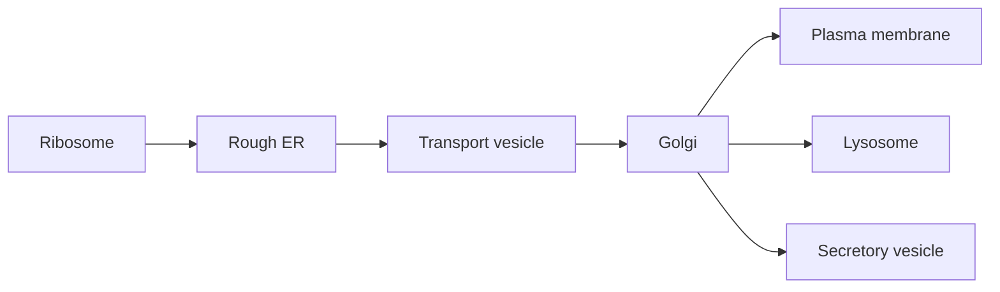

# Tế bào, màng và vận chuyển — Cells, Membranes and Transport (세포, 세포막과 수송)

Foundation chapters đã cho ta vật liệu và luật chơi: water tạo môi trường, lipid tự tổ chức thành bilayer, protein có thể làm machine, ATP cung cấp coupling, ion tạo gradient và axit nucleic (nucleic acid) mang information. Bây giờ ta hỏi câu tiếp theo: **làm thế nào những molecule đó được tổ chức thành một unit có thể tự duy trì?**

Câu trả lời là **tế bào (cell / 세포)**. Cell không chỉ là một “túi chứa molecule”. Nó là một hệ có ranh giới (boundary), khoang (compartment), vận chuyển (transport), energy conversion, information processing và điều khiển (control). Chapter này dựng architecture đó từ các nguyên lý nền tảng (first principles).

> **Mô hình tư duy (mental model):** cell là một không gian hóa học có kiểm soát. Membrane tạo ranh giới; transporter quản lý exchange; organelle chia việc thành compartment; cytoskeleton tạo organization và movement. Cell sống được vì giữ được khác biệt có ích giữa “bên trong” và “bên ngoài”.

## 1. Tại sao cell thường nhỏ?

Một cell phải lấy nutrient, thải waste và trao đổi signal qua surface. Nhưng lượng material bên trong cần được phục vụ tỷ lệ với volume.

Nếu kích thước tuyến tính là \(L\), diện tích bề mặt (surface area) tăng khoảng \(L^2\), volume tăng khoảng \(L^3\). Vì vậy:

\[
\frac{SA}{V}\propto\frac{1}{L}
\]

Cell lớn lên thì diện tích bề mặt trên mỗi đơn vị volume giảm. Exchange qua membrane trở nên khó đáp ứng toàn bộ interior.

Đây không phải lý do duy nhất cell nhỏ, nhưng nó giải thích vì sao biological structure thường dùng folding hoặc branching để tăng surface: microvilli của intestine, cristae của mitochondria, thylakoid của chloroplast, alveoli của lung.

Geometry trở thành biology.

## 2. Prokaryote và eukaryote: hai architecture khác nhau

**Tế bào nhân sơ (prokaryotic cell / 원핵세포)** của Bacteria và Archaea không có nucleus bao bởi membrane. DNA nằm trong nucleoid. Chúng vẫn có ribosome, màng (membrane), bộ xương tế bào (cytoskeleton)-like system, metabolism và regulation tinh vi.

**Tế bào nhân thực (eukaryotic cell / 진핵세포)** có nucleus và nhiều bào quan có màng (membrane-bound organelle).

Điểm khác biệt không nên hiểu như “prokaryote đơn giản, eukaryote phức tạp”. Bacteria có mạng lưới điều hòa (regulatory network) và đa dạng chuyển hóa (metabolic diversity) rất cao. Khác biệt chính là **organization**: eukaryote dùng compartmentalization mạnh hơn.

## 3. Compartmentalization: chia không gian để chemistry không cản nhau

Nếu mọi reaction cùng diễn ra trong một soup đồng nhất, cell khó giữ condition tối ưu cho từng process.

Eukaryotic cell giải bằng organelle.

**Nucleus (nhân / 핵)** chứa phần lớn genome và tách transcription khỏi translation. **Mitochondrion (ty thể / 미토콘드리아)** tổ chức respiration và chênh lệch proton (proton gradient). **Endoplasmic reticulum, ER (lưới nội chất / 소포체)** tham gia protein/lipid synthesis. **Golgi apparatus (bộ máy Golgi / 골지체)** modify/sort cargo. **Lysosome (리소좀)** dùng môi trường acid để phân giải (degradation). **Peroxisome (퍼옥시좀)** xử lý một số oxidation reaction. Plant cell còn có **chloroplast (lục lạp / 엽록체)** và large vacuole.

Khoang giúp cell vừa tăng efficiency vừa tăng control.

## 4. Membrane là ranh giới động, không phải tường cứng

Màng tế bào (cell membrane) chủ yếu là **lớp kép phospholipid (phospholipid bilayer)** với protein, cholesterol và carbohydrate component.

Phospholipid có head hydrophilic và tail hydrophobic. Trong nước (water), bilayer self-assemble. Nhưng membrane không đứng yên. Lipid và nhiều protein có thể diffuse lateral; composition thay đổi; membrane bend, fuse và bud.

Mô hình **mô hình khảm lỏng (fluid mosaic model) (유동 모자이크 모델)** nhấn mạnh membrane là fluid matrix chứa nhiều component khác nhau.

Cholesterol ở animal membrane có vai trò buffer fluidity: ở temperature cao nó hạn chế movement quá mức; ở temperature thấp nó cản phospholipid pack quá chặt.

## 5. Tính thấm chọn lọc (selective permeability): boundary hữu ích vì không cho mọi thứ đi qua như nhau

Molecule nhỏ nonpolar như O₂ và CO₂ có thể diffuse qua bilayer khá dễ. Nước đi được nhưng nhiều cell còn dùng aquaporin. Ion và molecule polar lớn khó đi qua hydrophobic core.

Đây là điều cực kỳ quan trọng. Nếu Na⁺, K⁺, H⁺ tự do cân bằng tức thời hai phía membrane, cell không giữ được chênh lệch điện hóa (electrochemical gradient). Nếu nutrient không thể được transport có chọn lọc, cell không thể regulate metabolism.

Tính thấm chọn lọc biến membrane thành interface có logic chứ không chỉ packaging.

## 6. Khuếch tán (diffusion): movement ngẫu nhiên tạo net flow có hướng

Molecule luôn chuyển động nhiệt. Khi concentration không đều, phía concentration cao có nhiều particle hơn nên số crossing theo hướng từ cao xuống thấp lớn hơn chiều ngược lại. Kết quả là **net diffusion**.

Một model đơn giản của flux theo Fick:

\[
J=-D\frac{dC}{dx}
\]

Trong đó \(J\) là dòng chuyển hóa (flux), \(D\) là hệ số khuếch tán (diffusion coefficient) và \(dC/dx\) là chênh lệch nồng độ (concentration gradient). Dấu âm cho biết net flow theo hướng concentration giảm.

Math làm rõ intuition: gradient càng dốc, diffusion net càng mạnh; distance diffusion càng dài, exchange càng khó.

## 7. Khuếch tán được hỗ trợ (facilitated diffusion): đi “xuống dốc” nhưng cần cửa

Ion hoặc phân tử phân cực (polar molecule) không đi dễ qua lipid. Cell dùng protein màng (membrane protein).

**Channel (kênh / 채널)** tạo pore cho ion/nước đi theo chênh lệch điện hóa. **Carrier (chất mang / 운반체)** bind molecule và đổi conformation để chuyển qua màng.

Nếu process đi theo gradient và không cần direct energy đầu vào (input), nó là **vận chuyển thụ động (passive transport) (수동수송)**.

Glucose transporter GLUT là carrier; kênh ion (ion channel) trong neuron là ví dụ channel.

Protein không tạo năng lượng (energy) cho movement; nó tạo route qua barrier.

## 8. Osmosis và tonicity: cân bằng nước (water balance) có thể quyết định cell sống hay vỡ

**Thẩm thấu (osmosis) (삼투)** là net water movement qua selectively permeable membrane do khác biệt thế hóa học (chemical potential) của water.

Trong **hypotonic environment**, water có xu hướng vào animal cell; cell có thể swell và lyse. Trong **hypertonic environment**, nước ra khỏi cell; cell shrink. Trong isotonic condition, net water flow không làm volume thay đổi lớn.

Plant cell có thành tế bào (cell wall). Nước đi vào tạo **turgor pressure**, giúp tissue cứng. Vì vậy cùng osmosis nhưng architecture khác tạo outcome khác.

Tonicity không chỉ phụ thuộc tổng solute concentration mà phụ thuộc solute có xuyên membrane hay không.

## 9. Vận chuyển chủ động (active transport): giữ system xa equilibrium cần energy

Nếu cell chỉ dùng diffusion, cuối cùng nhiều concentration sẽ tiến về equilibrium. Nhưng living cell cần giữ chênh lệch (gradient).

**Vận chuyển chủ động (능동수송)** di chuyển solute ngược chênh lệch điện hóa bằng energy.

Ví dụ **Na⁺/K⁺-ATPase** ở animal cell dùng ATP để bơm 3 Na⁺ ra và 2 K⁺ vào mỗi cycle. Kết quả góp phần giữ Na⁺ thấp, K⁺ cao trong cytoplasm và tạo điện thế màng (membrane potential).

```text
ATP hydrolysis
    ↓
pump conformational change
    ↓
ion moved uphill
    ↓
electrochemical gradient stored
```

Gradient là một dạng potential energy.

## 10. Vận chuyển chủ động thứ cấp (secondary active transport): dùng một gradient để kéo molecule khác

Cell có thể dùng gradient đã tạo trước thay vì hydrolyze ATP trực tiếp ở mỗi transporter.

Trong **vận chuyển chủ động thứ cấp**, movement downhill của một ion drive movement uphill của molecule khác.

Nếu hai chất đi cùng hướng gọi là **symport**; ngược hướng là **antiport**.

Na⁺–glucose cotransporter ở intestine dùng Na⁺ chênh lệch để đưa glucose vào cell ngay cả khi glucose phải đi ngược gradient concentration.

Energy chain là:

```text
ATP
→ Na+/K+ pump
→ Na+ gradient
→ Na+-glucose symporter
→ glucose uptake
```

Đây là ghép năng lượng (energy coupling) ở membrane scale.

## 11. Chênh lệch điện hóa: ion chịu cả concentration lẫn voltage

Ion có charge nên movement không chỉ phụ thuộc concentration. Nó còn chịu electric potential across membrane.

**Chênh lệch điện hóa (전기화학적 기울기)** kết hợp chênh lệch hóa học (chemical gradient) và electrical gradient.

K⁺ có thể concentration cao bên trong nên chemical tendency kéo ra ngoài, nhưng negative interior có thể hút K⁺ trở lại. Điện thế màng equilibrium xuất hiện khi hai lực cân bằng cho ion đó.

Nguyên lý này sẽ trở thành nền cho điện thế hoạt động (action potential) ở hệ thần kinh (nervous system) và chênh lệch proton ở mitochondria.

## 12. Điện thế màng không phải “điện giống dây đồng”

Màng tế bào tách charge trên khoảng distance rất nhỏ. Cytoplasm và extracellular fluid nhìn chung vẫn gần electrically neutral ở bulk scale; chỉ một fraction ion nhỏ gần membrane đủ tạo voltage.

Membrane hoạt động gần giống capacitor: bilayer cách điện tương đối, fluid hai phía dẫn ion.

Điều này giải thích vì sao mở kênh ion có thể đổi voltage nhanh mà không cần chuyển toàn bộ ion của cell.

## 13. Vận chuyển bằng túi màng (vesicle transport): molecule quá lớn thì sao?

Protein lớn, particle hoặc lượng cargo lớn không đi qua channel. Eukaryotic cell dùng vesicle.

**Nhập bào (endocytosis) (내포작용)** đưa material vào bằng membrane invagination. **Xuất bào (exocytosis) (외포작용)** fuse vesicle với màng sinh chất (plasma membrane) để release cargo.

Neuron release neurotransmitter bằng xuất bào. Secretory cell release hormone/protein tương tự. Thụ thể (receptor)-mediated nhập bào cho phép uptake chọn lọc dựa trên receptor.

Membrane vì vậy không phải boundary cố định; nó liên tục được tái cấu trúc.

## 14. Nucleus: tách archive information khỏi vùng translation

Eukaryotic DNA nằm chủ yếu trong nucleus. Nuclear envelope có pore kiểm soát traffic RNA/protein (protein).

Transcription xảy ra trong nucleus; mRNA được processing rồi export; translation xảy ra ở cytoplasmic ribosome hoặc ribosome trên rough ER.

Sự tách không gian cho phép thêm layer regulation như RNA splicing và kiểm soát chất lượng (quality control) trước khi mRNA gặp ribosome.

Architecture tạo regulatory possibility.

## 15. Ribosome: nơi information trở thành vật chất chức năng

**Ribosome (리보솜)** đọc mRNA và nối axit amin (amino acid) thành protein. Ribosome gồm rRNA và protein; catalytic center quan trọng có RNA component, là dấu vết thú vị cho giả thuyết Thế giới RNA (RNA world).

Ribosome tự do thường tạo protein hoạt động trong cytosol/nucleus/mitochondria; ribosome gắn rough ER thường tổng hợp protein tiết ra ngoài hoặc protein màng (membrane)/endosomal system.

Protein destination bắt đầu được quyết định ngay khi synthesis.

## 16. ER–Golgi pathway: logistics nội bộ của cell

Protein secreted/membrane thường đi vào rough ER, nơi fold và được quality-điều khiển. Vesicle đưa chúng tới Golgi để modify/sort, rồi tới membrane, lysosome hay secretion pathway.

Có thể hình dung:



Nếu folding sai, protein có thể bị giữ lại và degraded. Cell logistics gắn chặt với protein kiểm soát chất lượng.

## 17. Lysosome và autophagy: cell cũng phải dọn rác

Lysosome chứa hydrolytic enzyme hoạt động tốt trong pH acid. Nó phân giải cargo từ nhập bào và material nội bào.

**Autophagy (자가포식)** đưa component hỏng hoặc dư thừa vào phân giải con đường (pathway) để recycle khối cấu tạo (building block).

Maintenance không kém synthesis. Một cell chỉ sản xuất mà không dọn waste sẽ mất organization.

## 18. Bộ xương tế bào: shape, transport và force

**Bộ xương tế bào (세포골격)** gồm microfilament actin, intermediate filament và microtubule.

Actin liên quan cell shape, migration và co cơ (muscle contraction). Microtubule tạo track cho protein vận động (motor protein), tham gia cilia/flagella và mitotic spindle. Intermediate filament tăng mechanical strength.

Cytoskeleton không phải “bộ xương chết”. Nó dynamic, polymerize/depolymerize liên tục.

## 19. Protein vận động: ATP thành movement

**Kinesin** và **dynein** di chuyển cargo dọc microtubule; **myosin** tương tác actin.

Protein vận động hydrolyze ATP và chuyển chemical năng lượng tự do (free energy) thành conformational cycle, tạo step/motion.

Đây là connection trực tiếp từ biomolecule chapter: ATP không phải “năng lượng chung chung”; nó được machine cụ thể hydrolyze để tạo force.

## 20. Mối nối tế bào (cell junction) và chất nền ngoại bào (extracellular matrix): multicellularity bắt đầu từ đây

Animal cell trong tissue không trôi tự do. **Mối nối tế bào** nối cell với nhau; **chất nền ngoại bào, ECM (세포외기질)** tạo scaffold và tín hiệu (signal) môi trường (environment).

Mối nối kín (tight junction) giảm leak giữa cell; mối nối bám dính (adherens junction)/desmosome truyền mechanical force; mối nối khe (gap junction) cho small molecule/ion đi giữa cell.

Tế bào (cell)–ECM receptor như integrin vừa neo structure vừa truyền signal. Vì vậy kiến trúc mô (tissue architecture) và signaling liên kết.

## 21. Nội cộng sinh (endosymbiosis): mitochondria/chloroplast có lịch sử riêng

Mitochondria và chloroplast có double membrane, genome riêng và ribosome tương tự bacterial ribosome. Evidence hỗ trợ **endosymbiotic theory (세포내공생설)**: ancestor eukaryote từng engulf bacteria và mối quan hệ trở thành permanent symbiosis.

Evolutionary history giải thích cell architecture hiện tại.

Mitochondrial/chloroplast genome đã mất/chuyển nhiều gene vào nucleus; organelle hiện phụ thuộc cell nhưng vẫn giữ dấu vết nguồn gốc bacterial.

## 22. Tình huống phân tích (case study): oral rehydration solution hoạt động vì membrane transport

Trong diarrhea, mất water và electrolyte có thể nguy hiểm. Oral rehydration solution chứa glucose và sodium theo tỷ lệ phù hợp.

Intestinal Na⁺–glucose cotransporter hấp thu Na⁺ và glucose cùng nhau. Solute uptake tạo osmotic effect kéo water hấp thu theo.

Một treatment đơn giản dựa trực tiếp trên vận chuyển chủ động thứ cấp và thẩm thấu.

Đây là ví dụ đẹp cho việc hiểu membrane mechanism có thể giải thích medicine thực tế.

## 23. Tình huống phân tích: cystic fibrosis và ion transport

CFTR là chloride channel. Mutation làm channel function giảm có thể thay salt/water transport trên epithelial surface, làm mucus đặc ở lung và nhiều organ.

Chuỗi causal:

```text
mutation
→ protein/channel dysfunction
→ ion transport đổi
→ water movement đổi
→ mucus property đổi
→ tissue/organ consequence
```

Một gene ảnh hưởng disease thông qua màng vật lý (physics), không qua “gene quyết định disease” một cách trực tiếp.

## 24. Các hiểu lầm phổ biến (common misconceptions)

“Màng tế bào là lớp da kín” sai; membrane là dynamic selective interface.

“Diffusion nghĩa molecule chủ động đi về nơi ít concentration” sai; individual motion random, net pattern xuất hiện thống kê.

“Vận chuyển chủ động luôn trực tiếp dùng ATP” sai; vận chuyển chủ động thứ cấp dùng gradient được tạo bởi process dùng energy trước đó.

“Organelle chỉ là các bộ phận để học tên” sai; mỗi compartment giải quyết một problem chemical/logistic.

“Prokaryote không có organization” sai; chúng thiếu membrane-bound nucleus nhưng có spatial organization và điều hòa (regulation) đáng kể.

<!-- depth-audit-2026:pump-leak -->
## Pump–leak steady state: màng sống không ở cân bằng

Một màng chỉ có kênh thụ động cuối cùng sẽ tiến gần cân bằng điện hóa. Tế bào sống lại duy trì Na⁺, K⁺, Ca²⁺, H⁺ và nhiều chất tan ở phân bố rất khác nhau giữa hai phía màng. Điều này tạo ra **trạng thái ổn định không cân bằng (non-equilibrium steady state)**: dòng rò thụ động liên tục được bù bằng bơm và chất vận chuyển tiêu năng lượng.

Với một ion, điện thế cân bằng có thể ước lượng bằng phương trình Nernst:

\[
E_{ion}=\frac{RT}{zF}\ln\frac{[ion]_{out}}{[ion]_{in}}
\]

Nếu điện thế màng khác \(E_{ion}\), ion có động lực điện hóa để di chuyển khi kênh mở. Nhưng điện thế màng thật không do một ion quyết định; nó xuất hiện từ độ thấm tương đối của nhiều ion, hoạt động của bơm và các anion không khuếch tán. Đây là chỗ Chemistry và Physics chuyển trực tiếp thành physiology.

Failure cho thấy vì sao architecture này quan trọng. Khi ATP giảm sâu, Na⁺/K⁺-ATPase yếu đi, chênh lệch ion giảm, Na⁺ và nước có xu hướng tích vào tế bào, màng khử cực và Ca²⁺ nội bào có thể tăng. Một vấn đề “năng lượng” vì thế nhanh chóng trở thành vấn đề vận chuyển, tín hiệu, thể tích và tổn thương tế bào.

Màng cũng là đối tượng của thích nghi và tiến hóa. Tỉ lệ acid béo bão hòa/không bão hòa, sterol và lipid đặc hiệu có thể thay để giữ độ lỏng màng trong nhiệt độ khác nhau. Selection không tối đa “độ lỏng”; nó giữ một vùng vật lý cho phép protein màng, permeability và mechanics cùng hoạt động được.

<!-- continuity-2026:organelle-trafficking -->
## Bào quan chỉ có chức năng khi topology và dòng vận chuyển được giữ đúng

Học tên bào quan chưa đủ. **Cấu trúc (structure)** của hệ nội màng tạo ra những mặt màng và khoang có thành phần khác nhau; **cơ chế (mechanism)** vận chuyển quyết định protein và lipid nào tới đúng nơi. Protein tiết hoặc protein màng thường bắt đầu bằng tín hiệu định vị, được đưa vào lưới nội chất (endoplasmic reticulum), kiểm tra gấp cuộn, chuyển tới Golgi rồi được phân loại vào túi vận chuyển. Protein lysosome, receptor màng và protein tiết vì vậy đi qua những nhánh khác nhau dù đều được tổng hợp từ ribosome.

Màng còn có **tính bất đối xứng (membrane asymmetry)**. Hai lá của lớp kép lipid không có thành phần giống hệt nhau; carbohydrate của glycoprotein hướng ra phía ngoài hoặc lòng bào quan; phospholipid nhất định được enzyme chuyển giữa hai lá. Topology này được bảo tồn qua nảy chồi và hòa màng (budding/fusion), nhờ đó “mặt trong” và “mặt ngoài” không bị đảo ngẫu nhiên.

Điều hòa xảy ra ở nhiều điểm: receptor có thể bị nhập bào sau khi nhận tín hiệu; cargo có thể được tái chế về màng hoặc đưa vào lysosome để phân hủy; protein gấp sai ở ER kích hoạt đáp ứng stress và có thể bị đưa tới proteasome. Nếu trafficking hỏng, vấn đề không chỉ là “protein ở sai chỗ”: gradient ion, secretion, receptor signaling và chất lượng protein đều có thể suy giảm cùng lúc.

Đây cũng là nơi tiến hóa tận dụng cấu trúc cũ. Hệ nội màng cho phép tế bào nhân thực tăng kích thước và chuyên hóa mà không phải để mọi phản ứng xảy ra trong cùng một khoang. Compartmentalization vì vậy là một thích nghi kiến trúc giúp tách các hóa học không tương thích và tăng khả năng điều hòa.

## 25. Cầu nối (bridge): cấu trúc (structure) đã có, nhưng cell lấy energy ở đâu?

Ta đã dựng được architecture: ranh giới, chênh lệch, transporter, organelle, cytoskeleton và logistics. Nhưng architecture này chỉ sống nếu có continual energy throughput.

Na⁺/K⁺ pump cần ATP. Protein vận động cần ATP. Tổng hợp protein (protein synthesis) cần energy. Repair cần energy. Vậy ATP được regenerate từ đâu?

Đó là câu hỏi của [Chuyển hóa, Hô hấp tế bào và Quang hợp](01_metabolism_respiration_photosynthesis.md). Ta sẽ theo electron từ nutrient hoặc light, qua redox carrier và màng chênh lệch (gradient), đến ATP synthase (ATP synthase).

Sau đó [Truyền tín hiệu và Chu kỳ tế bào](02_cell_signaling_and_cell_cycle.md) sẽ trả lời câu hỏi kế tiếp: khi đã có energy và bộ máy (machinery), **tế bào biết lúc nào nên làm gì, lúc nào nên divide và lúc nào nên die bằng cách nào?**

> **Mô hình tư duy cuối chapter:** cell sống không nhờ có nhiều organelle, mà nhờ kiến trúc (architecture) giữ được những difference có ích — concentration, charge, pH, localization và thông tin (information) trạng thái (state). Năng lượng được tiêu để tạo/giữ các difference đó; transport và signaling khai thác chúng để cell hoạt động.

---

<!-- biology-learning-navigation -->
**Điều hướng học:** [← Nguồn gốc sự sống và tiến hóa sớm](../00_foundations/03_origin_of_life_and_early_evolution.md) · [Mục lục Biology](../README.md) · [Chuyển hóa, Hô hấp tế bào và Quang hợp →](01_metabolism_respiration_photosynthesis.md)
