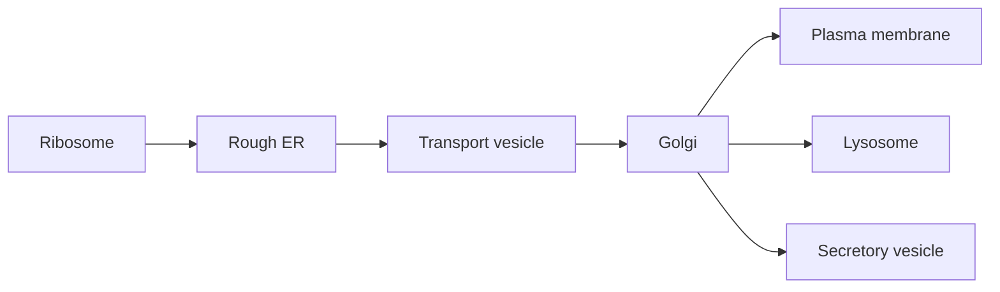

# Tế bào, màng và vận chuyển — Cells, Membranes and Transport (세포, 세포막과 수송)

Foundation chapters đã cho ta vật liệu và luật chơi: water tạo môi trường, lipid tự tổ chức thành bilayer, protein có thể làm machine, ATP cung cấp coupling, ion tạo gradient và nucleic acid mang information. Bây giờ ta hỏi câu tiếp theo: **làm thế nào những molecule đó được tổ chức thành một unit có thể tự duy trì?**

Câu trả lời là **tế bào (cell / 세포)**. Cell không chỉ là một “túi chứa molecule”. Nó là một hệ có boundary, compartment, transport, energy conversion, information processing và control. Chapter này dựng architecture đó từ first principles.

> **Mental model:** cell là một không gian hóa học có kiểm soát. Membrane tạo boundary; transporter quản lý exchange; organelle chia việc thành compartment; cytoskeleton tạo organization và movement. Cell sống được vì giữ được khác biệt có ích giữa “bên trong” và “bên ngoài”.

## 1. Tại sao cell thường nhỏ?

Một cell phải lấy nutrient, thải waste và trao đổi signal qua surface. Nhưng lượng material bên trong cần được phục vụ tỷ lệ với volume.

Nếu kích thước tuyến tính là \(L\), surface area tăng khoảng \(L^2\), volume tăng khoảng \(L^3\). Vì vậy:

\[
\frac{SA}{V}\propto\frac{1}{L}
\]

Cell lớn lên thì surface area trên mỗi đơn vị volume giảm. Exchange qua membrane trở nên khó đáp ứng toàn bộ interior.

Đây không phải lý do duy nhất cell nhỏ, nhưng nó giải thích vì sao biological structure thường dùng folding hoặc branching để tăng surface: microvilli của intestine, cristae của mitochondria, thylakoid của chloroplast, alveoli của lung.

Geometry trở thành biology.

## 2. Prokaryote và eukaryote: hai architecture khác nhau

**Tế bào nhân sơ (prokaryotic cell / 원핵세포)** của Bacteria và Archaea không có nucleus bao bởi membrane. DNA nằm trong nucleoid. Chúng vẫn có ribosome, membrane, cytoskeleton-like system, metabolism và regulation tinh vi.

**Tế bào nhân thực (eukaryotic cell / 진핵세포)** có nucleus và nhiều membrane-bound organelle.

Điểm khác biệt không nên hiểu như “prokaryote đơn giản, eukaryote phức tạp”. Bacteria có regulatory network và metabolic diversity rất cao. Khác biệt chính là **organization**: eukaryote dùng compartmentalization mạnh hơn.

## 3. Compartmentalization: chia không gian để chemistry không cản nhau

Nếu mọi reaction cùng diễn ra trong một soup đồng nhất, cell khó giữ condition tối ưu cho từng process.

Eukaryotic cell giải bằng organelle.

**Nucleus (nhân / 핵)** chứa phần lớn genome và tách transcription khỏi translation. **Mitochondrion (ty thể / 미토콘드리아)** tổ chức respiration và proton gradient. **Endoplasmic reticulum, ER (lưới nội chất / 소포체)** tham gia protein/lipid synthesis. **Golgi apparatus (bộ máy Golgi / 골지체)** modify/sort cargo. **Lysosome (리소좀)** dùng môi trường acid để degradation. **Peroxisome (퍼옥시좀)** xử lý một số oxidation reaction. Plant cell còn có **chloroplast (lục lạp / 엽록체)** và large vacuole.

Compartment giúp cell vừa tăng efficiency vừa tăng control.

## 4. Membrane là boundary động, không phải tường cứng

Cell membrane chủ yếu là **phospholipid bilayer** với protein, cholesterol và carbohydrate component.

Phospholipid có head hydrophilic và tail hydrophobic. Trong water, bilayer self-assemble. Nhưng membrane không đứng yên. Lipid và nhiều protein có thể diffuse lateral; composition thay đổi; membrane bend, fuse và bud.

Mô hình **fluid mosaic model (유동 모자이크 모델)** nhấn mạnh membrane là fluid matrix chứa nhiều component khác nhau.

Cholesterol ở animal membrane có vai trò buffer fluidity: ở temperature cao nó hạn chế movement quá mức; ở temperature thấp nó cản phospholipid pack quá chặt.

## 5. Selective permeability: boundary hữu ích vì không cho mọi thứ đi qua như nhau

Molecule nhỏ nonpolar như O₂ và CO₂ có thể diffuse qua bilayer khá dễ. Water đi được nhưng nhiều cell còn dùng aquaporin. Ion và molecule polar lớn khó đi qua hydrophobic core.

Đây là điều cực kỳ quan trọng. Nếu Na⁺, K⁺, H⁺ tự do cân bằng tức thời hai phía membrane, cell không giữ được electrochemical gradient. Nếu nutrient không thể được transport có chọn lọc, cell không thể regulate metabolism.

Selective permeability biến membrane thành interface có logic chứ không chỉ packaging.

## 6. Diffusion: movement ngẫu nhiên tạo net flow có hướng

Molecule luôn chuyển động nhiệt. Khi concentration không đều, phía concentration cao có nhiều particle hơn nên số crossing theo hướng từ cao xuống thấp lớn hơn chiều ngược lại. Kết quả là **net diffusion**.

Một model đơn giản của flux theo Fick:

\[
J=-D\frac{dC}{dx}
\]

Trong đó \(J\) là flux, \(D\) là diffusion coefficient và \(dC/dx\) là concentration gradient. Dấu âm cho biết net flow theo hướng concentration giảm.

Math làm rõ intuition: gradient càng dốc, diffusion net càng mạnh; distance diffusion càng dài, exchange càng khó.

## 7. Facilitated diffusion: đi “xuống dốc” nhưng cần cửa

Ion hoặc polar molecule không đi dễ qua lipid. Cell dùng membrane protein.

**Channel (kênh / 채널)** tạo pore cho ion/water đi theo electrochemical gradient. **Carrier (chất mang / 운반체)** bind molecule và đổi conformation để chuyển qua membrane.

Nếu process đi theo gradient và không cần direct energy input, nó là **passive transport (수동수송)**.

Glucose transporter GLUT là carrier; ion channel trong neuron là ví dụ channel.

Protein không tạo energy cho movement; nó tạo route qua barrier.

## 8. Osmosis và tonicity: water balance có thể quyết định cell sống hay vỡ

**Osmosis (삼투)** là net water movement qua selectively permeable membrane do khác biệt chemical potential của water.

Trong **hypotonic environment**, water có xu hướng vào animal cell; cell có thể swell và lyse. Trong **hypertonic environment**, water ra khỏi cell; cell shrink. Trong isotonic condition, net water flow không làm volume thay đổi lớn.

Plant cell có cell wall. Water đi vào tạo **turgor pressure**, giúp tissue cứng. Vì vậy cùng osmosis nhưng architecture khác tạo outcome khác.

Tonicity không chỉ phụ thuộc tổng solute concentration mà phụ thuộc solute có xuyên membrane hay không.

## 9. Active transport: giữ system xa equilibrium cần energy

Nếu cell chỉ dùng diffusion, cuối cùng nhiều concentration sẽ tiến về equilibrium. Nhưng living cell cần giữ gradient.

**Active transport (능동수송)** di chuyển solute ngược electrochemical gradient bằng energy.

Ví dụ **Na⁺/K⁺-ATPase** ở animal cell dùng ATP để bơm 3 Na⁺ ra và 2 K⁺ vào mỗi cycle. Kết quả góp phần giữ Na⁺ thấp, K⁺ cao trong cytoplasm và tạo membrane potential.

```text
ATP hydrolysis
    ↓
pump conformational change
    ↓
ion moved uphill
    ↓
electrochemical gradient stored
```

Gradient là một dạng potential energy.

## 10. Secondary active transport: dùng một gradient để kéo molecule khác

Cell có thể dùng gradient đã tạo trước thay vì hydrolyze ATP trực tiếp ở mỗi transporter.

Trong **secondary active transport**, movement downhill của một ion drive movement uphill của molecule khác.

Nếu hai chất đi cùng hướng gọi là **symport**; ngược hướng là **antiport**.

Na⁺–glucose cotransporter ở intestine dùng Na⁺ gradient để đưa glucose vào cell ngay cả khi glucose phải đi ngược gradient concentration.

Energy chain là:

```text
ATP
→ Na+/K+ pump
→ Na+ gradient
→ Na+-glucose symporter
→ glucose uptake
```

Đây là energy coupling ở membrane scale.

## 11. Electrochemical gradient: ion chịu cả concentration lẫn voltage

Ion có charge nên movement không chỉ phụ thuộc concentration. Nó còn chịu electric potential across membrane.

**Electrochemical gradient (전기화학적 기울기)** kết hợp chemical gradient và electrical gradient.

K⁺ có thể concentration cao bên trong nên chemical tendency kéo ra ngoài, nhưng negative interior có thể hút K⁺ trở lại. Membrane potential equilibrium xuất hiện khi hai lực cân bằng cho ion đó.

Nguyên lý này sẽ trở thành nền cho action potential ở nervous system và proton gradient ở mitochondria.

## 12. Membrane potential không phải “điện giống dây đồng”

Cell membrane tách charge trên khoảng distance rất nhỏ. Cytoplasm và extracellular fluid nhìn chung vẫn gần electrically neutral ở bulk scale; chỉ một fraction ion nhỏ gần membrane đủ tạo voltage.

Membrane hoạt động gần giống capacitor: bilayer cách điện tương đối, fluid hai phía dẫn ion.

Điều này giải thích vì sao mở ion channel có thể đổi voltage nhanh mà không cần chuyển toàn bộ ion của cell.

## 13. Vesicle transport: molecule quá lớn thì sao?

Protein lớn, particle hoặc lượng cargo lớn không đi qua channel. Eukaryotic cell dùng vesicle.

**Endocytosis (내포작용)** đưa material vào bằng membrane invagination. **Exocytosis (외포작용)** fuse vesicle với plasma membrane để release cargo.

Neuron release neurotransmitter bằng exocytosis. Secretory cell release hormone/protein tương tự. Receptor-mediated endocytosis cho phép uptake chọn lọc dựa trên receptor.

Membrane vì vậy không phải boundary cố định; nó liên tục được tái cấu trúc.

## 14. Nucleus: tách archive information khỏi vùng translation

Eukaryotic DNA nằm chủ yếu trong nucleus. Nuclear envelope có pore kiểm soát traffic RNA/protein.

Transcription xảy ra trong nucleus; mRNA được processing rồi export; translation xảy ra ở cytoplasmic ribosome hoặc ribosome trên rough ER.

Sự tách không gian cho phép thêm layer regulation như RNA splicing và quality control trước khi mRNA gặp ribosome.

Architecture tạo regulatory possibility.

## 15. Ribosome: nơi information trở thành vật chất chức năng

**Ribosome (리보솜)** đọc mRNA và nối amino acid thành protein. Ribosome gồm rRNA và protein; catalytic center quan trọng có RNA component, là dấu vết thú vị cho giả thuyết RNA world.

Ribosome tự do thường tạo protein hoạt động trong cytosol/nucleus/mitochondria; ribosome gắn rough ER thường tổng hợp protein tiết ra ngoài hoặc protein membrane/endosomal system.

Protein destination bắt đầu được quyết định ngay khi synthesis.

## 16. ER–Golgi pathway: logistics nội bộ của cell

Protein secreted/membrane thường đi vào rough ER, nơi fold và được quality-control. Vesicle đưa chúng tới Golgi để modify/sort, rồi tới membrane, lysosome hay secretion pathway.

Có thể hình dung:



Nếu folding sai, protein có thể bị giữ lại và degraded. Cell logistics gắn chặt với protein quality control.

## 17. Lysosome và autophagy: cell cũng phải dọn rác

Lysosome chứa hydrolytic enzyme hoạt động tốt trong pH acid. Nó phân giải cargo từ endocytosis và material nội bào.

**Autophagy (자가포식)** đưa component hỏng hoặc dư thừa vào degradation pathway để recycle building block.

Maintenance không kém synthesis. Một cell chỉ sản xuất mà không dọn waste sẽ mất organization.

## 18. Cytoskeleton: shape, transport và force

**Cytoskeleton (세포골격)** gồm microfilament actin, intermediate filament và microtubule.

Actin liên quan cell shape, migration và muscle contraction. Microtubule tạo track cho motor protein, tham gia cilia/flagella và mitotic spindle. Intermediate filament tăng mechanical strength.

Cytoskeleton không phải “bộ xương chết”. Nó dynamic, polymerize/depolymerize liên tục.

## 19. Motor protein: ATP thành movement

**Kinesin** và **dynein** di chuyển cargo dọc microtubule; **myosin** tương tác actin.

Motor protein hydrolyze ATP và chuyển chemical free energy thành conformational cycle, tạo step/motion.

Đây là connection trực tiếp từ biomolecule chapter: ATP không phải “năng lượng chung chung”; nó được machine cụ thể hydrolyze để tạo force.

## 20. Cell junction và extracellular matrix: multicellularity bắt đầu từ đây

Animal cell trong tissue không trôi tự do. **Cell junction** nối cell với nhau; **extracellular matrix, ECM (세포외기질)** tạo scaffold và signal environment.

Tight junction giảm leak giữa cell; adherens junction/desmosome truyền mechanical force; gap junction cho small molecule/ion đi giữa cell.

Cell–ECM receptor như integrin vừa neo structure vừa truyền signal. Vì vậy tissue architecture và signaling liên kết.

## 21. Endosymbiosis: mitochondria/chloroplast có lịch sử riêng

Mitochondria và chloroplast có double membrane, genome riêng và ribosome tương tự bacterial ribosome. Evidence hỗ trợ **endosymbiotic theory (세포내공생설)**: ancestor eukaryote từng engulf bacteria và mối quan hệ trở thành permanent symbiosis.

Evolutionary history giải thích cell architecture hiện tại.

Mitochondrial/chloroplast genome đã mất/chuyển nhiều gene vào nucleus; organelle hiện phụ thuộc cell nhưng vẫn giữ dấu vết nguồn gốc bacterial.

## 22. Case study: oral rehydration solution hoạt động vì membrane transport

Trong diarrhea, mất water và electrolyte có thể nguy hiểm. Oral rehydration solution chứa glucose và sodium theo tỷ lệ phù hợp.

Intestinal Na⁺–glucose cotransporter hấp thu Na⁺ và glucose cùng nhau. Solute uptake tạo osmotic effect kéo water hấp thu theo.

Một treatment đơn giản dựa trực tiếp trên secondary active transport và osmosis.

Đây là ví dụ đẹp cho việc hiểu membrane mechanism có thể giải thích medicine thực tế.

## 23. Case study: cystic fibrosis và ion transport

CFTR là chloride channel. Mutation làm channel function giảm có thể thay salt/water transport trên epithelial surface, làm mucus đặc ở lung và nhiều organ.

Chuỗi causal:

```text
mutation
→ protein/channel dysfunction
→ ion transport đổi
→ water movement đổi
→ mucus property đổi
→ tissue/organ consequence
```

Một gene ảnh hưởng disease thông qua membrane physics, không qua “gene quyết định disease” một cách trực tiếp.

## 24. Common misconceptions

“Cell membrane là lớp da kín” sai; membrane là dynamic selective interface.

“Diffusion nghĩa molecule chủ động đi về nơi ít concentration” sai; individual motion random, net pattern xuất hiện thống kê.

“Active transport luôn trực tiếp dùng ATP” sai; secondary active transport dùng gradient được tạo bởi process dùng energy trước đó.

“Organelle chỉ là các bộ phận để học tên” sai; mỗi compartment giải quyết một problem chemical/logistic.

“Prokaryote không có organization” sai; chúng thiếu membrane-bound nucleus nhưng có spatial organization và regulation đáng kể.

## 25. Bridge: structure đã có, nhưng cell lấy energy ở đâu?

Ta đã dựng được architecture: boundary, gradient, transporter, organelle, cytoskeleton và logistics. Nhưng architecture này chỉ sống nếu có continual energy throughput.

Na⁺/K⁺ pump cần ATP. Motor protein cần ATP. Protein synthesis cần energy. Repair cần energy. Vậy ATP được regenerate từ đâu?

Đó là câu hỏi của [[01_metabolism_respiration_photosynthesis]]. Ta sẽ theo electron từ nutrient hoặc light, qua redox carrier và membrane gradient, đến ATP synthase.

Sau đó [[02_cell_signaling_and_cell_cycle]] sẽ trả lời câu hỏi kế tiếp: khi đã có energy và machinery, **cell biết lúc nào nên làm gì, lúc nào nên divide và lúc nào nên die bằng cách nào?**

> **Mental model cuối chapter:** cell sống không nhờ có nhiều organelle, mà nhờ architecture giữ được những difference có ích — concentration, charge, pH, localization và information state. Energy được tiêu để tạo/giữ các difference đó; transport và signaling khai thác chúng để cell hoạt động.