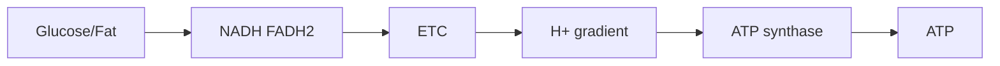

# Chuyển hóa, Hô hấp tế bào và Quang hợp — Metabolism, Respiration and Photosynthesis (대사, 세포호흡과 광합성)

Chapter trước cho thấy cell phải tiêu năng lượng liên tục để giữ chênh lệch ion (ion gradient), vận chuyển cargo, sửa cấu trúc và tổng hợp molecule. Vì vậy câu hỏi tự nhiên tiếp theo là: **ATP được tái tạo bằng cách nào, và năng lượng đi vào mạng lưới sống từ đâu?**

Câu trả lời không nằm ở một reaction duy nhất. Cell tổ chức energy conversion thành chuỗi nhiều bước: fuel hoặc light → chất mang electron (electron carrier) → màng (membrane) chênh lệch (gradient) → ATP → cellular work. Chapter này xây chuỗi đó từ các nguyên lý nền tảng (first principles) và cho thấy hô hấp tế bào với quang hợp thực ra là hai hướng bổ sung của cùng một logic redox–chênh lệch (gradient).

> **Mô hình tư duy (mental model):** metabolism là một mạng lưới chuyển đổi matter và năng lượng tự do (free energy). Respiration lấy electron từ fuel và “thả” chúng xuống mức energy thấp để tạo ATP. Quang hợp (photosynthesis) dùng photon nâng electron lên mức energy cao rồi dùng chúng để xây reduced carbon.

## 1. Metabolism là mạng lưới (network), không phải một “đường phản ứng”

**Chuyển hóa (metabolism / 대사)** gồm hàng nghìn reaction liên kết. Một molecule trung gian có thể đi sang nhiều pathway khác nhau tùy state của cell.

Glucose không nhất thiết “đi thẳng tới ATP”. Nó có thể:

- đi vào đường phân (glycolysis);
- tạo glycogen để storage;
- cung cấp khung carbon (carbon skeleton) cho axit amin (amino acid);
- đi vào pentose-phosphate pathway để tạo NADPH và ribose;
- được chuyển thành lipid khi energy dư.

Vì vậy metabolism nên nhìn như **network có branch và phản hồi (feedback)**, không phải conveyor belt một chiều.

## 2. Dị hóa (catabolism) và đồng hóa (anabolism) cần được nối bằng ghép năng lượng (energy coupling)

**Dị hóa (이화작용)** phân giải molecule và thường tạo ATP/các đương lượng khử (reducing equivalents). **Đồng hóa (동화작용)** xây molecule mới và cần ATP/khả năng khử (reducing power).

Hai chiều liên kết qua currency như ATP, NADH/NADPH và tiền chất (precursor).

Nếu dị hóa chạy mà đồng hóa không dùng material, resource có thể tích tụ hoặc bị thải. Nếu đồng hóa chạy mà không có energy source, process dừng. Cell phải cân bằng flux theo nutrient và nhu cầu (demand).

## 3. Trạng thái oxy hóa (oxidation state): vì sao phân tử (molecule) giàu C–H thường là fuel tốt?

Carbon gắn nhiều hydrogen thường ở trạng thái reduced hơn; khi bị oxidized về CO₂, electron được chuyển sang acceptor electronegative hơn như oxy (oxygen). Chênh lệch này giải phóng năng lượng tự do.

Axit béo (fatty acid) có nhiều C–H bond nên energy density cao. Đây là một lý do lipid là dự trữ năng lượng dài hạn (long-term energy storage) tốt hơn carbohydrate theo khối lượng.

Nhưng cell không “đốt” fuel như lửa. Nó chia oxidation thành nhiều enzyme-controlled step để capture energy.

## 4. Đường phân: bước đầu tách glucose trong cytosol

**Đường phân (đường phân / 해당과정)** xảy ra trong cytosol và không trực tiếp cần oxygen.

Một glucose 6-carbon được chuyển thành hai pyruvate 3-carbon. Pathway có investment phase dùng ATP và payoff phase tạo ATP/NADH.

Net đơn giản:

\[
Glucose + 2NAD^+ + 2ADP + 2P_i
\rightarrow 2Pyruvate + 2NADH + 2ATP + ...
\]

Điểm cần hiểu không phải thuộc từng enzyme ngay từ đầu, mà là lôgic (logic):

1. phosphorylate glucose để giữ/activate carbon trong tế bào (cell);
2. split 6C thành hai unit 3C;
3. oxidize intermediate và capture electron vào NADH;
4. transfer phosphate trực tiếp để tạo ATP.

Tạo ATP bằng direct phosphate transfer gọi là **cơ chất (substrate)-level phosphorylation**.

## 5. Đường phân là pathway cổ và linh hoạt

Đường phân diễn ra trong cytosol và có ở gần như mọi domain of life, gợi ý pathway rất cổ trong evolutionary history.

Nó cũng cung cấp intermediate cho biosynthesis, không chỉ ATP. Vì vậy nếu chỉ nhìn đường phân như “10 bước tạo 2 ATP”, ta bỏ mất vai trò central hub của nó.

## 6. Pyruvate là ngã rẽ metabolic

Sau đường phân, pyruvate có nhiều fate.

Khi oxidative respiration phù hợp, pyruvate vào mitochondrion và chuyển thành acetyl-CoA. Khi electron transport không tái oxidize NADH đủ nhanh, cell có thể dùng lên men (fermentation) để regenerate NAD⁺ cho đường phân.

Pyruvate cũng có thể đi vào biosynthetic pathway.

Metabolism chọn route dựa trên oxygen, enzyme expression, năng lượng (energy) demand và mô (tissue) bối cảnh (context).

## 7. Lên men: mục tiêu chính là tái sinh NAD⁺

Một misconception phổ biến là lên men “để tạo thêm ATP”. Thực tế ATP trong lên men chủ yếu đến từ đường phân. Vai trò quan trọng của lên men là **regenerate NAD⁺** để đường phân tiếp tục.

Trong lactic lên men:

\[
Pyruvate + NADH \rightarrow Lactate + NAD^+
\]

Trong yeast alcohol lên men, pyruvate cuối cùng tạo ethanol và CO₂ đồng thời regenerate NAD⁺.

Khi exercise intense, lactate production tăng không đơn giản vì “thiếu oxygen hoàn toàn”; nó phản ánh balance giữa glycolytic flux, mitochondrial oxidation và redox state.

## 8. Acetyl-CoA: junction giữa carbohydrate, fat và axit amin

Oxy hóa pyruvat (pyruvate oxidation) tạo **acetyl-CoA**, CO₂ và NADH. Axit béo beta-oxidation cũng tạo acetyl-CoA. Một số axit amin có thể feed vào acetyl-CoA hoặc TCA intermediate.

Vì vậy acetyl-CoA là metabolic junction nối nhiều nutrient.

Điều này giải thích tại sao các macronutrient không tồn tại như ba “đường năng lượng” hoàn toàn tách biệt.

## 9. Chu trình axit citric (citric acid cycle): mục tiêu lớn là lấy electron, không phải tạo nhiều ATP trực tiếp

**Chu trình citric acid/TCA/Krebs (시트르산 회로)** oxy hóa acetyl group thành CO₂ và chuyển electron sang NADH/FADH₂.

Mỗi vòng tạo nhiều reduced carrier nhưng chỉ ít ATP/GTP trực tiếp. Vì vậy nếu hỏi “TCA tạo bao nhiêu ATP?”, cần nhớ phần lớn ATP tới sau qua phosphoryl hóa oxy hóa (oxidative phosphorylation).

TCA còn cung cấp intermediate cho axit amin, heme và biosynthesis khác. Khi intermediate bị rút ra, anaplerotic reaction bổ sung chúng.

Một lần nữa, pathway là network intersection chứ không phải chỉ energy line.

## 10. Chuỗi chuyền electron (electron transport chain): electron đi xuống “bậc thang” năng lượng (energy)

NADH và FADH₂ mang electron tới **chuỗi chuyền electron, ETC (전자전달계)** ở inner mitochondrial membrane.

Electron được transfer qua series complex. Năng lượng tự do từ transfer được dùng để pump H⁺ từ matrix sang intermembrane space.

Kết quả: electron flow được chuyển thành **proton-motive force** gồm pH gradient và electrical potential.

```text
NADH/FADH2
   ↓ electron
ETC complexes
   ↓ energy coupling
H+ pumped across membrane
   ↓
proton-motive force
```

Màng chương (chapter) đã cho ta vận chuyển chủ động (active transport) và chênh lệch điện hóa (electrochemical gradient). Bây giờ ta thấy gradient được dùng như energy intermediate.

## 11. Oxygen là final chất nhận electron (electron acceptor), không phải “nguyên liệu tạo ATP trực tiếp”

Ở aerobic respiration, oxygen nhận electron cuối ETC và cùng H⁺ tạo nước (water).

Nếu không có oxy, electron chain bị backlog, NADH khó được oxidize về NAD⁺ và upstream pathway bị ảnh hưởng.

Vì vậy oxygen cần thiết cho high-yield oxidative metabolism không phải vì ATP synthase (ATP synthase) “ăn oxygen”, mà vì oxy giữ electron flow tiếp tục.

## 12. Thẩm thấu hóa học (chemiosmosis): một trong những idea thống nhất mạnh nhất của Biology

**Thẩm thấu hóa học (화학삼투)** là coupling giữa chênh lệch ion và ATP synthesis.

H⁺ đã được pump ra một phía membrane có tendency quay về theo chênh lệch điện hóa. ATP synthase cho proton đi qua và dùng energy để phosphorylate ADP:

\[
ADP + P_i \rightarrow ATP
\]

ATP synthase là molecular rotary machine: proton flow drive rotation/conformational change.

> **Mô hình tư duy:** ETC không “tạo ATP” trực tiếp. ETC tạo chênh lệch; gradient chạy ATP synthase; ATP synthase tạo ATP.

Logic này xuất hiện cả respiration và quang hợp.

## 13. Phosphoryl hóa oxy hóa và số ATP không phải hằng số tuyệt đối

Textbook đôi khi cho con số ATP/glucose cố định. Thực tế yield phụ thuộc shuttle system, proton leak, coupling efficiency và cellular condition.

Điều quan trọng hơn là understanding architecture:



Biology thường ưu tiên correct mechanism hơn memorizing một integer dễ thay đổi theo giả định (assumption).

## 14. Mitochondria vừa là power hub vừa là signaling hub

Mitochondria không chỉ tạo ATP. Chúng tham gia apoptosis, calcium handling, ROS signaling và biosynthetic metabolism.

Reactive oxygen species có thể gây damage khi quá mức nhưng cũng có truyền tín hiệu (signaling) vai trò (role) ở concentration thấp.

Mitochondrial function vì vậy gắn với aging, metabolism và chết tế bào (cell death), nhưng không nên giản hóa thành “mitochondria là nhà máy năng lượng”.

## 15. Fat metabolism: vì sao fasting và exercise dài dùng nhiều lipid hơn?

Triglyceride được breakdown thành axit béo và glycerol. Axit béo vào mitochondria và qua **beta-oxidation** tạo acetyl-CoA, NADH, FADH₂.

Vì axit béo rất reduced, oxidation cho nhiều chất mang electron và ATP.

Nhưng fuel selection phụ thuộc intensity, hormonal state, vận chuyển oxy (oxygen delivery) và mô. Tập luyện (exercise) physiology không thể tóm gọn bằng một câu “đốt mỡ sau X phút”.

## 16. Quang hợp: energy của biosphere đi vào chemical network như thế nào?

Hầu hết ecosystem phụ thuộc trực tiếp hoặc gián tiếp vào photosynthetic organisms.

**Quang hợp (photosynthesis / 광합성)** không đơn giản là “cây tạo oxy”. Nó dùng light energy để tạo ATP và khả năng khử, sau đó dùng chúng để reduce CO₂ thành organic carbon.

Hai phần lớn:

1. các pha sáng (light reactions) ở thylakoid membrane;
2. cố định carbon (carbon fixation)/Chu trình Calvin (Calvin cycle) ở stroma.

## 17. Photon và diệp lục (chlorophyll): light được capture như thế nào?

**Diệp lục (엽록소)** hấp thụ photon (photon) ở một số wavelength. Photon làm electron trong pigment chuyển lên trạng thái energy cao hơn.

Excited electron được transfer vào electron transport pathway. Pigment không “biến light thành glucose trực tiếp”; nó khởi động electron flow.

Photosystem được tổ chức thành antenna pigment và reaction center, tăng khả năng capture energy.

## 18. Photosystem II và water splitting

Ở oxygenic quang hợp, Photosystem II lấy electron từ nước:

\[
2H_2O \rightarrow O_2 + 4H^+ + 4e^-
\]

Oxygen mà plant release đến từ nước, không trực tiếp từ CO₂.

Electron sau đó đi qua transport chain; năng lượng được dùng tạo chênh lệch proton (proton gradient) across thylakoid membrane.

Lại là cùng architecture màng–chênh lệch.

## 19. Photosystem I và NADPH

Electron đến Photosystem I được photon kích thích lần nữa và cuối cùng góp phần reduce NADP⁺ thành NADPH.

NADPH mang khả năng khử cho cố định carbon.

Pha sáng (light reaction) do đó tạo hai resource chính: ATP và NADPH.

## 20. Quang phosphoryl hóa (photophosphorylation): ATP synthase xuất hiện lại

Proton concentration cao trong thylakoid lumen tạo chênh lệch. H⁺ đi qua chloroplast ATP synthase về stroma, drive ATP production.

Mechanism tương tự mitochondria nhưng orientation và source electron khác.

Đây là một trong những evidence đẹp cho idea conserved molecular mechanism qua tiến hóa (evolution).

## 21. Chu trình Calvin: CO₂ được đưa vào phân tử hữu cơ (organic molecule)

**Chu trình Calvin (캘빈 회로)** dùng ATP và NADPH để fix CO₂ vào khung carbon.

Enzyme Rubisco catalyze bước carboxylation. Product được processing qua nhiều step để tạo triose phosphate; một phần carbon rời cycle để xây carbohydrate và molecule khác, phần còn lại regenerate RuBP.

Điểm quan trọng: plant “lấy khối lượng” chủ yếu từ carbon dioxide (carbon dioxide), không phải từ đất. Đất (soil) cung cấp mineral/nước; khung carbon lớn đến từ atmospheric CO₂.

## 22. Rubisco và hô hấp sáng (photorespiration): evolution làm việc với constraint lịch sử

Rubisco có thể bind O₂ thay CO₂, đặc biệt trong condition nóng/CO₂ thấp, dẫn đến **hô hấp sáng** và giảm efficiency cố định carbon.

Tại sao evolution không tạo enzyme hoàn hảo? Vì adaptation bị ràng buộc bởi history, trade-off và existing structure.

C4 và CAM plants phát triển strategy giúp concentrate CO₂ hoặc tách timing để giảm hô hấp sáng/mất nước (water loss).

Đây là nơi metabolism nối evolution và sinh thái học (ecology).

## 23. Respiration và quang hợp không phải hai equation “đối nghịch” hoàn toàn

Ở mức tổng quát, quang hợp lưu energy trong reduced carbon; respiration lấy energy từ reduced carbon. Nhưng mechanism không đơn giản đảo ngược.

Cả hai dùng:

- chuỗi chuyền electron;
- màng (membrane);
- chênh lệch proton;
- ATP synthase;
- redox carrier.

Điều này gợi ý common evolutionary origin của chemiosmotic energy conversion.

## 24. Metabolic regulation: tế bào biết lúc nào cần tạo ATP?

ATP demand thay đổi liên tục. Con đường (pathway) được regulation bởi substrate availability, allosteric enzyme, phosphorylation, hormone và biểu hiện gen (gene expression).

Khi ATP/energy charge cao, một số catabolic pathway giảm. Khi ADP/AMP tăng, năng lượng-generating pathway được stimulate.

Ở quy mô sinh vật (organism scale), insulin, glucagon, adrenaline và thyroid hormone phối hợp metabolic state giữa tissue.

Cellular metabolism vì vậy nằm trong larger control mạng lưới (network).

## 25. Fed state và fasting state: cùng network nhưng flux đổi hướng

Sau meal, insulin favor glucose uptake/storage, glycogen synthesis và lipogenesis ở context thích hợp. Khi fasting, glucagon và other signal thúc đẩy glycogen breakdown, gluconeogenesis và mobilization fuel.

Không có “metabolism mode” cố định. Cùng pathway mạng lưới đổi flux theo signal và resource.

Đây là lý do (reason) truyền tín hiệu chapter phải đến ngay sau chuyển hóa (metabolism).

## 26. Cancer metabolism: sinh trưởng (growth) đổi yêu cầu mạng lưới chuyển hóa (metabolic network)

Rapidly proliferating cell cần không chỉ ATP mà còn nucleotide, lipid, axit amin và khả năng khử để xây biomass.

Một số cancer cell tăng glycolytic flux ngay cả khi oxygen có, pattern thường liên hệ Warburg effect. Nhưng không nên hiểu đơn giản “cancer chỉ dùng đường phân”; mitochondrial metabolism vẫn quan trọng ở nhiều cancer.

Điểm lesson là metabolic phenotype phản ánh **mục tiêu của cell**: maintenance khác growth.

## 27. Tình huống phân tích (case study): cyanide nguy hiểm vì đánh vào electron flow

Cyanide ức chế cytochrome c oxidase trong mitochondrial ETC. Electron flow tới oxygen bị chặn, proton pumping giảm, phosphoryl hóa oxy hóa collapse.

Blood có thể vẫn mang oxygen nhưng cell không sử dụng chất nhận electron pathway bình thường.

Chuỗi causal:

```text
ETC inhibited
→ proton gradient falls
→ ATP production falls
→ energy-dependent process fail
→ organ dysfunction
```

Cơ chế (mechanism) giải thích toxicity tốt hơn câu “cyanide làm thiếu oxygen”.

## 28. Tình huống phân tích: uncoupling và heat

Nếu proton quay về matrix mà không qua ATP synthase, chênh lệch energy bị dissipate thành heat. Brown mô mỡ (adipose tissue) có uncoupling protein giúp thermogenesis.

Vì vậy same gradient có thể được channel vào ATP production hoặc heat depending protein kiến trúc (architecture).

Structure và dòng năng lượng (energy flow) gặp nhau.

## 29. Các hiểu lầm phổ biến (common misconceptions)

“Hô hấp (respiration) = breathing” sai. Breathing đưa gas ở quy mô sinh vật; hô hấp tế bào (cellular respiration) là metabolic process.

“Oxy được dùng trong đường phân” sai; đường phân không trực tiếp cần oxygen.

“Lên men tạo nhiều ATP thay respiration” sai; lên men yield ATP thấp và chủ yếu regenerate NAD⁺.

“Plant chỉ photosynthesize, animal mới respire” sai; plant cell cũng có mitochondria và hô hấp tế bào.

“ATP là lưu trữ dài hạn (long-term storage)” sai; lipid/glycogen là storage lớn hơn, ATP là rapidly cycling currency.

“CO₂ trong plant chỉ là chất thải (waste)” sai; CO₂ là carbon source cho quang hợp.

<!-- depth-audit-2026:metabolic-control -->
## Flux được điều khiển phân tán, không bởi một “enzym giới hạn tốc độ” duy nhất

Pathway thường được vẽ như chuỗi A → B → C, khiến ta dễ nghĩ một enzym duy nhất “quyết định tốc độ”. Trong mạng chuyển hóa thật, **dòng chuyển hóa (metabolic flux)** là kết quả của nồng độ cơ chất, sản phẩm, trạng thái redox, ATP/ADP, allostery, biểu hiện enzym và dòng vào/ra ở nhiều nhánh cùng lúc. Quyền kiểm soát thường phân bố trên nhiều bước và thay đổi khi trạng thái tế bào đổi.

Hai “đồng hồ trạng thái” đặc biệt quan trọng là tỉ lệ ATP/ADP/AMP và NADH/NAD⁺. ATP cao báo rằng nhu cầu năng lượng tức thời đã được đáp ứng tốt hơn; AMP tăng báo thiếu năng lượng. NADH/NAD⁺ phản ánh mức khử của hệ và khả năng chuỗi chuyền electron tái oxy hóa carrier. Nếu NADH tích tụ mà NAD⁺ thiếu, nhiều phản ứng oxy hóa phía trước chậm lại dù cơ chất vẫn còn.

Điều này giải thích metabolic flexibility. Khi oxygen đầy đủ, pyruvate có thể đi sâu vào mitochondria; khi chuỗi hô hấp bị giới hạn, tế bào cần tái sinh NAD⁺ bằng con đường khác để glycolysis tiếp tục. Ở thực vật, photon supply, CO₂, nước, nhiệt độ và sink demand cùng điều khiển photosynthetic flux; “nhiều ánh sáng hơn” không đồng nghĩa vô hạn nhiều carbon fixation hơn.

Failure cũng có tính mạng lưới. Electron rò khỏi chuỗi hô hấp có thể tạo **loài oxy phản ứng (reactive oxygen species, ROS)**. ROS ở mức thấp còn tham gia signaling, nhưng vượt khả năng antioxidant sẽ làm hỏng lipid, protein và DNA. Hypoxia lại kích hoạt chương trình điều hòa như HIF để đổi vận chuyển glucose, chuyển hóa và oxygen delivery. Đây là ví dụ rõ của `energy → information → regulation → adaptation`.

<!-- continuity-2026:chemiosmosis-mechanism -->
## Thẩm thấu hóa học: cấu trúc màng biến phản ứng redox thành ATP như thế nào?

Chuỗi chuyền electron không tạo ATP trực tiếp. Các phức hợp protein trên màng dùng năng lượng giải phóng khi electron đi qua các chất mang có thế oxy hóa–khử khác nhau để bơm proton, tạo **động lực proton (proton-motive force)**. Động lực này gồm cả chênh lệch điện thế và chênh lệch pH. ATP synthase sau đó cho proton đi theo chiều thuận năng lượng và ghép dòng proton với chuyển động quay/cấu dạng để xúc tác ADP + phosphate thành ATP.

Cấu trúc màng vì vậy là một phần của cơ chế. Nếu màng trong ty thể mất tính kín proton, electron transport vẫn có thể tiếp tục nhưng khả năng ghép với tổng hợp ATP giảm; năng lượng bị tỏa dưới dạng nhiệt nhiều hơn. Nếu oxygen thiếu, chất nhận electron cuối cùng không đủ, NADH khó được tái oxy hóa và các phản ứng phía trước bị nghẽn. Một failure ở cuối chuỗi lan ngược lên toàn mạng chuyển hóa.

Lục lạp dùng cùng nguyên lý nhưng nguồn electron và hướng sinh học khác. Photon tạo trạng thái kích thích, nước cung cấp electron, chuỗi quang hợp tạo gradient proton và ATP/NADPH được dùng cho cố định carbon. Vì thế respiration và photosynthesis không phải hai danh sách phản ứng rời rạc; cả hai là ví dụ của `redox → gradient → ATP → biosynthesis/work`.

## 30. Cầu nối (bridge): có energy rồi, ai quyết định khi nào pathway chạy?

Cell không thể để mọi enzyme, transporter, sinh trưởng pathway và phân chia (division) machinery chạy tự do. Nó cần sense nutrient, damage, signal từ tế bào lân cận (neighboring cell) và internal energy trạng thái (state).

Điều đó dẫn tới [Truyền tín hiệu và Chu kỳ tế bào](02_cell_signaling_and_cell_cycle.md). Receptor sẽ chuyển information từ outside vào truyền tín hiệu mạng lưới; kinase/phosphatase đổi activity protein (protein); phản hồi giữ điều khiển (control); điểm kiểm soát chu kỳ tế bào (cell-cycle checkpoint) quyết định có divide hay không.

Sau đó, câu hỏi sâu hơn sẽ xuất hiện: signaling thay đổi protein nhanh, nhưng cell đổi chương trình dài hạn bằng cách nào? Câu trả lời sẽ dẫn sang biểu hiện gen trong di truyền học (genetics).

> **Mô hình tư duy cuối chapter:** energy conversion của life dựa trên một architecture lặp lại — electron flow tạo chênh lệch ion, gradient drive molecular machine. Metabolism không phải bảng reaction độc lập; nó là mạng lưới được regulation và được nối với signaling, sinh lý học (physiology), ecology và tiến hóa.

---

<!-- biology-learning-navigation -->
**Điều hướng học:** [← Tế bào, màng và vận chuyển](00_cells_membranes_and_transport.md) · [Mục lục Biology](../README.md) · [Truyền tín hiệu và Chu kỳ tế bào →](02_cell_signaling_and_cell_cycle.md)
