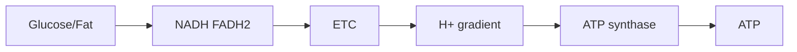

# Chuyển hóa, Hô hấp tế bào và Quang hợp — Metabolism, Respiration and Photosynthesis (대사, 세포호흡과 광합성)

Chapter trước cho thấy cell phải tiêu năng lượng liên tục để giữ ion gradient, vận chuyển cargo, sửa cấu trúc và tổng hợp molecule. Vì vậy câu hỏi tự nhiên tiếp theo là: **ATP được tái tạo bằng cách nào, và năng lượng đi vào mạng lưới sống từ đâu?**

Câu trả lời không nằm ở một reaction duy nhất. Cell tổ chức energy conversion thành chuỗi nhiều bước: fuel hoặc light → electron carrier → membrane gradient → ATP → cellular work. Chapter này xây chuỗi đó từ first principles và cho thấy hô hấp tế bào với quang hợp thực ra là hai hướng bổ sung của cùng một logic redox–gradient.

> **Mental model:** metabolism là một mạng lưới chuyển đổi matter và free energy. Respiration lấy electron từ fuel và “thả” chúng xuống mức energy thấp để tạo ATP. Photosynthesis dùng photon nâng electron lên mức energy cao rồi dùng chúng để xây reduced carbon.

## 1. Metabolism là network, không phải một “đường phản ứng”

**Chuyển hóa (metabolism / 대사)** gồm hàng nghìn reaction liên kết. Một molecule trung gian có thể đi sang nhiều pathway khác nhau tùy state của cell.

Glucose không nhất thiết “đi thẳng tới ATP”. Nó có thể:

- đi vào glycolysis;
- tạo glycogen để storage;
- cung cấp carbon skeleton cho amino acid;
- đi vào pentose-phosphate pathway để tạo NADPH và ribose;
- được chuyển thành lipid khi energy dư.

Vì vậy metabolism nên nhìn như **network có branch và feedback**, không phải conveyor belt một chiều.

## 2. Catabolism và anabolism cần được nối bằng energy coupling

**Catabolism (이화작용)** phân giải molecule và thường tạo ATP/reducing equivalents. **Anabolism (동화작용)** xây molecule mới và cần ATP/reducing power.

Hai chiều liên kết qua currency như ATP, NADH/NADPH và precursor.

Nếu catabolism chạy mà anabolism không dùng material, resource có thể tích tụ hoặc bị thải. Nếu anabolism chạy mà không có energy source, process dừng. Cell phải cân bằng flux theo nutrient và demand.

## 3. Oxidation state: vì sao molecule giàu C–H thường là fuel tốt?

Carbon gắn nhiều hydrogen thường ở trạng thái reduced hơn; khi bị oxidized về CO₂, electron được chuyển sang acceptor electronegative hơn như oxygen. Chênh lệch này giải phóng free energy.

Fatty acid có nhiều C–H bond nên energy density cao. Đây là một lý do lipid là long-term energy storage tốt hơn carbohydrate theo khối lượng.

Nhưng cell không “đốt” fuel như lửa. Nó chia oxidation thành nhiều enzyme-controlled step để capture energy.

## 4. Glycolysis: bước đầu tách glucose trong cytosol

**Glycolysis (đường phân / 해당과정)** xảy ra trong cytosol và không trực tiếp cần oxygen.

Một glucose 6-carbon được chuyển thành hai pyruvate 3-carbon. Pathway có investment phase dùng ATP và payoff phase tạo ATP/NADH.

Net đơn giản:

\[
Glucose + 2NAD^+ + 2ADP + 2P_i
\rightarrow 2Pyruvate + 2NADH + 2ATP + ...
\]

Điểm cần hiểu không phải thuộc từng enzyme ngay từ đầu, mà là logic:

1. phosphorylate glucose để giữ/activate carbon trong cell;
2. split 6C thành hai unit 3C;
3. oxidize intermediate và capture electron vào NADH;
4. transfer phosphate trực tiếp để tạo ATP.

Tạo ATP bằng direct phosphate transfer gọi là **substrate-level phosphorylation**.

## 5. Glycolysis là pathway cổ và linh hoạt

Glycolysis diễn ra trong cytosol và có ở gần như mọi domain of life, gợi ý pathway rất cổ trong evolutionary history.

Nó cũng cung cấp intermediate cho biosynthesis, không chỉ ATP. Vì vậy nếu chỉ nhìn glycolysis như “10 bước tạo 2 ATP”, ta bỏ mất vai trò central hub của nó.

## 6. Pyruvate là ngã rẽ metabolic

Sau glycolysis, pyruvate có nhiều fate.

Khi oxidative respiration phù hợp, pyruvate vào mitochondrion và chuyển thành acetyl-CoA. Khi electron transport không tái oxidize NADH đủ nhanh, cell có thể dùng fermentation để regenerate NAD⁺ cho glycolysis.

Pyruvate cũng có thể đi vào biosynthetic pathway.

Metabolism chọn route dựa trên oxygen, enzyme expression, energy demand và tissue context.

## 7. Fermentation: mục tiêu chính là tái sinh NAD⁺

Một misconception phổ biến là fermentation “để tạo thêm ATP”. Thực tế ATP trong fermentation chủ yếu đến từ glycolysis. Vai trò quan trọng của fermentation là **regenerate NAD⁺** để glycolysis tiếp tục.

Trong lactic fermentation:

\[
Pyruvate + NADH \rightarrow Lactate + NAD^+
\]

Trong yeast alcohol fermentation, pyruvate cuối cùng tạo ethanol và CO₂ đồng thời regenerate NAD⁺.

Khi exercise intense, lactate production tăng không đơn giản vì “thiếu oxygen hoàn toàn”; nó phản ánh balance giữa glycolytic flux, mitochondrial oxidation và redox state.

## 8. Acetyl-CoA: junction giữa carbohydrate, fat và amino acid

Pyruvate oxidation tạo **acetyl-CoA**, CO₂ và NADH. Fatty acid beta-oxidation cũng tạo acetyl-CoA. Một số amino acid có thể feed vào acetyl-CoA hoặc TCA intermediate.

Vì vậy acetyl-CoA là metabolic junction nối nhiều nutrient.

Điều này giải thích tại sao các macronutrient không tồn tại như ba “đường năng lượng” hoàn toàn tách biệt.

## 9. Citric acid cycle: mục tiêu lớn là lấy electron, không phải tạo nhiều ATP trực tiếp

**Chu trình citric acid/TCA/Krebs (시트르산 회로)** oxy hóa acetyl group thành CO₂ và chuyển electron sang NADH/FADH₂.

Mỗi vòng tạo nhiều reduced carrier nhưng chỉ ít ATP/GTP trực tiếp. Vì vậy nếu hỏi “TCA tạo bao nhiêu ATP?”, cần nhớ phần lớn ATP tới sau qua oxidative phosphorylation.

TCA còn cung cấp intermediate cho amino acid, heme và biosynthesis khác. Khi intermediate bị rút ra, anaplerotic reaction bổ sung chúng.

Một lần nữa, pathway là network intersection chứ không phải chỉ energy line.

## 10. Electron transport chain: electron đi xuống “bậc thang” energy

NADH và FADH₂ mang electron tới **electron transport chain, ETC (전자전달계)** ở inner mitochondrial membrane.

Electron được transfer qua series complex. Free energy từ transfer được dùng để pump H⁺ từ matrix sang intermembrane space.

Kết quả: electron flow được chuyển thành **proton-motive force** gồm pH gradient và electrical potential.

```text
NADH/FADH2
   ↓ electron
ETC complexes
   ↓ energy coupling
H+ pumped across membrane
   ↓
proton-motive force
```

Membrane chapter đã cho ta active transport và electrochemical gradient. Bây giờ ta thấy gradient được dùng như energy intermediate.

## 11. Oxygen là final electron acceptor, không phải “nguyên liệu tạo ATP trực tiếp”

Ở aerobic respiration, oxygen nhận electron cuối ETC và cùng H⁺ tạo water.

Nếu không có oxygen, electron chain bị backlog, NADH khó được oxidize về NAD⁺ và upstream pathway bị ảnh hưởng.

Vì vậy oxygen cần thiết cho high-yield oxidative metabolism không phải vì ATP synthase “ăn oxygen”, mà vì oxygen giữ electron flow tiếp tục.

## 12. Chemiosmosis: một trong những idea thống nhất mạnh nhất của Biology

**Chemiosmosis (화학삼투)** là coupling giữa ion gradient và ATP synthesis.

H⁺ đã được pump ra một phía membrane có tendency quay về theo electrochemical gradient. ATP synthase cho proton đi qua và dùng energy để phosphorylate ADP:

\[
ADP + P_i \rightarrow ATP
\]

ATP synthase là molecular rotary machine: proton flow drive rotation/conformational change.

> **Mental model:** ETC không “tạo ATP” trực tiếp. ETC tạo gradient; gradient chạy ATP synthase; ATP synthase tạo ATP.

Logic này xuất hiện cả respiration và photosynthesis.

## 13. Oxidative phosphorylation và số ATP không phải hằng số tuyệt đối

Textbook đôi khi cho con số ATP/glucose cố định. Thực tế yield phụ thuộc shuttle system, proton leak, coupling efficiency và cellular condition.

Điều quan trọng hơn là understanding architecture:



Biology thường ưu tiên correct mechanism hơn memorizing một integer dễ thay đổi theo assumption.

## 14. Mitochondria vừa là power hub vừa là signaling hub

Mitochondria không chỉ tạo ATP. Chúng tham gia apoptosis, calcium handling, ROS signaling và biosynthetic metabolism.

Reactive oxygen species có thể gây damage khi quá mức nhưng cũng có signaling role ở concentration thấp.

Mitochondrial function vì vậy gắn với aging, metabolism và cell death, nhưng không nên giản hóa thành “mitochondria là nhà máy năng lượng”.

## 15. Fat metabolism: vì sao fasting và exercise dài dùng nhiều lipid hơn?

Triglyceride được breakdown thành fatty acid và glycerol. Fatty acid vào mitochondria và qua **beta-oxidation** tạo acetyl-CoA, NADH, FADH₂.

Vì fatty acid rất reduced, oxidation cho nhiều electron carrier và ATP.

Nhưng fuel selection phụ thuộc intensity, hormonal state, oxygen delivery và tissue. Exercise physiology không thể tóm gọn bằng một câu “đốt mỡ sau X phút”.

## 16. Photosynthesis: energy của biosphere đi vào chemical network như thế nào?

Hầu hết ecosystem phụ thuộc trực tiếp hoặc gián tiếp vào photosynthetic organisms.

**Quang hợp (photosynthesis / 광합성)** không đơn giản là “cây tạo oxygen”. Nó dùng light energy để tạo ATP và reducing power, sau đó dùng chúng để reduce CO₂ thành organic carbon.

Hai phần lớn:

1. light reactions ở thylakoid membrane;
2. carbon fixation/Calvin cycle ở stroma.

## 17. Photon và chlorophyll: light được capture như thế nào?

**Chlorophyll (엽록소)** hấp thụ photon ở một số wavelength. Photon làm electron trong pigment chuyển lên trạng thái energy cao hơn.

Excited electron được transfer vào electron transport pathway. Pigment không “biến light thành glucose trực tiếp”; nó khởi động electron flow.

Photosystem được tổ chức thành antenna pigment và reaction center, tăng khả năng capture energy.

## 18. Photosystem II và water splitting

Ở oxygenic photosynthesis, Photosystem II lấy electron từ water:

\[
2H_2O \rightarrow O_2 + 4H^+ + 4e^-
\]

Oxygen mà plant release đến từ water, không trực tiếp từ CO₂.

Electron sau đó đi qua transport chain; energy được dùng tạo proton gradient across thylakoid membrane.

Lại là cùng architecture membrane–gradient.

## 19. Photosystem I và NADPH

Electron đến Photosystem I được photon kích thích lần nữa và cuối cùng góp phần reduce NADP⁺ thành NADPH.

NADPH mang reducing power cho carbon fixation.

Light reaction do đó tạo hai resource chính: ATP và NADPH.

## 20. Photophosphorylation: ATP synthase xuất hiện lại

Proton concentration cao trong thylakoid lumen tạo gradient. H⁺ đi qua chloroplast ATP synthase về stroma, drive ATP production.

Mechanism tương tự mitochondria nhưng orientation và source electron khác.

Đây là một trong những evidence đẹp cho idea conserved molecular mechanism qua evolution.

## 21. Calvin cycle: CO₂ được đưa vào organic molecule

**Calvin cycle (캘빈 회로)** dùng ATP và NADPH để fix CO₂ vào carbon skeleton.

Enzyme Rubisco catalyze bước carboxylation. Product được processing qua nhiều step để tạo triose phosphate; một phần carbon rời cycle để xây carbohydrate và molecule khác, phần còn lại regenerate RuBP.

Điểm quan trọng: plant “lấy khối lượng” chủ yếu từ carbon dioxide, không phải từ đất. Soil cung cấp mineral/water; carbon skeleton lớn đến từ atmospheric CO₂.

## 22. Rubisco và photorespiration: evolution làm việc với constraint lịch sử

Rubisco có thể bind O₂ thay CO₂, đặc biệt trong condition nóng/CO₂ thấp, dẫn đến **photorespiration** và giảm efficiency carbon fixation.

Tại sao evolution không tạo enzyme hoàn hảo? Vì adaptation bị ràng buộc bởi history, trade-off và existing structure.

C4 và CAM plants phát triển strategy giúp concentrate CO₂ hoặc tách timing để giảm photorespiration/water loss.

Đây là nơi metabolism nối evolution và ecology.

## 23. Respiration và photosynthesis không phải hai equation “đối nghịch” hoàn toàn

Ở mức tổng quát, photosynthesis lưu energy trong reduced carbon; respiration lấy energy từ reduced carbon. Nhưng mechanism không đơn giản đảo ngược.

Cả hai dùng:

- electron transport chain;
- membrane;
- proton gradient;
- ATP synthase;
- redox carrier.

Điều này gợi ý common evolutionary origin của chemiosmotic energy conversion.

## 24. Metabolic regulation: cell biết lúc nào cần tạo ATP?

ATP demand thay đổi liên tục. Pathway được regulation bởi substrate availability, allosteric enzyme, phosphorylation, hormone và gene expression.

Khi ATP/energy charge cao, một số catabolic pathway giảm. Khi ADP/AMP tăng, energy-generating pathway được stimulate.

Ở organism scale, insulin, glucagon, adrenaline và thyroid hormone phối hợp metabolic state giữa tissue.

Cellular metabolism vì vậy nằm trong larger control network.

## 25. Fed state và fasting state: cùng network nhưng flux đổi hướng

Sau meal, insulin favor glucose uptake/storage, glycogen synthesis và lipogenesis ở context thích hợp. Khi fasting, glucagon và other signal thúc đẩy glycogen breakdown, gluconeogenesis và mobilization fuel.

Không có “metabolism mode” cố định. Cùng pathway network đổi flux theo signal và resource.

Đây là reason signaling chapter phải đến ngay sau metabolism.

## 26. Cancer metabolism: growth đổi yêu cầu metabolic network

Rapidly proliferating cell cần không chỉ ATP mà còn nucleotide, lipid, amino acid và reducing power để xây biomass.

Một số cancer cell tăng glycolytic flux ngay cả khi oxygen có, pattern thường liên hệ Warburg effect. Nhưng không nên hiểu đơn giản “cancer chỉ dùng glycolysis”; mitochondrial metabolism vẫn quan trọng ở nhiều cancer.

Điểm lesson là metabolic phenotype phản ánh **mục tiêu của cell**: maintenance khác growth.

## 27. Case study: cyanide nguy hiểm vì đánh vào electron flow

Cyanide ức chế cytochrome c oxidase trong mitochondrial ETC. Electron flow tới oxygen bị chặn, proton pumping giảm, oxidative phosphorylation collapse.

Blood có thể vẫn mang oxygen nhưng cell không sử dụng electron acceptor pathway bình thường.

Chuỗi causal:

```text
ETC inhibited
→ proton gradient falls
→ ATP production falls
→ energy-dependent process fail
→ organ dysfunction
```

Mechanism giải thích toxicity tốt hơn câu “cyanide làm thiếu oxygen”.

## 28. Case study: uncoupling và heat

Nếu proton quay về matrix mà không qua ATP synthase, gradient energy bị dissipate thành heat. Brown adipose tissue có uncoupling protein giúp thermogenesis.

Vì vậy same gradient có thể được channel vào ATP production hoặc heat depending protein architecture.

Structure và energy flow gặp nhau.

## 29. Common misconceptions

“Respiration = breathing” sai. Breathing đưa gas ở organism scale; cellular respiration là metabolic process.

“Oxygen được dùng trong glycolysis” sai; glycolysis không trực tiếp cần oxygen.

“Fermentation tạo nhiều ATP thay respiration” sai; fermentation yield ATP thấp và chủ yếu regenerate NAD⁺.

“Plant chỉ photosynthesize, animal mới respire” sai; plant cell cũng có mitochondria và cellular respiration.

“ATP là long-term storage” sai; lipid/glycogen là storage lớn hơn, ATP là rapidly cycling currency.

“CO₂ trong plant chỉ là waste” sai; CO₂ là carbon source cho photosynthesis.

## 30. Bridge: có energy rồi, ai quyết định khi nào pathway chạy?

Cell không thể để mọi enzyme, transporter, growth pathway và division machinery chạy tự do. Nó cần sense nutrient, damage, signal từ neighboring cell và internal energy state.

Điều đó dẫn tới [[02_cell_signaling_and_cell_cycle]]. Receptor sẽ chuyển information từ outside vào signaling network; kinase/phosphatase đổi activity protein; feedback giữ control; cell-cycle checkpoint quyết định có divide hay không.

Sau đó, câu hỏi sâu hơn sẽ xuất hiện: signaling thay đổi protein nhanh, nhưng cell đổi chương trình dài hạn bằng cách nào? Câu trả lời sẽ dẫn sang gene expression trong genetics.

> **Mental model cuối chapter:** energy conversion của life dựa trên một architecture lặp lại — electron flow tạo ion gradient, gradient drive molecular machine. Metabolism không phải bảng reaction độc lập; nó là network được regulation và được nối với signaling, physiology, ecology và evolution.