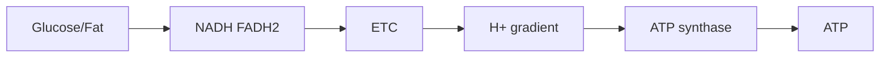

# Chuyển hóa, Hô hấp tế bào và Quang hợp — Metabolism, Respiration and Photosynthesis (대사, 세포호흡과 광합성)

> **Mạch đọc:** [README](../README.md) là bản đồ owner của **Chuyển hóa, Hô hấp tế bào và Quang hợp — Metabolism, Respiration and Photosynthesis (대사, 세포호흡과 광합성)**. Route đi từ mạng phản ứng và redox → ghép năng lượng/ATP → hô hấp tế bào và gradient proton → quang hợp, carbon fixation và flux regulation, để năng lượng tế bào được đọc như dòng electron có điều khiển.

Chapter trước cho thấy cell phải tiêu năng lượng liên tục để giữ chênh lệch ion (ion gradient), vận chuyển cargo, sửa cấu trúc và tổng hợp molecule. Vì vậy câu hỏi tự nhiên tiếp theo là: **ATP được tái tạo bằng cách nào, và năng lượng đi vào mạng lưới sống từ đâu?**

Câu trả lời không nằm ở một reaction duy nhất. Cell tổ chức năng lượng (energy / 에너지) conversion thành chuỗi nhiều bước: fuel hoặc light → chất mang electron (electron carrier) → màng (membrane) chênh lệch (gradient) → ATP → cellular công việc (work / 작업). Chapter này xây chuỗi đó từ các nguyên lý nền tảng (first principles / 제일 원리) và cho thấy hô hấp tế bào với quang hợp thực ra là hai hướng bổ sung của cùng một lô-gic (logic / 논리) redox–chênh lệch (gradient).

> **mô hình tư duy (mental model / 사고 모델):** metabolism là một mạng lưới chuyển đổi matter và năng lượng tự do (free energy). Respiration lấy electron từ fuel và “thả” chúng xuống mức năng lượng (energy / 에너지) thấp để tạo ATP. Quang hợp (photosynthesis) dùng photon nâng electron lên mức năng lượng (energy / 에너지) cao rồi dùng chúng để xây reduced carbon.

## 1. Metabolism là mạng lưới (network), không phải một “đường phản ứng”

**Chuyển hóa (metabolism / 대사)** gồm hàng nghìn reaction liên kết. Một molecule trung gian có thể đi sang nhiều pathway khác nhau tùy trạng thái (state / 상태) của cell.

Glucose không nhất thiết “đi thẳng tới ATP”. Nó có thể:

- đi vào đường phân (glycolysis);
- tạo glycogen để lưu trữ (storage / 저장소);
- cung cấp khung carbon (carbon skeleton) cho axit amin (amino acid);
- đi vào pentose-phosphate pathway để tạo NADPH và ribose;
- được chuyển thành lipid khi năng lượng (energy / 에너지) dư.

Vì vậy metabolism nên nhìn như **mạng (network / 네트워크) có branch và phản hồi (feedback / 피드백)**, không phải conveyor belt một chiều.

> **Chuyển mạch:** Metabolism là network có nhiều branch; catabolism giải phóng năng lượng, anabolism tiêu dùng năng lượng, và coupling nối hai flux qua ATP/redox carriers.

## 2. Dị hóa (catabolism) và đồng hóa (anabolism) cần được nối bằng ghép năng lượng (energy coupling)

**Dị hóa (이화작용)** phân giải molecule và thường tạo ATP/các đương lượng khử (reducing equivalents). **Đồng hóa (동화작용)** xây molecule mới và cần ATP/khả năng khử (reducing power).

Hai chiều liên kết qua currency như ATP, NADH/NADPH và tiền chất (precursor).

Nếu dị hóa chạy mà đồng hóa không dùng material, tài nguyên (resource / 자원) có thể tích tụ hoặc bị thải. Nếu đồng hóa chạy mà không có năng lượng (energy / 에너지) nguồn (source / 소스), tiến trình (process / 프로세스) dừng. Cell phải cân bằng flux theo nutrient và nhu cầu (demand).

> **Chuyển mạch:** Ở chặng này của **Chuyển hóa, Hô hấp tế bào và Quang hợp — Metabolism, Respiration and Photosynthesis (대사, 세포호흡과 광합성)**, **3. Trạng thái oxy hóa (oxidation state): vì sao phân tử (molecule) giàu C–H thường là fuel tốt?** tiếp nhận điểm tựa từ **2. Dị hóa (catabolism) và đồng hóa (anabolism) cần được nối bằng ghép năng lượng (energy coupling)** nhưng đổi góc nhìn sang câu hỏi của chính nó; đọc liền hai mục để thấy mối quan hệ đó. Từ đây, **4. Đường phân: bước đầu tách glucose trong cytosol** sẽ cho biết hệ quả hoặc giới hạn ấy hiện ra ở đâu.

## 3. Trạng thái oxy hóa (oxidation state): vì sao phân tử (molecule) giàu C–H thường là fuel tốt?

Carbon gắn nhiều hydrogen thường ở trạng thái reduced hơn; khi bị oxidized về CO₂, electron được chuyển sang acceptor electronegative hơn như oxy (oxygen). Chênh lệch này giải phóng năng lượng tự do.

Axit béo (fatty acid) có nhiều C–H bond nên năng lượng (energy / 에너지) density cao. Đây là một lý do lipid là dự trữ năng lượng dài hạn (long-term energy storage) tốt hơn carbohydrate theo khối lượng.

Nhưng cell không “đốt” fuel như lửa. Nó chia oxidation thành nhiều enzyme-controlled step để capture năng lượng (energy / 에너지).

> **Chuyển mạch:** Đặt trong câu hỏi lớn của **Chuyển hóa, Hô hấp tế bào và Quang hợp — Metabolism, Respiration and Photosynthesis (대사, 세포호흡과 광합성)**, **4. Đường phân: bước đầu tách glucose trong cytosol** tiếp nhận điểm tựa từ **3. Trạng thái oxy hóa (oxidation state): vì sao phân tử (molecule) giàu C–H thường là fuel tốt?** nhưng đổi góc nhìn sang câu hỏi của chính nó; đọc liền hai mục để thấy mối quan hệ đó. Từ đây, **5. Đường phân là pathway cổ và linh hoạt** sẽ cho biết hệ quả hoặc giới hạn ấy hiện ra ở đâu.

## 4. Đường phân: bước đầu tách glucose trong cytosol

**Đường phân (đường phân / 해당과정)** xảy ra trong cytosol và không trực tiếp cần oxygen.

Một glucose 6-carbon được chuyển thành hai pyruvate 3-carbon. Pathway có investment phase dùng ATP và payoff phase tạo ATP/NADH.

Net đơn giản:

\[
Glucose + 2NAD^+ + 2ADP + 2P_i
\rightarrow 2Pyruvate + 2NADH + 2ATP + ...
\]

Điểm cần hiểu không phải thuộc từng enzyme ngay từ đầu, mà là lôgic (logic):

1. phosphorylate glucose để giữ/activate carbon trong tế bào (cell);
2. split 6C thành hai đơn vị (unit / 단위) 3C;
3. oxidize intermediate và capture electron vào NADH;
4. transfer phosphate trực tiếp để tạo ATP.

Tạo ATP bằng direct phosphate transfer gọi là **cơ chất (substrate)-level phosphorylation**.

> **Chuyển mạch:** Trong **Chuyển hóa, Hô hấp tế bào và Quang hợp — Metabolism, Respiration and Photosynthesis (대사, 세포호흡과 광합성)**, **4. Đường phân: bước đầu tách glucose trong cytosol** xác định đầu vào; **5. Đường phân là pathway cổ và linh hoạt** giải thích bước vận hành tạo ra kết quả kế tiếp. Từ đây, **6. Pyruvate là ngã rẽ metabolic** sẽ cho biết hệ quả hoặc giới hạn ấy hiện ra ở đâu.

## 5. Đường phân là pathway cổ và linh hoạt

Đường phân diễn ra trong cytosol và có ở gần như mọi lĩnh vực (domain / 도메인) of life, gợi ý pathway rất cổ trong evolutionary lịch sử (history / 이력).

Nó cũng cung cấp intermediate cho biosynthesis, không chỉ ATP. Vì vậy nếu chỉ nhìn đường phân như “10 bước tạo 2 ATP”, ta bỏ mất vai trò central hub của nó.

> **Chuyển mạch:** Ở chặng này của **Chuyển hóa, Hô hấp tế bào và Quang hợp — Metabolism, Respiration and Photosynthesis (대사, 세포호흡과 광합성)**, **5. Đường phân là pathway cổ và linh hoạt** xác định đầu vào; **6. Pyruvate là ngã rẽ metabolic** giải thích bước vận hành tạo ra kết quả kế tiếp. Từ đây, **7. Lên men: mục tiêu chính là tái sinh NAD⁺** sẽ cho biết hệ quả hoặc giới hạn ấy hiện ra ở đâu.

## 6. Pyruvate là ngã rẽ metabolic

Sau đường phân, pyruvate có nhiều fate.

Khi oxidative respiration phù hợp, pyruvate vào mitochondrion và chuyển thành acetyl-CoA. Khi electron vận chuyển (transport / 전송) không tái oxidize NADH đủ nhanh, cell có thể dùng lên men (fermentation) để regenerate NAD⁺ cho đường phân.

Pyruvate cũng có thể đi vào biosynthetic pathway.

Metabolism chọn tuyến (route / 경로) dựa trên oxygen, enzyme expression, năng lượng (energy / 에너지) demand và mô (tissue) bối cảnh (context).

> **Chuyển mạch:** Đặt trong câu hỏi lớn của **Chuyển hóa, Hô hấp tế bào và Quang hợp — Metabolism, Respiration and Photosynthesis (대사, 세포호흡과 광합성)**, **7. Lên men: mục tiêu chính là tái sinh NAD⁺** tiếp nhận điểm tựa từ **6. Pyruvate là ngã rẽ metabolic** nhưng đổi góc nhìn sang câu hỏi của chính nó; đọc liền hai mục để thấy mối quan hệ đó. Từ đây, **8. Acetyl-CoA: junction giữa carbohydrate, fat và axit amin** sẽ cho biết hệ quả hoặc giới hạn ấy hiện ra ở đâu.

## 7. Lên men: mục tiêu chính là tái sinh NAD⁺

Một misconception phổ biến là lên men “để tạo thêm ATP”. Thực tế ATP trong lên men chủ yếu đến từ đường phân. Vai trò quan trọng của lên men là **regenerate NAD⁺** để đường phân tiếp tục.

Trong lactic lên men:

\[
Pyruvate + NADH \rightarrow Lactate + NAD^+
\]

Trong yeast alcohol lên men, pyruvate cuối cùng tạo ethanol và CO₂ đồng thời regenerate NAD⁺.

Khi exercise intense, lactate môi trường vận hành (production / 운영 환경) tăng không đơn giản vì “thiếu oxygen hoàn toàn”; nó phản ánh balance giữa glycolytic flux, mitochondrial oxidation và redox trạng thái (state / 상태).

> **Chuyển mạch:** Trong **Chuyển hóa, Hô hấp tế bào và Quang hợp — Metabolism, Respiration and Photosynthesis (대사, 세포호흡과 광합성)**, **8. Acetyl-CoA: junction giữa carbohydrate, fat và axit amin** tiếp nhận điểm tựa từ **7. Lên men: mục tiêu chính là tái sinh NAD⁺** nhưng đổi góc nhìn sang câu hỏi của chính nó; đọc liền hai mục để thấy mối quan hệ đó. Từ đây, **9. Chu trình axit citric (citric acid cycle): mục tiêu lớn là lấy electron, không phải tạo nhiều ATP trực tiếp** sẽ cho biết hệ quả hoặc giới hạn ấy hiện ra ở đâu.

## 8. Acetyl-CoA: junction giữa carbohydrate, fat và axit amin

Oxy hóa pyruvat (pyruvate oxidation) tạo **acetyl-CoA**, CO₂ và NADH. Axit béo beta-oxidation cũng tạo acetyl-CoA. Một số axit amin có thể feed vào acetyl-CoA hoặc TCA intermediate.

Vì vậy acetyl-CoA là metabolic junction nối nhiều nutrient.

Điều này giải thích tại sao các macronutrient không tồn tại như ba “đường năng lượng” hoàn toàn tách biệt.

> **Chuyển mạch:** Ở chặng này của **Chuyển hóa, Hô hấp tế bào và Quang hợp — Metabolism, Respiration and Photosynthesis (대사, 세포호흡과 광합성)**, **9. Chu trình axit citric (citric acid cycle): mục tiêu lớn là lấy electron, không phải tạo nhiều ATP trực tiếp** tiếp nhận điểm tựa từ **8. Acetyl-CoA: junction giữa carbohydrate, fat và axit amin** nhưng đổi góc nhìn sang câu hỏi của chính nó; đọc liền hai mục để thấy mối quan hệ đó. Từ đây, **10. Chuỗi chuyền electron (electron transport chain): electron đi xuống “bậc thang” năng lượng (energy / 에너지)** sẽ cho biết hệ quả hoặc giới hạn ấy hiện ra ở đâu.

## 9. Chu trình axit citric (citric acid cycle): mục tiêu lớn là lấy electron, không phải tạo nhiều ATP trực tiếp

**Chu trình citric acid/TCA/Krebs (시트르산 회로)** oxy hóa acetyl group thành CO₂ và chuyển electron sang NADH/FADH₂.

Mỗi vòng tạo nhiều reduced carrier nhưng chỉ ít ATP/GTP trực tiếp. Vì vậy nếu hỏi “TCA tạo bao nhiêu ATP?”, cần nhớ phần lớn ATP tới sau qua phosphoryl hóa oxy hóa (oxidative phosphorylation).

TCA còn cung cấp intermediate cho axit amin, heme và biosynthesis khác. Khi intermediate bị rút ra, anaplerotic reaction bổ sung chúng.

Một lần nữa, pathway là mạng (network / 네트워크) intersection chứ không phải chỉ năng lượng (energy / 에너지) line.

> **Chuyển mạch:** Đặt trong câu hỏi lớn của **Chuyển hóa, Hô hấp tế bào và Quang hợp — Metabolism, Respiration and Photosynthesis (대사, 세포호흡과 광합성)**, **9. Chu trình axit citric (citric acid cycle): mục tiêu lớn là lấy electron, không phải tạo nhiều ATP trực tiếp** xác định đầu vào; **10. Chuỗi chuyền electron (electron transport chain): electron đi xuống “bậc thang” năng lượng (energy / 에너지)** giải thích bước vận hành tạo ra kết quả kế tiếp. Từ đây, **11. Oxygen là final chất nhận electron (electron acceptor), không phải “nguyên liệu tạo ATP trực tiếp”** sẽ cho biết hệ quả hoặc giới hạn ấy hiện ra ở đâu.

## 10. Chuỗi chuyền electron (electron transport chain): electron đi xuống “bậc thang” năng lượng (energy / 에너지)

NADH và FADH₂ mang electron tới **chuỗi chuyền electron, ETC (전자전달계)** ở inner mitochondrial membrane.

Electron được transfer qua series complex. Năng lượng tự do từ transfer được dùng để pump H⁺ từ ma trận (matrix / 행렬) sang intermembrane không gian (space / 공간).

Kết quả: electron luồng (flow / 흐름) được chuyển thành **proton-motive force** gồm pH độ dốc (gradient / 기울기) và electrical potential.

```text
NADH/FADH2
   ↓ electron
ETC complexes
   ↓ energy coupling
H+ pumped across membrane
   ↓
proton-motive force
```

Màng chương (chapter) đã cho ta vận chuyển chủ động (active transport) và chênh lệch điện hóa (electrochemical gradient). Bây giờ ta thấy độ dốc (gradient / 기울기) được dùng như năng lượng (energy / 에너지) intermediate.

> **Chuyển mạch:** Trong **Chuyển hóa, Hô hấp tế bào và Quang hợp — Metabolism, Respiration and Photosynthesis (대사, 세포호흡과 광합성)**, **10. Chuỗi chuyền electron (electron transport chain): electron đi xuống “bậc thang” năng lượng (energy / 에너지)** xác định đầu vào; **11. Oxygen là final chất nhận electron (electron acceptor), không phải “nguyên liệu tạo ATP trực tiếp”** giải thích bước vận hành tạo ra kết quả kế tiếp. Từ đây, **12. Thẩm thấu hóa học (chemiosmosis): một trong những idea thống nhất mạnh nhất của Biology** sẽ cho biết hệ quả hoặc giới hạn ấy hiện ra ở đâu.

## 11. Oxygen là final chất nhận electron (electron acceptor), không phải “nguyên liệu tạo ATP trực tiếp”

Ở aerobic respiration, oxygen nhận electron cuối ETC và cùng H⁺ tạo nước (water).

Nếu không có oxy, electron chuỗi (chain / 사슬) bị backlog, NADH khó được oxidize về NAD⁺ và upstream pathway bị ảnh hưởng.

Vì vậy oxygen cần thiết cho high-yield oxidative metabolism không phải vì ATP synthase (ATP synthase) “ăn oxygen”, mà vì oxy giữ electron luồng (flow / 흐름) tiếp tục.

> **Chuyển mạch:** Ở chặng này của **Chuyển hóa, Hô hấp tế bào và Quang hợp — Metabolism, Respiration and Photosynthesis (대사, 세포호흡과 광합성)**, **12. Thẩm thấu hóa học (chemiosmosis): một trong những idea thống nhất mạnh nhất của Biology** tiếp nhận điểm tựa từ **11. Oxygen là final chất nhận electron (electron acceptor), không phải “nguyên liệu tạo ATP trực tiếp”** nhưng đổi góc nhìn sang câu hỏi của chính nó; đọc liền hai mục để thấy mối quan hệ đó. Từ đây, **13. Phosphoryl hóa oxy hóa và số ATP không phải hằng số tuyệt đối** sẽ cho biết hệ quả hoặc giới hạn ấy hiện ra ở đâu.

## 12. Thẩm thấu hóa học (chemiosmosis): một trong những idea thống nhất mạnh nhất của Biology

**Thẩm thấu hóa học (화학삼투)** là coupling giữa chênh lệch ion và ATP synthesis.

H⁺ đã được pump ra một phía membrane có tendency quay về theo chênh lệch điện hóa. ATP synthase cho proton đi qua và dùng năng lượng (energy / 에너지) để phosphorylate ADP:

\[
ADP + P_i \rightarrow ATP
\]

ATP synthase là molecular rotary machine: proton luồng (flow / 흐름) drive rotation/conformational thay đổi (change / 변경).

> **Mô hình tư duy:** ETC không “tạo ATP” trực tiếp. ETC tạo chênh lệch; độ dốc (gradient / 기울기) chạy ATP synthase; ATP synthase tạo ATP.

Lô-gic (logic / 논리) này xuất hiện cả respiration và quang hợp.

> **Chuyển mạch:** Đặt trong câu hỏi lớn của **Chuyển hóa, Hô hấp tế bào và Quang hợp — Metabolism, Respiration and Photosynthesis (대사, 세포호흡과 광합성)**, **13. Phosphoryl hóa oxy hóa và số ATP không phải hằng số tuyệt đối** tiếp nhận điểm tựa từ **12. Thẩm thấu hóa học (chemiosmosis): một trong những idea thống nhất mạnh nhất của Biology** nhưng đổi góc nhìn sang câu hỏi của chính nó; đọc liền hai mục để thấy mối quan hệ đó. Từ đây, **14. Mitochondria vừa là power hub vừa là signaling hub** sẽ cho biết hệ quả hoặc giới hạn ấy hiện ra ở đâu.

## 13. Phosphoryl hóa oxy hóa và số ATP không phải hằng số tuyệt đối

Textbook đôi khi cho con số ATP/glucose cố định. Thực tế yield phụ thuộc shuttle hệ thống (system / 시스템), proton leak, coupling efficiency và cellular điều kiện (condition / 조건).

Điều quan trọng hơn là understanding kiến trúc (architecture / 아키텍처):


```mermaid
flowchart LR
A[Glucose/Fat] --> B[NADH FADH2]
B --> C[ETC]
C --> D[H+ gradient]
D --> E[ATP synthase]
E --> F[ATP]
```

Biology thường ưu tiên correct cơ chế (mechanism / 메커니즘) hơn memorizing một integer dễ thay đổi theo giả định (assumption / 가정).

> **Chuyển mạch:** Trong **Chuyển hóa, Hô hấp tế bào và Quang hợp — Metabolism, Respiration and Photosynthesis (대사, 세포호흡과 광합성)**, **14. Mitochondria vừa là power hub vừa là signaling hub** tiếp nhận điểm tựa từ **13. Phosphoryl hóa oxy hóa và số ATP không phải hằng số tuyệt đối** nhưng đổi góc nhìn sang câu hỏi của chính nó; đọc liền hai mục để thấy mối quan hệ đó. Từ đây, **15. Fat metabolism: vì sao fasting và exercise dài dùng nhiều lipid hơn?** sẽ cho biết hệ quả hoặc giới hạn ấy hiện ra ở đâu.

## 14. Mitochondria vừa là power hub vừa là signaling hub

Mitochondria không chỉ tạo ATP. Chúng tham gia apoptosis, calcium handling, ROS signaling và biosynthetic metabolism.

Reactive oxygen species có thể gây damage khi quá mức nhưng cũng có truyền tín hiệu (signaling) vai trò (role) ở concentration thấp.

Mitochondrial hàm (function / 함수) vì vậy gắn với aging, metabolism và chết tế bào (cell death), nhưng không nên giản hóa thành “mitochondria là nhà máy năng lượng”.

> **Chuyển mạch:** Ở chặng này của **Chuyển hóa, Hô hấp tế bào và Quang hợp — Metabolism, Respiration and Photosynthesis (대사, 세포호흡과 광합성)**, **15. Fat metabolism: vì sao fasting và exercise dài dùng nhiều lipid hơn?** tiếp nhận điểm tựa từ **14. Mitochondria vừa là power hub vừa là signaling hub** nhưng đổi góc nhìn sang câu hỏi của chính nó; đọc liền hai mục để thấy mối quan hệ đó. Từ đây, **16. Quang hợp: năng lượng (energy / 에너지) của biosphere đi vào chemical mạng (network / 네트워크) như thế nào?** sẽ cho biết hệ quả hoặc giới hạn ấy hiện ra ở đâu.

## 15. Fat metabolism: vì sao fasting và exercise dài dùng nhiều lipid hơn?

Triglyceride được breakdown thành axit béo và glycerol. Axit béo vào mitochondria và qua **beta-oxidation** tạo acetyl-CoA, NADH, FADH₂.

Vì axit béo rất reduced, oxidation cho nhiều chất mang electron và ATP.

Nhưng fuel selection phụ thuộc intensity, hormonal trạng thái (state / 상태), vận chuyển oxy (oxygen delivery) và mô. Tập luyện (exercise) physiology không thể tóm gọn bằng một câu “đốt mỡ sau X phút”.

> **Chuyển mạch:** Đặt trong câu hỏi lớn của **Chuyển hóa, Hô hấp tế bào và Quang hợp — Metabolism, Respiration and Photosynthesis (대사, 세포호흡과 광합성)**, **16. Quang hợp: năng lượng (energy / 에너지) của biosphere đi vào chemical mạng (network / 네트워크) như thế nào?** tiếp nhận điểm tựa từ **15. Fat metabolism: vì sao fasting và exercise dài dùng nhiều lipid hơn?** nhưng đổi góc nhìn sang câu hỏi của chính nó; đọc liền hai mục để thấy mối quan hệ đó. Từ đây, **17. Photon và diệp lục (chlorophyll): light được capture như thế nào?** sẽ cho biết hệ quả hoặc giới hạn ấy hiện ra ở đâu.

## 16. Quang hợp: năng lượng (energy / 에너지) của biosphere đi vào chemical mạng (network / 네트워크) như thế nào?

Hầu hết ecosystem phụ thuộc trực tiếp hoặc gián tiếp vào photosynthetic organisms.

**Quang hợp (photosynthesis / 광합성)** không đơn giản là “cây tạo oxy”. Nó dùng light năng lượng (energy / 에너지) để tạo ATP và khả năng khử, sau đó dùng chúng để reduce CO₂ thành organic carbon.

Hai phần lớn:

1. các pha sáng (light reactions) ở thylakoid membrane;
2. cố định carbon (carbon fixation)/Chu trình Calvin (Calvin cycle) ở stroma.

> **Chuyển mạch:** Trong **Chuyển hóa, Hô hấp tế bào và Quang hợp — Metabolism, Respiration and Photosynthesis (대사, 세포호흡과 광합성)**, **17. Photon và diệp lục (chlorophyll): light được capture như thế nào?** tiếp nhận điểm tựa từ **16. Quang hợp: năng lượng (energy / 에너지) của biosphere đi vào chemical mạng (network / 네트워크) như thế nào?** nhưng đổi góc nhìn sang câu hỏi của chính nó; đọc liền hai mục để thấy mối quan hệ đó. Từ đây, **18. Photosystem II và water splitting** sẽ cho biết hệ quả hoặc giới hạn ấy hiện ra ở đâu.

## 17. Photon và diệp lục (chlorophyll): light được capture như thế nào?

**Diệp lục (엽록소)** hấp thụ photon (photon) ở một số wavelength. Photon làm electron trong pigment chuyển lên trạng thái năng lượng (energy / 에너지) cao hơn.

Excited electron được transfer vào electron vận chuyển (transport / 전송) pathway. Pigment không “biến light thành glucose trực tiếp”; nó khởi động electron luồng (flow / 흐름).

Photosystem được tổ chức thành antenna pigment và reaction center, tăng khả năng capture năng lượng (energy / 에너지).

> **Chuyển mạch:** Ở chặng này của **Chuyển hóa, Hô hấp tế bào và Quang hợp — Metabolism, Respiration and Photosynthesis (대사, 세포호흡과 광합성)**, **18. Photosystem II và water splitting** tiếp nhận điểm tựa từ **17. Photon và diệp lục (chlorophyll): light được capture như thế nào?** nhưng đổi góc nhìn sang câu hỏi của chính nó; đọc liền hai mục để thấy mối quan hệ đó. Từ đây, **19. Photosystem I và NADPH** sẽ cho biết hệ quả hoặc giới hạn ấy hiện ra ở đâu.

## 18. Photosystem II và water splitting

Ở oxygenic quang hợp, Photosystem II lấy electron từ nước:

\[
2H_2O \rightarrow O_2 + 4H^+ + 4e^-
\]

Oxygen mà plant bản phát hành (release / 릴리스) đến từ nước, không trực tiếp từ CO₂.

Electron sau đó đi qua vận chuyển (transport / 전송) chuỗi (chain / 사슬); năng lượng được dùng tạo chênh lệch proton (proton gradient) across thylakoid membrane.

Lại là cùng kiến trúc (architecture / 아키텍처) màng–chênh lệch.

> **Chuyển mạch:** Đặt trong câu hỏi lớn của **Chuyển hóa, Hô hấp tế bào và Quang hợp — Metabolism, Respiration and Photosynthesis (대사, 세포호흡과 광합성)**, **19. Photosystem I và NADPH** tiếp nhận điểm tựa từ **18. Photosystem II và water splitting** nhưng đổi góc nhìn sang câu hỏi của chính nó; đọc liền hai mục để thấy mối quan hệ đó. Từ đây, **20. Quang phosphoryl hóa (photophosphorylation): ATP synthase xuất hiện lại** sẽ cho biết hệ quả hoặc giới hạn ấy hiện ra ở đâu.

## 19. Photosystem I và NADPH

Electron đến Photosystem I được photon kích thích lần nữa và cuối cùng góp phần reduce NADP⁺ thành NADPH.

NADPH mang khả năng khử cho cố định carbon.

Pha sáng (light reaction) do đó tạo hai tài nguyên (resource / 자원) chính: ATP và NADPH.

> **Chuyển mạch:** Trong **Chuyển hóa, Hô hấp tế bào và Quang hợp — Metabolism, Respiration and Photosynthesis (대사, 세포호흡과 광합성)**, **20. Quang phosphoryl hóa (photophosphorylation): ATP synthase xuất hiện lại** tiếp nhận điểm tựa từ **19. Photosystem I và NADPH** nhưng đổi góc nhìn sang câu hỏi của chính nó; đọc liền hai mục để thấy mối quan hệ đó. Từ đây, **21. Chu trình Calvin: CO₂ được đưa vào phân tử hữu cơ (organic molecule)** sẽ cho biết hệ quả hoặc giới hạn ấy hiện ra ở đâu.

## 20. Quang phosphoryl hóa (photophosphorylation): ATP synthase xuất hiện lại

Proton concentration cao trong thylakoid lumen tạo chênh lệch. H⁺ đi qua chloroplast ATP synthase về stroma, drive ATP môi trường vận hành (production / 운영 환경).

Cơ chế (mechanism / 메커니즘) tương tự mitochondria nhưng orientation và nguồn (source / 소스) electron khác.

Đây là một trong những bằng chứng (evidence / 증거) đẹp cho idea conserved molecular cơ chế (mechanism / 메커니즘) qua tiến hóa (evolution).

> **Chuyển mạch:** Ở chặng này của **Chuyển hóa, Hô hấp tế bào và Quang hợp — Metabolism, Respiration and Photosynthesis (대사, 세포호흡과 광합성)**, **21. Chu trình Calvin: CO₂ được đưa vào phân tử hữu cơ (organic molecule)** tiếp nhận điểm tựa từ **20. Quang phosphoryl hóa (photophosphorylation): ATP synthase xuất hiện lại** nhưng đổi góc nhìn sang câu hỏi của chính nó; đọc liền hai mục để thấy mối quan hệ đó. Từ đây, **22. Rubisco và hô hấp sáng (photorespiration): evolution làm việc với ràng buộc (constraint / 제약조건) lịch sử** sẽ cho biết hệ quả hoặc giới hạn ấy hiện ra ở đâu.

## 21. Chu trình Calvin: CO₂ được đưa vào phân tử hữu cơ (organic molecule)

**Chu trình Calvin (캘빈 회로)** dùng ATP và NADPH để fix CO₂ vào khung carbon.

Enzyme Rubisco catalyze bước carboxylation. sản phẩm (product / 제품) được processing qua nhiều step để tạo triose phosphate; một phần carbon rời cycle để xây carbohydrate và molecule khác, phần còn lại regenerate RuBP.

Điểm quan trọng: plant “lấy khối lượng” chủ yếu từ carbon dioxide (carbon dioxide), không phải từ đất. Đất (soil) cung cấp mineral/nước; khung carbon lớn đến từ atmospheric CO₂.

> **Chuyển mạch:** Đặt trong câu hỏi lớn của **Chuyển hóa, Hô hấp tế bào và Quang hợp — Metabolism, Respiration and Photosynthesis (대사, 세포호흡과 광합성)**, **22. Rubisco và hô hấp sáng (photorespiration): evolution làm việc với ràng buộc (constraint / 제약조건) lịch sử** tiếp nhận điểm tựa từ **21. Chu trình Calvin: CO₂ được đưa vào phân tử hữu cơ (organic molecule)** nhưng đổi góc nhìn sang câu hỏi của chính nó; đọc liền hai mục để thấy mối quan hệ đó. Từ đây, **23. Respiration và quang hợp không phải hai equation “đối nghịch” hoàn toàn** sẽ cho biết hệ quả hoặc giới hạn ấy hiện ra ở đâu.

## 22. Rubisco và hô hấp sáng (photorespiration): evolution làm việc với ràng buộc (constraint / 제약조건) lịch sử

Rubisco có thể bind O₂ thay CO₂, đặc biệt trong điều kiện (condition / 조건) nóng/CO₂ thấp, dẫn đến **hô hấp sáng** và giảm efficiency cố định carbon.

Tại sao evolution không tạo enzyme hoàn hảo? Vì adaptation bị ràng buộc bởi lịch sử (history / 이력), sự đánh đổi (trade-off / 트레이드오프) và existing cấu trúc (structure / 구조).

C4 và CAM plants phát triển chiến lược (strategy / 전략) giúp concentrate CO₂ hoặc tách timing để giảm hô hấp sáng/mất nước (water loss).

Đây là nơi metabolism nối evolution và sinh thái học (ecology).

> **Chuyển mạch:** Trong **Chuyển hóa, Hô hấp tế bào và Quang hợp — Metabolism, Respiration and Photosynthesis (대사, 세포호흡과 광합성)**, **23. Respiration và quang hợp không phải hai equation “đối nghịch” hoàn toàn** tiếp nhận điểm tựa từ **22. Rubisco và hô hấp sáng (photorespiration): evolution làm việc với ràng buộc (constraint / 제약조건) lịch sử** nhưng đổi góc nhìn sang câu hỏi của chính nó; đọc liền hai mục để thấy mối quan hệ đó. Từ đây, **24. Metabolic regulation: tế bào biết lúc nào cần tạo ATP?** sẽ cho biết hệ quả hoặc giới hạn ấy hiện ra ở đâu.

## 23. Respiration và quang hợp không phải hai equation “đối nghịch” hoàn toàn

Ở mức tổng quát, quang hợp lưu năng lượng (energy / 에너지) trong reduced carbon; respiration lấy năng lượng (energy / 에너지) từ reduced carbon. Nhưng cơ chế (mechanism / 메커니즘) không đơn giản đảo ngược.

Cả hai dùng:

- chuỗi chuyền electron;
- màng (membrane);
- chênh lệch proton;
- ATP synthase;
- redox carrier.

Điều này gợi ý dùng chung (common / 공통) evolutionary origin của chemiosmotic năng lượng (energy / 에너지) conversion.

> **Chuyển mạch:** Ở chặng này của **Chuyển hóa, Hô hấp tế bào và Quang hợp — Metabolism, Respiration and Photosynthesis (대사, 세포호흡과 광합성)**, **24. Metabolic regulation: tế bào biết lúc nào cần tạo ATP?** tiếp nhận điểm tựa từ **23. Respiration và quang hợp không phải hai equation “đối nghịch” hoàn toàn** nhưng đổi góc nhìn sang câu hỏi của chính nó; đọc liền hai mục để thấy mối quan hệ đó. Từ đây, **25. Fed trạng thái (state / 상태) và fasting trạng thái (state / 상태): cùng mạng (network / 네트워크) nhưng flux đổi hướng** sẽ cho biết hệ quả hoặc giới hạn ấy hiện ra ở đâu.

## 24. Metabolic regulation: tế bào biết lúc nào cần tạo ATP?

ATP demand thay đổi liên tục. Con đường (pathway) được regulation bởi substrate availability, allosteric enzyme, phosphorylation, hormone và biểu hiện gen (gene expression).

Khi ATP/năng lượng (energy / 에너지) charge cao, một số catabolic pathway giảm. Khi ADP/AMP tăng, năng lượng-generating pathway được stimulate.

Ở quy mô sinh vật (organism scale), insulin, glucagon, adrenaline và thyroid hormone phối hợp metabolic trạng thái (state / 상태) giữa tissue.

Cellular metabolism vì vậy nằm trong larger điều khiển (control / 제어) mạng lưới (network).

> **Chuyển mạch:** Đặt trong câu hỏi lớn của **Chuyển hóa, Hô hấp tế bào và Quang hợp — Metabolism, Respiration and Photosynthesis (대사, 세포호흡과 광합성)**, **25. Fed trạng thái (state / 상태) và fasting trạng thái (state / 상태): cùng mạng (network / 네트워크) nhưng flux đổi hướng** tiếp nhận điểm tựa từ **24. Metabolic regulation: tế bào biết lúc nào cần tạo ATP?** nhưng đổi góc nhìn sang câu hỏi của chính nó; đọc liền hai mục để thấy mối quan hệ đó. Từ đây, **26. Cancer metabolism: sinh trưởng (growth) đổi yêu cầu mạng lưới chuyển hóa (metabolic network)** sẽ cho biết hệ quả hoặc giới hạn ấy hiện ra ở đâu.

## 25. Fed trạng thái (state / 상태) và fasting trạng thái (state / 상태): cùng mạng (network / 네트워크) nhưng flux đổi hướng

Sau meal, insulin favor glucose uptake/lưu trữ (storage / 저장소), glycogen synthesis và lipogenesis ở ngữ cảnh (context / 맥락) thích hợp. Khi fasting, glucagon và other tín hiệu (signal / 신호) thúc đẩy glycogen breakdown, gluconeogenesis và mobilization fuel.

Không có “metabolism chế độ (mode / 모드)” cố định. Cùng pathway mạng lưới đổi flux theo tín hiệu (signal / 신호) và tài nguyên (resource / 자원).

Đây là lý do (reason) truyền tín hiệu chapter phải đến ngay sau chuyển hóa (metabolism).

> **Chuyển mạch:** Trong **Chuyển hóa, Hô hấp tế bào và Quang hợp — Metabolism, Respiration and Photosynthesis (대사, 세포호흡과 광합성)**, **26. Cancer metabolism: sinh trưởng (growth) đổi yêu cầu mạng lưới chuyển hóa (metabolic network)** tiếp nhận điểm tựa từ **25. Fed trạng thái (state / 상태) và fasting trạng thái (state / 상태): cùng mạng (network / 네트워크) nhưng flux đổi hướng** nhưng đổi góc nhìn sang câu hỏi của chính nó; đọc liền hai mục để thấy mối quan hệ đó. Từ đây, **27. Tình huống phân tích (case study): cyanide nguy hiểm vì đánh vào electron luồng (flow / 흐름)** sẽ cho biết hệ quả hoặc giới hạn ấy hiện ra ở đâu.

## 26. Cancer metabolism: sinh trưởng (growth) đổi yêu cầu mạng lưới chuyển hóa (metabolic network)

Rapidly proliferating cell cần không chỉ ATP mà còn nucleotide, lipid, axit amin và khả năng khử để xây biomass.

Một số cancer cell tăng glycolytic flux ngay cả khi oxygen có, mẫu (pattern / 패턴) thường liên hệ Warburg tác động (effect / 효과). Nhưng không nên hiểu đơn giản “cancer chỉ dùng đường phân”; mitochondrial metabolism vẫn quan trọng ở nhiều cancer.

Điểm lesson là metabolic phenotype phản ánh **mục tiêu của cell**: maintenance khác growth.

> **Chuyển mạch:** Ở chặng này của **Chuyển hóa, Hô hấp tế bào và Quang hợp — Metabolism, Respiration and Photosynthesis (대사, 세포호흡과 광합성)**, **26. Cancer metabolism: sinh trưởng (growth) đổi yêu cầu mạng lưới chuyển hóa (metabolic network)** cho ta quy tắc; **27. Tình huống phân tích (case study): cyanide nguy hiểm vì đánh vào electron luồng (flow / 흐름)** đặt quy tắc ấy vào tình huống cụ thể để thấy nó hoạt động đến đâu. Từ đây, **28. Tình huống phân tích: uncoupling và heat** sẽ cho biết hệ quả hoặc giới hạn ấy hiện ra ở đâu.

## 27. Tình huống phân tích (case study): cyanide nguy hiểm vì đánh vào electron luồng (flow / 흐름)

Cyanide ức chế cytochrome c oxidase trong mitochondrial ETC. Electron luồng (flow / 흐름) tới oxygen bị chặn, proton pumping giảm, phosphoryl hóa oxy hóa collapse.

Blood có thể vẫn mang oxygen nhưng cell không sử dụng chất nhận electron pathway bình thường.

Chuỗi nhân quả (causal / 인과적):

```text
ETC inhibited
→ proton gradient falls
→ ATP production falls
→ energy-dependent process fail
→ organ dysfunction
```

Cơ chế (mechanism / 메커니즘) giải thích toxicity tốt hơn câu “cyanide làm thiếu oxygen”.

> **Chuyển mạch:** Đặt trong câu hỏi lớn của **Chuyển hóa, Hô hấp tế bào và Quang hợp — Metabolism, Respiration and Photosynthesis (대사, 세포호흡과 광합성)**, sau khi thấy quy trình trong **27. Tình huống phân tích (case study): cyanide nguy hiểm vì đánh vào electron luồng (flow / 흐름)**, **28. Tình huống phân tích: uncoupling và heat** đặt nó vào một trường hợp đủ cụ thể để nhận ra điều kiện thành công và chỗ dễ sai. Từ đây, **29. Các hiểu lầm phổ biến (common misconceptions)** sẽ cho biết hệ quả hoặc giới hạn ấy hiện ra ở đâu.

## 28. Tình huống phân tích: uncoupling và heat

Nếu proton quay về ma trận (matrix / 행렬) mà không qua ATP synthase, chênh lệch năng lượng (energy / 에너지) bị dissipate thành heat. Brown mô mỡ (adipose tissue) có uncoupling protein giúp thermogenesis.

Vì vậy same độ dốc (gradient / 기울기) có thể được channel vào ATP môi trường vận hành (production / 운영 환경) hoặc heat depending protein kiến trúc (architecture / 아키텍처).

Cấu trúc (structure / 구조) và dòng năng lượng (energy flow) gặp nhau.

> **Chuyển mạch:** Trong **Chuyển hóa, Hô hấp tế bào và Quang hợp — Metabolism, Respiration and Photosynthesis (대사, 세포호흡과 광합성)**, **28. Tình huống phân tích: uncoupling và heat** cho ta quy tắc; **29. Các hiểu lầm phổ biến (common misconceptions)** đặt quy tắc ấy vào tình huống cụ thể để thấy nó hoạt động đến đâu. Từ đây, **Flux được điều khiển phân tán, không bởi một “enzym giới hạn tốc độ” duy nhất** sẽ cho biết hệ quả hoặc giới hạn ấy hiện ra ở đâu.

## 29. Các hiểu lầm phổ biến (common misconceptions)

“Hô hấp (respiration) = breathing” sai. Breathing đưa gas ở quy mô sinh vật; hô hấp tế bào (cellular respiration) là metabolic tiến trình (process / 프로세스).

“Oxy được dùng trong đường phân” sai; đường phân không trực tiếp cần oxygen.

“Lên men tạo nhiều ATP thay respiration” sai; lên men yield ATP thấp và chủ yếu regenerate NAD⁺.

“Plant chỉ photosynthesize, animal mới respire” sai; plant cell cũng có mitochondria và hô hấp tế bào.

“ATP là lưu trữ dài hạn (long-term storage)” sai; lipid/glycogen là lưu trữ (storage / 저장소) lớn hơn, ATP là rapidly cycling currency.

“CO₂ trong plant chỉ là chất thải (waste)” sai; CO₂ là carbon nguồn (source / 소스) cho quang hợp.

<!-- depth-audit-2026:metabolic-control -->

> **Chuyển mạch:** Ở chặng này của **Chuyển hóa, Hô hấp tế bào và Quang hợp — Metabolism, Respiration and Photosynthesis (대사, 세포호흡과 광합성)**, **29. Các hiểu lầm phổ biến (common misconceptions)** đã nêu tiêu chí phân biệt, còn **Flux được điều khiển phân tán, không bởi một “enzym giới hạn tốc độ” duy nhất** dùng tiêu chí đó để soi ranh giới và điểm dễ nhầm. Từ đây, **Thẩm thấu hóa học: cấu trúc màng biến phản ứng redox thành ATP như thế nào?** sẽ cho biết hệ quả hoặc giới hạn ấy hiện ra ở đâu.

## Flux được điều khiển phân tán, không bởi một “enzym giới hạn tốc độ” duy nhất

Pathway thường được vẽ như chuỗi A → B → C, khiến ta dễ nghĩ một enzym duy nhất “quyết định tốc độ”. Trong mạng chuyển hóa thật, **dòng chuyển hóa (metabolic flux)** là kết quả của nồng độ cơ chất, sản phẩm, trạng thái redox, ATP/ADP, allostery, biểu hiện enzym và dòng vào/ra ở nhiều nhánh cùng lúc. Quyền kiểm soát thường phân bố trên nhiều bước và thay đổi khi trạng thái tế bào đổi.

Hai “đồng hồ trạng thái” đặc biệt quan trọng là tỉ lệ ATP/ADP/AMP và NADH/NAD⁺. ATP cao báo rằng nhu cầu năng lượng tức thời đã được đáp ứng tốt hơn; AMP tăng báo thiếu năng lượng. NADH/NAD⁺ phản ánh mức khử của hệ và khả năng chuỗi chuyền electron tái oxy hóa carrier. Nếu NADH tích tụ mà NAD⁺ thiếu, nhiều phản ứng oxy hóa phía trước chậm lại dù cơ chất vẫn còn.

Điều này giải thích metabolic flexibility. Khi oxygen đầy đủ, pyruvate có thể đi sâu vào mitochondria; khi chuỗi hô hấp bị giới hạn, tế bào cần tái sinh NAD⁺ bằng con đường khác để glycolysis tiếp tục. Ở thực vật, photon supply, CO₂, nước, nhiệt độ và sink demand cùng điều khiển photosynthetic flux; “nhiều ánh sáng hơn” không đồng nghĩa vô hạn nhiều carbon fixation hơn.

Thất bại (failure / 실패) cũng có tính mạng lưới. Electron rò khỏi chuỗi hô hấp có thể tạo **loài oxy phản ứng (reactive oxygen species, ROS)**. ROS ở mức thấp còn tham gia signaling, nhưng vượt khả năng antioxidant sẽ làm hỏng lipid, protein và DNA. Hypoxia lại kích hoạt chương trình điều hòa như HIF để đổi vận chuyển glucose, chuyển hóa và oxygen delivery. Đây là ví dụ rõ của `energy → information → regulation → adaptation`.

<!-- continuity-2026:chemiosmosis-mechanism -->

> **Chuyển mạch:** Đặt trong câu hỏi lớn của **Chuyển hóa, Hô hấp tế bào và Quang hợp — Metabolism, Respiration and Photosynthesis (대사, 세포호흡과 광합성)**, **Flux được điều khiển phân tán, không bởi một “enzym giới hạn tốc độ” duy nhất** đã nêu tiêu chí phân biệt, còn **Thẩm thấu hóa học: cấu trúc màng biến phản ứng redox thành ATP như thế nào?** dùng tiêu chí đó để soi ranh giới và điểm dễ nhầm. Từ đây, **30. cầu nối (bridge / 브리지): có năng lượng (energy / 에너지) rồi, ai quyết định khi nào pathway chạy?** sẽ cho biết hệ quả hoặc giới hạn ấy hiện ra ở đâu.

## Thẩm thấu hóa học: cấu trúc màng biến phản ứng redox thành ATP như thế nào?

Chuỗi chuyền electron không tạo ATP trực tiếp. Các phức hợp protein trên màng dùng năng lượng giải phóng khi electron đi qua các chất mang có thế oxy hóa–khử khác nhau để bơm proton, tạo **động lực proton (proton-motive force)**. Động lực này gồm cả chênh lệch điện thế và chênh lệch pH. ATP synthase sau đó cho proton đi theo chiều thuận năng lượng và ghép dòng proton với chuyển động quay/cấu dạng để xúc tác ADP + phosphate thành ATP.

Cấu trúc màng vì vậy là một phần của cơ chế. Nếu màng trong ty thể mất tính kín proton, electron vận chuyển (transport / 전송) vẫn có thể tiếp tục nhưng khả năng ghép với tổng hợp ATP giảm; năng lượng bị tỏa dưới dạng nhiệt nhiều hơn. Nếu oxygen thiếu, chất nhận electron cuối cùng không đủ, NADH khó được tái oxy hóa và các phản ứng phía trước bị nghẽn. Một thất bại (failure / 실패) ở cuối chuỗi lan ngược lên toàn mạng chuyển hóa.

Lục lạp dùng cùng nguyên lý nhưng nguồn electron và hướng sinh học khác. Photon tạo trạng thái kích thích, nước cung cấp electron, chuỗi quang hợp tạo độ dốc (gradient / 기울기) proton và ATP/NADPH được dùng cho cố định carbon. Vì thế respiration và photosynthesis không phải hai danh sách phản ứng rời rạc; cả hai là ví dụ của `redox → gradient → ATP → biosynthesis/work`.

> **Chuyển mạch:** Trong **Chuyển hóa, Hô hấp tế bào và Quang hợp — Metabolism, Respiration and Photosynthesis (대사, 세포호흡과 광합성)**, **Thẩm thấu hóa học: cấu trúc màng biến phản ứng redox thành ATP như thế nào?** xác định đầu vào; **30. cầu nối (bridge / 브리지): có năng lượng (energy / 에너지) rồi, ai quyết định khi nào pathway chạy?** giải thích bước vận hành tạo ra kết quả kế tiếp. Phần còn lại của file dùng kết quả này để khép lại mạch giải thích.

## 30. cầu nối (bridge / 브리지): có năng lượng (energy / 에너지) rồi, ai quyết định khi nào pathway chạy?

Cell không thể để mọi enzyme, transporter, sinh trưởng pathway và phân chia (division) machinery chạy tự do. Nó cần sense nutrient, damage, tín hiệu (signal / 신호) từ tế bào lân cận (neighboring cell) và nội bộ (internal / 내부) năng lượng (energy / 에너지) trạng thái (state / 상태).

Điều đó dẫn tới [Truyền tín hiệu và Chu kỳ tế bào](02_cell_signaling_and_cell_cycle.md). Receptor sẽ chuyển thông tin (information / 정보) từ outside vào truyền tín hiệu mạng lưới; kinase/phosphatase đổi activity protein (protein); phản hồi giữ điều khiển (control / 제어); điểm kiểm soát chu kỳ tế bào (cell-cycle checkpoint) quyết định có divide hay không.

Sau đó, câu hỏi sâu hơn sẽ xuất hiện: signaling thay đổi protein nhanh, nhưng cell đổi chương trình dài hạn bằng cách nào? Câu trả lời sẽ dẫn sang biểu hiện gen trong di truyền học (genetics).

> **Mô hình tư duy cuối chapter:** năng lượng (energy / 에너지) conversion của life dựa trên một kiến trúc (architecture / 아키텍처) lặp lại — electron luồng (flow / 흐름) tạo chênh lệch ion, độ dốc (gradient / 기울기) drive molecular machine. Metabolism không phải bảng reaction độc lập; nó là mạng lưới được regulation và được nối với signaling, sinh lý học (physiology), ecology và tiến hóa.

---

<!-- biology-learning-navigation -->
**Điều hướng học:** [← Tế bào, màng và vận chuyển](00_cells_membranes_and_transport.md) · [Mục lục Biology](../README.md) · [Truyền tín hiệu và Chu kỳ tế bào →](02_cell_signaling_and_cell_cycle.md)

> **Bàn giao:** Sau **30. cầu nối (bridge / 브리지): có năng lượng (energy / 에너지) rồi, ai quyết định khi nào pathway chạy?**, hãy giữ lại kết luận và ranh giới của mục này; quay về [README](../README.md) khi cần định vị owner hoặc chọn nhánh học tiếp theo.
