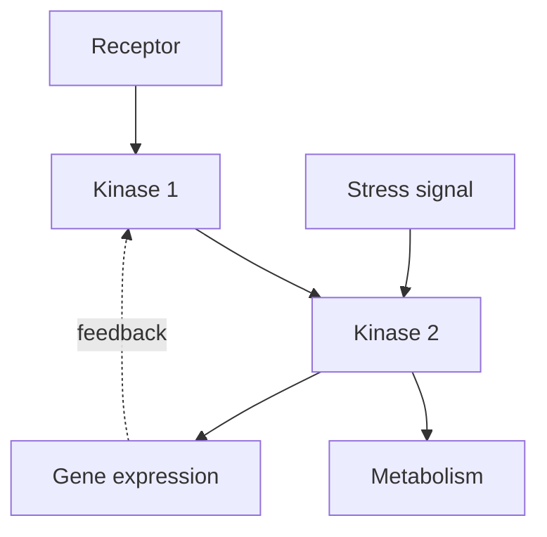

# Truyền tín hiệu và Chu kỳ tế bào — Cell Signaling and Cell Cycle (세포 신호전달과 세포주기)

Ở chapter trước, cell đã có energy và metabolic network. Nhưng một hệ sống không thể chỉ có machinery; nó cần **control**. Cell phải biết khi nào nutrient đủ, khi nào DNA bị hỏng, khi nào neighboring cell gửi signal, khi nào cần tăng trưởng, khi nào nên divide và khi nào nên dừng.

Chapter này nghiên cứu **truyền tín hiệu tế bào (cell signaling / 세포 신호전달)** như hệ thống xử lý thông tin và **chu kỳ tế bào (cell cycle / 세포주기)** như một quyết định được kiểm soát chặt. Đây là bridge tự nhiên từ cell biology sang genetics: signaling có thể đổi protein activity trong vài giây, nhưng response dài hạn thường cần đổi gene expression.

> **Mental model:** signaling là quá trình biến một thay đổi ở bên ngoài hoặc bên trong thành một chuỗi thay đổi molecular có tổ chức. Cell cycle là một state machine sinh học chỉ chuyển state khi các checkpoint cho phép.

## 1. Tại sao cell cần signaling?

Một unicellular organism phải sense nutrient, toxin, temperature và mating signal. Trong multicellular organism, cell còn phải coordinate với tissue.

Nếu liver cell, muscle cell và neuron đều tự quyết định độc lập, organism không thể giữ homeostasis. Hormone, neurotransmitter, growth factor và cytokine tạo communication layer giúp nhiều cell hoạt động như một system.

Signal không chỉ đến từ bên ngoài. DNA damage, low ATP, unfolded protein hay low oxygen cũng kích hoạt intracellular signaling.

## 2. Signal, receptor và response

Một signaling system thường có ba lớp:

```text
signal
  ↓
receptor/sensor
  ↓
signal transduction network
  ↓
cellular response
```

**Ligand (리간드)** là molecule bind receptor. **Receptor (수용체)** là protein nhận signal. **Signal transduction (신호전달)** là chuỗi event chuyển signal thành response.

Response có thể là mở ion channel, thay metabolism, di chuyển, tiết molecule, đổi gene expression, divide hoặc apoptosis.

## 3. Receptor không chỉ “nhận” mà còn dịch ngôn ngữ

Signal ngoài cell thường không đi thẳng vào nucleus. Receptor làm nhiệm vụ transduce: biến một kiểu information thành kiểu molecular event khác.

Ví dụ insulin bind insulin receptor ở membrane. Receptor activation kích hoạt phosphorylation cascade, thay transporter localization và metabolic enzyme activity.

Một molecule peptide ngoài cell cuối cùng có thể đổi glucose uptake bên trong mà bản thân insulin không cần đi qua membrane.

## 4. Các kiểu communication theo khoảng cách

**Autocrine signaling**: cell tác động chính nó.

**Paracrine signaling**: signal tác động cell gần.

**Endocrine signaling**: hormone đi xa qua circulation.

**Synaptic signaling**: neuron truyền signal nhanh và định hướng qua synapse.

**Contact-dependent signaling**: receptor và ligand trên hai cell tiếp xúc trực tiếp.

Những kiểu này không phải category để học thuộc; chúng phản ánh bài toán distance, speed và specificity.

## 5. Membrane receptor và intracellular receptor

Hydrophilic ligand thường không xuyên membrane dễ nên dùng membrane receptor. Steroid hormone hoặc molecule lipid-soluble có thể đi qua membrane và bind **intracellular receptor**.

Intracellular receptor thường trực tiếp hoặc gián tiếp điều chỉnh transcription.

Cùng một mục tiêu “đổi cell behavior”, chemistry của ligand quyết định architecture signaling phù hợp.

## 6. G protein-coupled receptor: signal nhỏ, network lớn

**GPCR (G protein-coupled receptor / G단백질 연결 수용체)** là family receptor lớn.

Ligand bind làm receptor đổi conformation, activation heterotrimeric G protein, rồi effector enzyme/channel được điều chỉnh. GTP hydrolysis giúp reset system.

Một receptor có thể activate nhiều G protein; một enzyme có thể tạo nhiều second messenger. Đây là **signal amplification**.

## 7. Second messenger: đưa signal đi nhanh trong cytoplasm

**Second messenger (2차 전달자)** là small intracellular molecule/ion như cAMP, Ca²⁺, IP₃.

Một receptor activation có thể tạo rất nhiều cAMP; cAMP activate protein kinase A; kinase phosphorylate nhiều target.

Signal amplification giúp lượng ligand nhỏ tạo response lớn, nhưng cũng đòi hỏi shutdown mechanism để tránh runaway activation.

## 8. Calcium: ion vừa structural vừa signal

Cytosolic Ca²⁺ thường được giữ thấp so với extracellular space và ER. Gradient này cho phép Ca²⁺ tăng tạm thời trở thành signal mạnh.

Ca²⁺ có thể bind calmodulin, activate enzyme, trigger muscle contraction hoặc vesicle release.

Sau response, pump đưa Ca²⁺ trở lại store/outside. Nếu Ca²⁺ cao kéo dài không kiểm soát, cell có thể bị damage.

Một gradient được membrane chapter tạo ra giờ trở thành information channel.

## 9. Receptor tyrosine kinase và growth signal

**Receptor tyrosine kinase, RTK (수용체 티로신 키나아제)** thường activate khi ligand như growth factor bind và receptor dimerize/cluster.

Autophosphorylation tạo docking site cho signaling protein, mở pathway như Ras–MAPK hoặc PI3K–Akt.

Các pathway này điều chỉnh growth, survival, metabolism và gene expression.

Mutation làm RTK/pathway active liên tục có thể góp phần cancer.

## 10. Phosphorylation: molecular switch linh hoạt

**Protein kinase (단백질 키나아제)** transfer phosphate lên protein; **phosphatase (인산가수분해효소)** bỏ phosphate.

Phosphorylation có thể tăng hoặc giảm activity, đổi localization hoặc interaction.

Một điểm cần tránh là nghĩ “phosphorylation luôn bật”. Effect phụ thuộc protein/site.

Kinase–phosphatase pair tạo reversible control rất phù hợp cho dynamic system.

## 11. Signaling cascade và logic network

Pathway thường được vẽ tuyến tính A → B → C, nhưng cell thật là network. Một node có thể nhận nhiều input, branch ra nhiều output và có feedback.



Cross-talk giúp cell integrate context thay vì phản ứng mechanical với một signal duy nhất.

## 12. Specificity: cùng signal nhưng cell khác phản ứng khác

Adrenaline có thể tác động nhiều tissue nhưng response khác vì receptor subtype và downstream protein khác.

Một cell chỉ “nghe” signal nếu có receptor phù hợp và signaling machinery tương ứng.

Đây là principle quan trọng của multicellularity: organism có thể dùng cùng hormone nhưng nhiều tissue interpret khác nhau.

## 13. Desensitization: tại sao signal kéo dài không luôn tạo response kéo dài?

Cell có thể giảm sensitivity bằng receptor internalization, phosphorylation receptor, degrade second messenger hoặc tăng inhibitor.

Đây là **adaptation/desensitization**.

Ví dụ odor receptor response giảm khi mùi kéo dài. System quan tâm change mới hơn là absolute signal cố định.

Control system luôn cần reset.

## 14. Feedback và feedforward trong signaling

Negative feedback giúp ổn định hoặc tạo adaptation. Positive feedback có thể tạo switch-like behavior. Feedforward giúp anticipation hoặc lọc noise.

Biological network đôi khi tạo **bistability**: system có hai stable state và signal đủ mạnh mới chuyển state.

Cell-cycle commitment là ví dụ nơi positive feedback giúp decision trở nên rõ ràng thay vì lưng chừng.

## 15. Gene expression là response chậm nhưng bền hơn

Signaling có thể phosphorylate enzyme trong vài giây. Nhưng nếu cell cần thay program nhiều giờ/ngày, pathway thường activate transcription factor.

Transcription factor vào nucleus/bind DNA và thay gene expression. Protein mới được tạo, làm state cell thay đổi lâu hơn.

Đây là bridge trực tiếp sang molecular genetics.

## 16. Cell cycle: division không phải default state

**Cell cycle** gồm G1, S, G2 và M phase. Một số cell rời cycle vào G0.

- G1: growth, sensing, preparation;
- S: DNA replication;
- G2: kiểm tra và chuẩn bị mitosis;
- M: chromosome segregation và cytokinesis.

Điều quan trọng là cell không đơn giản “đủ lớn rồi chia”. Nó phải integrate nutrient, growth signal, DNA integrity và tissue context.

## 17. Cyclin và CDK: oscillator molecular của cell cycle

**Cyclin-dependent kinase, CDK** là kinase được activate bởi cyclin. Cyclin level thay đổi theo cycle, tạo timing.

CDK phosphorylate target để drive transition giữa phase. Cyclin được synthesize và degraded có kiểm soát.

Control bằng synthesis + destruction cho cycle có directionality.

## 18. Checkpoint: “đi tiếp hay dừng?”

Checkpoint là network quyết định transition có an toàn không.

G1/S checkpoint đánh giá growth condition và DNA damage trước replication. G2/M kiểm tra DNA replication/damage. Spindle checkpoint kiểm tra chromosome attachment trước segregation.

Checkpoint không phải physical gate; nó là regulatory network.

## 19. DNA damage response và p53

DNA damage activate sensor pathway. **p53** có thể induce cell-cycle arrest, repair program, senescence hoặc apoptosis tùy context.

p53 thường được gọi “guardian of the genome”, nhưng mental model tốt hơn là transcriptional decision node nhận stress signal.

Mutation p53 pathway có thể cho damaged cell tiếp tục proliferate, tăng cancer risk.

## 20. Mitosis: mục tiêu là chia chromosome đã copy chính xác

Sau S phase, mỗi chromosome có sister chromatid. Trong mitosis, spindle microtubule attach kinetochore, align và kéo sister chromatid sang hai pole.

Phases như prophase, metaphase, anaphase, telophase hữu ích để mô tả, nhưng mechanism quan trọng hơn tên phase: chromosome condense, attach, tension được kiểm tra, cohesion bị release, segregation diễn ra.

Cytokinesis sau đó chia cytoplasm.

## 21. Meiosis khác vì mục tiêu khác

Mitosis duy trì chromosome number và tạo cell tương tự. **Meiosis (감수분열)** tạo gamete haploid và variation.

Meiosis có một lần DNA replication nhưng hai lần division. Homologous chromosome pair và recombine ở meiosis I, sau đó homolog tách; meiosis II tách sister chromatid.

Crossing-over và independent assortment tạo combination allele mới.

Meiosis là bridge giữa cell cycle và inheritance genetics.

## 22. Apoptosis: cell death có thể là chương trình có lợi cho organism

**Apoptosis (세포자멸사)** là regulated cell death. Cell shrink, DNA fragmented có kiểm soát và debris được clear tương đối ít inflammation.

Apoptosis loại damaged cell và sculpt tissue trong development. Ví dụ tissue giữa developing digits bị loại để tạo ngón tách biệt.

Ở multicellular organism, survival của individual cell không phải mục tiêu tối cao; integrity của organism mới là context lớn hơn.

## 23. Cancer: failure của multi-layer control

Cancer không đơn giản là “cell chia nhanh”. Nó là evolutionary process trong tissue, thường cần nhiều alteration ảnh hưởng growth signal, checkpoint, apoptosis, genome stability, metabolism và interaction với microenvironment.

Một tumor cell có mutation tăng proliferation; clone đó expand; thêm mutation có thể tiếp tục được selection trong tumor environment.

Cancer nối cell signaling với genetics và evolution.

## 24. Case study: insulin signal nối organism với cell metabolism

Sau meal, blood glucose tăng. Pancreatic beta cell release insulin. Insulin receptor trên target cell activate signaling cascade. Ở muscle/adipose context, GLUT4 vesicle được đưa ra membrane, tăng glucose uptake. Enzyme metabolism cũng được regulation.

Chuỗi nhiều scale:

```text
meal
→ blood glucose
→ endocrine signal
→ receptor
→ kinase network
→ transporter/metabolic enzyme
→ glucose flux
```

Một hormone không “hạ đường” trực tiếp; nó thay cell behavior.

## 25. Case study: growth factor và proliferation

Growth factor bind receptor → MAPK signaling → transcription factor → cyclin expression → cell-cycle entry.

Nếu receptor/pathway mutation làm signal “on” ngay cả không có ligand, cell có thể nhận false message rằng môi trường đang cho phép growth.

Đây là ví dụ information processing failure.

## 26. Common misconceptions

“Signal mạnh hơn luôn response lớn hơn tuyến tính” sai; pathway có saturation, threshold, feedback và adaptation.

“Một receptor chỉ có một pathway” thường sai; cross-talk và branching phổ biến.

“Phosphorylation luôn activate” sai.

“Cell cycle chạy như đồng hồ độc lập” sai; nó tích hợp environmental/internal signal.

“Cancer do một gene duy nhất” thường sai; cancer thường là multistep evolutionary process.

“Apoptosis luôn xấu” sai; controlled cell death cần cho development và tissue health.

## 27. Bridge: signal ngắn hạn trở thành chương trình dài hạn bằng cách nào?

Signaling cho phép cell sense và respond. Nhưng khi transcription factor được activate, nó phải đọc một physical information system. DNA sequence ở đâu? Gene là gì? Làm sao sequence được copy, transcribed và translated? Làm sao mutation thay protein?

Đó là câu hỏi của [[../02_genetics_molecular_biology/00_dna_genes_and_gene_expression]].

Sau đó, meiosis vừa học sẽ được nối với Mendelian inheritance trong [[../02_genetics_molecular_biology/01_inheritance_variation_and_mutation]].

> **Mental model cuối chapter:** cell signaling là computation bằng molecule: receptor nhận input, network transform/integrate signal, effector tạo output, feedback điều chỉnh gain. Cell cycle là một decision system gắn chặt với signaling và genome integrity; genetics là layer information giúp các decision này được duy trì qua thời gian.