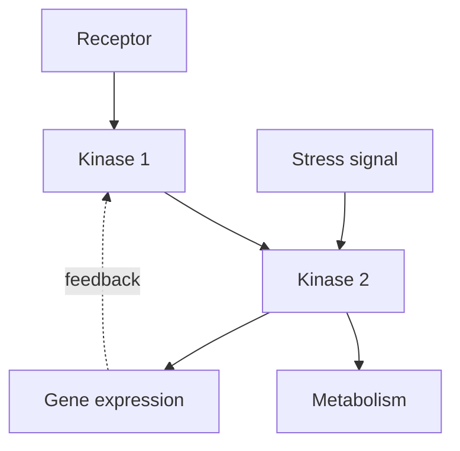

# Truyền tín hiệu và Chu kỳ tế bào — Cell Signaling and Cell Cycle (세포 신호전달과 세포주기)

Ở chapter trước, tế bào (cell) đã có energy và mạng lưới chuyển hóa (metabolic network). Nhưng một hệ sống không thể chỉ có bộ máy (machinery); nó cần **điều khiển (control)**. Cell phải biết khi nào chất dinh dưỡng (nutrient) đủ, khi nào DNA bị hỏng, khi nào tế bào lân cận (neighboring cell) gửi signal, khi nào cần tăng trưởng, khi nào nên divide và khi nào nên dừng.

Chapter này nghiên cứu **truyền tín hiệu tế bào (cell signaling / 세포 신호전달)** như hệ thống xử lý thông tin và **chu kỳ tế bào (cell cycle / 세포주기)** như một quyết định được kiểm soát chặt. Đây là bridge tự nhiên từ sinh học tế bào (cell biology) sang genetics: signaling có thể đổi protein hoạt động (activity) trong vài giây, nhưng response dài hạn thường cần đổi biểu hiện gen (gene expression).

> **Mô hình tư duy (mental model):** signaling là quá trình biến một thay đổi ở bên ngoài hoặc bên trong thành một chuỗi thay đổi molecular có tổ chức. Chu kỳ tế bào (cell cycle) là một máy trạng thái (state machine) sinh học chỉ chuyển state khi các checkpoint cho phép.

## 1. Tại sao cell cần signaling?

Một sinh vật đơn bào (unicellular organism) phải sense nutrient, toxin, temperature và mating signal. Trong sinh vật đa bào (multicellular organism), cell còn phải coordinate với tissue.

Nếu liver cell, muscle cell và nơron (neuron) đều tự quyết định độc lập, organism không thể giữ cân bằng nội môi (homeostasis). Hoóc-môn (hormone), neurotransmitter, yếu tố tăng trưởng (growth factor) và cytokine tạo communication layer giúp nhiều cell hoạt động như một system.

Signal không chỉ đến từ bên ngoài. Tổn thương DNA (DNA damage), low ATP, protein chưa gấp cuộn đúng (unfolded protein) hay thiếu oxy (low oxygen) cũng kích hoạt truyền tín hiệu nội bào (intracellular signaling).

## 2. Tín hiệu (signal), receptor và đáp ứng (response)

Một signaling system thường có ba lớp:

```text
signal
  ↓
receptor/sensor
  ↓
signal transduction network
  ↓
cellular response
```

**Ligand (리간드)** là molecule bind receptor. **Thụ thể (receptor) (수용체)** là protein nhận signal. **Chuyển đổi tín hiệu (signal transduction) (신호전달)** là chuỗi event chuyển signal thành response.

Response có thể là mở kênh ion (ion channel), thay metabolism, di chuyển, tiết molecule, đổi biểu hiện gen, divide hoặc apoptosis.

## 3. Receptor không chỉ “nhận” mà còn dịch ngôn ngữ

Signal ngoài cell thường không đi thẳng vào nucleus. Receptor làm nhiệm vụ transduce: biến một kiểu information thành kiểu molecular event khác.

Ví dụ insulin bind insulin receptor ở màng (membrane). Receptor activation kích hoạt chuỗi phosphoryl hóa (phosphorylation cascade), thay transporter localization và metabolic enzyme hoạt động.

Một molecule peptide ngoài cell cuối cùng có thể đổi glucose uptake bên trong mà bản thân insulin không cần đi qua màng.

## 4. Các kiểu communication theo khoảng cách

**Truyền tín hiệu tự tiết (autocrine signaling)**: cell tác động chính nó.

**Truyền tín hiệu cận tiết (paracrine signaling)**: signal tác động cell gần.

**Truyền tín hiệu nội tiết (endocrine signaling)**: hoóc-môn đi xa qua tuần hoàn (circulation).

**Truyền tín hiệu qua synap (synaptic signaling)**: neuron truyền signal nhanh và định hướng qua synapse.

**Truyền tín hiệu phụ thuộc tiếp xúc (contact-dependent signaling)**: receptor và ligand trên hai cell tiếp xúc trực tiếp.

Những kiểu này không phải category để học thuộc; chúng phản ánh bài toán distance, speed và độ đặc hiệu (specificity).

## 5. Màng (membrane) receptor và thụ thể nội bào (intracellular receptor)

Ligand ưa nước (hydrophilic ligand) thường không xuyên membrane dễ nên dùng membrane thụ thể (receptor). Steroid hormone hoặc molecule lipid-soluble có thể đi qua membrane và bind **thụ thể nội bào**.

Thụ thể nội bào thường trực tiếp hoặc gián tiếp điều chỉnh transcription.

Cùng một mục tiêu “đổi cell hành vi (behavior)”, chemistry của ligand quyết định architecture signaling phù hợp.

## 6. G protein-coupled receptor: signal nhỏ, network lớn

**GPCR (G protein-coupled receptor / G단백질 연결 수용체)** là family receptor lớn.

Ligand bind làm receptor đổi conformation, activation heterotrimeric G protein, rồi effector enzym (enzyme)/channel được điều chỉnh. GTP hydrolysis giúp reset system.

Một receptor có thể activate nhiều G protein; một enzyme có thể tạo nhiều chất truyền tin thứ hai (second messenger). Đây là **tín hiệu (signal) khuếch đại (amplification)**.

## 7. Chất truyền tin thứ hai: đưa signal đi nhanh trong cytoplasm

**Chất truyền tin thứ hai (2차 전달자)** là small intracellular molecule/ion như cAMP, Ca²⁺, IP₃.

Một receptor activation có thể tạo rất nhiều cAMP; cAMP activate protein kinase A; kinase phosphorylate nhiều target.

Tín hiệu khuếch đại giúp lượng ligand nhỏ tạo response lớn, nhưng cũng đòi hỏi shutdown mechanism để tránh runaway activation.

## 8. Calcium: ion vừa structural vừa signal

Cytosolic Ca²⁺ thường được giữ thấp so với extracellular space và ER. Gradient này cho phép Ca²⁺ tăng tạm thời trở thành signal mạnh.

Ca²⁺ có thể bind calmodulin, activate enzyme, trigger co cơ (muscle contraction) hoặc vesicle release.

Sau đáp ứng, pump đưa Ca²⁺ trở lại store/outside. Nếu Ca²⁺ cao kéo dài không kiểm soát, cell có thể bị damage.

Một gradient được membrane chapter tạo ra giờ trở thành information channel.

## 9. Receptor tyrosine kinase và sinh trưởng (growth) tín hiệu

**Receptor tyrosine kinase, RTK (수용체 티로신 키나아제)** thường activate khi ligand như yếu tố tăng trưởng bind và receptor dimerize/cluster.

Autophosphorylation tạo docking site cho truyền tín hiệu (signaling) protein (protein), mở pathway như Ras–MAPK hoặc PI3K–Akt.

Các pathway này điều chỉnh growth, survival, metabolism và biểu hiện gen.

Mutation làm RTK/pathway active liên tục có thể góp phần cancer.

## 10. Phosphorylation: molecular switch linh hoạt

**Protein kinase (단백질 키나아제)** transfer phosphate lên protein; **phosphatase (인산가수분해효소)** bỏ phosphate.

Phosphorylation có thể tăng hoặc giảm activity, đổi localization hoặc interaction.

Một điểm cần tránh là nghĩ “phosphorylation luôn bật”. Effect phụ thuộc protein/site.

Kinase–phosphatase pair tạo reversible control rất phù hợp cho dynamic system.

## 11. Signaling cascade và lôgic (logic) mạng lưới (network)

Pathway thường được vẽ tuyến tính A → B → C, nhưng cell thật là mạng lưới (network). Một node có thể nhận nhiều input, branch ra nhiều output và có phản hồi (feedback).



Cross-talk giúp cell integrate context thay vì phản ứng mechanical với một signal duy nhất.

## 12. Độ đặc hiệu: cùng signal nhưng cell khác phản ứng khác

Adrenaline có thể tác động nhiều tissue nhưng response khác vì receptor subtype và downstream protein khác.

Một cell chỉ “nghe” signal nếu có receptor phù hợp và truyền tín hiệu machinery tương ứng.

Đây là principle quan trọng của multicellularity: organism có thể dùng cùng hormone nhưng nhiều tissue interpret khác nhau.

## 13. Desensitization: tại sao signal kéo dài không luôn tạo response kéo dài?

Cell có thể giảm sensitivity bằng receptor internalization, phosphorylation receptor, degrade chất truyền tin thứ hai hoặc tăng inhibitor.

Đây là **thích nghi (adaptation)/desensitization**.

Ví dụ odor receptor đáp ứng (response) giảm khi mùi kéo dài. System quan tâm change mới hơn là absolute signal cố định.

Điều khiển system luôn cần reset.

## 14. Feedback và feedforward trong truyền tín hiệu (signaling)

Phản hồi âm (negative feedback) giúp ổn định hoặc tạo thích nghi. Phản hồi dương (positive feedback) có thể tạo công tắc (switch)-like behavior. Feedforward giúp anticipation hoặc lọc noise.

Mạng lưới sinh học (biological network) đôi khi tạo **tính lưỡng ổn (bistability)**: system có hai stable state và tín hiệu đủ mạnh mới chuyển state.

Tế bào-cycle commitment là ví dụ nơi phản hồi dương giúp decision trở nên rõ ràng thay vì lưng chừng.

## 15. Biểu hiện gen là response chậm nhưng bền hơn

Signaling có thể phosphorylate enzyme trong vài giây. Nhưng nếu cell cần thay program nhiều giờ/ngày, pathway thường activate yếu tố phiên mã (transcription factor).

Yếu tố phiên mã vào nucleus/bind DNA và thay biểu hiện gen. Protein mới được tạo, làm state cell thay đổi lâu hơn.

Đây là bridge trực tiếp sang molecular genetics.

## 16. Chu kỳ tế bào: division không phải default state

**Chu kỳ tế bào** gồm G1, S, G2 và M phase. Một số cell rời cycle vào G0.

- G1: sinh trưởng, sensing, chuẩn bị (preparation);
- S: DNA replication;
- G2: kiểm tra và chuẩn bị mitosis;
- M: chromosome segregation và cytokinesis.

Điều quan trọng là cell không đơn giản “đủ lớn rồi chia”. Nó phải integrate nutrient, sinh trưởng tín hiệu, DNA integrity và mô (tissue) bối cảnh (context).

## 17. Cyclin và CDK: oscillator molecular của chu kỳ tế bào

**Cyclin-dependent kinase, CDK** là kinase được activate bởi cyclin. Cyclin level thay đổi theo cycle, tạo thời điểm (timing).

CDK phosphorylate target để drive transition giữa phase. Cyclin được synthesize và degraded có kiểm soát.

Control bằng synthesis + destruction cho cycle có directionality.

## 18. Checkpoint: “đi tiếp hay dừng?”

Checkpoint là network quyết định transition có an toàn không.

G1/S checkpoint đánh giá growth condition và Tổn thương DNA trước replication. G2/M kiểm tra DNA replication/damage. Spindle checkpoint kiểm tra chromosome attachment trước segregation.

Checkpoint không phải physical gate; nó là mạng lưới điều hòa (regulatory network).

## 19. Tổn thương DNA response và p53

Tổn thương DNA activate sensor con đường (pathway). **p53** có thể induce cell-cycle arrest, repair program, senescence hoặc apoptosis tùy context.

p53 thường được gọi “guardian of the genome”, nhưng mô hình tư duy tốt hơn là transcriptional decision node nhận stress tín hiệu.

Mutation p53 pathway có thể cho damaged cell tiếp tục proliferate, tăng cancer risk.

## 20. Mitosis: mục tiêu là chia chromosome đã copy chính xác

Sau S phase, mỗi chromosome có nhiễm sắc tử chị em (sister chromatid). Trong mitosis, spindle microtubule attach kinetochore, align và kéo nhiễm sắc tử chị em sang hai pole.

Phases như prophase, metaphase, anaphase, telophase hữu ích để mô tả, nhưng mechanism quan trọng hơn tên phase: chromosome condense, attach, tension được kiểm tra, cohesion bị release, segregation diễn ra.

Cytokinesis sau đó chia cytoplasm.

## 21. Meiosis khác vì mục tiêu khác

Mitosis duy trì số lượng nhiễm sắc thể (chromosome number) và tạo cell tương tự. **Meiosis (감수분열)** tạo gamete haploid và biến dị (variation).

Meiosis có một lần DNA replication nhưng hai lần division. Nhiễm sắc thể tương đồng (homologous chromosome) pair và recombine ở meiosis I, sau đó homolog tách; meiosis II tách nhiễm sắc tử chị em.

Trao đổi chéo (crossing-over) và phân ly độc lập (independent assortment) tạo combination allele mới.

Meiosis là cầu nối (bridge) giữa chu kỳ tế bào và di truyền (inheritance) di truyền học (genetics).

## 22. Apoptosis: chết tế bào (cell death) có thể là chương trình có lợi cho sinh vật (organism)

**Apoptosis (세포자멸사)** là regulated chết tế bào. Cell shrink, DNA fragmented có kiểm soát và debris được clear tương đối ít inflammation.

Apoptosis loại damaged cell và sculpt tissue trong phát triển (development). Ví dụ mô giữa developing digits bị loại để tạo ngón tách biệt.

Ở sinh vật đa bào, survival của individual cell không phải mục tiêu tối cao; integrity của organism mới là context lớn hơn.

## 23. Cancer: failure của multi-layer control

Cancer không đơn giản là “cell chia nhanh”. Nó là evolutionary process trong mô, thường cần nhiều alteration ảnh hưởng growth tín hiệu, checkpoint, apoptosis, độ ổn định hệ gen (genome stability), metabolism và interaction với microenvironment.

Một tumor cell có mutation tăng proliferation; clone đó expand; thêm mutation có thể tiếp tục được selection trong tumor environment.

Cancer nối truyền tín hiệu tế bào (cell signaling) với genetics và tiến hóa (evolution).

## 24. Tình huống phân tích (case study): insulin signal nối organism với cell chuyển hóa (metabolism)

Sau meal, đường huyết (blood glucose) tăng. Pancreatic beta cell release insulin. Insulin receptor trên target cell activate signaling cascade. Ở muscle/adipose context, GLUT4 vesicle được đưa ra màng, tăng glucose uptake. Enzym metabolism cũng được regulation.

Chuỗi nhiều scale:

```text
meal
→ blood glucose
→ endocrine signal
→ receptor
→ kinase network
→ transporter/metabolic enzyme
→ glucose flux
```

Một hormone không “hạ đường” trực tiếp; nó thay cell hành vi.

## 25. Tình huống phân tích: yếu tố tăng trưởng và proliferation

Yếu tố tăng trưởng bind receptor → MAPK signaling → yếu tố phiên mã → cyclin expression → tế bào-cycle entry.

Nếu receptor/con đường mutation làm signal “on” ngay cả không có ligand, cell có thể nhận false message rằng môi trường đang cho phép growth.

Đây là ví dụ information processing failure.

## 26. Các hiểu lầm phổ biến (common misconceptions)

“Signal mạnh hơn luôn response lớn hơn tuyến tính” sai; pathway có bão hòa (saturation), ngưỡng (threshold), feedback và thích nghi.

“Một receptor chỉ có một pathway” thường sai; cross-talk và branching phổ biến.

“Phosphorylation luôn activate” sai.

“Chu kỳ tế bào chạy như đồng hồ độc lập” sai; nó tích hợp environmental/internal signal.

“Cancer do một gene duy nhất” thường sai; cancer thường là multistep evolutionary process.

“Apoptosis luôn xấu” sai; controlled chết tế bào cần cho development và tissue health.

<!-- depth-audit-2026:signal-quantitation -->
## Định lượng signal–response: receptor occupancy không phải toàn bộ câu chuyện

Nếu ligand \(L\) gắn receptor với hằng số phân ly \(K_d\), phần receptor được chiếm trong mô hình đơn giản là:

\[
f=\frac{[L]}{K_d+[L]}
\]

Quan hệ này bão hòa: tăng ligand từ rất thấp tới gần \(K_d\) tạo thay đổi lớn, nhưng khi receptor gần bão hòa, thêm ligand tạo ít khác biệt hơn. Downstream network còn có amplification, phosphatase, feedback và threshold nên **đáp ứng tế bào không đồng nhất với receptor occupancy**.

Với hệ có tính hiệp đồng, phương trình Hill thường được dùng như mô hình hiện tượng:

\[
response=\frac{[L]^n}{K^n+[L]^n}
\]

\(n>1\) tạo đường cong dốc hơn và có thể giúp quyết định trở nên switch-like. Nhưng \(n\) là tham số mô tả; không nên tự động diễn giải nó như đúng số phân tử cùng gắn.

## Tế bào mã hóa thông tin bằng thời gian

Hai signal có cùng nồng độ trung bình vẫn có thể tạo kết quả khác nếu một signal liên tục còn signal kia phát xung. Ca²⁺, ERK, NF-κB và nhiều pathway có thể dùng **tần số, độ dài xung và lịch sử kích thích (signal history)** để mã hóa trạng thái. Feedback âm tạo adaptation; feedback dương tạo commitment; degradation và phosphatase xác định memory của pathway.

## Commitment của cell cycle cần cơ chế làm quyết định khó đảo ngược

G1/S transition không chỉ là “cyclin đủ cao”. Trục RB–E2F tạo feedback giúp cell vượt **điểm hạn chế (restriction point)** khi tín hiệu tăng trưởng, dinh dưỡng và genome integrity phù hợp. Sau đó, ubiquitin ligase như SCF và APC/C phá hủy protein điều hòa theo thứ tự, làm transition có tính hướng và giảm khả năng quay ngược tùy tiện.

Cơ chế này giải thích vì sao failure ở cell cycle thường là failure của network chứ không phải một nút đơn. Oncogene có thể tăng drive, tumor suppressor loss làm mất brake, repair defect tăng variation; selection trong mô sau đó giữ clone có lợi thế tăng trưởng. Cancer vì vậy nối trực tiếp **regulation → failure → somatic evolution**.

## 27. Cầu nối: signal ngắn hạn trở thành chương trình dài hạn bằng cách nào?

Truyền tín hiệu cho phép cell sense và respond. Nhưng khi yếu tố phiên mã được activate, nó phải đọc một physical information hệ thống (system). DNA sequence ở đâu? Gene là gì? Làm sao trình tự (sequence) được copy, transcribed và translated? Làm sao mutation thay protein?

Đó là câu hỏi của [DNA, Gene và Biểu hiện gene](../02_genetics_molecular_biology/00_dna_genes_and_gene_expression.md).

Sau đó, meiosis vừa học sẽ được nối với Mendelian inheritance trong [Di truyền, Biến dị và Đột biến](../02_genetics_molecular_biology/01_inheritance_variation_and_mutation.md).

> **Mô hình tư duy cuối chapter:** truyền tín hiệu tế bào là computation bằng molecule: receptor nhận input, network transform/integrate signal, effector tạo đầu ra (output), phản hồi điều chỉnh gain. Chu kỳ tế bào là một decision system gắn chặt với signaling và genome integrity; genetics là layer information giúp các decision này được duy trì qua thời gian.

---

<!-- biology-learning-navigation -->
**Điều hướng học:** [← Chuyển hóa, Hô hấp tế bào và Quang hợp](01_metabolism_respiration_photosynthesis.md) · [Mục lục Biology](../README.md) · [Đa bào, mô và chất nền ngoại bào →](03_multicellularity_tissues_and_extracellular_matrix.md)
