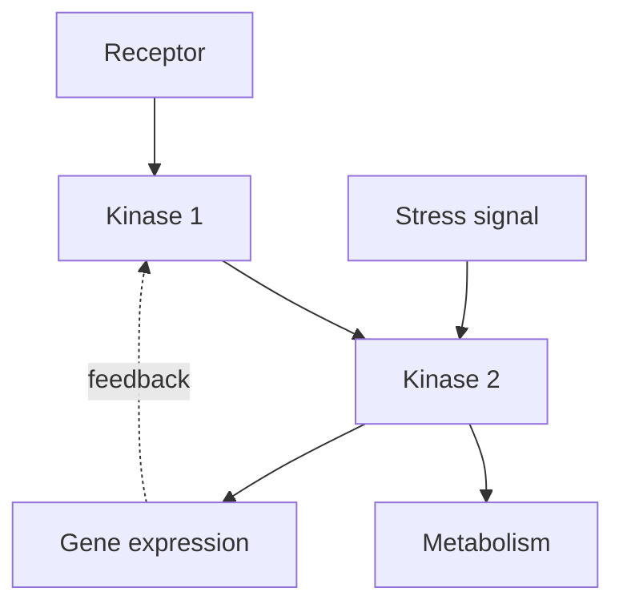

# Truyền tín hiệu và Chu kỳ tế bào — Cell Signaling and Cell Cycle (세포 신호전달과 세포주기)

> **Mạch đọc:** [README](../README.md) là bản đồ owner của **Truyền tín hiệu và Chu kỳ tế bào — Cell Signaling and Cell Cycle (세포 신호전달과 세포주기)**; nhìn vào vị trí đó trước để biết file này đang phục vụ nhánh kiến thức nào. **1. Tại sao cell cần signaling?** mở đối tượng chính của file và câu hỏi cần theo dõi; sau đó sang **2. tín hiệu (signal / 신호), receptor và đáp ứng (response)** để mở rộng đối tượng sang phạm vi kế cận. Cách đi này giữ lại điểm tựa của section đầu và cho biết kết luận sẽ được dùng ở đâu, thay vì dừng ở định nghĩa đầu tiên.

Ở chapter trước, tế bào (cell) đã có năng lượng (energy / 에너지) và mạng lưới chuyển hóa (metabolic network). Nhưng một hệ sống không thể chỉ có bộ máy (machinery); nó cần **điều khiển (control / 제어)**. Cell phải biết khi nào chất dinh dưỡng (nutrient) đủ, khi nào DNA bị hỏng, khi nào tế bào lân cận (neighboring cell) gửi tín hiệu (signal / 신호), khi nào cần tăng trưởng, khi nào nên divide và khi nào nên dừng.

Chapter này nghiên cứu **truyền tín hiệu tế bào (cell signaling / 세포 신호전달)** như hệ thống xử lý thông tin và **chu kỳ tế bào (cell cycle / 세포주기)** như một quyết định được kiểm soát chặt. Đây là cầu nối (bridge / 브리지) tự nhiên từ sinh học tế bào (cell biology) sang genetics: signaling có thể đổi protein hoạt động (activity) trong vài giây, nhưng phản hồi (response / 응답) dài hạn thường cần đổi biểu hiện gen (gene expression).

> **mô hình tư duy (mental model / 사고 모델):** signaling là quá trình biến một thay đổi ở bên ngoài hoặc bên trong thành một chuỗi thay đổi molecular có tổ chức. Chu kỳ tế bào (cell cycle) là một máy trạng thái (state machine / 상태 머신) sinh học chỉ chuyển trạng thái (state / 상태) khi các checkpoint cho phép.

## 1. Tại sao cell cần signaling?

Một sinh vật đơn bào (unicellular organism) phải sense nutrient, toxin, temperature và mating tín hiệu (signal / 신호). Trong sinh vật đa bào (multicellular organism), cell còn phải coordinate với tissue.

Nếu liver cell, muscle cell và nơron (neuron) đều tự quyết định độc lập, organism không thể giữ cân bằng nội môi (homeostasis). Hoóc-môn (hormone), neurotransmitter, yếu tố tăng trưởng (growth factor) và cytokine tạo communication tầng (layer / 계층) giúp nhiều cell hoạt động như một hệ thống (system / 시스템).

Tín hiệu (signal / 신호) không chỉ đến từ bên ngoài. Tổn thương DNA (DNA damage), low ATP, protein chưa gấp cuộn đúng (unfolded protein) hay thiếu oxy (low oxygen) cũng kích hoạt truyền tín hiệu nội bào (intracellular signaling).

> **Chuyển mạch:** Cell signaling solves coordination across distance; signal/receptor/response forms a chain, and receptor transduction converts ligand binding into intracellular language.

## 2. tín hiệu (signal / 신호), receptor và đáp ứng (response)

Một signaling hệ thống (system / 시스템) thường có ba lớp:

```text
signal
  ↓
receptor/sensor
  ↓
signal transduction network
  ↓
cellular response
```

**Ligand (리간드)** là molecule bind receptor. **Thụ thể (receptor) (수용체)** là protein nhận tín hiệu (signal / 신호). **Chuyển đổi tín hiệu (signal transduction) (신호전달)** là chuỗi sự kiện (event / 이벤트) chuyển tín hiệu (signal / 신호) thành phản hồi (response / 응답).

Phản hồi (response / 응답) có thể là mở kênh ion (ion channel), thay metabolism, di chuyển, tiết molecule, đổi biểu hiện gen, divide hoặc apoptosis.

> **Chuyển mạch:** Ở chặng này của **Truyền tín hiệu và Chu kỳ tế bào — Cell Signaling and Cell Cycle (세포 신호전달과 세포주기)**, **3. Receptor không chỉ “nhận” mà còn dịch ngôn ngữ** tiếp nhận điểm tựa từ **2. tín hiệu (signal / 신호), receptor và đáp ứng (response)** nhưng đổi góc nhìn sang câu hỏi của chính nó; đọc liền hai mục để thấy mối quan hệ đó. Từ đây, **4. Các kiểu communication theo khoảng cách** sẽ cho biết hệ quả hoặc giới hạn ấy hiện ra ở đâu.

## 3. Receptor không chỉ “nhận” mà còn dịch ngôn ngữ

Tín hiệu (signal / 신호) ngoài cell thường không đi thẳng vào nucleus. Receptor làm nhiệm vụ transduce: biến một kiểu thông tin (information / 정보) thành kiểu molecular sự kiện (event / 이벤트) khác.

Ví dụ insulin bind insulin receptor ở màng (membrane). Receptor activation kích hoạt chuỗi phosphoryl hóa (phosphorylation cascade), thay transporter localization và metabolic enzyme hoạt động.

Một molecule peptide ngoài cell cuối cùng có thể đổi glucose uptake bên trong mà bản thân insulin không cần đi qua màng.

> **Chuyển mạch:** Đặt trong câu hỏi lớn của **Truyền tín hiệu và Chu kỳ tế bào — Cell Signaling and Cell Cycle (세포 신호전달과 세포주기)**, **4. Các kiểu communication theo khoảng cách** tiếp nhận điểm tựa từ **3. Receptor không chỉ “nhận” mà còn dịch ngôn ngữ** nhưng đổi góc nhìn sang câu hỏi của chính nó; đọc liền hai mục để thấy mối quan hệ đó. Từ đây, **5. Màng (membrane) receptor và thụ thể nội bào (intracellular receptor)** sẽ cho biết hệ quả hoặc giới hạn ấy hiện ra ở đâu.

## 4. Các kiểu communication theo khoảng cách

**Truyền tín hiệu tự tiết (autocrine signaling)**: cell tác động chính nó.

**Truyền tín hiệu cận tiết (paracrine signaling)**: tín hiệu (signal / 신호) tác động cell gần.

**Truyền tín hiệu nội tiết (endocrine signaling)**: hoóc-môn đi xa qua tuần hoàn (circulation).

**Truyền tín hiệu qua synap (synaptic signaling)**: neuron truyền tín hiệu (signal / 신호) nhanh và định hướng qua synapse.

**Truyền tín hiệu phụ thuộc tiếp xúc (contact-dependent signaling)**: receptor và ligand trên hai cell tiếp xúc trực tiếp.

Những kiểu này không phải category để học thuộc; chúng phản ánh bài toán distance, speed và độ đặc hiệu (specificity).

> **Chuyển mạch:** Trong **Truyền tín hiệu và Chu kỳ tế bào — Cell Signaling and Cell Cycle (세포 신호전달과 세포주기)**, **5. Màng (membrane) receptor và thụ thể nội bào (intracellular receptor)** tiếp nhận điểm tựa từ **4. Các kiểu communication theo khoảng cách** nhưng đổi góc nhìn sang câu hỏi của chính nó; đọc liền hai mục để thấy mối quan hệ đó. Từ đây, **6. G protein-coupled receptor: tín hiệu (signal / 신호) nhỏ, mạng (network / 네트워크) lớn** sẽ cho biết hệ quả hoặc giới hạn ấy hiện ra ở đâu.

## 5. Màng (membrane) receptor và thụ thể nội bào (intracellular receptor)

Ligand ưa nước (hydrophilic ligand) thường không xuyên membrane dễ nên dùng membrane thụ thể (receptor). Steroid hormone hoặc molecule lipid-soluble có thể đi qua membrane và bind **thụ thể nội bào**.

Thụ thể nội bào thường trực tiếp hoặc gián tiếp điều chỉnh transcription.

Cùng một mục tiêu “đổi cell hành vi (behavior / 동작)”, chemistry của ligand quyết định kiến trúc (architecture / 아키텍처) signaling phù hợp.

> **Chuyển mạch:** Ở chặng này của **Truyền tín hiệu và Chu kỳ tế bào — Cell Signaling and Cell Cycle (세포 신호전달과 세포주기)**, **6. G protein-coupled receptor: tín hiệu (signal / 신호) nhỏ, mạng (network / 네트워크) lớn** tiếp nhận điểm tựa từ **5. Màng (membrane) receptor và thụ thể nội bào (intracellular receptor)** nhưng đổi góc nhìn sang câu hỏi của chính nó; đọc liền hai mục để thấy mối quan hệ đó. Từ đây, **7. Chất truyền tin thứ hai: đưa tín hiệu (signal / 신호) đi nhanh trong cytoplasm** sẽ cho biết hệ quả hoặc giới hạn ấy hiện ra ở đâu.

## 6. G protein-coupled receptor: tín hiệu (signal / 신호) nhỏ, mạng (network / 네트워크) lớn

**GPCR (G protein-coupled receptor / G단백질 연결 수용체)** là family receptor lớn.

Ligand bind làm receptor đổi conformation, activation heterotrimeric G protein, rồi effector enzym (enzyme)/channel được điều chỉnh. GTP hydrolysis giúp reset hệ thống (system / 시스템).

Một receptor có thể activate nhiều G protein; một enzyme có thể tạo nhiều chất truyền tin thứ hai (second messenger). Đây là **tín hiệu (signal / 신호) khuếch đại (amplification)**.

> **Chuyển mạch:** Đặt trong câu hỏi lớn của **Truyền tín hiệu và Chu kỳ tế bào — Cell Signaling and Cell Cycle (세포 신호전달과 세포주기)**, **7. Chất truyền tin thứ hai: đưa tín hiệu (signal / 신호) đi nhanh trong cytoplasm** tiếp nhận điểm tựa từ **6. G protein-coupled receptor: tín hiệu (signal / 신호) nhỏ, mạng (network / 네트워크) lớn** nhưng đổi góc nhìn sang câu hỏi của chính nó; đọc liền hai mục để thấy mối quan hệ đó. Từ đây, **8. Calcium: ion vừa structural vừa tín hiệu (signal / 신호)** sẽ cho biết hệ quả hoặc giới hạn ấy hiện ra ở đâu.

## 7. Chất truyền tin thứ hai: đưa tín hiệu (signal / 신호) đi nhanh trong cytoplasm

**Chất truyền tin thứ hai (2차 전달자)** là small intracellular molecule/ion như cAMP, Ca²⁺, IP₃.

Một receptor activation có thể tạo rất nhiều cAMP; cAMP activate protein kinase A; kinase phosphorylate nhiều mục tiêu (target / 대상).

Tín hiệu khuếch đại giúp lượng ligand nhỏ tạo phản hồi (response / 응답) lớn, nhưng cũng đòi hỏi shutdown cơ chế (mechanism / 메커니즘) để tránh runaway activation.

> **Chuyển mạch:** Trong **Truyền tín hiệu và Chu kỳ tế bào — Cell Signaling and Cell Cycle (세포 신호전달과 세포주기)**, **8. Calcium: ion vừa structural vừa tín hiệu (signal / 신호)** tiếp nhận điểm tựa từ **7. Chất truyền tin thứ hai: đưa tín hiệu (signal / 신호) đi nhanh trong cytoplasm** nhưng đổi góc nhìn sang câu hỏi của chính nó; đọc liền hai mục để thấy mối quan hệ đó. Từ đây, **9. Receptor tyrosine kinase và sinh trưởng (growth) tín hiệu** sẽ cho biết hệ quả hoặc giới hạn ấy hiện ra ở đâu.

## 8. Calcium: ion vừa structural vừa tín hiệu (signal / 신호)

Cytosolic Ca²⁺ thường được giữ thấp so với extracellular không gian (space / 공간) và ER. độ dốc (gradient / 기울기) này cho phép Ca²⁺ tăng tạm thời trở thành tín hiệu (signal / 신호) mạnh.

Ca²⁺ có thể bind calmodulin, activate enzyme, trigger co cơ (muscle contraction) hoặc vesicle bản phát hành (release / 릴리스).

Sau đáp ứng, pump đưa Ca²⁺ trở lại store/outside. Nếu Ca²⁺ cao kéo dài không kiểm soát, cell có thể bị damage.

Một độ dốc (gradient / 기울기) được membrane chapter tạo ra giờ trở thành thông tin (information / 정보) channel.

> **Chuyển mạch:** Ở chặng này của **Truyền tín hiệu và Chu kỳ tế bào — Cell Signaling and Cell Cycle (세포 신호전달과 세포주기)**, **9. Receptor tyrosine kinase và sinh trưởng (growth) tín hiệu** tiếp nhận điểm tựa từ **8. Calcium: ion vừa structural vừa tín hiệu (signal / 신호)** nhưng đổi góc nhìn sang câu hỏi của chính nó; đọc liền hai mục để thấy mối quan hệ đó. Từ đây, **10. Phosphorylation: molecular switch linh hoạt** sẽ cho biết hệ quả hoặc giới hạn ấy hiện ra ở đâu.

## 9. Receptor tyrosine kinase và sinh trưởng (growth) tín hiệu

**Receptor tyrosine kinase, RTK (수용체 티로신 키나아제)** thường activate khi ligand như yếu tố tăng trưởng bind và receptor dimerize/cluster.

Autophosphorylation tạo docking site cho truyền tín hiệu (signaling) protein (protein), mở pathway như Ras–MAPK hoặc PI3K–Akt.

Các pathway này điều chỉnh growth, survival, metabolism và biểu hiện gen.

Mutation làm RTK/pathway active liên tục có thể góp phần cancer.

> **Chuyển mạch:** Đặt trong câu hỏi lớn của **Truyền tín hiệu và Chu kỳ tế bào — Cell Signaling and Cell Cycle (세포 신호전달과 세포주기)**, **10. Phosphorylation: molecular switch linh hoạt** tiếp nhận điểm tựa từ **9. Receptor tyrosine kinase và sinh trưởng (growth) tín hiệu** nhưng đổi góc nhìn sang câu hỏi của chính nó; đọc liền hai mục để thấy mối quan hệ đó. Từ đây, **11. Signaling cascade và lôgic (logic) mạng lưới (network)** sẽ cho biết hệ quả hoặc giới hạn ấy hiện ra ở đâu.

## 10. Phosphorylation: molecular switch linh hoạt

**Protein kinase (단백질 키나아제)** transfer phosphate lên protein; **phosphatase (인산가수분해효소)** bỏ phosphate.

Phosphorylation có thể tăng hoặc giảm activity, đổi localization hoặc tương tác (interaction / 상호작용).

Một điểm cần tránh là nghĩ “phosphorylation luôn bật”. tác động (effect / 효과) phụ thuộc protein/site.

Kinase–phosphatase pair tạo reversible điều khiển (control / 제어) rất phù hợp cho hệ động (dynamic system / 동적 시스템).

> **Chuyển mạch:** Trong **Truyền tín hiệu và Chu kỳ tế bào — Cell Signaling and Cell Cycle (세포 신호전달과 세포주기)**, **11. Signaling cascade và lôgic (logic) mạng lưới (network)** tiếp nhận điểm tựa từ **10. Phosphorylation: molecular switch linh hoạt** nhưng đổi góc nhìn sang câu hỏi của chính nó; đọc liền hai mục để thấy mối quan hệ đó. Từ đây, **12. Độ đặc hiệu: cùng tín hiệu (signal / 신호) nhưng cell khác phản ứng khác** sẽ cho biết hệ quả hoặc giới hạn ấy hiện ra ở đâu.

## 11. Signaling cascade và lôgic (logic) mạng lưới (network)

Pathway thường được vẽ tuyến tính A → B → C, nhưng cell thật là mạng lưới (network). Một nút (node / 노드) có thể nhận nhiều đầu vào (input / 입력), branch ra nhiều đầu ra (output / 출력) và có phản hồi (feedback / 피드백).


```mermaid
flowchart TD
A[Receptor] --> B[Kinase 1]
B --> C[Kinase 2]
C --> D[Metabolism]
C --> E[Gene expression]
E -. feedback .-> B
F[Stress signal] --> C
```

Cross-talk giúp cell integrate ngữ cảnh (context / 맥락) thay vì phản ứng mechanical với một tín hiệu (signal / 신호) duy nhất.

> **Chuyển mạch:** Ở chặng này của **Truyền tín hiệu và Chu kỳ tế bào — Cell Signaling and Cell Cycle (세포 신호전달과 세포주기)**, **12. Độ đặc hiệu: cùng tín hiệu (signal / 신호) nhưng cell khác phản ứng khác** tiếp nhận điểm tựa từ **11. Signaling cascade và lôgic (logic) mạng lưới (network)** nhưng đổi góc nhìn sang câu hỏi của chính nó; đọc liền hai mục để thấy mối quan hệ đó. Từ đây, **13. Desensitization: tại sao tín hiệu (signal / 신호) kéo dài không luôn tạo phản hồi (response / 응답) kéo dài?** sẽ cho biết hệ quả hoặc giới hạn ấy hiện ra ở đâu.

## 12. Độ đặc hiệu: cùng tín hiệu (signal / 신호) nhưng cell khác phản ứng khác

Adrenaline có thể tác động nhiều tissue nhưng phản hồi (response / 응답) khác vì receptor subtype và downstream protein khác.

Một cell chỉ “nghe” tín hiệu (signal / 신호) nếu có receptor phù hợp và truyền tín hiệu machinery tương ứng.

Đây là principle quan trọng của multicellularity: organism có thể dùng cùng hormone nhưng nhiều tissue interpret khác nhau.

> **Chuyển mạch:** Đặt trong câu hỏi lớn của **Truyền tín hiệu và Chu kỳ tế bào — Cell Signaling and Cell Cycle (세포 신호전달과 세포주기)**, **13. Desensitization: tại sao tín hiệu (signal / 신호) kéo dài không luôn tạo phản hồi (response / 응답) kéo dài?** tiếp nhận điểm tựa từ **12. Độ đặc hiệu: cùng tín hiệu (signal / 신호) nhưng cell khác phản ứng khác** nhưng đổi góc nhìn sang câu hỏi của chính nó; đọc liền hai mục để thấy mối quan hệ đó. Từ đây, **14. phản hồi (feedback / 피드백) và feedforward trong truyền tín hiệu (signaling)** sẽ cho biết hệ quả hoặc giới hạn ấy hiện ra ở đâu.

## 13. Desensitization: tại sao tín hiệu (signal / 신호) kéo dài không luôn tạo phản hồi (response / 응답) kéo dài?

Cell có thể giảm sensitivity bằng receptor internalization, phosphorylation receptor, degrade chất truyền tin thứ hai hoặc tăng inhibitor.

Đây là **thích nghi (adaptation)/desensitization**.

Ví dụ odor receptor đáp ứng (response) giảm khi mùi kéo dài. hệ thống (system / 시스템) quan tâm thay đổi (change / 변경) mới hơn là absolute tín hiệu (signal / 신호) cố định.

Điều khiển hệ thống (system / 시스템) luôn cần reset.

> **Chuyển mạch:** Trong **Truyền tín hiệu và Chu kỳ tế bào — Cell Signaling and Cell Cycle (세포 신호전달과 세포주기)**, **14. phản hồi (feedback / 피드백) và feedforward trong truyền tín hiệu (signaling)** tiếp nhận điểm tựa từ **13. Desensitization: tại sao tín hiệu (signal / 신호) kéo dài không luôn tạo phản hồi (response / 응답) kéo dài?** nhưng đổi góc nhìn sang câu hỏi của chính nó; đọc liền hai mục để thấy mối quan hệ đó. Từ đây, **15. Biểu hiện gen là phản hồi (response / 응답) chậm nhưng bền hơn** sẽ cho biết hệ quả hoặc giới hạn ấy hiện ra ở đâu.

## 14. phản hồi (feedback / 피드백) và feedforward trong truyền tín hiệu (signaling)

Phản hồi âm (negative feedback) giúp ổn định hoặc tạo thích nghi. Phản hồi dương (positive feedback) có thể tạo công tắc (switch)-like hành vi (behavior / 동작). Feedforward giúp anticipation hoặc lọc noise.

Mạng lưới sinh học (biological network) đôi khi tạo **tính lưỡng ổn (bistability)**: hệ thống (system / 시스템) có hai stable trạng thái (state / 상태) và tín hiệu đủ mạnh mới chuyển trạng thái (state / 상태).

Tế bào-cycle commitment là ví dụ nơi phản hồi dương giúp quyết định (decision / 결정) trở nên rõ ràng thay vì lưng chừng.

> **Chuyển mạch:** Ở chặng này của **Truyền tín hiệu và Chu kỳ tế bào — Cell Signaling and Cell Cycle (세포 신호전달과 세포주기)**, **15. Biểu hiện gen là phản hồi (response / 응답) chậm nhưng bền hơn** tiếp nhận điểm tựa từ **14. phản hồi (feedback / 피드백) và feedforward trong truyền tín hiệu (signaling)** nhưng đổi góc nhìn sang câu hỏi của chính nó; đọc liền hai mục để thấy mối quan hệ đó. Từ đây, **16. Chu kỳ tế bào: division không phải default trạng thái (state / 상태)** sẽ cho biết hệ quả hoặc giới hạn ấy hiện ra ở đâu.

## 15. Biểu hiện gen là phản hồi (response / 응답) chậm nhưng bền hơn

Signaling có thể phosphorylate enzyme trong vài giây. Nhưng nếu cell cần thay program nhiều giờ/ngày, pathway thường activate yếu tố phiên mã (transcription factor).

Yếu tố phiên mã vào nucleus/bind DNA và thay biểu hiện gen. Protein mới được tạo, làm trạng thái (state / 상태) cell thay đổi lâu hơn.

Đây là cầu nối (bridge / 브리지) trực tiếp sang molecular genetics.

> **Chuyển mạch:** Đặt trong câu hỏi lớn của **Truyền tín hiệu và Chu kỳ tế bào — Cell Signaling and Cell Cycle (세포 신호전달과 세포주기)**, **16. Chu kỳ tế bào: division không phải default trạng thái (state / 상태)** tiếp nhận điểm tựa từ **15. Biểu hiện gen là phản hồi (response / 응답) chậm nhưng bền hơn** nhưng đổi góc nhìn sang câu hỏi của chính nó; đọc liền hai mục để thấy mối quan hệ đó. Từ đây, **17. Cyclin và CDK: oscillator molecular của chu kỳ tế bào** sẽ cho biết hệ quả hoặc giới hạn ấy hiện ra ở đâu.

## 16. Chu kỳ tế bào: division không phải default trạng thái (state / 상태)

**Chu kỳ tế bào** gồm G1, S, G2 và M phase. Một số cell rời cycle vào G0.

- G1: sinh trưởng, sensing, chuẩn bị (preparation);
- S: DNA replication;
- G2: kiểm tra và chuẩn bị mitosis;
- M: chromosome segregation và cytokinesis.

Điều quan trọng là cell không đơn giản “đủ lớn rồi chia”. Nó phải integrate nutrient, sinh trưởng tín hiệu, DNA integrity và mô (tissue) bối cảnh (context).

> **Chuyển mạch:** Trong **Truyền tín hiệu và Chu kỳ tế bào — Cell Signaling and Cell Cycle (세포 신호전달과 세포주기)**, **17. Cyclin và CDK: oscillator molecular của chu kỳ tế bào** tiếp nhận điểm tựa từ **16. Chu kỳ tế bào: division không phải default trạng thái (state / 상태)** nhưng đổi góc nhìn sang câu hỏi của chính nó; đọc liền hai mục để thấy mối quan hệ đó. Từ đây, **18. Checkpoint: “đi tiếp hay dừng?”** sẽ cho biết hệ quả hoặc giới hạn ấy hiện ra ở đâu.

## 17. Cyclin và CDK: oscillator molecular của chu kỳ tế bào

**Cyclin-dependent kinase, CDK** là kinase được activate bởi cyclin. Cyclin mức (level / 수준) thay đổi theo cycle, tạo thời điểm (timing).

CDK phosphorylate mục tiêu (target / 대상) để drive chuyển tiếp (transition / 전이) giữa phase. Cyclin được synthesize và degraded có kiểm soát.

Điều khiển (control / 제어) bằng synthesis + destruction cho cycle có directionality.

> **Chuyển mạch:** Ở chặng này của **Truyền tín hiệu và Chu kỳ tế bào — Cell Signaling and Cell Cycle (세포 신호전달과 세포주기)**, **18. Checkpoint: “đi tiếp hay dừng?”** tiếp nhận điểm tựa từ **17. Cyclin và CDK: oscillator molecular của chu kỳ tế bào** nhưng đổi góc nhìn sang câu hỏi của chính nó; đọc liền hai mục để thấy mối quan hệ đó. Từ đây, **19. Tổn thương DNA phản hồi (response / 응답) và p53** sẽ cho biết hệ quả hoặc giới hạn ấy hiện ra ở đâu.

## 18. Checkpoint: “đi tiếp hay dừng?”

Checkpoint là mạng (network / 네트워크) quyết định chuyển tiếp (transition / 전이) có an toàn không.

G1/S checkpoint đánh giá growth điều kiện (condition / 조건) và Tổn thương DNA trước replication. G2/M kiểm tra DNA replication/damage. Spindle checkpoint kiểm tra chromosome attachment trước segregation.

Checkpoint không phải vật lý (physical / 물리적) gate; nó là mạng lưới điều hòa (regulatory network).

> **Chuyển mạch:** Đặt trong câu hỏi lớn của **Truyền tín hiệu và Chu kỳ tế bào — Cell Signaling and Cell Cycle (세포 신호전달과 세포주기)**, **19. Tổn thương DNA phản hồi (response / 응답) và p53** tiếp nhận điểm tựa từ **18. Checkpoint: “đi tiếp hay dừng?”** nhưng đổi góc nhìn sang câu hỏi của chính nó; đọc liền hai mục để thấy mối quan hệ đó. Từ đây, **20. Mitosis: mục tiêu là chia chromosome đã bản sao (copy / 복사) chính xác** sẽ cho biết hệ quả hoặc giới hạn ấy hiện ra ở đâu.

## 19. Tổn thương DNA phản hồi (response / 응답) và p53

Tổn thương DNA activate sensor con đường (pathway). **p53** có thể induce cell-cycle arrest, repair program, senescence hoặc apoptosis tùy ngữ cảnh (context / 맥락).

p53 thường được gọi “guardian of the genome”, nhưng mô hình tư duy tốt hơn là transcriptional quyết định (decision / 결정) nút (node / 노드) nhận stress tín hiệu.

Mutation p53 pathway có thể cho damaged cell tiếp tục proliferate, tăng cancer rủi ro (risk / 위험).

> **Chuyển mạch:** Trong **Truyền tín hiệu và Chu kỳ tế bào — Cell Signaling and Cell Cycle (세포 신호전달과 세포주기)**, **20. Mitosis: mục tiêu là chia chromosome đã bản sao (copy / 복사) chính xác** tiếp nhận điểm tựa từ **19. Tổn thương DNA phản hồi (response / 응답) và p53** nhưng đổi góc nhìn sang câu hỏi của chính nó; đọc liền hai mục để thấy mối quan hệ đó. Từ đây, **21. Meiosis khác vì mục tiêu khác** sẽ cho biết hệ quả hoặc giới hạn ấy hiện ra ở đâu.

## 20. Mitosis: mục tiêu là chia chromosome đã bản sao (copy / 복사) chính xác

Sau S phase, mỗi chromosome có nhiễm sắc tử chị em (sister chromatid). Trong mitosis, spindle microtubule attach kinetochore, align và kéo nhiễm sắc tử chị em sang hai pole.

Phases như prophase, metaphase, anaphase, telophase hữu ích để mô tả, nhưng cơ chế (mechanism / 메커니즘) quan trọng hơn tên phase: chromosome condense, attach, tension được kiểm tra, cohesion bị bản phát hành (release / 릴리스), segregation diễn ra.

Cytokinesis sau đó chia cytoplasm.

> **Chuyển mạch:** Ở chặng này của **Truyền tín hiệu và Chu kỳ tế bào — Cell Signaling and Cell Cycle (세포 신호전달과 세포주기)**, **21. Meiosis khác vì mục tiêu khác** tiếp nhận điểm tựa từ **20. Mitosis: mục tiêu là chia chromosome đã bản sao (copy / 복사) chính xác** nhưng đổi góc nhìn sang câu hỏi của chính nó; đọc liền hai mục để thấy mối quan hệ đó. Từ đây, **22. Apoptosis: chết tế bào (cell death) có thể là chương trình có lợi cho sinh vật (organism)** sẽ cho biết hệ quả hoặc giới hạn ấy hiện ra ở đâu.

## 21. Meiosis khác vì mục tiêu khác

Mitosis duy trì số lượng nhiễm sắc thể (chromosome number) và tạo cell tương tự. **Meiosis (감수분열)** tạo gamete haploid và biến dị (variation).

Meiosis có một lần DNA replication nhưng hai lần division. Nhiễm sắc thể tương đồng (homologous chromosome) pair và recombine ở meiosis I, sau đó homolog tách; meiosis II tách nhiễm sắc tử chị em.

Trao đổi chéo (crossing-over) và phân ly độc lập (independent assortment) tạo combination allele mới.

Meiosis là cầu nối (bridge / 브리지) giữa chu kỳ tế bào và di truyền (inheritance) di truyền học (genetics).

> **Chuyển mạch:** Đặt trong câu hỏi lớn của **Truyền tín hiệu và Chu kỳ tế bào — Cell Signaling and Cell Cycle (세포 신호전달과 세포주기)**, **22. Apoptosis: chết tế bào (cell death) có thể là chương trình có lợi cho sinh vật (organism)** tiếp nhận điểm tựa từ **21. Meiosis khác vì mục tiêu khác** nhưng đổi góc nhìn sang câu hỏi của chính nó; đọc liền hai mục để thấy mối quan hệ đó. Từ đây, **23. Cancer: thất bại (failure / 실패) của multi-layer điều khiển (control / 제어)** sẽ cho biết hệ quả hoặc giới hạn ấy hiện ra ở đâu.

## 22. Apoptosis: chết tế bào (cell death) có thể là chương trình có lợi cho sinh vật (organism)

**Apoptosis (세포자멸사)** là regulated chết tế bào. Cell shrink, DNA fragmented có kiểm soát và debris được clear tương đối ít inflammation.

Apoptosis loại damaged cell và sculpt tissue trong phát triển (development). Ví dụ mô giữa developing digits bị loại để tạo ngón tách biệt.

Ở sinh vật đa bào, survival của individual cell không phải mục tiêu tối cao; integrity của organism mới là ngữ cảnh (context / 맥락) lớn hơn.

> **Chuyển mạch:** Trong **Truyền tín hiệu và Chu kỳ tế bào — Cell Signaling and Cell Cycle (세포 신호전달과 세포주기)**, **23. Cancer: thất bại (failure / 실패) của multi-layer điều khiển (control / 제어)** tiếp nhận điểm tựa từ **22. Apoptosis: chết tế bào (cell death) có thể là chương trình có lợi cho sinh vật (organism)** nhưng đổi góc nhìn sang câu hỏi của chính nó; đọc liền hai mục để thấy mối quan hệ đó. Từ đây, **24. Tình huống phân tích (case study): insulin tín hiệu (signal / 신호) nối organism với cell chuyển hóa (metabolism)** sẽ cho biết hệ quả hoặc giới hạn ấy hiện ra ở đâu.

## 23. Cancer: thất bại (failure / 실패) của multi-layer điều khiển (control / 제어)

Cancer không đơn giản là “cell chia nhanh”. Nó là evolutionary tiến trình (process / 프로세스) trong mô, thường cần nhiều alteration ảnh hưởng growth tín hiệu, checkpoint, apoptosis, độ ổn định hệ gen (genome stability), metabolism và tương tác (interaction / 상호작용) với microenvironment.

Một tumor cell có mutation tăng proliferation; clone đó expand; thêm mutation có thể tiếp tục được selection trong tumor môi trường (environment / 환경).

Cancer nối truyền tín hiệu tế bào (cell signaling) với genetics và tiến hóa (evolution).

> **Chuyển mạch:** Ở chặng này của **Truyền tín hiệu và Chu kỳ tế bào — Cell Signaling and Cell Cycle (세포 신호전달과 세포주기)**, **23. Cancer: thất bại (failure / 실패) của multi-layer điều khiển (control / 제어)** cho ta quy tắc; **24. Tình huống phân tích (case study): insulin tín hiệu (signal / 신호) nối organism với cell chuyển hóa (metabolism)** đặt quy tắc ấy vào tình huống cụ thể để thấy nó hoạt động đến đâu. Từ đây, **25. Tình huống phân tích: yếu tố tăng trưởng và proliferation** sẽ cho biết hệ quả hoặc giới hạn ấy hiện ra ở đâu.

## 24. Tình huống phân tích (case study): insulin tín hiệu (signal / 신호) nối organism với cell chuyển hóa (metabolism)

Sau meal, đường huyết (blood glucose) tăng. Pancreatic beta cell bản phát hành (release / 릴리스) insulin. Insulin receptor trên mục tiêu (target / 대상) cell activate signaling cascade. Ở muscle/adipose ngữ cảnh (context / 맥락), GLUT4 vesicle được đưa ra màng, tăng glucose uptake. Enzym metabolism cũng được regulation.

Chuỗi nhiều quy mô (scale / 규모):

```text
meal
→ blood glucose
→ endocrine signal
→ receptor
→ kinase network
→ transporter/metabolic enzyme
→ glucose flux
```

Một hormone không “hạ đường” trực tiếp; nó thay cell hành vi.

> **Chuyển mạch:** Đặt trong câu hỏi lớn của **Truyền tín hiệu và Chu kỳ tế bào — Cell Signaling and Cell Cycle (세포 신호전달과 세포주기)**, **24. Tình huống phân tích (case study): insulin tín hiệu (signal / 신호) nối organism với cell chuyển hóa (metabolism)** cho ta quy tắc; **25. Tình huống phân tích: yếu tố tăng trưởng và proliferation** đặt quy tắc ấy vào tình huống cụ thể để thấy nó hoạt động đến đâu. Từ đây, **26. Các hiểu lầm phổ biến (common misconceptions)** sẽ cho biết hệ quả hoặc giới hạn ấy hiện ra ở đâu.

## 25. Tình huống phân tích: yếu tố tăng trưởng và proliferation

Yếu tố tăng trưởng bind receptor → MAPK signaling → yếu tố phiên mã → cyclin expression → tế bào-cycle entry.

Nếu receptor/con đường mutation làm tín hiệu (signal / 신호) “on” ngay cả không có ligand, cell có thể nhận false message rằng môi trường đang cho phép growth.

Đây là ví dụ thông tin (information / 정보) processing thất bại (failure / 실패).

> **Chuyển mạch:** Trong **Truyền tín hiệu và Chu kỳ tế bào — Cell Signaling and Cell Cycle (세포 신호전달과 세포주기)**, **25. Tình huống phân tích: yếu tố tăng trưởng và proliferation** cho ta quy tắc; **26. Các hiểu lầm phổ biến (common misconceptions)** đặt quy tắc ấy vào tình huống cụ thể để thấy nó hoạt động đến đâu. Từ đây, **Định lượng tín hiệu (signal / 신호)–phản hồi (response / 응답): receptor occupancy không phải toàn bộ câu chuyện** sẽ cho biết hệ quả hoặc giới hạn ấy hiện ra ở đâu.

## 26. Các hiểu lầm phổ biến (common misconceptions)

“tín hiệu (signal / 신호) mạnh hơn luôn phản hồi (response / 응답) lớn hơn tuyến tính” sai; pathway có bão hòa (saturation), ngưỡng (threshold), phản hồi (feedback / 피드백) và thích nghi.

“Một receptor chỉ có một pathway” thường sai; cross-talk và branching phổ biến.

“Phosphorylation luôn activate” sai.

“Chu kỳ tế bào chạy như đồng hồ độc lập” sai; nó tích hợp environmental/nội bộ (internal / 내부) tín hiệu (signal / 신호).

“Cancer do một gene duy nhất” thường sai; cancer thường là multistep evolutionary tiến trình (process / 프로세스).

“Apoptosis luôn xấu” sai; controlled chết tế bào cần cho development và tissue health.

<!-- depth-audit-2026:signal-quantitation -->

> **Chuyển mạch:** Ở chặng này của **Truyền tín hiệu và Chu kỳ tế bào — Cell Signaling and Cell Cycle (세포 신호전달과 세포주기)**, **Định lượng tín hiệu (signal / 신호)–phản hồi (response / 응답): receptor occupancy không phải toàn bộ câu chuyện** tiếp nhận điểm tựa từ **26. Các hiểu lầm phổ biến (common misconceptions)** nhưng đổi góc nhìn sang câu hỏi của chính nó; đọc liền hai mục để thấy mối quan hệ đó. Từ đây, **Tế bào mã hóa thông tin bằng thời gian** sẽ cho biết hệ quả hoặc giới hạn ấy hiện ra ở đâu.

## Định lượng tín hiệu (signal / 신호)–phản hồi (response / 응답): receptor occupancy không phải toàn bộ câu chuyện

Nếu ligand \(L\) gắn receptor với hằng số phân ly \(K_d\), phần receptor được chiếm trong mô hình đơn giản là:

\[
f=\frac{[L]}{K_d+[L]}
\]

Quan hệ này bão hòa: tăng ligand từ rất thấp tới gần \(K_d\) tạo thay đổi lớn, nhưng khi receptor gần bão hòa, thêm ligand tạo ít khác biệt hơn. Downstream mạng (network / 네트워크) còn có amplification, phosphatase, phản hồi (feedback / 피드백) và threshold nên **đáp ứng tế bào không đồng nhất với receptor occupancy**.

Với hệ có tính hiệp đồng, phương trình Hill thường được dùng như mô hình hiện tượng:

\[
phản hồi (response / 응답)=\frac{[L]^n}{K^n+[L]^n}
\]

\(n>1\) tạo đường cong dốc hơn và có thể giúp quyết định trở nên switch-like. Nhưng \(n\) là tham số mô tả; không nên tự động diễn giải nó như đúng số phân tử cùng gắn.

> **Chuyển mạch:** Đặt trong câu hỏi lớn của **Truyền tín hiệu và Chu kỳ tế bào — Cell Signaling and Cell Cycle (세포 신호전달과 세포주기)**, **Tế bào mã hóa thông tin bằng thời gian** tiếp nhận điểm tựa từ **Định lượng tín hiệu (signal / 신호)–phản hồi (response / 응답): receptor occupancy không phải toàn bộ câu chuyện** nhưng đổi góc nhìn sang câu hỏi của chính nó; đọc liền hai mục để thấy mối quan hệ đó. Từ đây, **Commitment của cell cycle cần cơ chế làm quyết định khó đảo ngược** sẽ cho biết hệ quả hoặc giới hạn ấy hiện ra ở đâu.

## Tế bào mã hóa thông tin bằng thời gian

Hai tín hiệu (signal / 신호) có cùng nồng độ trung bình vẫn có thể tạo kết quả khác nếu một tín hiệu (signal / 신호) liên tục còn tín hiệu (signal / 신호) kia phát xung. Ca²⁺, ERK, NF-κB và nhiều pathway có thể dùng **tần số, độ dài xung và lịch sử kích thích (signal history)** để mã hóa trạng thái. phản hồi (feedback / 피드백) âm tạo adaptation; phản hồi (feedback / 피드백) dương tạo commitment; degradation và phosphatase xác định bộ nhớ (memory / 메모리) của pathway.

> **Chuyển mạch:** Trong **Truyền tín hiệu và Chu kỳ tế bào — Cell Signaling and Cell Cycle (세포 신호전달과 세포주기)**, **Tế bào mã hóa thông tin bằng thời gian** xác định đầu vào; **Commitment của cell cycle cần cơ chế làm quyết định khó đảo ngược** giải thích bước vận hành tạo ra kết quả kế tiếp. Từ đây, **27. Cầu nối: tín hiệu (signal / 신호) ngắn hạn trở thành chương trình dài hạn bằng cách nào?** sẽ cho biết hệ quả hoặc giới hạn ấy hiện ra ở đâu.

## Commitment của cell cycle cần cơ chế làm quyết định khó đảo ngược

G1/S chuyển tiếp (transition / 전이) không chỉ là “cyclin đủ cao”. Trục RB–E2F tạo phản hồi (feedback / 피드백) giúp cell vượt **điểm hạn chế (restriction point)** khi tín hiệu tăng trưởng, dinh dưỡng và genome integrity phù hợp. Sau đó, ubiquitin ligase như SCF và APC/C phá hủy protein điều hòa theo thứ tự, làm chuyển tiếp (transition / 전이) có tính hướng và giảm khả năng quay ngược tùy tiện.

Cơ chế này giải thích vì sao thất bại (failure / 실패) ở cell cycle thường là thất bại (failure / 실패) của mạng (network / 네트워크) chứ không phải một nút đơn. Oncogene có thể tăng drive, tumor suppressor mất mát (loss / 손실) làm mất brake, repair defect tăng variation; selection trong mô sau đó giữ clone có lợi thế tăng trưởng. Cancer vì vậy nối trực tiếp **regulation → thất bại (failure / 실패) → somatic evolution**.

> **Chuyển mạch:** Ở chặng này của **Truyền tín hiệu và Chu kỳ tế bào — Cell Signaling and Cell Cycle (세포 신호전달과 세포주기)**, **Commitment của cell cycle cần cơ chế làm quyết định khó đảo ngược** xác định đầu vào; **27. Cầu nối: tín hiệu (signal / 신호) ngắn hạn trở thành chương trình dài hạn bằng cách nào?** giải thích bước vận hành tạo ra kết quả kế tiếp. Phần còn lại của file dùng kết quả này để khép lại mạch giải thích.

## 27. Cầu nối: tín hiệu (signal / 신호) ngắn hạn trở thành chương trình dài hạn bằng cách nào?

Truyền tín hiệu cho phép cell sense và respond. Nhưng khi yếu tố phiên mã được activate, nó phải đọc một vật lý (physical / 물리적) thông tin (information / 정보) hệ thống (system / 시스템). DNA chuỗi (sequence / 시퀀스) ở đâu? Gene là gì? Làm sao trình tự (sequence) được bản sao (copy / 복사), transcribed và translated? Làm sao mutation thay protein?

Đó là câu hỏi của [DNA, Gene và Biểu hiện gene](../02_genetics_molecular_biology/00_dna_genes_and_gene_expression.md).

Sau đó, meiosis vừa học sẽ được nối với Mendelian inheritance trong [Di truyền, Biến dị và Đột biến](../02_genetics_molecular_biology/01_inheritance_variation_and_mutation.md).

> **Mô hình tư duy cuối chapter:** truyền tín hiệu tế bào là computation bằng molecule: receptor nhận đầu vào (input / 입력), mạng (network / 네트워크) transform/integrate tín hiệu (signal / 신호), effector tạo đầu ra (output / 출력), phản hồi điều chỉnh gain. Chu kỳ tế bào là một quyết định (decision / 결정) hệ thống (system / 시스템) gắn chặt với signaling và genome integrity; genetics là tầng (layer / 계층) thông tin (information / 정보) giúp các quyết định (decision / 결정) này được duy trì qua thời gian.

---

<!-- biology-learning-navigation -->
**Điều hướng học:** [← Chuyển hóa, Hô hấp tế bào và Quang hợp](01_metabolism_respiration_photosynthesis.md) · [Mục lục Biology](../README.md) · [Đa bào, mô và chất nền ngoại bào →](03_multicellularity_tissues_and_extracellular_matrix.md)

> **Bàn giao:** Sau **27. Cầu nối: tín hiệu (signal / 신호) ngắn hạn trở thành chương trình dài hạn bằng cách nào?**, hãy giữ lại kết luận và ranh giới của mục này; quay về [README](../README.md) khi cần định vị owner hoặc chọn nhánh học tiếp theo.
