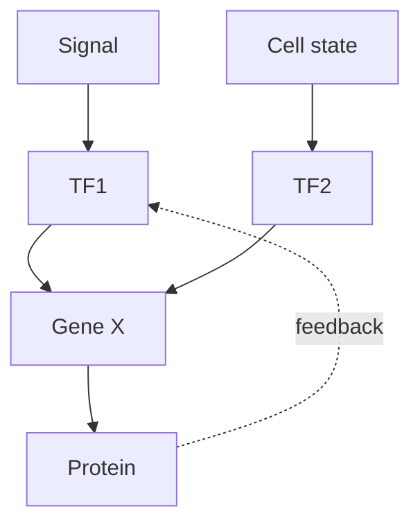

# DNA, Gene và Biểu hiện gene — DNA, Genes and Gene Expression (DNA, 유전자와 유전자 발현)

Cell signaling ở chapter trước có thể đổi activity của protein trong vài giây, nhưng nhiều response dài hạn cần thay đổi **gene expression**. Điều đó đưa ta tới câu hỏi nền tảng: **information sinh học được lưu dưới dạng nào, được copy ra sao, và làm thế nào sequence vật lý trong DNA trở thành protein/function?**

Chapter này xây causal chain từ nucleotide → DNA → gene → RNA → protein → phenotype. Mục tiêu không phải thuộc “central dogma” như một mũi tên, mà hiểu machinery và limitation ở từng bước.

> **Mental model:** DNA không phải “mệnh lệnh trực tiếp”. Nó là kho sequence được cell đọc có chọn lọc. Phenotype xuất hiện từ interaction giữa sequence, regulatory state, cellular machinery và environment.

## 1. Genome, chromosome và gene khác nhau thế nào?

**Genome (bộ gene / 유전체)** là toàn bộ genetic material của một organism/cell. Ở eukaryote, genome chủ yếu nằm trong nhiều **chromosome (nhiễm sắc thể / 염색체)** trong nucleus, cùng genome nhỏ ở mitochondria/chloroplast.

Chromosome là một DNA molecule rất dài kết hợp với protein. **Gene (유전자)** là một region DNA có functional product hoặc tham gia tạo functional RNA/protein theo regulatory context.

Không nên hình dung chromosome như “xâu gene liên tiếp không có khoảng trống”. Eukaryotic genome có promoter, enhancer, intron, repeat, noncoding RNA gene, structural region và nhiều sequence regulatory.

## 2. DNA structure: chemistry tạo khả năng copy information

DNA là polymer nucleotide. Mỗi nucleotide có deoxyribose, phosphate và base A/T/G/C.

DNA thường tạo double helix gồm hai strand antiparallel. A pair T; G pair C qua hydrogen bond và base stacking góp phần ổn định helix.

Complementarity tạo một property rất mạnh: **mỗi strand có thể làm template để tạo strand đối ứng**.

Đây là lý do chemistry của DNA phù hợp cho heredity.

## 3. Directionality 5′ → 3′ không phải ký hiệu trang trí

DNA strand có direction do phosphate-sugar backbone. Polymerase thêm nucleotide vào 3′-OH nên synthesis mới diễn ra 5′ → 3′.

Khi two strand antiparallel, restriction này tạo **leading strand** và **lagging strand** trong replication.

Một detail hóa học nhỏ dẫn đến architecture replication fork.

## 4. DNA replication: copy genome trước khi cell divide

Replication là **semi-conservative**: mỗi daughter DNA có một old strand và một new strand.

Process gồm:

1. helicase mở double helix;
2. single-strand binding protein giữ strand tách;
3. primase tạo primer;
4. DNA polymerase kéo dài strand;
5. lagging strand được tạo thành Okazaki fragment;
6. primer được thay và ligase nối fragment.

Danh sách enzyme chỉ có ý nghĩa khi nhìn theo problem: strand phải được mở, polymerase cần starting point, synthesis có directionality, fragment cần nối.

## 5. Proofreading và repair: information system phải quản lý error

DNA polymerase có proofreading giúp giảm error. Sau replication, mismatch repair và nhiều repair pathway sửa damage khác như base modification, strand break.

Không có system nào hoàn hảo. Error rất hiếm vẫn xảy ra và trở thành mutation.

Điểm sâu ở đây là life cần hai mục tiêu hơi mâu thuẫn:

- đủ fidelity để organism hoạt động và heredity ổn định;
- vẫn có variation để evolution xảy ra.

## 6. Mutation không phải lúc nào cũng do replication error

DNA có thể bị damage bởi UV, reactive chemical, oxidation hoặc spontaneous chemistry. Cell repair phần lớn damage; mutation là change sequence được giữ lại sau replication/repair outcome.

Mutation có thể là substitution, insertion, deletion, duplication, inversion hoặc larger chromosome rearrangement.

Effect phụ thuộc vị trí và context, không chỉ “loại mutation”.

## 7. Từ DNA sang RNA: transcription

**Transcription (phiên mã / 전사)** là synthesis RNA dùng DNA template.

RNA polymerase nhận biết promoter cùng transcription factor và tạo RNA 5′ → 3′.

Chỉ một portion genome được transcribed ở cell/context cụ thể. Đây là điểm quan trọng: tất cả cell có gần cùng genome nhưng không đọc cùng gene.

Gene expression bắt đầu từ regulation của accessibility và transcription initiation.

## 8. Promoter và enhancer: gene cần địa chỉ và logic control

**Promoter (프로모터)** là region gần transcription start site nơi transcription machinery assemble.

**Enhancer (인핸서)** có thể nằm xa gene và bind transcription factor; DNA looping đưa regulatory complex lại gần promoter.

Một gene có thể tích hợp nhiều signal qua nhiều regulatory element. Gene expression vì vậy giống logic circuit hơn simple on/off switch.

## 9. RNA processing: eukaryotic transcript chưa phải mRNA hoàn chỉnh

Primary transcript thường được processing:

- 5′ cap;
- poly(A) tail;
- splicing bỏ intron và nối exon.

**Alternative splicing** cho phép cùng gene tạo nhiều transcript/protein isoform tùy cell/context.

Điều này phá mental model “một gene = một protein”. Relationship thực tế phức tạp hơn.

## 10. Intron và exon: đừng hiểu exon = coding hoàn toàn

**Exon** là sequence được giữ trong mature RNA; exon có thể chứa untranslated region. **Intron** bị splice ra khỏi transcript mature điển hình.

Splicing phải rất chính xác; mutation tại splice site có thể làm transcript khác thường.

Gene architecture là một phần của regulation.

## 11. RNA có nhiều role hơn messenger

mRNA mang coding information tới ribosome. tRNA mang amino acid và đọc codon qua anticodon. rRNA là core structural/catalytic component của ribosome.

Ngoài ra còn microRNA, long noncoding RNA, small nuclear RNA và nhiều RNA regulator.

RNA vì vậy vừa là message, adapter, catalyst, scaffold và regulator.

## 12. Genetic code: sequence base được ánh xạ sang amino acid

Ribosome đọc mRNA theo **codon** gồm ba nucleotide. Mỗi codon tương ứng amino acid hoặc stop signal.

Vì 4³ = 64 codon nhưng chỉ khoảng 20 amino acid phổ biến, code có redundancy: nhiều codon có thể encode cùng amino acid.

Đây là lý do một số substitution là **synonymous** và không đổi amino acid, dù vẫn có thể ảnh hưởng splicing, RNA stability hoặc translation efficiency trong context tertentu.

## 13. Translation: ribosome biến sequence thành polypeptide

Ribosome đọc mRNA 5′ → 3′. tRNA mang amino acid phù hợp codon. Peptide bond được hình thành và chain kéo dài.

Translation gồm initiation, elongation, termination.

Nhưng protein mới tạo chưa chắc functional. Nó cần folding, modification, localization và đôi khi assembly với subunit khác.

Central dogma vì vậy không kết thúc ở “protein được tạo”.

## 14. Protein targeting: tạo đúng protein nhưng gửi sai chỗ vẫn có thể mất function

Signal peptide có thể hướng protein tới ER, mitochondria, nucleus hoặc organelle khác. Vesicle system tiếp tục sort cargo.

Nếu protein membrane bị giữ trong ER do folding sai, function ở cell surface mất dù coding sequence chỉ thay một amino acid.

Gene → phenotype luôn đi qua cell architecture.

## 15. Central dogma nên hiểu thế nào cho đúng?

Mô hình cơ bản:

```text
DNA → RNA → Protein
```

Mũi tên biểu diễn flow sequence information phổ biến từ DNA qua RNA đến protein.

Nhưng có reverse transcription RNA → DNA ở retrovirus; RNA có function trực tiếp; DNA không phải mọi information trong cell.

Central dogma không nói “mọi thứ chỉ đi một chiều đơn giản”; nó nhấn mạnh sequence information không thường được truyền từ protein trở lại nucleic-acid sequence theo cách template.

## 16. Gene regulation ở bacteria: operon cho thấy economy của unicellular life

Bacteria có thể tổ chức nhiều gene cùng function thành **operon**.

Lac operon ở E. coli là example kinh điển: gene cần cho lactose utilization được regulation theo lactose/glucose availability.

Logic này cho thấy gene expression gắn trực tiếp metabolism và environment.

Cell không muốn sản xuất enzyme tốn energy khi substrate không có.

## 17. Gene regulation ở eukaryote: nhiều layer hơn vì multicellularity

Eukaryotic gene regulation có thể diễn ra ở:

- chromatin accessibility;
- transcription initiation;
- RNA processing;
- RNA stability;
- translation;
- protein modification;
- protein degradation.

Các layer tạo khả năng control chính xác theo cell type, development và signal.

## 18. Chromatin: DNA phải được đóng gói nhưng vẫn cần đọc

Eukaryotic DNA quấn quanh histone tạo nucleosome. Chromatin compaction giúp genome dài fit trong nucleus nhưng cũng ảnh hưởng accessibility.

Histone modification, chromatin remodeler và DNA methylation có thể liên quan state expression.

Không nên nghĩ “DNA methylation = gene tắt” trong mọi context; effect phụ thuộc vị trí và system.

## 19. Epigenetic regulation: cùng sequence, khác state

**Epigenetics (후성유전학)** nghiên cứu change regulation có thể duy trì qua cell division mà không cần đổi DNA sequence, thường liên quan chromatin/DNA modification.

Trong development, liver cell và neuron có gần cùng DNA nhưng stable gene-expression program khác nhau.

Điều này giải thích multicellular differentiation.

Epigenetics không có nghĩa environment “viết lại gene tùy ý” và mọi acquired trait đều truyền qua generation. Transgenerational inheritance ở mammals có limitation và cần evidence cụ thể.

## 20. Gene expression là dynamic response, không phải identity cố định

Một cell có stable identity nhưng expression vẫn thay đổi theo nutrient, stress, hormone, circadian rhythm và signal.

Vì vậy transcriptome là snapshot trạng thái, không phải bản định nghĩa cố định của cell.

Điều này rất quan trọng khi đọc RNA-seq data.

## 21. Mutation → protein → phenotype: causal chain phải có intermediate

Ví dụ mutation làm codon đổi amino acid. Side chain mới có property khác. Protein folding hoặc active site thay đổi. Enzyme flux đổi. Cell physiology đổi. Tissue/function đổi.

Nhưng nhiều mutation không đi theo chain này vì:

- nằm vùng noncoding;
- synonymous;
- gene redundant;
- compensatory pathway;
- effect chỉ trong context đặc biệt.

Genotype–phenotype mapping không đơn giản một-một.

## 22. Hemoglobin và sickle-cell như case study structure–function–evolution

Một substitution trong beta-globin thay glutamate bằng valine ở vị trí đặc biệt. Under low oxygen, hemoglobin S có tendency polymerize, làm red blood cell biến dạng.

Điều đó ảnh hưởng blood flow, cell lifetime và clinical phenotype.

Nhưng allele có population pattern thú vị vì heterozygote có protection tương đối trước severe malaria ở một số environment.

Một molecular change nối protein chemistry, physiology và natural selection.

## 23. Gene dosage: số copy cũng quan trọng

Không chỉ sequence; copy number ảnh hưởng expression.

Duplication gene tạo material cho evolution: một copy giữ function cũ, copy khác có thể accumulate change và diverge.

Ở chromosome level, extra/missing chromosome làm dosage của hàng trăm gene đổi đồng thời, tạo systemic effect.

## 24. Mitochondrial DNA: heredity không chỉ trong nucleus

Mitochondria có genome riêng và ở humans thường inherited chủ yếu qua maternal line.

Một cell có nhiều mitochondria và nhiều mtDNA copy, nên mutation proportion (**heteroplasmy**) có thể ảnh hưởng severity/tissue pattern.

Đây là ví dụ làm Mendelian model đơn giản không đủ cho mọi inheritance.

## 25. Gene network: phenotype thường là output của nhiều gene tương tác

Transcription factor regulation tạo network. Một gene có thể regulate nhiều target; nhiều regulator converge lên một gene.



Network có feedback, redundancy và threshold. Vì vậy knockout một gene đôi khi effect nhỏ vì pathway compensate; trong trường hợp khác effect rất lớn nếu gene là bottleneck.

## 26. Genomics và sequencing: làm sao đọc genome?

Modern sequencing đọc hàng triệu/billion fragment rồi computational method map/assemble sequence.

Một DNA sequence thô chưa tự giải thích biology. Ta cần annotation, comparative genomics, expression data và experiment để gán function.

Bioinformatics vì vậy không tách khỏi molecular biology; nó là công cụ xử lý scale information quá lớn cho manual analysis.

## 27. CRISPR như ví dụ từ basic biology tới technology

CRISPR ban đầu được hiểu từ bacterial/archaeal adaptive defense. Guide RNA giúp protein Cas target nucleic-acid sequence tương ứng.

Biotechnology tận dụng recognition này để edit genome.

Một discovery từ microbiology → molecular mechanism → engineering tool. Đây là pattern xuyên library: hiểu mechanism mở đường cho technology.

## 28. Common misconceptions

“Gene là đoạn DNA luôn encode một protein” quá đơn giản; gene có thể tạo functional RNA, alternative isoform và regulatory complexity.

“Một gene quyết định một trait” thường sai; trait có thể polygenic và environment-dependent.

“Noncoding DNA là junk” sai; nhiều noncoding region có regulatory/structural function, dù không phải mọi sequence đều có selected function.

“Epigenetics thay thế genetics” sai; epigenetic state hoạt động trên nền genome và molecular machinery.

“Mutation luôn xấu” sai; effect có thể deleterious, neutral hoặc beneficial tùy context.

## 29. Bridge: information được truyền giữa generation như thế nào?

Ta đã hiểu DNA được copy và gene được expression. Nhưng organism diploid có hai allele; meiosis shuffle chromosome; fertilization kết hợp genome từ hai parent. Làm sao điều đó tạo Mendelian ratio? Recombination tạo variation ra sao? Trait continuous được giải thích thế nào?

Đó là nội dung của [[01_inheritance_variation_and_mutation]].

Sau đó [[02_genomics_epigenetics_and_regulation]] sẽ zoom trở lại genome-scale để hiểu regulatory architecture, omics và variation trên hàng nghìn/millions locus.

> **Mental model cuối chapter:** DNA là persistent information medium; gene expression là process context-dependent biến sequence thành functional molecule; phenotype là output của một chain nhiều tầng. Genetics chỉ trở nên dễ hiểu khi luôn theo dõi chain DNA → RNA → protein/network → cell → organism.