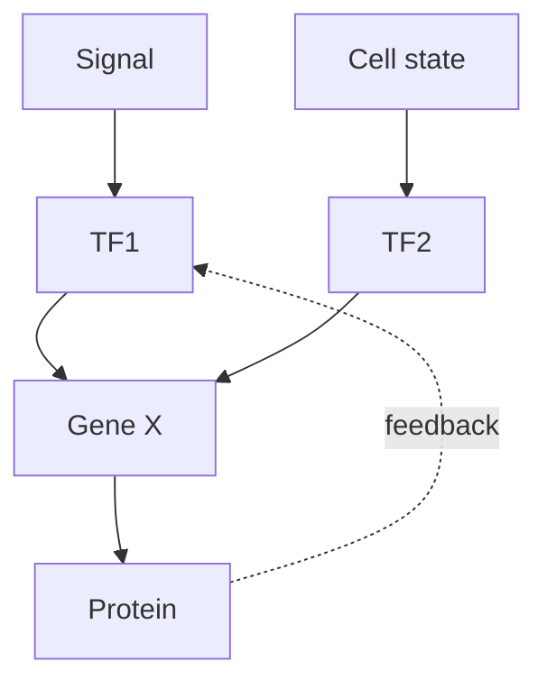

# DNA, Gene và Biểu hiện gene — DNA, Genes and Gene Expression (DNA, 유전자와 유전자 발현)

Truyền tín hiệu tế bào (cell signaling) ở chapter trước có thể đổi activity của protein trong vài giây, nhưng nhiều response dài hạn cần thay đổi **biểu hiện gen (gene expression)**. Điều đó đưa ta tới câu hỏi nền tảng: **information sinh học được lưu dưới dạng nào, được copy ra sao, và làm thế nào sequence vật lý trong DNA trở thành protein/chức năng (function)?**

Chapter này xây causal chain từ nucleotit (nucleotide) → DNA → gen (gene) → RNA → protein (protein) → kiểu hình (phenotype). Mục tiêu không phải thuộc “học thuyết trung tâm (central dogma)” như một mũi tên, mà hiểu machinery và giới hạn (limitation) ở từng bước.

> **Mô hình tư duy (mental model):** DNA không phải “mệnh lệnh trực tiếp”. Nó là kho sequence được cell đọc có chọn lọc. Phenotype xuất hiện từ interaction giữa sequence, regulatory state, bộ máy tế bào (cellular machinery) và môi trường (environment).

## 1. Hệ gen (genome), chromosome và gene khác nhau thế nào?

**Hệ gen (bộ gene / 유전체)** là toàn bộ vật chất di truyền (genetic material) của một organism/tế bào (cell). Ở eukaryote, genome chủ yếu nằm trong nhiều **nhiễm sắc thể (chromosome / 염색체)** trong nucleus, cùng genome nhỏ ở mitochondria/chloroplast.

Chromosome là một DNA molecule rất dài kết hợp với protein. **Gen (유전자)** là một region DNA có functional product hoặc tham gia tạo functional RNA/protein theo regulatory context.

Không nên hình dung chromosome như “xâu gene liên tiếp không có khoảng trống”. Eukaryotic genome có promoter, enhancer, intron, repeat, RNA không mã hóa (noncoding RNA) gen, structural region và nhiều sequence regulatory.

## 2. DNA structure: chemistry tạo khả năng copy information

DNA là polymer nucleotide. Mỗi nucleotide có deoxyribose, phosphate và base A/T/G/C.

DNA thường tạo xoắn kép (double helix) gồm hai strand antiparallel. A pair T; G pair C qua liên kết hydro (hydrogen bond) và base stacking góp phần ổn định helix.

Complementarity tạo một property rất mạnh: **mỗi strand có thể làm template để tạo strand đối ứng**.

Đây là lý do chemistry của DNA phù hợp cho tính di truyền (heredity).

## 3. Directionality 5′ → 3′ không phải ký hiệu trang trí

Mạch DNA (DNA strand) có direction do phosphate-sugar backbone. Polymerase thêm nucleotide vào 3′-OH nên synthesis mới diễn ra 5′ → 3′.

Khi two strand antiparallel, restriction này tạo **mạch dẫn đầu (leading strand)** và **mạch theo sau (lagging strand)** trong sao chép (replication).

Một detail hóa học nhỏ dẫn đến architecture chạc sao chép (replication fork).

## 4. DNA replication: copy genome trước khi cell divide

Replication là **semi-conservative**: mỗi daughter DNA có một old strand và một new strand.

Process gồm:

1. helicase mở xoắn kép;
2. protein gắn mạch đơn (single-strand binding protein) giữ strand tách;
3. primase tạo primer;
4. DNA polymerase kéo dài strand;
5. mạch theo sau được tạo thành Đoạn Okazaki (Okazaki fragment);
6. primer được thay và ligase nối fragment.

Danh sách enzyme chỉ có ý nghĩa khi nhìn theo vấn đề (problem): strand phải được mở, polymerase cần starting point, synthesis có directionality, fragment cần nối.

## 5. Đọc sửa (proofreading) và repair: thông tin (information) system phải quản lý error

DNA polymerase có đọc sửa giúp giảm error. Sau sao chép, sửa chữa bắt cặp sai (mismatch repair) và nhiều repair pathway sửa damage khác như base modification, strand break.

Không có system nào hoàn hảo. Error rất hiếm vẫn xảy ra và trở thành mutation.

Điểm sâu ở đây là life cần hai mục tiêu hơi mâu thuẫn:

- đủ fidelity để organism hoạt động và tính di truyền ổn định;
- vẫn có biến dị (variation) để evolution xảy ra.

## 6. Mutation không phải lúc nào cũng do replication error

DNA có thể bị damage bởi UV, reactive chemical, oxidation hoặc spontaneous chemistry. Cell repair phần lớn damage; mutation là change sequence được giữ lại sau sao chép/repair outcome.

Mutation có thể là substitution, insertion, deletion, duplication, inversion hoặc larger chromosome rearrangement.

Effect phụ thuộc vị trí và bối cảnh (context), không chỉ “loại mutation”.

## 7. Từ DNA sang RNA: phiên mã (transcription)

**Phiên mã (phiên mã / 전사)** là synthesis RNA dùng DNA template.

RNA polymerase nhận biết promoter cùng yếu tố phiên mã (transcription factor) và tạo RNA 5′ → 3′.

Chỉ một portion genome được transcribed ở tế bào/context cụ thể. Đây là điểm quan trọng: tất cả cell có gần cùng genome nhưng không đọc cùng gene.

Biểu hiện gen bắt đầu từ regulation của accessibility và transcription initiation.

## 8. Promoter và enhancer: gene cần địa chỉ và lôgic (logic) điều khiển (control)

**Promoter (프로모터)** là region gần transcription start site nơi transcription machinery assemble.

**Enhancer (인핸서)** có thể nằm xa gene và bind yếu tố phiên mã; DNA looping đưa regulatory complex lại gần promoter.

Một gene có thể tích hợp nhiều signal qua nhiều regulatory element. Biểu hiện gen vì vậy giống logic circuit hơn simple on/off switch.

## 9. RNA processing: eukaryotic transcript chưa phải mRNA hoàn chỉnh

Primary transcript thường được processing:

- 5′ cap;
- poly(A) tail;
- splicing bỏ intron và nối exon.

**Cắt nối thay thế (alternative splicing)** cho phép cùng gene tạo nhiều transcript/protein isoform tùy cell/bối cảnh.

Điều này phá mô hình tư duy “một gene = một protein”. Relationship thực tế phức tạp hơn.

## 10. Intron và exon: đừng hiểu exon = coding hoàn toàn

**Exon** là trình tự (sequence) được giữ trong mature RNA; exon có thể chứa untranslated region. **Intron** bị splice ra khỏi transcript mature điển hình.

Splicing phải rất chính xác; mutation tại splice site có thể làm transcript khác thường.

Gen architecture là một phần của regulation.

## 11. RNA có nhiều role hơn messenger

mRNA mang coding information tới ribosome. tRNA mang axit amin (amino acid) và đọc codon qua anticodon. rRNA là core structural/catalytic component của ribosome.

Ngoài ra còn microRNA, long RNA không mã hóa, small nuclear RNA và nhiều RNA regulator.

RNA vì vậy vừa là message, adapter, chất xúc tác (catalyst), scaffold và regulator.

## 12. Mã di truyền (genetic code): sequence base được ánh xạ sang axit amin

Ribosome đọc mRNA theo **codon** gồm ba nucleotit. Mỗi codon tương ứng axit amin hoặc stop signal.

Vì 4³ = 64 codon nhưng chỉ khoảng 20 axit amin phổ biến, code có redundancy: nhiều codon có thể encode cùng axit amin.

Đây là lý do một số substitution là **synonymous** và không đổi axit amin, dù vẫn có thể ảnh hưởng splicing, RNA stability hoặc translation efficiency trong context tertentu.

## 13. Dịch mã (translation): ribosome biến sequence thành polypeptide

Ribosome đọc mRNA 5′ → 3′. tRNA mang axit amin phù hợp codon. Peptide bond được hình thành và chain kéo dài.

Translation gồm initiation, elongation, termination.

Nhưng protein mới tạo chưa chắc functional. Nó cần folding, modification, localization và đôi khi assembly với subunit khác.

Học thuyết trung tâm vì vậy không kết thúc ở “protein được tạo”.

## 14. Protein targeting: tạo đúng protein nhưng gửi sai chỗ vẫn có thể mất function

Signal peptide có thể hướng protein tới ER, mitochondria, nucleus hoặc organelle khác. Vesicle system tiếp tục sort cargo.

Nếu protein membrane bị giữ trong ER do folding sai, chức năng ở cell surface mất dù trình tự mã hóa (coding sequence) chỉ thay một axit amin.

Gen → phenotype luôn đi qua tế bào kiến trúc (architecture).

## 15. Học thuyết trung tâm nên hiểu thế nào cho đúng?

Mô hình cơ bản:

```text
DNA → RNA → Protein
```

Mũi tên biểu diễn flow trình tự information phổ biến từ DNA qua RNA đến protein.

Nhưng có reverse transcription RNA → DNA ở retrovirus; RNA có function trực tiếp; DNA không phải mọi information trong tế bào.

Học thuyết trung tâm không nói “mọi thứ chỉ đi một chiều đơn giản”; nó nhấn mạnh sequence information không thường được truyền từ protein trở lại nucleic-acid sequence theo cách template.

## 16. Điều hòa gen (gene regulation) ở bacteria: operon cho thấy economy của unicellular life

Bacteria có thể tổ chức nhiều gene cùng function thành **operon**.

Lac operon ở E. coli là example kinh điển: gene cần cho lactose utilization được regulation theo lactose/glucose availability.

Logic này cho thấy biểu hiện gen gắn trực tiếp metabolism và môi trường.

Cell không muốn sản xuất enzyme tốn energy khi substrate không có.

## 17. Điều hòa gen ở eukaryote: nhiều layer hơn vì multicellularity

Eukaryotic điều hòa gen có thể diễn ra ở:

- khả năng tiếp cận nhiễm sắc chất (chromatin accessibility);
- transcription initiation;
- RNA processing;
- RNA stability;
- dịch mã;
- protein modification;
- phân giải protein (protein degradation).

Các layer tạo khả năng control chính xác theo loại tế bào (cell type), development và tín hiệu (signal).

## 18. Chromatin: DNA phải được đóng gói nhưng vẫn cần đọc

Eukaryotic DNA quấn quanh histone tạo nucleosome. Chromatin compaction giúp genome dài fit trong nucleus nhưng cũng ảnh hưởng accessibility.

Biến đổi histone (histone modification), chromatin remodeler và Methyl hóa DNA (DNA methylation) có thể liên quan state expression.

Không nên nghĩ “Methyl hóa DNA = gene tắt” trong mọi context; effect phụ thuộc vị trí và hệ thống (system).

## 19. Epigenetic regulation: cùng sequence, khác state

**Epigenetics (후성유전학)** nghiên cứu change regulation có thể duy trì qua phân chia tế bào (cell division) mà không cần đổi DNA sequence, thường liên quan chromatin/DNA modification.

Trong phát triển (development), liver cell và neuron có gần cùng DNA nhưng stable gene-expression program khác nhau.

Điều này giải thích multicellular differentiation.

Epigenetics không có nghĩa environment “viết lại gene tùy ý” và mọi acquired trait đều truyền qua generation. Transgenerational inheritance ở mammals có limitation và cần evidence cụ thể.

## 20. Biểu hiện gen là dynamic response, không phải identity cố định

Một cell có stable identity nhưng expression vẫn thay đổi theo chất dinh dưỡng (nutrient), căng thẳng (stress), hoóc-môn (hormone), nhịp sinh học ngày đêm (circadian rhythm) và tín hiệu.

Vì vậy transcriptome là snapshot trạng thái, không phải bản định nghĩa cố định của cell.

Điều này rất quan trọng khi đọc RNA-seq data.

## 21. Đột biến (mutation) → protein → kiểu hình: causal chain phải có intermediate

Ví dụ mutation làm codon đổi axit amin. Mạch bên (side chain) mới có property khác. Sự gấp cuộn protein (protein folding) hoặc trung tâm hoạt động (active site) thay đổi. Enzym (enzyme) dòng chuyển hóa (flux) đổi. Tế bào sinh lý học (physiology) đổi. Mô (tissue)/chức năng đổi.

Nhưng nhiều mutation không đi theo chain này vì:

- nằm vùng noncoding;
- synonymous;
- gene redundant;
- compensatory pathway;
- effect chỉ trong bối cảnh đặc biệt.

Kiểu gen (genotype)–phenotype mapping không đơn giản một-một.

## 22. Hemoglobin và sickle-cell như tình huống phân tích (case study) cấu trúc (structure)–chức năng–tiến hóa (evolution)

Một substitution trong beta-globin thay glutamate bằng valine ở vị trí đặc biệt. Under thiếu oxy (low oxygen), hemoglobin S có tendency polymerize, làm red blood cell biến dạng.

Điều đó ảnh hưởng dòng máu (blood flow), cell lifetime và clinical phenotype.

Nhưng allele có quần thể (population) pattern thú vị vì heterozygote có protection tương đối trước severe malaria ở một số môi trường.

Một molecular change nối protein hóa học (chemistry), physiology và chọn lọc tự nhiên (natural selection).

## 23. Gene dosage: số copy cũng quan trọng

Không chỉ trình tự; copy number ảnh hưởng expression.

Duplication gene tạo material cho tiến hóa: một copy giữ function cũ, copy khác có thể accumulate change và diverge.

Ở chromosome level, extra/missing chromosome làm dosage của hàng trăm gene đổi đồng thời, tạo systemic effect.

## 24. Mitochondrial DNA: heredity không chỉ trong nucleus

Mitochondria có genome riêng và ở humans thường inherited chủ yếu qua maternal line.

Một cell có nhiều mitochondria và nhiều mtDNA copy, nên mutation proportion (**heteroplasmy**) có thể ảnh hưởng severity/mô mẫu hình (pattern).

Đây là ví dụ làm Mendelian model đơn giản không đủ cho mọi inheritance.

## 25. Gen mạng lưới (network): phenotype thường là output của nhiều gene tương tác

Yếu tố phiên mã regulation tạo mạng lưới (network). Một gene có thể regulate nhiều target; nhiều regulator converge lên một gene.



Network có phản hồi (feedback), redundancy và ngưỡng (threshold). Vì vậy knockout một gene đôi khi effect nhỏ vì pathway compensate; trong trường hợp khác effect rất lớn nếu gene là bottleneck.

## 26. Genomics và giải trình tự (sequencing): làm sao đọc genome?

Giải trình tự hiện đại (modern sequencing) đọc hàng triệu/billion fragment rồi computational method map/assemble sequence.

Một DNA sequence thô chưa tự giải thích biology. Ta cần annotation, comparative genomics, expression data và thí nghiệm (experiment) để gán function.

Bioinformatics vì vậy không tách khỏi sinh học phân tử (molecular biology); nó là công cụ xử lý scale information quá lớn cho manual analysis.

## 27. CRISPR như ví dụ từ basic biology tới technology

CRISPR ban đầu được hiểu từ bacterial/archaeal adaptive defense. Guide RNA giúp protein Cas target nucleic-acid sequence tương ứng.

Biotechnology tận dụng recognition này để edit genome.

Một discovery từ microbiology → molecular mechanism → engineering tool. Đây là pattern xuyên library: hiểu mechanism mở đường cho technology.

## 28. Các hiểu lầm phổ biến (common misconceptions)

“Gene là đoạn DNA luôn encode một protein” quá đơn giản; gene có thể tạo functional RNA, alternative isoform và regulatory complexity.

“Một gene quyết định một trait” thường sai; trait có thể polygenic và môi trường-dependent.

“DNA không mã hóa (noncoding DNA) là junk” sai; nhiều noncoding region có regulatory/structural function, dù không phải mọi sequence đều có selected function.

“Epigenetics thay thế di truyền học (genetics)” sai; epigenetic state hoạt động trên nền genome và bộ máy phân tử (molecular machinery).

“Mutation luôn xấu” sai; effect có thể deleterious, neutral hoặc beneficial tùy context.

<!-- depth-audit-2026:expression-dynamics -->
## Biểu hiện gen là một hệ động, không phải công tắc DNA → protein

Một gene được phiên mã nhanh chưa chắc tạo nhiều protein nếu mRNA bị phân hủy nhanh hoặc translation bị ức chế. Mô hình tối giản cho mRNA \(M\) và protein \(P\) là:

\[
\frac{dM}{dt}=k_{tx}-\gamma_M M
\]

\[
\frac{dP}{dt}=k_{tl}M-\gamma_P P
\]

Tốc độ tạo và tốc độ mất cùng quyết định mức ổn định và thời gian đáp ứng. Protein có **thời gian bán hủy (half-life)** dài tạo memory sinh học lâu hơn nhưng thay đổi chậm; protein bị phân hủy nhanh tốn năng lượng để tổng hợp lại nhưng cho phép hệ đổi trạng thái nhanh. Vì vậy degradation là một phần của regulation chứ không chỉ là “dọn rác”.

Phiên mã cũng có thể xảy ra thành từng đợt (**transcriptional bursting**), khiến hai tế bào có cùng genome tạm thời có lượng mRNA khác nhau. Nhiễu này đôi khi bất lợi, nhưng trong development hoặc ở vi sinh vật nó cũng có thể tạo nhiều trạng thái tế bào để population đối phó môi trường biến động.

Kiểm soát chất lượng chạy xuyên toàn chuỗi: proofreading khi replication, RNA processing, nonsense-mediated decay, chaperone và proteasome ở protein. Failure ở một lớp có thể được bù bởi lớp khác; khi nhiều lớp cùng suy yếu, ảnh hưởng từ genotype tới phenotype trở nên mạnh hơn.

Evolution thường bảo tồn những nucleotide, amino-acid residue, promoter element hoặc interaction thực sự hạn chế function. Ngược lại, vùng chịu ít constraint có thể tích lũy thay đổi nhanh hơn. Vì vậy pattern conservation trong sequence là manh mối về function, nhưng vẫn cần experiment để kiểm tra cơ chế.

<!-- continuity-2026:replication-fork -->
## Chạc sao chép là một cỗ máy phối hợp, không phải một polymerase chạy dọc DNA

Hai mạch DNA ngược chiều nhau tạo constraint vật lý. Helicase mở xoắn; topoisomerase giải ứng suất xoắn phía trước; primase tạo mồi; DNA polymerase chỉ kéo dài theo chiều 5′→3′. Vì vậy mạch dẫn đầu có thể được tổng hợp tương đối liên tục, còn mạch theo sau phải tạo các đoạn Okazaki rồi nối lại bằng ligase.

Cơ chế này cần điều hòa theo thời gian. Ở tế bào nhân thực, origin được “cấp phép” trước pha S nhưng không được kích hoạt lặp lại tùy ý; nếu một vùng DNA được sao chép hai lần trong cùng chu kỳ, dosage và cấu trúc chromosome có thể rối loạn. Khi fork gặp tổn thương hoặc thiếu nucleotide, checkpoint làm chậm chu kỳ, ổn định fork và huy động sửa chữa.

Failure của replication không chỉ tạo point mutation. Fork bị sụp có thể tạo đứt gãy hai mạch, tái sắp xếp chromosome hoặc thay đổi số bản sao (copy-number change). Vì vậy genome stability nối trực tiếp từ chemistry của base pairing tới cell-cycle regulation và cuối cùng tới cancer/evolution.

Thí nghiệm Meselson–Stahl dùng isotope nitơ để theo dõi mật độ DNA qua thế hệ và cho kết quả phù hợp với **sao chép bán bảo tồn (semiconservative replication)**. Giá trị của thí nghiệm nằm ở logic: các mô hình replication khác nhau dự đoán các phân bố mật độ khác nhau, nên measurement có thể loại trừ model.

## 29. Cầu nối: thông tin được truyền giữa các thế hệ như thế nào?

Ta đã hiểu DNA được sao chép và gene được biểu hiện. Nhưng sinh vật lưỡng bội có hai allele ở nhiều locus; giảm phân tách các chromosome homolog, tái tổ hợp sắp xếp lại allele và thụ tinh kết hợp genome từ hai cá thể bố mẹ. Làm sao các cơ chế vật lý này tạo ra tỷ lệ Mendel? Vì sao gene gần nhau không phân ly độc lập hoàn toàn? Tính trạng liên tục được hình thành từ nhiều locus và môi trường như thế nào?

Đó là nội dung của [Di truyền, Biến dị và Đột biến](01_inheritance_variation_and_mutation.md).

Sau đó [Genomics, Epigenetics và Điều hòa hệ gene](02_genomics_epigenetics_and_regulation.md) mở rộng từ từng gene sang toàn genome để hiểu kiến trúc điều hòa, dữ liệu omics và biến dị trên hàng nghìn đến hàng triệu locus.

> **Mô hình tư duy cuối chapter:** DNA là môi trường lưu trữ thông tin bền vững; biểu hiện gen là quá trình phụ thuộc bối cảnh biến trình tự thành RNA/protein có chức năng; kiểu hình là kết quả của một chuỗi nhiều tầng. Di truyền học dễ hiểu hơn khi luôn lần theo DNA → RNA → protein/mạng lưới → tế bào → sinh vật.

---

<!-- biology-learning-navigation -->
**Điều hướng học:** [← Đa bào, mô và chất nền ngoại bào](../01_cell_biology/03_multicellularity_tissues_and_extracellular_matrix.md) · [Mục lục Biology](../README.md) · [Di truyền, Biến dị và Đột biến →](01_inheritance_variation_and_mutation.md)
