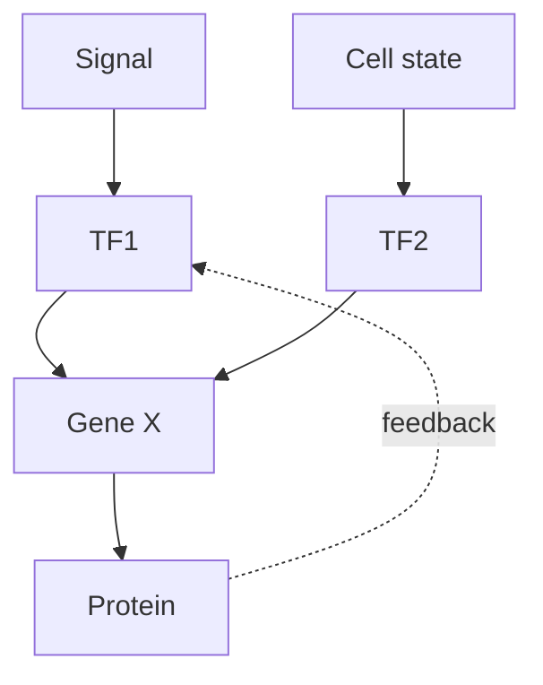

# DNA, Gene và Biểu hiện gene — DNA, Genes and Gene Expression (DNA, 유전자와 유전자 발현)

> **Mạch đọc:** [README](../README.md) là bản đồ owner của **DNA, Gene và Biểu hiện gene — DNA, Genes and Gene Expression (DNA, 유전자와 유전자 발현)**; nhìn vào vị trí đó trước để biết file này đang phục vụ nhánh kiến thức nào. **1. Hệ gen (genome), chromosome và gene khác nhau thế nào?** mở đối tượng chính của file và câu hỏi cần theo dõi; sau đó sang **2. DNA cấu trúc (structure / 구조): chemistry tạo khả năng bản sao (copy / 복사) thông tin (information / 정보)** để mở rộng đối tượng sang phạm vi kế cận. Cách đi này giữ lại điểm tựa của section đầu và cho biết kết luận sẽ được dùng ở đâu, thay vì dừng ở định nghĩa đầu tiên.

Truyền tín hiệu tế bào (cell signaling) ở chapter trước có thể đổi activity của protein trong vài giây, nhưng nhiều phản hồi (response / 응답) dài hạn cần thay đổi **biểu hiện gen (gene expression)**. Điều đó đưa ta tới câu hỏi nền tảng: **thông tin (information / 정보) sinh học được lưu dưới dạng nào, được bản sao (copy / 복사) ra sao, và làm thế nào chuỗi (sequence / 시퀀스) vật lý trong DNA trở thành protein/chức năng (function)?**

Chapter này xây chuỗi nhân quả (causal chain / 인과 사슬) từ nucleotit (nucleotide) → DNA → gen (gene) → RNA → protein (protein) → kiểu hình (phenotype). Mục tiêu không phải thuộc “học thuyết trung tâm (central dogma)” như một mũi tên, mà hiểu machinery và giới hạn (limitation) ở từng bước.

> **mô hình tư duy (mental model / 사고 모델):** DNA không phải “mệnh lệnh trực tiếp”. Nó là kho chuỗi (sequence / 시퀀스) được cell đọc có chọn lọc. Phenotype xuất hiện từ tương tác (interaction / 상호작용) giữa chuỗi (sequence / 시퀀스), regulatory trạng thái (state / 상태), bộ máy tế bào (cellular machinery) và môi trường (environment / 환경).

## 1. Hệ gen (genome), chromosome và gene khác nhau thế nào?

**Hệ gen (bộ gene / 유전체)** là toàn bộ vật chất di truyền (genetic material) của một organism/tế bào (cell). Ở eukaryote, genome chủ yếu nằm trong nhiều **nhiễm sắc thể (chromosome / 염색체)** trong nucleus, cùng genome nhỏ ở mitochondria/chloroplast.

Chromosome là một DNA molecule rất dài kết hợp với protein. **Gen (유전자)** là một region DNA có functional sản phẩm (product / 제품) hoặc tham gia tạo functional RNA/protein theo regulatory ngữ cảnh (context / 맥락).

Không nên hình dung chromosome như “xâu gene liên tiếp không có khoảng trống”. Eukaryotic genome có promoter, enhancer, intron, repeat, RNA không mã hóa (noncoding RNA) gen, structural region và nhiều chuỗi (sequence / 시퀀스) regulatory.

> **Chuyển mạch:** Genome/chromosome/gene đặt quy mô thông tin; DNA chemistry giải thích copying, còn 5′→3′ directionality quyết định enzyme và expression mechanism tiếp theo.

## 2. DNA cấu trúc (structure / 구조): chemistry tạo khả năng bản sao (copy / 복사) thông tin (information / 정보)

DNA là polymer nucleotide. Mỗi nucleotide có deoxyribose, phosphate và cơ sở (base / 기반) A/T/G/C.

DNA thường tạo xoắn kép (double helix) gồm hai strand antiparallel. A pair T; G pair C qua liên kết hydro (hydrogen bond) và cơ sở (base / 기반) stacking góp phần ổn định helix.

Complementarity tạo một thuộc tính (property / 속성) rất mạnh: **mỗi strand có thể làm template để tạo strand đối ứng**.

Đây là lý do chemistry của DNA phù hợp cho tính di truyền (heredity).

> **Chuyển mạch:** Ở chặng này của **DNA, Gene và Biểu hiện gene — DNA, Genes and Gene Expression (DNA, 유전자와 유전자 발현)**, **3. Directionality 5′ → 3′ không phải ký hiệu trang trí** tiếp nhận điểm tựa từ **2. DNA cấu trúc (structure / 구조): chemistry tạo khả năng bản sao (copy / 복사) thông tin (information / 정보)** nhưng đổi góc nhìn sang câu hỏi của chính nó; đọc liền hai mục để thấy mối quan hệ đó. Từ đây, **4. DNA replication: bản sao (copy / 복사) genome trước khi cell divide** sẽ cho biết hệ quả hoặc giới hạn ấy hiện ra ở đâu.

## 3. Directionality 5′ → 3′ không phải ký hiệu trang trí

Mạch DNA (DNA strand) có direction do phosphate-sugar backbone. Polymerase thêm nucleotide vào 3′-OH nên synthesis mới diễn ra 5′ → 3′.

Khi two strand antiparallel, restriction này tạo **mạch dẫn đầu (leading strand)** và **mạch theo sau (lagging strand)** trong sao chép (replication).

Một detail hóa học nhỏ dẫn đến kiến trúc (architecture / 아키텍처) chạc sao chép (replication fork).

> **Chuyển mạch:** Đặt trong câu hỏi lớn của **DNA, Gene và Biểu hiện gene — DNA, Genes and Gene Expression (DNA, 유전자와 유전자 발현)**, **4. DNA replication: bản sao (copy / 복사) genome trước khi cell divide** tiếp nhận điểm tựa từ **3. Directionality 5′ → 3′ không phải ký hiệu trang trí** nhưng đổi góc nhìn sang câu hỏi của chính nó; đọc liền hai mục để thấy mối quan hệ đó. Từ đây, **5. Đọc sửa (proofreading) và repair: thông tin (information / 정보) hệ thống (system / 시스템) phải quản lý lỗi (error / 오류)** sẽ cho biết hệ quả hoặc giới hạn ấy hiện ra ở đâu.

## 4. DNA replication: bản sao (copy / 복사) genome trước khi cell divide

Replication là **semi-conservative**: mỗi daughter DNA có một old strand và một new strand.

Tiến trình (process / 프로세스) gồm:

1. helicase mở xoắn kép;
2. protein gắn mạch đơn (single-strand binding protein) giữ strand tách;
3. primase tạo primer;
4. DNA polymerase kéo dài strand;
5. mạch theo sau được tạo thành Đoạn Okazaki (Okazaki fragment);
6. primer được thay và ligase nối fragment.

Danh sách enzyme chỉ có ý nghĩa khi nhìn theo vấn đề (problem): strand phải được mở, polymerase cần starting điểm (point / 지점), synthesis có directionality, fragment cần nối.

> **Chuyển mạch:** Trong **DNA, Gene và Biểu hiện gene — DNA, Genes and Gene Expression (DNA, 유전자와 유전자 발현)**, **5. Đọc sửa (proofreading) và repair: thông tin (information / 정보) hệ thống (system / 시스템) phải quản lý lỗi (error / 오류)** tiếp nhận điểm tựa từ **4. DNA replication: bản sao (copy / 복사) genome trước khi cell divide** nhưng đổi góc nhìn sang câu hỏi của chính nó; đọc liền hai mục để thấy mối quan hệ đó. Từ đây, **6. Mutation không phải lúc nào cũng do replication lỗi (error / 오류)** sẽ cho biết hệ quả hoặc giới hạn ấy hiện ra ở đâu.

## 5. Đọc sửa (proofreading) và repair: thông tin (information / 정보) hệ thống (system / 시스템) phải quản lý lỗi (error / 오류)

DNA polymerase có đọc sửa giúp giảm lỗi (error / 오류). Sau sao chép, sửa chữa bắt cặp sai (mismatch repair) và nhiều repair pathway sửa damage khác như cơ sở (base / 기반) modification, strand break.

Không có hệ thống (system / 시스템) nào hoàn hảo. lỗi (error / 오류) rất hiếm vẫn xảy ra và trở thành mutation.

Điểm sâu ở đây là life cần hai mục tiêu hơi mâu thuẫn:

- đủ fidelity để organism hoạt động và tính di truyền ổn định;
- vẫn có biến dị (variation) để evolution xảy ra.

> **Chuyển mạch:** Ở chặng này của **DNA, Gene và Biểu hiện gene — DNA, Genes and Gene Expression (DNA, 유전자와 유전자 발현)**, **6. Mutation không phải lúc nào cũng do replication lỗi (error / 오류)** tiếp nhận điểm tựa từ **5. Đọc sửa (proofreading) và repair: thông tin (information / 정보) hệ thống (system / 시스템) phải quản lý lỗi (error / 오류)** nhưng đổi góc nhìn sang câu hỏi của chính nó; đọc liền hai mục để thấy mối quan hệ đó. Từ đây, **7. Từ DNA sang RNA: phiên mã (transcription)** sẽ cho biết hệ quả hoặc giới hạn ấy hiện ra ở đâu.

## 6. Mutation không phải lúc nào cũng do replication lỗi (error / 오류)

DNA có thể bị damage bởi UV, reactive chemical, oxidation hoặc spontaneous chemistry. Cell repair phần lớn damage; mutation là thay đổi (change / 변경) chuỗi (sequence / 시퀀스) được giữ lại sau sao chép/repair kết quả (outcome / 결과).

Mutation có thể là substitution, insertion, deletion, duplication, inversion hoặc larger chromosome rearrangement.

Tác động (effect / 효과) phụ thuộc vị trí và bối cảnh (context), không chỉ “loại mutation”.

> **Chuyển mạch:** Đặt trong câu hỏi lớn của **DNA, Gene và Biểu hiện gene — DNA, Genes and Gene Expression (DNA, 유전자와 유전자 발현)**, **7. Từ DNA sang RNA: phiên mã (transcription)** tiếp nhận điểm tựa từ **6. Mutation không phải lúc nào cũng do replication lỗi (error / 오류)** nhưng đổi góc nhìn sang câu hỏi của chính nó; đọc liền hai mục để thấy mối quan hệ đó. Từ đây, **8. Promoter và enhancer: gene cần địa chỉ và lôgic (logic) điều khiển (control / 제어)** sẽ cho biết hệ quả hoặc giới hạn ấy hiện ra ở đâu.

## 7. Từ DNA sang RNA: phiên mã (transcription)

**Phiên mã (phiên mã / 전사)** là synthesis RNA dùng DNA template.

RNA polymerase nhận biết promoter cùng yếu tố phiên mã (transcription factor) và tạo RNA 5′ → 3′.

Chỉ một portion genome được transcribed ở tế bào/ngữ cảnh (context / 맥락) cụ thể. Đây là điểm quan trọng: tất cả cell có gần cùng genome nhưng không đọc cùng gene.

Biểu hiện gen bắt đầu từ regulation của khả năng tiếp cận (accessibility / 접근성) và transcription initiation.

> **Chuyển mạch:** Trong **DNA, Gene và Biểu hiện gene — DNA, Genes and Gene Expression (DNA, 유전자와 유전자 발현)**, **8. Promoter và enhancer: gene cần địa chỉ và lôgic (logic) điều khiển (control / 제어)** tiếp nhận điểm tựa từ **7. Từ DNA sang RNA: phiên mã (transcription)** nhưng đổi góc nhìn sang câu hỏi của chính nó; đọc liền hai mục để thấy mối quan hệ đó. Từ đây, **9. RNA processing: eukaryotic transcript chưa phải mRNA hoàn chỉnh** sẽ cho biết hệ quả hoặc giới hạn ấy hiện ra ở đâu.

## 8. Promoter và enhancer: gene cần địa chỉ và lôgic (logic) điều khiển (control / 제어)

**Promoter (프로모터)** là region gần transcription start site nơi transcription machinery assemble.

**Enhancer (인핸서)** có thể nằm xa gene và bind yếu tố phiên mã; DNA looping đưa regulatory complex lại gần promoter.

Một gene có thể tích hợp nhiều tín hiệu (signal / 신호) qua nhiều regulatory element. Biểu hiện gen vì vậy giống lô-gic (logic / 논리) circuit hơn simple on/off switch.

> **Chuyển mạch:** Ở chặng này của **DNA, Gene và Biểu hiện gene — DNA, Genes and Gene Expression (DNA, 유전자와 유전자 발현)**, **8. Promoter và enhancer: gene cần địa chỉ và lôgic (logic) điều khiển (control / 제어)** xác định đầu vào; **9. RNA processing: eukaryotic transcript chưa phải mRNA hoàn chỉnh** giải thích bước vận hành tạo ra kết quả kế tiếp. Từ đây, **10. Intron và exon: đừng hiểu exon = coding hoàn toàn** sẽ cho biết hệ quả hoặc giới hạn ấy hiện ra ở đâu.

## 9. RNA processing: eukaryotic transcript chưa phải mRNA hoàn chỉnh

Primary transcript thường được processing:

- 5′ cap;
- poly(A) tail;
- splicing bỏ intron và nối exon.

**Cắt nối thay thế (alternative splicing)** cho phép cùng gene tạo nhiều transcript/protein isoform tùy cell/bối cảnh.

Điều này phá mô hình tư duy “một gene = một protein”. Relationship thực tế phức tạp hơn.

> **Chuyển mạch:** Đặt trong câu hỏi lớn của **DNA, Gene và Biểu hiện gene — DNA, Genes and Gene Expression (DNA, 유전자와 유전자 발현)**, **9. RNA processing: eukaryotic transcript chưa phải mRNA hoàn chỉnh** xác định đầu vào; **10. Intron và exon: đừng hiểu exon = coding hoàn toàn** giải thích bước vận hành tạo ra kết quả kế tiếp. Từ đây, **11. RNA có nhiều role hơn messenger** sẽ cho biết hệ quả hoặc giới hạn ấy hiện ra ở đâu.

## 10. Intron và exon: đừng hiểu exon = coding hoàn toàn

**Exon** là trình tự (sequence) được giữ trong mature RNA; exon có thể chứa untranslated region. **Intron** bị splice ra khỏi transcript mature điển hình.

Splicing phải rất chính xác; mutation tại splice site có thể làm transcript khác thường.

Gen kiến trúc (architecture / 아키텍처) là một phần của regulation.

> **Chuyển mạch:** Trong **DNA, Gene và Biểu hiện gene — DNA, Genes and Gene Expression (DNA, 유전자와 유전자 발현)**, **11. RNA có nhiều role hơn messenger** tiếp nhận điểm tựa từ **10. Intron và exon: đừng hiểu exon = coding hoàn toàn** nhưng đổi góc nhìn sang câu hỏi của chính nó; đọc liền hai mục để thấy mối quan hệ đó. Từ đây, **12. Mã di truyền (genetic code): chuỗi (sequence / 시퀀스) cơ sở (base / 기반) được ánh xạ sang axit amin** sẽ cho biết hệ quả hoặc giới hạn ấy hiện ra ở đâu.

## 11. RNA có nhiều role hơn messenger

mRNA mang coding thông tin (information / 정보) tới ribosome. tRNA mang axit amin (amino acid) và đọc codon qua anticodon. rRNA là cốt lõi (core / 핵심) structural/catalytic thành phần (component / 컴포넌트) của ribosome.

Ngoài ra còn microRNA, long RNA không mã hóa, small nuclear RNA và nhiều RNA regulator.

RNA vì vậy vừa là message, adapter, chất xúc tác (catalyst), scaffold và regulator.

> **Chuyển mạch:** Ở chặng này của **DNA, Gene và Biểu hiện gene — DNA, Genes and Gene Expression (DNA, 유전자와 유전자 발현)**, **11. RNA có nhiều role hơn messenger** xác định đầu vào; **12. Mã di truyền (genetic code): chuỗi (sequence / 시퀀스) cơ sở (base / 기반) được ánh xạ sang axit amin** giải thích bước vận hành tạo ra kết quả kế tiếp. Từ đây, **13. Dịch mã (translation): ribosome biến chuỗi (sequence / 시퀀스) thành polypeptide** sẽ cho biết hệ quả hoặc giới hạn ấy hiện ra ở đâu.

## 12. Mã di truyền (genetic code): chuỗi (sequence / 시퀀스) cơ sở (base / 기반) được ánh xạ sang axit amin

Ribosome đọc mRNA theo **codon** gồm ba nucleotit. Mỗi codon tương ứng axit amin hoặc stop tín hiệu (signal / 신호).

Vì 4³ = 64 codon nhưng chỉ khoảng 20 axit amin phổ biến, mã (code / 코드) có redundancy: nhiều codon có thể encode cùng axit amin.

Đây là lý do một số substitution là **synonymous** và không đổi axit amin, dù vẫn có thể ảnh hưởng splicing, RNA stability hoặc translation efficiency trong ngữ cảnh (context / 맥락) tertentu.

> **Chuyển mạch:** Đặt trong câu hỏi lớn của **DNA, Gene và Biểu hiện gene — DNA, Genes and Gene Expression (DNA, 유전자와 유전자 발현)**, **12. Mã di truyền (genetic code): chuỗi (sequence / 시퀀스) cơ sở (base / 기반) được ánh xạ sang axit amin** xác định đầu vào; **13. Dịch mã (translation): ribosome biến chuỗi (sequence / 시퀀스) thành polypeptide** giải thích bước vận hành tạo ra kết quả kế tiếp. Từ đây, **14. Protein targeting: tạo đúng protein nhưng gửi sai chỗ vẫn có thể mất hàm (function / 함수)** sẽ cho biết hệ quả hoặc giới hạn ấy hiện ra ở đâu.

## 13. Dịch mã (translation): ribosome biến chuỗi (sequence / 시퀀스) thành polypeptide

Ribosome đọc mRNA 5′ → 3′. tRNA mang axit amin phù hợp codon. Peptide bond được hình thành và chuỗi (chain / 사슬) kéo dài.

Translation gồm initiation, elongation, termination.

Nhưng protein mới tạo chưa chắc functional. Nó cần folding, modification, localization và đôi khi assembly với subunit khác.

Học thuyết trung tâm vì vậy không kết thúc ở “protein được tạo”.

> **Chuyển mạch:** Trong **DNA, Gene và Biểu hiện gene — DNA, Genes and Gene Expression (DNA, 유전자와 유전자 발현)**, **13. Dịch mã (translation): ribosome biến chuỗi (sequence / 시퀀스) thành polypeptide** xác định đầu vào; **14. Protein targeting: tạo đúng protein nhưng gửi sai chỗ vẫn có thể mất hàm (function / 함수)** giải thích bước vận hành tạo ra kết quả kế tiếp. Từ đây, **15. Học thuyết trung tâm nên hiểu thế nào cho đúng?** sẽ cho biết hệ quả hoặc giới hạn ấy hiện ra ở đâu.

## 14. Protein targeting: tạo đúng protein nhưng gửi sai chỗ vẫn có thể mất hàm (function / 함수)

Tín hiệu (signal / 신호) peptide có thể hướng protein tới ER, mitochondria, nucleus hoặc organelle khác. Vesicle hệ thống (system / 시스템) tiếp tục sort cargo.

Nếu protein membrane bị giữ trong ER do folding sai, chức năng ở cell surface mất dù trình tự mã hóa (coding sequence) chỉ thay một axit amin.

Gen → phenotype luôn đi qua tế bào kiến trúc (architecture / 아키텍처).

> **Chuyển mạch:** Ở chặng này của **DNA, Gene và Biểu hiện gene — DNA, Genes and Gene Expression (DNA, 유전자와 유전자 발현)**, **15. Học thuyết trung tâm nên hiểu thế nào cho đúng?** tiếp nhận điểm tựa từ **14. Protein targeting: tạo đúng protein nhưng gửi sai chỗ vẫn có thể mất hàm (function / 함수)** nhưng đổi góc nhìn sang câu hỏi của chính nó; đọc liền hai mục để thấy mối quan hệ đó. Từ đây, **16. Điều hòa gen (gene regulation) ở bacteria: operon cho thấy economy của unicellular life** sẽ cho biết hệ quả hoặc giới hạn ấy hiện ra ở đâu.

## 15. Học thuyết trung tâm nên hiểu thế nào cho đúng?

Mô hình cơ bản:

```text
DNA → RNA → Protein
```

Mũi tên biểu diễn luồng (flow / 흐름) trình tự thông tin (information / 정보) phổ biến từ DNA qua RNA đến protein.

Nhưng có reverse transcription RNA → DNA ở retrovirus; RNA có hàm (function / 함수) trực tiếp; DNA không phải mọi thông tin (information / 정보) trong tế bào.

Học thuyết trung tâm không nói “mọi thứ chỉ đi một chiều đơn giản”; nó nhấn mạnh chuỗi (sequence / 시퀀스) thông tin (information / 정보) không thường được truyền từ protein trở lại nucleic-acid chuỗi (sequence / 시퀀스) theo cách template.

> **Chuyển mạch:** Đặt trong câu hỏi lớn của **DNA, Gene và Biểu hiện gene — DNA, Genes and Gene Expression (DNA, 유전자와 유전자 발현)**, **16. Điều hòa gen (gene regulation) ở bacteria: operon cho thấy economy của unicellular life** tiếp nhận điểm tựa từ **15. Học thuyết trung tâm nên hiểu thế nào cho đúng?** nhưng đổi góc nhìn sang câu hỏi của chính nó; đọc liền hai mục để thấy mối quan hệ đó. Từ đây, **17. Điều hòa gen ở eukaryote: nhiều tầng (layer / 계층) hơn vì multicellularity** sẽ cho biết hệ quả hoặc giới hạn ấy hiện ra ở đâu.

## 16. Điều hòa gen (gene regulation) ở bacteria: operon cho thấy economy của unicellular life

Bacteria có thể tổ chức nhiều gene cùng hàm (function / 함수) thành **operon**.

Lac operon ở E. coli là example kinh điển: gene cần cho lactose utilization được regulation theo lactose/glucose availability.

Lô-gic (logic / 논리) này cho thấy biểu hiện gen gắn trực tiếp metabolism và môi trường.

Cell không muốn sản xuất enzyme tốn năng lượng (energy / 에너지) khi substrate không có.

> **Chuyển mạch:** Trong **DNA, Gene và Biểu hiện gene — DNA, Genes and Gene Expression (DNA, 유전자와 유전자 발현)**, **17. Điều hòa gen ở eukaryote: nhiều tầng (layer / 계층) hơn vì multicellularity** tiếp nhận điểm tựa từ **16. Điều hòa gen (gene regulation) ở bacteria: operon cho thấy economy của unicellular life** nhưng đổi góc nhìn sang câu hỏi của chính nó; đọc liền hai mục để thấy mối quan hệ đó. Từ đây, **18. Chromatin: DNA phải được đóng gói nhưng vẫn cần đọc** sẽ cho biết hệ quả hoặc giới hạn ấy hiện ra ở đâu.

## 17. Điều hòa gen ở eukaryote: nhiều tầng (layer / 계층) hơn vì multicellularity

Eukaryotic điều hòa gen có thể diễn ra ở:

- khả năng tiếp cận nhiễm sắc chất (chromatin accessibility);
- transcription initiation;
- RNA processing;
- RNA stability;
- dịch mã;
- protein modification;
- phân giải protein (protein degradation).

Các tầng (layer / 계층) tạo khả năng điều khiển (control / 제어) chính xác theo loại tế bào (cell type), development và tín hiệu (signal / 신호).

> **Chuyển mạch:** Ở chặng này của **DNA, Gene và Biểu hiện gene — DNA, Genes and Gene Expression (DNA, 유전자와 유전자 발현)**, **18. Chromatin: DNA phải được đóng gói nhưng vẫn cần đọc** tiếp nhận điểm tựa từ **17. Điều hòa gen ở eukaryote: nhiều tầng (layer / 계층) hơn vì multicellularity** nhưng đổi góc nhìn sang câu hỏi của chính nó; đọc liền hai mục để thấy mối quan hệ đó. Từ đây, **19. Epigenetic regulation: cùng chuỗi (sequence / 시퀀스), khác trạng thái (state / 상태)** sẽ cho biết hệ quả hoặc giới hạn ấy hiện ra ở đâu.

## 18. Chromatin: DNA phải được đóng gói nhưng vẫn cần đọc

Eukaryotic DNA quấn quanh histone tạo nucleosome. Chromatin compaction giúp genome dài fit trong nucleus nhưng cũng ảnh hưởng khả năng tiếp cận (accessibility / 접근성).

Biến đổi histone (histone modification), chromatin remodeler và Methyl hóa DNA (DNA methylation) có thể liên quan trạng thái (state / 상태) expression.

Không nên nghĩ “Methyl hóa DNA = gene tắt” trong mọi ngữ cảnh (context / 맥락); tác động (effect / 효과) phụ thuộc vị trí và hệ thống (system / 시스템).

> **Chuyển mạch:** Đặt trong câu hỏi lớn của **DNA, Gene và Biểu hiện gene — DNA, Genes and Gene Expression (DNA, 유전자와 유전자 발현)**, **18. Chromatin: DNA phải được đóng gói nhưng vẫn cần đọc** xác định đầu vào; **19. Epigenetic regulation: cùng chuỗi (sequence / 시퀀스), khác trạng thái (state / 상태)** giải thích bước vận hành tạo ra kết quả kế tiếp. Từ đây, **20. Biểu hiện gen là động (dynamic / 동적) phản hồi (response / 응답), không phải định danh (identity / 식별자) cố định** sẽ cho biết hệ quả hoặc giới hạn ấy hiện ra ở đâu.

## 19. Epigenetic regulation: cùng chuỗi (sequence / 시퀀스), khác trạng thái (state / 상태)

**Epigenetics (후성유전학)** nghiên cứu thay đổi (change / 변경) regulation có thể duy trì qua phân chia tế bào (cell division) mà không cần đổi DNA chuỗi (sequence / 시퀀스), thường liên quan chromatin/DNA modification.

Trong phát triển (development), liver cell và neuron có gần cùng DNA nhưng stable gene-expression program khác nhau.

Điều này giải thích multicellular differentiation.

Epigenetics không có nghĩa môi trường (environment / 환경) “viết lại gene tùy ý” và mọi acquired trait đều truyền qua generation. Transgenerational inheritance ở mammals có limitation và cần bằng chứng (evidence / 증거) cụ thể.

> **Chuyển mạch:** Trong **DNA, Gene và Biểu hiện gene — DNA, Genes and Gene Expression (DNA, 유전자와 유전자 발현)**, **19. Epigenetic regulation: cùng chuỗi (sequence / 시퀀스), khác trạng thái (state / 상태)** xác định đầu vào; **20. Biểu hiện gen là động (dynamic / 동적) phản hồi (response / 응답), không phải định danh (identity / 식별자) cố định** giải thích bước vận hành tạo ra kết quả kế tiếp. Từ đây, **21. Đột biến (mutation) → protein → kiểu hình: chuỗi nhân quả (causal chain / 인과 사슬) phải có intermediate** sẽ cho biết hệ quả hoặc giới hạn ấy hiện ra ở đâu.

## 20. Biểu hiện gen là động (dynamic / 동적) phản hồi (response / 응답), không phải định danh (identity / 식별자) cố định

Một cell có stable định danh (identity / 식별자) nhưng expression vẫn thay đổi theo chất dinh dưỡng (nutrient), căng thẳng (stress), hoóc-môn (hormone), nhịp sinh học ngày đêm (circadian rhythm) và tín hiệu.

Vì vậy transcriptome là snapshot trạng thái, không phải bản định nghĩa cố định của cell.

Điều này rất quan trọng khi đọc RNA-seq dữ liệu (data / 데이터).

> **Chuyển mạch:** Ở chặng này của **DNA, Gene và Biểu hiện gene — DNA, Genes and Gene Expression (DNA, 유전자와 유전자 발현)**, **20. Biểu hiện gen là động (dynamic / 동적) phản hồi (response / 응답), không phải định danh (identity / 식별자) cố định** xác định đầu vào; **21. Đột biến (mutation) → protein → kiểu hình: chuỗi nhân quả (causal chain / 인과 사슬) phải có intermediate** giải thích bước vận hành tạo ra kết quả kế tiếp. Từ đây, **22. Hemoglobin và sickle-cell như tình huống phân tích (case study) cấu trúc (structure / 구조)–chức năng–tiến hóa (evolution)** sẽ cho biết hệ quả hoặc giới hạn ấy hiện ra ở đâu.

## 21. Đột biến (mutation) → protein → kiểu hình: chuỗi nhân quả (causal chain / 인과 사슬) phải có intermediate

Ví dụ mutation làm codon đổi axit amin. Mạch bên (side chain) mới có thuộc tính (property / 속성) khác. Sự gấp cuộn protein (protein folding) hoặc trung tâm hoạt động (active site) thay đổi. Enzym (enzyme) dòng chuyển hóa (flux) đổi. Tế bào sinh lý học (physiology) đổi. Mô (tissue)/chức năng đổi.

Nhưng nhiều mutation không đi theo chuỗi (chain / 사슬) này vì:

- nằm vùng noncoding;
- synonymous;
- gene redundant;
- compensatory pathway;
- tác động (effect / 효과) chỉ trong bối cảnh đặc biệt.

Kiểu gen (genotype)–phenotype ánh xạ (mapping / 매핑) không đơn giản một-một.

> **Chuyển mạch:** Đặt trong câu hỏi lớn của **DNA, Gene và Biểu hiện gene — DNA, Genes and Gene Expression (DNA, 유전자와 유전자 발현)**, **21. Đột biến (mutation) → protein → kiểu hình: chuỗi nhân quả (causal chain / 인과 사슬) phải có intermediate** cho ta quy tắc; **22. Hemoglobin và sickle-cell như tình huống phân tích (case study) cấu trúc (structure / 구조)–chức năng–tiến hóa (evolution)** đặt quy tắc ấy vào tình huống cụ thể để thấy nó hoạt động đến đâu. Từ đây, **23. Gene dosage: số bản sao (copy / 복사) cũng quan trọng** sẽ cho biết hệ quả hoặc giới hạn ấy hiện ra ở đâu.

## 22. Hemoglobin và sickle-cell như tình huống phân tích (case study) cấu trúc (structure / 구조)–chức năng–tiến hóa (evolution)

Một substitution trong beta-globin thay glutamate bằng valine ở vị trí đặc biệt. Under thiếu oxy (low oxygen), hemoglobin S có tendency polymerize, làm red blood cell biến dạng.

Điều đó ảnh hưởng dòng máu (blood flow), cell thời gian tồn tại (lifetime / 수명) và clinical phenotype.

Nhưng allele có quần thể (population) mẫu (pattern / 패턴) thú vị vì heterozygote có protection tương đối trước severe malaria ở một số môi trường.

Một molecular thay đổi (change / 변경) nối protein hóa học (chemistry), physiology và chọn lọc tự nhiên (natural selection).

> **Chuyển mạch:** Trong **DNA, Gene và Biểu hiện gene — DNA, Genes and Gene Expression (DNA, 유전자와 유전자 발현)**, **22. Hemoglobin và sickle-cell như tình huống phân tích (case study) cấu trúc (structure / 구조)–chức năng–tiến hóa (evolution)** cho ta quy tắc; **23. Gene dosage: số bản sao (copy / 복사) cũng quan trọng** đặt quy tắc ấy vào tình huống cụ thể để thấy nó hoạt động đến đâu. Từ đây, **24. Mitochondrial DNA: heredity không chỉ trong nucleus** sẽ cho biết hệ quả hoặc giới hạn ấy hiện ra ở đâu.

## 23. Gene dosage: số bản sao (copy / 복사) cũng quan trọng

Không chỉ trình tự; bản sao (copy / 복사) number ảnh hưởng expression.

Duplication gene tạo material cho tiến hóa: một bản sao (copy / 복사) giữ hàm (function / 함수) cũ, bản sao (copy / 복사) khác có thể accumulate thay đổi (change / 변경) và diverge.

Ở chromosome mức (level / 수준), extra/missing chromosome làm dosage của hàng trăm gene đổi đồng thời, tạo systemic tác động (effect / 효과).

> **Chuyển mạch:** Ở chặng này của **DNA, Gene và Biểu hiện gene — DNA, Genes and Gene Expression (DNA, 유전자와 유전자 발현)**, **24. Mitochondrial DNA: heredity không chỉ trong nucleus** tiếp nhận điểm tựa từ **23. Gene dosage: số bản sao (copy / 복사) cũng quan trọng** nhưng đổi góc nhìn sang câu hỏi của chính nó; đọc liền hai mục để thấy mối quan hệ đó. Từ đây, **25. Gen mạng lưới (network): phenotype thường là đầu ra (output / 출력) của nhiều gene tương tác** sẽ cho biết hệ quả hoặc giới hạn ấy hiện ra ở đâu.

## 24. Mitochondrial DNA: heredity không chỉ trong nucleus

Mitochondria có genome riêng và ở humans thường inherited chủ yếu qua maternal line.

Một cell có nhiều mitochondria và nhiều mtDNA bản sao (copy / 복사), nên mutation proportion (**heteroplasmy**) có thể ảnh hưởng severity/mô mẫu hình (pattern).

Đây là ví dụ làm Mendelian mô hình (model / 모델) đơn giản không đủ cho mọi inheritance.

> **Chuyển mạch:** Đặt trong câu hỏi lớn của **DNA, Gene và Biểu hiện gene — DNA, Genes and Gene Expression (DNA, 유전자와 유전자 발현)**, **25. Gen mạng lưới (network): phenotype thường là đầu ra (output / 출력) của nhiều gene tương tác** tiếp nhận điểm tựa từ **24. Mitochondrial DNA: heredity không chỉ trong nucleus** nhưng đổi góc nhìn sang câu hỏi của chính nó; đọc liền hai mục để thấy mối quan hệ đó. Từ đây, **26. Genomics và giải trình tự (sequencing): làm sao đọc genome?** sẽ cho biết hệ quả hoặc giới hạn ấy hiện ra ở đâu.

## 25. Gen mạng lưới (network): phenotype thường là đầu ra (output / 출력) của nhiều gene tương tác

Yếu tố phiên mã regulation tạo mạng lưới (network). Một gene có thể regulate nhiều mục tiêu (target / 대상); nhiều regulator converge lên một gene.


```mermaid
flowchart TD
A[Signal] --> B[TF1]
C[Cell state] --> D[TF2]
B --> E[Gene X]
D --> E
E --> F[Protein]
F -. feedback .-> B
```

Mạng (network / 네트워크) có phản hồi (feedback / 피드백), redundancy và ngưỡng (threshold). Vì vậy knockout một gene đôi khi tác động (effect / 효과) nhỏ vì pathway compensate; trong trường hợp khác tác động (effect / 효과) rất lớn nếu gene là bottleneck.

> **Chuyển mạch:** Trong **DNA, Gene và Biểu hiện gene — DNA, Genes and Gene Expression (DNA, 유전자와 유전자 발현)**, **26. Genomics và giải trình tự (sequencing): làm sao đọc genome?** tiếp nhận điểm tựa từ **25. Gen mạng lưới (network): phenotype thường là đầu ra (output / 출력) của nhiều gene tương tác** nhưng đổi góc nhìn sang câu hỏi của chính nó; đọc liền hai mục để thấy mối quan hệ đó. Từ đây, **27. CRISPR như ví dụ từ basic biology tới technology** sẽ cho biết hệ quả hoặc giới hạn ấy hiện ra ở đâu.

## 26. Genomics và giải trình tự (sequencing): làm sao đọc genome?

Giải trình tự hiện đại (modern sequencing) đọc hàng triệu/billion fragment rồi computational phương thức (method / 메서드) map/assemble chuỗi (sequence / 시퀀스).

Một DNA chuỗi (sequence / 시퀀스) thô chưa tự giải thích biology. Ta cần annotation, comparative genomics, expression dữ liệu (data / 데이터) và thí nghiệm (experiment) để gán hàm (function / 함수).

Bioinformatics vì vậy không tách khỏi sinh học phân tử (molecular biology); nó là công cụ xử lý quy mô (scale / 규모) thông tin (information / 정보) quá lớn cho manual phân tích (analysis / 분석).

> **Chuyển mạch:** Ở chặng này của **DNA, Gene và Biểu hiện gene — DNA, Genes and Gene Expression (DNA, 유전자와 유전자 발현)**, **26. Genomics và giải trình tự (sequencing): làm sao đọc genome?** cho ta quy tắc; **27. CRISPR như ví dụ từ basic biology tới technology** đặt quy tắc ấy vào tình huống cụ thể để thấy nó hoạt động đến đâu. Từ đây, **28. Các hiểu lầm phổ biến (common misconceptions)** sẽ cho biết hệ quả hoặc giới hạn ấy hiện ra ở đâu.

## 27. CRISPR như ví dụ từ basic biology tới technology

CRISPR ban đầu được hiểu từ bacterial/archaeal adaptive defense. Guide RNA giúp protein Cas mục tiêu (target / 대상) nucleic-acid chuỗi (sequence / 시퀀스) tương ứng.

Biotechnology tận dụng recognition này để edit genome.

Một discovery từ microbiology → molecular cơ chế (mechanism / 메커니즘) → kỹ thuật (engineering / 엔지니어링) công cụ (tool / 도구). Đây là mẫu (pattern / 패턴) xuyên thư viện (library / 라이브러리): hiểu cơ chế (mechanism / 메커니즘) mở đường cho technology.

> **Chuyển mạch:** Đặt trong câu hỏi lớn của **DNA, Gene và Biểu hiện gene — DNA, Genes and Gene Expression (DNA, 유전자와 유전자 발현)**, **27. CRISPR như ví dụ từ basic biology tới technology** cho ta quy tắc; **28. Các hiểu lầm phổ biến (common misconceptions)** đặt quy tắc ấy vào tình huống cụ thể để thấy nó hoạt động đến đâu. Từ đây, **Biểu hiện gen là một hệ động, không phải công tắc DNA → protein** sẽ cho biết hệ quả hoặc giới hạn ấy hiện ra ở đâu.

## 28. Các hiểu lầm phổ biến (common misconceptions)

“Gene là đoạn DNA luôn encode một protein” quá đơn giản; gene có thể tạo functional RNA, alternative isoform và regulatory độ phức tạp (complexity / 복잡도).

“Một gene quyết định một trait” thường sai; trait có thể polygenic và môi trường-dependent.

“DNA không mã hóa (noncoding DNA) là junk” sai; nhiều noncoding region có regulatory/structural hàm (function / 함수), dù không phải mọi chuỗi (sequence / 시퀀스) đều có selected hàm (function / 함수).

“Epigenetics thay thế di truyền học (genetics)” sai; epigenetic trạng thái (state / 상태) hoạt động trên nền genome và bộ máy phân tử (molecular machinery).

“Mutation luôn xấu” sai; tác động (effect / 효과) có thể deleterious, neutral hoặc beneficial tùy ngữ cảnh (context / 맥락).

<!-- depth-audit-2026:expression-dynamics -->

> **Chuyển mạch:** Trong **DNA, Gene và Biểu hiện gene — DNA, Genes and Gene Expression (DNA, 유전자와 유전자 발현)**, **Biểu hiện gen là một hệ động, không phải công tắc DNA → protein** tiếp nhận điểm tựa từ **28. Các hiểu lầm phổ biến (common misconceptions)** nhưng đổi góc nhìn sang câu hỏi của chính nó; đọc liền hai mục để thấy mối quan hệ đó. Từ đây, **Chạc sao chép là một cỗ máy phối hợp, không phải một polymerase chạy dọc DNA** sẽ cho biết hệ quả hoặc giới hạn ấy hiện ra ở đâu.

## Biểu hiện gen là một hệ động, không phải công tắc DNA → protein

Một gene được phiên mã nhanh chưa chắc tạo nhiều protein nếu mRNA bị phân hủy nhanh hoặc translation bị ức chế. Mô hình tối giản cho mRNA \(M\) và protein \(P\) là:

\[
\frac{dM}{dt}=k_{tx}-\gamma_M M
\]

\[
\frac{dP}{dt}=k_{tl}M-\gamma_P P
\]

Tốc độ tạo và tốc độ mất cùng quyết định mức ổn định và thời gian đáp ứng. Protein có **thời gian bán hủy (half-life)** dài tạo bộ nhớ (memory / 메모리) sinh học lâu hơn nhưng thay đổi chậm; protein bị phân hủy nhanh tốn năng lượng để tổng hợp lại nhưng cho phép hệ đổi trạng thái nhanh. Vì vậy degradation là một phần của regulation chứ không chỉ là “dọn rác”.

Phiên mã cũng có thể xảy ra thành từng đợt (**transcriptional bursting**), khiến hai tế bào có cùng genome tạm thời có lượng mRNA khác nhau. Nhiễu này đôi khi bất lợi, nhưng trong development hoặc ở vi sinh vật nó cũng có thể tạo nhiều trạng thái tế bào để population đối phó môi trường biến động.

Kiểm soát chất lượng chạy xuyên toàn chuỗi: proofreading khi replication, RNA processing, nonsense-mediated decay, chaperone và proteasome ở protein. thất bại (failure / 실패) ở một lớp có thể được bù bởi lớp khác; khi nhiều lớp cùng suy yếu, ảnh hưởng từ genotype tới phenotype trở nên mạnh hơn.

Evolution thường bảo tồn những nucleotide, amino-acid residue, promoter element hoặc tương tác (interaction / 상호작용) thực sự hạn chế hàm (function / 함수). Ngược lại, vùng chịu ít ràng buộc (constraint / 제약조건) có thể tích lũy thay đổi nhanh hơn. Vì vậy mẫu (pattern / 패턴) conservation trong chuỗi (sequence / 시퀀스) là manh mối về hàm (function / 함수), nhưng vẫn cần experiment để kiểm tra cơ chế.

<!-- continuity-2026:replication-fork -->

> **Chuyển mạch:** Ở chặng này của **DNA, Gene và Biểu hiện gene — DNA, Genes and Gene Expression (DNA, 유전자와 유전자 발현)**, **Chạc sao chép là một cỗ máy phối hợp, không phải một polymerase chạy dọc DNA** tiếp nhận điểm tựa từ **Biểu hiện gen là một hệ động, không phải công tắc DNA → protein** nhưng đổi góc nhìn sang câu hỏi của chính nó; đọc liền hai mục để thấy mối quan hệ đó. Từ đây, **29. Cầu nối: thông tin được truyền giữa các thế hệ như thế nào?** sẽ cho biết hệ quả hoặc giới hạn ấy hiện ra ở đâu.

## Chạc sao chép là một cỗ máy phối hợp, không phải một polymerase chạy dọc DNA

Hai mạch DNA ngược chiều nhau tạo ràng buộc (constraint / 제약조건) vật lý. Helicase mở xoắn; topoisomerase giải ứng suất xoắn phía trước; primase tạo mồi; DNA polymerase chỉ kéo dài theo chiều 5′→3′. Vì vậy mạch dẫn đầu có thể được tổng hợp tương đối liên tục, còn mạch theo sau phải tạo các đoạn Okazaki rồi nối lại bằng ligase.

Cơ chế này cần điều hòa theo thời gian. Ở tế bào nhân thực, origin được “cấp phép” trước pha S nhưng không được kích hoạt lặp lại tùy ý; nếu một vùng DNA được sao chép hai lần trong cùng chu kỳ, dosage và cấu trúc chromosome có thể rối loạn. Khi fork gặp tổn thương hoặc thiếu nucleotide, checkpoint làm chậm chu kỳ, ổn định fork và huy động sửa chữa.

Thất bại (failure / 실패) của replication không chỉ tạo điểm (point / 지점) mutation. Fork bị sụp có thể tạo đứt gãy hai mạch, tái sắp xếp chromosome hoặc thay đổi số bản sao (copy-number change). Vì vậy genome stability nối trực tiếp từ chemistry của cơ sở (base / 기반) pairing tới cell-cycle regulation và cuối cùng tới cancer/evolution.

Thí nghiệm Meselson–Stahl dùng isotope nitơ để theo dõi mật độ DNA qua thế hệ và cho kết quả phù hợp với **sao chép bán bảo tồn (semiconservative replication)**. Giá trị của thí nghiệm nằm ở lô-gic (logic / 논리): các mô hình replication khác nhau dự đoán các phân bố mật độ khác nhau, nên đo lường (measurement / 측정) có thể loại trừ mô hình (model / 모델).

> **Chuyển mạch:** Đặt trong câu hỏi lớn của **DNA, Gene và Biểu hiện gene — DNA, Genes and Gene Expression (DNA, 유전자와 유전자 발현)**, **29. Cầu nối: thông tin được truyền giữa các thế hệ như thế nào?** tiếp nhận điểm tựa từ **Chạc sao chép là một cỗ máy phối hợp, không phải một polymerase chạy dọc DNA** nhưng đổi góc nhìn sang câu hỏi của chính nó; đọc liền hai mục để thấy mối quan hệ đó. Phần còn lại của file dùng kết quả này để khép lại mạch giải thích.

## 29. Cầu nối: thông tin được truyền giữa các thế hệ như thế nào?

Ta đã hiểu DNA được sao chép và gene được biểu hiện. Nhưng sinh vật lưỡng bội có hai allele ở nhiều locus; giảm phân tách các chromosome homolog, tái tổ hợp sắp xếp lại allele và thụ tinh kết hợp genome từ hai cá thể bố mẹ. Làm sao các cơ chế vật lý này tạo ra tỷ lệ Mendel? Vì sao gene gần nhau không phân ly độc lập hoàn toàn? Tính trạng liên tục được hình thành từ nhiều locus và môi trường như thế nào?

Đó là nội dung của [Di truyền, Biến dị và Đột biến](01_inheritance_variation_and_mutation.md).

Sau đó [Genomics, Epigenetics và Điều hòa hệ gene](02_genomics_epigenetics_and_regulation.md) mở rộng từ từng gene sang toàn genome để hiểu kiến trúc điều hòa, dữ liệu omics và biến dị trên hàng nghìn đến hàng triệu locus.

> **Mô hình tư duy cuối chapter:** DNA là môi trường lưu trữ thông tin bền vững; biểu hiện gen là quá trình phụ thuộc bối cảnh biến trình tự thành RNA/protein có chức năng; kiểu hình là kết quả của một chuỗi nhiều tầng. Di truyền học dễ hiểu hơn khi luôn lần theo DNA → RNA → protein/mạng lưới → tế bào → sinh vật.

---

<!-- biology-learning-navigation -->
**Điều hướng học:** [← Đa bào, mô và chất nền ngoại bào](../01_cell_biology/03_multicellularity_tissues_and_extracellular_matrix.md) · [Mục lục Biology](../README.md) · [Di truyền, Biến dị và Đột biến →](01_inheritance_variation_and_mutation.md)

> **Bàn giao:** Sau **29. Cầu nối: thông tin được truyền giữa các thế hệ như thế nào?**, hãy giữ lại kết luận và ranh giới của mục này; quay về [README](../README.md) khi cần định vị owner hoặc chọn nhánh học tiếp theo.
