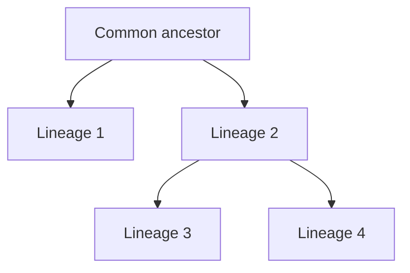

# Phát sinh loài, phân loại và đa dạng sinh học — Phylogeny, Taxonomy and Biodiversity (계통, 분류학, 생물다양성)

Nếu evolution tạo ra các lineage phân nhánh qua thời gian, ta cần một cách biểu diễn lịch sử đó. Đó là vai trò của **phylogeny (phát sinh loài / 계통)**. Taxonomy đặt tên và nhóm organism; phylogenetics cố reconstruct relationship tiến hóa giữa chúng.

Hai việc có liên quan nhưng không hoàn toàn giống nhau: classification là hệ thống tên và nhóm; phylogeny là hypothesis về ancestry.

## Tree of life — đừng nghĩ như chiếc thang

Một lỗi rất phổ biến là hình dung evolution như ladder:

```text
bacteria → fish → reptile → monkey → human
```

Cách nhìn này sai vì evolution chủ yếu là **branching**.



Hai species ở tip của tree không phải species “cao” và “thấp”. Chúng đều có cùng lượng thời gian tiến hóa từ common ancestor nếu sống ở hiện tại.

## Node, branch và tip

Trong **phylogenetic tree (cây phát sinh / 계통수)**:

- **tip** thường đại diện species hoặc lineage quan sát;
- **branch** đại diện lineage qua thời gian;
- **node** đại diện divergence event hoặc common ancestor giả định;
- **root** là ancestor sâu hơn của toàn group trong tree.

Điều quan trọng nhất khi đọc tree là topology — pattern ai share ancestor gần hơn với ai.

Khoảng cách vẽ trên giấy không phải lúc nào cũng tương ứng time hoặc genetic distance trừ khi tree được scale rõ.

## Sister taxa

Hai lineage share immediate common ancestor gọi là **sister taxa (자매군)**.

Nếu A và B là sister taxa, A không “sinh ra B”; chúng divergence từ ancestor chung.

Tree có thể xoay branch quanh node mà relationship không đổi. Vì vậy vị trí trái/phải không có ý nghĩa tiến hóa tự thân.

## Clade — nhóm gồm ancestor và toàn bộ descendant

**Clade (nhánh đơn ngành / 분기군)** hay monophyletic group gồm một ancestor và tất cả descendant của nó.

Modern systematics ưu tiên clade vì chúng phản ánh evolutionary history.

Một group bỏ lại một số descendant của ancestor là **paraphyletic**. Group ghép organism từ lineage xa không bao gồm common ancestor gần nhất có thể là **polyphyletic**.

Ví dụ truyền thống “reptile” nếu loại bird thường là paraphyletic, vì bird nằm bên trong dinosaur/reptile lineage về phylogeny.

## Homology và analogy

Để infer relationship, ta cần phân biệt **homology (tương đồng do chung nguồn gốc / 상동)** với similarity do convergent evolution.

Cánh bat và tay human share homologous forelimb bone pattern vì common tetrapod ancestry.

Cánh bird và insect đều dùng để bay nhưng flight structure phát triển độc lập rất xa; đây là **analogous similarity** ở function.

### Convergent evolution

**Convergent evolution (tiến hóa hội tụ / 수렴진화)** xảy ra khi lineage xa phát triển trait tương tự dưới selection pressure tương tự.

Shark và dolphin có streamlined body nhưng một là fish, một là mammal. Similar shape không đủ để kết luận close ancestry.

## Molecular phylogenetics

Ngày nay DNA/protein sequence là nguồn evidence lớn.

Nếu hai species có sequence tương tự ở nhiều homologous region, đặc biệt shared derived mutation, điều đó giúp infer common ancestry.

Nhưng “percent similarity cao hơn = chắc chắn gần hơn” có thể quá đơn giản vì mutation rate khác nhau, horizontal gene transfer, gene duplication và incomplete lineage sorting.

Phylogenetic inference dùng statistical model để estimate tree phù hợp data.

## Shared derived character

**Synapomorphy (đặc điểm dẫn xuất chung / 공유파생형질)** là trait mới xuất hiện ở ancestor của một clade và được descendant chia sẻ.

Synapomorphy hữu ích hơn ancestral trait chung quá rộng vì nó xác định branch cụ thể.

Ví dụ hair là derived trait nổi bật của mammal lineage so với many outgroup.

## Molecular clock — sequence có thể gợi ý thời gian nhưng không phải đồng hồ hoàn hảo

Nếu mutation tích lũy tương đối đều ở locus, genetic difference có thể dùng ước lượng divergence time, gọi là **molecular clock (분자시계)**.

Nhưng rate không hoàn toàn constant giữa gene, species và period. Fossil hoặc geological event thường được dùng calibration.

Vì vậy molecular clock là model có uncertainty, không phải đồng hồ literal.

# Taxonomy — cách đặt tên và phân loại

**Taxonomy (phân loại học / 분류학)** tổ chức organism thành named group.

Traditional rank:

```text
Domain → Kingdom → Phylum → Class → Order → Family → Genus → Species
```

Rank hữu ích trong communication nhưng evolutionary relationship thực có thể không vừa hoàn hảo vào level cố định.

## Binomial nomenclature

Species thường có tên khoa học hai phần:

```text
Homo sapiens
```

`Homo` là genus, `sapiens` là specific epithet. Genus viết hoa, specific epithet viết thường, thường italic.

Tên khoa học giúp tránh ambiguity giữa common name ở nhiều language.

## Species là gì?

Không có một species concept duy nhất hoạt động tốt cho mọi life form.

### Biological species concept

Group có thể interbreed và tạo fertile offspring, đồng thời reproductively isolated với group khác.

Hữu ích với nhiều sexual organism, nhưng khó áp dụng cho fossil, asexual organism và hybridizing species.

### Morphological species concept

Dựa vào shape/structure. Hữu ích khi chỉ có fossil, nhưng convergent evolution hoặc cryptic species có thể gây nhầm.

### Phylogenetic species concept

Dựa vào smallest diagnosable monophyletic lineage theo character/genetic evidence.

Mỗi concept giải quyết context khác nhau. Vì vậy “species” là biological category thực nhưng boundary có thể phức tạp.

# Ba domain lớn của cellular life

Modern phylogeny thường chia cellular life thành ba **domain (역)**:

- Bacteria;
- Archaea;
- Eukarya.

Bacteria và Archaea đều prokaryotic về cell architecture nhưng khác sâu về molecular machinery, membrane chemistry và evolutionary history.

Eukarya bao gồm animal, plant, fungi và nhiều protist lineage.

## Endosymbiosis làm tree of life phức tạp hơn

Mitochondria và chloroplast bắt nguồn từ bacteria được engulfed rồi trở thành organelle.

Vì vậy evolution không chỉ là vertical branching; có major event nơi lineage kết hợp.

Ở microorganism còn có **horizontal gene transfer**, gene di chuyển giữa lineage không qua parent–offspring. Điều này khiến “tree of life” ở một số gene giống network hơn tree đơn giản.

# Biodiversity — đa dạng ở nhiều tầng

**Biodiversity (đa dạng sinh học / 생물다양성)** không chỉ là số species.

Nó gồm ít nhất:

- genetic diversity trong species;
- species diversity trong community;
- ecosystem diversity giữa habitat.

Hai forest có cùng số species nhưng abundance distribution khác nhau vẫn có biodiversity structure khác.

## Richness và evenness

**Species richness (độ giàu loài / 종풍부도)** là số species.

**Evenness (độ đồng đều / 균등도)** phản ánh abundance có phân bố đều hay một species dominate.

Diversity index như Shannon index kết hợp richness và evenness:

\[
H'=-\sum_i p_i\ln p_i
\]

Trong đó \(p_i\) là proportion individual thuộc species i.

Logarithm xuất hiện vì information measure và multiplicative probability property; bạn không cần thuộc formula trước khi hiểu idea: community càng nhiều category và càng đều thì uncertainty khi đoán species của random individual càng cao.

## Why biodiversity matters biologically

Biodiversity không phải chỉ là “nhiều loài đẹp hơn”. Diversity ảnh hưởng ecosystem function, resilience, nutrient cycle, pollination, food web và evolutionary potential.

Genetic diversity giúp population có nhiều variant để đối mặt environmental change. Nhưng relation diversity–stability không phải lúc nào linear đơn giản; ecosystem ecology nghiên cứu chi tiết hơn.

## Mass extinction và background extinction

Species luôn xuất hiện và biến mất qua geological time. **Background extinction** là baseline rate tương đối thấp. **Mass extinction** là period mất biodiversity lớn trong thời gian địa chất tương đối ngắn.

Mass extinction thay evolutionary landscape: nhiều niche trống, lineage survivor có thể radiate mạnh sau đó.

## Adaptive radiation

**Adaptive radiation (방산진화)** là diversification nhanh từ common ancestor vào nhiều ecological niche.

Darwin’s finches thường được dùng minh họa: beak shape khác nhau liên quan food niche. Nhưng important idea là ecology + isolation + selection cùng tạo branching diversity.

## Common misconceptions

### “Species gần nhau trên hình tree thì gần họ hàng”

Không nhất thiết. Chỉ node structure quyết định relationship nếu branch length không encode distance.

### “Human là loài tiến hóa nhất”

Không có metric khoa học chung cho “tiến hóa nhất”. Human có adaptation đặc thù; bacteria cũng đã tiến hóa billions years và extremely successful.

### “Tên taxonomy là bất biến”

Classification thay đổi khi molecular/phylogenetic evidence mới xuất hiện.

### “Biodiversity chỉ là species count”

Không. Genetic, species, functional và ecosystem diversity đều quan trọng.

## Mental Model

> Evolution tạo một branching history; phylogeny cố reconstruct history đó; taxonomy tạo language để đặt tên các branch; biodiversity mô tả lượng và cấu trúc variation còn tồn tại trên tree of life.

Để thấy những principle này hoạt động ở hệ có generation time rất ngắn, hãy đọc [[02_microorganisms_and_viruses]]. Sau đó ecology sẽ dùng species và population như building block để nghiên cứu interaction trong environment.