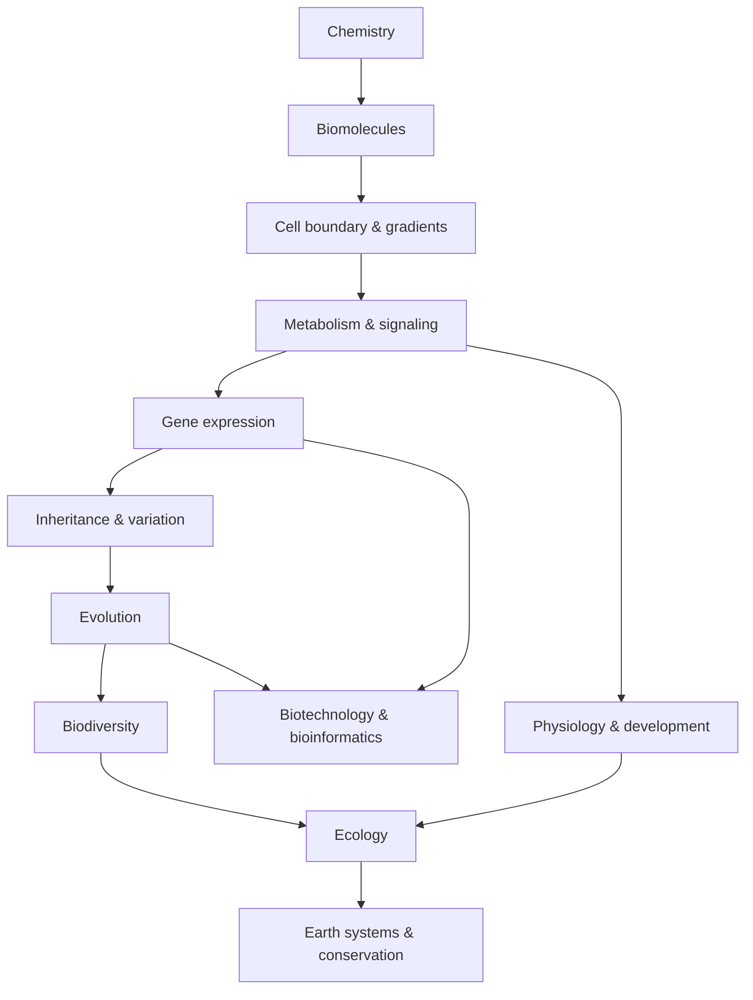

# Biology × Mathematics × Computation × Scale — Các kết nối xuyên lĩnh vực (생물학 × 수학 × 계산)

Nếu đọc từng chapter riêng, ta có thể thấy nhiều khái niệm khác tên: khuếch tán (diffusion), động học enzym (enzyme kinetics), quần thể (population) sinh trưởng (growth), điện thế hoạt động (action potential), gen (gene) mạng lưới (network), lưới thức ăn (food web), giải trình tự (sequencing). Nhưng khi lùi lại một bước, các hệ này lặp lại một số **các mô-típ toán học và tính toán (mathematical and computational motifs)** giống nhau: tốc độ (rate), chênh lệch (gradient), phản hồi (feedback), xác suất (probability), mạng lưới (network), optimization và thông tin (information).

Chapter này không phải summary môn Sinh học. Nó là bản đồ các pattern tái xuất hiện ở nhiều scale, giúp người đọc transfer reasoning từ chapter này sang chapter khác.

> **Mô hình tư duy (mental model):** một concept sâu thường đáng nhớ vì nó tái xuất ở nhiều scale. Gradient không chỉ thuộc membrane; feedback không chỉ thuộc hormone; graph không chỉ thuộc computer science. Đây là “grammar” chung của các hệ phức tạp (complex systems).

## 1. Scale thay đổi câu hỏi, không thay vật lý nền

Atom → phân tử (molecule) → tế bào (cell) → mô (tissue) → sinh vật (organism) → quần thể → ecosystem là các scale lồng nhau.

Ở scale nhỏ, chuyển động nhiệt (thermal motion) và va chạm phân tử (molecular collision) quan trọng. Ở scale organism, dòng chảy khối (bulk flow)/pressure quan trọng. Ở scale population, probability và tốc độ nhân khẩu học (demographic rate) quan trọng.

Không có scale nào “thật hơn”. Model phù hợp phụ thuộc câu hỏi.

## 2. Surface-area-to-volume ratio

Nếu size đặc trưng là \(L\):

\[
Area\propto L^2,\qquad Volume\propto L^3
\]

nên:

\[
\frac{Area}{Volume}\propto \frac{1}{L}
\]

Điều này giải thích:

- cell nhỏ;
- microvilli/alveoli/cristae tăng surface;
- organism lớn cần circulation;
- lá (leaf)/rễ (root) kiến trúc (architecture) ưu tiên interface.

Một equation geometry tạo consequences ở nhiều chapter.

## 3. Rate of change

Biology quan tâm không chỉ amount mà **tốc độ**:

\[
\frac{dx}{dt}
\]

Nhịp tim (heart rate), tốc độ phản ứng (reaction rate), tốc độ tăng trưởng (growth rate), tốc độ phiên mã (transcription rate) và species decline đều là tốc độ.

Derivative trong calculus mô tả tốc độ tức thời (instantaneous rate). Khi ta nói \(dN/dt=rN\), ta không hỏi kích thước quần thể (population size) là bao nhiêu mà hỏi nó đang thay đổi nhanh thế nào tại state hiện tại.

## 4. Tăng trưởng theo hàm mũ (exponential growth)

Nếu tốc độ tăng trưởng proportional current amount:

\[
\frac{dN}{dt}=rN
\Rightarrow N(t)=N_0e^{rt}
\]

Pattern này xuất hiện trong:

- bacterial growth;
- early population expansion;
- PCR lý tưởng theo cycle (discrete doubling);
- lãi kép (compound interest) analogies;
- epidemic early phase ở mô hình (model) đơn giản.

Exponential process counterintuitive vì absolute increment tăng cùng state.

## 5. Tăng trưởng logistic (logistic growth) và bão hòa (saturation)

Resource/capacity hữu hạn tạo bão hòa:

\[
\frac{dN}{dt}=rN\left(1-\frac{N}{K}\right)
\]

Saturation motif cũng xuất hiện động học enzym:

\[
v=\frac{V_{max}[S]}{K_m+[S]}
\]

Hai equation không mô tả cùng mechanism, nhưng share idea: response gần linear khi input thấp rồi chạm ceiling do limiting capacity.

Recognize motif giúp transfer intuition mà không đánh đồng system.

## 6. Logarithm

pH:

\[
pH=-\log_{10}[H^+]
\]

Decibel, information measure, fold-change visualization và some population statistics cũng dùng log.

Log hữu ích khi quantity span nhiều order of magnitude. Nó biến multiplicative difference thành additive scale.

Ví dụ pH 6 và 7 khác khoảng 10 lần [H⁺], không phải “1 unit nhỏ”.

## 7. Chênh lệch

Gradient là spatial change. Khuếch tán dòng chuyển hóa (flux):

\[
J=-D\nabla C
\]

Trong 1D thành \(-D dC/dx\).

Gradient xuất hiện ở:

- concentration across membrane;
- voltage/chênh lệch điện hóa (electrochemical gradient);
- chênh lệch proton (proton gradient) mitochondria/chloroplast;
- chênh lệch morphogen (morphogen gradient) embryo;
- oxy (oxygen)/chất dinh dưỡng (nutrient) gradient màng sinh học (biofilm);
- thế nước (water potential) gradient plant.

Một principle: **difference can store direction/potential**. Living system tiêu energy để tạo difference, rồi khai thác difference để làm work hoặc encode information.

## 8. Dòng chảy (flow) = driving force / resistance

Circulation gần dạng:

\[
Q=\frac{\Delta P}{R}
\]

Electrical current có analogous form \(I=V/R\). Diffusion cũng có driving gradient và resistance/permeability.

Không nên nói mạch máu (blood vessel) “y như circuit”, nhưng analogy giúp hiểu: tăng driving pressure tăng flow; tăng resistance giảm flow.

## 9. Phản hồi

Phản hồi âm (negative feedback):

```text
variable lệch
→ sensor
→ response
→ deviation giảm
```

Xuất hiện ở:

- glucose–insulin;
- nhiệt độ cơ thể (body temperature);
- enzym (enzyme) ức chế phản hồi (feedback inhibition);
- trục nội tiết (endocrine axis);
- điều hòa gen (gene regulation);
- mật độ quần thể (population density) dependence.

Phản hồi dương (positive feedback) xuất hiện blood clotting, childbirth, công tắc (switch)-like gene circuit.

Lý thuyết điều khiển (control theory) cung cấp vocabulary sensor, bộ điều khiển (controller), actuator, gain, delay, stability.

## 10. Delay có thể tạo dao động (oscillation)

Nếu feedback đáp ứng (response) đến chậm, system có thể overshoot/oscillate.

Vật săn mồi–con mồi (predator–prey) cycle, endocrine pulse, nhịp sinh học ngày đêm (circadian rhythm) và gene oscillator đều có delay/tính phi tuyến (nonlinearity).

Stable feedback không chỉ cần “negative”; timing và gain cũng quan trọng.

## 11. Xác suất

Meiosis là random sampling alen (allele); mutation stochastic; thụ thể (receptor) binding probabilistic; bệnh (disease) risk probabilistic.

Product rule và conditional probability xuất hiện genetics/diagnostics.

Bayes theorem:

\[
P(H|D)=\frac{P(D|H)P(H)}{P(D)}
\]

được dùng khi update belief từ prior + bằng chứng (evidence).

Medical testing là example: positive test probability disease phụ thuộc disease prevalence, sensitivity và độ đặc hiệu (specificity).

## 12. Base rate và medical test

Nếu disease hiếm, dương tính giả (false positive) từ population healthy lớn có thể khiến positive predictive value thấp hơn intuition.

Điều này cho thấy “test accuracy 99%” chưa đủ; cần conditional probability.

Biology và statistics không thể tách trong diagnostic reasoning.

## 13. Sampling và độ bất định (uncertainty)

Experiment dùng sample để infer population. Sample mean có độ bất định; lần lặp (replicate) giúp estimate variance.

Small sample dễ bị nhiễu (noise)/outlier. Biến thiên sinh học (biological variability) là signal về system heterogeneity, không chỉ nuisance.

Confidence interval và effect size thường quan trọng hơn chỉ p-value.

## 14. Hypothesis testing và multiple comparisons

Omics test hàng nghìn gene; nếu dùng threshold 0.05 naïve, dương tính giả nhiều.

False discovery rate correction quản lý expected proportion false discovery.

Scale data lớn buộc statistics thay đổi cách làm khoa học.

## 15. Correlation vs causation

Correlation matrix trong biểu hiện gen (gene expression) hay microbiome có thể tìm pattern nhưng không chứng minh direction.

Causal inference cần intervention, thứ tự thời gian (temporal order), instrument hoặc mechanistic evidence.

Directed acyclic graph (DAG) giúp reason confounder/mediator.

Tư duy khoa học (scientific thinking) chapter quay lại bằng formal model.

## 16. Lý thuyết đồ thị (graph theory)

Graph gồm node và edge.

Biological mapping:

- protein interaction network;
- mạng lưới điều hòa gen (gene-regulatory network);
- mạng lưới chuyển hóa (metabolic network);
- neural network;
- lưới thức ăn;
- cây phát sinh chủng loại (phylogenetic tree) (special graph structure);
- genome assembly graph.

Degree, path, centrality và quần xã (community) structure có thể mô tả mạng lưới.

Nhưng high centrality không tự chứng minh biological importance; representation/data bias vật chất (matter).

## 17. Trees

Cây phát sinh chủng loại, tế bào lineage tree và cây quyết định (decision tree) đều là tree nhưng semantic khác.

Tree useful khi process branching và no recombination assumption phù hợp. Chuyển gen ngang (horizontal gene transfer)/sexual recombination có thể cần network thay tree.

Representation phải match mechanism.

## 18. Lý thuyết thông tin (information theory)

DNA sequence có alphabet; entropy có thể đo độ bất định/distribution symbols. Sequence conservation gợi ý ràng buộc (constraint); motif có information content.

Neural coding và signaling cũng có channel/noise perspective.

Nhưng “biological information” không nên bị tách khỏi physical substrate. Information phải được encoded, transmitted và decoded bằng molecule/tế bào.

## 19. Algorithms và sequence comparison

Alignment dynamic programming giải optimization:

\[
score(i,j)=\max
\begin{cases}
score(i-1,j-1)+match/mismatch\\
score(i-1,j)+gap\\
score(i,j-1)+gap
\end{cases}
\]

Sinh tin học (bioinformatics) biến evolutionary assumption thành scoring rule và computation.

Algorithm complexity quyết định data scale nào khả thi.

## 20. Optimization và biological trade-off

Evolution không tối ưu một objective duy nhất. Trait thường trade-off:

- reproduction vs maintenance;
- mất nước (water loss) vs CO₂ uptake;
- immune sensitivity vs autoimmunity;
- speed vs accuracy;
- growth vs stress resistance.

Engineering optimization thường có objective rõ; biological “fitness landscape” bối cảnh (context)-dependent và historical constraint.

## 21. Energy landscape

Sự gấp cuộn protein (protein folding) có thể hình dung energy landscape với nhiều conformation. Developmental cell fate đôi khi dùng metaphor landscape state; evolution có fitness landscape.

Các “landscape” không cùng mathematical object, nhưng share idea system state move trong space có basin/barrier.

Cần tránh kéo analogy quá xa.

## 22. Phân tích thứ nguyên (dimensional analysis)

Trước khi tin equation, kiểm tra unit.

Nếu flow = volume/time, right side cũng phải cho volume/time. Unit mismatch thường lộ lỗi model/calc.

Biology có nhiều unit: mol/L, mmHg, mV, J/mol, các tế bào (cells)/mL, kg/m². Dimensional thinking giảm memorization formula.

## 23. Normalization

RNA-seq count, qPCR, microscopy intensity và metabolomics đều cần normalization vì raw measurement phụ thuộc library size, loading hay thiết bị đo (instrument).

Normalization không phải cosmetic; nó xác định “so sánh công bằng” nghĩa là gì.

Sai normalization có thể tạo mẫu hình (pattern) giả.

## 24. Học máy (machine learning)

ML thường tìm function:

\[
f(X)\rightarrow y
\]

Trong sinh học (biology), X có thể biểu hiện gen/image/trình tự (sequence); y có thể loại tế bào (cell type)/nguy cơ (risk)/đặc tính (property).

Prediction tốt không tự cho cơ chế (mechanism). Feature association có thể do yếu tố gây nhiễu (confounder).

Train/validation/test split và external validation quan trọng để tránh overfitting.

## 25. Overfitting và biological dataset nhỏ

Model quá flexible có thể memorize sample. Genomics thường có p variables rất lớn nhưng n sample nhỏ.

Regularization, cross-validation và independent cohort giúp, nhưng không thay biological design.

Data quantity theo feature không đồng nghĩa information quantity theo independent sample.

## 26. Dynamical systems

General ODE:

\[
\frac{d\mathbf{x}}{dt}=\mathbf{f}(\mathbf{x},\mathbf{u})
\]

State vector có thể là concentration gene/protein (protein)/quần thể. Fixed point là state không đổi theo mô hình; stability hỏi perturbation có quay lại không.

Cân bằng nội môi (homeostasis), khả năng phục hồi hệ sinh thái (ecosystem resilience) và gene circuit đều có thể dùng language này.

## 27. Stochastic systems

Khi molecule number thấp, randomness đáng kể. Gen transcription có burst; kênh ion (ion channel) open probabilistically; population drift stochastic.

Deterministic ODE dùng average có thể bỏ mất variability.

Stochastic simulation như Gillespie phù hợp một số molecular network.

## 28. Scale separation

Một signaling phosphorylation xảy ra seconds, biểu hiện gen minutes-hours, development days-years, evolution generations, geological cycle millennia.

Model thường tách fast/slow process để đơn giản.

Nhưng khi timescale overlap, interaction tạo behavior phức tạp.

## 29. Cấu trúc dữ liệu (data structure) và cơ sở dữ liệu (database)

Trình tự, tree, graph, matrix, time series và image là data type khác nhau.

Chọn representation đúng quyết định algorithm có thể làm gì. Hệ gen (genome) variant thường table; expression là matrix; phylogeny là tree; protein contact là graph.

Computer science skill không chỉ code; nó là thiết kế representation phù hợp domain.

## 30. Mô phỏng (simulation)

Khi analytic solution khó, simulation thử rule nhiều step để xem emergent hành vi (behavior).

Agent-based model có thể mô phỏng individual cell/sinh vật; finite-difference model mô phỏng diffusion; Monte Carlo dùng random sampling.

Simulation không tự chứng minh world hoạt động như mô hình. Nó chỉ cho biết **nếu rule/tham số (parameter) đúng thì outcome nào xuất hiện**.

## 31. One motif xuyên toàn thư viện: difference → dòng chảy → phản hồi

Ta có thể nén rất nhiều Biology vào ba bước:

1. system tạo/nhận một **difference**: concentration, voltage, áp suất (pressure), thông tin (information) trạng thái (state);
2. difference tạo **dòng chảy/change**;
3. phản hồi điều chỉnh difference/dòng chảy.

Ví dụ:

- chênh lệch proton → H⁺ dòng chảy → ATP → phản hồi chuyển hóa (metabolism);
- huyết áp (blood pressure) → dòng máu (blood flow) → mô oxy → cardiovascular feedback;
- prey abundance → vật săn mồi (predator) sinh trưởng → prey decline → coupled feedback;
- gen-expression difference → tế bào-state transition → regulatory feedback.

Đây là mô hình tư duy powerful vì dùng được từ nanomet đến ecosystem.

## 32. Một motif thứ hai: biến dị (variation) → chọn lọc (selection)/filter → memory

- đột biến (mutation)/tái tổ hợp (recombination) → chọn lọc tự nhiên (natural selection) → alen-frequency memory;
- B-tế bào receptor diversity → kháng nguyên (antigen) chọn lọc → trí nhớ miễn dịch (immune memory);
- neural synaptic variation/hoạt động (activity) → plasticity selection → memory trace;
- CRISPR spacer acquisition → target recognition → microbial trí nhớ miễn dịch.

Mechanism khác nhau nhưng logic thông tin selection xuất hiện lặp lại.

## 33. Một motif thứ ba: tính mô-đun (modularity) + mạng lưới

Cell dùng organelle; gen network dùng module; organism dùng organ; ecosystem dùng trophic guild.

Tính mô-đun giúp system complexity manageable và damage local hơn, nhưng module vẫn phải communicate qua mạng lưới.

Software engineering cũng dùng module/API vì problem tương tự: complexity management.

## 34. Khi connection với IT thực sự hữu ích

Biology và IT không giống nhau literal. Nhưng một số analogy productive:

- DNA ~ persistent sequence store, nhưng không phải executable code độc lập;
- thụ thể (receptor) ~ input interface;
- truyền tín hiệu (signaling) mạng lưới ~ event-processing network;
- điều khiển phản hồi (feedback control) ~ điều khiển (control) hệ thống (system);
- mạng lưới điều hòa gen (gene regulatory network) ~ máy trạng thái (state machine)/mạng lưới;
- immune repertoire ~ distributed pattern-nhận dạng (recognition) system;
- phát sinh chủng loại (phylogeny) ~ branching version history (nhưng recombination làm khác Git tree);
- bioinformatics pipeline ~ data engineering pipeline.

Analogy tốt khi giúp hỏi đúng câu, không khi ép biology thành computer.

## 35. Cách dùng chapter này khi học lại

Khi gặp một concept khó, hãy thử map nó vào các motif:

**scale nào? biến trạng thái (state variable) là gì? chênh lệch/driving force là gì? dòng chảy/rate là gì? phản hồi ở đâu? độ bất định ở đâu? mạng lưới nút (node)/edge là gì? ràng buộc/trade-off nào?**

Nếu trả lời được, concept thường trở nên ít rời rạc hơn.

## 36. Final mô hình tư duy

Toàn Biology Knowledge Library có thể được nhìn như một đồ thị kiến thức (knowledge graph):



Điều quan trọng không phải nhớ sơ đồ, mà thấy mỗi arrow là một causal dependency.

> **Mô hình tư duy cuối library:** life là complex adaptive system được xây từ vật chất (matter), chạy bằng energy chênh lệch (gradient), tổ chức bằng information, ổn định bằng feedback, đa dạng nhờ variation và được định hình qua chọn lọc/history. Toán học (mathematics) cung cấp language của relationship; computation cung cấp cách xử lý scale; Sinh học cung cấp mechanism và meaning.

<!-- depth-audit-2026:master-chain -->
## Mental model xuyên toàn library: matter → energy → information → regulation → adaptation → evolution → ecosystem

**Vật chất (matter)** tạo substrate và structure. Không có atom, ion, membrane, carbon skeleton hay water thì không có system để vận hành. **Năng lượng (energy)** giữ system xa equilibrium, duy trì gradient và cho phép synthesis/repair. **Thông tin (information)** giúp system dùng năng lượng có chọn lọc: sequence, receptor state, neural code hay ecological signal đều làm thay đổi action dựa trên context.

**Điều hòa (regulation)** biến information thành feedback và decision. Enzyme allostery, gene network, endocrine axis và predator–prey density dependence đều là control ở scale khác nhau. **Thích nghi (adaptation)** xuất hiện khi regulation/plasticity giúp system đổi state trong lifetime hoặc khi selection giữ variant phù hợp qua generation. **Tiến hóa (evolution)** tích lũy thay đổi heritable, từ đó đổi structure và regulatory architecture của organism. Organism mới lại tương tác thành **hệ sinh thái (ecosystem)**, nơi material/energy flux và selection pressure quay trở lại tác động từng lineage.

Chuỗi này không phải đường một chiều mà là vòng lặp nhiều scale:

```text
matter → energy → information → regulation
   ↑                         ↓
ecosystem ← evolution ← adaptation
```

Mathematics cung cấp ngôn ngữ cho rate, probability, feedback và network. Physics/Chemistry đặt constraint. Psychology mô tả information processing và behavior ở scale organism. AI/Bioinformatics giúp biểu diễn và dự đoán data lớn, nhưng mọi model cuối cùng vẫn phải quay về mechanism và experiment.

---

<!-- biology-learning-navigation -->
**Điều hướng học:** [← Sinh học hệ thống, mô hình hóa và sinh học tổng hợp](../06_biotechnology_computation/03_systems_biology_modeling_and_synthetic_biology.md) · [Mục lục Biology](../README.md) · [Sinh học nhìn qua Vật lý, Hóa học và Kỹ thuật →](01_biology_physics_chemistry_and_engineering.md)
