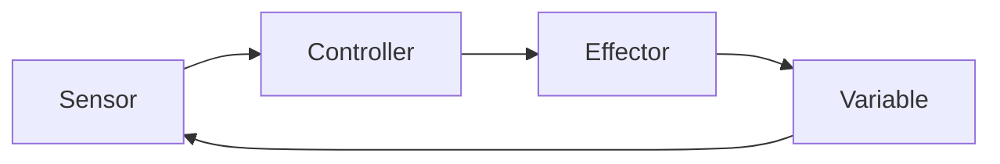

# Sinh học nhìn qua Toán học, tính toán và quy mô — Biology, Mathematics, Computation and Scale (생물학, 수학, 계산과 규모)

Sinh học có thể trông như một collection khổng lồ của tên loài, organ, gene và pathway. Nhưng khi nhìn sâu hơn, nhiều phenomenon lặp lại cùng một số mathematical pattern: exponential growth, diffusion, feedback, probability, network và optimization dưới constraint.

File này không phải summary. Nó là “bản đồ connection” giúp bạn nhận ra khi một idea đã học ở Toán/Computer Science xuất hiện dưới hình thức Sinh học khác.

## Scale changes the rules that matter

Một bacterium và elephant đều tuân cùng chemistry, nhưng constraint ở scale khác nhau.

### Surface area vs volume

Với object có linear size \(L\):

\[
Surface\ area \propto L^2
\]

\[
Volume \propto L^3
\]

Nên:

\[
\frac{Surface}{Volume}\propto \frac{1}{L}
\]

Khi organism/cell lớn, relative surface giảm. Đây là lý do exchange surface cần fold/branch: lung alveoli, intestinal villi, root hair, mitochondrial cristae.

Một formula geometry đơn giản giải thích rất nhiều anatomy.

## Diffusion và random walk

Molecule không chạy theo đường thẳng có mục tiêu. Chúng chuyển động ngẫu nhiên do thermal motion.

Trong random diffusion, characteristic distance thường tăng gần với square root của time:

\[
x \sim \sqrt{2Dt}
\]

Suy ra:

\[
t \sim \frac{x^2}{2D}
\]

Nếu distance tăng 10 lần, time cần cho diffusion tăng khoảng 100 lần trong model đơn giản.

Đây là reason diffusion tốt trong cell nhưng organism lớn cần circulation.

## Exponential growth xuất hiện ở đâu?

Nếu growth rate tỷ lệ với population size:

\[
\frac{dN}{dt}=rN
\]

thì:

\[
N(t)=N_0e^{rt}
\]

Pattern này xuất hiện trong bacterial growth phase, early epidemic model, PCR amplification gần lý tưởng và compound processes khác.

Exponential growth thường gây trực giác sai vì tăng ban đầu chậm nhưng sau đó rất nhanh.

### Doubling time

\[
t_d=\frac{\ln 2}{r}
\]

Nếu một culture double mỗi 20 phút, từ một cell sau 10 doubling có khoảng \(2^{10}=1024\) cell; sau 20 doubling hơn một triệu.

Không cần memorization: mỗi doubling là nhân 2, nên repeated doubling tạo power of 2.

## Logistic growth — feedback giới hạn growth

Resource finite làm per-capita growth giảm khi N tăng:

\[
\frac{dN}{dt}=rN\left(1-\frac{N}{K}\right)
\]

Term \((1-N/K)\) đóng vai trò negative feedback.

Idea “growth + negative feedback” xuất hiện không chỉ ecology. Cell population, enzyme system và resource allocation đều có saturation-like behavior.

## Michaelis–Menten và saturation

Enzyme reaction thường tăng nhanh khi substrate thấp rồi plateau khi enzyme saturated.

Simplified Michaelis–Menten:

\[
v=\frac{V_{max}[S]}{K_m+[S]}
\]

Khi \([S]\ll K_m\), rate gần proportional với substrate.

Khi \([S]\gg K_m\), rate tiến \(V_{max}\).

Cùng mathematical shape saturation xuất hiện ở receptor binding và transport system, dù mechanism chi tiết có thể khác.

## Logarithm — nén nhiều bậc độ lớn

Biology thường phải xử lý concentration hoặc population trải qua orders of magnitude.

pH:

\[
pH=-\log_{10}[H^+]
\]

pH giảm 1 nghĩa H⁺ tăng khoảng 10 lần.

Log scale cũng xuất hiện ở gene-expression plot, dose range và microbial count.

Khi đọc log graph, khoảng cách bằng nhau trên axis không phải difference cộng bằng nhau mà thường là ratio bằng nhau.

## Probability — heredity không phải deterministic schedule

Một heterozygous parent có thể truyền allele A với probability 1/2 theo simple Mendelian setting.

Nhưng 50% không nghĩa hai child chắc chắn một A một a.

Nếu có 4 independent offspring, probability đúng 2 nhận A là binomial:

\[
P(X=2)=\binom{4}{2}(0.5)^2(0.5)^2=0.375
\]

Probability giúp genetics chuyển từ “rule” sang distribution.

## Bayes — evidence cập nhật belief

Medical testing và genetic inference đều cần Bayesian thinking.

Bayes theorem:

\[
P(H|E)=\frac{P(E|H)P(H)}{P(E)}
\]

H có thể là “có disease”, E là “test positive”.

Nếu disease rất hiếm, ngay test specificity cao vẫn có thể tạo substantial fraction false positive trong group positive.

Đây là base-rate effect.

### Ví dụ trực giác

Giả sử 10,000 người:

- prevalence 1% → 100 người có disease;
- sensitivity 90% → 90 true positive;
- specificity 95% → 5% của 9,900 healthy = 495 false positive.

Tổng positive = 585, trong đó chỉ 90 true disease.

Positive predictive value:

\[
90/585 \approx 15.4\%
\]

Điều này không làm test “tệ”; nó cho thấy interpretation phụ thuộc prior probability.

## Statistics — variation là signal và noise cùng lúc

Biological measurement luôn có variation.

Ta cần phân biệt:

- biological variation: individual/cell thực sự khác nhau;
- measurement noise: instrument/sample error;
- sampling variation: sample chỉ là subset population.

Mean không đủ. Distribution, variance và effect size quan trọng.

### Correlation vs causation

Nếu gene expression X tương quan disease Y, có nhiều possibility:

```text
X → Y
Y → X
Z → X and Y
selection/bias → apparent correlation
```

Experiment, temporal evidence và causal model cần để phân biệt.

## Multiple testing trong genomics

Nếu test 20,000 gene với threshold 0.05, dưới null hoàn toàn ta có thể mong đợi khoảng 1,000 false positive theo expectation thô.

Do đó genomics dùng FDR correction.

Big data làm nhiều pattern dễ tìm hơn, nhưng cũng làm false discovery problem lớn hơn.

## Linear algebra — biological data như vector

Một sample gene expression có thể biểu diễn vector:

\[
\mathbf{x}=(x_1,x_2,\dots,x_p)
\]

với mỗi dimension là expression một gene.

Nếu p = 20,000, ta ở high-dimensional space.

PCA tìm direction giải thích variance lớn:

\[
\mathbf{z}=W^T\mathbf{x}
\]

Biological use: visualize sample, detect batch effect, compress data.

Nhưng principal component không tự động là biological pathway; nó chỉ là mathematical direction variance.

## Graph theory — biology là network

Protein interaction network, metabolic network, food web và neural network đều có thể model bằng graph:

\[
G=(V,E)
\]

Node V là entity; edge E là relationship.

### Degree

Node có nhiều connection có degree cao. Nhưng high degree không nhất thiết causal importance; network construction bias có thể làm well-studied protein có nhiều edge.

### Path

Shortest path có thể gợi ý connection giữa molecule, nhưng biochemical signal không nhất thiết đi theo shortest topological route.

Graph model giúp reasoning nhưng vẫn là abstraction.

## Dynamic systems — biology thay đổi theo time

Static pathway diagram không nói concentration thay đổi thế nào.

Một simple production–degradation model:

\[
\frac{dX}{dt}=k_{prod}-k_{deg}X
\]

Steady state khi:

\[
0=k_{prod}-k_{deg}X
\]

nên:

\[
X^*=\frac{k_{prod}}{k_{deg}}
\]

Nếu production tăng, steady-state level tăng; nếu degradation nhanh hơn, level giảm.

Đây là mathematical way nhìn gene expression/homeostasis.

## Feedback và control theory

Biological control loop:



Negative feedback ổn định variable. Positive feedback khuếch đại và có thể tạo switch.

Engineering control theory và physiology chia sẻ language về sensor, setpoint, error, gain và feedback, dù biological system distributed/noisy hơn.

## Information theory

DNA sequence, neural signal và communication đều gợi question về information.

**Entropy** trong information theory:

\[
H=-\sum_i p_i\log_2 p_i
\]

Nếu outcome unpredictable hơn, entropy cao hơn.

Sequence conservation có thể được nhìn bằng information content: position cực conserved có uncertainty thấp.

Shannon entropy cũng liên quan diversity index trong ecology.

Cùng mathematical form xuất hiện vì cả hai đo uncertainty của distribution.

## Optimization và trade-off

Biology hiếm khi tối ưu một mục tiêu.

Bird wing phải cân mass, strength và aerodynamic performance. Plant stomata cân CO₂ uptake với water loss. Immune system cân pathogen defense với tissue damage. Life history cân current reproduction với future survival.

Vì vậy nhiều biological phenotype nằm trên **Pareto trade-off** thay vì một scalar optimum.

Evolution search trên fitness landscape cũng bị constraint bởi ancestry và available mutation, nên không giống engineer được phép redesign từ zero.

## Algorithms và sequence biology

DNA là string nên nhiều algorithm CS áp dụng trực tiếp.

### String matching

Tìm motif trong genome giống substring search, nhưng mutation khiến exact match không đủ.

### Dynamic programming

Sequence alignment dùng recurrence chọn match/mismatch/gap score tốt nhất.

### Hashing và indexing

Genome billions base nên brute-force search chậm. k-mer hash, suffix array, FM-index giúp search nhanh.

### Graph

Genome assembly dùng overlap graph hoặc de Bruijn graph.

Biology là domain rất tự nhiên cho algorithm design.

## Machine learning — pattern prediction và causal explanation khác nhau

ML model học mapping:

\[
f(X)\rightarrow Y
\]

X có thể genomic sequence, expression matrix hoặc image; Y có thể class hoặc continuous trait.

Model prediction tốt không nhất thiết cho mechanism đúng.

Ví dụ model có thể dùng batch artifact correlate với disease label. Vì vậy data split, external validation và interpretability rất quan trọng.

## Multiscale modeling

Một mutation nucleotide có thể thay protein; protein thay signaling; signaling thay cell; cell thay tissue; tissue thay phenotype; phenotype thay fitness/population.

No single model cover all scale dễ dàng.

Biology thường cần bridge model:

```text
sequence
↓
structure/function
↓
cell state
↓
tissue physiology
↓
organism phenotype
↓
population fitness
```

Đây là reason “biết genome” chưa đồng nghĩa dự đoán organism hoàn hảo.

## Cách dùng connection này khi học

Khi gặp một chapter biology mới, hãy hỏi:

1. Scale nào đang được xét?
2. Matter, energy và information đang flow thế nào?
3. Có gradient hoặc conservation law nào không?
4. Process là deterministic hay probabilistic?
5. Có feedback/saturation không?
6. Entities có tạo network không?
7. Model đang bỏ qua assumption nào?

Nếu trả lời được bảy câu này, bạn thường đã nắm phần structure của problem trước khi nhớ detail.

## Mental Model

> Toán không phải lớp trang trí gắn lên Sinh học. Nó là ngôn ngữ để mô tả rate, probability, geometry, feedback và network. Computer Science không chỉ là tool xử lý file; algorithm và data structure trở thành microscope mới khi biological data vượt khả năng đọc bằng mắt. Scale quyết định loại model nào hữu ích.