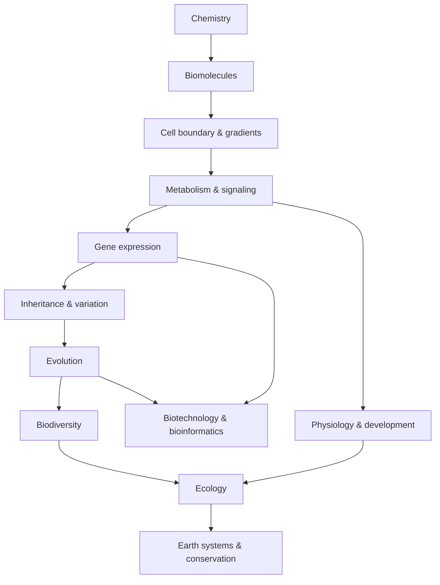

# Biology × Mathematics × Computation × Scale — Các kết nối xuyên lĩnh vực (생물학 × 수학 × 계산)

Nếu đọc từng chapter riêng, ta có thể thấy nhiều khái niệm khác tên: diffusion, enzyme kinetics, population growth, action potential, gene network, food web, sequencing. Nhưng khi lùi lại một bước, các hệ này lặp lại một số **mathematical and computational motifs** giống nhau: rate, gradient, feedback, probability, network, optimization và information.

Chapter này không phải summary môn Sinh học. Nó là bản đồ các pattern tái xuất hiện ở nhiều scale, giúp người đọc transfer reasoning từ chapter này sang chapter khác.

> **Mental model:** một concept sâu thường đáng nhớ vì nó tái xuất ở nhiều scale. Gradient không chỉ thuộc membrane; feedback không chỉ thuộc hormone; graph không chỉ thuộc computer science. Đây là “grammar” chung của complex systems.

## 1. Scale thay đổi câu hỏi, không thay vật lý nền

Atom → molecule → cell → tissue → organism → population → ecosystem là các scale lồng nhau.

Ở scale nhỏ, thermal motion và molecular collision quan trọng. Ở scale organism, bulk flow/pressure quan trọng. Ở scale population, probability và demographic rate quan trọng.

Không có scale nào “thật hơn”. Model phù hợp phụ thuộc câu hỏi.

## 2. Surface-area-to-volume ratio

Nếu size đặc trưng là \(L\):

\[
Area\propto L^2,\qquad Volume\propto L^3
\]

nên:

\[
\frac{Area}{Volume}\propto \frac{1}{L}
\]

Điều này giải thích:

- cell nhỏ;
- microvilli/alveoli/cristae tăng surface;
- organism lớn cần circulation;
- leaf/root architecture ưu tiên interface.

Một equation geometry tạo consequences ở nhiều chapter.

## 3. Rate of change

Biology quan tâm không chỉ amount mà **rate**:

\[
\frac{dx}{dt}
\]

Heart rate, reaction rate, growth rate, transcription rate và species decline đều là rate.

Derivative trong calculus mô tả instantaneous rate. Khi ta nói \(dN/dt=rN\), ta không hỏi population size là bao nhiêu mà hỏi nó đang thay đổi nhanh thế nào tại state hiện tại.

## 4. Exponential growth

Nếu growth rate proportional current amount:

\[
\frac{dN}{dt}=rN
\Rightarrow N(t)=N_0e^{rt}
\]

Pattern này xuất hiện trong:

- bacterial growth;
- early population expansion;
- PCR lý tưởng theo cycle (discrete doubling);
- compound interest analogies;
- epidemic early phase ở model đơn giản.

Exponential process counterintuitive vì absolute increment tăng cùng state.

## 5. Logistic growth và saturation

Resource/capacity hữu hạn tạo saturation:

\[
\frac{dN}{dt}=rN\left(1-\frac{N}{K}\right)
\]

Saturation motif cũng xuất hiện enzyme kinetics:

\[
v=\frac{V_{max}[S]}{K_m+[S]}
\]

Hai equation không mô tả cùng mechanism, nhưng share idea: response gần linear khi input thấp rồi chạm ceiling do limiting capacity.

Recognize motif giúp transfer intuition mà không đánh đồng system.

## 6. Logarithm

pH:

\[
pH=-\log_{10}[H^+]
\]

Decibel, information measure, fold-change visualization và some population statistics cũng dùng log.

Log hữu ích khi quantity span nhiều order of magnitude. Nó biến multiplicative difference thành additive scale.

Ví dụ pH 6 và 7 khác khoảng 10 lần [H⁺], không phải “1 unit nhỏ”.

## 7. Gradient

Gradient là spatial change. Diffusion flux:

\[
J=-D\nabla C
\]

Trong 1D thành \(-D dC/dx\).

Gradient xuất hiện ở:

- concentration across membrane;
- voltage/electrochemical gradient;
- proton gradient mitochondria/chloroplast;
- morphogen gradient embryo;
- oxygen/nutrient gradient biofilm;
- water potential gradient plant.

Một principle: **difference can store direction/potential**. Living system tiêu energy để tạo difference, rồi khai thác difference để làm work hoặc encode information.

## 8. Flow = driving force / resistance

Circulation gần dạng:

\[
Q=\frac{\Delta P}{R}
\]

Electrical current có analogous form \(I=V/R\). Diffusion cũng có driving gradient và resistance/permeability.

Không nên nói blood vessel “y như circuit”, nhưng analogy giúp hiểu: tăng driving pressure tăng flow; tăng resistance giảm flow.

## 9. Feedback

Negative feedback:

```text
variable lệch
→ sensor
→ response
→ deviation giảm
```

Xuất hiện ở:

- glucose–insulin;
- body temperature;
- enzyme feedback inhibition;
- endocrine axis;
- gene regulation;
- population density dependence.

Positive feedback xuất hiện blood clotting, childbirth, switch-like gene circuit.

Control theory cung cấp vocabulary sensor, controller, actuator, gain, delay, stability.

## 10. Delay có thể tạo oscillation

Nếu feedback response đến chậm, system có thể overshoot/oscillate.

Predator–prey cycle, endocrine pulse, circadian rhythm và gene oscillator đều có delay/nonlinearity.

Stable feedback không chỉ cần “negative”; timing và gain cũng quan trọng.

## 11. Probability

Meiosis là random sampling allele; mutation stochastic; receptor binding probabilistic; disease risk probabilistic.

Product rule và conditional probability xuất hiện genetics/diagnostics.

Bayes theorem:

\[
P(H|D)=\frac{P(D|H)P(H)}{P(D)}
\]

được dùng khi update belief từ prior + evidence.

Medical testing là example: positive test probability disease phụ thuộc disease prevalence, sensitivity và specificity.

## 12. Base rate và medical test

Nếu disease hiếm, false positive từ population healthy lớn có thể khiến positive predictive value thấp hơn intuition.

Điều này cho thấy “test accuracy 99%” chưa đủ; cần conditional probability.

Biology và statistics không thể tách trong diagnostic reasoning.

## 13. Sampling và uncertainty

Experiment dùng sample để infer population. Sample mean có uncertainty; replicate giúp estimate variance.

Small sample dễ bị noise/outlier. Biological variability là signal về system heterogeneity, không chỉ nuisance.

Confidence interval và effect size thường quan trọng hơn chỉ p-value.

## 14. Hypothesis testing và multiple comparisons

Omics test hàng nghìn gene; nếu dùng threshold 0.05 naïve, false positive nhiều.

False discovery rate correction quản lý expected proportion false discovery.

Scale data lớn buộc statistics thay đổi cách làm khoa học.

## 15. Correlation vs causation

Correlation matrix trong gene expression hay microbiome có thể tìm pattern nhưng không chứng minh direction.

Causal inference cần intervention, temporal order, instrument hoặc mechanistic evidence.

Directed acyclic graph (DAG) giúp reason confounder/mediator.

Scientific thinking chapter quay lại bằng formal model.

## 16. Graph theory

Graph gồm node và edge.

Biological mapping:

- protein interaction network;
- gene-regulatory network;
- metabolic network;
- neural network;
- food web;
- phylogenetic tree (special graph structure);
- genome assembly graph.

Degree, path, centrality và community structure có thể mô tả network.

Nhưng high centrality không tự chứng minh biological importance; representation/data bias matter.

## 17. Trees

Phylogenetic tree, cell lineage tree và decision tree đều là tree nhưng semantic khác.

Tree useful khi process branching và no recombination assumption phù hợp. Horizontal gene transfer/sexual recombination có thể cần network thay tree.

Representation phải match mechanism.

## 18. Information theory

DNA sequence có alphabet; entropy có thể đo uncertainty/distribution symbols. Sequence conservation gợi ý constraint; motif có information content.

Neural coding và signaling cũng có channel/noise perspective.

Nhưng “biological information” không nên bị tách khỏi physical substrate. Information phải được encoded, transmitted và decoded bằng molecule/cell.

## 19. Algorithms và sequence comparison

Alignment dynamic programming giải optimization:

\[
score(i,j)=\max
\begin{cases}
score(i-1,j-1)+match/mismatch\\
score(i-1,j)+gap\\
score(i,j-1)+gap
\end{cases}
\]

Bioinformatics biến evolutionary assumption thành scoring rule và computation.

Algorithm complexity quyết định data scale nào khả thi.

## 20. Optimization và biological trade-off

Evolution không tối ưu một objective duy nhất. Trait thường trade-off:

- reproduction vs maintenance;
- water loss vs CO₂ uptake;
- immune sensitivity vs autoimmunity;
- speed vs accuracy;
- growth vs stress resistance.

Engineering optimization thường có objective rõ; biological “fitness landscape” context-dependent và historical constraint.

## 21. Energy landscape

Protein folding có thể hình dung energy landscape với nhiều conformation. Developmental cell fate đôi khi dùng metaphor landscape state; evolution có fitness landscape.

Các “landscape” không cùng mathematical object, nhưng share idea system state move trong space có basin/barrier.

Cần tránh kéo analogy quá xa.

## 22. Dimensional analysis

Trước khi tin equation, kiểm tra unit.

Nếu flow = volume/time, right side cũng phải cho volume/time. Unit mismatch thường lộ lỗi model/calc.

Biology có nhiều unit: mol/L, mmHg, mV, J/mol, cells/mL, kg/m². Dimensional thinking giảm memorization formula.

## 23. Normalization

RNA-seq count, qPCR, microscopy intensity và metabolomics đều cần normalization vì raw measurement phụ thuộc library size, loading hay instrument.

Normalization không phải cosmetic; nó xác định “so sánh công bằng” nghĩa là gì.

Sai normalization có thể tạo pattern giả.

## 24. Machine learning

ML thường tìm function:

\[
f(X)\rightarrow y
\]

Trong biology, X có thể gene expression/image/sequence; y có thể cell type/risk/property.

Prediction tốt không tự cho mechanism. Feature association có thể do confounder.

Train/validation/test split và external validation quan trọng để tránh overfitting.

## 25. Overfitting và biological dataset nhỏ

Model quá flexible có thể memorize sample. Genomics thường có p variables rất lớn nhưng n sample nhỏ.

Regularization, cross-validation và independent cohort giúp, nhưng không thay biological design.

Data quantity theo feature không đồng nghĩa information quantity theo independent sample.

## 26. Dynamical systems

General ODE:

\[
\frac{d\mathbf{x}}{dt}=\mathbf{f}(\mathbf{x},\mathbf{u})
\]

State vector có thể là concentration gene/protein/population. Fixed point là state không đổi theo model; stability hỏi perturbation có quay lại không.

Homeostasis, ecosystem resilience và gene circuit đều có thể dùng language này.

## 27. Stochastic systems

Khi molecule number thấp, randomness đáng kể. Gene transcription có burst; ion channel open probabilistically; population drift stochastic.

Deterministic ODE dùng average có thể bỏ mất variability.

Stochastic simulation như Gillespie phù hợp một số molecular network.

## 28. Scale separation

Một signaling phosphorylation xảy ra seconds, gene expression minutes-hours, development days-years, evolution generations, geological cycle millennia.

Model thường tách fast/slow process để đơn giản.

Nhưng khi timescale overlap, interaction tạo behavior phức tạp.

## 29. Data structure và database

Sequence, tree, graph, matrix, time series và image là data type khác nhau.

Chọn representation đúng quyết định algorithm có thể làm gì. Genome variant thường table; expression là matrix; phylogeny là tree; protein contact là graph.

Computer science skill không chỉ code; nó là thiết kế representation phù hợp domain.

## 30. Simulation

Khi analytic solution khó, simulation thử rule nhiều step để xem emergent behavior.

Agent-based model có thể mô phỏng individual cell/organism; finite-difference model mô phỏng diffusion; Monte Carlo dùng random sampling.

Simulation không tự chứng minh world hoạt động như model. Nó chỉ cho biết **nếu rule/parameter đúng thì outcome nào xuất hiện**.

## 31. One motif xuyên toàn thư viện: difference → flow → feedback

Ta có thể nén rất nhiều Biology vào ba bước:

1. system tạo/nhận một **difference**: concentration, voltage, pressure, information state;
2. difference tạo **flow/change**;
3. feedback điều chỉnh difference/flow.

Ví dụ:

- proton gradient → H⁺ flow → ATP → feedback metabolism;
- blood pressure → blood flow → tissue oxygen → cardiovascular feedback;
- prey abundance → predator growth → prey decline → coupled feedback;
- gene-expression difference → cell-state transition → regulatory feedback.

Đây là mental model powerful vì dùng được từ nanomet đến ecosystem.

## 32. Một motif thứ hai: variation → selection/filter → memory

- mutation/recombination → natural selection → allele-frequency memory;
- B-cell receptor diversity → antigen selection → immune memory;
- neural synaptic variation/activity → plasticity selection → memory trace;
- CRISPR spacer acquisition → target recognition → microbial immune memory.

Mechanism khác nhau nhưng logic information selection xuất hiện lặp lại.

## 33. Một motif thứ ba: modularity + network

Cell dùng organelle; gene network dùng module; organism dùng organ; ecosystem dùng trophic guild.

Modularity giúp system complexity manageable và damage local hơn, nhưng module vẫn phải communicate qua network.

Software engineering cũng dùng module/API vì problem tương tự: complexity management.

## 34. Khi connection với IT thực sự hữu ích

Biology và IT không giống nhau literal. Nhưng một số analogy productive:

- DNA ~ persistent sequence store, nhưng không phải executable code độc lập;
- receptor ~ input interface;
- signaling network ~ event-processing network;
- feedback control ~ control system;
- gene regulatory network ~ state machine/network;
- immune repertoire ~ distributed pattern-recognition system;
- phylogeny ~ branching version history (nhưng recombination làm khác Git tree);
- bioinformatics pipeline ~ data engineering pipeline.

Analogy tốt khi giúp hỏi đúng câu, không khi ép biology thành computer.

## 35. Cách dùng chapter này khi học lại

Khi gặp một concept khó, hãy thử map nó vào các motif:

**scale nào? state variable là gì? gradient/driving force là gì? flow/rate là gì? feedback ở đâu? uncertainty ở đâu? network node/edge là gì? constraint/trade-off nào?**

Nếu trả lời được, concept thường trở nên ít rời rạc hơn.

## 36. Final mental model

Toàn Biology Knowledge Library có thể được nhìn như một knowledge graph:



Điều quan trọng không phải nhớ sơ đồ, mà thấy mỗi arrow là một causal dependency.

> **Mental model cuối library:** life là complex adaptive system được xây từ matter, chạy bằng energy gradient, tổ chức bằng information, ổn định bằng feedback, đa dạng nhờ variation và được định hình qua selection/history. Mathematics cung cấp language của relationship; computation cung cấp cách xử lý scale; Biology cung cấp mechanism và meaning.