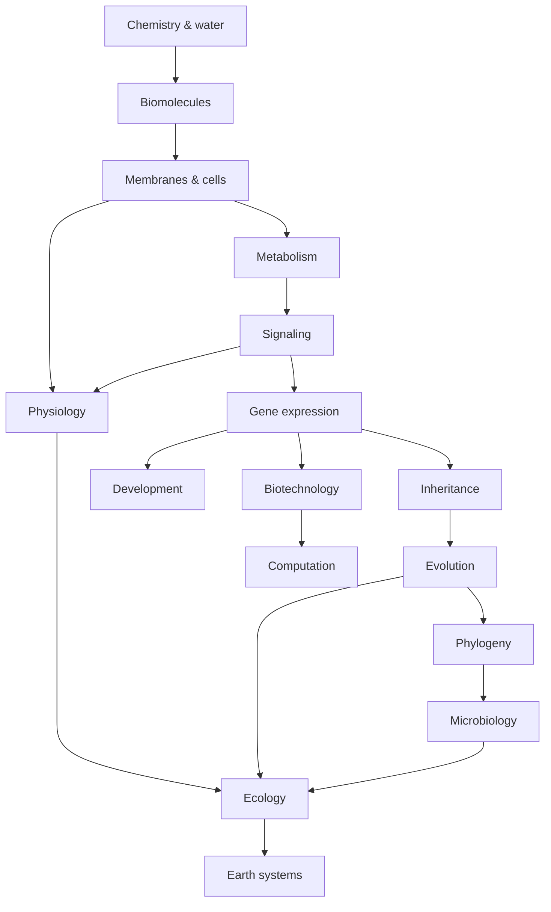

# Biology Connections — Toán học, tính toán và các pattern xuyên scale (생물학의 연결 구조)

Nếu đọc từng chapter riêng lẻ, ta có thể thấy diffusion, feedback, exponential growth, graph, probability hay gradient xuất hiện nhiều lần mà không nhận ra chúng thực chất là **cùng một kiểu cấu trúc lý luận được tái sử dụng ở scale khác nhau**. File này không phải summary. Nó là bản đồ nối các idea đã học, giúp chuyển kiến thức từ domain này sang domain khác.

## 1. Scale không đổi luật nền, nhưng đổi cách mô tả

Ở molecular scale, thermal motion và chemical interaction chi phối. Ở cellular scale, membrane và reaction network xuất hiện. Ở organism scale, transport system và feedback control trở nên cần thiết. Ở population scale, birth/death và probability tạo dynamics. Ở ecosystem scale, energy flow và matter cycle thống trị.

Các scale không độc lập. Một mutation nhỏ có thể đổi protein; protein đổi cell physiology; physiology đổi fitness; fitness đổi allele frequency; allele-frequency change lâu dài đổi community interaction.

Ngược lại, climate shift ở ecosystem scale có thể đổi selection pressure, hormone stress và gene expression trong individual.

> **Mental model:** biology là một stack nhiều tầng, trong đó causal arrow có thể đi từ dưới lên lẫn từ context lớn xuống trạng thái của subsystem.

## 2. Gradient: một pattern từ molecule đến organism

Gradient nghĩa là một đại lượng khác nhau theo space.

Concentration gradient → diffusion.

Electrochemical gradient → ion transport và membrane potential.

Proton gradient → ATP synthesis.

Morphogen gradient → cell fate trong embryo.

Water-potential gradient → xylem transport.

Partial-pressure gradient → gas exchange ở lung.

Cùng một logic toán học: flux xuất hiện vì difference theo space.

Fick-style relationship:

\[
J \propto -\frac{dC}{dx}
\]

Không cần dùng cùng equation cho mọi phenomenon, nhưng mental model “difference drives flow” tái xuất liên tục.

## 3. Feedback: từ enzyme đến climate–ecosystem

Negative feedback ổn định state.

Enzyme end-product inhibition, blood-glucose control, thermoregulation và density-dependent population growth đều dùng logic:

```text
variable deviates
   ↓
response opposes deviation
   ↓
variable returns toward range
```

Positive feedback khuếch đại state transition: action potential, blood clotting, childbirth, một số cell-cycle switch.

Ở ecosystem, positive feedback có thể góp phần tạo regime shift.

Nhận ra feedback giúp ta không phải học từng case từ đầu.

## 4. Exponential growth: cùng equation, nhiều context

\[
\frac{dN}{dt}=rN
\]

xuất hiện khi rate change tỷ lệ amount hiện tại.

Bacterial growth, early epidemic spread trong model đơn, PCR amplification và compound population process đều có thể gần exponential trong range nhất định.

Nhưng biological system hiếm khi exponential mãi vì resource/space/control tạo saturation.

Do đó exponential model thường là **local approximation**, sau đó cần logistic hoặc model phức tạp hơn.

## 5. Saturation: receptor, enzyme và ecology chia sẻ một shape

Michaelis–Menten enzyme rate tăng với substrate rồi bão hòa.

Receptor occupancy cũng có saturation.

Transporter có maximal rate.

Population growth bị carrying capacity limit.

Dù mechanism khác nhau, mathematical shape có cùng intuition: system có finite capacity.

Điều này giúp khi nhìn graph mới, ta hỏi: **capacity nào đang bị saturate?**

## 6. Probability: từ meiosis tới sequencing

Probability xuất hiện vì biological event có randomness hoặc vì ta không biết toàn bộ state.

Mendelian inheritance dùng probability của gamete.

Genetic drift là sampling randomness.

Mutation là rare event.

Sequencing read có error probability.

Diagnostic test và GWAS dùng conditional probability/statistics.

Một principle quan trọng là phân biệt:

\[
P(A|B) \neq P(B|A)
\]

Ví dụ probability có disease khi test positive không bằng sensitivity của test. Bayes theorem giúp nối hai chiều này.

## 7. Bayes: từ prior knowledge tới updated belief

Bayes theorem:

\[
P(H|D)=\frac{P(D|H)P(H)}{P(D)}
\]

Trong genetics, prior allele frequency ảnh hưởng interpretation của variant.

Trong diagnostic testing, disease prevalence ảnh hưởng positive predictive value.

Trong phylogenetics, Bayesian method update probability của tree/model từ sequence data.

Đây là một mathematical pattern xuyên nhiều domain.

## 8. Rate of change và calculus

Physiology và ecology thường quan tâm **rate**, không chỉ amount.

Heart rate, glucose clearance, reaction velocity, population growth và drug concentration change đều là rate.

Derivative:

\[
\frac{dx}{dt}
\]

đo instantaneous rate of change.

Differential equation mô tả system khi rate phụ thuộc current state.

Không cần trở thành mathematician để học biology, nhưng hiểu derivative như “tốc độ thay đổi tại thời điểm” giúp đọc model tự nhiên hơn.

## 9. Conservation law: vật chất không biến mất trong model

Mass balance có dạng:

\[
\text{change} = \text{input} - \text{output} + \text{production} - \text{consumption}
\]

Population balance: birth/death/migration.

Metabolic flux: substrate in/product out.

Kidney physiology: filtered, reabsorbed, secreted, excreted.

Carbon cycle: reservoir + flux.

Cùng accounting logic hoạt động ở rất nhiều scale.

## 10. Network và graph theory

Nhiều biological system không phải chain mà là network.

Gene regulatory network: gene/protein là node, regulation là edge.

Metabolic network: metabolite/reaction tạo graph.

Neural network: neuron/synapse.

Food web: species/trophic interaction.

Phylogenetic tree là special graph dạng tree.

Assembly graph trong genomics reconstruct sequence từ overlap.

Graph theory cho language để nói degree, path, connectivity, community, centrality và robustness.

## 11. Information theory và biology

DNA sequence có information theo statistical sense. Neural signal và sensory coding cũng liên quan information transfer.

Entropy trong information theory:

\[
H=-\sum_i p_i\log p_i
\]

đo uncertainty của distribution.

Concept này không giống hoàn toàn thermodynamic entropy nhưng có mathematical relation sâu trong statistical physics.

Trong sequencing, information content và base quality cũng được biểu diễn bằng logarithmic score.

## 12. Logarithm xuất hiện vì biology trải nhiều bậc độ lớn

pH dùng \(-\log_{10}[H^+]\).

Phylogenetic likelihood thường dùng log-likelihood để tránh số cực nhỏ.

Fold change gene expression thường log-transform.

Population và microbial count có thể trải nhiều orders of magnitude.

Log transform biến multiplication thành addition:

\[
\log(ab)=\log a + \log b
\]

và nén range lớn, nên rất hữu ích trong biological data.

## 13. Optimization và trade-off

Evolutionary system không “solve global optimum” theo engineering sense, nhưng trade-off có thể được phân tích bằng optimization framework.

Organism phân bổ energy giữa growth/reproduction.

Plant cân bằng CO₂ uptake với water loss.

Hemoglobin cân bằng loading/release oxygen.

Immune system cân bằng defense và tissue damage.

Drug dosing cân bằng efficacy/toxicity.

Tư duy optimization giúp hỏi objective và constraint, nhưng phải nhớ evolution bị history và local constraint giới hạn.

## 14. Control theory và physiology

Control system có sensor, set/reference, controller, actuator và feedback.

Thermoregulation, glucose control, blood pressure và endocrine axis đều có architecture tương tự.

Tuy nhiên biological control thường decentralized, nonlinear và adaptive hơn engineering controller đơn giản.

Comparison hữu ích để xây mental model nhưng không nên ép organism thành máy thermostat đơn giản.

## 15. Signal processing và nervous system

Neuron integrate input theo time và space. Sensory receptor filter stimulus. Neural circuit transform signal.

Concept threshold, gain, noise, adaptation và frequency coding đều có analogue trong signal processing.

Đây là bridge tự nhiên giữa neuroscience và electrical/computer engineering.

## 16. Database và versioning trong genomics

Genome data phụ thuộc reference build. Variant coordinate trên build khác nhau có thể không map trực tiếp.

Pipeline bioinformatics cần version package, parameter và raw-data provenance.

Đây là software-engineering principle: **reproducibility requires explicit state**.

Biology hiện đại vì thế không chỉ wet lab; data engineering là một phần scientific method.

## 17. Machine learning: high-dimensional pattern nhưng không tự tạo causality

Omics có nhiều feature hơn sample. ML giúp compression, classification và prediction.

Nhưng model predictive tốt không đồng nghĩa mechanism đúng.

Nếu batch effect correlate disease label, model có thể “học máy sequencing” thay vì biology.

Do đó train/test split, external validation và experimental intervention cực quan trọng.

## 18. Causal graph: nối lại chapter đầu

Ta bắt đầu library bằng causal reasoning và kết thúc bằng cùng principle.

Một causal graph biểu diễn variable và directed relationship.

Nếu A và B correlation vì cùng chịu C, intervention lên A có thể không đổi B.

Biology data rất dễ confounded bởi age, ancestry, diet, batch, environment.

Do đó hiểu mechanism luôn quan trọng hơn chỉ tìm association.

## 19. Một knowledge graph thống nhất

Có thể nén library bằng các đường nối sau:



Mỗi arrow không chỉ là “nên đọc file A trước B”. Nó là dependency lý luận.

Chemistry giải thích molecular interaction. Molecular interaction tạo membrane và enzyme. Membrane/energy tạo cell process. Cell process cần regulation. Regulation dùng gene expression. Gene được truyền tạo variation. Variation trong population tạo evolution. Evolution tạo diversity. Organism interaction tạo ecology. Và technology tái sử dụng tất cả mechanism đó.

## 20. Cách dùng connection này khi gặp vấn đề mới

Khi gặp một câu hỏi sinh học mới, thay vì cố nhớ fact, hãy đi theo chuỗi:

**Scale nào?** Molecular, cell, organism hay population?

**Dòng nào?** Matter, energy hay information?

**Gradient hay feedback nào?** Có force hoặc control loop nào?

**Constraint nào?** Resource, geometry, time, history hay trade-off?

**Variation ở đâu?** Individual khác nhau vì gì?

**Mechanism nối cause tới effect?** Có bước trung gian nào?

Nếu trả lời được các câu này, phần lớn “fact mới” sẽ có chỗ gắn vào knowledge graph thay vì trở thành kiến thức rời rạc.

> **Mental model cuối:** Sinh học là khoa học về các network sống được tổ chức qua nhiều scale. Các chapter khác nhau không phải những môn riêng; chúng là những góc nhìn khác nhau lên cùng các dòng vật chất, năng lượng và thông tin.