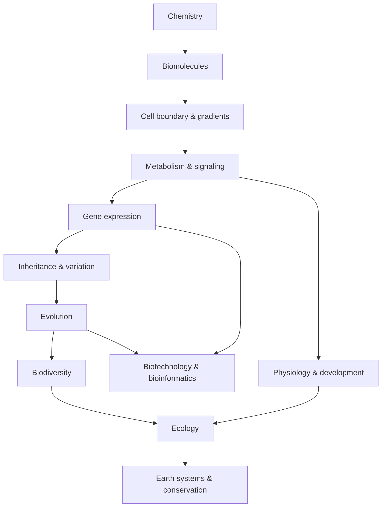

# Biology × Mathematics × Computation × quy mô (scale / 규모) — Các kết nối xuyên lĩnh vực (생물학 × 수학 × 계산)

> **Mạch đọc:** [README Biology](../README.md) là owner của nhánh kết nối này. File đi từ quy mô và hình học sang tốc độ, phản hồi, xác suất, mạng lưới rồi quay lại mô phỏng và các motif chung; mỗi bước chỉ giữ quan hệ có thể dùng để đọc các chapter Biology khác.


Nếu đọc từng chapter riêng, ta có thể thấy nhiều khái niệm khác tên: khuếch tán (diffusion), động học enzym (enzyme kinetics), quần thể (population) sinh trưởng (growth), điện thế hoạt động (action potential), gen (gene) mạng lưới (network), lưới thức ăn (food web), giải trình tự (sequencing). Nhưng khi lùi lại một bước, các hệ này lặp lại một số **các mô-típ toán học và tính toán (mathematical and computational motifs)** giống nhau: tốc độ (rate), chênh lệch (gradient), phản hồi (feedback / 피드백), xác suất (probability / 확률), mạng lưới (network), tối ưu hóa (optimization / 최적화) và thông tin (information / 정보).

Chapter này không phải summary môn Sinh học. Nó là bản đồ các mẫu (pattern / 패턴) tái xuất hiện ở nhiều quy mô (scale / 규모), giúp người đọc transfer lập luận (reasoning / 추론) từ chapter này sang chapter khác.

> **mô hình tư duy (mental model / 사고 모델):** một concept sâu thường đáng nhớ vì nó tái xuất ở nhiều quy mô (scale / 규모). độ dốc (gradient / 기울기) không chỉ thuộc membrane; phản hồi (feedback / 피드백) không chỉ thuộc hormone; đồ thị (graph / 그래프) không chỉ thuộc khoa học máy tính (computer science / 컴퓨터 과학). Đây là “grammar” chung của các hệ phức tạp (complex systems).

## 1. quy mô (scale / 규모) thay đổi câu hỏi, không thay vật lý nền

Atom → phân tử (molecule) → tế bào (cell) → mô (tissue) → sinh vật (organism) → quần thể → ecosystem là các quy mô (scale / 규모) lồng nhau.

Ở quy mô (scale / 규모) nhỏ, chuyển động nhiệt (thermal motion) và va chạm phân tử (molecular collision) quan trọng. Ở quy mô (scale / 규모) organism, dòng chảy khối (bulk flow)/pressure quan trọng. Ở quy mô (scale / 규모) population, xác suất (probability / 확률) và tốc độ nhân khẩu học (demographic rate) quan trọng.

Không có quy mô (scale / 규모) nào “thật hơn”. mô hình (model / 모델) phù hợp phụ thuộc câu hỏi.

## 2. Surface-area-to-volume ratio

Nếu kích thước (size / 크기) đặc trưng là \(L\):

\[
Area\propto L^2,\qquad Volume\propto L^3
\]

nên:

\[
\frac{Area}{Volume}\propto \frac{1}{L}
\]

Điều này giải thích:

- cell nhỏ;
- microvilli/alveoli/cristae tăng surface;
- organism lớn cần circulation;
- lá (leaf)/rễ (root) kiến trúc (architecture / 아키텍처) ưu tiên giao diện (interface / 인터페이스).

Một equation hình học (geometry / 기하학) tạo consequences ở nhiều chapter.

> **Chuyển mạch:** Tỷ lệ diện tích–thể tích cho biết hình học giới hạn trao đổi ra sao; **3. tỷ lệ thay đổi** chuyển cùng câu hỏi đó sang động lực học: không chỉ hệ có kích thước nào, mà hệ đang đổi nhanh đến mức nào.

## 3. tỷ lệ (rate / 비율) of thay đổi (change / 변경)

Biology quan tâm không chỉ amount mà **tốc độ**:

\[
\frac{dx}{dt}
\]

Nhịp tim (heart rate), tốc độ phản ứng (reaction rate), tốc độ tăng trưởng (growth rate), tốc độ phiên mã (transcription rate) và species decline đều là tốc độ.

Derivative trong calculus mô tả tốc độ tức thời (instantaneous rate). Khi ta nói \(dN/dt=rN\), ta không hỏi kích thước quần thể (population size) là bao nhiêu mà hỏi nó đang thay đổi nhanh thế nào tại trạng thái (state / 상태) hiện tại.

## 4. Tăng trưởng theo hàm mũ (exponential growth)

Nếu tốc độ tăng trưởng proportional hiện tại (current / 현재) amount:

\[
\frac{dN}{dt}=rN
\Rightarrow N(t)=N_0e^{rt}
\]

Mẫu (pattern / 패턴) này xuất hiện trong:

- bacterial growth;
- early population expansion;
- PCR lý tưởng theo cycle (discrete doubling);
- lãi kép (compound interest) analogies;
- epidemic early phase ở mô hình (model / 모델) đơn giản.

Exponential tiến trình (process / 프로세스) counterintuitive vì absolute increment tăng cùng trạng thái (state / 상태).

## 5. Tăng trưởng logistic (logistic growth) và bão hòa (saturation)

Tài nguyên (resource / 자원)/sức chứa (capacity / 용량) hữu hạn tạo bão hòa:

\[
\frac{dN}{dt}=rN\left(1-\frac{N}{K}\right)
\]

Saturation motif cũng xuất hiện động học enzym:

\[
v=\frac{V_{max}[S]}{K_m+[S]}
\]

Hai equation không mô tả cùng cơ chế (mechanism / 메커니즘), nhưng share idea: phản hồi (response / 응답) gần tuyến tính (linear / 선형) khi đầu vào (input / 입력) thấp rồi chạm ceiling do limiting sức chứa (capacity / 용량).

Recognize motif giúp transfer intuition mà không đánh đồng hệ thống (system / 시스템).

## 6. Logarithm

pH:

\[
pH=-\log_{10}[H^+]
\]

Decibel, thông tin (information / 정보) measure, fold-change visualization và some population statistics cũng dùng log.

Log hữu ích khi quantity span nhiều thứ tự (order / 순서) of magnitude. Nó biến multiplicative difference thành additive quy mô (scale / 규모).

Ví dụ pH 6 và 7 khác khoảng 10 lần [H⁺], không phải “1 đơn vị (unit / 단위) nhỏ”.

> **Chuyển mạch:** Logarithm nén các khoảng cách nhân thành khoảng cách cộng để so sánh nhiều bậc độ lớn; **7. Chênh lệch** dùng một ý khác để mô tả hướng trong không gian: gradient cho biết chất hay năng lượng sẽ di chuyển về đâu.

## 7. Chênh lệch

Độ dốc (gradient / 기울기) là spatial thay đổi (change / 변경). Khuếch tán dòng chuyển hóa (flux):

\[
J=-D\nabla C
\]

Trong 1D thành \(-D dC/dx\).

Độ dốc (gradient / 기울기) xuất hiện ở:

- concentration across membrane;
- voltage/chênh lệch điện hóa (electrochemical gradient);
- chênh lệch proton (proton gradient) mitochondria/chloroplast;
- chênh lệch morphogen (morphogen gradient) embryo;
- oxy (oxygen)/chất dinh dưỡng (nutrient) độ dốc (gradient / 기울기) màng sinh học (biofilm);
- thế nước (water potential) độ dốc (gradient / 기울기) plant.

Một principle: **difference can store direction/potential**. Living hệ thống (system / 시스템) tiêu năng lượng (energy / 에너지) để tạo difference, rồi khai thác difference để làm công việc (work / 작업) hoặc encode thông tin (information / 정보).

## 8. Dòng chảy (flow) = driving force / resistance

Circulation gần dạng:

\[
Q=\frac{\Delta P}{R}
\]

Electrical hiện tại (current / 현재) có analogous form \(I=V/R\). Diffusion cũng có driving độ dốc (gradient / 기울기) và resistance/permeability.

Không nên nói mạch máu (blood vessel) “y như circuit”, nhưng analogy giúp hiểu: tăng driving pressure tăng luồng (flow / 흐름); tăng resistance giảm luồng (flow / 흐름).

## 9. Phản hồi

Phản hồi âm (negative feedback):

```text
variable lệch
→ sensor
→ response
→ deviation giảm
```

Xuất hiện ở:

- glucose–insulin;
- nhiệt độ cơ thể (body temperature);
- enzym (enzyme) ức chế phản hồi (feedback inhibition);
- trục nội tiết (endocrine axis);
- điều hòa gen (gene regulation);
- mật độ quần thể (population density) dependence.

Phản hồi dương (positive feedback) xuất hiện blood clotting, childbirth, công tắc (switch)-like gene circuit.

Lý thuyết điều khiển (control theory) cung cấp vocabulary sensor, bộ điều khiển (controller), actuator, gain, delay, stability.

## 10. Delay có thể tạo dao động (oscillation)

Nếu phản hồi (feedback / 피드백) đáp ứng (response) đến chậm, hệ thống (system / 시스템) có thể overshoot/oscillate.

Vật săn mồi–con mồi (predator–prey) cycle, endocrine pulse, nhịp sinh học ngày đêm (circadian rhythm) và gene oscillator đều có delay/tính phi tuyến (nonlinearity).

Stable phản hồi (feedback / 피드백) không chỉ cần “negative”; timing và gain cũng quan trọng.

## 11. Xác suất

Meiosis là random sampling alen (allele); mutation stochastic; thụ thể (receptor) binding probabilistic; bệnh (disease) rủi ro (risk / 위험) probabilistic.

Sản phẩm (product / 제품) quy tắc (rule / 규칙) và conditional xác suất (probability / 확률) xuất hiện genetics/diagnostics.

Bayes theorem:

\[
P(H|D)=\frac{P(D|H)P(H)}{P(D)}
\]

được dùng khi cập nhật (update / 업데이트) belief từ prior + bằng chứng (evidence / 증거).

Medical testing là example: positive kiểm thử (test / 테스트) xác suất (probability / 확률) disease phụ thuộc disease prevalence, sensitivity và độ đặc hiệu (specificity).

## 12. cơ sở (base / 기반) tỷ lệ (rate / 비율) và medical kiểm thử (test / 테스트)

Nếu disease hiếm, dương tính giả (false positive) từ population healthy lớn có thể khiến positive predictive giá trị (value / 값) thấp hơn intuition.

Điều này cho thấy “kiểm thử (test / 테스트) accuracy 99%” chưa đủ; cần conditional xác suất (probability / 확률).

Biology và statistics không thể tách trong diagnostic lập luận (reasoning / 추론).

> **Chuyển mạch:** Khi đã thấy prevalence làm đổi ý nghĩa của một kết quả dương tính, **13. Sampling và độ bất định** mở rộng cùng vấn đề sang sai số của mẫu và độ tin cậy của ước lượng.

## 13. Sampling và độ bất định (uncertainty / 불확실성)

Experiment dùng mẫu (sample / 표본) để infer population. mẫu (sample / 표본) mean có độ bất định; lần lặp (replicate) giúp estimate variance.

Small mẫu (sample / 표본) dễ bị nhiễu (noise)/outlier. Biến thiên sinh học (biological variability) là tín hiệu (signal / 신호) về hệ thống (system / 시스템) heterogeneity, không chỉ nuisance.

Confidence interval và tác động (effect / 효과) kích thước (size / 크기) thường quan trọng hơn chỉ p-value.

## 14. Hypothesis testing và multiple comparisons

Omics kiểm thử (test / 테스트) hàng nghìn gene; nếu dùng threshold 0.05 naïve, dương tính giả nhiều.

False discovery tỷ lệ (rate / 비율) correction quản lý expected proportion false discovery.

Quy mô (scale / 규모) dữ liệu (data / 데이터) lớn buộc statistics thay đổi cách làm khoa học.

## 15. Correlation vs causation

Correlation ma trận (matrix / 행렬) trong biểu hiện gen (gene expression) hay microbiome có thể tìm mẫu (pattern / 패턴) nhưng không chứng minh direction.

Nhân quả (causal / 인과적) suy luận (inference / 추론) cần intervention, thứ tự thời gian (temporal order), instrument hoặc mechanistic bằng chứng (evidence / 증거).

Directed acyclic đồ thị (graph / 그래프) (DAG) giúp reason confounder/mediator.

Tư duy khoa học (scientific thinking) chapter quay lại bằng formal mô hình (model / 모델).

> **Chuyển mạch:** Correlation chỉ cho biết biến cùng thay đổi; **16. Lý thuyết đồ thị** cung cấp cấu trúc để biểu diễn các quan hệ và đặt câu hỏi về đường dẫn, nút trung tâm và yếu tố gây nhiễu.

## 16. Lý thuyết đồ thị (graph theory)

Đồ thị (graph / 그래프) gồm nút (node / 노드) và edge.

Biological ánh xạ (mapping / 매핑):

- protein tương tác (interaction / 상호작용) mạng (network / 네트워크);
- mạng lưới điều hòa gen (gene-regulatory network);
- mạng lưới chuyển hóa (metabolic network);
- neural mạng (network / 네트워크);
- lưới thức ăn;
- cây phát sinh chủng loại (phylogenetic tree) (special graph structure);
- genome assembly đồ thị (graph / 그래프).

Degree, đường dẫn (path / 경로), centrality và quần xã (community) cấu trúc (structure / 구조) có thể mô tả mạng lưới.

Nhưng high centrality không tự chứng minh biological importance; biểu diễn (representation / 표현)/dữ liệu (data / 데이터) độ lệch (bias / 편향) vật chất (matter).

## 17. Trees

Cây phát sinh chủng loại, tế bào lineage cây (tree / 트리) và cây quyết định (decision tree / 의사결정 트리) đều là cây (tree / 트리) nhưng ngữ nghĩa (semantic / 의미적) khác.

Cây (tree / 트리) useful khi tiến trình (process / 프로세스) branching và no recombination giả định (assumption / 가정) phù hợp. Chuyển gen ngang (horizontal gene transfer)/sexual recombination có thể cần mạng (network / 네트워크) thay cây (tree / 트리).

Biểu diễn (representation / 표현) phải match cơ chế (mechanism / 메커니즘).

## 18. Lý thuyết thông tin (information theory)

DNA chuỗi (sequence / 시퀀스) có alphabet; entropy có thể đo độ bất định/phân phối (distribution / 분포) symbols. chuỗi (sequence / 시퀀스) conservation gợi ý ràng buộc (constraint / 제약조건); motif có thông tin (information / 정보) content.

Neural coding và signaling cũng có channel/noise perspective.

Nhưng “biological thông tin (information / 정보)” không nên bị tách khỏi vật lý (physical / 물리적) substrate. thông tin (information / 정보) phải được encoded, transmitted và decoded bằng molecule/tế bào.

## 19. Algorithms và chuỗi (sequence / 시퀀스) comparison

Alignment động (dynamic / 동적) programming giải tối ưu hóa (optimization / 최적화):

\[
score(i,j)=\max
\begin{cases}
score(i-1,j-1)+match/mismatch\\
score(i-1,j)+gap\\
score(i,j-1)+gap
\end{cases}
\]

Sinh tin học (bioinformatics) biến evolutionary giả định (assumption / 가정) thành scoring quy tắc (rule / 규칙) và computation.

Thuật toán (algorithm / 알고리즘) độ phức tạp (complexity / 복잡도) quyết định dữ liệu (data / 데이터) quy mô (scale / 규모) nào khả thi.

## 20. tối ưu hóa (optimization / 최적화) và biological sự đánh đổi (trade-off / 트레이드오프)

Evolution không tối ưu một mục tiêu (objective / 목표) duy nhất. Trait thường sự đánh đổi (trade-off / 트레이드오프):

- reproduction vs maintenance;
- mất nước (water loss) vs CO₂ uptake;
- immune sensitivity vs autoimmunity;
- speed vs accuracy;
- growth vs stress resistance.

Kỹ thuật (engineering / 엔지니어링) tối ưu hóa (optimization / 최적화) thường có mục tiêu (objective / 목표) rõ; biological “fitness landscape” bối cảnh (context)-dependent và historical ràng buộc (constraint / 제약조건).

## 21. năng lượng (energy / 에너지) landscape

Sự gấp cuộn protein (protein folding) có thể hình dung năng lượng (energy / 에너지) landscape với nhiều conformation. Developmental cell fate đôi khi dùng metaphor landscape trạng thái (state / 상태); evolution có fitness landscape.

Các “landscape” không cùng mathematical đối tượng (object / 객체), nhưng share idea hệ thống (system / 시스템) trạng thái (state / 상태) move trong không gian (space / 공간) có basin/barrier.

Cần tránh kéo analogy quá xa.

## 22. Phân tích thứ nguyên (dimensional analysis)

Trước khi tin equation, kiểm tra đơn vị (unit / 단위).

Nếu luồng (flow / 흐름) = volume/thời gian (time / 시간), right side cũng phải cho volume/thời gian (time / 시간). đơn vị (unit / 단위) mismatch thường lộ lỗi mô hình (model / 모델)/calc.

Biology có nhiều đơn vị (unit / 단위): mol/L, mmHg, mV, J/mol, các tế bào (cells)/mL, kg/m². Dimensional thinking giảm memorization formula.

## 23. Normalization

RNA-seq count, qPCR, microscopy intensity và metabolomics đều cần normalization vì raw đo lường (measurement / 측정) phụ thuộc thư viện (library / 라이브러리) kích thước (size / 크기), loading hay thiết bị đo (instrument).

Normalization không phải cosmetic; nó xác định “so sánh công bằng” nghĩa là gì.

Sai normalization có thể tạo mẫu hình (pattern) giả.

## 24. Học máy (machine learning)

ML thường tìm hàm (function / 함수):

\[
f(X)\rightarrow y
\]

Trong sinh học (biology), X có thể biểu hiện gen/ảnh (image / 이미지)/trình tự (sequence); y có thể loại tế bào (cell type)/nguy cơ (risk)/đặc tính (property).

Prediction tốt không tự cho cơ chế (mechanism / 메커니즘). tính năng (feature / 기능) association có thể do yếu tố gây nhiễu (confounder).

Train/kiểm tra hợp lệ (validation / 검증)/kiểm thử (test / 테스트) split và bên ngoài (external / 외부) kiểm tra hợp lệ (validation / 검증) quan trọng để tránh overfitting.

## 25. Overfitting và biological dataset nhỏ

Mô hình (model / 모델) quá flexible có thể memorize mẫu (sample / 표본). Genomics thường có p variables rất lớn nhưng n mẫu (sample / 표본) nhỏ.

Regularization, cross-validation và independent cohort giúp, nhưng không thay biological thiết kế (design / 설계).

Dữ liệu (data / 데이터) quantity theo tính năng (feature / 기능) không đồng nghĩa thông tin (information / 정보) quantity theo independent mẫu (sample / 표본).

## 26. Dynamical các hệ thống (systems / 시스템들)

General ODE:

\[
\frac{d\mathbf{x}}{dt}=\mathbf{f}(\mathbf{x},\mathbf{u})
\]

Trạng thái (state / 상태) véc-tơ (vector / 벡터) có thể là concentration gene/protein (protein)/quần thể. Fixed điểm (point / 지점) là trạng thái (state / 상태) không đổi theo mô hình; stability hỏi perturbation có quay lại không.

Cân bằng nội môi (homeostasis), khả năng phục hồi hệ sinh thái (ecosystem resilience) và gene circuit đều có thể dùng ngôn ngữ (language / 언어) này.

## 27. Stochastic các hệ thống (systems / 시스템들)

Khi molecule number thấp, randomness đáng kể. Gen transcription có burst; kênh ion (ion channel) open probabilistically; population drift stochastic.

Deterministic ODE dùng average có thể bỏ mất variability.

Stochastic simulation như Gillespie phù hợp một số molecular mạng (network / 네트워크).

## 28. quy mô (scale / 규모) separation

Một signaling phosphorylation xảy ra seconds, biểu hiện gen minutes-hours, development days-years, evolution generations, geological cycle millennia.

Mô hình (model / 모델) thường tách fast/slow tiến trình (process / 프로세스) để đơn giản.

Nhưng khi timescale overlap, tương tác (interaction / 상호작용) tạo hành vi (behavior / 동작) phức tạp.

## 29. cấu trúc dữ liệu (data structure / 자료구조) và cơ sở dữ liệu (database / 데이터베이스)

Trình tự, cây (tree / 트리), đồ thị (graph / 그래프), ma trận (matrix / 행렬), thời gian (time / 시간) series và ảnh (image / 이미지) là dữ liệu (data / 데이터) kiểu (type / 타입) khác nhau.

Chọn biểu diễn (representation / 표현) đúng quyết định thuật toán (algorithm / 알고리즘) có thể làm gì. Hệ gen (genome) variant thường bảng (table / 테이블); expression là ma trận (matrix / 행렬); phylogeny là cây (tree / 트리); protein contact là đồ thị (graph / 그래프).

Khoa học máy tính (computer science / 컴퓨터 과학) skill không chỉ mã (code / 코드); nó là thiết kế biểu diễn (representation / 표현) phù hợp lĩnh vực (domain / 도메인).

## 30. Mô phỏng (simulation)

Khi analytic solution khó, simulation thử quy tắc (rule / 규칙) nhiều step để xem emergent hành vi (behavior / 동작).

Agent-based mô hình (model / 모델) có thể mô phỏng individual cell/sinh vật; finite-difference mô hình (model / 모델) mô phỏng diffusion; Monte Carlo dùng random sampling.

Simulation không tự chứng minh world hoạt động như mô hình. Nó chỉ cho biết **nếu quy tắc (rule / 규칙)/tham số (parameter) đúng thì kết quả (outcome / 결과) nào xuất hiện**.

## 31. One motif xuyên toàn thư viện: difference → dòng chảy → phản hồi

Ta có thể nén rất nhiều Biology vào ba bước:

1. hệ thống (system / 시스템) tạo/nhận một **difference**: concentration, voltage, áp suất (pressure), thông tin (information / 정보) trạng thái (state / 상태);
2. difference tạo **dòng chảy/thay đổi (change / 변경)**;
3. phản hồi điều chỉnh difference/dòng chảy.

Ví dụ:

- chênh lệch proton → H⁺ dòng chảy → ATP → phản hồi chuyển hóa (metabolism);
- huyết áp (blood pressure) → dòng máu (blood flow) → mô oxy → cardiovascular phản hồi (feedback / 피드백);
- prey abundance → vật săn mồi (predator) sinh trưởng → prey decline → coupled phản hồi (feedback / 피드백);
- gen-expression difference → tế bào-state chuyển tiếp (transition / 전이) → regulatory phản hồi (feedback / 피드백).

Đây là mô hình tư duy powerful vì dùng được từ nanomet đến ecosystem.

## 32. Một motif thứ hai: biến dị (variation) → chọn lọc (selection)/filter → bộ nhớ (memory / 메모리)

Sau motif dòng chảy và feedback, ta chuyển sang motif thông tin được lọc rồi lưu lại. Ví dụ ở tiến hóa, miễn dịch, thần kinh và CRISPR khác nhau về vật chất nhưng cùng cho thấy cách hệ thống giữ lại trạng thái có ích.

- đột biến (mutation)/tái tổ hợp (recombination) → chọn lọc tự nhiên (natural selection) → alen-frequency memory;
- B-tế bào receptor diversity → kháng nguyên (antigen) chọn lọc → trí nhớ miễn dịch (immune memory);
- neural synaptic variation/hoạt động (activity) → plasticity selection → bộ nhớ (memory / 메모리) dấu vết (trace / 추적);
- CRISPR spacer acquisition → mục tiêu (target / 대상) recognition → microbial trí nhớ miễn dịch.

Cơ chế (mechanism / 메커니즘) khác nhau nhưng lô-gic (logic / 논리) thông tin selection xuất hiện lặp lại.

## 33. Một motif thứ ba: tính mô-đun (modularity) + mạng lưới

Cell dùng organelle; gen mạng (network / 네트워크) dùng mô-đun (module / 모듈); organism dùng organ; ecosystem dùng trophic guild.

Tính mô-đun giúp hệ thống (system / 시스템) độ phức tạp (complexity / 복잡도) manageable và damage cục bộ (local / 로컬) hơn, nhưng mô-đun (module / 모듈) vẫn phải communicate qua mạng lưới.

Kỹ nghệ phần mềm (software engineering / 소프트웨어 공학) cũng dùng mô-đun (module / 모듈)/API vì bài toán (problem / 문제) tương tự: độ phức tạp (complexity / 복잡도) management.

## 34. Khi liên kết (connection / 연결) với IT thực sự hữu ích

Biology và IT không giống nhau literal. Nhưng một số analogy productive:

- DNA ~ persistent chuỗi (sequence / 시퀀스) store, nhưng không phải executable mã (code / 코드) độc lập;
- thụ thể (receptor) ~ đầu vào (input / 입력) giao diện (interface / 인터페이스);
- truyền tín hiệu (signaling) mạng lưới ~ event-processing mạng (network / 네트워크);
- điều khiển phản hồi (feedback control) ~ điều khiển (control / 제어) hệ thống (system / 시스템);
- mạng lưới điều hòa gen (gene regulatory network) ~ máy trạng thái (state machine / 상태 머신)/mạng lưới;
- immune repertoire ~ phân tán (distributed / 분산) pattern-nhận dạng (recognition) hệ thống (system / 시스템);
- phát sinh chủng loại (phylogeny) ~ branching phiên bản (version / 버전) lịch sử (history / 이력) (nhưng recombination làm khác Git tree);
- bioinformatics chuỗi xử lý (pipeline / 파이프라인) ~ kỹ thuật dữ liệu (data engineering / 데이터 엔지니어링) chuỗi xử lý (pipeline / 파이프라인).

Analogy tốt khi giúp hỏi đúng câu, không khi ép biology thành computer.

## 35. Cách dùng chapter này khi học lại

Khi gặp một concept khó, hãy thử map nó vào các motif:

**quy mô (scale / 규모) nào? biến trạng thái (state variable) là gì? chênh lệch/driving force là gì? dòng chảy/tỷ lệ (rate / 비율) là gì? phản hồi ở đâu? độ bất định ở đâu? mạng lưới nút (node / 노드)/edge là gì? ràng buộc/sự đánh đổi (trade-off / 트레이드오프) nào?**

Nếu trả lời được, concept thường trở nên ít rời rạc hơn.

## 36. Final mô hình tư duy

Toàn Biology thư viện kiến thức (knowledge library / 지식 라이브러리) có thể được nhìn như một đồ thị kiến thức (knowledge graph):


```mermaid
flowchart TD
A[Chemistry] --> B[Biomolecules]
B --> C[Cell boundary & gradients]
C --> D[Metabolism & signaling]
D --> E[Gene expression]
E --> F[Inheritance & variation]
F --> G[Evolution]
G --> H[Biodiversity]
D --> I[Physiology & development]
H --> J[Ecology]
I --> J
E --> K[Biotechnology & bioinformatics]
G --> K
J --> L[Earth systems & conservation]
```

Điều quan trọng không phải nhớ sơ đồ, mà thấy mỗi arrow là một nhân quả (causal / 인과적) phụ thuộc (dependency / 의존성).

> **Mô hình tư duy cuối thư viện (library / 라이브러리):** life là complex adaptive hệ thống (system / 시스템) được xây từ vật chất (matter), chạy bằng năng lượng (energy / 에너지) chênh lệch (gradient), tổ chức bằng thông tin (information / 정보), ổn định bằng phản hồi (feedback / 피드백), đa dạng nhờ variation và được định hình qua chọn lọc/lịch sử (history / 이력). Toán học (mathematics) cung cấp ngôn ngữ (language / 언어) của relationship; computation cung cấp cách xử lý quy mô (scale / 규모); Sinh học cung cấp cơ chế (mechanism / 메커니즘) và meaning.

<!-- depth-audit-2026:master-chain -->
## Mô hình tư duy (mental model / 사고 모델) xuyên toàn thư viện (library / 라이브러리): matter → năng lượng (energy / 에너지) → thông tin (information / 정보) → regulation → adaptation → evolution → ecosystem

**Vật chất (matter)** tạo substrate và cấu trúc (structure / 구조). Không có atom, ion, membrane, carbon skeleton hay water thì không có hệ thống (system / 시스템) để vận hành. **năng lượng (energy / 에너지)** giữ hệ thống (system / 시스템) xa equilibrium, duy trì độ dốc (gradient / 기울기) và cho phép synthesis/repair. **thông tin (information / 정보)** giúp hệ thống (system / 시스템) dùng năng lượng có chọn lọc: chuỗi (sequence / 시퀀스), receptor trạng thái (state / 상태), neural mã (code / 코드) hay ecological tín hiệu (signal / 신호) đều làm thay đổi hành động (action / 동작) dựa trên ngữ cảnh (context / 맥락).

**Điều hòa (regulation)** biến thông tin (information / 정보) thành phản hồi (feedback / 피드백) và quyết định (decision / 결정). Enzyme allostery, gene mạng (network / 네트워크), endocrine axis và predator–prey density dependence đều là điều khiển (control / 제어) ở quy mô (scale / 규모) khác nhau. **Thích nghi (adaptation)** xuất hiện khi regulation/plasticity giúp hệ thống (system / 시스템) đổi trạng thái (state / 상태) trong thời gian tồn tại (lifetime / 수명) hoặc khi selection giữ variant phù hợp qua generation. **Tiến hóa (evolution)** tích lũy thay đổi heritable, từ đó đổi cấu trúc (structure / 구조) và regulatory kiến trúc (architecture / 아키텍처) của organism. Organism mới lại tương tác thành **hệ sinh thái (ecosystem)**, nơi material/năng lượng (energy / 에너지) flux và selection pressure quay trở lại tác động từng lineage.

Chuỗi này không phải đường một chiều mà là vòng lặp nhiều quy mô (scale / 규모):

```text
matter → energy → information → regulation
   ↑                         ↓
ecosystem ← evolution ← adaptation
```

Mathematics cung cấp ngôn ngữ cho tỷ lệ (rate / 비율), xác suất (probability / 확률), phản hồi (feedback / 피드백) và mạng (network / 네트워크). Physics/Chemistry đặt ràng buộc (constraint / 제약조건). Psychology mô tả thông tin (information / 정보) processing và hành vi (behavior / 동작) ở quy mô (scale / 규모) organism. AI/Bioinformatics giúp biểu diễn và dự đoán dữ liệu (data / 데이터) lớn, nhưng mọi mô hình (model / 모델) cuối cùng vẫn phải quay về cơ chế (mechanism / 메커니즘) và experiment.

---

<!-- biology-learning-navigation -->
**Điều hướng học:** [← Sinh học hệ thống, mô hình hóa và sinh học tổng hợp](../06_biotechnology_computation/03_systems_biology_modeling_and_synthetic_biology.md) · [Mục lục Biology](../README.md) · [Sinh học nhìn qua Vật lý, Hóa học và Kỹ thuật →](01_biology_physics_chemistry_and_engineering.md)

> **Bàn giao:** Sau **mô hình tư duy (mental model / 사고 모델) xuyên toàn thư viện (library / 라이브러리): matter → năng lượng (energy / 에너지) → thông tin (information / 정보) → regulation → adaptation → evolution → ecosystem**, hãy chốt bất biến (invariant / 불변식) và giới hạn của mục này trước khi nối sang kiến thức kế tiếp. Có thể đọc tiếp [01 biology physics chemistry and engineering](./01_biology_physics_chemistry_and_engineering.md) để đối chiếu ranh giới (boundary / 경계) gần nhất.
