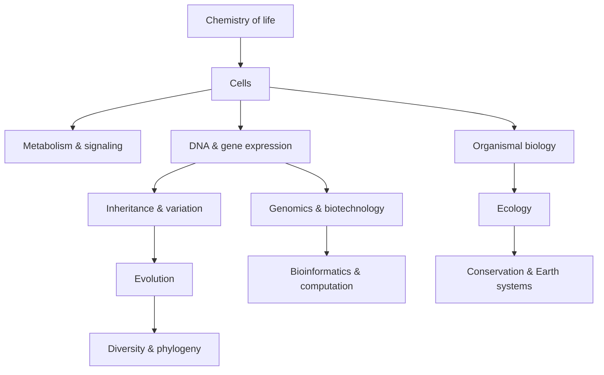

# Biology Knowledge Library — Thư viện kiến thức Sinh học

Sinh học (Biology / 생물학) nghiên cứu sự sống như một hệ thống vật chất có khả năng duy trì tổ chức, trao đổi năng lượng, lưu trữ thông tin, sinh sản, biến đổi và tiến hóa. Thư viện này không tổ chức theo “cơ bản → nâng cao”, mà theo các ranh giới tự nhiên của kiến thức: từ hóa học của sự sống đến tế bào, từ thông tin di truyền đến tiến hóa, từ cơ thể đến hệ sinh thái, rồi nối sang công nghệ sinh học và khoa học dữ liệu.

Mục tiêu là giúp người đọc xây được một mental model thống nhất: sinh vật không phải tập hợp những fact rời rạc. Một tế bào sống được vì dòng vật chất, năng lượng và thông tin phối hợp với nhau; một cơ thể sống được vì nhiều tế bào chuyên hóa nhưng vẫn giữ cân bằng nội môi; một quần thể thay đổi qua thời gian vì đột biến, chọn lọc, trôi dạt và dòng gene; một hệ sinh thái tồn tại nhờ dòng năng lượng và chu trình vật chất.



## Cấu trúc thư viện

```text
biology/
├── README.md
├── 00_foundations/
│   ├── 00_what_is_life.md
│   └── 01_chemistry_energy_and_water.md
├── 01_cell_biology/
│   ├── 00_cells_membranes_and_transport.md
│   ├── 01_metabolism_respiration_photosynthesis.md
│   └── 02_cell_signaling_and_cell_cycle.md
├── 02_genetics_molecular_biology/
│   ├── 00_dna_genes_and_gene_expression.md
│   ├── 01_inheritance_variation_and_mutation.md
│   └── 02_genomics_epigenetics_and_regulation.md
├── 03_evolution_and_diversity/
│   ├── 00_evolution_and_population_genetics.md
│   └── 01_phylogeny_taxonomy_and_biodiversity.md
├── 04_organismal_biology/
│   ├── 00_plant_biology.md
│   ├── 01_animal_physiology_and_homeostasis.md
│   ├── 02_nervous_endocrine_and_immune_systems.md
│   └── 03_reproduction_and_development.md
├── 05_ecology/
│   ├── 00_population_community_and_behavior.md
│   └── 01_ecosystems_biogeochemical_cycles_and_conservation.md
├── 06_biotechnology_computation/
│   └── 00_biotechnology_bioinformatics_and_systems_biology.md
├── 90_connections/
│   └── 00_biology_math_computation_and_scale.md
└── COVERAGE_AUDIT.md
```

## Dependency chính

Hóa học của sự sống là nền cho sinh học tế bào. Sinh học tế bào là nền cho chuyển hóa, truyền tín hiệu, DNA và biểu hiện gene. Di truyền học tạo cầu nối sang tiến hóa. Tiến hóa giải thích vì sao đa dạng sinh học có cấu trúc như hiện tại. Sinh lý học cơ thể dựa trên tế bào, signaling và homeostasis, còn sinh thái học nghiên cứu khi các cá thể và loài tương tác ở quy mô lớn hơn.

Mỗi file được viết đủ self-contained để đọc độc lập, nhưng các liên kết `[[...]]` chỉ ra các dependency có giá trị. Nếu một thuật ngữ quan trọng xuất hiện lần đầu, nó được ghi theo dạng “Tiếng Việt (English / 한국어)”.

## Cách đọc

Có thể đọc tuyến tính theo sơ đồ trên, nhưng không bắt buộc. Nếu muốn hiểu con người và y sinh học, có thể đi từ `00_foundations` → `01_cell_biology` → `02_genetics_molecular_biology` → `04_organismal_biology`. Nếu muốn hiểu AI/bioinformatics, nên đọc thêm `06_biotechnology_computation` và `90_connections`. Nếu muốn hiểu môi trường và biến đổi khí hậu, đi từ evolution sang ecology sẽ tự nhiên hơn.

> Mental model trung tâm: sự sống là quá trình duy trì trật tự cục bộ nhờ dòng năng lượng, vật chất và thông tin, trong khi vẫn tuân theo đầy đủ các định luật vật lý và hóa học.
