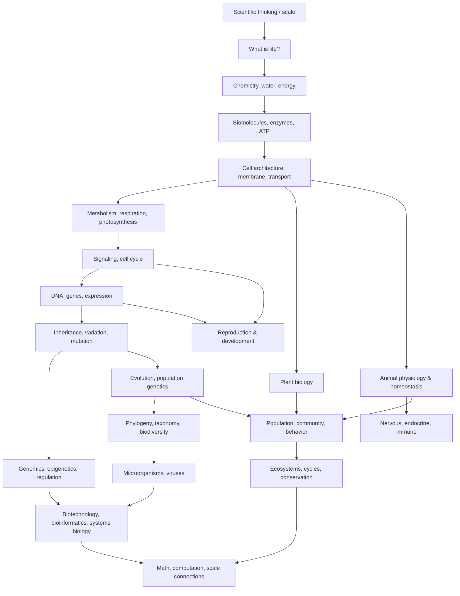

# Biology Knowledge Library — Thư viện kiến thức Sinh học

Sinh học (Biology / 생물학) nghiên cứu **sự sống như một hệ thống vật chất có tổ chức**: hệ này lấy và chuyển năng lượng, lưu/đọc thông tin, duy trì boundary, điều chỉnh trạng thái, sinh sản và thay đổi qua tiến hóa. Thư viện này được viết cho người có thể đã quên gần như toàn bộ Sinh học phổ thông; vì vậy các chapter không giả định người đọc đã nhớ Hóa học, DNA, tế bào hay các hệ cơ quan.

Đây không phải một Master Book khổng lồ và cũng không phải collection note rời. Mỗi file là một chapter có mental model riêng, nhưng chapter trước **tạo ra câu hỏi bắt buộc** dẫn sang chapter sau. Nếu đọc theo dependency, toàn thư viện trở thành một dòng reasoning từ atom tới biosphere.

> **Mental model trung tâm:** sự sống duy trì organization bằng ba dòng — **vật chất, năng lượng và thông tin**. Boundary tạo difference; difference tạo flow; feedback điều chỉnh flow; variation tạo possibility; selection/history định hình form qua thời gian.

---

## 1. Knowledge graph tổng thể



Sơ đồ này không biểu diễn difficulty level. Nó biểu diễn **dependency**: muốn hiểu proton gradient trong mitochondria thì cần membrane/ion gradient trước; muốn hiểu natural selection thì cần inheritance/variation; muốn hiểu development thì cần signaling + gene regulation; muốn hiểu ecosystem thì cần population/community interaction.

---

## 2. Cấu trúc thư viện

```text
biology/
├── README.md
├── 00_foundations/
│   ├── 00_scientific_thinking_scale_and_models.md
│   ├── 00_what_is_life.md
│   ├── 01_chemistry_energy_and_water.md
│   └── 02_biomolecules_enzymes_and_energy.md
│
├── 01_cell_biology/
│   ├── 00_cells_membranes_and_transport.md
│   ├── 01_metabolism_respiration_photosynthesis.md
│   └── 02_cell_signaling_and_cell_cycle.md
│
├── 02_genetics_molecular_biology/
│   ├── 00_dna_genes_and_gene_expression.md
│   ├── 01_inheritance_variation_and_mutation.md
│   └── 02_genomics_epigenetics_and_regulation.md
│
├── 03_evolution_and_diversity/
│   ├── 00_evolution_and_population_genetics.md
│   ├── 01_phylogeny_taxonomy_and_biodiversity.md
│   └── 02_microorganisms_and_viruses.md
│
├── 04_organismal_biology/
│   ├── 00_plant_biology.md
│   ├── 01_animal_physiology_and_homeostasis.md
│   ├── 02_nervous_endocrine_and_immune_systems.md
│   └── 03_reproduction_and_development.md
│
├── 05_ecology/
│   ├── 00_population_community_and_behavior.md
│   └── 01_ecosystems_biogeochemical_cycles_and_conservation.md
│
├── 06_biotechnology_computation/
│   └── 00_biotechnology_bioinformatics_and_systems_biology.md
│
├── 90_connections/
│   └── 00_biology_math_computation_and_scale.md
│
└── COVERAGE_AUDIT.md
```

---

## 3. Nếu bắt đầu từ số 0, hãy đọc theo tuyến này

### Chặng 1 — học cách nhìn một hệ sống

Bắt đầu với [`00_scientific_thinking_scale_and_models.md`](./00_foundations/00_scientific_thinking_scale_and_models.md). Chapter này dạy cách phân biệt observation với mechanism, model với reality, correlation với causation; đồng thời giới thiệu scale, structure–function, feedback, gradient, network và ba dòng matter–energy–information.

Sau đó đọc [`00_what_is_life.md`](./00_foundations/00_what_is_life.md). Câu hỏi lúc này không còn là “sinh vật có những bộ phận nào?”, mà là “một hệ vật chất phải có boundary, metabolism, information, regulation và heredity như thế nào để duy trì được trạng thái sống?”.

Kết thúc chặng này, bạn chưa biết chi tiết cell nhưng phải có mental model: **life là process được duy trì liên tục chứ không phải một danh sách chất**.

### Chặng 2 — giảm sự sống xuống chemistry rồi xây lại

[`01_chemistry_energy_and_water.md`](./00_foundations/01_chemistry_energy_and_water.md) xây atom, electron, bond, polarity, water, pH, redox, free energy, diffusion và equilibrium. Mỗi khái niệm đều được nối trực tiếp tới phenomenon Sinh học, ví dụ hydrophobic effect → membrane, pH → enzyme, electron transfer → respiration.

[`02_biomolecules_enzymes_and_energy.md`](./00_foundations/02_biomolecules_enzymes_and_energy.md) dùng nền đó để dựng carbohydrate, lipid, protein, nucleic acid, enzyme, ATP và electron carrier. Đây là nơi chemistry trở thành biochemistry.

Câu hỏi cuối chặng: **nếu đã có đầy đủ molecule, làm thế nào tổ chức chúng thành một unit sống?**

### Chặng 3 — cell như một system

[`00_cells_membranes_and_transport.md`](./01_cell_biology/00_cells_membranes_and_transport.md) xây cell từ boundary, selective permeability, diffusion, osmosis, active transport, electrochemical gradient, organelle và cytoskeleton.

[`01_metabolism_respiration_photosynthesis.md`](./01_cell_biology/01_metabolism_respiration_photosynthesis.md) dùng chính membrane/gradient vừa học để giải thích glycolysis, TCA, electron transport, chemiosmosis, ATP synthase và photosynthesis.

[`02_cell_signaling_and_cell_cycle.md`](./01_cell_biology/02_cell_signaling_and_cell_cycle.md) thêm control layer: receptor, kinase, second messenger, feedback, cell cycle, checkpoint, mitosis, meiosis và apoptosis.

Câu hỏi cuối chặng: **cell điều chỉnh protein nhanh được rồi; nhưng chương trình dài hạn được lưu và thay đổi ở đâu?**

### Chặng 4 — information và inheritance

[`00_dna_genes_and_gene_expression.md`](./02_genetics_molecular_biology/00_dna_genes_and_gene_expression.md) đi từ DNA structure tới replication, transcription, RNA processing, translation, protein targeting và gene regulation.

[`01_inheritance_variation_and_mutation.md`](./02_genetics_molecular_biology/01_inheritance_variation_and_mutation.md) nối meiosis với Mendel, probability, linkage, recombination, mutation, quantitative trait và gene–environment interaction.

[`02_genomics_epigenetics_and_regulation.md`](./02_genetics_molecular_biology/02_genomics_epigenetics_and_regulation.md) zoom ra genome scale: chromatin, enhancer, epigenetics, omics, GWAS, single-cell và regulatory network.

Câu hỏi cuối chặng: **nếu population chứa variation di truyền, distribution đó đổi qua generation như thế nào?**

### Chặng 5 — evolution và lịch sử của life

[`00_evolution_and_population_genetics.md`](./03_evolution_and_diversity/00_evolution_and_population_genetics.md) xây Hardy–Weinberg như null model rồi thêm selection, drift, mutation, gene flow, recombination, speciation và coevolution.

[`01_phylogeny_taxonomy_and_biodiversity.md`](./03_evolution_and_diversity/01_phylogeny_taxonomy_and_biodiversity.md) dùng branching history để học cách đọc phylogenetic tree, phân biệt homology/convergence và hiểu classification hiện đại.

[`02_microorganisms_and_viruses.md`](./03_evolution_and_diversity/02_microorganisms_and_viruses.md) dùng tất cả cell biology + genetics + evolution để hiểu bacteria, archaea, metabolism microbial, microbiome, antibiotic resistance, virus, phage và CRISPR.

### Chặng 6 — multicellular organism

[`00_plant_biology.md`](./04_organismal_biology/00_plant_biology.md) xem plant như hệ hydraulic–photosynthetic: root, xylem, phloem, stomata, water potential, hormone, growth và reproduction.

[`01_animal_physiology_and_homeostasis.md`](./04_organismal_biology/01_animal_physiology_and_homeostasis.md) xem animal body như network transport/control: circulation, respiration, digestion, kidney, acid–base, temperature và muscle.

[`02_nervous_endocrine_and_immune_systems.md`](./04_organismal_biology/02_nervous_endocrine_and_immune_systems.md) so sánh ba information system: nervous nhanh và wired, endocrine broadcast lâu dài, immune recognition + memory.

[`03_reproduction_and_development.md`](./04_organismal_biology/03_reproduction_and_development.md) giải thích một zygote tạo multicellular body qua cell fate, morphogen, gene regulatory network, tissue mechanics, stem cell và developmental constraint.

### Chặng 7 — organism bước vào ecological network

[`00_population_community_and_behavior.md`](./05_ecology/00_population_community_and_behavior.md) xây exponential/logistic growth, life history, behavior, niche, competition, predator–prey, cooperation và food web.

[`01_ecosystems_biogeochemical_cycles_and_conservation.md`](./05_ecology/01_ecosystems_biogeochemical_cycles_and_conservation.md) theo dõi energy flow, carbon/nitrogen/phosphorus/water cycle, disturbance, resilience, climate effect và conservation.

Đến đây scale đã đi từ nanomet tới biosphere.

### Chặng 8 — đo, sửa và mô hình hóa life

[`00_biotechnology_bioinformatics_and_systems_biology.md`](./06_biotechnology_computation/00_biotechnology_bioinformatics_and_systems_biology.md) xây PCR, electrophoresis, cloning, sequencing, alignment, assembly, RNA-seq, single-cell, CRISPR, synthetic biology, machine learning và systems biology.

[`00_biology_math_computation_and_scale.md`](./90_connections/00_biology_math_computation_and_scale.md) sau cùng gom lại các motif xuyên lĩnh vực: rate, logarithm, gradient, probability, feedback, graph, optimization, dynamics, stochasticity và algorithm.

---

## 4. Các “sợi chỉ” chạy xuyên toàn thư viện

### Gradient

Gradient xuất hiện ở diffusion → membrane potential → mitochondrial proton gradient → action potential → water potential ở plant → morphogen trong embryo → oxygen/nutrient gradient ở biofilm.

Đừng học các trường hợp này như sáu khái niệm tách biệt. Chúng là cùng một idea: **khác biệt theo không gian tạo khả năng flow hoặc encode positional information**.

### Feedback

Feedback xuất hiện ở enzyme pathway → signaling → cell cycle → endocrine → temperature/glucose control → population density → ecosystem resilience.

Một người hiểu negative/positive feedback ở cell có thể transfer mental model lên organism và ecosystem.

### Information

DNA sequence → RNA/protein → signaling → cell identity → development → inheritance → evolution → phylogeny → sequencing/bioinformatics.

Information luôn cần substrate vật lý, mechanism đọc và context.

### Energy

Redox → NADH → proton gradient → ATP → muscle/transport → organism metabolism → primary productivity → food web.

Energy không “cycle” giống matter; nó flow và dissipate dưới dạng heat.

### Variation và selection

Mutation/recombination → population selection; B/T-cell receptor diversity → clonal selection; tumor clone → somatic evolution; microbial variation → antibiotic selection.

Logic variation–filter–expansion xuất hiện lặp lại dù mechanism khác.

---

## 5. Keyword Việt — English — Korean

Thuật ngữ quan trọng ở lần xuất hiện đầu được ưu tiên theo format:

```text
Tên tiếng Việt (English term / 한국어 용어)
```

Ví dụ:

- Cân bằng nội môi (Homeostasis / 항상성)
- Khuếch tán (Diffusion / 확산)
- Chọn lọc tự nhiên (Natural selection / 자연선택)
- Biểu hiện gene (Gene expression / 유전자 발현)
- Quần thể (Population / 개체군)

Korean term được giữ vì chúng thường xuất hiện trong textbook đại học Hàn Quốc, bài báo khoa học phổ thông và technical/medical document tại Hàn.

---

## 6. Cách đọc công thức

Công thức trong library không được dùng như “công thức để thế số”. Mỗi equation cần được đọc bằng bốn câu hỏi:

1. variable đại diện cho đại lượng nào;
2. unit là gì;
3. relationship giả định điều gì;
4. khi assumption vỡ thì model sai ở đâu.

Ví dụ logistic equation không phải “law universal của mọi population”; Michaelis–Menten không mô tả mọi enzyme mechanism; Hardy–Weinberg là null model chứ không phải population thật lý tưởng.

---

## 7. Cách sử dụng connection với Toán và IT

Library không ép mọi topic phải liên hệ programming. Connection chỉ xuất hiện khi nó thực sự làm mental model tốt hơn.

Các connection quan trọng nhất gồm:

- logarithm ↔ pH;
- derivative ↔ rate of change;
- differential equation ↔ population/biochemical dynamics;
- probability ↔ inheritance, diagnostics, drift;
- graph ↔ metabolic network, food web, genome assembly;
- dynamic programming ↔ sequence alignment;
- control theory ↔ homeostasis;
- machine learning ↔ omics/image/sequence prediction;
- versioned/reproducible pipeline ↔ bioinformatics workflow.

---

## 8. Tiêu chuẩn nội dung hiện tại

Mỗi chapter hiện được viết theo nguyên tắc:

```text
câu hỏi / constraint
    ↓
mechanism nền
    ↓
structure hoặc model
    ↓
quantitative relationship nếu cần
    ↓
case study / real-world phenomenon
    ↓
misconception
    ↓
bridge sang chapter tiếp theo
```

Nội dung chính sử dụng paragraph liên tục. Bullet chỉ dùng khi bản chất thật sự là list. Các chapter cố tránh kiểu “Definition / Why / How / Application” lặp máy móc.

---

## 9. Thư viện này không cố trở thành giáo trình chuyên khoa

Core Biology cần xây mental model toàn lĩnh vực. Những domain sau đủ lớn để sau này có thể tách thành Knowledge Library riêng:

- Biochemistry/Structural Biology
- Neuroscience
- Immunology
- Microbiology/Virology
- Human Anatomy & Pathophysiology
- Bioinformatics/Computational Biology
- Plant Science
- Ecology & Earth Systems

Trong Biology core, các topic này được cover đến mức dependency và mechanism chung đủ vững để người đọc bước sang specialization mà không bị “mất nền”.

---

## 10. Sau khi đọc xong, người đọc nên nhìn Sinh học thế nào?

Không phải:

> “Tôi nhớ tế bào có ty thể, DNA có A-T-G-C, ecosystem có food chain.”

Mà là:

> “Tôi hiểu vì sao cell cần boundary và gradient; vì sao electron flow được chuyển thành ATP; vì sao gene chỉ có meaning trong regulatory context; vì sao variation ở individual scale trở thành evolution ở population scale; vì sao organism cần transport/control khi size tăng; và vì sao ecosystem phải được hiểu qua cả energy flow lẫn matter cycle.”

Đó là mục tiêu của Knowledge Library này: **knowledge graph thay vì collection of facts**.
