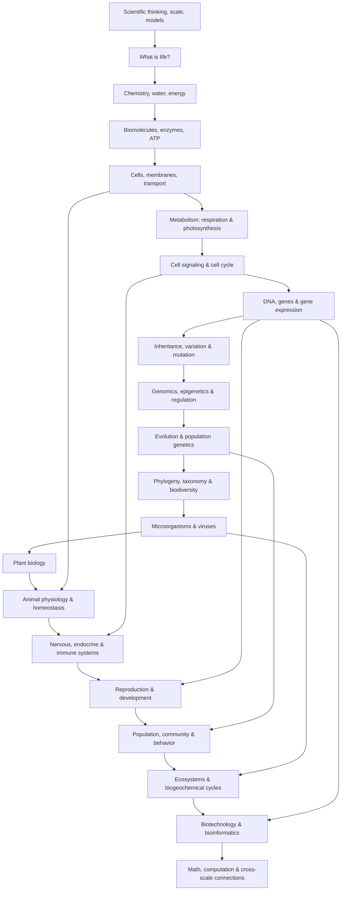

# Biology Knowledge Library — Thư viện kiến thức Sinh học

Sinh học (Biology / 생물학) thường bị học thành nhiều mảng tách rời: tế bào ở một chương, DNA ở chương khác, cơ thể người ở phần khác, rồi evolution và ecology dường như là một môn mới. Cấu trúc đó thuận tiện cho syllabus nhưng không thuận tiện cho việc **hiểu bản chất**.

Knowledge Library này được viết lại theo một dòng reasoning liên tục:

> **Vật chất có những property nào → các molecule tự tổ chức ra sao → cell tạo boundary và chuyển năng lượng thế nào → cell lưu và đọc information ra sao → information được truyền và biến đổi qua generation thế nào → multicellular organism phối hợp hàng tỷ cell ra sao → organism tương tác thành population/community/ecosystem thế nào → con người đo và can thiệp các hệ đó bằng biotechnology/computation ra sao.**

Mỗi file vẫn là một chapter độc lập đủ để đọc riêng, nhưng không còn được viết như một note đứng một mình. Đầu chapter nhắc lại vấn đề mà chapter trước để lại; cuối chapter đặt ra câu hỏi khiến chapter tiếp theo cần tồn tại.

## 1. Knowledge graph tổng thể



Các arrow phụ thể hiện một điều quan trọng: knowledge graph không hoàn toàn tuyến tính. Ví dụ physiology cần quay lại membrane transport và metabolism; development cần gene regulation; ecology cần evolution; biotechnology quay lại DNA chemistry và microbial defense.

## 2. Cấu trúc thư mục

```text
biology/
├── README.md
├── 00_foundations/
│   ├── 00_scientific_thinking_scale_and_models.md
│   ├── 00_what_is_life.md
│   ├── 01_chemistry_energy_and_water.md
│   └── 02_biomolecules_enzymes_and_energy.md
│
├── 01_cell_biology/
│   ├── 00_cells_membranes_and_transport.md
│   ├── 01_metabolism_respiration_photosynthesis.md
│   └── 02_cell_signaling_and_cell_cycle.md
│
├── 02_genetics_molecular_biology/
│   ├── 00_dna_genes_and_gene_expression.md
│   ├── 01_inheritance_variation_and_mutation.md
│   └── 02_genomics_epigenetics_and_regulation.md
│
├── 03_evolution_and_diversity/
│   ├── 00_evolution_and_population_genetics.md
│   ├── 01_phylogeny_taxonomy_and_biodiversity.md
│   └── 02_microorganisms_and_viruses.md
│
├── 04_organismal_biology/
│   ├── 00_plant_biology.md
│   ├── 01_animal_physiology_and_homeostasis.md
│   ├── 02_nervous_endocrine_and_immune_systems.md
│   └── 03_reproduction_and_development.md
│
├── 05_ecology/
│   ├── 00_population_community_and_behavior.md
│   └── 01_ecosystems_biogeochemical_cycles_and_conservation.md
│
├── 06_biotechnology_computation/
│   └── 00_biotechnology_bioinformatics_and_systems_biology.md
│
├── 90_connections/
│   └── 00_biology_math_computation_and_scale.md
│
└── COVERAGE_AUDIT.md
```

Prefix trong `00_foundations` giữ nguyên để không phá các link đã tồn tại, nhưng **thứ tự đọc chuẩn** là:

```text
00_scientific_thinking_scale_and_models
        ↓
00_what_is_life
        ↓
01_chemistry_energy_and_water
        ↓
02_biomolecules_enzymes_and_energy
```

## 3. Cách đọc từ số 0

Nếu bạn gần như không nhớ Sinh học ở trường, nên đọc theo tuyến dưới đây. Không cần tra cứu trước một textbook khác; những concept nền cần thiết được giải thích lại tại nơi chúng bắt đầu có ý nghĩa.

### Chặng 1 — Học cách nhìn một hệ sống

Bắt đầu ở [`00_scientific_thinking_scale_and_models.md`](./00_foundations/00_scientific_thinking_scale_and_models.md).

Chapter này chưa bắt bạn nhớ organelle hay DNA. Nó xây các pattern sẽ dùng suốt library: scale, causal reasoning, structure–function, feedback, gradient, flow of matter/energy/information và model.

Khi đã có framework đó, [`00_what_is_life.md`](./00_foundations/00_what_is_life.md) dùng nó để trả lời câu hỏi “life là gì?” thông qua boundary → metabolism → homeostasis → information → reproduction → evolution.

Câu hỏi chapter này để lại là: nếu life vẫn tuân physics/chemistry, các interaction molecular nào làm những process trên khả thi?

### Chặng 2 — Từ atom tới biomolecule

[`01_chemistry_energy_and_water.md`](./00_foundations/01_chemistry_energy_and_water.md) không phải một khóa Hóa học thu nhỏ. Nó chỉ xây chemistry cần để hiểu biology: bond, polarity, water, hydrophobic effect, diffusion, ion, pH, buffer, free energy, activation energy và redox.

Chapter đó cố tình dẫn thẳng tới [`02_biomolecules_enzymes_and_energy.md`](./00_foundations/02_biomolecules_enzymes_and_energy.md), nơi carbohydrate, lipid, protein, enzyme, ATP và nucleic acid được giải thích như lời giải cho các bài toán của hệ sống.

Sau hai chapter này, “membrane” không còn là fact phải nhớ: bạn đã biết vì sao amphipathic lipid trong water có thể tự tạo bilayer.

### Chặng 3 — Từ molecule tới cell

[`00_cells_membranes_and_transport.md`](./01_cell_biology/00_cells_membranes_and_transport.md) hỏi: trộn biomolecule lại chưa tạo life; vậy organization cần gì?

Từ đó xuất hiện boundary, selective permeability, diffusion, osmosis, electrochemical gradient, compartment, organelle, cytoskeleton và endosymbiosis.

Sau khi có architecture, [`01_metabolism_respiration_photosynthesis.md`](./01_cell_biology/01_metabolism_respiration_photosynthesis.md) cho energy chạy qua architecture đó: nutrient → electron carrier → electron transport → proton gradient → ATP; light → electron flow → ATP/NADPH → carbon fixation.

Metabolism cần regulation, nên chapter tự nhiên dẫn tới [`02_cell_signaling_and_cell_cycle.md`](./01_cell_biology/02_cell_signaling_and_cell_cycle.md), nơi receptor, kinase, second messenger, feedback, checkpoint, mitosis, meiosis và cancer được hiểu như control system của cell.

### Chặng 4 — Từ cell control tới genetic information

Cell response dài hạn thường cần đổi gene expression. Vì vậy [`00_dna_genes_and_gene_expression.md`](./02_genetics_molecular_biology/00_dna_genes_and_gene_expression.md) bắt đầu từ information problem rồi xây DNA structure → replication → transcription → RNA processing → translation → regulation.

[`01_inheritance_variation_and_mutation.md`](./02_genetics_molecular_biology/01_inheritance_variation_and_mutation.md) không tách Mendel khỏi molecular genetics; chromosome segregation trong meiosis được dùng để giải thích segregation probability, linkage, recombination và variation.

[`02_genomics_epigenetics_and_regulation.md`](./02_genetics_molecular_biology/02_genomics_epigenetics_and_regulation.md) sau đó mở rộng từ một gene sang genome, chromatin, transcriptome, omics và GWAS.

Chặng này kết thúc bằng allele frequency trong population — chính là điểm đầu của evolution.

### Chặng 5 — Từ inheritance tới evolution và diversity

[`00_evolution_and_population_genetics.md`](./03_evolution_and_diversity/00_evolution_and_population_genetics.md) xây evolution như change in allele frequency do selection, drift, mutation và gene flow. Hardy–Weinberg được dùng như null model chứ không phải công thức phải thuộc.

Divergence qua thời gian dẫn tới [`01_phylogeny_taxonomy_and_biodiversity.md`](./03_evolution_and_diversity/01_phylogeny_taxonomy_and_biodiversity.md): cách đọc tree, homology, clade, molecular phylogeny và biodiversity.

Sau đó [`02_microorganisms_and_viruses.md`](./03_evolution_and_diversity/02_microorganisms_and_viruses.md) là điểm hội tụ: metabolism, horizontal gene transfer, resistance evolution, microbiome, virus và CRISPR cùng xuất hiện trong một domain.

### Chặng 6 — Từ một cell tự trị tới cơ thể đa bào

[`00_plant_biology.md`](./04_organismal_biology/00_plant_biology.md) đặt câu hỏi: một organism cố định tại chỗ lấy resource từ đất và không khí rồi transport qua toàn cơ thể thế nào?

[`01_animal_physiology_and_homeostasis.md`](./04_organismal_biology/01_animal_physiology_and_homeostasis.md) chuyển sang animal: circulation, gas exchange, digestion, kidney, acid–base balance, thermoregulation và muscle được nối quanh một câu hỏi chung — làm sao giữ extracellular environment phù hợp cho cell?

[`02_nervous_endocrine_and_immune_systems.md`](./04_organismal_biology/02_nervous_endocrine_and_immune_systems.md) là control layer của whole organism: electrical signaling, hormone và immune recognition.

[`03_reproduction_and_development.md`](./04_organismal_biology/03_reproduction_and_development.md) cuối cùng giải thích cách một zygote dùng gene-regulatory network, morphogen, cell movement và apoptosis để tạo body plan.

### Chặng 7 — Từ organism tới ecosystem

[`00_population_community_and_behavior.md`](./05_ecology/00_population_community_and_behavior.md) chuyển từ một organism sang nhiều cá thể: exponential/logistic growth, life history, behavior, niche, competition, predator–prey và food web.

[`01_ecosystems_biogeochemical_cycles_and_conservation.md`](./05_ecology/01_ecosystems_biogeochemical_cycles_and_conservation.md) thêm abiotic environment để tạo ecosystem: productivity, trophic transfer, carbon/nitrogen/phosphorus cycle, disturbance, resilience, fragmentation, climate response và conservation.

Ở đây photosynthesis học ở chloroplast quay trở lại dưới tên primary productivity, còn microbial metabolism trở thành nitrogen/carbon cycle. Đây chính là mục tiêu cross-scale của library.

### Chặng 8 — Từ hiểu biết sang đo lường và can thiệp

[`00_biotechnology_bioinformatics_and_systems_biology.md`](./06_biotechnology_computation/00_biotechnology_bioinformatics_and_systems_biology.md) tái sử dụng những mechanism trước đó:

DNA replication → PCR.

Base pairing → sequencing/alignment.

Microbial defense → CRISPR.

Genome → bioinformatics data.

Regulatory network → systems biology.

### Chặng 9 — Nhìn lại các pattern xuyên toàn bộ Sinh học

Cuối cùng đọc [`00_biology_math_computation_and_scale.md`](./90_connections/00_biology_math_computation_and_scale.md).

File này không tóm tắt từng chapter. Nó chỉ ra rằng gradient, feedback, exponential growth, saturation, probability, Bayes, differential equation, network, information theory và optimization lặp lại từ molecular biology đến ecosystem.

## 4. Một ví dụ để thấy toàn library thực sự liên kết

Hãy lấy câu hỏi: **vì sao khi chạy nhanh ta thở gấp và tim đập nhanh?**

Ở molecular scale, actin–myosin tiêu thụ ATP.

Ở cell metabolism, ATP demand làm respiration tăng.

Ở chemistry, respiration tạo CO₂; CO₂ ảnh hưởng acid–base equilibrium.

Ở physiology, chemoreceptor nhận thay đổi CO₂/pH, nervous system tăng ventilation và heart output.

Ở circulation, oxygen delivery tăng tới muscle.

Ở thermoregulation, heat production tăng nên skin blood flow và sweating đổi.

Ở endocrine scale, fuel mobilization đổi.

Nếu luyện tập lâu dài, gene expression và tissue adaptation thay đổi.

Một hiện tượng đời thường đã đi qua chemistry → cell → signaling → physiology → gene regulation. Đó là cách library này muốn người đọc suy nghĩ.

## 5. Quy tắc thuật ngữ

Khi thuật ngữ quan trọng xuất hiện lần đầu trong chapter, format ưu tiên là:

```text
Tiếng Việt (English / 한국어)
```

Ví dụ:

`Cân bằng nội môi (Homeostasis / 항상성)`

`Khuếch tán (Diffusion / 확산)`

`Chọn lọc tự nhiên (Natural selection / 자연선택)`

English term được giữ vì phần lớn textbook, paper, software và documentation dùng tiếng Anh. Korean term được giữ để nhận diện khi học/làm việc tại Hàn Quốc.

## 6. Cách đọc một công thức trong library

Công thức không được dùng như thứ phải thuộc trước khi hiểu.

Khi gặp:

\[
\frac{dN}{dt}=rN
\]

hãy đọc bằng lời trước:

> Tốc độ thay đổi population tại một thời điểm tỷ lệ với population hiện có.

Sau đó mới hỏi assumption nào khiến relationship này hợp lý và khi nào nó thất bại.

Cách đọc tương tự được áp dụng cho pH, Michaelis–Menten, Hardy–Weinberg, cardiac output và logistic growth.

## 7. Mental model trung tâm của toàn library

Có thể nén toàn bộ Sinh học thành bốn câu:

> **Structure tạo constraint và khả năng.**
>
> **Gradient và reaction điều khiển dòng vật chất–năng lượng.**
>
> **Information và feedback điều khiển state.**
>
> **Variation + inheritance + selection làm các hệ thay đổi qua thời gian.**

Nếu giữ được bốn idea này, hàng nghìn fact riêng lẻ sẽ có chỗ để gắn vào.

## 8. Audit

Xem [`COVERAGE_AUDIT.md`](./COVERAGE_AUDIT.md) để kiểm tra không chỉ topic coverage mà cả **continuity audit**: chapter trước truyền dependency gì cho chapter sau, concept nào được reuse và phần chuyên sâu nào chủ động không mở rộng trong core library.