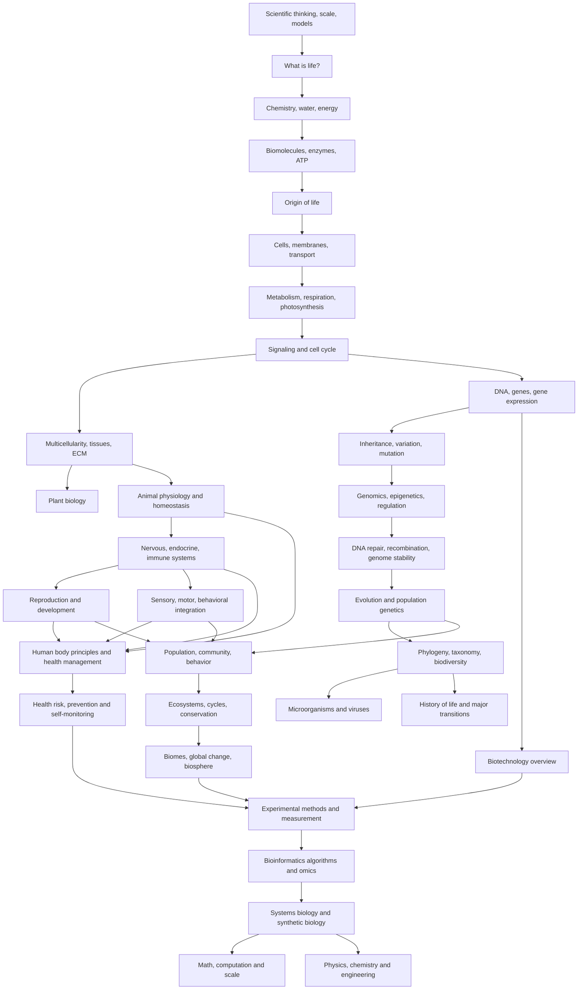

# Biology Knowledge Library — Thư viện kiến thức Sinh học

Sinh học (Biology / 생물학) trong thư viện này được viết như một **hệ thống kiến thức liên tục**, không phải tập hợp ghi chú (tập hợp ghi chú (collection note)) hay cheat sheet. Người đọc được giả định có thể đã quên phần lớn Sinh học phổ thông, vì vậy mỗi chapter phải tự dựng nền cần thiết, giải thích vì sao concept xuất hiện, mechanism hoạt động ra sao, model nào giúp suy luận và khái niệm (concept) đó dẫn tự nhiên sang chapter nào tiếp theo.

Mục tiêu cuối cùng không phải nhớ thật nhiều thuật ngữ. Mục tiêu là nhìn thấy một số pattern sâu lặp lại từ phân tử (molecule) đến biosphere: **dòng vật chất (matter flow), dòng năng lượng (energy flow), dòng thông tin (information flow), chênh lệch (gradient), phản hồi (feedback), trade-off, mạng lưới (network), selection và scale**.

> **Mô hình tư duy (mental model) trung tâm:** sự sống là một hệ vật chất xa cân bằng nhiệt động, duy trì organization nhờ dòng vật chất và năng lượng, dùng information để điều phối và truyền heredity, tự điều chỉnh bằng feedback, và thay đổi qua evolution dưới constraint của Physics, Chemistry và tính ngẫu nhiên lịch sử (historical contingency).

---

<!-- depth-audit-2026:central-chain -->
## Mental model trung tâm cho lần audit 2026-09

Toàn bộ thư viện được đọc theo chuỗi:

```text
matter
→ energy
→ information
→ regulation
→ adaptation
→ evolution
→ ecosystem
```

Đây không phải taxonomy chapter mà là causal spine. Vật chất tạo structure; năng lượng giữ gradient và reaction; information làm response có chọn lọc; regulation biến response thành feedback; adaptation đổi state hoặc trait dưới constraint; evolution giữ thay đổi heritable qua generation; ecosystem lại tạo dòng vật chất, năng lượng và selection pressure mới.

Khi audit một chapter, dùng template bắt buộc:

```text
structure
→ mechanism
→ regulation
→ function
→ failure
→ adaptation/evolution
```

Nếu chapter chỉ kể tên structure mà không giải mechanism, hoặc chỉ mô tả function mà không nói failure/boundary condition, chapter chưa đạt chuẩn dù có nhiều keyword.

## 1. Đồ thị kiến thức (knowledge graph) toàn thư viện



Graph này biểu diễn **dependency khái niệm**, không phải lịch học cứng. Nếu một chapter dùng concept đã được dựng ở chapter trước, nó sẽ link ngược lại thay vì giải thích lại từ đầu một cách rời rạc.

---

## 2. Cấu trúc thư viện

```text
biology/
├── README.md
├── COVERAGE_AUDIT.md
├── 00_foundations/
│   ├── 00_scientific_thinking_scale_and_models.md
│   ├── 00_what_is_life.md
│   ├── 01_chemistry_energy_and_water.md
│   ├── 02_biomolecules_enzymes_and_energy.md
│   └── 03_origin_of_life_and_early_evolution.md
├── 01_cell_biology/
│   ├── 00_cells_membranes_and_transport.md
│   ├── 01_metabolism_respiration_photosynthesis.md
│   ├── 02_cell_signaling_and_cell_cycle.md
│   └── 03_multicellularity_tissues_and_extracellular_matrix.md
├── 02_genetics_molecular_biology/
│   ├── 00_dna_genes_and_gene_expression.md
│   ├── 01_inheritance_variation_and_mutation.md
│   ├── 02_genomics_epigenetics_and_regulation.md
│   └── 03_dna_repair_recombination_and_genome_stability.md
├── 03_evolution_and_diversity/
│   ├── 00_evolution_and_population_genetics.md
│   ├── 01_phylogeny_taxonomy_and_biodiversity.md
│   ├── 02_microorganisms_and_viruses.md
│   └── 03_history_of_life_and_major_transitions.md
├── 04_organismal_biology/
│   ├── 00_plant_biology.md
│   ├── 01_animal_physiology_and_homeostasis.md
│   ├── 02_nervous_endocrine_and_immune_systems.md
│   ├── 03_reproduction_and_development.md
│   ├── 04_sensory_motor_and_behavioral_integration.md
│   ├── 05_human_body_principles_and_health_management.md
│   └── 06_health_risk_prevention_and_self_monitoring.md
├── 05_ecology/
│   ├── 00_population_community_and_behavior.md
│   ├── 01_ecosystems_biogeochemical_cycles_and_conservation.md
│   └── 02_biomes_global_change_and_biosphere.md
├── 06_biotechnology_computation/
│   ├── 00_biotechnology_bioinformatics_and_systems_biology.md
│   ├── 01_experimental_methods_and_measurement.md
│   ├── 02_bioinformatics_algorithms_and_omics_workflows.md
│   └── 03_systems_biology_modeling_and_synthetic_biology.md
└── 90_connections/
    ├── 00_biology_math_computation_and_scale.md
    └── 01_biology_physics_chemistry_and_engineering.md
```

---

## 3. Chuẩn hoàn thiện của một chapter

Một chapter không được coi là hoàn chỉnh chỉ vì “đã nhắc tới đủ keyword”. Chuẩn hiện tại của thư viện là:

```text
Problem / Constraint
→ First Principles
→ Components
→ Mechanism
→ Quantitative reasoning khi hữu ích
→ Case study / worked reasoning
→ Assumption & limitation
→ Common misconception
→ Cross-domain connection
→ Bridge sang chapter kế tiếp
```

Các equation không được đặt như formula để học thuộc. Mỗi equation cần giải thích variable là gì, relation nào được giả định, model bỏ qua điều gì và khi nào model không còn tốt.

Các tình huống phân tích (case study) không dùng chỉ để “trang trí”. Chúng phải ép người đọc nối nhiều concept cùng lúc. Ví dụ vận chuyển oxy (oxygen delivery) nối diffusion, liên kết (binding), circulation và dòng chảy (flow); hạn hán (drought) ở plant nối thế nước (water potential), VPD, stomata và suy thủy lực (hydraulic failure); tumor nối mutation, độ ổn định hệ gen (genome stability), hợp tác đa bào (multicellular cooperation), evolution và immune pressure; fatigue nối sleep, năng lượng (energy), dự trữ (reserve), medication và mental-health context.

---

## 4. Lộ trình đọc từ số 0

### Chặng A — Học cách suy nghĩ như một nhà Sinh học

Bắt đầu bằng `00_scientific_thinking_scale_and_models.md`. Chapter này thiết lập tư duy hệ thống (systems thinking), suy luận nhân quả (causal reasoning), mô hình (model), scale, emergence, cấu trúc (structure)–chức năng (function), phản hồi, vật chất (matter)–năng lượng–information và độ bất định (uncertainty).

Sau đó `00_what_is_life.md` chuyển từ cách tư duy sang câu hỏi “một hệ vật chất phải làm gì để được xem là sống?”. `01_chemistry_energy_and_water.md` cung cấp chemistry tối thiểu, rồi `02_biomolecules_enzymes_and_energy.md` giải thích polymer, enzym (enzyme), ATP và ghép năng lượng (energy coupling).

`03_origin_of_life_and_early_evolution.md` là cầu nối (bridge) đầy đủ từ chemistry sang cell: hóa học tiền sinh học (prebiotic chemistry), tiền tế bào (protocell), độ chính xác sao chép (replication fidelity), ngưỡng lỗi (error threshold), ghép năng lượng, đơn vị chọn lọc (unit of selection), genetic-code lock-in và tiến hóa sơ khai (early evolution).

### Chặng B — Cell như một system có ranh giới (boundary), energy và điều khiển (control)

`00_cells_membranes_and_transport.md` bắt đầu từ identity và selective exchange. `01_metabolism_respiration_photosynthesis.md` dùng redox, electron flow và thẩm thấu hóa học (chemiosmosis) để nối respiration với quang hợp (photosynthesis). `02_cell_signaling_and_cell_cycle.md` thêm sensing, feedback và decision về sinh trưởng (growth)/phân chia (division)/death.

`03_multicellularity_tissues_and_extracellular_matrix.md` giải thích diffusion limit, tính phân cực (polarity), kiến trúc mô (tissue architecture), ECM, mechanotransduction, vascularization, tạo hình (morphogenesis), regeneration và cancer như breakdown của hợp tác đa bào.

### Chặng C — Thông tin (information): lưu, đọc, truyền và bảo vệ

`00_dna_genes_and_gene_expression.md` xây dòng thông tin DNA → RNA → protein (protein). `01_inheritance_variation_and_mutation.md` chuyển sang chromosome, meiosis và di truyền (inheritance). `02_genomics_epigenetics_and_regulation.md` thay mô hình tư duy “một gene = một trait” bằng mạng lưới điều hòa (regulatory network).

`03_dna_repair_recombination_and_genome_stability.md` làm rõ độ chính xác sao chép, MMR/BER/NER, repair choice NHEJ–HR, căng thẳng sao chép (replication stress), telomere, transposon, mosaicism, p53, synthetic lethality và trade-off stability–evolvability.

### Chặng D — Evolution từ alen (allele) đến lịch sử sự sống

`00_evolution_and_population_genetics.md` theo dõi tần số alen (allele frequency) qua chọn lọc (selection), drift, mutation và dòng gen (gene flow). `01_phylogeny_taxonomy_and_biodiversity.md` đưa population change thành branching history. `02_microorganisms_and_viruses.md` cho thấy evolution chạy nhanh trong microbe/virus.

`03_history_of_life_and_major_transitions.md` mở rộng sang fossil lấy mẫu (sampling), định tuổi phóng xạ (radiometric dating), nội cộng sinh (endosymbiosis), energetic architecture, sex, multicellularity, Evo-Devo, gene duplication, convergence, neutral evolution, đồng hồ phân tử (molecular clock), tuyệt chủng hàng loạt (mass extinction) và bức xạ thích nghi (adaptive radiation).

### Chặng E — Organism như một hệ phối hợp nhiều subsystem

`00_plant_biology.md` hiện đọc plant như một **hydraulic–kinh tế carbon (carbon economy)** thay vì chỉ học root/thân (stem)/lá (leaf). Chapter nối thế nước, xylem cohesion–tension, sức cản thủy lực (hydraulic resistance)/cavitation, VPD, stomatal regulation, C3/C4/CAM, source–sink phloem, tương tác chéo hoóc-môn (hormone crosstalk), circadian/quang chu kỳ (photoperiod) điều khiển, hạt (seed)/hoa (flower) phát triển (development), miễn dịch thực vật (plant immunity), electrical/Ca²⁺ signaling và khí hậu (climate)-response trade-off.

`01_animal_physiology_and_homeostasis.md` hiện xây cơ thể động vật (animal body) như một network `flow + exchange + control`. Ngoài circulation, hô hấp (respiration), digestion và kidney, chương (chapter) đi sâu hàm lượng oxy (oxygen content)/delivery, hemoglobin affinity, thông khí (ventilation)–perfusion matching, compliance, Frank–Starling, axit–bazơ (acid–base) compensation, GFR, countercurrent concentration, ADH/RAAS/natriuretic counter-điều khiển, điều hòa thân nhiệt (thermoregulation), cơ học cơ (muscle mechanics), Fick principle trong exercise và logic physiological compensation/failure.

`02_nervous_endocrine_and_immune_systems.md` không còn chỉ là ba hệ riêng. Nervous phần đi từ Nernst/điện thế hoạt động (action potential) sang neural coding, trường tiếp nhận (receptive field), thích nghi (adaptation), baroreflex và plasticity. Endocrine phần thêm pulsatile secretion, thụ thể (receptor) adaptation và trạng thái (state)-điều khiển lôgic (logic). Immune phần đi từ barrier/innate tới trình diện kháng nguyên (antigen presentation), MHC, chọn lọc dòng tế bào (clonal selection), trưởng thành ái lực (affinity maturation), memory, tiêm chủng (vaccination), tolerance, allergy, resolution và chronic stimulation. Cuối chapter nối chúng thành một neuro–endocrine–immune network có circadian control.

`03_reproduction_and_development.md` hiện đi từ gametogenesis/fertilization tới maternal–zygotic transition, cleavage, gastrulation, morphogen/phản ứng–khuếch tán (reaction–diffusion), Hox, segmentation, EMT, cơ học mô (tissue mechanics), sự hình thành cơ quan (organogenesis), placenta, sexual development, puberty, postnatal brain development, giai đoạn tới hạn (critical period), developmental plasticity, tái sinh (regeneration), xơ hóa (fibrosis), aging và Evo-Devo. Phát triển (development) được trình bày như quá trình biến regulatory information thành geometry rồi thành physiological function.

`04_sensory_motor_and_behavioral_integration.md` nối receptor → coding → ước lượng trạng thái (state estimation) → lựa chọn hành động (action selection) → điều khiển vận động (motor control) → sai số dự đoán (prediction error) → learning → hành vi (behavior). Chapter dùng Bayesian intuition, reward-sai số dự đoán, huy động đơn vị vận động (motor-unit recruitment), lực–vận tốc (force–velocity), CPG và sinh thái học hành vi (behavioral ecology) để nối physiology với ecology.

`05_human_body_principles_and_health_management.md` chuyển physiology sang quản lý sức khỏe (health management). Chapter bắt đầu từ cân bằng nội môi (homeostasis), khả năng dự trữ (reserve capacity) và gánh nặng thích nghi (allostatic load) rồi nối sang cân bằng năng lượng (energy balance), dinh dưỡng (nutrition), hydration, điều hòa glucose (glucose regulation), muscle, thể lực tim phổi (cardiorespiratory fitness), giấc ngủ (sleep)/nhịp sinh học ngày đêm (circadian rhythm), căng thẳng (stress), miễn dịch (immunity), viêm (inflammation), liver/kidney, hệ vi sinh (microbiome), sức khỏe răng miệng (oral health), tobacco/alcohol, chất bổ sung (supplement), chăm sóc dự phòng (preventive care) và các chỉ số sức khỏe (health metrics). Phần cuối xây một **Health Operating System** theo dòng chảy `Foundation → Observe → Identify bottleneck → Controlled change → Reassess`.

`06_health_risk_prevention_and_self_monitoring.md` đi thêm một bước sang **khoa học ra quyết định về sức khỏe dự phòng (preventive-health decision science)**: triệu chứng (symptom)–sign–nguy cơ (risk)–bệnh (disease), absolute/nguy cơ tương đối (relative risk), cardiometabolic cluster, hội chứng chuyển hóa (metabolic syndrome), musculoskeletal load, khoa học thần kinh về đau (pain neuroscience), sensory health, giấc ngủ-disorder reasoning, đối chiếu danh sách thuốc (medication reconciliation), supplement cây quyết định (decision tree), wearable/HRV/SpO₂, tín hiệu (signal)-vs-nhiễu (noise), lab interpretation, sàng lọc (screening) sai lệch (bias), tiêm chủng, lão hóa (aging)/frailty và thử nghiệm N-of-1 an toàn (safe N-of-1 experimentation).

### Chặng F — Từ individual lên population, ecosystem và sinh quyển (biosphere)

`00_population_community_and_behavior.md` bắt đầu từ sinh trưởng model và interaction. `01_ecosystems_biogeochemical_cycles_and_conservation.md` theo dõi energy và vật chất qua bậc dinh dưỡng (trophic level) và chu trình dinh dưỡng (nutrient cycle).

`02_biomes_global_change_and_biosphere.md` mở rộng sang solar forcing, cân bằng nước (water balance), ocean mixing, carbon–khí hậu phản hồi, nitrogen microbial control, succession, hiện tượng trễ (hysteresis), biến đổi khí hậu (climate change), metapopulation, One Health và multi-stressor tình huống phân tích.

### Chặng G — Biology hiện đại được đo như thế nào?

`00_biotechnology_bioinformatics_and_systems_biology.md` giữ vai trò overview. Sau đó `01_experimental_methods_and_measurement.md` giải độ hợp lệ của cấu trúc đo lường (construct validity), điều khiển, ngẫu nhiên hóa (randomization), lần lặp (replicate), hiệu chuẩn (calibration), tín hiệu trên nhiễu (signal-to-noise), hiển vi (microscopy), PCR, đo tế bào dòng chảy (flow cytometry), giải trình tự (sequencing), quan hệ liều–đáp ứng (dose–response), hiệu ứng lô (batch effect), statistics và suy luận nhân quả.

Điểm quan trọng là **thiết bị đo (instrument) signal không phải biological truth trực tiếp**. Hai chapter Human Health dùng chính principle này để giải thích vì sao wearable, huyết áp (blood pressure), SpO₂, body-composition estimate và laboratory result phải được đọc theo bối cảnh (context), nhiễu, baseline và xác suất trước xét nghiệm (pre-test probability).

### Chặng H — Từ dữ liệu thô (raw data) đến inference và mô hình dự đoán (predictive model)

`02_bioinformatics_algorithms_and_omics_workflows.md` đi từ FASTQ/siêu dữ liệu (metadata)/QC sang alignment, BLAST, mapping uncertainty, gọi biến thể (variant calling), assembly, RNA-seq, single-tế bào (cell), epigenomics, multi-omics, network và ML.

`03_systems_biology_modeling_and_synthetic_biology.md` tiếp tục bằng ODE, trạng thái ổn định (steady state), phản hồi, tính lưỡng ổn (bistability), hiện tượng trễ, tính ngẫu nhiên (stochasticity), độ nhạy (sensitivity), identifiability, epistasis, FBA, mô hình đa quy mô (multi-scale model), mạch sinh học tổng hợp (synthetic circuit) và mô hình lai cơ chế–học máy (hybrid mechanistic–ML modeling).

### Chặng I — Synthesis xuyên môn

`90_connections/00_biology_math_computation_and_scale.md` nối probability, differential equation, graph và algorithm với Biology.

`01_biology_physics_chemistry_and_engineering.md` đi sâu vào phân tích thứ nguyên (dimensional analysis), khuếch tán (diffusion), electrochemistry, membrane capacitance, thermodynamics, thẩm thấu hóa học, liên kết, động lực học chất lưu (fluid dynamics), cơ học mô, lý thuyết điều khiển (control theory), phản ứng–khuếch tán, scaling, lý thuyết thông tin (information theory) và tính bền vững (robustness).

Hai chapter này không dùng để học tắt; chúng được đọc sau khi đã gặp concept trong domain để nhận ra những mathematical/physical motif tái xuất ở scale khác.

---

## 5. Các motif xuyên toàn thư viện

### Chênh lệch

Chênh lệch nồng độ (concentration gradient) → khuếch tán → plant thế nước → chênh lệch điện hóa (electrochemical gradient) → điện thế màng (membrane potential) → động lực proton (proton motive force) → chênh lệch morphogen (morphogen gradient) → physiological exchange → ecological resource gradient.

### Phản hồi

Enzyme inhibition → truyền tín hiệu (signaling) → chu kỳ tế bào (cell cycle) → stomatal/điều khiển nội tiết (endocrine control) → immune regulation → motor correction → human homeostasis → health monitoring/reassessment → mật độ quần thể (population density) dependence → khả năng phục hồi hệ sinh thái (ecosystem resilience) → systems-điều khiển model.

### Thông tin

DNA sequence → biểu hiện gen (gene expression) → chương trình phát triển (developmental program) → hoóc-môn (hormone)/thụ thể trạng thái (state) → neural code → hành vi → health measurement → clinical inference → tính di truyền (heredity) → population evolution → digital omics representation.

### Trade-off

Permeability vs control; thu nhận carbon (carbon gain) vs mất nước (water loss); hydraulic efficiency vs cavitation; fidelity vs evolvability; immune sensitivity vs autoimmunity; regeneration vs fibrosis/cancer; tập luyện (training) stress vs recovery; screening benefit vs overdiagnosis; tính bền vững vs energetic cost.

### Noise và độ bất định

Molecular tính ngẫu nhiên → developmental variation → sensory noise → biological variation → wearable/lab error → statistical uncertainty → độ bất định của mô hình (model uncertainty). Chương `06_health_risk_prevention_and_self_monitoring.md` biến motif này thành decision rule thực tế: verify → bối cảnh → xu hướng (trend) → concordant evidence → hành động (action).

### Scale

Atom → phân tử → macromolecule → tế bào → mô (tissue) → cơ quan (organ) → sinh vật (organism) → quỹ đạo sức khỏe (health trajectory) → quần thể (population) → quần xã (community) → hệ sinh thái (ecosystem) → sinh quyển. Mỗi lần tăng scale tạo đặc tính nổi trội (emergent property) nhưng vẫn chịu constraint của scale dưới.

### Mạng lưới

Chuyển hóa (metabolism), plant hydraulic/carbon allocation, tuần hoàn (circulation), neuroendocrine regulation, miễn dịch, phát triển, cardiometabolic risk, lưới thức ăn (food web) và omics đều cần tư duy node–interaction–feedback thay vì danh sách component.

---

## 6. Cách tự kiểm tra sau mỗi chapter

Sau khi đọc, đừng chỉ hỏi “tôi nhớ được bao nhiêu thuật ngữ?”. Hãy thử giải thích bằng lời của mình: chương đang giải constraint nào; đầu vào (input)/output của system là gì; vật chất, energy và thông tin đi đâu; feedback hoặc trade-off chính là gì; equation hoặc measurement nào đại diện cho relationship nào; và vì sao chapter này dẫn tự nhiên sang chapter kế tiếp.

Nếu bạn chỉ nhớ tên `ATP synthase`, `p53`, `Nernst`, `Hardy–Weinberg`, `HRV` hay `FDR` nhưng không giải thích được **vấn đề mà khái niệm đó giải quyết**, hãy quay lại mechanism và tình huống phân tích.

---

## 7. Phạm vi của library

Đây là **Biology core tổng quát**, không cố biến mỗi chuyên ngành thành một giáo trình đại học riêng. Neuroscience, Immunology, Biochemistry, Human Anatomy/Pathology, Microbiology, Bioinformatics chuyên sâu và Sinh học phát triển (developmental biology) vẫn có thể tách thành library riêng sau này.

Hai chapter Human Health cung cấp nền systems-level và preventive-health reasoning, nhưng không thay Human Anatomy, Pathology, Pharmacology hay guideline lâm sàng chuyên sâu. Chúng dạy cách suy luận an toàn về lifestyle, nguy cơ, phép đo (measurement), prevention và escalation — không dạy tự chẩn đoán (diagnosis)/điều trị (treatment).

---

## 8. Trạng thái hiện tại

Sau các deepening pass, thư viện đã chuyển từ collection chapter sang một **đồ thị kiến thức dạng textbook**. Các bridge quan trọng hiện đã được viết rõ:

```text
chemistry → origin of life → cell
cell → multicellularity → tissue → organism
plant water/carbon economy → organismal physiology
DNA → genome stability → population variation → evolution
evolution → major transitions → organism diversity
physiology → neuroendocrine/immune control → development/behavior
physiology → human health management → risk/prevention/self-monitoring
organism reproduction/behavior → ecology
ecosystem → biosphere → Earth-system feedback
experiment → raw data → bioinformatics → systems model → design
```

Chi tiết kiểm tra coverage và continuity nằm trong [Biology Knowledge Library](COVERAGE_AUDIT.md).

<!-- continuity-2026:language-links -->
## Quy ước ngôn ngữ và liên kết nội bộ

Phần giải thích dùng **tiếng Việt làm ngôn ngữ chính**. Thuật ngữ quốc tế được giữ trong ngoặc ở lần xuất hiện cần thiết, ví dụ `phản hồi âm (negative feedback)` hoặc `điện thế hoạt động (action potential)`. Không dùng từ tiếng Anh như thành phần ngữ pháp chính của câu nếu đã có cách diễn đạt tiếng Việt rõ ràng; các viết tắt chuẩn như DNA, RNA, ATP, PCR, CRISPR vẫn được giữ.

Link giữa chapter dùng Markdown link chuẩn thay cho wikilink riêng của Obsidian để hoạt động trên GitHub và GitHub Pages. Mỗi chapter trong learning path có footer điều hướng tới chapter trước, mục lục Biology và chapter kế tiếp. Vì vậy người đọc có thể đi liên tục từ phân tử → tế bào → cơ thể → quần thể → hệ sinh thái mà không phải quay lại cây thư mục.

