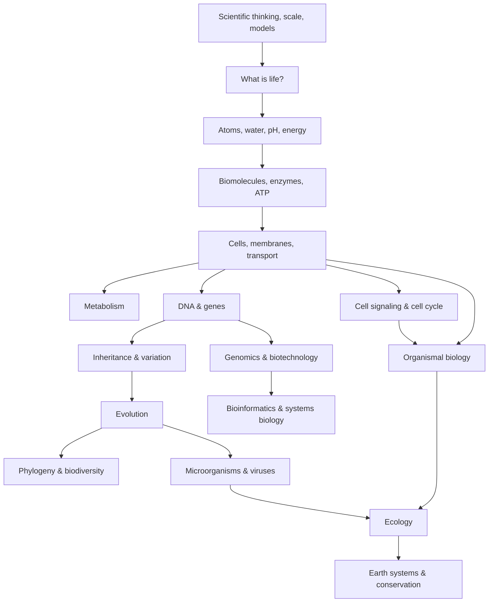

# Biology Knowledge Library — Thư viện kiến thức Sinh học

Thư viện này được viết cho người có thể đã quên gần như toàn bộ Sinh học ở trường, hoặc chưa từng có nền tảng chắc chắn. Vì vậy, tài liệu **không giả định người đọc đã biết cell, DNA, enzyme, metabolism hay genetics**. Mỗi khái niệm được xây từ vấn đề khiến nó cần tồn tại, sau đó mới đi đến terminology, mechanism, model và connection.

Sinh học (Biology / 생물학) ở đây được nhìn như khoa học nghiên cứu **các hệ sống duy trì tổ chức bằng dòng vật chất, năng lượng và thông tin, đồng thời thay đổi qua phát triển và tiến hóa**.

Không nên đọc library này như một dictionary. Luồng chính là một chuỗi causal dependency:



> **Mental model trung tâm:** một sinh vật không phải một collection các bộ phận. Nó là một hệ động, trong đó molecule tạo cell, cell phối hợp thành organism, organism tạo population, population tương tác thành ecosystem; ở mọi scale đều có matter flow, energy flow, information flow và feedback.

---

# Cấu trúc thư viện

```text
biology/
├── README.md
│
├── 00_foundations/
│   ├── 00_scientific_thinking_scale_and_models.md
│   ├── 00_what_is_life.md
│   ├── 01_chemistry_energy_and_water.md
│   └── 02_biomolecules_enzymes_and_energy.md
│
├── 01_cell_biology/
│   ├── 00_cells_membranes_and_transport.md
│   ├── 01_metabolism_respiration_photosynthesis.md
│   └── 02_cell_signaling_and_cell_cycle.md
│
├── 02_genetics_molecular_biology/
│   ├── 00_dna_genes_and_gene_expression.md
│   ├── 01_inheritance_variation_and_mutation.md
│   └── 02_genomics_epigenetics_and_regulation.md
│
├── 03_evolution_and_diversity/
│   ├── 00_evolution_and_population_genetics.md
│   ├── 01_phylogeny_taxonomy_and_biodiversity.md
│   └── 02_microorganisms_and_viruses.md
│
├── 04_organismal_biology/
│   ├── 00_plant_biology.md
│   ├── 01_animal_physiology_and_homeostasis.md
│   ├── 02_nervous_endocrine_and_immune_systems.md
│   └── 03_reproduction_and_development.md
│
├── 05_ecology/
│   ├── 00_population_community_and_behavior.md
│   └── 01_ecosystems_biogeochemical_cycles_and_conservation.md
│
├── 06_biotechnology_computation/
│   └── 00_biotechnology_bioinformatics_and_systems_biology.md
│
├── 90_connections/
│   └── 00_biology_math_computation_and_scale.md
│
└── COVERAGE_AUDIT.md
```

---

# Lộ trình khuyến nghị nếu bắt đầu từ số 0

## Chặng 1 — học cách “nhìn” Sinh học

Bắt đầu bằng [00_scientific_thinking_scale_and_models.md](./00_foundations/00_scientific_thinking_scale_and_models.md).

File này giải thích trước các mental model sẽ được dùng lặp lại: scale, structure–function, feedback, causal reasoning, probability, matter–energy–information flow. Nếu bỏ qua layer này, các chapter sau rất dễ biến thành học thuộc.

Sau đó đọc [00_what_is_life.md](./00_foundations/00_what_is_life.md) để hiểu vì sao boundary, metabolism, homeostasis, information, reproduction và evolution cùng tạo nên khái niệm life.

## Chặng 2 — xây “vật liệu” của sự sống

Đọc [01_chemistry_energy_and_water.md](./00_foundations/01_chemistry_energy_and_water.md). File này xây Hóa học vừa đủ từ atom, bond, polarity, water, diffusion, pH đến free energy và gradient.

Sau đó đọc [02_biomolecules_enzymes_and_energy.md](./00_foundations/02_biomolecules_enzymes_and_energy.md) để hiểu carbohydrate, lipid, protein, nucleic acid, enzyme và ATP.

Bạn chưa cần nhớ hàng chục molecule. Điều cần nắm là:

```text
chemical properties
→ molecular interaction
→ molecular structure
→ biological function
```

## Chặng 3 — từ molecule thành cell

Đọc lần lượt ba file trong `01_cell_biology/`.

File cell/membrane giải thích vì sao cell cần compartment và gradient. File metabolism theo dõi energy từ nutrient/light đến ATP. File signaling/cell-cycle giải thích cách cell nhận information và quyết định grow, divide, stop hoặc die.

Sau ba file này, bạn nên có thể nhìn một cell như một system chứ không còn như một hình có nhiều organelle cần thuộc tên.

## Chặng 4 — biological information

Đi qua `02_genetics_molecular_biology/` theo thứ tự.

DNA chapter trả lời information được lưu, copy và đọc thế nào. Inheritance chapter đưa information từ cell sang family và population qua meiosis. Genomics chapter giải thích vì sao cùng genome vẫn tạo cell khác nhau và computational genomics đọc variation thế nào.

Mental flow:

```text
DNA sequence
→ RNA/protein
→ cell behavior
→ phenotype
→ inheritance
→ variation
```

## Chặng 5 — từ variation đến toàn bộ cây sự sống

Đọc `03_evolution_and_diversity/`.

Evolution chapter dùng allele frequency để xây selection, drift và gene flow. Phylogeny chapter dạy cách đọc tree thay vì nghĩ evolution như ladder. Microorganism/virus chapter cho thấy các principle đó hoạt động cực rõ ở system có generation time ngắn.

Sau phần này, “evolution” không nên còn là một câu “sinh vật thích nghi theo thời gian”; bạn phải hiểu **population thay đổi bằng mechanism nào**.

## Chặng 6 — từ cell thành organism

`04_organismal_biology/` không phải anatomy atlas. Nó giải quyết bốn bài toán:

Plant biology: organism cố định khai thác water, light và carbon thế nào.

Animal physiology: organism lớn đưa oxygen/nutrient tới cell và giữ internal environment thế nào.

Nervous–endocrine–immune: whole body truyền signal, điều phối và defense thế nào.

Reproduction/development: một fertilized cell dùng signaling + gene regulation để tạo body plan thế nào.

## Chặng 7 — từ organism thành ecosystem

`05_ecology/` chuyển scale từ individual sang population, community và ecosystem.

Trước tiên học population growth, behavior, competition, predation và food web. Sau đó đi sang energy flow, carbon/nitrogen/phosphorus cycle, disturbance và conservation.

Ở đây rất quan trọng phải giữ distinction:

> **Matter cycles; energy flows.**

Atom được tái sử dụng. Usable energy liên tục bị degrade thành heat và ecosystem cần energy input mới.

## Chặng 8 — Biology gặp Computer Science

Sau khi đã có molecular genetics, đọc `06_biotechnology_computation/`.

PCR, sequencing, CRISPR và recombinant DNA được giải thích từ problem chúng giải quyết. Sau đó raw biological molecule được chuyển thành sequence/data, và các bài toán alignment, genome assembly, graph, statistics, machine learning xuất hiện tự nhiên.

Đọc tiếp `90_connections/` để nối Biology với calculus, probability, statistics, graph theory, dynamic systems, information theory và algorithms.

---

# Dependency map theo câu hỏi

Nếu bạn quên mình đang học để làm gì, dùng map sau.

| Câu hỏi | File nên đọc |
|---|---|
| “Sự sống khác vật không sống ở đâu?” | `00_foundations/00_what_is_life.md` |
| “Tại sao water, pH và ion quan trọng?” | `00_foundations/01_chemistry_energy_and_water.md` |
| “Protein, lipid, DNA và ATP thực sự làm gì?” | `00_foundations/02_biomolecules_enzymes_and_energy.md` |
| “Tại sao cell cần membrane?” | `01_cell_biology/00_cells_membranes_and_transport.md` |
| “Food/light biến thành ATP thế nào?” | `01_cell_biology/01_metabolism_respiration_photosynthesis.md` |
| “Cell biết lúc nào phải divide?” | `01_cell_biology/02_cell_signaling_and_cell_cycle.md` |
| “DNA trở thành protein thế nào?” | `02_genetics_molecular_biology/00_dna_genes_and_gene_expression.md` |
| “Vì sao con giống nhưng không giống hệt cha mẹ?” | `02_genetics_molecular_biology/01_inheritance_variation_and_mutation.md` |
| “Cùng DNA sao neuron khác liver cell?” | `02_genetics_molecular_biology/02_genomics_epigenetics_and_regulation.md` |
| “Natural selection thực sự làm gì?” | `03_evolution_and_diversity/00_evolution_and_population_genetics.md` |
| “Đọc cây tiến hóa như thế nào?” | `03_evolution_and_diversity/01_phylogeny_taxonomy_and_biodiversity.md` |
| “Bacteria và virus khác nhau ở đâu?” | `03_evolution_and_diversity/02_microorganisms_and_viruses.md` |
| “Nước lên ngọn cây bằng cách nào?” | `04_organismal_biology/00_plant_biology.md` |
| “Cơ thể giữ pH, nước, oxygen ổn định thế nào?” | `04_organismal_biology/01_animal_physiology_and_homeostasis.md` |
| “Neuron, hormone và immunity khác nhau thế nào?” | `04_organismal_biology/02_nervous_endocrine_and_immune_systems.md` |
| “Một cell thành một organism bằng cách nào?” | `04_organismal_biology/03_reproduction_and_development.md` |
| “Population và species interaction được model thế nào?” | `05_ecology/00_population_community_and_behavior.md` |
| “Carbon/Nitrogen đi đâu trong ecosystem?” | `05_ecology/01_ecosystems_biogeochemical_cycles_and_conservation.md` |
| “PCR, sequencing, CRISPR, bioinformatics dùng để làm gì?” | `06_biotechnology_computation/00_biotechnology_bioinformatics_and_systems_biology.md` |
| “Toán và CS xuất hiện ở Sinh học ở đâu?” | `90_connections/00_biology_math_computation_and_scale.md` |

---

# Quy tắc biên soạn của library

Mỗi chapter được viết theo các nguyên tắc sau.

Khái niệm mới không xuất hiện chỉ bằng một definition. Trước hết phải có phenomenon/problem dẫn đến nó.

Keyword lần đầu xuất hiện được ghi theo format `Tiếng Việt (English / 한국어)` khi phù hợp.

Formula phải được giải thích về variable, intuition và assumption. Formula không được đặt vào chỉ để thuộc.

Ví dụ phải làm sáng mental model, không chỉ thay số.

Các connection với Toán, IT, AI, engineering và đời sống chỉ xuất hiện khi chúng giúp reasoning.

Một file phải đủ self-contained để người đọc không cần liên tục nhảy file, nhưng concept lớn vẫn được link sang chapter chuyên sâu.

Các phần **Mental Model** nén cách suy nghĩ, không dùng để thay thế explanation.

Các phần **Common Misconceptions** giải thích tại sao cách hiểu sai nghe có vẻ hợp lý và sai ở đâu.

---

# Đọc library này như một knowledge graph

Có ba flow lặp lại xuyên toàn bộ Sinh học:

```text
Matter flow
Energy flow
Information flow
```

Có bốn pattern lặp lại:

```text
structure ↔ function
input → signal → response
variation → selection/filtering
feedback → regulation
```

Và có một câu hỏi luôn cần hỏi khi đổi chapter:

> **Scale hiện tại là molecule, cell, tissue, organism, population hay ecosystem?**

Nhiều confusion trong Sinh học xuất hiện chỉ vì một statement đúng ở scale này bị áp thẳng sang scale khác.

Nếu giữ được các pattern trên, library sẽ không còn là “20 file Sinh học”; nó trở thành một knowledge graph từ atom đến biosphere.