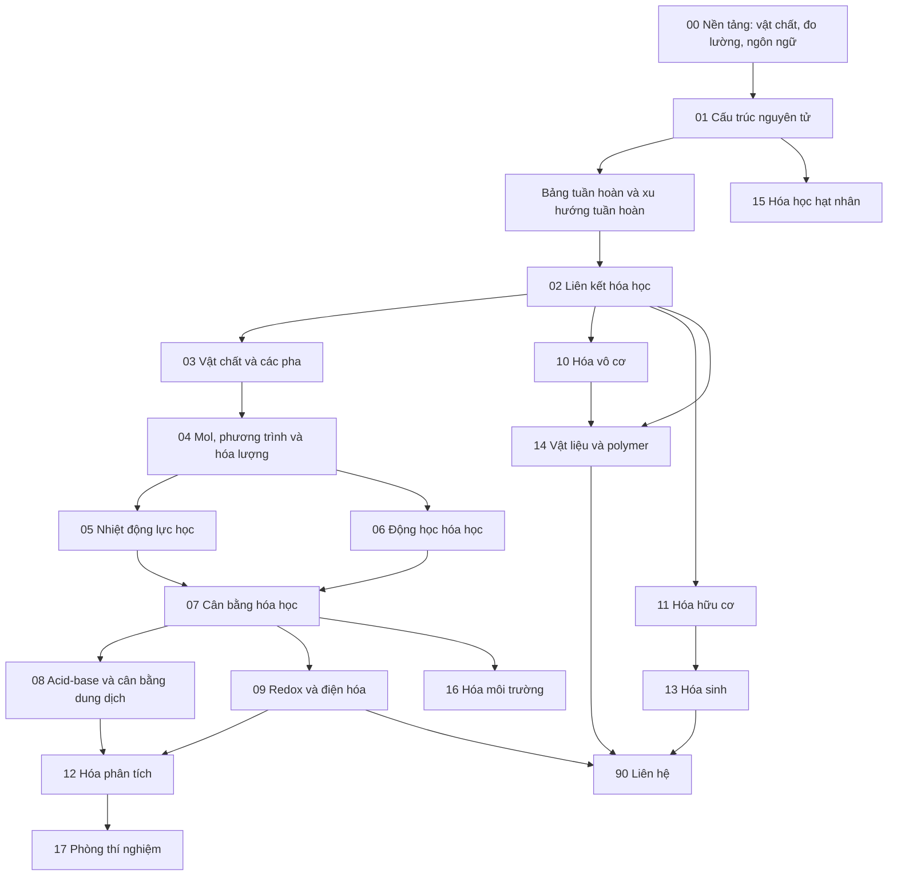

# Thư viện kiến thức Hóa học

> **Hóa học (Chemistry / 화학)** nghiên cứu vật chất từ cấu trúc nguyên tử–electron đến phân tử, pha, phản ứng, năng lượng, tốc độ và vật liệu. Thư viện này được viết như một hệ thống học lâu dài cho người có thể đã quên gần như toàn bộ Hóa học phổ thông; mục tiêu là xây lại mô hình tư duy từ bản chất thay vì học thuộc công thức rời rạc.

Đây không phải cheat sheet, bộ đề hay danh sách phản ứng phải nhớ. Mỗi chapter ưu tiên chuỗi:

```text
khái niệm là gì
→ vì sao cần khái niệm đó
→ cơ chế hoặc mô hình nền
→ công thức và cách suy luận
→ ví dụ
→ giả định / giới hạn / trade-off
→ liên hệ với kiến thức khác
```

## Trạng thái canonical

Chemistry Library hiện là nội dung canonical trên `main`. Các branch `feat/chemistry-*` chỉ còn giá trị lịch sử audit; không dùng tên branch để xác định source of truth hiện tại.

Không tạo một thư viện `chemistry` mới hoặc các file kiểu `_final`, `_updated`, `_v2` khi canonical file hiện tại có thể được cập nhật trực tiếp. Mọi thay đổi mới nên đi qua `main` và được ghi nhận trong `COVERAGE_AUDIT.md`.

## Dependency flow cốt lõi

Hóa học dễ bị học thành nhiều mảnh rời: nguyên tử, bảng tuần hoàn, mol, acid-base, pin... Thực tế chúng nối thành một chuỗi phụ thuộc khá chặt.



Đồ thị này là lộ trình mặc định, không phải thứ tự bắt buộc tuyệt đối. Một chapter chuyên ngành có thể quay lại prerequisite thông qua liên kết chéo.

## Cấu trúc canonical hiện tại

```text
chemistry/
├── README.md
├── COVERAGE_AUDIT.md
├── 00_foundations/
│   ├── 00_what_is_chemistry.md
│   ├── 01_matter_and_measurement.md
│   ├── 02_units_uncertainty_and_significant_figures.md
│   └── 03_chemical_language_and_models.md
├── 01_atomic_structure/
│   ├── 00_atoms_elements_and_isotopes.md
│   ├── 01_electromagnetic_radiation_and_quantization.md
│   ├── 02_quantum_model_of_atom.md
│   ├── 03_electron_configuration.md
│   └── 04_periodic_table_and_periodic_trends.md
├── 02_chemical_bonding/
│   ├── 00_why_atoms_bond.md
│   ├── 01_ionic_bonding.md
│   ├── 02_covalent_bonding.md
│   ├── 03_lewis_structures_and_resonance.md
│   ├── 04_vsepr_and_molecular_geometry.md
│   ├── 05_valence_bond_and_hybridization.md
│   ├── 06_molecular_orbital_theory.md
│   └── 07_intermolecular_forces.md
├── 03_matter_and_phases/
│   ├── 00_gases.md
│   ├── 01_liquids.md
│   ├── 02_solids.md
│   ├── 03_phase_changes_and_phase_diagrams.md
│   └── 04_solutions_and_solubility.md
├── 04_chemical_quantities/
│   ├── 00_mole_and_avogadro_constant.md
│   ├── 01_chemical_formulas.md
│   ├── 02_chemical_equations.md
│   ├── 03_stoichiometry.md
│   ├── 04_limiting_reagent_and_yield.md
│   ├── 05_solution_concentration.md
│   └── 06_stoichiometric_matrices_and_reaction_networks.md
├── 05_thermodynamics/
│   ├── 00_energy_heat_and_work.md
│   ├── 01_enthalpy_and_thermochemistry.md
│   ├── 02_entropy.md
│   ├── 03_gibbs_free_energy.md
│   └── 04_chemical_thermodynamics.md
├── 06_chemical_kinetics/
│   ├── 00_reaction_rates.md
│   ├── 01_rate_laws.md
│   ├── 02_reaction_mechanisms.md
│   ├── 03_activation_energy_and_arrhenius.md
│   └── 04_catalysis.md
├── 07_chemical_equilibrium/
│   ├── 00_dynamic_equilibrium.md
│   ├── 01_equilibrium_constant.md
│   ├── 02_reaction_quotient.md
│   ├── 03_le_chatelier_principle.md
│   └── 04_thermodynamics_of_equilibrium.md
├── 08_acids_bases/
│   ├── 00_acid_base_models.md
│   ├── 01_ph_and_acid_strength.md
│   ├── 02_weak_acids_and_bases.md
│   ├── 03_buffers.md
│   ├── 04_titration.md
│   └── 05_solubility_equilibria.md
├── 09_redox_and_electrochemistry/
│   ├── 00_oxidation_and_reduction.md
│   ├── 01_balancing_redox_reactions.md
│   ├── 02_galvanic_cells.md
│   ├── 03_cell_potential_and_nernst_equation.md
│   ├── 04_electrolysis.md
│   ├── 05_batteries_corrosion_and_energy_storage.md
│   └── 06_electrochemical_kinetics_and_impedance.md
├── 10_inorganic_chemistry/
│   ├── 00_inorganic_compounds.md
│   ├── 01_main_group_chemistry.md
│   ├── 02_transition_metals.md
│   ├── 03_coordination_chemistry.md
│   ├── 04_crystal_field_and_ligand_field.md
│   └── 05_solid_state_and_defect_chemistry.md
├── 11_organic_chemistry/
│   ├── 00_carbon_and_organic_structures.md
│   ├── 01_functional_groups.md
│   ├── 02_isomerism_and_stereochemistry.md
│   ├── 03_organic_reaction_mechanisms.md
│   ├── 04_alkanes_alkenes_and_alkynes.md
│   ├── 05_aromatic_chemistry.md
│   ├── 06_alcohols_ethers_and_amines.md
│   ├── 07_carbonyl_chemistry.md
│   └── 08_carboxylic_acids_and_derivatives.md
├── 12_analytical_chemistry/
│   ├── 00_measurement_and_sampling.md
│   ├── 01_volumetric_analysis.md
│   ├── 02_gravimetric_analysis.md
│   ├── 03_spectroscopy.md
│   ├── 04_chromatography.md
│   ├── 05_mass_spectrometry.md
│   ├── 06_electroanalytical_methods.md
│   └── 07_method_validation_and_chemometrics.md
├── 13_biochemistry/
│   ├── 00_chemistry_of_life.md
│   ├── 01_amino_acids_and_proteins.md
│   ├── 02_carbohydrates.md
│   ├── 03_lipids_and_membranes.md
│   ├── 04_nucleic_acids.md
│   ├── 05_enzymes.md
│   └── 06_metabolism_and_bioenergetics.md
├── 14_materials_and_polymer_chemistry/
│   ├── 00_materials_from_chemical_bonding.md
│   ├── 01_metals_ceramics_and_glasses.md
│   ├── 02_polymers.md
│   ├── 03_semiconductors.md
│   ├── 04_nanomaterials.md
│   └── 05_surface_and_interface_chemistry.md
├── 15_nuclear_chemistry/
│   ├── 00_atomic_nucleus.md
│   ├── 01_radioactivity.md
│   ├── 02_nuclear_reactions.md
│   ├── 03_fission_and_fusion.md
│   └── 04_radiochemistry_and_applications.md
├── 16_environmental_chemistry/
│   ├── 00_atmospheric_chemistry.md
│   ├── 01_water_chemistry.md
│   ├── 02_soil_chemistry.md
│   ├── 03_pollutants_and_toxic_chemistry.md
│   └── 04_green_chemistry.md
├── 17_laboratory/
│   ├── 00_lab_safety.md
│   ├── 01_glassware_and_instruments.md
│   ├── 02_solution_preparation.md
│   ├── 03_separation_and_purification.md
│   ├── 04_experimental_design.md
│   └── 05_error_uncertainty_and_data_analysis.md
└── 90_connections/
    ├── chemistry_and_physics.md
    ├── chemistry_and_mathematics.md
    ├── chemistry_and_biology.md
    ├── chemistry_and_material_science.md
    ├── chemistry_and_electronics.md
    ├── chemistry_and_computer_science.md
    ├── chemistry_and_ai.md
    └── chemistry_in_everyday_life.md
```

Không tạo chapter mới chỉ để làm cây thư mục lớn hơn. Một file mới chỉ hợp lý khi có ranh giới khái niệm đủ lớn và không thể tích hợp sạch vào canonical file hiện tại.

## Quy tắc ngôn ngữ

**Tiếng Việt là ngôn ngữ giải thích chính.** Thuật ngữ tiếng Anh dùng như từ khóa tra cứu trong ngoặc khi có giá trị, ví dụ:

- thế hóa học (**chemical potential**);
- năng lượng hoạt hóa (**activation energy**);
- hệ số hoạt độ (**activity coefficient**);
- khuyết nút (**vacancy**);
- mức Fermi (**Fermi level**).

Không viết kiểu:

> Reaction rate depends on activation barrier và molecular orientation.

Nên viết:

> Tốc độ phản ứng phụ thuộc vào hàng rào hoạt hóa (**activation barrier**) và định hướng tương đối của phân tử.

Các ký hiệu và tên chuẩn quốc tế như `pH`, `pKa`, `Ka`, `ΔG`, `VSEPR`, `DFT`, `NMR`, `HPLC`, `HOMO`, `LUMO` được giữ nguyên khi dịch sẽ làm giảm khả năng tra cứu.

Thuật ngữ tiếng Hàn chỉ là lớp bổ sung khi hữu ích cho học tập hoặc công việc tại Hàn Quốc; phần giải thích chính vẫn phải là tiếng Việt.

## Ba tầng mô tả luôn phải nối với nhau

Một chapter Hóa học tốt cần phân biệt:

**Cấp vĩ mô:** điều đo hoặc quan sát được như màu, áp suất, nhiệt độ, khối lượng, dòng điện, kết tủa.

**Cấp hạt:** nguyên tử, ion, phân tử, electron, orbital và tương tác đang xảy ra.

**Cấp ký hiệu:** công thức, phương trình, đồ thị và mô hình toán học.

Ví dụ NaCl tan trong nước:

```text
vĩ mô: tinh thể biến mất
hạt: Na+ và Cl− bị hydrat hóa và phân tán
ký hiệu: NaCl(s) → Na+(aq) + Cl−(aq)
```

Nếu một file chỉ có công thức mà không nối được về hiện tượng và cơ chế hạt, file đó chưa đạt chuẩn của library.

## Chuẩn về độ sâu

Một chapter được xem là đủ mạnh khi người đọc có thể trả lời:

1. Khái niệm này là gì?
2. Vì sao cần nó?
3. Cơ chế hoặc mô hình nền hoạt động thế nào?
4. Công thức xuất hiện từ đâu?
5. Khi nào mô hình dùng được?
6. Khi nào mô hình sai hoặc cần mô hình tốt hơn?
7. Có ví dụ định tính hoặc định lượng nào cho thấy cách suy luận?
8. Nó nối sang chapter khác bằng quan hệ nhân quả nào?

Độ dài file chỉ là tín hiệu audit, không phải tiêu chuẩn chất lượng. Một chapter phạm vi hẹp có thể ngắn mà vẫn hoàn chỉnh; một chapter phạm vi lớn nhưng chỉ vài đoạn thường cần đào sâu.

## Lộ trình cho người học lại từ gần số 0

Nên đọc theo các chặng:

```text
Chặng 1
00 Foundations
→ 01 Atomic Structure
→ 02 Chemical Bonding

Chặng 2
03 Matter and Phases
→ 04 Chemical Quantities

Chặng 3
05 Thermodynamics
→ 06 Kinetics
→ 07 Equilibrium

Chặng 4
08 Acid–Base
→ 09 Redox / Electrochemistry

Chặng 5
10 Inorganic
→ 11 Organic
→ 12 Analytical

Chặng 6
13 Biochemistry
→ 14 Materials
→ 15 Nuclear
→ 16 Environmental
→ 17 Laboratory

Chặng 7
90 Connections
```

Người đọc không cần nhớ toàn bộ trước khi đi tiếp. Mục tiêu là giữ được mental model, biết prerequisite ở đâu và có thể quay lại bằng internal link.

## Các liên hệ liên ngành được ưu tiên

### Vật lý

Quantum mechanics giải thích orbital và cấu trúc electron; electromagnetism giải thích tương tác điện tích; statistical mechanics nối vi trạng thái với entropy; solid-state physics nối orbital với band structure.

### Sinh học

Acid–base, redox, liên kết hydro, hiệu ứng kỵ nước, enzyme kinetics và Gibbs coupling tạo nền cho protein, màng, ATP và metabolism.

### Vật liệu và điện tử

Liên kết → cấu trúc tinh thể → khuyết tật → band structure → tính cơ, nhiệt, điện. Semiconductor fabrication, CVD/ALD, doping và interface chemistry đều nằm trên chuỗi này.

### Năng lượng và pin

Redox + Nernst + kinetics + mass transport + material stability quyết định điện áp, công suất, dung lượng, tuổi thọ và an toàn của cell.

### Đời sống

Nấu ăn, làm sạch, bảo quản thực phẩm, gỉ sắt, thuốc, nhựa và pin được giải thích bằng cùng các cơ chế nền, không tách thành danh sách mẹo.

## Bắt đầu học

Bắt đầu từ [Hóa học nghiên cứu điều gì?](./00_foundations/00_what_is_chemistry.md), tiếp theo [Vật chất và phép đo](./00_foundations/01_matter_and_measurement.md), rồi đi theo dependency flow ở đầu file.

Trạng thái chi tiết của từng domain và các pass còn cần làm được theo dõi trong [COVERAGE_AUDIT.md](./COVERAGE_AUDIT.md).
