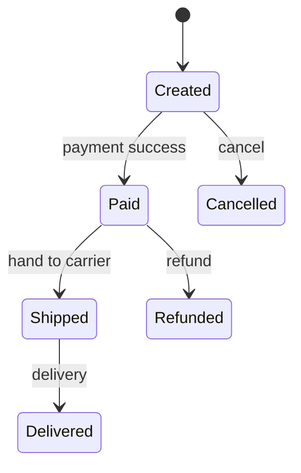

# Logic, state, abstraction và invariants

Rất nhiều vấn đề trong Computer Science trở nên dễ reasoning hơn khi tách bốn ý tưởng: **logic** mô tả điều kiện nào đúng; **state** mô tả hệ hiện đang ở đâu; **transition** mô tả phép biến đổi state; **invariant** mô tả điều phải luôn đúng qua các transitions. Abstraction đặt boundary để ta không phải nhìn mọi chi tiết cùng lúc.

## Boolean logic là ngôn ngữ của điều kiện

Boolean value chỉ có `true`/`false`. Các phép cơ bản AND, OR, NOT tạo expressions phức tạp. Ở digital hardware chúng có thể được hiện thực bằng logic gates; ở programming chúng xuất hiện trong conditions; ở database trong predicates; ở security trong policy decisions.

Một implication `P → Q` chỉ sai khi `P` đúng và `Q` sai. Điều này quan trọng khi reasoning specification: “nếu user là admin thì được access” không đồng nghĩa “chỉ admin mới được access”. Muốn điều kiện hai chiều cần equivalence hoặc thêm chiều ngược.

De Morgan's laws:

\[
\neg(P \land Q) \equiv (\neg P) \lor (\neg Q)
\]

\[
\neg(P \lor Q) \equiv (\neg P) \land (\neg Q)
\]

Các luật này không chỉ dùng trong bài logic. Chúng giúp refactor condition, xây query predicate, firewall rule và circuit.

Xem nền toán chi tiết tại [Logic & Proof](../../mathematics/00_foundations/01_logic_and_proof.md) và [Boolean Algebra](../../mathematics/07_discrete_cs/03_boolean_algebra_and_digital_logic.md).

## State: những gì quá khứ để lại cho hiện tại

Một system là stateless nếu output hiện tại phụ thuộc chỉ vào input hiện tại; stateful nếu history được nén thành state hiện tại. Một counter giữ state là số đếm. TCP connection giữ sequence numbers, windows và congestion state. Database giữ persistent state. UI form giữ text và validation state.

State không miễn phí. Khi nhiều execution contexts cùng thay đổi state, concurrency problems xuất hiện. Khi state nằm trên nhiều machines, replication/consistency problems xuất hiện. Khi state cần tồn tại sau crash, durability/recovery xuất hiện.

Đây là một connection quan trọng: **nhiều complexity trong systems đến từ việc quản lý state dưới concurrency, failure và distribution**.

## State machine: model hóa behavior bằng trạng thái và chuyển tiếp

Finite State Machine — FSM (유한 상태 기계 / máy trạng thái hữu hạn) gồm một tập states hữu hạn, inputs/events và transition function. Ví dụ order có thể là:

Model này buộc ta hỏi những transition nào hợp lệ. `Delivered -> Created` có lẽ không hợp lệ. Nếu code chỉ có một field status nhưng không enforce transition rules, business invariant dễ bị phá.

Protocol, parser, workflow, compiler lexer, device controller và UI đều thường được model hóa bằng state machine.

## Invariant: property phải sống sót qua transitions

Invariant (불변식 / bất biến) là điều được yêu cầu luôn đúng ở các điểm xác định. Ví dụ binary search có invariant rằng nếu target tồn tại thì nó nằm trong search interval hiện tại. Bank system có invariant tổng debit/credit của một journal entry cân bằng. Acyclic tree có invariant không có cycle. Mutex-protected critical section có invariant tại một thời điểm chỉ holder sở hữu lock truy cập protected state.

Cách chứng minh bằng invariant thường gồm ba ý: invariant đúng ban đầu; mỗi transition bảo toàn invariant; khi kết thúc, invariant cùng termination condition suy ra postcondition.

Đây là bridge giữa mathematical induction và software correctness.

## Abstraction và interface contracts

Abstraction (추상화) không chỉ là “ẩn code”. Một abstraction định nghĩa **observables**: consumer được phép dựa vào behavior nào, và implementation được tự do thay đổi gì.

Stack abstraction hứa operations như `push`, `pop`, `peek` với LIFO semantics. Consumer không cần biết implementation dùng dynamic array hay linked list. Nhưng nếu complexity contract cũng quan trọng, implementation choice có thể trở thành observable ở performance layer.

API contract có thể bao gồm input domain, output, errors, ordering, thread-safety, latency expectations và idempotency. Một interface chỉ liệt kê method signatures là chưa đủ để hiểu semantic contract.

## Representation invariant

Data structure thường có internal rules không được lộ ra ngoài nhưng phải luôn đúng. Với binary search tree, các keys bên trái node nhỏ hơn theo ordering rule; bên phải lớn hơn. Với hash table, mỗi occupied entry phải nằm ở bucket reachable từ hash/probing rule. Với filesystem, free-space metadata phải khớp blocks đang được dùng.

Representation invariant cho phép các methods reasoning cục bộ. Nếu mỗi public operation nhận structure hợp lệ và trả lại structure hợp lệ, toàn module có thể duy trì property qua thời gian.

## Precondition và postcondition

Precondition là điều caller phải đảm bảo trước operation; postcondition là điều implementation hứa sau operation nếu precondition đúng. Ví dụ `sqrt(x)` trên một API real-only có thể yêu cầu `x >= 0`. Sorting function hứa output là permutation của input và nondecreasing.

Design by Contract biến assumptions ẩn thành contracts explicit. Type systems, assertions, database constraints và static analysis đều là các cách khác nhau để encode một phần contracts.

## Mental Model

> Khi một system phức tạp, hãy vẽ nó như **State + Allowed Transitions + Invariants + Boundary**. Bug thường là transition không được kiểm soát, invariant không được encode, hoặc boundary khiến caller dựa vào assumption mà implementation không hứa.

## Common Misconceptions

**“Stateless nghĩa là không có dữ liệu.”** Stateless component có thể xử lý rất nhiều data; điểm chính là request sau không cần mutable session state được giữ bên trong instance đó.

**“Abstraction càng cao càng tốt.”** Abstraction có giá trị khi contract ổn định và che đúng complexity. Abstraction sai có thể che mất failure modes quan trọng hoặc thêm indirection không cần thiết.

**“Invariant là condition chỉ kiểm tra ở cuối.”** Invariant hữu ích chính vì nó được bảo toàn xuyên quá trình, giúp reasoning từng bước.

## Kết nối

Các ý tưởng này xuất hiện lại trong [algorithm correctness](../01_algorithms_data_structures/00_algorithmic_thinking_and_correctness.md), [digital circuits](../02_computer_architecture/00_digital_logic_and_circuits.md), [concurrency](../03_operating_systems/02_concurrency_synchronization_and_deadlock.md), [database transactions](../05_data_databases/02_transactions_acid_and_concurrency_control.md), [distributed consistency](../06_networks_distributed_systems/04_distributed_systems_time_failure_and_consistency.md) và [API contracts](../08_software_systems/00_abstraction_modularity_interfaces_and_apis.md).
