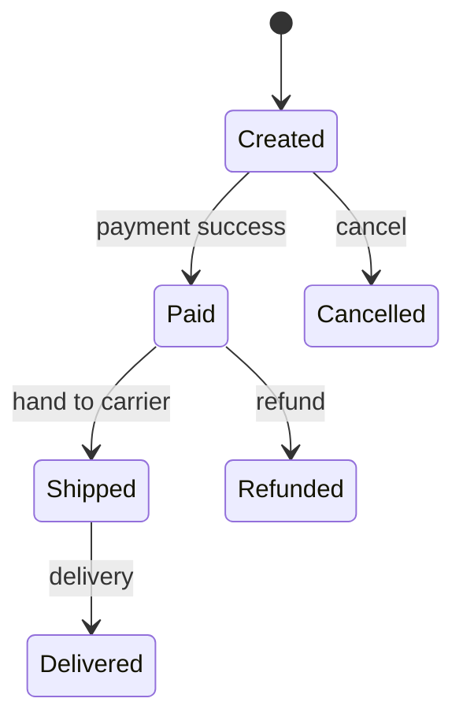

# Lô-gic (logic / 논리), trạng thái (state / 상태), lớp trừu tượng (abstraction / 추상화) và invariants

> **Mạch đọc:** [README](./README.md) là bản đồ owner của **Lô-gic (logic / 논리), trạng thái (state / 상태), lớp trừu tượng (abstraction / 추상화) và invariants**. Route đi từ điều kiện Boolean → state transition và abstraction → invariant/loop reasoning → kiểm chứng chương trình và hệ thống, để correctness được giữ khi chi tiết triển khai thay đổi.

Rất nhiều vấn đề trong Khoa học máy tính (computer science / 컴퓨터 과학) trở nên dễ lập luận (reasoning / 추론) hơn khi tách bốn ý tưởng: **lô-gic (logic / 논리)** mô tả điều kiện nào đúng; **trạng thái (state / 상태)** mô tả hệ hiện đang ở đâu; **chuyển tiếp (transition / 전이)** mô tả phép biến đổi trạng thái (state / 상태); **bất biến (invariant / 불변식)** mô tả điều phải luôn đúng qua các transitions. lớp trừu tượng (abstraction / 추상화) đặt ranh giới (boundary / 경계) để ta không phải nhìn mọi chi tiết cùng lúc.

## Boolean lô-gic (logic / 논리) là ngôn ngữ của điều kiện

Boolean giá trị (value / 값) chỉ có `true`/`false`. Các phép cơ bản AND, OR, NOT tạo expressions phức tạp. Ở digital hardware chúng có thể được hiện thực bằng lô-gic (logic / 논리) gates; ở programming chúng xuất hiện trong conditions; ở cơ sở dữ liệu (database / 데이터베이스) trong predicates; ở bảo mật (security / 보안) trong chính sách (policy / 정책) decisions.

Một implication `P → Q` chỉ sai khi `P` đúng và `Q` sai. Điều này quan trọng khi lập luận (reasoning / 추론) specification: “nếu người dùng (user / 사용자) là admin thì được truy cập (access / 접근)” không đồng nghĩa “chỉ admin mới được truy cập (access / 접근)”. Muốn điều kiện hai chiều cần equivalence hoặc thêm chiều ngược.

De Morgan's laws:

\[
\neg(P \land Q) \equiv (\neg P) \lor (\neg Q)
\]

\[
\neg(P \lor Q) \equiv (\neg P) \land (\neg Q)
\]

Các luật này không chỉ dùng trong bài lô-gic (logic / 논리). Chúng giúp refactor điều kiện (condition / 조건), xây truy vấn (query / 쿼리) predicate, firewall quy tắc (rule / 규칙) và circuit.

Xem nền toán chi tiết tại [Logic & Proof](../../mathematics/00_foundations/01_logic_and_proof.md) và [Boolean Algebra](../../mathematics/07_discrete_cs/03_boolean_algebra_and_digital_logic.md).

> **Chuyển mạch:** Boolean logic biểu diễn điều kiện; state lưu dấu vết quá khứ, state machine mô tả chuyển tiếp, còn invariant là điều phải giữ đúng qua mọi chuyển tiếp.

## Trạng thái (state / 상태): những gì quá khứ để lại cho hiện tại

Một hệ thống (system / 시스템) là stateless nếu đầu ra (output / 출력) hiện tại phụ thuộc chỉ vào đầu vào (input / 입력) hiện tại; stateful nếu lịch sử (history / 이력) được nén thành trạng thái (state / 상태) hiện tại. Một counter giữ trạng thái (state / 상태) là số đếm. TCP liên kết (connection / 연결) giữ chuỗi (sequence / 시퀀스) numbers, windows và congestion trạng thái (state / 상태). cơ sở dữ liệu (database / 데이터베이스) giữ persistent trạng thái (state / 상태). UI form giữ văn bản (text / 텍스트) và kiểm tra hợp lệ (validation / 검증) trạng thái (state / 상태).

Trạng thái (state / 상태) không miễn phí. Khi nhiều thực thi (execution / 실행) contexts cùng thay đổi trạng thái (state / 상태), tính đồng thời (concurrency / 동시성) problems xuất hiện. Khi trạng thái (state / 상태) nằm trên nhiều machines, replication/consistency problems xuất hiện. Khi trạng thái (state / 상태) cần tồn tại sau crash, durability/khôi phục (recovery / 복구) xuất hiện.

Đây là một liên kết (connection / 연결) quan trọng: **nhiều độ phức tạp (complexity / 복잡도) trong các hệ thống (systems / 시스템들) đến từ việc quản lý trạng thái (state / 상태) dưới tính đồng thời (concurrency / 동시성), thất bại (failure / 실패) và phân phối (distribution / 분포)**.

> **Chuyển mạch:** Ở chặng này của **Lô-gic (logic / 논리), trạng thái (state / 상태), lớp trừu tượng (abstraction / 추상화) và invariants**, **Máy trạng thái (state machine / 상태 머신): mô hình (model / 모델) hóa hành vi (behavior / 동작) bằng trạng thái và chuyển tiếp** tiếp nhận điểm tựa từ **Trạng thái (state / 상태): những gì quá khứ để lại cho hiện tại** nhưng đổi góc nhìn sang câu hỏi của chính nó; đọc liền hai mục để thấy mối quan hệ đó. Từ đây, **Bất biến (invariant / 불변식): thuộc tính (property / 속성) phải sống sót qua transitions** sẽ cho biết hệ quả hoặc giới hạn ấy hiện ra ở đâu.

## Máy trạng thái (state machine / 상태 머신): mô hình (model / 모델) hóa hành vi (behavior / 동작) bằng trạng thái và chuyển tiếp

Finite máy trạng thái (state machine / 상태 머신) — FSM (유한 상태 기계 / máy trạng thái hữu hạn) gồm một tập states hữu hạn, inputs/events và chuyển tiếp (transition / 전이) hàm (function / 함수). Ví dụ thứ tự (order / 순서) có thể là:

```mermaid
stateDiagram-v2
    [*] --> Created
    Created --> Paid: payment success
    Paid --> Shipped: hand to carrier
    Created --> Cancelled: cancel
    Paid --> Refunded: refund
    Shipped --> Delivered: delivery
```

Mô hình (model / 모델) này buộc ta hỏi những chuyển tiếp (transition / 전이) nào hợp lệ. `Delivered -> Created` có lẽ không hợp lệ. Nếu mã (code / 코드) chỉ có một trường dữ liệu (field / 필드) status nhưng không enforce chuyển tiếp (transition / 전이) rules, nghiệp vụ (business / 비즈니스) bất biến (invariant / 불변식) dễ bị phá.

Giao thức (protocol / 프로토콜), parser, workflow, trình biên dịch (compiler / 컴파일러) lexer, thiết bị (device / 장치) controller và UI đều thường được mô hình (model / 모델) hóa bằng máy trạng thái (state machine / 상태 머신).

> **Chuyển mạch:** Đặt trong câu hỏi lớn của **Lô-gic (logic / 논리), trạng thái (state / 상태), lớp trừu tượng (abstraction / 추상화) và invariants**, **Bất biến (invariant / 불변식): thuộc tính (property / 속성) phải sống sót qua transitions** tiếp nhận điểm tựa từ **Máy trạng thái (state machine / 상태 머신): mô hình (model / 모델) hóa hành vi (behavior / 동작) bằng trạng thái và chuyển tiếp** nhưng đổi góc nhìn sang câu hỏi của chính nó; đọc liền hai mục để thấy mối quan hệ đó. Từ đây, **Lớp trừu tượng (abstraction / 추상화) và giao diện (interface / 인터페이스) contracts** sẽ cho biết hệ quả hoặc giới hạn ấy hiện ra ở đâu.

## Bất biến (invariant / 불변식): thuộc tính (property / 속성) phải sống sót qua transitions

Bất biến (invariant / 불변식) là điều được yêu cầu luôn đúng ở các điểm xác định. Ví dụ tìm kiếm nhị phân (binary search / 이진 탐색) có bất biến (invariant / 불변식) rằng nếu mục tiêu (target / 대상) tồn tại thì nó nằm trong tìm kiếm (search / 검색) interval hiện tại. Bank hệ thống (system / 시스템) có bất biến (invariant / 불변식) tổng debit/credit của một journal entry cân bằng. Acyclic cây (tree / 트리) có bất biến (invariant / 불변식) không có cycle. Mutex-protected trọng yếu (critical / 중요) section có bất biến (invariant / 불변식) tại một thời điểm chỉ holder sở hữu khóa (lock / 잠금) truy cập protected trạng thái (state / 상태).

Cách chứng minh bằng bất biến (invariant / 불변식) thường gồm ba ý: bất biến (invariant / 불변식) đúng ban đầu; mỗi chuyển tiếp (transition / 전이) bảo toàn bất biến (invariant / 불변식); khi kết thúc, bất biến (invariant / 불변식) cùng termination điều kiện (condition / 조건) suy ra postcondition.

Đây là cầu nối (bridge / 브리지) giữa mathematical induction và software tính đúng đắn (correctness / 정확성).

> **Chuyển mạch:** Trong **Lô-gic (logic / 논리), trạng thái (state / 상태), lớp trừu tượng (abstraction / 추상화) và invariants**, **Lớp trừu tượng (abstraction / 추상화) và giao diện (interface / 인터페이스) contracts** tiếp nhận điểm tựa từ **Bất biến (invariant / 불변식): thuộc tính (property / 속성) phải sống sót qua transitions** nhưng đổi góc nhìn sang câu hỏi của chính nó; đọc liền hai mục để thấy mối quan hệ đó. Từ đây, **Biểu diễn (representation / 표현) bất biến (invariant / 불변식)** sẽ cho biết hệ quả hoặc giới hạn ấy hiện ra ở đâu.

## Lớp trừu tượng (abstraction / 추상화) và giao diện (interface / 인터페이스) contracts

Lớp trừu tượng (abstraction / 추상화) không chỉ là “ẩn mã (code / 코드)”. Một lớp trừu tượng (abstraction / 추상화) định nghĩa **observables**: bên tiêu thụ (consumer / 소비자) được phép dựa vào hành vi (behavior / 동작) nào, và hiện thực (implementation / 구현) được tự do thay đổi gì.

Ngăn xếp (stack / 스택) lớp trừu tượng (abstraction / 추상화) hứa operations như `push`, `pop`, `peek` với LIFO ngữ nghĩa (semantics / 의미론). bên tiêu thụ (consumer / 소비자) không cần biết hiện thực (implementation / 구현) dùng động (dynamic / 동적) array hay linked danh sách (list / 목록). Nhưng nếu độ phức tạp (complexity / 복잡도) đặc tả hợp đồng (contract / 계약) cũng quan trọng, hiện thực (implementation / 구현) choice có thể trở thành observable ở hiệu năng (performance / 성능) tầng (layer / 계층).

Đặc tả API (API contract / API 계약) có thể bao gồm đầu vào (input / 입력) lĩnh vực (domain / 도메인), đầu ra (output / 출력), errors, thứ tự (ordering / 순서), thread-safety, độ trễ (latency / 지연 시간) expectations và idempotency. Một giao diện (interface / 인터페이스) chỉ liệt kê phương thức (method / 메서드) signatures là chưa đủ để hiểu ngữ nghĩa (semantic / 의미적) đặc tả hợp đồng (contract / 계약).

> **Chuyển mạch:** Ở chặng này của **Lô-gic (logic / 논리), trạng thái (state / 상태), lớp trừu tượng (abstraction / 추상화) và invariants**, **Biểu diễn (representation / 표현) bất biến (invariant / 불변식)** tiếp nhận điểm tựa từ **Lớp trừu tượng (abstraction / 추상화) và giao diện (interface / 인터페이스) contracts** nhưng đổi góc nhìn sang câu hỏi của chính nó; đọc liền hai mục để thấy mối quan hệ đó. Từ đây, **Precondition và postcondition** sẽ cho biết hệ quả hoặc giới hạn ấy hiện ra ở đâu.

## Biểu diễn (representation / 표현) bất biến (invariant / 불변식)

Cấu trúc dữ liệu (data structure / 자료구조) thường có nội bộ (internal / 내부) rules không được lộ ra ngoài nhưng phải luôn đúng. Với tìm kiếm nhị phân (binary search / 이진 탐색) cây (tree / 트리), các keys bên trái nút (node / 노드) nhỏ hơn theo thứ tự (ordering / 순서) quy tắc (rule / 규칙); bên phải lớn hơn. Với bảng băm (hash table / 해시 테이블), mỗi occupied entry phải nằm ở bucket reachable từ băm (hash / 해시)/probing quy tắc (rule / 규칙). Với filesystem, free-space siêu dữ liệu (metadata / 메타데이터) phải khớp blocks đang được dùng.

Biểu diễn (representation / 표현) bất biến (invariant / 불변식) cho phép các methods lập luận (reasoning / 추론) cục bộ. Nếu mỗi công khai (public / 공개) thao tác (operation / 연산) nhận cấu trúc (structure / 구조) hợp lệ và trả lại cấu trúc (structure / 구조) hợp lệ, toàn mô-đun (module / 모듈) có thể duy trì thuộc tính (property / 속성) qua thời gian.

> **Chuyển mạch:** Đặt trong câu hỏi lớn của **Lô-gic (logic / 논리), trạng thái (state / 상태), lớp trừu tượng (abstraction / 추상화) và invariants**, **Precondition và postcondition** tiếp nhận điểm tựa từ **Biểu diễn (representation / 표현) bất biến (invariant / 불변식)** nhưng đổi góc nhìn sang câu hỏi của chính nó; đọc liền hai mục để thấy mối quan hệ đó. Từ đây, **Mô hình tư duy (mental model / 사고 모델)** sẽ cho biết hệ quả hoặc giới hạn ấy hiện ra ở đâu.

## Precondition và postcondition

Precondition là điều caller phải đảm bảo trước thao tác (operation / 연산); postcondition là điều hiện thực (implementation / 구현) hứa sau thao tác (operation / 연산) nếu precondition đúng. Ví dụ `sqrt(x)` trên một API real-only có thể yêu cầu `x >= 0`. Sorting hàm (function / 함수) hứa đầu ra (output / 출력) là permutation của đầu vào (input / 입력) và nondecreasing.

Thiết kế (design / 설계) by đặc tả hợp đồng (contract / 계약) biến các giả định (assumptions / 가정들) ẩn thành contracts tường minh (explicit / 명시적). kiểu (type / 타입) các hệ thống (systems / 시스템들), assertions, cơ sở dữ liệu (database / 데이터베이스) các ràng buộc (constraints / 제약조건들) và static phân tích (analysis / 분석) đều là các cách khác nhau để encode một phần contracts.

> **Chuyển mạch:** Trong **Lô-gic (logic / 논리), trạng thái (state / 상태), lớp trừu tượng (abstraction / 추상화) và invariants**, **Mô hình tư duy (mental model / 사고 모델)** gom các mảnh từ **Precondition và postcondition** thành một kết luận có thể mang sang phần kế tiếp. Từ đây, **Dùng chung (common / 공통) Misconceptions** sẽ cho biết hệ quả hoặc giới hạn ấy hiện ra ở đâu.

## Mô hình tư duy (mental model / 사고 모델)

> Khi một hệ thống (system / 시스템) phức tạp, hãy vẽ nó như **trạng thái (state / 상태) + Allowed Transitions + Invariants + ranh giới (boundary / 경계)**. Bug thường là chuyển tiếp (transition / 전이) không được kiểm soát, bất biến (invariant / 불변식) không được encode, hoặc ranh giới (boundary / 경계) khiến caller dựa vào giả định (assumption / 가정) mà hiện thực (implementation / 구현) không hứa.

> **Chuyển mạch:** Ở chặng này của **Lô-gic (logic / 논리), trạng thái (state / 상태), lớp trừu tượng (abstraction / 추상화) và invariants**, **Dùng chung (common / 공통) Misconceptions** gom các mảnh từ **Mô hình tư duy (mental model / 사고 모델)** thành một kết luận có thể mang sang phần kế tiếp. Từ đây, **Kết nối** sẽ cho biết hệ quả hoặc giới hạn ấy hiện ra ở đâu.

## Dùng chung (common / 공통) Misconceptions

**“Stateless nghĩa là không có dữ liệu.”** Stateless thành phần (component / 컴포넌트) có thể xử lý rất nhiều dữ liệu (data / 데이터); điểm chính là yêu cầu (request / 요청) sau không cần mutable session trạng thái (state / 상태) được giữ bên trong instance đó.

**“lớp trừu tượng (abstraction / 추상화) càng cao càng tốt.”** lớp trừu tượng (abstraction / 추상화) có giá trị khi đặc tả hợp đồng (contract / 계약) ổn định và che đúng độ phức tạp (complexity / 복잡도). lớp trừu tượng (abstraction / 추상화) sai có thể che mất thất bại (failure / 실패) modes quan trọng hoặc thêm indirection không cần thiết.

**“bất biến (invariant / 불변식) là điều kiện (condition / 조건) chỉ kiểm tra ở cuối.”** bất biến (invariant / 불변식) hữu ích chính vì nó được bảo toàn xuyên quá trình, giúp lập luận (reasoning / 추론) từng bước.

> **Chuyển mạch:** Đặt trong câu hỏi lớn của **Lô-gic (logic / 논리), trạng thái (state / 상태), lớp trừu tượng (abstraction / 추상화) và invariants**, **Kết nối** tiếp nhận điểm tựa từ **Dùng chung (common / 공통) Misconceptions** nhưng đổi góc nhìn sang câu hỏi của chính nó; đọc liền hai mục để thấy mối quan hệ đó. Phần còn lại của file dùng kết quả này để khép lại mạch giải thích.

## Kết nối

Các ý tưởng này xuất hiện lại trong [algorithm correctness](../01_algorithms_data_structures/00_algorithmic_thinking_and_correctness.md), [digital circuits](../02_computer_architecture/00_digital_logic_and_circuits.md), [concurrency](../03_operating_systems/02_concurrency_synchronization_and_deadlock.md), [database transactions](../05_data_databases/02_transactions_acid_and_concurrency_control.md), [distributed consistency](../06_networks_distributed_systems/04_distributed_systems_time_failure_and_consistency.md) và [API contracts](../08_software_systems/00_abstraction_modularity_interfaces_and_apis.md).

> **Bàn giao:** Sau **Kết nối**, hãy giữ lại kết luận và ranh giới của mục này; quay về [README](./README.md) khi cần định vị owner hoặc chọn nhánh học tiếp theo.
