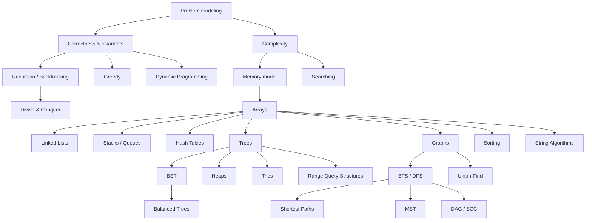

# Data Structures & Algorithms — Knowledge Library

Thư viện này xây dựng **Cấu trúc dữ liệu và thuật toán (Data Structures & Algorithms / 자료구조와 알고리즘)** từ câu hỏi gốc: khi lượng dữ liệu tăng, ta phải tổ chức state và quá trình xử lý như thế nào để chương trình vẫn đúng, đủ nhanh, tiết kiệm bộ nhớ và dễ suy luận?

DSA không phải một catalog để học thuộc. **Cấu trúc dữ liệu (Data Structure / 자료구조)** là cách ta chọn hình dạng biểu diễn của dữ liệu để một số thao tác trở nên rẻ hơn. **Thuật toán (Algorithm / 알고리즘)** là chuỗi bước hữu hạn biến input thành output. Hai phần này luôn đi cùng nhau vì representation quyết định operation nào có thể thực hiện hiệu quả.

Ba ngôn ngữ được dùng xuyên thư viện có vai trò khác nhau. **C** làm lộ rõ memory layout, pointer, allocation và ownership. **Java** cho thấy cùng ý tưởng trong generic collections, object model và garbage collection. **JavaScript** cho thấy DSA trong môi trường dynamic, nơi Array, Map, object và runtime optimization có semantics khác C/Java nhưng mental model thuật toán vẫn giữ nguyên.

## Cấu trúc thư viện

```text
data_structures_algorithms/
├── 00_foundations/
│   ├── 00_dsa_as_problem_modeling.md
│   ├── 01_algorithm_correctness_and_invariants.md
│   ├── 02_complexity_analysis.md
│   └── 03_memory_models_c_java_javascript.md
├── 01_linear_structures/
│   ├── 00_arrays_and_dynamic_arrays.md
│   ├── 01_linked_lists.md
│   ├── 02_stacks.md
│   ├── 03_queues_deques_and_priority_queues.md
│   └── 04_hash_tables.md
├── 02_trees/
│   ├── 00_tree_foundations.md
│   ├── 01_binary_search_trees.md
│   ├── 02_balanced_search_trees.md
│   ├── 03_heaps.md
│   └── 04_tries.md
├── 03_graphs/
│   ├── 00_graph_modeling_and_representation.md
│   ├── 01_graph_traversal_bfs_dfs.md
│   ├── 02_shortest_paths.md
│   ├── 03_minimum_spanning_trees.md
│   ├── 04_dag_topological_sort_and_scc.md
│   └── 05_union_find.md
├── 04_algorithmic_paradigms/
│   ├── 00_searching.md
│   ├── 01_sorting.md
│   ├── 02_recursion_and_backtracking.md
│   ├── 03_divide_and_conquer.md
│   ├── 04_greedy_algorithms.md
│   └── 05_dynamic_programming.md
├── 05_specialized/
│   ├── 00_string_algorithms.md
│   ├── 01_range_queries_fenwick_segment_tree.md
│   ├── 02_bit_manipulation_and_bitsets.md
│   └── 03_amortized_randomized_and_probabilistic_thinking.md
└── 90_connections/
    ├── 00_choose_the_right_data_structure.md
    ├── 01_dsa_in_databases_networks_and_systems.md
    └── 02_problem_solving_workflow.md
```

## Dependency map



## Cách sử dụng thư viện

Nếu bắt đầu từ gần số 0, nên đọc toàn bộ `00_foundations` trước. Sau đó đi qua linear structures, trees và graphs. Các paradigm thuật toán có thể học song song sau khi đã hiểu array, stack, queue và tree cơ bản.

Mental model xuyên suốt là:

> Không có cấu trúc dữ liệu “tốt nhất”. Chỉ có cấu trúc phù hợp với workload, invariant và cost model cụ thể.

Khi gặp bài toán mới, hãy chuyển câu chuyện domain thành các operation: lookup theo key, access theo index, insert/delete, min/max, prefix, range query, reachability, shortest path hay ordering. Từ đó mới chọn representation và algorithm.

## Phần mở rộng để library đạt phạm vi DSA đầy đủ hơn

Ngoài các cấu trúc textbook cơ bản, library còn tách riêng những conceptual boundaries dễ bị bỏ sót khi tài liệu chỉ phục vụ phỏng vấn:

```text
Mathematical toolkit
B-Tree / B+Tree / external-memory structures
Bridges / articulation points / biconnectivity
Eulerian traversal
Network flow / bipartite matching
Selection / k-th / Top-K
Two pointers / sliding window / prefix / difference
Intervals / sweep line / coordinate compression
Suffix array / suffix tree / LCP
Sparse table
Language-specific implementation/runtime patterns
Testing and benchmarking
```

Các chủ đề này không được coi là “level nâng cao”. Chúng tồn tại vì giải quyết **những dạng workload và invariant khác nhau**.

## Hai luồng đọc hợp lý

Luồng để xây nền:

```text
Foundations
  → Arrays / Lists / Stack / Queue / Hash
  → Trees / Heap
  → Graph modeling + BFS/DFS
  → Searching / Sorting / Recursion
  → Greedy / DP
```

Luồng theo nhu cầu hệ thống:

```text
Hashing → Cache / database hash join
Balanced trees → ordered map → B+Tree / database index
Heap → scheduler / Top-K / shortest path
Graph → dependencies / routing / flow
Trie & suffix structures → indexing / autocomplete / search
Range structures → analytics / online queries
```

Hai luồng này dùng cùng knowledge graph, không phải hai cấp độ học khác nhau.

## Các nhánh nâng cao đã được tách riêng sau vòng hoàn thiện

Library hiện còn bao gồm:

```text
Augmented / order-statistics / interval trees
Skip lists
Probabilistic data structures (Bloom, Count-Min Sketch, HyperLogLog, reservoir sampling)
Hard-problem reasoning: reductions, NP-complete intuition, approximation, parameterization
```

Những phần này giúp tránh một điểm yếu phổ biến của tài liệu DSA: dừng ở “array → tree → graph → DP” mà không giải thích data structures hiện đại được **augment, randomize hoặc approximate** như thế nào khi workload thay đổi.
