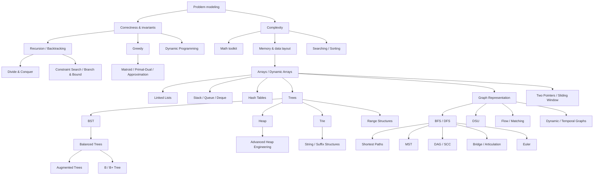

# Cấu trúc dữ liệu và thuật toán nâng cao — Thư viện kiến thức

Đây là thư viện chuyên sâu về **Cấu trúc dữ liệu và thuật toán (Data Structures & Algorithms — DSA / 자료구조와 알고리즘)** trong nhánh Khoa học máy tính của repository.

Nếu các tài liệu nền tảng giải thích những mô hình chung của Khoa học máy tính, thư viện này đi sâu vào từng ranh giới khái niệm của DSA: cách biểu diễn (representation), bất biến (invariant), chứng minh tính đúng đắn, độ phức tạp, cách triển khai, trường hợp biên và cách cấu trúc dữ liệu được dùng trong hệ thống thực tế.

Quay lại lớp nền tảng: [Thuật toán và cấu trúc dữ liệu — Nền tảng Khoa học máy tính](../../basic/01_algorithms_data_structures/).

DSA không phải danh mục công thức để học thuộc. **Cấu trúc dữ liệu (data structure / 자료구조)** là cách tổ chức trạng thái để một nhóm thao tác trở nên hiệu quả hơn. **Thuật toán (algorithm / 알고리즘)** là cách tổ chức quá trình biến đổi trạng thái từ đầu vào tới đầu ra. Cách biểu diễn và thuật toán luôn liên quan vì hình dạng dữ liệu quyết định thông tin nào có thể truy cập, loại bỏ hoặc tổng hợp nhanh.

Ba ngôn ngữ trong thư viện có vai trò khác nhau. **C** làm lộ bố trí bộ nhớ, con trỏ, cấp phát và quyền sở hữu. **Java** cho thấy cùng ý tưởng trong collection tổng quát, mô hình đối tượng và bộ gom rác. **JavaScript** cho thấy DSA trong môi trường thực thi động, nơi `Array`, `Map`, `Number`, `TypedArray` và JIT tạo mô hình chi phí khác nhưng các bất biến thuật toán vẫn giữ nguyên.

## Vị trí trong thư viện Khoa học máy tính

```text
computer_science/
└── 01_algorithms_data_structures/
    └── advanced/
        ├── 00_foundations/
        ├── 01_linear_structures/
        ├── 02_trees/
        ├── 03_graphs/
        ├── 04_algorithmic_paradigms/
        ├── 05_specialized/
        ├── 80_language_implementations/
        ├── 90_connections/
        ├── MANIFEST.md
        └── README.md
```

Từ **nâng cao (advanced)** mô tả vị trí của thư viện so với lớp nền tảng. Bên trong vẫn không tổ chức cứng theo Beginner → Intermediate → Advanced; các chương được chia theo quan hệ phụ thuộc kiến thức và ranh giới khái niệm.

## Cấu trúc đầy đủ

```text
advanced/
├── 00_foundations/
│   ├── 00_dsa_as_problem_modeling.md
│   ├── 01_algorithm_correctness_and_invariants.md
│   ├── 02_complexity_analysis.md
│   ├── 03_memory_models_c_java_javascript.md
│   └── 04_mathematical_toolkit_for_dsa.md
├── 01_linear_structures/
│   ├── 00_arrays_and_dynamic_arrays.md
│   ├── 01_linked_lists.md
│   ├── 02_stacks.md
│   ├── 03_queues_deques_and_priority_queues.md
│   └── 04_hash_tables.md
├── 02_trees/
│   ├── 00_tree_foundations.md
│   ├── 01_binary_search_trees.md
│   ├── 02_balanced_search_trees.md
│   ├── 03_heaps.md
│   ├── 04_tries.md
│   ├── 05_b_trees_and_external_memory.md
│   ├── 06_augmented_trees_and_order_statistics.md
│   ├── 07_skip_lists.md
│   └── 08_advanced_heaps_and_priority_queue_engineering.md
├── 03_graphs/
│   ├── 00_graph_modeling_and_representation.md
│   ├── 01_graph_traversal_bfs_dfs.md
│   ├── 02_shortest_paths.md
│   ├── 03_minimum_spanning_trees.md
│   ├── 04_dag_topological_sort_and_scc.md
│   ├── 05_union_find.md
│   ├── 06_bridges_articulation_and_biconnectivity.md
│   ├── 07_eulerian_paths_and_cycles.md
│   ├── 08_network_flow_and_matching.md
│   └── 09_dynamic_temporal_and_large_scale_graphs.md
├── 04_algorithmic_paradigms/
│   ├── 00_searching.md
│   ├── 01_sorting.md
│   ├── 02_recursion_and_backtracking.md
│   ├── 03_divide_and_conquer.md
│   ├── 04_greedy_algorithms.md
│   ├── 05_dynamic_programming.md
│   ├── 06_selection_and_top_k.md
│   ├── 07_two_pointers_sliding_window_prefix_difference.md
│   ├── 08_intervals_and_sweep_line.md
│   ├── 09_hard_problems_reductions_and_approximation.md
│   ├── 10_greedy_matroids_primal_dual_and_approximation.md
│   └── 11_constraint_search_branch_and_bound.md
├── 05_specialized/
│   ├── 00_string_algorithms.md
│   ├── 01_range_queries_fenwick_segment_tree.md
│   ├── 02_bit_manipulation_and_bitsets.md
│   ├── 03_amortized_randomized_and_probabilistic_thinking.md
│   ├── 04_suffix_arrays_suffix_trees_and_lcp.md
│   ├── 05_sparse_table_and_static_range_queries.md
│   └── 06_probabilistic_data_structures.md
├── 80_language_implementations/
│   ├── 00_c_dsa_implementation_patterns.md
│   ├── 01_java_collections_and_dsa.md
│   ├── 02_javascript_dsa_runtime_patterns.md
│   └── 03_cross_language_testing_and_benchmarking.md
└── 90_connections/
    ├── 00_choose_the_right_data_structure.md
    ├── 01_dsa_in_databases_networks_and_systems.md
    ├── 02_problem_solving_workflow.md
    ├── 03_case_study_database_indexing.md
    ├── 04_case_study_autocomplete_search.md
    ├── 05_case_study_routing_graph_system.md
    ├── 06_case_study_streaming_analytics.md
    └── 07_case_study_scheduler_backpressure.md
```

Mỗi nhóm có `_index.md` để điều hướng ngắn gọn trong Obsidian, GitHub và GitHub Pages.

## Quan hệ phụ thuộc kiến thức



Quan hệ phụ thuộc không phải mức độ khó. Nó chỉ cho biết một mô hình tư duy trước được tái sử dụng trong mô hình sau.

## Cách đọc nếu đã học phần nền tảng

Không cần đọc toàn bộ phần nâng cao theo thứ tự cứng. Nên bắt đầu bằng `00_foundations` để đồng bộ thuật ngữ và mô hình chi phí, sau đó đi vào nhánh liên quan đến vấn đề đang học.

Một lộ trình nền vững:

```text
00_foundations
    ↓
Arrays → Lists → Stack / Queue → Hash
    ↓
Trees → Heap → BST / Balanced Tree
    ↓
Graph modeling → BFS / DFS
    ↓
Searching / Sorting / Recursion
    ↓
Greedy / Dynamic Programming
```

Một lộ trình thiên về hệ thống:

```text
Hashing → cache / hash join
Balanced Tree → ordered map
B+Tree → database index / external memory
Heap → scheduler / Top-K / Dijkstra → advanced heap engineering
Graph → dependency / routing / flow → dynamic & temporal graphs
Trie + suffix structures → indexing / autocomplete / search
Fenwick / Segment Tree → online aggregate queries
Probabilistic structures → memory-bounded large-scale analytics
```

Một lộ trình đi sâu vào thiết kế thuật toán:

```text
Greedy → exchange argument → matroid / primal-dual / approximation
Recursion & Backtracking → CSP → propagation → branch-and-bound
Graph Modeling → static algorithms → dynamic/temporal/large-scale graph
Heap → binary heap → indexed/meldable/radix/relaxed priority queues
```

Các từ trong sơ đồ được giữ bằng tiếng Anh khi chúng là tên cấu trúc, tên thuật toán hoặc từ khóa tra cứu; phần giải thích xung quanh ưu tiên tiếng Việt.

## Case study xuyên nhiều cấu trúc

Sau khi đã đọc các chapter theo chủ đề, nhóm `90_connections` cung cấp các bài tổng hợp để luyện cách ghép nhiều cấu trúc thành một thiết kế hoàn chỉnh.

```text
Database Indexing
  Hash Table + B+Tree + Buffer Pool + Bloom Filter + LSM

Autocomplete & Search Suggestions
  Trie/FST + Heap + Hash Map + Unicode + fuzzy search + cache

Routing System
  Graph + Dijkstra + Priority Queue + Radix/Trie + hashing

Streaming Analytics
  Hash Map + CMS + HLL + Top-K + window + distributed merge

Scheduler & Backpressure
  Queue + Deque + Priority Queue + fairness + work stealing + admission control
```

Các case study không giới thiệu “một thuật toán mới”. Chúng kiểm tra khả năng chuyển từ yêu cầu hệ thống sang workload, state, invariant, representation, composition, failure mode, testing và benchmark.

Một cách đọc hiệu quả là đọc case study một lần để hiểu kiến trúc, quay lại các chapter được liên kết để đào sâu từng primitive, sau đó đọc lại case study và tự thay đổi workload. Ví dụ, database chuyển từ read-heavy sang write-heavy sẽ làm lựa chọn giữa B+Tree và LSM thay đổi; autocomplete chuyển từ dictionary tĩnh sang cập nhật liên tục sẽ làm lựa chọn giữa FST và Trie thay đổi.

## Mô hình tư duy xuyên suốt

> Không có cấu trúc dữ liệu “tốt nhất”. Chỉ có cách biểu diễn phù hợp với khối lượng công việc (workload), bất biến và mô hình chi phí cụ thể.

Khi gặp bài toán mới, đừng bắt đầu bằng câu hỏi “đây là bài dùng tree hay DP?”. Hãy chuyển bài toán thành các thao tác và ràng buộc: tra cứu chính xác, tra cứu theo thứ tự, thêm/xóa, min/max, tiền tố, truy vấn khoảng, tính liên thông, khả năng đi tới, đường đi ngắn nhất, phụ thuộc, ghép cặp hoặc chuyển trạng thái.

Sau đó hỏi:

```text
Trạng thái tối thiểu cần giữ là gì?
Bất biến nào giúp loại một vùng ứng viên?
Thao tác nào xảy ra thường xuyên nhất?
Ta đang tối ưu CPU, bộ nhớ hay I/O?
Có thể tiền xử lý không?
Dữ liệu tĩnh hay động?
Cần kết quả chính xác hay xấp xỉ đã đủ?
```

Đó là cách DSA trở thành công cụ thiết kế thay vì danh sách công thức.

## Tại sao có các chương ngoài “DSA phỏng vấn”?

Một thư viện dùng lâu dài không nên dừng ở mảng → cây → đồ thị → quy hoạch động. Hệ thống thực tế tạo ra nhiều mô hình chi phí khác nhau.

B/B+Tree xuất hiện khi I/O theo trang quan trọng hơn số lần so sánh. Cây tăng cường (augmented tree) xuất hiện khi khóa có thứ tự cần thêm thông tin như hạng hoặc tóm tắt khoảng. Skip list cho thấy ngẫu nhiên có thể thay thế bất biến cân bằng xác định. Luồng mạng (network flow) mô hình hóa dung lượng chứ không chỉ khả năng đi tới. Cấu trúc hậu tố tái sử dụng thông tin tiền tố và thứ tự trên văn bản. Bloom filter, Count-Min Sketch và HyperLogLog chấp nhận sai số có giới hạn để giảm bộ nhớ.

Các chapter sau-core mở rộng tiếp: heap nâng cao phân biệt các workload cần `meld`, `decrease-key` hoặc priority nguyên; đồ thị động/temporal xem topology và trọng số như trạng thái thay đổi theo thời gian; matroid và primal-dual giải thích sâu hơn khi nào greedy thực sự đúng hoặc chỉ gần tối ưu; constraint search kết nối backtracking với propagation, bound và solver hiện đại.

Những phần này cho thấy cùng các nguyên lý nền tảng được mở rộng như thế nào khi khối lượng công việc thay đổi.

## C, Java và JavaScript không phải ba bộ DSA riêng

Các chương trong `80_language_implementations/` cho thấy cùng một thuật toán gặp mô hình chi phí môi trường thực thi khác nhau.

C buộc ta suy luận về quyền sở hữu, vòng đời con trỏ và cấp phát. Java thêm hợp đồng collection, boxing và bộ gom rác. JavaScript thêm độ chính xác của `Number`, biểu diễn động của object/array, `TypedArray`, giới hạn đệ quy và hành vi JIT.

Mô hình thuật toán không đổi; các ràng buộc triển khai thay đổi.

## Kiểm tra phạm vi thư viện

[`MANIFEST.md`](./MANIFEST.md) liệt kê toàn bộ tệp và quy mô gần đúng. Thư viện được thiết kế để mỗi chương có thể đọc tương đối độc lập nhưng vẫn liên kết tới kiến thức tiên quyết cần thiết, tránh cả hai cực: một tệp “master book” khổng lồ và hàng trăm ghi chú nhỏ bị phân mảnh.