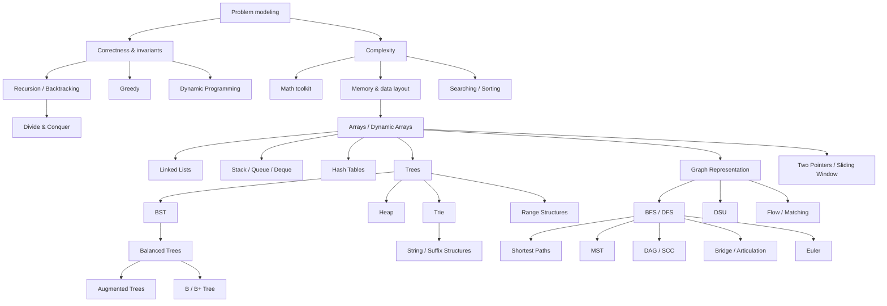

# Advanced Data Structures & Algorithms — Knowledge Library

Đây là thư viện chuyên sâu về **Cấu trúc dữ liệu và thuật toán (Data Structures & Algorithms / 자료구조와 알고리즘)** nằm trong nhánh Computer Science của repository.

Nếu các file ở thư mục cha `computer_science/01_algorithms_data_structures/` tạo **nền tảng Computer Science**, thư viện này đi sâu vào từng conceptual boundary của DSA: representation, invariant, proof of correctness, complexity, implementation, edge cases và cách các cấu trúc được sử dụng trong hệ thống thực tế.

Quay lại lớp nền tảng: [Algorithms & Data Structures — Computer Science Foundations](../README.md).

DSA không phải một catalog để học thuộc. **Cấu trúc dữ liệu (Data Structure / 자료구조)** là cách tổ chức state để một nhóm operation trở nên rẻ hơn. **Thuật toán (Algorithm / 알고리즘)** là cách tổ chức quá trình biến đổi state để đi từ input đến output. Representation và algorithm luôn liên quan với nhau vì shape của dữ liệu quyết định information nào có thể truy cập, loại bỏ hoặc tổng hợp nhanh.

Ba ngôn ngữ được dùng xuyên library có vai trò khác nhau. **C** làm lộ memory layout, pointer, allocation và ownership. **Java** cho thấy cùng các idea trong generic collections, object model và garbage collection. **JavaScript** cho thấy DSA trong dynamic runtime, nơi Array, Map, Number, TypedArray và JIT tạo một cost model khác nhưng invariant thuật toán vẫn giữ nguyên.

## Vị trí trong Computer Science library

```text
computer_science/
└── 01_algorithms_data_structures/
    ├── 00_algorithmic_thinking_and_correctness.md
    ├── 01_complexity_and_asymptotic_analysis.md
    ├── ... foundation chapters ...
    ├── README.md
    └── advanced/
        ├── 00_foundations/
        ├── 01_linear_structures/
        ├── 02_trees/
        ├── 03_graphs/
        ├── 04_algorithmic_paradigms/
        ├── 05_specialized/
        ├── 80_language_implementations/
        ├── 90_connections/
        ├── MANIFEST.md
        └── README.md
```

Từ **advanced** ở đây mô tả vị trí của library so với lớp foundation của Computer Science. Bên trong library vẫn **không tổ chức theo Beginner → Intermediate → Advanced**. Các chapter được chia theo knowledge dependency và conceptual boundary.

## Cấu trúc đầy đủ

```text
advanced/
├── 00_foundations/
│   ├── 00_dsa_as_problem_modeling.md
│   ├── 01_algorithm_correctness_and_invariants.md
│   ├── 02_complexity_analysis.md
│   ├── 03_memory_models_c_java_javascript.md
│   └── 04_mathematical_toolkit_for_dsa.md
│
├── 01_linear_structures/
│   ├── 00_arrays_and_dynamic_arrays.md
│   ├── 01_linked_lists.md
│   ├── 02_stacks.md
│   ├── 03_queues_deques_and_priority_queues.md
│   └── 04_hash_tables.md
│
├── 02_trees/
│   ├── 00_tree_foundations.md
│   ├── 01_binary_search_trees.md
│   ├── 02_balanced_search_trees.md
│   ├── 03_heaps.md
│   ├── 04_tries.md
│   ├── 05_b_trees_and_external_memory.md
│   ├── 06_augmented_trees_and_order_statistics.md
│   └── 07_skip_lists.md
│
├── 03_graphs/
│   ├── 00_graph_modeling_and_representation.md
│   ├── 01_graph_traversal_bfs_dfs.md
│   ├── 02_shortest_paths.md
│   ├── 03_minimum_spanning_trees.md
│   ├── 04_dag_topological_sort_and_scc.md
│   ├── 05_union_find.md
│   ├── 06_bridges_articulation_and_biconnectivity.md
│   ├── 07_eulerian_paths_and_cycles.md
│   └── 08_network_flow_and_matching.md
│
├── 04_algorithmic_paradigms/
│   ├── 00_searching.md
│   ├── 01_sorting.md
│   ├── 02_recursion_and_backtracking.md
│   ├── 03_divide_and_conquer.md
│   ├── 04_greedy_algorithms.md
│   ├── 05_dynamic_programming.md
│   ├── 06_selection_and_top_k.md
│   ├── 07_two_pointers_sliding_window_prefix_difference.md
│   ├── 08_intervals_and_sweep_line.md
│   └── 09_hard_problems_reductions_and_approximation.md
│
├── 05_specialized/
│   ├── 00_string_algorithms.md
│   ├── 01_range_queries_fenwick_segment_tree.md
│   ├── 02_bit_manipulation_and_bitsets.md
│   ├── 03_amortized_randomized_and_probabilistic_thinking.md
│   ├── 04_suffix_arrays_suffix_trees_and_lcp.md
│   ├── 05_sparse_table_and_static_range_queries.md
│   └── 06_probabilistic_data_structures.md
│
├── 80_language_implementations/
│   ├── 00_c_dsa_implementation_patterns.md
│   ├── 01_java_collections_and_dsa.md
│   ├── 02_javascript_dsa_runtime_patterns.md
│   └── 03_cross_language_testing_and_benchmarking.md
│
└── 90_connections/
    ├── 00_choose_the_right_data_structure.md
    ├── 01_dsa_in_databases_networks_and_systems.md
    └── 02_problem_solving_workflow.md
```

Mỗi nhóm còn có `_index.md` để làm navigation ngắn gọn trong Obsidian, GitHub và GitHub Pages.

## Knowledge dependency



Dependency không phải difficulty level. Nó chỉ nói rằng một mental model trước được tái sử dụng trong mental model sau.

## Cách đọc nếu đã học foundation

Nếu bạn đã đọc các chapter ở thư mục cha, không cần đọc Advanced theo kiểu từ file đầu đến file cuối một cách cứng nhắc. Hãy bắt đầu bằng `00_foundations` để đồng bộ vocabulary và cost model, rồi đi vào nhánh liên quan tới vấn đề đang học.

Một luồng nền vững là:

```text
00_foundations
    ↓
Arrays → Lists → Stack / Queue → Hash
    ↓
Trees → Heap → BST / Balanced Tree
    ↓
Graph modeling → BFS / DFS
    ↓
Searching / Sorting / Recursion
    ↓
Greedy / Dynamic Programming
```

Một luồng theo systems có thể là:

```text
Hashing → cache / hash join
Balanced Tree → ordered map
B+Tree → database index / external memory
Heap → scheduler / Top-K / Dijkstra
Graph → dependency / routing / flow
Trie + suffix structures → indexing / autocomplete / search
Fenwick / Segment Tree → online aggregate queries
Probabilistic structures → memory-bounded large-scale analytics
```

## Mental model xuyên suốt

> Không có cấu trúc dữ liệu “tốt nhất”. Chỉ có representation phù hợp với workload, invariant và cost model cụ thể.

Khi gặp một bài toán mới, đừng bắt đầu bằng câu hỏi “đây là bài dùng tree hay DP?”. Hãy chuyển problem thành các operation và constraints: exact lookup, ordered lookup, insert/delete, min/max, prefix, range query, connectivity, reachability, shortest path, dependency, matching hay state transition.

Sau đó hỏi tiếp:

```text
State tối thiểu cần giữ là gì?
Invariant nào giúp loại một vùng candidate?
Operation nào xảy ra thường xuyên nhất?
Ta đang tối ưu CPU, memory hay I/O?
Có preprocessing được không?
Data static hay dynamic?
Có cần exact answer hay approximation đủ dùng?
```

Đó là cách DSA trở thành công cụ thiết kế thay vì danh sách công thức.

## Tại sao có các chapter ngoài “DSA phỏng vấn”?

Một thư viện dùng lâu dài không nên dừng ở array → tree → graph → DP. Các hệ thống thật tạo ra những cost model khác nhau.

B/B+Tree xuất hiện khi page I/O quan trọng hơn comparison count. Augmented tree xuất hiện khi ordered key cần thêm rank/interval summary. Skip list cho thấy randomness có thể thay balancing invariant deterministic. Network flow mô hình hóa capacity chứ không chỉ reachability. Suffix structures tái sử dụng prefix/order information trên text. Bloom filter, Count-Min Sketch và HyperLogLog chấp nhận bounded error để giảm memory.

Những phần này không phải “bonus”. Chúng cho thấy cùng first principles được mở rộng thế nào khi workload đổi.

## C, Java và JavaScript không phải ba bộ DSA riêng

Các chapter trong `80_language_implementations/` chỉ ra nơi cùng một thuật toán gặp cost model runtime khác nhau.

C buộc ta reasoning về ownership, pointer lifetime và allocation. Java thêm collection contracts, boxing và GC. JavaScript thêm Number precision, dynamic object/array representation, TypedArray, recursion limit và JIT behavior.

Mental model thuật toán không đổi; implementation constraints thay đổi.

## Kiểm tra phạm vi library

[`MANIFEST.md`](./MANIFEST.md) liệt kê toàn bộ file và approximate word count. Library được thiết kế để mỗi chapter có thể đọc độc lập nhưng vẫn liên kết sang dependency cần thiết, tránh cả hai cực: một “master book” khổng lồ và hàng trăm note nhỏ bị fragmented.
