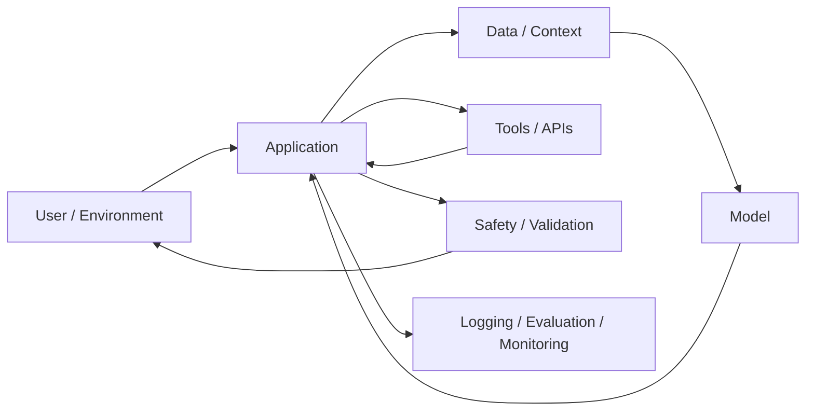

# Artificial Intelligence là gì?

Artificial Intelligence (AI / Trí tuệ nhân tạo / 인공지능) thường được mô tả bằng những câu rất rộng như “máy móc bắt chước trí thông minh con người”. Cách nói này hữu ích để tạo trực giác ban đầu nhưng chưa đủ chính xác, vì nó để lại hai câu hỏi khó hơn: **trí thông minh là gì**, và **máy cần giống con người đến mức nào mới được coi là thông minh**?

Một cách tiếp cận tốt hơn là bắt đầu từ vấn đề thực tế. Trong rất nhiều bài toán, một hệ thống phải nhận thông tin từ môi trường, hiểu hoặc biểu diễn thông tin đó theo một dạng có thể xử lý, suy ra điều gì đang xảy ra, lựa chọn hành động phù hợp và đôi khi học từ kết quả để cải thiện hành vi sau này. AI nghiên cứu cách làm cho máy thực hiện được một phần hoặc toàn bộ chuỗi đó.

Nói cách khác, AI không phải một thuật toán duy nhất. Nó là một **family of approaches** cho những bài toán mà việc viết toàn bộ rule bằng tay là khó, không ổn định hoặc không đủ linh hoạt.

## Từ automation đến intelligence

Hãy so sánh một chương trình tính thuế với một hệ thống phát hiện gian lận. Chương trình tính thuế có thể hoạt động hoàn toàn bằng rule cố định: nếu thu nhập nằm trong khoảng nào thì áp dụng mức thuế tương ứng. Input đi vào, một chuỗi điều kiện xác định trước được chạy, output đi ra. Đây là automation, nhưng không nhất thiết cần AI.

Trong fraud detection, số lượng pattern có thể rất lớn và thay đổi liên tục. Một giao dịch bất thường có thể phụ thuộc vào số tiền, thời điểm, vị trí, lịch sử tài khoản, loại thiết bị, merchant, network relationship và hàng trăm tín hiệu khác. Nếu cố viết rule cho mọi trường hợp, system sẽ nhanh chóng trở nên cứng nhắc. Machine Learning có thể học pattern từ historical data và ước lượng xác suất một giao dịch là fraud.

Sự khác biệt quan trọng không nằm ở việc “có code hay không”, vì AI vẫn là software. Điểm khác nằm ở **cách hành vi được tạo ra**. Trong traditional programming, developer trực tiếp encode phần lớn logic. Trong learning-based AI, developer thiết kế model, data pipeline, objective và training process để model tự tìm một mapping hữu ích từ data.

```text
Traditional programming
Rules + Data → Output

Machine Learning
Data + Desired Output → Learned Model
Learned Model + New Data → Prediction
```

Điều này không có nghĩa AI lúc nào cũng học từ data. Classical AI còn dùng search, logic, planning, constraint solving và knowledge representation. Vì vậy Machine Learning chỉ là một nhánh rất lớn bên trong AI, không phải định nghĩa của toàn bộ AI.

## Intelligence nên được nhìn như capability, không phải magic

Một system được gọi là “intelligent” thường vì nó có một hoặc nhiều capability sau: perception, reasoning, learning, planning, language understanding, prediction, decision making hoặc action. Không nên gộp tất cả thành một khái niệm mơ hồ.

Ví dụ, một computer vision model có thể nhận ảnh và phân loại vật thể rất tốt nhưng không biết lập kế hoạch. Một theorem prover có thể suy luận logic nhưng không hiểu hình ảnh. Một LLM có thể xử lý language cực rộng nhưng vẫn có thể thất bại với factual grounding hoặc long-horizon planning. Intelligence vì vậy nên được xem như một vector capability thay vì một binary label “thông minh / không thông minh”.

Mental model hữu ích là:

```text
Intelligence ≈ khả năng biến information thành useful behavior dưới constraints
```

“Useful behavior” phụ thuộc vào objective. Với recommender system, đó có thể là ranking item. Với robot, đó có thể là hành động vật lý. Với LLM, đó có thể là sequence token trả lời phù hợp. Với autonomous agent, đó có thể là một chuỗi action hướng tới goal.

## Một AI system cần biểu diễn thế giới

Máy không trực tiếp nhìn thấy “con mèo”, “khách hàng rời bỏ dịch vụ” hay “ý nghĩa của câu”. Nó chỉ nhận một representation: pixel, token, vector, graph, feature hoặc state. Representation là cầu nối giữa world và computation.

Điều này dẫn tới một nguyên lý quan trọng:

> **Một model chỉ có thể xử lý những gì đã được biểu diễn theo một dạng mà computation của nó có thể thao tác.**

Một ảnh RGB có thể trở thành tensor. Một câu có thể trở thành token IDs rồi embedding vectors. Một board game có thể trở thành state. Một mạng xã hội có thể trở thành graph. Nếu representation làm mất thông tin quan trọng, model phía sau khó có thể phục hồi điều không còn tồn tại trong input.

Vì vậy representation không chỉ là bước “format data”. Nó quyết định model có thể nhìn thấy cấu trúc nào của problem.

Xem thêm: [Problem Representation](./03_problem_representation.md).

## Search, reasoning, learning và optimization khác nhau như thế nào?

Bốn từ này thường bị trộn lẫn.

**Search (탐색 / tìm kiếm)** là việc khám phá một space của khả năng để tìm path, state hoặc solution. A* search tìm đường trong graph là ví dụ điển hình.

**Reasoning (추론 / suy luận)** là việc tạo conclusion từ knowledge, rule hoặc evidence. Logic inference và probabilistic inference đều là reasoning, nhưng cơ chế khác nhau.

**Learning (학습 / học)** là quá trình thay đổi internal representation hoặc parameters dựa trên data/experience để cải thiện performance trên một task hoặc distribution.

**Optimization (최적화 / tối ưu hóa)** là việc tìm giá trị của biến sao cho objective tốt hơn, chẳng hạn minimize loss. Training neural network thường là một optimization problem, nhưng learning và optimization không đồng nghĩa: optimization là mechanism; learning là mục tiêu rộng hơn về khả năng generalize từ data.

Các cơ chế này thường kết hợp. Reinforcement Learning có learning + optimization + planning. LLM agent có language model + tool use + search/planning. Production recommendation system có model learning + ranking optimization + business constraints.

## Weak AI, General AI và terminology

Trong nhiều tài liệu, **Narrow AI** hoặc **Weak AI (약인공지능)** chỉ những system được tối ưu cho một phạm vi task nhất định. Đây là phần gần như toàn bộ AI deployed hiện nay.

**Artificial General Intelligence (AGI / 범용 인공지능)** thường dùng để mô tả một hypothetical system có năng lực rộng, có thể thích nghi và xử lý nhiều domain ở mức tổng quát hơn. Tuy nhiên không có một operational definition duy nhất được mọi cộng đồng chấp nhận. Vì vậy khi đọc claim về AGI cần kiểm tra metric, capability và benchmark cụ thể thay vì chỉ dựa vào label.

**Artificial Superintelligence (ASI / 초인공지능)** thường chỉ giả thuyết về system vượt con người trên rất nhiều cognitive domains. Đây là khái niệm mang tính lý thuyết và dự báo nhiều hơn là một engineering category ổn định.

Library này ưu tiên những khái niệm có mechanism rõ ràng và có thể kiểm chứng, đồng thời vẫn giải thích terminology để người đọc hiểu discussion hiện đại.

## AI có “hiểu” không?

Câu hỏi này phụ thuộc vào định nghĩa của “understanding”. Nếu “understanding” nghĩa là system có internal representation đủ để dự đoán, suy luận hoặc hành động đúng trong một class of situations, nhiều model rõ ràng thể hiện một dạng functional understanding. Nếu “understanding” được định nghĩa theo subjective conscious experience, hiện không thể suy ra điều đó chỉ từ output behavior.

Trong engineering, cách an toàn hơn là tránh anthropomorphism và hỏi những câu có thể đo được: model giữ được context bao lâu, có generalize sang distribution mới không, có grounded vào external source không, calibration thế nào, failure mode nào thường gặp, và behavior có stable dưới perturbation không.

## AI là một system problem

Trong demo, người ta thường nhìn AI như `input → model → output`. Trong production, model chỉ là một thành phần.



Data quality, latency, cost, privacy, observability, evaluation, fallback strategy và software architecture thường quyết định system có usable hay không. Một model mạnh nhưng context sai, retrieval kém hoặc integration lỗi vẫn tạo ra product tệ.

Đây là lý do library sau này tách rõ `AI model` và `AI system`.

## Common Misconceptions

### “AI = Machine Learning”

Sai vì AI còn có search, planning, logic, symbolic reasoning, constraint solving và nhiều approach khác. Machine Learning là một major paradigm của AI hiện đại.

### “Deep Learning = AI hiện đại nên những thứ cũ không cần học”

Nhiều idea cũ vẫn quay lại dưới hình thức mới. Agent cần state, goal và action; planning vẫn quan trọng; search xuất hiện trong decoding, retrieval và reasoning systems; probabilistic reasoning vẫn là nền cho uncertainty. Hiểu classical AI giúp nhìn modern AI như một continuum thay vì một loạt buzzword.

### “Model càng lớn thì luôn càng thông minh”

Scale có thể cải thiện nhiều capability nhưng performance còn phụ thuộc data, architecture, training objective, inference strategy, tool access, context quality và evaluation domain. Bigger không tự động giải quyết mọi failure mode.

### “AI output nghe hợp lý thì có nghĩa là đúng”

Fluency và factual correctness là hai property khác nhau. Đặc biệt với generative model, một sequence có xác suất ngôn ngữ cao vẫn có thể sai về factual world. Vì vậy grounding, retrieval, verification và evaluation là phần cốt lõi của system design.

## Knowledge Connection

AI nối nhiều lĩnh vực nền:

- **Mathematics** cung cấp language để biểu diễn vector, probability, loss và optimization.
- **Computer Science** cung cấp algorithms, data structures, complexity, systems và programming abstractions.
- **Statistics** giúp reasoning dưới uncertainty và đánh giá generalization từ sample sang population.
- **Information Theory** giúp định lượng uncertainty và information.
- **Cognitive Science** cung cấp nhiều câu hỏi về perception, memory, learning và reasoning, dù machine intelligence không cần sao chép brain.
- **Software Engineering** biến model thành reliable product.

Điểm quan trọng là không học các connection này như trivia. Khi gặp một concept AI, hãy hỏi: representation là gì, objective là gì, uncertainty nằm ở đâu, mechanism nào biến input thành output, và system đang tối ưu cho điều gì.

Xem tiếp: [History and AI Paradigms](./01_history_and_ai_paradigms.md) và [Intelligence, Agents and Environments](./02_intelligence_agents_and_environments.md).