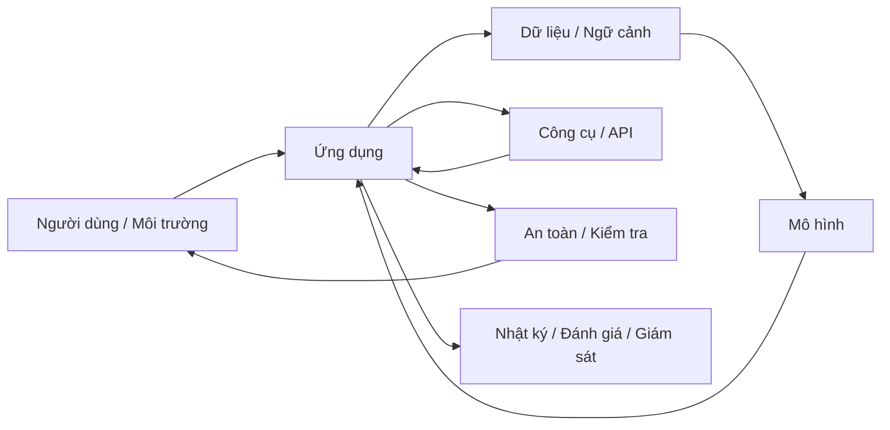

# Trí tuệ nhân tạo (Artificial Intelligence) là gì?

**Trí tuệ nhân tạo (Artificial Intelligence - AI / 인공지능)** thường được mô tả bằng câu “máy móc bắt chước trí thông minh con người”. Cách nói này hữu ích để tạo trực giác ban đầu nhưng chưa đủ chính xác, vì nó vẫn để lại hai câu hỏi khó hơn: **trí thông minh là gì**, và **một hệ thống cần giống con người đến mức nào mới được xem là thông minh**?

Một cách tiếp cận thực tế hơn là bắt đầu từ bài toán. Trong nhiều tình huống, hệ thống phải nhận thông tin từ môi trường, biểu diễn thông tin đó theo dạng máy có thể xử lý, suy luận điều đang xảy ra, lựa chọn hành động phù hợp và đôi khi học từ kết quả để cải thiện hành vi về sau. AI nghiên cứu cách xây dựng hệ thống có thể thực hiện một phần hoặc toàn bộ chuỗi đó.

Nói cách khác, AI không phải một thuật toán duy nhất. Nó là **một họ phương pháp (family of approaches)** dành cho những bài toán mà việc viết toàn bộ quy tắc bằng tay là quá khó, quá cứng nhắc hoặc không đủ để xử lý sự biến đổi của thế giới thực.

## Từ tự động hóa (automation) đến trí thông minh (intelligence)

Hãy so sánh một chương trình tính thuế với một hệ thống phát hiện gian lận. Chương trình tính thuế có thể hoạt động hoàn toàn bằng quy tắc cố định: nếu thu nhập nằm trong khoảng nào thì áp dụng mức thuế tương ứng. Dữ liệu đầu vào (input) đi vào, chương trình chạy các điều kiện đã được xác định trước rồi tạo dữ liệu đầu ra (output). Đây là **tự động hóa (automation)**, nhưng không nhất thiết cần AI.

Trong bài toán **phát hiện gian lận (fraud detection)**, số lượng mẫu hành vi có thể rất lớn và thay đổi liên tục. Một giao dịch bất thường có thể phụ thuộc vào số tiền, thời điểm, vị trí, lịch sử tài khoản, thiết bị, đơn vị bán hàng và mối quan hệ trong mạng lưới giao dịch. Nếu cố viết quy tắc cho mọi trường hợp, hệ thống sẽ nhanh chóng trở nên cứng nhắc. **Học máy (Machine Learning - ML)** có thể học các mẫu thống kê từ dữ liệu lịch sử và ước lượng khả năng một giao dịch là gian lận.

Sự khác biệt không nằm ở việc “có mã nguồn hay không”, vì AI vẫn là phần mềm. Điểm khác nằm ở **cách hành vi của hệ thống được tạo ra**. Trong lập trình truyền thống (traditional programming), lập trình viên trực tiếp mã hóa phần lớn logic. Trong AI dựa trên học máy, lập trình viên thiết kế mô hình (model), luồng dữ liệu (data pipeline), hàm mục tiêu (objective) và quá trình huấn luyện (training) để mô hình học ra một ánh xạ hữu ích từ dữ liệu.

```text
Lập trình truyền thống
Quy tắc + Dữ liệu → Kết quả

Học máy
Dữ liệu + Kết quả mong muốn → Mô hình đã học
Mô hình đã học + Dữ liệu mới → Dự đoán
```

Điều này không có nghĩa AI lúc nào cũng phải học từ dữ liệu. **AI cổ điển (classical AI)** còn sử dụng tìm kiếm (search), logic, lập kế hoạch (planning), giải bài toán ràng buộc (constraint solving) và biểu diễn tri thức (knowledge representation). Vì vậy ML là một nhánh rất lớn của AI, nhưng không phải toàn bộ AI.

## Trí thông minh nên được nhìn như tập hợp năng lực

Một hệ thống thường được gọi là “thông minh” vì nó có một hoặc nhiều năng lực như nhận thức (perception), suy luận (reasoning), học (learning), lập kế hoạch (planning), hiểu ngôn ngữ, dự đoán, ra quyết định hoặc hành động. Không nên gom tất cả các năng lực này thành một khái niệm mơ hồ.

Ví dụ, một mô hình thị giác máy tính (computer vision model) có thể phân loại ảnh rất tốt nhưng không biết lập kế hoạch. Một hệ thống chứng minh định lý (theorem prover) có thể suy luận logic nhưng không hiểu hình ảnh. Một mô hình ngôn ngữ lớn (Large Language Model - LLM) có thể xử lý ngôn ngữ rất rộng nhưng vẫn có thể thất bại khi cần đối chiếu sự thật với nguồn ngoài hoặc lập kế hoạch dài hạn.

Vì vậy, trí thông minh nên được xem như **một tập hợp nhiều năng lực**, thay vì một nhãn nhị phân “thông minh / không thông minh”.

Một mô hình tư duy (mental model) hữu ích là:

```text
Trí thông minh ≈ khả năng biến thông tin thành hành vi hữu ích dưới các ràng buộc
```

“Hành vi hữu ích” phụ thuộc vào mục tiêu. Với hệ thống gợi ý (recommender system), đó có thể là xếp hạng nội dung. Với robot, đó có thể là hành động vật lý. Với LLM, đó có thể là tạo chuỗi token phù hợp. Với tác nhân tự chủ (autonomous agent), đó có thể là một chuỗi hành động hướng tới mục tiêu.

## Hệ thống AI cần biểu diễn thế giới

Máy không trực tiếp nhìn thấy “con mèo”, “khách hàng sắp rời bỏ dịch vụ” hay “ý nghĩa của một câu”. Nó chỉ nhận được một **biểu diễn (representation)** như điểm ảnh (pixel), token, vector, đồ thị (graph), đặc trưng (feature) hoặc trạng thái (state). Biểu diễn là cầu nối giữa thế giới thực và tính toán.

Điều này dẫn tới một nguyên lý quan trọng:

> **Một mô hình chỉ có thể xử lý những gì đã được biểu diễn theo dạng mà phép tính của nó có thể thao tác.**

Một ảnh RGB có thể trở thành tensor. Một câu có thể được tách thành mã token rồi chuyển thành vector nhúng (embedding vector). Một trò chơi bàn cờ có thể được biểu diễn thành trạng thái. Một mạng xã hội có thể được biểu diễn thành đồ thị.

Nếu biểu diễn làm mất thông tin quan trọng, mô hình phía sau thường không thể tự khôi phục phần thông tin đã biến mất. Vì vậy biểu diễn không chỉ là bước “định dạng dữ liệu”; nó quyết định mô hình có thể nhìn thấy cấu trúc nào của bài toán.

Xem thêm: [Biểu diễn bài toán](./03_problem_representation.md).

## Tìm kiếm, suy luận, học và tối ưu hóa khác nhau như thế nào?

Bốn khái niệm này thường bị dùng lẫn nhau.

**Tìm kiếm (search / 탐색)** là quá trình khám phá không gian các khả năng để tìm đường đi, trạng thái hoặc lời giải. Thuật toán A* tìm đường trong đồ thị là ví dụ điển hình.

**Suy luận (reasoning / 추론)** là quá trình tạo kết luận từ tri thức, quy tắc hoặc bằng chứng. Suy luận logic và suy luận xác suất đều là suy luận, nhưng sử dụng cơ chế khác nhau.

**Học (learning / 학습)** là quá trình thay đổi biểu diễn nội bộ hoặc tham số dựa trên dữ liệu và kinh nghiệm để cải thiện hiệu năng trên một nhiệm vụ hoặc một phân phối dữ liệu.

**Tối ưu hóa (optimization / 최적화)** là quá trình tìm giá trị của các biến sao cho hàm mục tiêu tốt hơn, chẳng hạn giảm hàm mất mát (loss). Huấn luyện mạng nơ-ron thường là một bài toán tối ưu hóa, nhưng học và tối ưu hóa không đồng nghĩa. Tối ưu hóa là một cơ chế; học nhấn mạnh khả năng rút ra cấu trúc có thể khái quát hóa (generalization) ngoài dữ liệu huấn luyện.

Các cơ chế này thường được kết hợp. Học tăng cường (Reinforcement Learning - RL) kết hợp học, tối ưu hóa và đôi khi lập kế hoạch. Tác nhân LLM có thể kết hợp mô hình ngôn ngữ, gọi công cụ, tìm kiếm và lập kế hoạch. Hệ thống gợi ý trong thực tế có thể kết hợp học mô hình, tối ưu thứ hạng và các ràng buộc nghiệp vụ.

## AI hẹp, AGI và ASI

**AI hẹp (Narrow AI)**, còn được gọi là **AI yếu (Weak AI / 약인공지능)**, chỉ các hệ thống được tối ưu cho một phạm vi nhiệm vụ nhất định. Phần lớn hệ thống AI đang được triển khai trong thực tế thuộc nhóm này.

**Trí tuệ nhân tạo tổng quát (Artificial General Intelligence - AGI / 범용 인공지능)** thường dùng để mô tả một hệ thống giả định có năng lực rộng, có thể thích nghi và xử lý nhiều lĩnh vực ở mức tổng quát hơn. Hiện không có một định nghĩa vận hành (operational definition) duy nhất được toàn bộ cộng đồng chấp nhận. Vì vậy, khi đọc một tuyên bố về AGI, cần kiểm tra năng lực, chỉ số đo và bộ chuẩn đánh giá (benchmark) cụ thể thay vì chỉ dựa vào nhãn “AGI”.

**Siêu trí tuệ nhân tạo (Artificial Superintelligence - ASI / 초인공지능)** thường chỉ giả thuyết về hệ thống vượt con người trên rất nhiều lĩnh vực nhận thức. Đây chủ yếu là một khái niệm lý thuyết và dự báo, chưa phải một nhóm kỹ thuật ổn định trong thực hành kỹ thuật AI.

Library này ưu tiên các khái niệm có cơ chế rõ ràng và có thể kiểm chứng, đồng thời vẫn giải thích những thuật ngữ phổ biến để người đọc hiểu các cuộc thảo luận hiện đại.

## AI có “hiểu” không?

Câu hỏi này phụ thuộc vào cách định nghĩa “hiểu”. Nếu hiểu nghĩa là hệ thống có biểu diễn nội bộ đủ để dự đoán, suy luận hoặc hành động đúng trong một nhóm tình huống, nhiều mô hình thể hiện một dạng **hiểu theo chức năng (functional understanding)**. Nếu “hiểu” được định nghĩa theo trải nghiệm chủ quan có ý thức, hiện không thể suy ra điều đó chỉ từ hành vi đầu ra của mô hình.

Trong kỹ thuật (engineering), cách hữu ích hơn là tránh nhân hóa hệ thống và đặt những câu hỏi có thể đo được: mô hình giữ ngữ cảnh được bao lâu, có khái quát hóa sang phân phối mới hay không, có đối chiếu được với nguồn bên ngoài hay không, mức hiệu chuẩn (calibration) ra sao, thường gặp kiểu lỗi nào và hành vi có ổn định trước các biến đổi đầu vào hay không.

## AI là bài toán cấp hệ thống

Trong bản minh họa đơn giản, người ta thường nhìn AI như:

```text
đầu vào → mô hình → đầu ra
```

Nhưng trong môi trường vận hành thực tế (production), mô hình chỉ là một thành phần.



Chất lượng dữ liệu, độ trễ (latency), chi phí, quyền riêng tư, khả năng quan sát (observability), đánh giá, phương án dự phòng (fallback) và kiến trúc phần mềm thường quyết định hệ thống có thực sự dùng được hay không. Một mô hình mạnh nhưng nhận sai ngữ cảnh, truy xuất (retrieval) kém hoặc tích hợp lỗi vẫn tạo ra sản phẩm tệ.

Đây là lý do library tách rõ **mô hình AI (AI model)** và **hệ thống AI (AI system)**.

## Các hiểu lầm thường gặp

### “AI = Machine Learning”

Không đúng. AI còn bao gồm tìm kiếm, lập kế hoạch, logic, suy luận ký hiệu (symbolic reasoning), giải bài toán ràng buộc và nhiều phương pháp khác. Học máy là một hướng tiếp cận lớn của AI hiện đại.

### “Deep Learning là AI hiện đại nên không cần học các ý tưởng cũ”

Nhiều ý tưởng cũ vẫn xuất hiện trong hệ thống hiện đại dưới hình thức mới. Tác nhân cần trạng thái, mục tiêu và hành động; lập kế hoạch vẫn quan trọng; tìm kiếm xuất hiện trong quá trình giải mã (decoding), truy xuất và các hệ thống suy luận; suy luận xác suất vẫn là nền tảng để xử lý bất định. Hiểu AI cổ điển giúp nhìn AI hiện đại như một quá trình phát triển liên tục thay vì một chuỗi từ khóa thời thượng.

### “Mô hình càng lớn thì luôn càng thông minh”

Quy mô (scale) có thể cải thiện nhiều năng lực, nhưng hiệu năng còn phụ thuộc dữ liệu, kiến trúc, mục tiêu huấn luyện, chiến lược suy luận, quyền truy cập công cụ, chất lượng ngữ cảnh và miền đánh giá. Lớn hơn không tự động giải quyết mọi kiểu lỗi.

### “Đầu ra của AI nghe hợp lý thì có nghĩa là đúng”

Độ trôi chảy (fluency) và tính đúng sự thật là hai thuộc tính khác nhau. Đặc biệt với mô hình sinh (generative model), một chuỗi có xác suất ngôn ngữ cao vẫn có thể sai về thế giới thực. Vì vậy việc đối chiếu nguồn (grounding), truy xuất, xác minh (verification) và đánh giá là phần cốt lõi của thiết kế hệ thống.

## Liên kết kiến thức

AI nối nhiều lĩnh vực nền tảng:

- **Toán học (Mathematics)** cung cấp ngôn ngữ để biểu diễn vector, xác suất, hàm mất mát và tối ưu hóa.
- **Khoa học máy tính (Computer Science)** cung cấp thuật toán, cấu trúc dữ liệu, độ phức tạp, hệ thống và các trừu tượng lập trình.
- **Thống kê (Statistics)** giúp suy luận dưới bất định và đánh giá khả năng khái quát hóa từ mẫu sang quần thể.
- **Lý thuyết thông tin (Information Theory)** giúp định lượng bất định và lượng thông tin.
- **Khoa học nhận thức (Cognitive Science)** cung cấp nhiều câu hỏi về nhận thức, trí nhớ, học và suy luận, dù trí tuệ máy không nhất thiết phải sao chép bộ não.
- **Kỹ nghệ phần mềm (Software Engineering)** giúp biến mô hình thành một sản phẩm đáng tin cậy.

Điểm quan trọng là không học các liên kết này như kiến thức vụn. Khi gặp một khái niệm AI, hãy hỏi: **biểu diễn là gì, mục tiêu là gì, bất định nằm ở đâu, cơ chế nào biến đầu vào thành đầu ra, và hệ thống đang tối ưu điều gì?**

Xem tiếp: [Lịch sử và các mô hình tư duy AI](./01_history_and_ai_paradigms.md) và [Trí thông minh, tác nhân và môi trường](./02_intelligence_agents_and_environments.md).