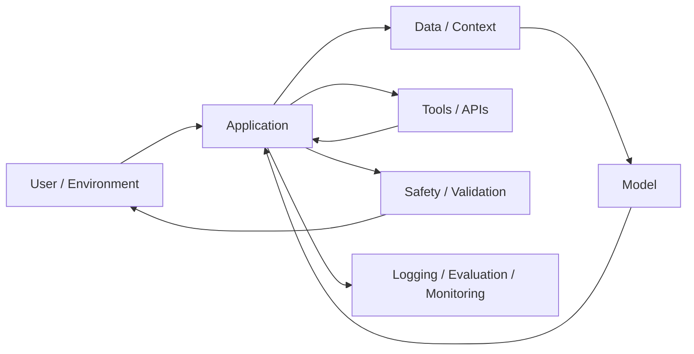

# Artificial Intelligence là gì?

> **Mạch đọc:** Đọc **Artificial Intelligence là gì?** như một mắt xích của lộ trình học (learning path / 학습 경로) hiện tại, không như một ghi chú tách rời. Nội dung đi từ **Từ automation đến intelligence** sang **Intelligence nên được nhìn như năng lực (capability / 역량), không phải magic**; điểm nối này chuẩn bị câu hỏi cho các mục sau thay vì dừng ở định nghĩa đầu tiên.


Artificial Intelligence (AI / Trí tuệ nhân tạo / 인공지능) thường được mô tả bằng những câu rất rộng như “máy móc bắt chước trí thông minh con người”. Cách nói này hữu ích để tạo trực giác ban đầu nhưng chưa đủ chính xác, vì nó để lại hai câu hỏi khó hơn: **trí thông minh là gì**, và **máy cần giống con người đến mức nào mới được coi là thông minh**?

Một cách tiếp cận tốt hơn là bắt đầu từ vấn đề thực tế. Trong rất nhiều bài toán, một hệ thống phải nhận thông tin từ môi trường, hiểu hoặc biểu diễn thông tin đó theo một dạng có thể xử lý, suy ra điều gì đang xảy ra, lựa chọn hành động phù hợp và đôi khi học từ kết quả để cải thiện hành vi sau này. AI nghiên cứu cách làm cho máy thực hiện được một phần hoặc toàn bộ chuỗi đó.

Nói cách khác, AI không phải một thuật toán duy nhất. Nó là một **family of approaches** cho những bài toán mà việc viết toàn bộ quy tắc (rule / 규칙) bằng tay là khó, không ổn định hoặc không đủ linh hoạt.

## Từ automation đến intelligence

Hãy so sánh một chương trình tính thuế với một hệ thống phát hiện gian lận. Chương trình tính thuế có thể hoạt động hoàn toàn bằng quy tắc (rule / 규칙) cố định: nếu thu nhập nằm trong khoảng nào thì áp dụng mức thuế tương ứng. đầu vào (input / 입력) đi vào, một chuỗi điều kiện xác định trước được chạy, đầu ra (output / 출력) đi ra. Đây là automation, nhưng không nhất thiết cần AI.

Trong fraud detection, số lượng mẫu (pattern / 패턴) có thể rất lớn và thay đổi liên tục. Một giao dịch bất thường có thể phụ thuộc vào số tiền, thời điểm, vị trí, lịch sử tài khoản, loại thiết bị, merchant, mạng (network / 네트워크) relationship và hàng trăm tín hiệu khác. Nếu cố viết quy tắc (rule / 규칙) cho mọi trường hợp, hệ thống (system / 시스템) sẽ nhanh chóng trở nên cứng nhắc. Machine học tập (learning / 학습) có thể học mẫu (pattern / 패턴) từ historical dữ liệu (data / 데이터) và ước lượng xác suất một giao dịch là fraud.

Sự khác biệt quan trọng không nằm ở việc “có mã (code / 코드) hay không”, vì AI vẫn là software. Điểm khác nằm ở **cách hành vi được tạo ra**. Trong traditional programming, nhà phát triển (developer / 개발자) trực tiếp encode phần lớn lô-gic (logic / 논리). Trong learning-based AI, nhà phát triển (developer / 개발자) thiết kế mô hình (model / 모델), dữ liệu (data / 데이터) chuỗi xử lý (pipeline / 파이프라인), mục tiêu (objective / 목표) và huấn luyện (training / 학습) tiến trình (process / 프로세스) để mô hình (model / 모델) tự tìm một ánh xạ (mapping / 매핑) hữu ích từ dữ liệu (data / 데이터).

```text
Traditional programming
Rules + Data → Output

Machine Learning
Data + Desired Output → Learned Model
Learned Model + New Data → Prediction
```

Điều này không có nghĩa AI lúc nào cũng học từ dữ liệu (data / 데이터). Classical AI còn dùng tìm kiếm (search / 검색), lô-gic (logic / 논리), planning, ràng buộc (constraint / 제약조건) solving và kiến thức (knowledge / 지식) biểu diễn (representation / 표현). Vì vậy Machine học tập (learning / 학습) chỉ là một nhánh rất lớn bên trong AI, không phải định nghĩa của toàn bộ AI.


> **Chuyển mạch:** Từ **Từ automation đến intelligence**, ta sang **Intelligence nên được nhìn như năng lực (capability / 역량), không phải magic** để mở rộng cùng câu hỏi và dùng kết quả đó để khép lại mạch giải thích.

## Intelligence nên được nhìn như năng lực (capability / 역량), không phải magic

Một hệ thống (system / 시스템) được gọi là “intelligent” thường vì nó có một hoặc nhiều năng lực (capability / 역량) sau: perception, lập luận (reasoning / 추론), học tập (learning / 학습), planning, ngôn ngữ (language / 언어) understanding, prediction, quyết định (decision / 결정) making hoặc hành động (action / 동작). Không nên gộp tất cả thành một khái niệm mơ hồ.

Ví dụ, một computer vision mô hình (model / 모델) có thể nhận ảnh và phân loại vật thể rất tốt nhưng không biết lập kế hoạch. Một theorem prover có thể suy luận lô-gic (logic / 논리) nhưng không hiểu hình ảnh. Một LLM có thể xử lý ngôn ngữ (language / 언어) cực rộng nhưng vẫn có thể thất bại với factual grounding hoặc long-horizon planning. Intelligence vì vậy nên được xem như một véc-tơ (vector / 벡터) năng lực (capability / 역량) thay vì một nhị phân (binary / 이진) label “thông minh / không thông minh”.

Mô hình tư duy (mental model / 사고 모델) hữu ích là:

```text
Intelligence ≈ khả năng biến information thành useful behavior dưới constraints
```

“Useful hành vi (behavior / 동작)” phụ thuộc vào mục tiêu (objective / 목표). Với recommender hệ thống (system / 시스템), đó có thể là ranking item. Với robot, đó có thể là hành động vật lý. Với LLM, đó có thể là chuỗi (sequence / 시퀀스) đơn vị từ (token / 토큰) trả lời phù hợp. Với autonomous tác nhân (agent / 에이전트), đó có thể là một chuỗi hành động (action / 동작) hướng tới goal.


> **Chuyển mạch:** Từ **Intelligence nên được nhìn như năng lực (capability / 역량), không phải magic**, ta sang **Một AI hệ thống (system / 시스템) cần biểu diễn thế giới** để mở rộng cùng câu hỏi và dùng kết quả đó để khép lại mạch giải thích.

## Một AI hệ thống (system / 시스템) cần biểu diễn thế giới

Máy không trực tiếp nhìn thấy “con mèo”, “khách hàng rời bỏ dịch vụ” hay “ý nghĩa của câu”. Nó chỉ nhận một biểu diễn (representation / 표현): điểm ảnh (pixel / 픽셀), đơn vị từ (token / 토큰), véc-tơ (vector / 벡터), đồ thị (graph / 그래프), tính năng (feature / 기능) hoặc trạng thái (state / 상태). biểu diễn (representation / 표현) là cầu nối giữa world và computation.

Điều này dẫn tới một nguyên lý quan trọng:

> **Một mô hình (model / 모델) chỉ có thể xử lý những gì đã được biểu diễn theo một dạng mà computation của nó có thể thao tác.**

Một ảnh RGB có thể trở thành tensor. Một câu có thể trở thành đơn vị từ (token / 토큰) IDs rồi embedding vectors. Một board game có thể trở thành trạng thái (state / 상태). Một mạng xã hội có thể trở thành đồ thị (graph / 그래프). Nếu biểu diễn (representation / 표현) làm mất thông tin quan trọng, mô hình (model / 모델) phía sau khó có thể phục hồi điều không còn tồn tại trong đầu vào (input / 입력).

Vì vậy biểu diễn (representation / 표현) không chỉ là bước “format dữ liệu (data / 데이터)”. Nó quyết định mô hình (model / 모델) có thể nhìn thấy cấu trúc nào của bài toán (problem / 문제).

Xem thêm: [Problem Representation](./03_problem_representation.md).


> **Chuyển mạch:** Từ **Một AI hệ thống (system / 시스템) cần biểu diễn thế giới**, ta sang **tìm kiếm (search / 검색), lập luận (reasoning / 추론), học tập (learning / 학습) và tối ưu hóa (optimization / 최적화) khác nhau như thế nào?** để mở rộng cùng câu hỏi và dùng kết quả đó để khép lại mạch giải thích.

## Tìm kiếm (search / 검색), lập luận (reasoning / 추론), học tập (learning / 학습) và tối ưu hóa (optimization / 최적화) khác nhau như thế nào?

Bốn từ này thường bị trộn lẫn.

**tìm kiếm (search / 검색)** là việc khám phá một không gian (space / 공간) của khả năng để tìm đường dẫn (path / 경로), trạng thái (state / 상태) hoặc solution. A* tìm kiếm (search / 검색) tìm đường trong đồ thị (graph / 그래프) là ví dụ điển hình.

**lập luận (reasoning / 추론)** là việc tạo conclusion từ kiến thức (knowledge / 지식), quy tắc (rule / 규칙) hoặc bằng chứng (evidence / 증거). lô-gic (logic / 논리) suy luận (inference / 추론) và probabilistic suy luận (inference / 추론) đều là lập luận (reasoning / 추론), nhưng cơ chế khác nhau.

**học tập (learning / 학습)** là quá trình thay đổi nội bộ (internal / 내부) biểu diễn (representation / 표현) hoặc parameters dựa trên dữ liệu (data / 데이터)/experience để cải thiện hiệu năng (performance / 성능) trên một tác vụ (task / 작업) hoặc phân phối (distribution / 분포).

**tối ưu hóa (optimization / 최적화)** là việc tìm giá trị của biến sao cho mục tiêu (objective / 목표) tốt hơn, chẳng hạn minimize mất mát (loss / 손실). huấn luyện (training / 학습) neural mạng (network / 네트워크) thường là một tối ưu hóa (optimization / 최적화) bài toán (problem / 문제), nhưng học tập (learning / 학습) và tối ưu hóa (optimization / 최적화) không đồng nghĩa: tối ưu hóa (optimization / 최적화) là cơ chế (mechanism / 메커니즘); học tập (learning / 학습) là mục tiêu rộng hơn về khả năng generalize từ dữ liệu (data / 데이터).

Các cơ chế này thường kết hợp. Reinforcement học tập (learning / 학습) có học tập (learning / 학습) + tối ưu hóa (optimization / 최적화) + planning. LLM tác nhân (agent / 에이전트) có ngôn ngữ (language / 언어) mô hình (model / 모델) + công cụ (tool / 도구) use + tìm kiếm (search / 검색)/planning. môi trường vận hành (production / 운영 환경) recommendation hệ thống (system / 시스템) có mô hình (model / 모델) học tập (learning / 학습) + ranking tối ưu hóa (optimization / 최적화) + nghiệp vụ (business / 비즈니스) các ràng buộc (constraints / 제약조건들).


> **Chuyển mạch:** Từ **tìm kiếm (search / 검색), lập luận (reasoning / 추론), học tập (learning / 학습) và tối ưu hóa (optimization / 최적화) khác nhau như thế nào?**, ta sang **Weak AI, General AI và terminology** để mở rộng cùng câu hỏi và dùng kết quả đó để khép lại mạch giải thích.

## Weak AI, General AI và terminology

Trong nhiều tài liệu, **Narrow AI** hoặc **Weak AI (약인공지능)** chỉ những hệ thống (system / 시스템) được tối ưu cho một phạm vi tác vụ (task / 작업) nhất định. Đây là phần gần như toàn bộ AI deployed hiện nay.

**Artificial General Intelligence (AGI / 범용 인공지능)** thường dùng để mô tả một hypothetical hệ thống (system / 시스템) có năng lực rộng, có thể thích nghi và xử lý nhiều lĩnh vực (domain / 도메인) ở mức tổng quát hơn. Tuy nhiên không có một operational definition duy nhất được mọi cộng đồng chấp nhận. Vì vậy khi đọc claim về AGI cần kiểm tra chỉ số (metric / 지표), năng lực (capability / 역량) và benchmark cụ thể thay vì chỉ dựa vào label.

**Artificial Superintelligence (ASI / 초인공지능)** thường chỉ giả thuyết về hệ thống (system / 시스템) vượt con người trên rất nhiều cognitive domains. Đây là khái niệm mang tính lý thuyết và dự báo nhiều hơn là một kỹ thuật (engineering / 엔지니어링) category ổn định.

Thư viện (library / 라이브러리) này ưu tiên những khái niệm có cơ chế (mechanism / 메커니즘) rõ ràng và có thể kiểm chứng, đồng thời vẫn giải thích terminology để người đọc hiểu discussion hiện đại.


> **Chuyển mạch:** Từ **Weak AI, General AI và terminology**, ta sang **AI có “hiểu” không?** để mở rộng cùng câu hỏi và dùng kết quả đó để khép lại mạch giải thích.

## AI có “hiểu” không?

Câu hỏi này phụ thuộc vào định nghĩa của “understanding”. Nếu “understanding” nghĩa là hệ thống (system / 시스템) có nội bộ (internal / 내부) biểu diễn (representation / 표현) đủ để dự đoán, suy luận hoặc hành động đúng trong một lớp (class / 클래스) of situations, nhiều mô hình (model / 모델) rõ ràng thể hiện một dạng functional understanding. Nếu “understanding” được định nghĩa theo subjective conscious experience, hiện không thể suy ra điều đó chỉ từ đầu ra (output / 출력) hành vi (behavior / 동작).

Trong kỹ thuật (engineering / 엔지니어링), cách an toàn hơn là tránh anthropomorphism và hỏi những câu có thể đo được: mô hình (model / 모델) giữ được ngữ cảnh (context / 맥락) bao lâu, có generalize sang phân phối (distribution / 분포) mới không, có grounded vào bên ngoài (external / 외부) nguồn (source / 소스) không, calibration thế nào, dạng thất bại (failure mode / 실패 모드) nào thường gặp, và hành vi (behavior / 동작) có stable dưới perturbation không.


> **Chuyển mạch:** Từ **AI có “hiểu” không?**, ta sang **AI là một hệ thống (system / 시스템) bài toán (problem / 문제)** để mở rộng cùng câu hỏi và dùng kết quả đó để khép lại mạch giải thích.

## AI là một hệ thống (system / 시스템) bài toán (problem / 문제)

Trong demo, người ta thường nhìn AI như `input → model → output`. Trong môi trường vận hành (production / 운영 환경), mô hình (model / 모델) chỉ là một thành phần.


```mermaid
flowchart LR
    U[User / Environment] --> APP[Application]
    APP --> DATA[Data / Context]
    DATA --> MODEL[Model]
    MODEL --> APP
    APP --> TOOL[Tools / APIs]
    TOOL --> APP
    APP --> SAFE[Safety / Validation]
    SAFE --> U
    APP --> OBS[Logging / Evaluation / Monitoring]
```

Dữ liệu (data / 데이터) chất lượng (quality / 품질), độ trễ (latency / 지연 시간), chi phí (cost / 비용), privacy, khả năng quan sát (observability / 관측 가능성), evaluation, fallback chiến lược (strategy / 전략) và software kiến trúc (architecture / 아키텍처) thường quyết định hệ thống (system / 시스템) có usable hay không. Một mô hình (model / 모델) mạnh nhưng ngữ cảnh (context / 맥락) sai, retrieval kém hoặc tích hợp (integration / 통합) lỗi vẫn tạo ra sản phẩm (product / 제품) tệ.

Đây là lý do thư viện (library / 라이브러리) sau này tách rõ `AI model` và `AI system`.


> **Chuyển mạch:** Từ **AI là một hệ thống (system / 시스템) bài toán (problem / 문제)**, ta sang **dùng chung (common / 공통) Misconceptions** để mở rộng cùng câu hỏi và dùng kết quả đó để khép lại mạch giải thích.

## Dùng chung (common / 공통) Misconceptions

### “AI = Machine học tập (learning / 학습)”

Sai vì AI còn có tìm kiếm (search / 검색), planning, lô-gic (logic / 논리), symbolic lập luận (reasoning / 추론), ràng buộc (constraint / 제약조건) solving và nhiều approach khác. Machine học tập (learning / 학습) là một major paradigm của AI hiện đại.

### “Deep học tập (learning / 학습) = AI hiện đại nên những thứ cũ không cần học”

Nhiều idea cũ vẫn quay lại dưới hình thức mới. tác nhân (agent / 에이전트) cần trạng thái (state / 상태), goal và hành động (action / 동작); planning vẫn quan trọng; tìm kiếm (search / 검색) xuất hiện trong decoding, retrieval và lập luận (reasoning / 추론) các hệ thống (systems / 시스템들); probabilistic lập luận (reasoning / 추론) vẫn là nền cho bất định (uncertainty / 불확실성). Hiểu classical AI giúp nhìn hiện đại (modern / 현대적) AI như một continuum thay vì một loạt buzzword.

### “mô hình (model / 모델) càng lớn thì luôn càng thông minh”

Quy mô (scale / 규모) có thể cải thiện nhiều năng lực (capability / 역량) nhưng hiệu năng (performance / 성능) còn phụ thuộc dữ liệu (data / 데이터), kiến trúc (architecture / 아키텍처), huấn luyện (training / 학습) mục tiêu (objective / 목표), suy luận (inference / 추론) chiến lược (strategy / 전략), công cụ (tool / 도구) truy cập (access / 접근), ngữ cảnh (context / 맥락) chất lượng (quality / 품질) và evaluation lĩnh vực (domain / 도메인). Bigger không tự động giải quyết mọi dạng thất bại (failure mode / 실패 모드).

### “AI đầu ra (output / 출력) nghe hợp lý thì có nghĩa là đúng”

Fluency và factual tính đúng đắn (correctness / 정확성) là hai thuộc tính (property / 속성) khác nhau. Đặc biệt với generative mô hình (model / 모델), một chuỗi (sequence / 시퀀스) có xác suất ngôn ngữ cao vẫn có thể sai về factual world. Vì vậy grounding, retrieval, xác minh (verification / 확인) và evaluation là phần cốt lõi của hệ thống (system / 시스템) thiết kế (design / 설계).


> **Chuyển mạch:** Từ **dùng chung (common / 공통) Misconceptions**, ta sang **liên kết kiến thức (knowledge connection / 지식 연결)** để mở rộng cùng câu hỏi và dùng kết quả đó để khép lại mạch giải thích.

## Liên kết kiến thức (knowledge connection / 지식 연결)

AI nối nhiều lĩnh vực nền:

- **Mathematics** cung cấp ngôn ngữ (language / 언어) để biểu diễn véc-tơ (vector / 벡터), xác suất (probability / 확률), mất mát (loss / 손실) và tối ưu hóa (optimization / 최적화).
- **Khoa học máy tính (computer science / 컴퓨터 과학)** cung cấp algorithms, dữ liệu (data / 데이터) structures, độ phức tạp (complexity / 복잡도), các hệ thống (systems / 시스템들) và programming abstractions.
- **Statistics** giúp lập luận (reasoning / 추론) dưới bất định (uncertainty / 불확실성) và đánh giá generalization từ mẫu (sample / 표본) sang population.
- **thông tin (information / 정보) lý thuyết (theory / 이론)** giúp định lượng bất định (uncertainty / 불확실성) và thông tin (information / 정보).
- **Cognitive Science** cung cấp nhiều câu hỏi về perception, bộ nhớ (memory / 메모리), học tập (learning / 학습) và lập luận (reasoning / 추론), dù machine intelligence không cần sao chép brain.
- **Kỹ nghệ phần mềm (software engineering / 소프트웨어 공학)** biến mô hình (model / 모델) thành reliable sản phẩm (product / 제품).

Điểm quan trọng là không học các liên kết (connection / 연결) này như trivia. Khi gặp một concept AI, hãy hỏi: biểu diễn (representation / 표현) là gì, mục tiêu (objective / 목표) là gì, bất định (uncertainty / 불확실성) nằm ở đâu, cơ chế (mechanism / 메커니즘) nào biến đầu vào (input / 입력) thành đầu ra (output / 출력), và hệ thống (system / 시스템) đang tối ưu cho điều gì.

Xem tiếp: [History and AI Paradigms](./01_history_and_ai_paradigms.md) và [Intelligence, Agents and Environments](./02_intelligence_agents_and_environments.md).

> **Bàn giao:** Sau **liên kết kiến thức (knowledge connection / 지식 연결)**, hãy chốt bất biến (invariant / 불변식) và giới hạn của mục này trước khi nối sang kiến thức kế tiếp. Có thể đọc tiếp [01 history and ai paradigms](./01_history_and_ai_paradigms.md) để đối chiếu ranh giới (boundary / 경계) gần nhất.
