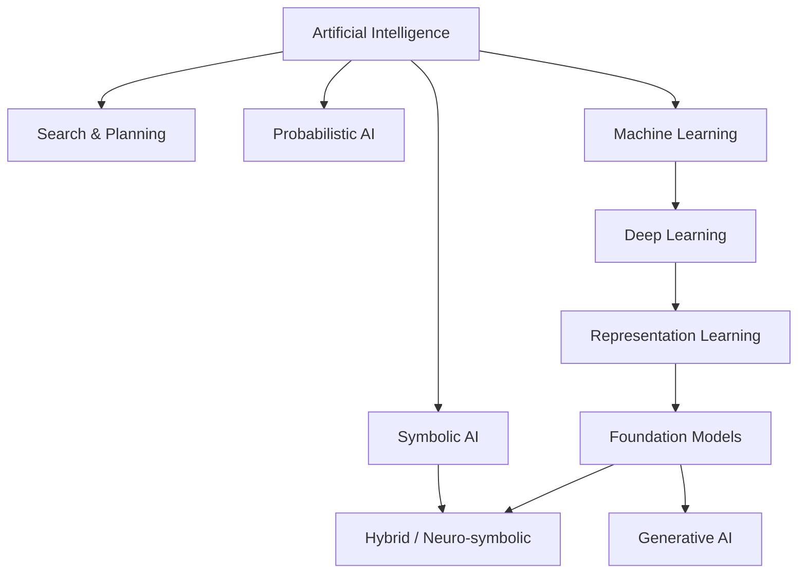

# Lịch sử và các AI Paradigm

Lịch sử Artificial Intelligence (AI / 인공지능) không phải một đường thẳng đi từ “AI yếu” tới “AI mạnh”. Nó giống một chuỗi thay đổi về **cách con người nghĩ rằng intelligence nên được xây dựng**. Mỗi giai đoạn nổi bật một assumption khác nhau: có lúc người ta tin intelligence chủ yếu là logic; có lúc trọng tâm là search; có lúc là học statistical pattern từ data; hiện nay phần lớn frontier systems dựa vào large-scale representation learning kết hợp data, compute, optimization và system engineering.

Hiểu lịch sử theo paradigm hữu ích hơn học thuộc timeline, vì nhiều “ý tưởng cũ” vẫn xuất hiện trong system hiện đại dưới hình thức mới.

## Symbolic AI: intelligence như thao tác trên symbol

Một trong những cách tiếp cận đầu tiên là **Symbolic AI (기호 인공지능 / AI ký hiệu)**. Ý tưởng nền là: nếu knowledge có thể được biểu diễn bằng symbol và rule, máy có thể thao tác symbol theo logic để suy luận.

Ví dụ:

```text
Human(Socrates)
∀x Human(x) → Mortal(x)
------------------------
Mortal(Socrates)
```

Ở đây system không “học” rule từ data. Knowledge được encode trực tiếp. Strength của symbolic approach là reasoning rõ ràng, dễ inspect và có semantics tương đối explicit.

Nhưng problem xuất hiện khi world quá lớn, noisy hoặc khó mô tả bằng rule. Một system nhận diện mèo từ ảnh không thể dễ dàng dựa vào hàng nghìn rule kiểu “tai nhọn + ria + texture + pose...”. Real world chứa ambiguity, uncertainty và enormous variability.

Điều này dẫn tới nhu cầu cho statistical learning.

## Search và planning: intelligence như exploration trong space of possibilities

Nhiều problem có thể được biểu diễn thành state space. Chess, route planning, puzzle solving hoặc scheduling đều có nhiều khả năng, và system cần tìm sequence action phù hợp.

Search paradigm không yêu cầu system phải “hiểu” thế giới giống con người. Nó cần representation của state, action, goal và một strategy để explore.

Ví dụ, path finding có thể được mô hình hóa thành graph. Một node là state, edge là action, cost là chi phí di chuyển. Algorithm như A* sử dụng heuristic để ưu tiên những state có vẻ hứa hẹn.

Idea này vẫn còn rất sống trong AI hiện đại. Beam search được dùng trong decoding. Retrieval là một dạng search trên document/vector space. Planning agent tìm sequence action. Một số reasoning systems kết hợp language model với search tree.

## Probabilistic AI: intelligence dưới uncertainty

Real world hiếm khi deterministic hoàn toàn. Sensor có noise. Diagnosis không chắc chắn. User behavior biến đổi. Vì vậy probability trở thành một language quan trọng của AI.

Thay vì nói “disease chắc chắn xảy ra”, model có thể biểu diễn:

\[
P(Disease \mid Symptoms)
\]

Probabilistic reasoning chuyển focus từ rule tuyệt đối sang degree of belief và uncertainty. Bayesian networks, hidden Markov models và probabilistic graphical models là những ví dụ lớn.

Paradigm này tạo cầu nối mạnh giữa AI và Statistics.

## Machine Learning: thay vì viết rule, hãy học mapping từ data

Machine Learning (ML / 기계학습 / học máy) thay đổi trung tâm của engineering process. Thay vì developer định nghĩa trực tiếp mọi decision rule, ta xây model với parameters và sử dụng data để điều chỉnh parameters sao cho objective tốt hơn.

Ví dụ linear regression học:

\[
\hat{y} = wx + b
\]

Training tìm `w` và `b` để prediction gần target. Neural network mở rộng idea này thành hàng triệu hoặc hàng tỷ parameters.

Điểm bản chất là:

> Learning không phải magic. Nó là quá trình dùng evidence trong data để chọn một model trong hypothesis space.

Điều này kéo theo các khái niệm generalization, overfitting, inductive bias, train/validation/test split và evaluation.

## Connectionism và Neural Networks

**Connectionism** xem intelligence như emergent behavior từ mạng các processing units tương tác, lấy cảm hứng lỏng lẻo từ neuron sinh học nhưng không phải bản sao brain.

Neural network hiện đại sử dụng differentiable computation graph. Input đi qua nhiều layer, tạo prediction, loss đo error, rồi gradient được propagate ngược để update parameters.

Deep Learning thành công mạnh vì ba yếu tố gặp nhau:

1. data ở scale lớn hơn;
2. compute mạnh hơn, đặc biệt GPU;
3. architecture + optimization technique tốt hơn.

Nó không chỉ là “nhiều layer hơn”. Deep network đặc biệt mạnh ở **representation learning**: model tự học intermediate features thay vì phụ thuộc hoàn toàn vào hand-crafted features.

## Representation Learning: thay đổi câu hỏi từ “feature nào?” sang “representation nào?”

Trong classical ML, engineer thường thiết kế feature. Với image, có thể dùng edge detector hoặc hand-crafted descriptor. Deep Learning cho phép model học representation trực tiếp từ raw-ish input.

Một image classifier không chỉ học output label; intermediate layers học texture, shape, part và higher-level pattern. Một language model học vector representation liên quan tới syntax, semantics và context.

Đây là bước chuyển rất quan trọng vì nhiều breakthrough hiện đại đến từ việc học được representation tốt.

## Foundation Models và scale

**Foundation Model (기반 모델 / mô hình nền tảng)** là model được train trên broad data ở scale lớn, sau đó có thể adapt cho nhiều downstream tasks.

Large Language Model là một dạng foundation model cho language và ngày càng multimodal. Thay vì train một model riêng hoàn toàn cho từng task, ta pretrain một model lớn rồi sử dụng prompting, fine-tuning, retrieval hoặc tools.

Paradigm này thay đổi software architecture: model trở thành một reusable capability layer.

## Generative AI

Traditional discriminative model thường học mapping kiểu:

\[
P(y \mid x)
\]

Generative modeling cố học distribution của data hoặc cách sinh sample mới. Language model học probability của token sequence; diffusion model học reverse denoising process để tạo image; autoregressive model sinh output từng bước.

Generative AI trở nên nổi bật vì output không còn chỉ là class hoặc score mà có thể là text, image, audio, video, code hoặc structured action.

## Hybrid và Neuro-symbolic AI

Không có lý do theoretical bắt buộc một system chỉ dùng một paradigm. Production AI thường hybrid.

Một system có thể dùng:

```text
Neural model → perception / language
Symbolic rules → business constraints
Search → planning
Database / retrieval → factual grounding
Optimizer → resource allocation
```

**Neuro-symbolic AI (신경기호 AI)** nghiên cứu cách kết hợp learned representations với explicit reasoning hoặc structured knowledge.

Đây là reminder quan trọng rằng “deep learning thắng symbolic AI” là cách kể lịch sử quá đơn giản. Different mechanisms phù hợp different subproblems.

## AI winters và bài học về expectation

Lịch sử AI có các giai đoạn funding và optimism tăng mạnh, sau đó giảm khi system không đạt expectation. Những giai đoạn này thường được gọi là **AI winter**.

Bài học không phải “AI luôn hype”. Bài học tốt hơn là phân biệt:

- capability đã được demonstrated;
- benchmark performance;
- real-world reliability;
- economic feasibility;
- claim về tương lai.

Một model có thể đạt benchmark cao nhưng vẫn chưa production-ready vì latency, cost, robustness hoặc safety.

## Paradigm map



Sơ đồ này không phải hierarchy lịch sử tuyệt đối. Nhiều branch overlap và coexist.

## Mental Model

Khi gặp một AI technique mới, thay vì hỏi “đây là generation mới nhất chưa?”, hãy hỏi bốn câu:

1. **Knowledge nằm ở đâu?** Trong rule, parameters, database, memory hay environment?
2. **Computation chính là gì?** Search, inference, optimization, sampling hay matrix operations?
3. **System học bằng gì?** Không học, supervised signal, self-supervised objective hay reward?
4. **Uncertainty được xử lý ra sao?** Bỏ qua, rule deterministic, probability distribution hay sampling?

Bốn câu này thường đủ để đặt một technique mới vào knowledge graph.

## Connection với AI hiện đại

Một LLM application tưởng rất mới nhưng có thể chứa nhiều paradigm cùng lúc:

```text
LLM parameters          → learned statistical representation
Vector retrieval        → search
System prompt            → explicit instruction
Tool schema              → symbolic structure
Agent planning           → search / planning
Business validation      → deterministic rules
Human feedback           → learning signal
```

Vì vậy hiểu lịch sử paradigm giúp nhìn system hiện đại rõ hơn: modern AI không xóa sạch những idea cũ, mà thường recombine chúng ở scale và representation mới.

Xem tiếp: [Intelligence, Agents and Environments](./02_intelligence_agents_and_environments.md).