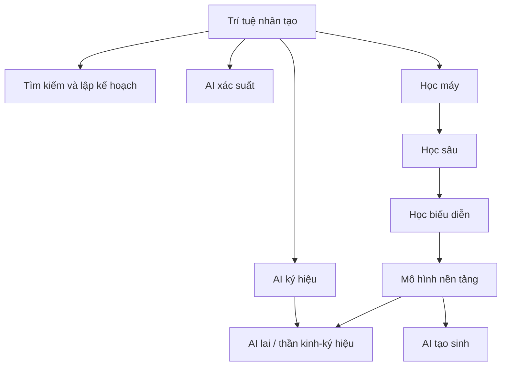

# Lịch sử và các trường phái AI

Lịch sử **trí tuệ nhân tạo (Artificial Intelligence - AI / 인공지능)** không phải một đường thẳng đi từ “AI yếu” tới “AI mạnh”. Nó là chuỗi thay đổi trong cách con người trả lời câu hỏi: **trí thông minh nên được xây dựng bằng cơ chế nào?** Mỗi giai đoạn nhấn mạnh một giả định khác nhau. Có thời kỳ người ta xem logic là trung tâm của trí thông minh; có thời kỳ trọng tâm chuyển sang tìm kiếm (search); sau đó là học các mẫu thống kê từ dữ liệu; còn AI hiện đại dựa mạnh vào học biểu diễn quy mô lớn (large-scale representation learning), dữ liệu, năng lực tính toán và tối ưu hóa.

Hiểu lịch sử theo **trường phái hoặc mô hình tiếp cận (paradigm)** hữu ích hơn học thuộc mốc thời gian, vì nhiều ý tưởng cũ vẫn xuất hiện trong hệ thống hiện đại dưới hình thức mới.

## AI ký hiệu (Symbolic AI): trí thông minh như thao tác trên ký hiệu

Một trong những hướng tiếp cận đầu tiên là **AI ký hiệu (Symbolic AI / 기호 인공지능)**. Ý tưởng nền tảng là: nếu tri thức có thể được biểu diễn bằng ký hiệu và quy tắc, máy có thể thao tác các ký hiệu đó theo logic để suy luận.

Ví dụ:

```text
Human(Socrates)
∀x Human(x) → Mortal(x)
------------------------
Mortal(Socrates)
```

Trong ví dụ này, hệ thống không học quy tắc từ dữ liệu. Tri thức được mã hóa trực tiếp. Ưu điểm của cách tiếp cận ký hiệu là quá trình suy luận tương đối rõ ràng, dễ kiểm tra và có ngữ nghĩa được định nghĩa tường minh.

Vấn đề xuất hiện khi thế giới quá lớn, nhiều nhiễu hoặc khó mô tả bằng quy tắc. Một hệ thống nhận diện mèo từ ảnh khó có thể dựa vào hàng nghìn quy tắc thủ công kiểu “tai nhọn + ria + kết cấu lông + tư thế...”. Thế giới thực chứa sự mơ hồ, bất định và mức biến thiên rất lớn.

Điều này tạo động lực cho **học thống kê (statistical learning)**.

## Tìm kiếm và lập kế hoạch: trí thông minh như khám phá không gian khả năng

Nhiều bài toán có thể được biểu diễn thành **không gian trạng thái (state space)**. Cờ vua, tìm đường, giải câu đố hay lập lịch đều chứa rất nhiều khả năng, và hệ thống cần tìm một chuỗi hành động phù hợp.

Cách tiếp cận tìm kiếm không yêu cầu hệ thống phải “hiểu” thế giới giống con người. Nó cần biểu diễn được trạng thái, hành động, mục tiêu và một chiến lược khám phá không gian khả năng.

Ví dụ, tìm đường có thể được mô hình hóa thành đồ thị. Một nút (node) là trạng thái, một cạnh (edge) là hành động, còn trọng số có thể biểu diễn chi phí di chuyển. Thuật toán A* sử dụng hàm ước lượng (heuristic) để ưu tiên những trạng thái có vẻ hứa hẹn.

Ý tưởng này vẫn rất quan trọng trong AI hiện đại. Tìm kiếm chùm (beam search) được dùng trong giải mã (decoding). Truy xuất (retrieval) là một dạng tìm kiếm trên không gian tài liệu hoặc vector. Tác nhân có thể lập kế hoạch bằng cách tìm một chuỗi hành động. Một số hệ thống suy luận kết hợp mô hình ngôn ngữ với cây tìm kiếm.

## AI xác suất: trí thông minh dưới sự bất định

Thế giới thực hiếm khi hoàn toàn xác định. Cảm biến có nhiễu, chẩn đoán có mức không chắc chắn, hành vi người dùng thay đổi. Vì vậy **xác suất (probability)** trở thành một ngôn ngữ quan trọng của AI.

Thay vì kết luận “bệnh chắc chắn xảy ra”, mô hình có thể biểu diễn:

\[
P(Disease \mid Symptoms)
\]

**Suy luận xác suất (probabilistic reasoning)** chuyển trọng tâm từ quy tắc tuyệt đối sang mức độ tin cậy và sự bất định. Mạng Bayes (Bayesian network), mô hình Markov ẩn (Hidden Markov Model - HMM) và mô hình đồ thị xác suất (probabilistic graphical model) là những ví dụ tiêu biểu.

Trường phái này tạo cầu nối mạnh giữa AI và thống kê.

## Học máy: thay vì viết toàn bộ quy tắc, hãy học ánh xạ từ dữ liệu

**Học máy (Machine Learning - ML / 기계학습)** thay đổi trung tâm của quá trình phát triển hệ thống. Thay vì lập trình viên định nghĩa trực tiếp mọi quy tắc ra quyết định, ta xây dựng mô hình với các tham số rồi dùng dữ liệu để điều chỉnh các tham số sao cho hàm mục tiêu tốt hơn.

Ví dụ, hồi quy tuyến tính (linear regression) học hàm:

\[
\hat{y} = wx + b
\]

Quá trình huấn luyện (training) tìm `w` và `b` để dự đoán gần giá trị mục tiêu. Mạng nơ-ron mở rộng ý tưởng này thành hàng triệu hoặc hàng tỷ tham số.

Điểm bản chất là:

> **Học không phải phép màu. Đó là quá trình dùng bằng chứng trong dữ liệu để lựa chọn một mô hình trong không gian giả thuyết (hypothesis space).**

Từ đây xuất hiện các khái niệm như khả năng khái quát hóa (generalization), quá khớp (overfitting), thiên kiến quy nạp (inductive bias), chia tập huấn luyện/xác thực/kiểm thử và đánh giá mô hình.

## Thuyết liên kết và mạng nơ-ron

**Thuyết liên kết (connectionism)** xem trí thông minh như hành vi nổi lên từ mạng các đơn vị xử lý tương tác với nhau. Ý tưởng này lấy cảm hứng lỏng lẻo từ nơ-ron sinh học nhưng mạng nơ-ron nhân tạo không phải bản sao của bộ não.

Mạng nơ-ron hiện đại sử dụng **đồ thị tính toán khả vi (differentiable computation graph)**. Dữ liệu đầu vào đi qua nhiều tầng, mô hình tạo dự đoán, hàm mất mát đo sai số, sau đó gradient được lan truyền ngược để cập nhật tham số.

Học sâu (Deep Learning) phát triển mạnh nhờ ba yếu tố cùng xuất hiện:

1. lượng dữ liệu lớn hơn;
2. năng lực tính toán mạnh hơn, đặc biệt là GPU;
3. kiến trúc và kỹ thuật tối ưu hóa tốt hơn.

Học sâu không chỉ đơn giản là “nhiều tầng hơn”. Điểm quan trọng là **học biểu diễn (representation learning)**: mô hình tự học các đặc trưng trung gian thay vì phụ thuộc hoàn toàn vào đặc trưng do con người thiết kế.

## Học biểu diễn: từ “đặc trưng nào?” sang “biểu diễn nào?”

Trong học máy cổ điển, kỹ sư thường tự thiết kế đặc trưng. Với ảnh, có thể dùng bộ phát hiện cạnh hoặc bộ mô tả được xây thủ công. Học sâu cho phép mô hình học biểu diễn trực tiếp từ dữ liệu gần với dạng thô ban đầu.

Một mô hình phân loại ảnh không chỉ học nhãn đầu ra; các tầng trung gian có thể học kết cấu, hình dạng, bộ phận và các mẫu trừu tượng hơn. Một mô hình ngôn ngữ học biểu diễn vector liên quan đến cú pháp, ngữ nghĩa và ngữ cảnh.

Đây là một bước chuyển quan trọng vì nhiều đột phá hiện đại đến từ việc học được biểu diễn phù hợp.

## Mô hình nền tảng và quy mô

**Mô hình nền tảng (Foundation Model / 기반 모델)** là mô hình được tiền huấn luyện (pretraining) trên lượng dữ liệu rộng ở quy mô lớn, sau đó có thể được thích nghi cho nhiều nhiệm vụ phía sau (downstream task).

**Mô hình ngôn ngữ lớn (Large Language Model - LLM)** là một dạng mô hình nền tảng cho ngôn ngữ và ngày càng được mở rộng sang dữ liệu đa phương thức (multimodal). Thay vì huấn luyện một mô hình hoàn toàn riêng cho từng nhiệm vụ, ta có thể tiền huấn luyện mô hình lớn rồi sử dụng lời nhắc (prompting), tinh chỉnh (fine-tuning), truy xuất hoặc công cụ.

Cách tiếp cận này làm thay đổi kiến trúc phần mềm: mô hình trở thành một tầng năng lực có thể tái sử dụng.

## AI tạo sinh

Mô hình phân biệt (discriminative model) truyền thống thường học ánh xạ dạng:

\[
P(y \mid x)
\]

Trong khi đó, **mô hình tạo sinh (generative model)** cố học phân phối dữ liệu hoặc cơ chế sinh mẫu mới. Mô hình ngôn ngữ học xác suất của chuỗi token; mô hình khuếch tán (diffusion model) học quá trình khử nhiễu ngược để tạo ảnh; mô hình tự hồi quy (autoregressive model) sinh đầu ra từng bước.

AI tạo sinh (Generative AI) trở nên nổi bật vì đầu ra không còn chỉ là một lớp hay một điểm số mà có thể là văn bản, ảnh, âm thanh, video, mã nguồn hoặc hành động có cấu trúc.

## AI lai và AI thần kinh-ký hiệu

Không có lý do lý thuyết nào bắt buộc một hệ thống chỉ sử dụng một trường phái. Trong thực tế, hệ thống AI thường mang tính **lai (hybrid)**.

Ví dụ:

```text
Mô hình nơ-ron      → nhận thức / ngôn ngữ
Quy tắc ký hiệu     → ràng buộc nghiệp vụ
Tìm kiếm            → lập kế hoạch
CSDL / truy xuất    → đối chiếu thông tin thực tế
Bộ tối ưu           → phân bổ tài nguyên
```

**AI thần kinh-ký hiệu (Neuro-symbolic AI / 신경기호 AI)** nghiên cứu cách kết hợp biểu diễn được học với suy luận tường minh hoặc tri thức có cấu trúc.

Điều này nhắc ta rằng câu chuyện “học sâu đã đánh bại AI ký hiệu” là quá đơn giản. Các cơ chế khác nhau phù hợp với các bài toán con khác nhau.

## Mùa đông AI và bài học về kỳ vọng

Lịch sử AI có những giai đoạn nguồn vốn và kỳ vọng tăng mạnh rồi suy giảm khi hệ thống không đạt được điều đã hứa hẹn. Những giai đoạn đó thường được gọi là **mùa đông AI (AI winter)**.

Bài học không đơn giản là “AI luôn bị thổi phồng”. Cách nhìn hữu ích hơn là phân biệt:

- năng lực đã được chứng minh;
- kết quả trên bộ chuẩn đánh giá (benchmark);
- độ tin cậy trong thế giới thực;
- tính khả thi kinh tế;
- các tuyên bố về tương lai.

Một mô hình có thể đạt điểm benchmark cao nhưng vẫn chưa sẵn sàng vận hành thực tế vì độ trễ, chi phí, độ bền vững hoặc an toàn.

## Bản đồ các trường phái



Sơ đồ này không phải một hệ phân cấp lịch sử tuyệt đối. Nhiều nhánh chồng lấn và cùng tồn tại.

## Mô hình tư duy (mental model)

Khi gặp một kỹ thuật AI mới, thay vì hỏi “đây có phải thế hệ mới nhất không?”, hãy hỏi bốn câu:

1. **Tri thức nằm ở đâu?** Trong quy tắc, tham số, cơ sở dữ liệu, bộ nhớ hay môi trường?
2. **Phép tính chính là gì?** Tìm kiếm, suy luận, tối ưu hóa, lấy mẫu hay phép toán ma trận?
3. **Hệ thống học bằng tín hiệu nào?** Không học, tín hiệu có giám sát, mục tiêu tự giám sát hay phần thưởng?
4. **Sự bất định được xử lý ra sao?** Bị bỏ qua, dùng quy tắc xác định, phân phối xác suất hay lấy mẫu?

Bốn câu này thường đủ để đặt một kỹ thuật mới vào bản đồ kiến thức.

## Liên hệ với AI hiện đại

Một ứng dụng LLM tưởng như rất mới nhưng có thể chứa nhiều trường phái cùng lúc:

```text
Tham số LLM          → biểu diễn thống kê đã học
Truy xuất vector     → tìm kiếm
Lời nhắc hệ thống    → chỉ dẫn tường minh
Lược đồ công cụ      → cấu trúc ký hiệu
Lập kế hoạch tác nhân→ tìm kiếm / lập kế hoạch
Kiểm tra nghiệp vụ   → quy tắc xác định
Phản hồi con người   → tín hiệu học
```

Vì vậy, hiểu lịch sử các trường phái giúp nhìn hệ thống hiện đại rõ hơn: AI hiện đại không xóa bỏ các ý tưởng cũ mà thường **kết hợp lại chúng ở quy mô, biểu diễn và hạ tầng mới**.

Xem tiếp: [Trí thông minh, tác nhân và môi trường](./02_intelligence_agents_and_environments.md).