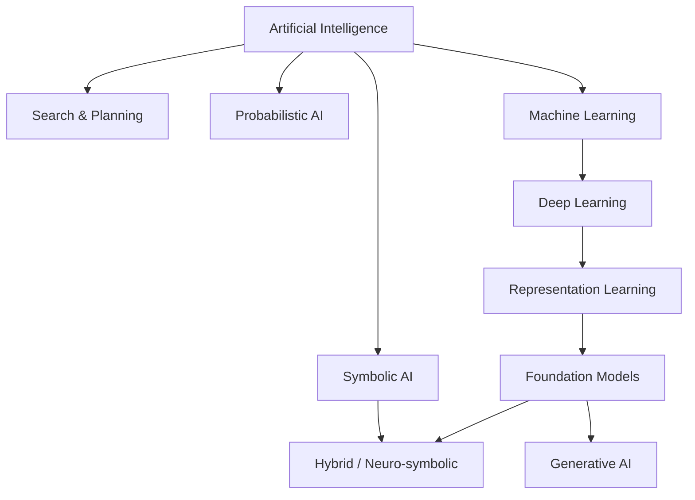

# Lịch sử và các AI Paradigm

> **Mạch đọc:** Đọc **Lịch sử và các AI Paradigm** như một mắt xích của lộ trình học (learning path / 학습 경로) hiện tại, không như một ghi chú tách rời. Nội dung đi từ **Symbolic AI: intelligence như thao tác trên symbol** sang **tìm kiếm (search / 검색) và planning: intelligence như exploration trong không gian (space / 공간) of possibilities**; điểm nối này chuẩn bị câu hỏi cho các mục sau thay vì dừng ở định nghĩa đầu tiên.


Lịch sử Artificial Intelligence (AI / 인공지능) không phải một đường thẳng đi từ “AI yếu” tới “AI mạnh”. Nó giống một chuỗi thay đổi về **cách con người nghĩ rằng intelligence nên được xây dựng**. Mỗi giai đoạn nổi bật một giả định (assumption / 가정) khác nhau: có lúc người ta tin intelligence chủ yếu là lô-gic (logic / 논리); có lúc trọng tâm là tìm kiếm (search / 검색); có lúc là học statistical mẫu (pattern / 패턴) từ dữ liệu (data / 데이터); hiện nay phần lớn frontier các hệ thống (systems / 시스템들) dựa vào large-scale biểu diễn (representation / 표현) học tập (learning / 학습) kết hợp dữ liệu (data / 데이터), compute, tối ưu hóa (optimization / 최적화) và hệ thống (system / 시스템) kỹ thuật (engineering / 엔지니어링).

Hiểu lịch sử theo paradigm hữu ích hơn học thuộc timeline, vì nhiều “ý tưởng cũ” vẫn xuất hiện trong hệ thống (system / 시스템) hiện đại dưới hình thức mới.

## Symbolic AI: intelligence như thao tác trên symbol

Một trong những cách tiếp cận đầu tiên là **Symbolic AI (기호 인공지능 / AI ký hiệu)**. Ý tưởng nền là: nếu kiến thức (knowledge / 지식) có thể được biểu diễn bằng symbol và quy tắc (rule / 규칙), máy có thể thao tác symbol theo lô-gic (logic / 논리) để suy luận.

Ví dụ:

```text
Human(Socrates)
∀x Human(x) → Mortal(x)
------------------------
Mortal(Socrates)
```

Ở đây hệ thống (system / 시스템) không “học” quy tắc (rule / 규칙) từ dữ liệu (data / 데이터). kiến thức (knowledge / 지식) được encode trực tiếp. Strength của symbolic approach là lập luận (reasoning / 추론) rõ ràng, dễ inspect và có ngữ nghĩa (semantics / 의미론) tương đối tường minh (explicit / 명시적).

Nhưng bài toán (problem / 문제) xuất hiện khi world quá lớn, noisy hoặc khó mô tả bằng quy tắc (rule / 규칙). Một hệ thống (system / 시스템) nhận diện mèo từ ảnh không thể dễ dàng dựa vào hàng nghìn quy tắc (rule / 규칙) kiểu “tai nhọn + ria + texture + pose...”. Real world chứa ambiguity, bất định (uncertainty / 불확실성) và enormous variability.

Điều này dẫn tới nhu cầu cho statistical học tập (learning / 학습).

## Tìm kiếm (search / 검색) và planning: intelligence như exploration trong không gian (space / 공간) of possibilities

Nhiều bài toán (problem / 문제) có thể được biểu diễn thành trạng thái (state / 상태) không gian (space / 공간). Chess, tuyến (route / 경로) planning, puzzle solving hoặc scheduling đều có nhiều khả năng, và hệ thống (system / 시스템) cần tìm chuỗi (sequence / 시퀀스) hành động (action / 동작) phù hợp.

Tìm kiếm (search / 검색) paradigm không yêu cầu hệ thống (system / 시스템) phải “hiểu” thế giới giống con người. Nó cần biểu diễn (representation / 표현) của trạng thái (state / 상태), hành động (action / 동작), goal và một chiến lược (strategy / 전략) để explore.

Ví dụ, đường dẫn (path / 경로) finding có thể được mô hình hóa thành đồ thị (graph / 그래프). Một nút (node / 노드) là trạng thái (state / 상태), edge là hành động (action / 동작), chi phí (cost / 비용) là chi phí di chuyển. thuật toán (algorithm / 알고리즘) như A* sử dụng heuristic để ưu tiên những trạng thái (state / 상태) có vẻ hứa hẹn.

Idea này vẫn còn rất sống trong AI hiện đại. Beam tìm kiếm (search / 검색) được dùng trong decoding. Retrieval là một dạng tìm kiếm (search / 검색) trên document/véc-tơ (vector / 벡터) không gian (space / 공간). Planning tác nhân (agent / 에이전트) tìm chuỗi (sequence / 시퀀스) hành động (action / 동작). Một số lập luận (reasoning / 추론) các hệ thống (systems / 시스템들) kết hợp ngôn ngữ (language / 언어) mô hình (model / 모델) với tìm kiếm (search / 검색) cây (tree / 트리).

## Probabilistic AI: intelligence dưới bất định (uncertainty / 불확실성)

Real world hiếm khi deterministic hoàn toàn. Sensor có noise. Diagnosis không chắc chắn. người dùng (user / 사용자) hành vi (behavior / 동작) biến đổi. Vì vậy xác suất (probability / 확률) trở thành một ngôn ngữ (language / 언어) quan trọng của AI.

Thay vì nói “disease chắc chắn xảy ra”, mô hình (model / 모델) có thể biểu diễn:

\[
P(Disease \mid Symptoms)
\]

Probabilistic lập luận (reasoning / 추론) chuyển focus từ quy tắc (rule / 규칙) tuyệt đối sang degree of belief và bất định (uncertainty / 불확실성). Bayesian networks, hidden Markov các mô hình (models / 모델들) và probabilistic graphical các mô hình (models / 모델들) là những ví dụ lớn.

Paradigm này tạo cầu nối mạnh giữa AI và Statistics.

## Machine học tập (learning / 학습): thay vì viết quy tắc (rule / 규칙), hãy học ánh xạ (mapping / 매핑) từ dữ liệu (data / 데이터)

Machine học tập (learning / 학습) thay đổi trung tâm của kỹ thuật (engineering / 엔지니어링) tiến trình (process / 프로세스). Thay vì nhà phát triển (developer / 개발자) định nghĩa trực tiếp mọi quyết định (decision / 결정) quy tắc (rule / 규칙), ta xây mô hình (model / 모델) với parameters và sử dụng dữ liệu (data / 데이터) để điều chỉnh parameters sao cho mục tiêu (objective / 목표) tốt hơn.

Ví dụ tuyến tính (linear / 선형) regression học:

\[
\hat{y} = wx + b
\]

Huấn luyện (training / 학습) tìm `w` và `b` để prediction gần mục tiêu (target / 대상). Neural mạng (network / 네트워크) mở rộng idea này thành hàng triệu hoặc hàng tỷ parameters.

Điểm bản chất là:

> học tập (learning / 학습) không phải magic. Nó là quá trình dùng bằng chứng (evidence / 증거) trong dữ liệu (data / 데이터) để chọn một mô hình (model / 모델) trong hypothesis không gian (space / 공간).

Điều này kéo theo các khái niệm generalization, overfitting, inductive độ lệch (bias / 편향), train/kiểm tra hợp lệ (validation / 검증)/kiểm thử (test / 테스트) split và evaluation.

## Connectionism và Neural Networks

**Connectionism** xem intelligence như emergent hành vi (behavior / 동작) từ mạng các processing units tương tác, lấy cảm hứng lỏng lẻo từ neuron sinh học nhưng không phải bản sao brain.

Neural mạng (network / 네트워크) hiện đại sử dụng differentiable computation đồ thị (graph / 그래프). đầu vào (input / 입력) đi qua nhiều tầng (layer / 계층), tạo prediction, mất mát (loss / 손실) đo lỗi (error / 오류), rồi độ dốc (gradient / 기울기) được propagate ngược để cập nhật (update / 업데이트) parameters.

Deep học tập (learning / 학습) thành công mạnh vì ba yếu tố gặp nhau:

1. dữ liệu (data / 데이터) ở quy mô (scale / 규모) lớn hơn;
2. compute mạnh hơn, đặc biệt GPU;
3. kiến trúc (architecture / 아키텍처) + tối ưu hóa (optimization / 최적화) technique tốt hơn.

Nó không chỉ là “nhiều tầng (layer / 계층) hơn”. Deep mạng (network / 네트워크) đặc biệt mạnh ở **biểu diễn (representation / 표현) học tập (learning / 학습)**: mô hình (model / 모델) tự học intermediate features thay vì phụ thuộc hoàn toàn vào hand-crafted features.

## Biểu diễn (representation / 표현) học tập (learning / 학습): thay đổi câu hỏi từ “tính năng (feature / 기능) nào?” sang “biểu diễn (representation / 표현) nào?”

Trong classical ML, engineer thường thiết kế tính năng (feature / 기능). Với ảnh (image / 이미지), có thể dùng edge detector hoặc hand-crafted descriptor. Deep học tập (learning / 학습) cho phép mô hình (model / 모델) học biểu diễn (representation / 표현) trực tiếp từ raw-ish đầu vào (input / 입력).

Một ảnh (image / 이미지) classifier không chỉ học đầu ra (output / 출력) label; intermediate layers học texture, shape, part và higher-level mẫu (pattern / 패턴). Một ngôn ngữ (language / 언어) mô hình (model / 모델) học véc-tơ (vector / 벡터) biểu diễn (representation / 표현) liên quan tới cú pháp (syntax / 문법), ngữ nghĩa (semantics / 의미론) và ngữ cảnh (context / 맥락).

Đây là bước chuyển rất quan trọng vì nhiều breakthrough hiện đại đến từ việc học được biểu diễn (representation / 표현) tốt.

## Foundation các mô hình (models / 모델들) và quy mô (scale / 규모)

**Foundation mô hình (model / 모델)** là mô hình (model / 모델) được train trên broad dữ liệu (data / 데이터) ở quy mô (scale / 규모) lớn, sau đó có thể adapt cho nhiều downstream tasks.

Large ngôn ngữ (language / 언어) mô hình (model / 모델) là một dạng foundation mô hình (model / 모델) cho ngôn ngữ (language / 언어) và ngày càng multimodal. Thay vì train một mô hình (model / 모델) riêng hoàn toàn cho từng tác vụ (task / 작업), ta pretrain một mô hình (model / 모델) lớn rồi sử dụng prompting, fine-tuning, retrieval hoặc tools.

Paradigm này thay đổi software kiến trúc (architecture / 아키텍처): mô hình (model / 모델) trở thành một reusable năng lực (capability / 역량) tầng (layer / 계층).

## Generative AI

Traditional discriminative mô hình (model / 모델) thường học ánh xạ (mapping / 매핑) kiểu:

\[
P(y \mid x)
\]

Generative modeling cố học phân phối (distribution / 분포) của dữ liệu (data / 데이터) hoặc cách sinh mẫu (sample / 표본) mới. ngôn ngữ (language / 언어) mô hình (model / 모델) học xác suất (probability / 확률) của đơn vị từ (token / 토큰) chuỗi (sequence / 시퀀스); diffusion mô hình (model / 모델) học reverse denoising tiến trình (process / 프로세스) để tạo ảnh (image / 이미지); autoregressive mô hình (model / 모델) sinh đầu ra (output / 출력) từng bước.

Generative AI trở nên nổi bật vì đầu ra (output / 출력) không còn chỉ là lớp (class / 클래스) hoặc score mà có thể là văn bản (text / 텍스트), ảnh (image / 이미지), audio, video, mã (code / 코드) hoặc structured hành động (action / 동작).

## Hybrid và Neuro-symbolic AI

Không có lý do theoretical bắt buộc một hệ thống (system / 시스템) chỉ dùng một paradigm. môi trường vận hành (production / 운영 환경) AI thường hybrid.

Một hệ thống (system / 시스템) có thể dùng:

```text
Neural model → perception / language
Symbolic rules → business constraints
Search → planning
Database / retrieval → factual grounding
Optimizer → resource allocation
```

**Neuro-symbolic AI (신경기호 AI)** nghiên cứu cách kết hợp learned representations với tường minh (explicit / 명시적) lập luận (reasoning / 추론) hoặc structured kiến thức (knowledge / 지식).

Đây là reminder quan trọng rằng “deep học tập (learning / 학습) thắng symbolic AI” là cách kể lịch sử quá đơn giản. Different mechanisms phù hợp different subproblems.

## AI winters và bài học về expectation

Lịch sử AI có các giai đoạn funding và optimism tăng mạnh, sau đó giảm khi hệ thống (system / 시스템) không đạt expectation. Những giai đoạn này thường được gọi là **AI winter**.

Bài học không phải “AI luôn hype”. Bài học tốt hơn là phân biệt:

- năng lực (capability / 역량) đã được demonstrated;
- benchmark hiệu năng (performance / 성능);
- real-world độ tin cậy (reliability / 신뢰성);
- economic feasibility;
- claim về tương lai.

Một mô hình (model / 모델) có thể đạt benchmark cao nhưng vẫn chưa production-ready vì độ trễ (latency / 지연 시간), chi phí (cost / 비용), robustness hoặc an toàn (safety / 안전).

## Paradigm map

Phần này chuyển khái niệm Computer Science thành cấu trúc, ví dụ hoặc quy trình có thể kiểm tra. Hãy xác định câu hỏi mà mục trả lời rồi nối kết luận với phần kế tiếp.


```mermaid
flowchart TD
    AI[Artificial Intelligence]
    AI --> SYM[Symbolic AI]
    AI --> SEARCH[Search & Planning]
    AI --> PROB[Probabilistic AI]
    AI --> ML[Machine Learning]
    ML --> DL[Deep Learning]
    DL --> REP[Representation Learning]
    REP --> FM[Foundation Models]
    FM --> GEN[Generative AI]
    SYM --> HYB[Hybrid / Neuro-symbolic]
    FM --> HYB
```

Sơ đồ này không phải hierarchy lịch sử tuyệt đối. Nhiều branch overlap và coexist.

## Mô hình tư duy (mental model / 사고 모델)

Khi gặp một AI technique mới, thay vì hỏi “đây là generation mới nhất chưa?”, hãy hỏi bốn câu:

1. **kiến thức (knowledge / 지식) nằm ở đâu?** Trong quy tắc (rule / 규칙), parameters, cơ sở dữ liệu (database / 데이터베이스), bộ nhớ (memory / 메모리) hay môi trường (environment / 환경)?
2. **Computation chính là gì?** tìm kiếm (search / 검색), suy luận (inference / 추론), tối ưu hóa (optimization / 최적화), sampling hay ma trận (matrix / 행렬) operations?
3. **hệ thống (system / 시스템) học bằng gì?** Không học, supervised tín hiệu (signal / 신호), self-supervised mục tiêu (objective / 목표) hay reward?
4. **bất định (uncertainty / 불확실성) được xử lý ra sao?** Bỏ qua, quy tắc (rule / 규칙) deterministic, xác suất (probability / 확률) phân phối (distribution / 분포) hay sampling?

Bốn câu này thường đủ để đặt một technique mới vào kiến thức (knowledge / 지식) đồ thị (graph / 그래프).

## Liên kết (connection / 연결) với AI hiện đại

Một LLM ứng dụng (application / 애플리케이션) tưởng rất mới nhưng có thể chứa nhiều paradigm cùng lúc:

```text
LLM parameters          → learned statistical representation
Vector retrieval        → search
System prompt            → explicit instruction
Tool schema              → symbolic structure
Agent planning           → search / planning
Business validation      → deterministic rules
Human feedback           → learning signal
```

Vì vậy hiểu lịch sử paradigm giúp nhìn hệ thống (system / 시스템) hiện đại rõ hơn: hiện đại (modern / 현대적) AI không xóa sạch những idea cũ, mà thường recombine chúng ở quy mô (scale / 규모) và biểu diễn (representation / 표현) mới.

Xem tiếp: [Intelligence, Agents and Environments](./02_intelligence_agents_and_environments.md).
