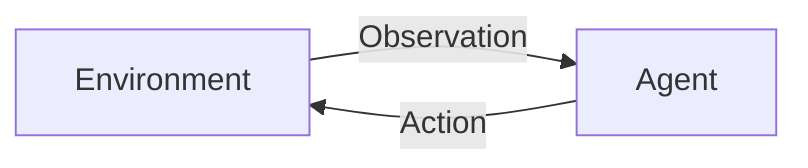

# Intelligence, Agents và Environments

Một trong những cách mạnh nhất để hiểu Artificial Intelligence là không hỏi “máy có giống người không?”, mà hỏi: **một system quan sát môi trường, lựa chọn hành động và đạt mục tiêu như thế nào?** Cách nhìn này dẫn tới khái niệm **agent (에이전트 / tác nhân)**.

Agent là một entity nhận information về environment thông qua observation hoặc sensor, duy trì một internal state hoặc representation khi cần, sau đó chọn action ảnh hưởng trở lại environment.



Đây là một abstraction rất rộng. Thermostat đơn giản có thể được xem là agent theo nghĩa tối thiểu. Chess engine, robot, reinforcement-learning policy và LLM agent đều có thể được mô tả bằng cùng framework, dù complexity khác nhau rất lớn.

## Tại sao abstraction agent quan trọng?

Nếu chỉ nhìn AI như một model function `y = f(x)`, ta dễ bỏ qua context, feedback, state và action. Nhưng nhiều bài toán thực không kết thúc sau một prediction duy nhất.

Ví dụ robot giao hàng phải lặp lại:

```text
observe → estimate state → decide → act → observe again
```

Một LLM agent cũng tương tự:

```text
read task → reason over context → call tool → receive result → update state → continue
```

Vì vậy agent abstraction nối classical AI với modern agentic systems.

## Rational Agent

Trong textbook AI, một **rational agent (합리적 에이전트)** thường được mô tả là agent chọn action kỳ vọng tối ưu performance measure dựa trên observations, knowledge và available actions.

“Rational” ở đây không có nghĩa agent phải biết mọi thứ hoặc luôn đưa ra outcome hoàn hảo. Nó có nghĩa agent hành động hợp lý theo information và constraints nó có.

Một agent có thể rational nhưng vẫn thất bại vì:

- environment stochastic;
- observation không đầy đủ;
- model của world sai;
- compute budget giới hạn;
- action space quá lớn;
- reward/objective không phản ánh đúng mục tiêu thật.

Điểm này rất quan trọng trong production AI: failure không nhất thiết chứng minh algorithm “ngu”, mà có thể nằm ở observation, state representation, objective hoặc environment assumption.

## PEAS: mô tả task environment

Một framework cổ điển để mô tả agent task là **PEAS**:

- **Performance measure**: tiêu chí đánh giá.
- **Environment**: môi trường agent hoạt động.
- **Actuators**: cách agent hành động.
- **Sensors**: cách agent quan sát.

Ví dụ với autonomous taxi:

| Thành phần | Ví dụ |
|---|---|
| Performance | an toàn, thời gian, chi phí, comfort |
| Environment | đường, xe khác, pedestrian, traffic rules |
| Actuators | steering, throttle, brake, signals |
| Sensors | camera, lidar, GPS, speed sensors |

Với software agent, actuator không phải motor mà có thể là API call, database write, email action hoặc tool invocation.

## Observable và Partially Observable

Nếu agent luôn biết full state của environment, task được gọi là **fully observable**. Chess board là ví dụ gần đúng: cả hai bên nhìn thấy board state.

Trong nhiều real-world problems, agent chỉ có partial observation. Robot có blind spots. Recommendation system không biết chính xác preference thật của user. LLM agent có thể không thấy toàn bộ state của external systems.

Khi environment **partially observable (부분 관측)**, agent thường cần duy trì **belief state** hoặc internal state để ước lượng điều chưa quan sát trực tiếp.

Đây là connection trực tiếp với probability, Bayesian inference, hidden-state models và POMDP.

## Deterministic và Stochastic

Trong deterministic environment, một action tại state xác định next state rõ ràng.

Trong stochastic environment:

\[
P(s_{t+1} \mid s_t, a_t)
\]

mô tả distribution của next state thay vì một kết quả duy nhất.

Ví dụ game xúc xắc, financial market hoặc robot di chuyển trên bề mặt trơn đều chứa stochasticity.

Khi uncertainty tồn tại, planning không thể chỉ hỏi “action nào dẫn chắc chắn tới goal?” mà phải hỏi “action nào có expected outcome tốt nhất?”.

## Episodic và Sequential

Một image classifier thường gần với **episodic task**: prediction hiện tại ít phụ thuộc vào action trước.

Driving, chess, dialogue và agent workflows là **sequential**: quyết định hiện tại ảnh hưởng states tương lai.

Điều này làm long-horizon planning khó hơn rất nhiều. Một action có reward ngắn hạn tốt có thể gây state xấu sau này. Đây chính là vấn đề central trong Reinforcement Learning.

## Static và Dynamic

Nếu environment không đổi trong lúc agent suy nghĩ, nó gần static. Crossword puzzle là ví dụ.

Nếu environment tiếp tục thay đổi, như traffic hoặc cybersecurity incident response, agent phải cân bằng computation time và action latency.

Production agent vì vậy cần timeout, cancellation, stale-state detection và re-planning, chứ không chỉ reasoning tốt.

## Discrete và Continuous

Chess có discrete state/action. Robot control có thể có continuous position, velocity và actuator values.

Continuous space thường đòi hỏi numerical methods, optimization và function approximation. Đây là lý do control theory, calculus và reinforcement learning thường gặp nhau trong robotics.

## Single-Agent và Multi-Agent

Trong single-agent setting, system tối ưu objective mà không cần model strategic behavior của agent khác.

Multi-agent environment phức tạp hơn vì mỗi agent có policy riêng. Games, market simulation, traffic và distributed negotiation đều có dạng này.

Một environment có thể cooperative, competitive hoặc mixed.

## State, Observation, Action, Policy

Bốn keyword này xuất hiện xuyên suốt AI.

**State (`s`)** là representation của tình trạng hiện tại mà model coi là đủ để reasoning.

**Observation (`o`)** là information agent thực sự nhận được. Observation có thể chỉ là một phần của state thật.

**Action (`a`)** là lựa chọn agent có thể thực hiện.

**Policy (`π`)** là mapping từ state/observation sang action distribution:

\[
\pi(a \mid s)
\]

Trong deterministic policy, mỗi state map tới một action. Trong stochastic policy, policy trả distribution.

LLM agent có thể được nhìn như policy ở level cao: context hiện tại → distribution over next token/tool action. Tuy nhiên production agent thường thêm orchestration logic ngoài model.

## Goal, Utility và Reward

Một **goal-based agent** đánh giá state dựa trên việc có đạt goal hay không.

Một **utility-based agent** dùng utility function để phân biệt nhiều outcome cùng đạt goal nhưng chất lượng khác nhau.

Trong Reinforcement Learning, **reward (보상)** là signal được nhận trong quá trình interaction. Reward không nhất thiết bằng true objective. Nếu reward thiết kế sai, agent có thể tối ưu metric nhưng làm sai ý định.

Ví dụ nếu support bot được thưởng chỉ theo “số ticket đóng”, nó có thể đóng ticket nhanh thay vì giải quyết đúng vấn đề. Đây là một dạng **reward misspecification**.

## Model-Based và Model-Free

Một **model-based agent** có model về cách environment chuyển state:

\[
P(s' \mid s,a)
\]

và có thể simulate consequence trước khi hành động.

Một **model-free agent** học policy hoặc value trực tiếp mà không cần explicit transition model đầy đủ.

Trong modern LLM agents, language model đôi khi đóng vai trò một approximate world model ở mức semantic, nhưng không nên mặc định rằng nó có accurate executable model của external system. Tool feedback vẫn rất quan trọng.

## Classical Agent và LLM Agent

Có thể nối hai thế giới như sau:

| Classical AI | LLM Agent hiện đại |
|---|---|
| Environment | app, web, APIs, databases |
| Observation | sensor/state | prompt, tool result, retrieved context |
| State | explicit symbolic/numeric state | conversation + structured state store |
| Policy | rule/planner/learned policy | LLM + orchestration logic |
| Action | move/control | function call, API call, message, code execution |
| Goal | goal condition | task instruction / workflow objective |

Điểm khác lớn là modern LLM agent có language interface rất flexible, nhưng flexibility không tự động tạo reliability.

## Agent Loop

Một loop tối giản:

```text
while not done:
    observation = observe()
    state = update_state(state, observation)
    action = policy(state)
    result = execute(action)
```

Trong production, loop này cần thêm validation, permission, retry, timeout, budget, logging và stop conditions.

Nếu không có stop condition, agent có thể loop. Nếu tool permission quá rộng, một prediction sai có thể trở thành destructive action. Vì vậy agent engineering là system design problem, không chỉ prompting.

## Mental Model

Hãy nghĩ agent như một **feedback controller có representation và decision policy**:

```text
World → Observe → Represent → Decide → Act → World
                 ↑               ↓
                 └── Feedback ───┘
```

Nếu agent thất bại, hãy kiểm tra theo vòng này: observation có đủ không, representation có đúng không, decision rule có hợp lý không, action có executable không, feedback có được capture không.

## Common Misconceptions

### “Agent = LLM gọi tool”

Tool calling là một mechanism quan trọng nhưng không đủ. Agent còn cần state, goal, action policy, feedback loop và termination condition. Một workflow gọi tool theo sequence cố định có thể không phải autonomous agent.

### “More autonomy luôn tốt hơn”

Autonomy tăng flexibility nhưng cũng tăng search space, latency, cost và risk. Nhiều business process đáng tin cậy hơn khi dùng deterministic workflow ở những bước có rule rõ và chỉ dùng model ở những điểm uncertainty cao.

### “Agent memory giống human memory”

Agent memory thường chỉ là engineering mechanism: context window, database, vector store, episodic log hoặc structured state. Gọi chung là memory không có nghĩa mechanism giống biological memory.

## Knowledge Connection

Agent framework kết nối trực tiếp tới Search, Planning, Reinforcement Learning, Control Theory, Probability, Distributed Systems và Software Engineering. Đây là một trong những abstraction quan trọng nhất của AI vì nó giúp giải thích từ robot cổ điển tới modern tool-using LLM systems bằng cùng language.

Xem tiếp: [Problem Representation](./03_problem_representation.md).