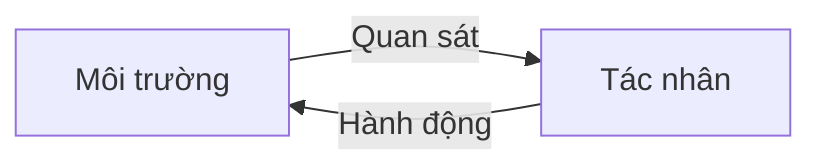

# Trí thông minh, tác nhân và môi trường

Một trong những cách mạnh nhất để hiểu **trí tuệ nhân tạo (Artificial Intelligence - AI)** là không hỏi “máy có giống con người không?”, mà hỏi: **một hệ thống quan sát môi trường, lựa chọn hành động và đạt mục tiêu như thế nào?** Cách nhìn này dẫn tới khái niệm **tác nhân (agent / 에이전트)**.

Tác nhân là một thực thể nhận thông tin về **môi trường (environment)** thông qua quan sát hoặc cảm biến, duy trì **trạng thái nội bộ (internal state)** hoặc biểu diễn khi cần, sau đó chọn **hành động (action)** để tác động trở lại môi trường.



Đây là một phép trừu tượng hóa rất rộng. Bộ điều nhiệt đơn giản có thể được xem là tác nhân theo nghĩa tối thiểu. Máy chơi cờ, robot, chính sách học tăng cường và tác nhân LLM đều có thể được mô tả bằng cùng khung tư duy, dù độ phức tạp khác nhau rất lớn.

## Tại sao khái niệm tác nhân quan trọng?

Nếu chỉ nhìn AI như một hàm mô hình `y = f(x)`, ta dễ bỏ qua ngữ cảnh, phản hồi, trạng thái và hành động. Nhưng nhiều bài toán thực tế không kết thúc sau một dự đoán duy nhất.

Ví dụ robot giao hàng phải lặp lại:

```text
quan sát → ước lượng trạng thái → quyết định → hành động → quan sát lại
```

Một tác nhân LLM cũng có vòng lặp tương tự:

```text
đọc nhiệm vụ → suy luận trên ngữ cảnh → gọi công cụ
→ nhận kết quả → cập nhật trạng thái → tiếp tục
```

Vì vậy, phép trừu tượng tác nhân nối AI cổ điển với các hệ thống tác nhân hiện đại (agentic systems).

## Tác nhân hợp lý (rational agent)

Trong giáo trình AI cổ điển, **tác nhân hợp lý (rational agent / 합리적 에이전트)** thường được mô tả là tác nhân chọn hành động có kỳ vọng tối ưu theo tiêu chí đánh giá, dựa trên những quan sát, tri thức và hành động mà nó có thể sử dụng.

“Hợp lý” ở đây không có nghĩa tác nhân phải biết mọi thứ hoặc luôn tạo ra kết quả hoàn hảo. Nó có nghĩa tác nhân hành động hợp lý theo thông tin và ràng buộc đang có.

Một tác nhân vẫn có thể thất bại dù lựa chọn hợp lý nếu:

- môi trường có tính ngẫu nhiên;
- quan sát không đầy đủ;
- mô hình thế giới bị sai;
- ngân sách tính toán bị giới hạn;
- không gian hành động quá lớn;
- phần thưởng hoặc hàm mục tiêu không phản ánh đúng mục tiêu thực.

Điểm này rất quan trọng trong hệ thống AI vận hành thực tế: thất bại không nhất thiết chứng minh thuật toán “ngu”, mà có thể xuất phát từ quan sát, cách biểu diễn trạng thái, hàm mục tiêu hoặc giả định sai về môi trường.

## PEAS: mô tả môi trường nhiệm vụ

Một khung cổ điển để mô tả nhiệm vụ của tác nhân là **PEAS**:

- **Tiêu chí đánh giá (Performance measure)**: hệ thống được xem là tốt khi nào.
- **Môi trường (Environment)**: nơi tác nhân hoạt động.
- **Bộ chấp hành (Actuators)**: cách tác nhân tác động lên môi trường.
- **Cảm biến (Sensors)**: cách tác nhân nhận thông tin.

Ví dụ với xe tự hành:

| Thành phần | Ví dụ |
|---|---|
| Tiêu chí đánh giá | an toàn, thời gian, chi phí, độ thoải mái |
| Môi trường | đường, xe khác, người đi bộ, luật giao thông |
| Bộ chấp hành | vô lăng, ga, phanh, đèn tín hiệu |
| Cảm biến | camera, lidar, GPS, cảm biến tốc độ |

Với tác nhân phần mềm, bộ chấp hành không phải động cơ mà có thể là gọi API, ghi cơ sở dữ liệu, gửi email hoặc gọi công cụ.

## Quan sát đầy đủ và quan sát một phần

Nếu tác nhân luôn biết toàn bộ trạng thái liên quan của môi trường, nhiệm vụ gần với **quan sát đầy đủ (fully observable)**. Bàn cờ vua là một ví dụ gần đúng: cả hai bên đều nhìn thấy trạng thái bàn cờ.

Trong nhiều bài toán thế giới thực, tác nhân chỉ nhận được **quan sát một phần (partially observable / 부분 관측)**. Robot có điểm mù. Hệ thống gợi ý không biết chính xác sở thích thật của người dùng. Tác nhân LLM có thể không nhìn thấy toàn bộ trạng thái của hệ thống bên ngoài.

Khi môi trường chỉ quan sát được một phần, tác nhân thường cần duy trì **trạng thái niềm tin (belief state)** hoặc trạng thái nội bộ để ước lượng những gì chưa thể quan sát trực tiếp.

Đây là liên kết trực tiếp tới xác suất, suy luận Bayes, mô hình trạng thái ẩn và **quá trình quyết định Markov quan sát một phần (POMDP)**.

## Môi trường xác định và môi trường ngẫu nhiên

Trong **môi trường xác định (deterministic environment)**, một hành động tại một trạng thái xác định rõ trạng thái tiếp theo.

Trong **môi trường ngẫu nhiên (stochastic environment)**:

\[
P(s_{t+1} \mid s_t, a_t)
\]

mô tả phân phối của trạng thái tiếp theo thay vì một kết quả duy nhất.

Trò chơi dùng xúc xắc, thị trường tài chính hoặc robot di chuyển trên bề mặt trơn đều chứa tính ngẫu nhiên.

Khi có bất định, lập kế hoạch không thể chỉ hỏi “hành động nào chắc chắn dẫn tới mục tiêu?”, mà phải hỏi “hành động nào có kết quả kỳ vọng tốt nhất?”.

## Nhiệm vụ độc lập từng lượt và nhiệm vụ tuần tự

Một mô hình phân loại ảnh gần với **nhiệm vụ độc lập từng lượt (episodic task)**: dự đoán hiện tại thường ít phụ thuộc vào hành động trước đó.

Lái xe, cờ vua, hội thoại và luồng công việc của tác nhân là **nhiệm vụ tuần tự (sequential task)**: quyết định hiện tại ảnh hưởng tới trạng thái tương lai.

Điều này khiến lập kế hoạch dài hạn khó hơn nhiều. Một hành động có phần thưởng ngắn hạn tốt có thể dẫn tới trạng thái xấu trong tương lai. Đây là vấn đề trung tâm của học tăng cường (Reinforcement Learning - RL).

## Môi trường tĩnh và môi trường động

Nếu môi trường không thay đổi trong lúc tác nhân suy nghĩ, nó gần với **môi trường tĩnh (static)**. Trò chơi ô chữ là ví dụ điển hình.

Nếu môi trường vẫn tiếp tục thay đổi, như giao thông hoặc xử lý sự cố an ninh mạng, tác nhân phải cân bằng thời gian tính toán và độ trễ hành động.

Vì vậy tác nhân trong môi trường thực tế cần giới hạn thời gian (timeout), khả năng hủy, phát hiện trạng thái đã cũ và lập kế hoạch lại, chứ không chỉ cần suy luận tốt.

## Không gian rời rạc và liên tục

Cờ vua có trạng thái và hành động rời rạc. Điều khiển robot có thể sử dụng vị trí, vận tốc và giá trị bộ chấp hành liên tục.

Không gian liên tục thường đòi hỏi phương pháp số, tối ưu hóa và xấp xỉ hàm. Đây là lý do lý thuyết điều khiển, giải tích và học tăng cường thường gặp nhau trong robotics.

## Một tác nhân và nhiều tác nhân

Trong **môi trường một tác nhân (single-agent)**, hệ thống tối ưu mục tiêu mà không cần mô hình hóa hành vi chiến lược của tác nhân khác.

**Môi trường nhiều tác nhân (multi-agent)** phức tạp hơn vì mỗi tác nhân có chính sách riêng. Trò chơi, mô phỏng thị trường, giao thông và thương lượng phân tán đều có dạng này.

Các tác nhân có thể hợp tác, cạnh tranh hoặc vừa hợp tác vừa cạnh tranh.

## Trạng thái, quan sát, hành động và chính sách

Bốn thuật ngữ này xuất hiện xuyên suốt AI.

**Trạng thái (state, `s`)** là biểu diễn tình trạng hiện tại mà mô hình coi là đủ để ra quyết định hoặc suy luận.

**Quan sát (observation, `o`)** là thông tin tác nhân thực sự nhận được. Quan sát có thể chỉ phản ánh một phần trạng thái thật.

**Hành động (action, `a`)** là lựa chọn tác nhân có thể thực hiện.

**Chính sách (policy, `π`)** là ánh xạ từ trạng thái hoặc quan sát sang phân phối hành động:

\[
\pi(a \mid s)
\]

Với chính sách xác định, mỗi trạng thái ánh xạ tới một hành động. Với chính sách ngẫu nhiên, chính sách trả về một phân phối xác suất trên các hành động.

Tác nhân LLM có thể được xem như một chính sách ở mức trừu tượng cao: ngữ cảnh hiện tại dẫn tới phân phối trên token hoặc hành động công cụ tiếp theo. Tuy nhiên, hệ thống thực tế thường thêm lớp điều phối (orchestration) bên ngoài mô hình.

## Mục tiêu, độ hữu dụng và phần thưởng

**Tác nhân dựa trên mục tiêu (goal-based agent)** đánh giá trạng thái dựa trên việc mục tiêu đã đạt hay chưa.

**Tác nhân dựa trên độ hữu dụng (utility-based agent)** dùng hàm hữu dụng để phân biệt nhiều kết quả cùng đạt mục tiêu nhưng có chất lượng khác nhau.

Trong học tăng cường, **phần thưởng (reward / 보상)** là tín hiệu nhận được trong quá trình tương tác. Phần thưởng không nhất thiết bằng mục tiêu thật. Nếu phần thưởng được thiết kế sai, tác nhân có thể tối ưu đúng chỉ số nhưng làm sai ý định ban đầu.

Ví dụ, nếu bot hỗ trợ chỉ được thưởng theo “số yêu cầu đã đóng”, nó có thể đóng yêu cầu thật nhanh thay vì giải quyết đúng vấn đề. Đây là **đặc tả sai phần thưởng (reward misspecification)**.

## Tác nhân có mô hình và không có mô hình

**Tác nhân dựa trên mô hình (model-based agent)** có mô hình về cách môi trường chuyển trạng thái:

\[
P(s' \mid s,a)
\]

Nhờ đó nó có thể mô phỏng hậu quả trước khi hành động.

**Tác nhân không dựa trên mô hình (model-free agent)** học trực tiếp chính sách hoặc hàm giá trị mà không cần một mô hình chuyển trạng thái tường minh đầy đủ.

Trong tác nhân LLM hiện đại, mô hình ngôn ngữ đôi khi đóng vai trò như một mô hình thế giới xấp xỉ ở mức ngữ nghĩa. Tuy nhiên, không nên mặc định rằng LLM có mô hình thực thi chính xác của hệ thống bên ngoài. Phản hồi từ công cụ vẫn rất quan trọng.

## Tác nhân AI cổ điển và tác nhân LLM

| AI cổ điển | Tác nhân LLM hiện đại |
|---|---|
| Môi trường | ứng dụng, web, API, cơ sở dữ liệu |
| Quan sát | cảm biến / trạng thái | lời nhắc, kết quả công cụ, ngữ cảnh truy xuất |
| Trạng thái | trạng thái ký hiệu hoặc số rõ ràng | hội thoại + kho trạng thái có cấu trúc |
| Chính sách | quy tắc / bộ lập kế hoạch / chính sách đã học | LLM + logic điều phối |
| Hành động | di chuyển / điều khiển | gọi hàm, gọi API, gửi thông điệp, thực thi mã |
| Mục tiêu | điều kiện đích | chỉ dẫn nhiệm vụ / mục tiêu luồng công việc |

Khác biệt lớn là tác nhân LLM có giao diện ngôn ngữ rất linh hoạt, nhưng tính linh hoạt không tự động tạo ra độ tin cậy.

## Vòng lặp tác nhân (agent loop)

Một vòng lặp tối giản:

```text
while not done:
    observation = observe()
    state = update_state(state, observation)
    action = policy(state)
    result = execute(action)
```

Trong hệ thống thực tế, vòng lặp này cần thêm kiểm tra hợp lệ, quyền hạn, thử lại, giới hạn thời gian, ngân sách, nhật ký và điều kiện dừng.

Nếu không có điều kiện dừng, tác nhân có thể lặp vô hạn. Nếu quyền công cụ quá rộng, một dự đoán sai có thể biến thành hành động gây thiệt hại. Vì vậy **kỹ nghệ tác nhân (agent engineering)** là bài toán thiết kế hệ thống, không chỉ là viết lời nhắc.

## Mô hình tư duy (mental model)

Hãy nghĩ tác nhân như một **bộ điều khiển phản hồi (feedback controller)** có biểu diễn và chính sách ra quyết định:

```text
Thế giới → Quan sát → Biểu diễn → Quyết định → Hành động → Thế giới
                       ↑                      ↓
                       └────── Phản hồi ──────┘
```

Nếu tác nhân thất bại, hãy kiểm tra theo vòng này: quan sát có đủ không, biểu diễn có đúng không, quy tắc quyết định có hợp lý không, hành động có thực thi được không, và phản hồi có được ghi nhận không.

## Các hiểu lầm thường gặp

### “Agent = LLM gọi công cụ”

Gọi công cụ (tool calling) là một cơ chế quan trọng nhưng chưa đủ. Tác nhân còn cần trạng thái, mục tiêu, chính sách hành động, vòng phản hồi và điều kiện kết thúc. Một luồng công việc gọi công cụ theo chuỗi cố định có thể không phải tác nhân tự chủ.

### “Tự chủ càng nhiều luôn càng tốt”

Mức tự chủ cao làm tăng tính linh hoạt nhưng cũng mở rộng không gian tìm kiếm, tăng độ trễ, chi phí và rủi ro. Nhiều quy trình nghiệp vụ đáng tin cậy hơn khi dùng luồng công việc xác định ở những bước có quy tắc rõ, và chỉ dùng mô hình ở nơi có độ bất định cao.

### “Bộ nhớ tác nhân giống trí nhớ con người”

Bộ nhớ tác nhân thường chỉ là một cơ chế kỹ thuật: cửa sổ ngữ cảnh, cơ sở dữ liệu, kho vector, nhật ký sự kiện hoặc kho trạng thái có cấu trúc. Dùng chung từ “bộ nhớ” không có nghĩa cơ chế đó giống trí nhớ sinh học.

## Liên kết kiến thức

Khái niệm tác nhân kết nối trực tiếp với tìm kiếm, lập kế hoạch, học tăng cường, lý thuyết điều khiển, xác suất, hệ thống phân tán và kỹ nghệ phần mềm. Đây là một trong những phép trừu tượng quan trọng nhất của AI vì nó giúp giải thích từ robot cổ điển tới hệ thống LLM sử dụng công cụ bằng cùng một ngôn ngữ khái niệm.

Xem tiếp: [Biểu diễn bài toán](./03_problem_representation.md).