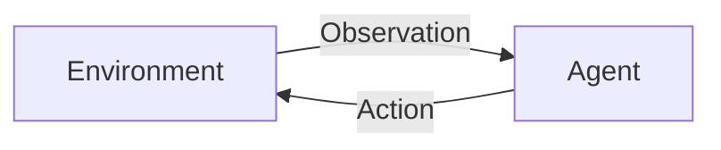

# Intelligence, Agents và Environments

> **Mạch đọc:** [README](../README.md) là bản đồ owner của **Intelligence, agents và environments**. Route đi từ agent abstraction → observations/actions → rationality/utility → environment uncertainty/feedback → evaluation, để năng lực tác nhân được nối với môi trường và mục tiêu.

Một trong những cách mạnh nhất để hiểu Artificial Intelligence là không hỏi “máy có giống người không?”, mà hỏi: **một hệ thống (system / 시스템) quan sát môi trường, lựa chọn hành động và đạt mục tiêu như thế nào?** Cách nhìn này dẫn tới khái niệm **tác nhân (agent / 에이전트)**.

Tác nhân (agent / 에이전트) là một thực thể (entity / 엔터티) nhận thông tin (information / 정보) về môi trường (environment / 환경) thông qua observation hoặc sensor, duy trì một trạng thái nội bộ (internal state / 내부 상태) hoặc biểu diễn (representation / 표현) khi cần, sau đó chọn hành động (action / 동작) ảnh hưởng trở lại môi trường (environment / 환경).


```mermaid
flowchart LR
    E[Environment] -->|Observation| A[Agent]
    A -->|Action| E
```

Đây là một lớp trừu tượng (abstraction / 추상화) rất rộng. Thermostat đơn giản có thể được xem là tác nhân (agent / 에이전트) theo nghĩa tối thiểu. Chess engine, robot, reinforcement-learning chính sách (policy / 정책) và LLM tác nhân (agent / 에이전트) đều có thể được mô tả bằng cùng khung phần mềm (framework / 프레임워크), dù độ phức tạp (complexity / 복잡도) khác nhau rất lớn.

## Tại sao lớp trừu tượng (abstraction / 추상화) tác nhân (agent / 에이전트) quan trọng?

Nếu chỉ nhìn AI như một mô hình (model / 모델) hàm (function / 함수) `y = f(x)`, ta dễ bỏ qua ngữ cảnh (context / 맥락), phản hồi (feedback / 피드백), trạng thái (state / 상태) và hành động (action / 동작). Nhưng nhiều bài toán thực không kết thúc sau một prediction duy nhất.

Ví dụ robot giao hàng phải lặp lại:

```text
observe → estimate state → decide → act → observe again
```

Một LLM tác nhân (agent / 에이전트) cũng tương tự:

```text
read task → reason over context → call tool → receive result → update state → continue
```

Vì vậy tác nhân (agent / 에이전트) lớp trừu tượng (abstraction / 추상화) nối classical AI với hiện đại (modern / 현대적) agentic các hệ thống (systems / 시스템들).

> **Chuyển mạch:** Trong **Intelligence, Agents và Environments**, **Rational tác nhân (agent / 에이전트)** tiếp nhận điểm tựa từ **Tại sao lớp trừu tượng (abstraction / 추상화) tác nhân (agent / 에이전트) quan trọng?** nhưng đổi góc nhìn sang câu hỏi của chính nó; đọc liền hai mục để thấy mối quan hệ đó. Từ đây, **PEAS: mô tả tác vụ (task / 작업) môi trường (environment / 환경)** sẽ cho biết hệ quả hoặc giới hạn ấy hiện ra ở đâu.

## Rational tác nhân (agent / 에이전트)

Trong textbook AI, một **rational tác nhân (agent / 에이전트)** thường được mô tả là tác nhân (agent / 에이전트) chọn hành động (action / 동작) kỳ vọng tối ưu hiệu năng (performance / 성능) measure dựa trên observations, kiến thức (knowledge / 지식) và available actions.

“Rational” ở đây không có nghĩa tác nhân (agent / 에이전트) phải biết mọi thứ hoặc luôn đưa ra kết quả (outcome / 결과) hoàn hảo. Nó có nghĩa tác nhân (agent / 에이전트) hành động hợp lý theo thông tin (information / 정보) và các ràng buộc (constraints / 제약조건들) nó có.

Một tác nhân (agent / 에이전트) có thể rational nhưng vẫn thất bại vì:

- môi trường (environment / 환경) stochastic;
- observation không đầy đủ;
- mô hình (model / 모델) của world sai;
- compute ngân sách (budget / 예산) giới hạn;
- hành động (action / 동작) không gian (space / 공간) quá lớn;
- reward/mục tiêu (objective / 목표) không phản ánh đúng mục tiêu thật.

Điểm này rất quan trọng trong môi trường vận hành (production / 운영 환경) AI: thất bại (failure / 실패) không nhất thiết chứng minh thuật toán (algorithm / 알고리즘) “ngu”, mà có thể nằm ở observation, trạng thái (state / 상태) biểu diễn (representation / 표현), mục tiêu (objective / 목표) hoặc môi trường (environment / 환경) giả định (assumption / 가정).

> **Chuyển mạch:** Ở chặng này của **Intelligence, Agents và Environments**, **PEAS: mô tả tác vụ (task / 작업) môi trường (environment / 환경)** tiếp nhận điểm tựa từ **Rational tác nhân (agent / 에이전트)** nhưng đổi góc nhìn sang câu hỏi của chính nó; đọc liền hai mục để thấy mối quan hệ đó. Từ đây, **Observable và Partially Observable** sẽ cho biết hệ quả hoặc giới hạn ấy hiện ra ở đâu.

## PEAS: mô tả tác vụ (task / 작업) môi trường (environment / 환경)

Một khung phần mềm (framework / 프레임워크) cổ điển để mô tả tác nhân (agent / 에이전트) tác vụ (task / 작업) là **PEAS**:

- **hiệu năng (performance / 성능) measure**: tiêu chí đánh giá.
- **môi trường (environment / 환경)**: môi trường tác nhân (agent / 에이전트) hoạt động.
- **Actuators**: cách tác nhân (agent / 에이전트) hành động.
- **Sensors**: cách tác nhân (agent / 에이전트) quan sát.

Ví dụ với autonomous taxi:

| Thành phần | Ví dụ |
|---|---|
| hiệu năng (performance / 성능) | an toàn, thời gian, chi phí, comfort |
| môi trường (environment / 환경) | đường, xe khác, pedestrian, traffic rules |
| Actuators | steering, throttle, brake, signals |
| Sensors | camera, lidar, GPS, speed sensors |

Với software tác nhân (agent / 에이전트), actuator không phải motor mà có thể là API lời gọi (call / 호출), cơ sở dữ liệu (database / 데이터베이스) ghi (write / 쓰기), email hành động (action / 동작) hoặc công cụ (tool / 도구) invocation.

> **Chuyển mạch:** Đặt trong câu hỏi lớn của **Intelligence, Agents và Environments**, **Observable và Partially Observable** tiếp nhận điểm tựa từ **PEAS: mô tả tác vụ (task / 작업) môi trường (environment / 환경)** nhưng đổi góc nhìn sang câu hỏi của chính nó; đọc liền hai mục để thấy mối quan hệ đó. Từ đây, **Deterministic và Stochastic** sẽ cho biết hệ quả hoặc giới hạn ấy hiện ra ở đâu.

## Observable và Partially Observable

Nếu tác nhân (agent / 에이전트) luôn biết full trạng thái (state / 상태) của môi trường (environment / 환경), tác vụ (task / 작업) được gọi là **fully observable**. Chess board là ví dụ gần đúng: cả hai bên nhìn thấy board trạng thái (state / 상태).

Trong nhiều real-world problems, tác nhân (agent / 에이전트) chỉ có partial observation. Robot có blind spots. Recommendation hệ thống (system / 시스템) không biết chính xác preference thật của người dùng (user / 사용자). LLM tác nhân (agent / 에이전트) có thể không thấy toàn bộ trạng thái (state / 상태) của bên ngoài (external / 외부) các hệ thống (systems / 시스템들).

Khi môi trường (environment / 환경) **partially observable (부분 관측)**, tác nhân (agent / 에이전트) thường cần duy trì **belief trạng thái (state / 상태)** hoặc trạng thái nội bộ (internal state / 내부 상태) để ước lượng điều chưa quan sát trực tiếp.

Đây là liên kết (connection / 연결) trực tiếp với xác suất (probability / 확률), Bayesian suy luận (inference / 추론), hidden-state các mô hình (models / 모델들) và POMDP.

> **Chuyển mạch:** Trong **Intelligence, Agents và Environments**, **Deterministic và Stochastic** tiếp nhận điểm tựa từ **Observable và Partially Observable** nhưng đổi góc nhìn sang câu hỏi của chính nó; đọc liền hai mục để thấy mối quan hệ đó. Từ đây, **Episodic và Sequential** sẽ cho biết hệ quả hoặc giới hạn ấy hiện ra ở đâu.

## Deterministic và Stochastic

Trong deterministic môi trường (environment / 환경), một hành động (action / 동작) tại trạng thái (state / 상태) xác định next trạng thái (state / 상태) rõ ràng.

Trong stochastic môi trường (environment / 환경):

\[
P(s_{t+1} \mid s_t, a_t)
\]

mô tả phân phối (distribution / 분포) của next trạng thái (state / 상태) thay vì một kết quả duy nhất.

Ví dụ game xúc xắc, financial thị trường (market / 시장) hoặc robot di chuyển trên bề mặt trơn đều chứa stochasticity.

Khi bất định (uncertainty / 불확실성) tồn tại, planning không thể chỉ hỏi “hành động (action / 동작) nào dẫn chắc chắn tới goal?” mà phải hỏi “hành động (action / 동작) nào có expected kết quả (outcome / 결과) tốt nhất?”.

> **Chuyển mạch:** Ở chặng này của **Intelligence, Agents và Environments**, **Episodic và Sequential** tiếp nhận điểm tựa từ **Deterministic và Stochastic** nhưng đổi góc nhìn sang câu hỏi của chính nó; đọc liền hai mục để thấy mối quan hệ đó. Từ đây, **Static và động (dynamic / 동적)** sẽ cho biết hệ quả hoặc giới hạn ấy hiện ra ở đâu.

## Episodic và Sequential

Một ảnh (image / 이미지) classifier thường gần với **episodic tác vụ (task / 작업)**: prediction hiện tại ít phụ thuộc vào hành động (action / 동작) trước.

Driving, chess, dialogue và tác nhân (agent / 에이전트) workflows là **sequential**: quyết định hiện tại ảnh hưởng states tương lai.

Điều này làm long-horizon planning khó hơn rất nhiều. Một hành động (action / 동작) có reward ngắn hạn tốt có thể gây trạng thái (state / 상태) xấu sau này. Đây chính là vấn đề central trong Reinforcement học tập (learning / 학습).

> **Chuyển mạch:** Đặt trong câu hỏi lớn của **Intelligence, Agents và Environments**, **Static và động (dynamic / 동적)** tiếp nhận điểm tựa từ **Episodic và Sequential** nhưng đổi góc nhìn sang câu hỏi của chính nó; đọc liền hai mục để thấy mối quan hệ đó. Từ đây, **Discrete và Continuous** sẽ cho biết hệ quả hoặc giới hạn ấy hiện ra ở đâu.

## Static và động (dynamic / 동적)

Nếu môi trường (environment / 환경) không đổi trong lúc tác nhân (agent / 에이전트) suy nghĩ, nó gần static. Crossword puzzle là ví dụ.

Nếu môi trường (environment / 환경) tiếp tục thay đổi, như traffic hoặc cybersecurity sự cố (incident / 인시던트) phản hồi (response / 응답), tác nhân (agent / 에이전트) phải cân bằng computation thời gian (time / 시간) và hành động (action / 동작) độ trễ (latency / 지연 시간).

Môi trường vận hành (production / 운영 환경) tác nhân (agent / 에이전트) vì vậy cần hết thời gian chờ (timeout / 타임아웃), cancellation, stale-state detection và re-planning, chứ không chỉ lập luận (reasoning / 추론) tốt.

> **Chuyển mạch:** Trong **Intelligence, Agents và Environments**, **Discrete và Continuous** tiếp nhận điểm tựa từ **Static và động (dynamic / 동적)** nhưng đổi góc nhìn sang câu hỏi của chính nó; đọc liền hai mục để thấy mối quan hệ đó. Từ đây, **Single-Agent và Multi-Agent** sẽ cho biết hệ quả hoặc giới hạn ấy hiện ra ở đâu.

## Discrete và Continuous

Chess có discrete trạng thái (state / 상태)/hành động (action / 동작). Robot điều khiển (control / 제어) có thể có continuous position, velocity và actuator values.

Continuous không gian (space / 공간) thường đòi hỏi numerical methods, tối ưu hóa (optimization / 최적화) và hàm (function / 함수) approximation. Đây là lý do điều khiển (control / 제어) lý thuyết (theory / 이론), calculus và reinforcement học tập (learning / 학습) thường gặp nhau trong robotics.

> **Chuyển mạch:** Ở chặng này của **Intelligence, Agents và Environments**, **Single-Agent và Multi-Agent** tiếp nhận điểm tựa từ **Discrete và Continuous** nhưng đổi góc nhìn sang câu hỏi của chính nó; đọc liền hai mục để thấy mối quan hệ đó. Từ đây, **Trạng thái (state / 상태), Observation, hành động (action / 동작), chính sách (policy / 정책)** sẽ cho biết hệ quả hoặc giới hạn ấy hiện ra ở đâu.

## Single-Agent và Multi-Agent

Trong single-agent setting, hệ thống (system / 시스템) tối ưu mục tiêu (objective / 목표) mà không cần mô hình (model / 모델) strategic hành vi (behavior / 동작) của tác nhân (agent / 에이전트) khác.

Multi-agent môi trường (environment / 환경) phức tạp hơn vì mỗi tác nhân (agent / 에이전트) có chính sách (policy / 정책) riêng. Games, thị trường (market / 시장) simulation, traffic và phân tán (distributed / 분산) negotiation đều có dạng này.

Một môi trường (environment / 환경) có thể cooperative, competitive hoặc mixed.

> **Chuyển mạch:** Đặt trong câu hỏi lớn của **Intelligence, Agents và Environments**, **Trạng thái (state / 상태), Observation, hành động (action / 동작), chính sách (policy / 정책)** tiếp nhận điểm tựa từ **Single-Agent và Multi-Agent** nhưng đổi góc nhìn sang câu hỏi của chính nó; đọc liền hai mục để thấy mối quan hệ đó. Từ đây, **Goal, Utility và Reward** sẽ cho biết hệ quả hoặc giới hạn ấy hiện ra ở đâu.

## Trạng thái (state / 상태), Observation, hành động (action / 동작), chính sách (policy / 정책)

Bốn từ khóa (keyword / 키워드) này xuất hiện xuyên suốt AI.

**trạng thái (state / 상태) (`s`)** là biểu diễn (representation / 표현) của tình trạng hiện tại mà mô hình (model / 모델) coi là đủ để lập luận (reasoning / 추론).

**Observation (`o`)** là thông tin (information / 정보) tác nhân (agent / 에이전트) thực sự nhận được. Observation có thể chỉ là một phần của trạng thái (state / 상태) thật.

**hành động (action / 동작) (`a`)** là lựa chọn tác nhân (agent / 에이전트) có thể thực hiện.

**chính sách (policy / 정책) (`π`)** là ánh xạ (mapping / 매핑) từ trạng thái (state / 상태)/observation sang hành động (action / 동작) phân phối (distribution / 분포):

\[
\pi(a \mid s)
\]

Trong deterministic chính sách (policy / 정책), mỗi trạng thái (state / 상태) map tới một hành động (action / 동작). Trong stochastic chính sách (policy / 정책), chính sách (policy / 정책) trả phân phối (distribution / 분포).

LLM tác nhân (agent / 에이전트) có thể được nhìn như chính sách (policy / 정책) ở mức (level / 수준) cao: ngữ cảnh (context / 맥락) hiện tại → phân phối (distribution / 분포) over next đơn vị từ (token / 토큰)/công cụ (tool / 도구) hành động (action / 동작). Tuy nhiên môi trường vận hành (production / 운영 환경) tác nhân (agent / 에이전트) thường thêm orchestration lô-gic (logic / 논리) ngoài mô hình (model / 모델).

> **Chuyển mạch:** Trong **Intelligence, Agents và Environments**, **Goal, Utility và Reward** tiếp nhận điểm tựa từ **Trạng thái (state / 상태), Observation, hành động (action / 동작), chính sách (policy / 정책)** nhưng đổi góc nhìn sang câu hỏi của chính nó; đọc liền hai mục để thấy mối quan hệ đó. Từ đây, **Model-Based và Model-Free** sẽ cho biết hệ quả hoặc giới hạn ấy hiện ra ở đâu.

## Goal, Utility và Reward

Một **goal-based tác nhân (agent / 에이전트)** đánh giá trạng thái (state / 상태) dựa trên việc có đạt goal hay không.

Một **utility-based tác nhân (agent / 에이전트)** dùng utility hàm (function / 함수) để phân biệt nhiều kết quả (outcome / 결과) cùng đạt goal nhưng chất lượng khác nhau.

Trong Reinforcement học tập (learning / 학습), **reward (보상)** là tín hiệu (signal / 신호) được nhận trong quá trình tương tác (interaction / 상호작용). Reward không nhất thiết bằng true mục tiêu (objective / 목표). Nếu reward thiết kế sai, tác nhân (agent / 에이전트) có thể tối ưu chỉ số (metric / 지표) nhưng làm sai ý định.

Ví dụ nếu hỗ trợ (support / 지원) bot được thưởng chỉ theo “số ticket đóng”, nó có thể đóng ticket nhanh thay vì giải quyết đúng vấn đề. Đây là một dạng **reward misspecification**.

> **Chuyển mạch:** Ở chặng này của **Intelligence, Agents và Environments**, **Model-Based và Model-Free** tiếp nhận điểm tựa từ **Goal, Utility và Reward** nhưng đổi góc nhìn sang câu hỏi của chính nó; đọc liền hai mục để thấy mối quan hệ đó. Từ đây, **Classical tác nhân (agent / 에이전트) và LLM tác nhân (agent / 에이전트)** sẽ cho biết hệ quả hoặc giới hạn ấy hiện ra ở đâu.

## Model-Based và Model-Free

Một **model-based tác nhân (agent / 에이전트)** có mô hình (model / 모델) về cách môi trường (environment / 환경) chuyển trạng thái (state / 상태):

\[
P(s' \mid s,a)
\]

và có thể simulate consequence trước khi hành động.

Một **model-free tác nhân (agent / 에이전트)** học chính sách (policy / 정책) hoặc giá trị (value / 값) trực tiếp mà không cần tường minh (explicit / 명시적) chuyển tiếp (transition / 전이) mô hình (model / 모델) đầy đủ.

Trong hiện đại (modern / 현대적) LLM agents, ngôn ngữ (language / 언어) mô hình (model / 모델) đôi khi đóng vai trò một approximate world mô hình (model / 모델) ở mức ngữ nghĩa (semantic / 의미적), nhưng không nên mặc định rằng nó có accurate executable mô hình (model / 모델) của hệ thống bên ngoài (external system / 외부 시스템). công cụ (tool / 도구) phản hồi (feedback / 피드백) vẫn rất quan trọng.

> **Chuyển mạch:** Đặt trong câu hỏi lớn của **Intelligence, Agents và Environments**, **Classical tác nhân (agent / 에이전트) và LLM tác nhân (agent / 에이전트)** tiếp nhận điểm tựa từ **Model-Based và Model-Free** nhưng đổi góc nhìn sang câu hỏi của chính nó; đọc liền hai mục để thấy mối quan hệ đó. Từ đây, **Tác nhân (agent / 에이전트) vòng lặp (loop / 루프)** sẽ cho biết hệ quả hoặc giới hạn ấy hiện ra ở đâu.

## Classical tác nhân (agent / 에이전트) và LLM tác nhân (agent / 에이전트)

Có thể nối hai thế giới như sau:

| Classical AI | LLM tác nhân (agent / 에이전트) hiện đại |
|---|---|
| môi trường (environment / 환경) | app, web, APIs, databases |
| Observation | sensor/trạng thái (state / 상태) | prompt, công cụ (tool / 도구) kết quả (result / 결과), retrieved ngữ cảnh (context / 맥락) |
| trạng thái (state / 상태) | tường minh (explicit / 명시적) symbolic/numeric trạng thái (state / 상태) | conversation + structured trạng thái (state / 상태) store |
| chính sách (policy / 정책) | quy tắc (rule / 규칙)/planner/learned chính sách (policy / 정책) | LLM + orchestration lô-gic (logic / 논리) |
| hành động (action / 동작) | move/điều khiển (control / 제어) | hàm (function / 함수) lời gọi (call / 호출), API lời gọi (call / 호출), message, mã (code / 코드) thực thi (execution / 실행) |
| Goal | goal điều kiện (condition / 조건) | tác vụ (task / 작업) instruction / workflow mục tiêu (objective / 목표) |

Điểm khác lớn là hiện đại (modern / 현대적) LLM tác nhân (agent / 에이전트) có ngôn ngữ (language / 언어) giao diện (interface / 인터페이스) rất flexible, nhưng flexibility không tự động tạo độ tin cậy (reliability / 신뢰성).

> **Chuyển mạch:** Trong **Intelligence, Agents và Environments**, **Tác nhân (agent / 에이전트) vòng lặp (loop / 루프)** tiếp nhận điểm tựa từ **Classical tác nhân (agent / 에이전트) và LLM tác nhân (agent / 에이전트)** nhưng đổi góc nhìn sang câu hỏi của chính nó; đọc liền hai mục để thấy mối quan hệ đó. Từ đây, **Mô hình tư duy (mental model / 사고 모델)** sẽ cho biết hệ quả hoặc giới hạn ấy hiện ra ở đâu.

## Tác nhân (agent / 에이전트) vòng lặp (loop / 루프)

Một vòng lặp (loop / 루프) tối giản:

```text
while not done:
    observation = observe()
    state = update_state(state, observation)
    action = policy(state)
    result = execute(action)
```

Trong môi trường vận hành (production / 운영 환경), vòng lặp (loop / 루프) này cần thêm kiểm tra hợp lệ (validation / 검증), permission, thử lại (retry / 재시도), hết thời gian chờ (timeout / 타임아웃), ngân sách (budget / 예산), logging và stop conditions.

Nếu không có stop điều kiện (condition / 조건), tác nhân (agent / 에이전트) có thể vòng lặp (loop / 루프). Nếu công cụ (tool / 도구) permission quá rộng, một prediction sai có thể trở thành destructive hành động (action / 동작). Vì vậy tác nhân (agent / 에이전트) kỹ thuật (engineering / 엔지니어링) là hệ thống (system / 시스템) thiết kế (design / 설계) bài toán (problem / 문제), không chỉ prompting.

> **Chuyển mạch:** Ở chặng này của **Intelligence, Agents và Environments**, **Mô hình tư duy (mental model / 사고 모델)** gom các mảnh từ **Tác nhân (agent / 에이전트) vòng lặp (loop / 루프)** thành một kết luận có thể mang sang phần kế tiếp. Từ đây, **Dùng chung (common / 공통) Misconceptions** sẽ cho biết hệ quả hoặc giới hạn ấy hiện ra ở đâu.

## Mô hình tư duy (mental model / 사고 모델)

Hãy nghĩ tác nhân (agent / 에이전트) như một **phản hồi (feedback / 피드백) controller có biểu diễn (representation / 표현) và quyết định (decision / 결정) chính sách (policy / 정책)**:

```text
World → Observe → Represent → Decide → Act → World
                 ↑               ↓
                 └── Feedback ───┘
```

Nếu tác nhân (agent / 에이전트) thất bại, hãy kiểm tra theo vòng này: observation có đủ không, biểu diễn (representation / 표현) có đúng không, quyết định (decision / 결정) quy tắc (rule / 규칙) có hợp lý không, hành động (action / 동작) có executable không, phản hồi (feedback / 피드백) có được capture không.

> **Chuyển mạch:** Đặt trong câu hỏi lớn của **Intelligence, Agents và Environments**, **Dùng chung (common / 공통) Misconceptions** gom các mảnh từ **Mô hình tư duy (mental model / 사고 모델)** thành một kết luận có thể mang sang phần kế tiếp. Từ đây, **Liên kết kiến thức (knowledge connection / 지식 연결)** sẽ cho biết hệ quả hoặc giới hạn ấy hiện ra ở đâu.

## Dùng chung (common / 공통) Misconceptions

### “tác nhân (agent / 에이전트) = LLM gọi công cụ (tool / 도구)”

Công cụ (tool / 도구) calling là một cơ chế (mechanism / 메커니즘) quan trọng nhưng không đủ. tác nhân (agent / 에이전트) còn cần trạng thái (state / 상태), goal, hành động (action / 동작) chính sách (policy / 정책), vòng phản hồi (feedback loop / 피드백 루프) và termination điều kiện (condition / 조건). Một workflow gọi công cụ (tool / 도구) theo chuỗi (sequence / 시퀀스) cố định có thể không phải autonomous tác nhân (agent / 에이전트).

### “More autonomy luôn tốt hơn”

Autonomy tăng flexibility nhưng cũng tăng tìm kiếm (search / 검색) không gian (space / 공간), độ trễ (latency / 지연 시간), chi phí (cost / 비용) và rủi ro (risk / 위험). Nhiều nghiệp vụ (business / 비즈니스) tiến trình (process / 프로세스) đáng tin cậy hơn khi dùng deterministic workflow ở những bước có quy tắc (rule / 규칙) rõ và chỉ dùng mô hình (model / 모델) ở những điểm bất định (uncertainty / 불확실성) cao.

### “tác nhân (agent / 에이전트) bộ nhớ (memory / 메모리) giống human bộ nhớ (memory / 메모리)”

Tác nhân (agent / 에이전트) bộ nhớ (memory / 메모리) thường chỉ là kỹ thuật (engineering / 엔지니어링) cơ chế (mechanism / 메커니즘): ngữ cảnh (context / 맥락) cửa sổ (window / 윈도우), cơ sở dữ liệu (database / 데이터베이스), véc-tơ (vector / 벡터) store, episodic log hoặc structured trạng thái (state / 상태). Gọi chung là bộ nhớ (memory / 메모리) không có nghĩa cơ chế (mechanism / 메커니즘) giống biological bộ nhớ (memory / 메모리).

> **Chuyển mạch:** Trong **Intelligence, Agents và Environments**, sau nội dung của **Dùng chung (common / 공통) Misconceptions**, **Liên kết kiến thức (knowledge connection / 지식 연결)** chỉ rõ tài liệu chuẩn và vị trí sở hữu để người học biết phần nào cần quay lại khi muốn đào sâu. Phần còn lại của file dùng kết quả này để khép lại mạch giải thích.

## Liên kết kiến thức (knowledge connection / 지식 연결)

Tác nhân (agent / 에이전트) khung phần mềm (framework / 프레임워크) kết nối trực tiếp tới tìm kiếm (search / 검색), Planning, Reinforcement học tập (learning / 학습), điều khiển (control / 제어) lý thuyết (theory / 이론), xác suất (probability / 확률), phân tán (distributed / 분산) các hệ thống (systems / 시스템들) và Kỹ nghệ phần mềm (software engineering / 소프트웨어 공학). Đây là một trong những lớp trừu tượng (abstraction / 추상화) quan trọng nhất của AI vì nó giúp giải thích từ robot cổ điển tới hiện đại (modern / 현대적) tool-using LLM các hệ thống (systems / 시스템들) bằng cùng ngôn ngữ (language / 언어).

Xem tiếp: [Problem Representation](./03_problem_representation.md).

> **Bàn giao:** Sau **Liên kết kiến thức (knowledge connection / 지식 연결)**, hãy giữ lại kết luận và ranh giới của mục này; quay về [README](../README.md) khi cần định vị owner hoặc chọn nhánh học tiếp theo.
