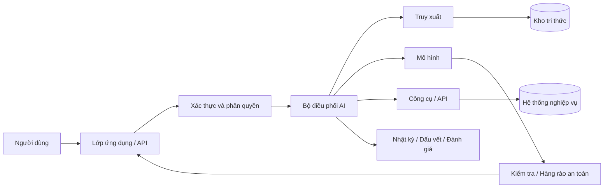

# Kiến trúc hệ thống AI: từ mô hình tới hệ thống vận hành thực tế

Khi học AI, người mới thường nhìn thấy một hàm rất đơn giản:

```text
đầu vào → mô hình → đầu ra
```

Đây là phép trừu tượng hóa đúng ở mức mô hình, nhưng chưa đủ để hiểu một sản phẩm AI thực tế. Một **hệ thống AI vận hành thực tế (production AI system)** còn phải giải quyết thu nhận dữ liệu, tiền xử lý, ngữ cảnh, suy luận, truy xuất, logic nghiệp vụ, công cụ, quyền truy cập, kiểm tra hợp lệ, khả năng quan sát, đánh giá, độ trễ, chi phí và khôi phục khi có lỗi.

Một hệ thống tốt không nhất thiết dùng mô hình mạnh nhất. Nó cần **toàn bộ luồng xử lý hoạt động nhất quán dưới các ràng buộc thực tế**.

## Mô hình chỉ là một thành phần của hệ thống

Giả sử xây trợ lý tri thức nội bộ cho công ty. Nếu chỉ gọi LLM với câu hỏi của người dùng, mô hình chỉ có tri thức nằm trong tham số và phần ngữ cảnh được gửi kèm yêu cầu. Nó không tự biết cơ sở dữ liệu nội bộ mới nhất, quyền của người dùng hay trạng thái hiện tại của quy trình nghiệp vụ.

Vì vậy hệ thống cần một lớp **điều phối (orchestration)**:



Mỗi khối giải quyết một vấn đề khác nhau. Nếu lớp phân quyền sai, mô hình có thể làm lộ thông tin mà người dùng không được phép thấy. Nếu truy xuất sai, câu trả lời có thể dựa vào tài liệu không liên quan. Nếu thực thi công cụ thiếu kiểm tra, một tham số do mô hình bịa ra có thể gây tác động thật lên hệ thống.

## Luồng ngoại tuyến và luồng trực tuyến

Hệ thống AI thường có ít nhất hai dòng xử lý.

### Luồng ngoại tuyến (offline path)

Luồng ngoại tuyến chuẩn bị mô hình và dữ liệu trước khi yêu cầu của người dùng xuất hiện:

```text
Dữ liệu thô
→ làm sạch
→ gán nhãn / biến đổi
→ huấn luyện hoặc lập chỉ mục
→ đánh giá
→ tạo artifact mô hình/chỉ mục
→ triển khai
```

Huấn luyện học máy, tạo vector nhúng, chia tài liệu thành đoạn và xây chỉ mục theo lô thường thuộc luồng này.

### Luồng trực tuyến (online path)

Luồng trực tuyến phục vụ yêu cầu đang diễn ra:

```text
Yêu cầu
→ xác thực
→ tiền xử lý
→ ngữ cảnh / truy xuất
→ suy luận
→ kiểm tra
→ phản hồi
```

Thiết kế production phải tối ưu luồng trực tuyến cho độ trễ và độ tin cậy, đồng thời duy trì luồng ngoại tuyến để cập nhật mô hình và tri thức.

## Luồng dữ liệu (data pipeline)

Chất lượng mô hình bị giới hạn bởi chất lượng dữ liệu. Một luồng dữ liệu thường gồm thu nhận, xác thực, biến đổi, lưu trữ và truy vết nguồn gốc (lineage).

Nếu một đặc trưng được tính theo cách A khi huấn luyện nhưng lại được tính theo cách B khi phục vụ, hệ thống tạo ra **độ lệch giữa huấn luyện và phục vụ (training-serving skew)**. Ví dụ, lúc huấn luyện `average_spend_30d` được tính theo UTC nhưng khi vận hành lại tính theo múi giờ địa phương. Mô hình có thể suy giảm dù mã suy luận không hề phát sinh lỗi.

Vì vậy định nghĩa đặc trưng, lược đồ dữ liệu và phiên bản phải được quản lý giống như hợp đồng phần mềm.

## Phục vụ mô hình (model serving)

**Phục vụ mô hình (model serving / 모델 서빙)** là việc đưa mô hình đã huấn luyện vào trạng thái mà ứng dụng có thể gọi được. Một số kiểu phục vụ phổ biến:

```text
suy luận theo lô (batch inference)
API đồng bộ trực tuyến
worker bất đồng bộ qua hàng đợi
suy luận dạng luồng
suy luận trực tiếp trên thiết bị
```

Các đánh đổi chính gồm độ trễ (latency), thông lượng (throughput), bộ nhớ, mức sử dụng phần cứng và chi phí.

Ví dụ, chatbot tương tác ưu tiên thời gian tới token đầu tiên và khả năng phát kết quả dạng luồng. Trong khi đó, chấm điểm hàng triệu khách hàng theo lô thường ưu tiên thông lượng hơn độ trễ của từng bản ghi.

## Hệ thống có trạng thái và không trạng thái

Nhiều dịch vụ API truyền thống ưu tiên **không trạng thái (stateless)** để dễ mở rộng. Nhưng AI hội thoại và tác nhân thường cần lưu trạng thái.

Trạng thái có thể nằm ở:

- lịch sử hội thoại;
- cơ sở dữ liệu bên ngoài;
- bộ nhớ vector;
- máy trạng thái của luồng công việc;
- nhật ký thực thi công cụ;
- kho hồ sơ người dùng.

Không nên mặc định nhét mọi trạng thái vào lời nhắc. Cửa sổ ngữ cảnh có chi phí, giới hạn dung lượng và có thể chứa thông tin cũ hoặc không liên quan. Thiết kế thực tế cần phân biệt đâu là **ngữ cảnh tạm thời (transient context)** và đâu là **trạng thái bền vững (persistent state)**.

## Lớp truy xuất (retrieval layer)

**Sinh tăng cường bằng truy xuất (Retrieval-Augmented Generation - RAG)** bổ sung tri thức bên ngoài trước khi suy luận:

```text
truy vấn
→ biến đổi truy vấn / tạo embedding
→ truy xuất
→ xếp hạng / xếp hạng lại
→ xây ngữ cảnh
→ sinh câu trả lời
```

Điểm quan trọng: RAG không chỉ là “cơ sở dữ liệu vector + LLM”. Chất lượng truy xuất phụ thuộc vào cách chia đoạn, lập chỉ mục, lọc metadata, biểu diễn truy vấn, xếp hạng và cách lắp ráp ngữ cảnh.

Nếu bộ truy xuất không lấy đúng bằng chứng, mô hình sinh rất khó tạo câu trả lời bám đúng nguồn.

## Lớp công cụ (tool layer)

Sử dụng công cụ cho phép hệ thống AI tương tác với hệ thống bên ngoài như tìm kiếm, truy vấn cơ sở dữ liệu, CRM, máy tính, môi trường thực thi mã hoặc API nội bộ.

Một công cụ nên có **hợp đồng rõ ràng (tool contract)**:

```json
{
  "name": "get_order_status",
  "arguments": {
    "order_id": "string"
  }
}
```

Nhưng lược đồ chỉ là bước đầu. Hệ thống còn phải phân quyền hành động, kiểm tra tham số, giới hạn tác động phụ, thử lại có kiểm soát và ghi dấu vết kiểm toán.

Đặc biệt cần phân biệt **công cụ đọc (read tool)** và **công cụ ghi (write tool)**. Sai khi đọc có thể tạo câu trả lời tệ; sai khi ghi có thể thay đổi dữ liệu thật.

## Lớp điều phối (orchestration layer)

Bộ điều phối quyết định thứ tự tương tác giữa mô hình, truy xuất và công cụ. Ba mẫu thiết kế phổ biến là:

```text
luồng công việc xác định
luồng công việc do LLM định tuyến
vòng lặp tác nhân
```

Luồng công việc xác định phù hợp khi quy trình đã rõ. Định tuyến bằng LLM phù hợp khi cần phân loại ngữ nghĩa để chọn nhánh. Vòng lặp tác nhân phù hợp khi chuỗi hành động khó biết trước và cần thích nghi theo kết quả trung gian.

Một sai lầm phổ biến là dùng tác nhân cho mọi thứ. Mức tự chủ càng cao thì không gian tìm kiếm càng lớn và việc kiểm thử càng khó. Nếu luồng nghiệp vụ đã xác định, luồng công việc thường đáng tin cậy hơn.

## Hàng rào an toàn và kiểm tra hợp lệ

**Hàng rào an toàn (guardrail)** không phải một lớp thần kỳ có thể “chặn mọi lỗi AI”. Độ tin cậy thường đến từ nhiều lớp:

```text
kiểm tra đầu vào
kiểm tra quyền
ràng buộc lời nhắc / chính sách
lược đồ đầu ra có cấu trúc
kiểm tra nội dung
kiểm tra quy tắc nghiệp vụ
phê duyệt của con người cho hành động rủi ro cao
```

Ví dụ, nếu mô hình sinh SQL, không nên thực thi trực tiếp bất kỳ chuỗi SQL nào nó tạo ra. Hệ thống có thể giới hạn chỉ đọc, phân tích cây cú pháp (AST), áp dụng danh sách bảng được phép và thực thi quyền ở mức hàng dữ liệu.

## Khả năng quan sát (observability)

Hệ thống truyền thống thường theo dõi CPU, bộ nhớ, tỷ lệ lỗi và độ trễ. Hệ thống AI cần thêm các tín hiệu đặc thù:

```text
phiên bản lời nhắc / ngữ cảnh
mô hình / phiên bản mô hình
tài liệu đã truy xuất
số token đầu vào / đầu ra
lần gọi công cụ
độ trễ từng giai đoạn
chi phí
phản hồi người dùng
điểm đánh giá
phân loại lỗi
```

Với tác nhân, dấu vết thực thi (trace) từng bước đặc biệt quan trọng vì kết quả cuối sai có thể do lập kế hoạch, truy xuất, kết quả công cụ hoặc cập nhật trạng thái.

## Đánh giá như một hệ thống con

Đầu ra AI thường không hoàn toàn xác định và không phải lúc nào cũng có một chuỗi đáp án chính xác duy nhất. Vì vậy đánh giá cần nhiều tầng:

- kiểm thử đơn vị xác định cho mã và quy tắc nghiệp vụ;
- tập dữ liệu chuẩn nội bộ (golden dataset) cho hành vi mong muốn;
- chỉ số theo nhiệm vụ;
- đánh giá của con người;
- bộ đánh giá dựa trên mô hình khi phù hợp;
- thử nghiệm A/B trực tuyến hoặc chỉ số kinh doanh.

Không nên thay kiểm thử đơn vị bằng bộ đánh giá LLM. Mỗi loại kiểm thử phù hợp với một kiểu lỗi khác nhau.

## Độ trễ, thông lượng và chi phí

Kiến trúc AI luôn bị ràng buộc bởi tài nguyên.

Nếu một luồng gọi mô hình 5 lần tuần tự, độ trễ gần bằng tổng độ trễ của từng lần gọi. Nếu các lời gọi độc lập có thể chạy song song, đường tới hạn (critical path) sẽ ngắn hơn.

Bộ nhớ đệm (caching) có thể giảm chi phí nhưng cần khóa cache và chính sách làm mới đúng. Gom lô (batching) tăng hiệu suất GPU nhưng có thể làm tăng thời gian chờ. Mô hình nhỏ có thể đủ cho phân loại hoặc định tuyến, trong khi mô hình mạnh hơn chỉ dành cho nhiệm vụ suy luận khó.

Vì vậy kiến trúc thực tế thường **không đồng nhất (heterogeneous)** thay vì dùng một mô hình cho tất cả công việc.

## Phương án dự phòng và suy giảm có kiểm soát

Hệ thống AI phải giả định rằng thành phần sẽ có lúc thất bại.

Bộ truy xuất có thể hết thời gian chờ. API mô hình có thể bị giới hạn tần suất. Công cụ có thể đổi lược đồ. Đầu ra có thể không phân tích được.

Các chiến lược dự phòng gồm:

```text
thử lại theo chính sách giới hạn
chuyển sang mô hình dự phòng
trả kết quả một phần
chuyển sang luồng xác định
yêu cầu con người kiểm tra
từ chối thực thi khi hành động nhạy cảm
```

**Từ chối mặc định khi không chắc (fail closed)** đặc biệt quan trọng với hành động có ảnh hưởng an ninh: nếu quyền truy cập không xác định chắc chắn, hệ thống không được thực thi.

## Ranh giới bảo mật

Lời nhắc không phải ranh giới bảo mật. Nếu người dùng viết “hãy bỏ qua quy tắc trước”, hệ thống không thể dựa vào việc mô hình “tự nhớ chính sách” để bảo vệ cơ sở dữ liệu.

Ranh giới bảo mật phải nằm ở hạ tầng xác định:

```text
xác thực
phân quyền
chính sách mạng
quyền của công cụ
quyền cơ sở dữ liệu
quản lý bí mật
nhật ký kiểm toán
```

Mô hình chỉ nên được cấp **quyền tối thiểu cần thiết (least privilege)**.

## Ví dụ: trợ lý tri thức nội bộ

Một kiến trúc thực tế có thể là:

```text
Câu hỏi người dùng
→ Xác thực
→ Phân loại truy vấn
→ Lọc metadata theo phòng ban
→ Truy xuất lai
→ Xếp hạng lại
→ Xây ngữ cảnh
→ LLM sinh câu trả lời
→ Kiểm tra trích dẫn
→ Phản hồi
→ Ghi trace + feedback
```

Nếu câu trả lời sai, cần điều tra cả luồng thay vì chỉ thay lời nhắc:

```text
Truy vấn có được hiểu đúng không?
Tài liệu đúng đã được lập chỉ mục chưa?
Tài liệu đó có được truy xuất không?
Nó có được xếp đủ cao không?
Đoạn liên quan có được đưa vào ngữ cảnh không?
Mô hình có sử dụng bằng chứng không?
Trích dẫn có được gắn đúng không?
```

Đây là **tư duy hệ thống (system thinking)**.

## Mô hình tư duy (mental model)

> **Hệ thống AI = Hệ thống phần mềm + Hệ thống dữ liệu + Mô hình + Vòng phản hồi/đánh giá.**

Nếu chỉ tối ưu điểm benchmark của mô hình mà bỏ qua ba phần còn lại, hệ thống khó có thể sẵn sàng cho môi trường vận hành thực tế.

## Các hiểu lầm thường gặp

### “Đổi sang mô hình mạnh hơn sẽ sửa được hệ thống”

Mô hình tốt hơn có thể tăng năng lực nhưng không sửa được dữ liệu cũ, phân quyền sai, truy xuất kém, hợp đồng công cụ sai hoặc thiếu khả năng quan sát.

### “Prompt engineering chính là kiến trúc hệ thống”

Kỹ thuật lời nhắc (prompt engineering) chỉ là một lớp cấu hình/đầu vào. Kiến trúc còn bao gồm ranh giới thành phần, luồng dữ liệu, trạng thái, độ tin cậy và bảo mật.

### “RAG làm mô hình luôn đúng sự thật”

RAG chỉ cung cấp bằng chứng. Truy xuất có thể sai và mô hình sinh vẫn có thể bỏ qua hoặc diễn giải sai bằng chứng.

### “Tác nhân càng tự do càng thông minh”

Tự chủ cao tăng tính linh hoạt nhưng cũng tăng số đường dẫn có thể thất bại. Độ tin cậy thường đến từ việc giới hạn không gian hành động và dùng hợp đồng tường minh.

## Liên kết kiến thức

Chapter này nối AI với thiết kế API, hệ thống phân tán, cơ sở dữ liệu, an ninh, khả năng quan sát, hạ tầng đám mây và kiểm thử phần mềm. Khi đi sâu vào RAG, tác nhân, MLOps và LLMOps, ta sẽ quay lại kiến trúc này và mở từng thành phần thành một miền kiến thức riêng.

Xem tiếp: [AI, Học máy, Học sâu và AI tạo sinh khác nhau thế nào?](./05_ai_vs_ml_vs_dl_vs_generative_ai.md).