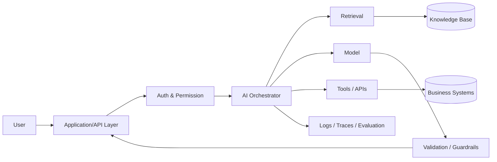

# AI System Architecture: từ Model tới Production System

Khi học AI, người mới thường nhìn thấy một function rất đơn giản:

```text
input → model → output
```

Đây là abstraction đúng ở mức model, nhưng không đủ để hiểu một AI product thực tế. Production AI system phải giải quyết data ingestion, preprocessing, context, inference, retrieval, business logic, tools, permissions, validation, observability, evaluation, latency, cost và failure recovery.

Một system tốt không nhất thiết có model mạnh nhất. Nó cần **toàn bộ pipeline hoạt động nhất quán dưới constraints thực tế**.

## Model là component, không phải toàn bộ system

Giả sử xây internal assistant cho công ty. Nếu chỉ gọi LLM với user question, model chỉ có knowledge nằm trong parameters và context được gửi vào request. Nó không tự biết database nội bộ mới nhất, permission của user hay trạng thái hiện tại của business workflow.

System cần orchestration:



Mỗi box giải quyết một problem khác nhau. Nếu permission layer sai, model có thể expose information không nên thấy. Nếu retrieval sai, answer có thể grounded vào document không liên quan. Nếu tool execution thiếu validation, một hallucinated parameter có thể tạo side effect thật.

## Offline path và Online path

AI system thường có ít nhất hai dòng xử lý.

### Offline path

Offline path chuẩn bị model/data trước khi user request đến:

```text
Raw data
→ cleaning
→ labeling / transformation
→ training or indexing
→ evaluation
→ model/index artifact
→ deployment
```

Machine Learning training, embedding generation, document chunking và batch index build thường thuộc path này.

### Online path

Online path phục vụ request:

```text
Request
→ authentication
→ preprocessing
→ context/retrieval
→ inference
→ validation
→ response
```

Production design phải tối ưu online path cho latency và reliability trong khi vẫn có offline path để cập nhật knowledge/model.

## Data Pipeline

Model quality bị chặn bởi data quality. Data pipeline thường gồm ingestion, validation, transformation, storage và lineage.

Một feature được train theo cách A nhưng serve theo cách B tạo **training-serving skew**. Ví dụ training tính `average_spend_30d` theo UTC nhưng production tính theo local timezone. Model có thể degrade dù code inference không lỗi.

Vì vậy feature definition, schema và versioning phải được quản lý như software contract.

## Model Serving

**Model serving (모델 서빙)** là việc expose trained model để application gọi được. Serving có thể là:

```text
batch inference
online synchronous API
async queue worker
streaming inference
on-device inference
```

Trade-off chính gồm latency, throughput, memory, hardware utilization và cost.

Ví dụ interactive chatbot ưu tiên time-to-first-token và streaming. Batch scoring hàng triệu customers có thể ưu tiên throughput hơn latency từng record.

## Stateful và Stateless AI

Nhiều API service truyền thống cố stateless để scale dễ. Nhưng conversational AI và agent thường cần state.

State có thể nằm ở:

- conversation history;
- external database;
- vector memory;
- workflow state machine;
- tool execution log;
- user/profile store.

Không nên mặc định nhét mọi state vào prompt. Context window có cost, giới hạn capacity và có thể chứa stale/irrelevant information. Production design cần quyết định cái gì là transient context, cái gì là persistent state.

## Retrieval Layer

Retrieval-Augmented Generation (RAG) thêm external knowledge trước inference:

```text
query
→ query transformation / embedding
→ retrieval
→ ranking / reranking
→ context construction
→ generation
```

Điểm quan trọng: RAG không phải “vector DB + LLM”. Retrieval quality phụ thuộc chunking, indexing, metadata filter, query representation, ranking và context assembly.

Nếu retriever không lấy đúng evidence, generator khó tạo answer grounded đúng.

## Tool Layer

Tool use cho phép AI system tương tác với external systems: search, database query, CRM, calculator, code execution hoặc internal APIs.

Một tool nên có contract rõ:

```json
{
  "name": "get_order_status",
  "arguments": {
    "order_id": "string"
  }
}
```

Nhưng schema chỉ là bước đầu. System cần authorize action, validate arguments, limit side effects, retry có kiểm soát và record audit trail.

Đặc biệt phải phân biệt **read tool** và **write tool**. Sai khi đọc có thể tạo answer tệ; sai khi write có thể thay đổi dữ liệu thật.

## Orchestration Layer

Orchestrator quyết định sequence giữa model, retrieval và tools. Có ba pattern phổ biến:

```text
Deterministic workflow
LLM-routed workflow
Agentic loop
```

Deterministic workflow phù hợp khi process rõ. LLM routing phù hợp khi cần semantic classification/chọn branch. Agentic loop phù hợp khi sequence action khó biết trước và cần adapt dựa vào intermediate result.

Một sai lầm phổ biến là dùng agent cho mọi thứ. More autonomy làm search space lớn hơn và khó test hơn. Nếu business flow đã xác định, workflow thường reliable hơn.

## Guardrails và Validation

Guardrail không phải một layer thần kỳ “chặn AI sai”. Reliability thường cần nhiều lớp:

```text
input validation
permission check
prompt / policy constraints
structured output schema
content validation
business-rule validation
human approval for high-impact action
```

Ví dụ model sinh SQL thì không nên execute trực tiếp string bất kỳ. Có thể giới hạn read-only query, parse AST, enforce table allowlist và apply row-level permission.

## Observability

Traditional system quan sát CPU, memory, error rate và latency. AI system cần thêm model-specific signals:

```text
prompt/context version
model/version
retrieved documents
input/output tokens
tool calls
latency per stage
cost
user feedback
evaluation scores
failure category
```

Đối với agent, trace từng step cực quan trọng vì final answer sai có thể do planning, retrieval, tool result hoặc state update.

## Evaluation như một subsystem

AI output thường không deterministic và không có exact expected string. Vì vậy evaluation cần nhiều tầng:

- deterministic unit test cho code/business rule;
- golden dataset cho expected behavior;
- task-specific metrics;
- human review;
- model-based evaluator khi phù hợp;
- online A/B hoặc business metrics.

Không nên thay unit test bằng LLM evaluator. Mỗi loại test phù hợp một failure mode khác nhau.

## Latency, Throughput và Cost

AI architecture luôn có resource constraints.

Nếu một pipeline gọi model 5 lần tuần tự, latency gần bằng tổng latency của từng call. Nếu có thể chạy independent calls song song, critical path giảm.

Caching có thể giảm cost nhưng cần cache key đúng và invalidation policy. Batching tăng GPU utilization nhưng có thể tăng waiting latency. Model nhỏ hơn có thể đủ cho classification/routing, trong khi model mạnh hơn dùng cho difficult reasoning.

Do đó production architecture thường heterogeneous thay vì “một model làm tất cả”.

## Fallback và Graceful Degradation

AI system cần giả định component sẽ fail.

Retriever có thể timeout. Model API có thể rate-limit. Tool có thể trả schema mới. Output có thể không parse được.

Fallback strategy có thể là:

```text
retry with bounded policy
fallback model
return partial result
switch to deterministic path
ask human review
fail closed for sensitive action
```

`Fail closed` quan trọng với action có security impact: nếu permission check không chắc, không execute.

## Security Boundary

Prompt không phải security boundary. Nếu user prompt nói “hãy bỏ qua rule trước”, system không nên dựa vào model “tự nhớ policy” để bảo vệ database.

Security phải nằm ở deterministic infrastructure:

```text
Authentication
Authorization
Network policy
Tool permission
Database permission
Secrets management
Audit log
```

Model chỉ nên được cấp minimum capability cần thiết.

## Example: Internal Knowledge Assistant

Một architecture thực tế:

```text
User Question
→ Auth
→ Query classification
→ Department metadata filter
→ Hybrid retrieval
→ Reranking
→ Context builder
→ LLM generation
→ Citation verification
→ Response
→ Trace + feedback
```

Nếu answer sai, investigation đi theo pipeline thay vì chỉ đổi prompt:

```text
Was query understood?
Was the correct document indexed?
Was it retrieved?
Was it ranked high enough?
Was relevant chunk included?
Did model use the evidence?
Was citation attached correctly?
```

Đây là system thinking.

## Mental Model

> **AI system = Software System + Data System + Model + Feedback/Evaluation Loop.**

Nếu chỉ optimize model benchmark mà bỏ qua ba phần còn lại, system khó production-ready.

## Common Misconceptions

### “Đổi sang model mạnh hơn sẽ sửa system”

Model tốt hơn có thể tăng capability nhưng không sửa stale data, broken permission, bad retrieval, tool contract sai hoặc missing observability.

### “Prompt engineering là architecture”

Prompt là một configuration/input layer. Architecture bao gồm component boundary, data flow, state, reliability và security.

### “RAG làm model luôn factual”

RAG chỉ cung cấp evidence. Retrieval có thể sai và generator vẫn có thể bỏ qua hoặc diễn giải sai evidence.

### “Agent càng tự do càng thông minh”

Autonomy tăng flexibility nhưng cũng tăng số failure paths. Reliability thường đến từ việc giới hạn action space và explicit contracts.

## Knowledge Connection

Chapter này nối AI với API Design, Distributed Systems, Database, Security, Observability, Cloud Infrastructure và Software Testing. Khi đi sâu vào RAG, Agent, MLOps và LLMOps, ta sẽ quay lại architecture này và mở từng component thành một domain riêng.

Xem tiếp: [AI vs ML vs DL vs Generative AI](./05_ai_vs_ml_vs_dl_vs_generative_ai.md).