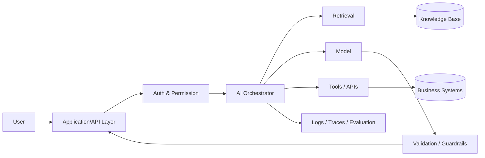

# AI hệ thống (system / 시스템) kiến trúc (architecture / 아키텍처): từ mô hình (model / 모델) tới môi trường vận hành (production / 운영 환경) hệ thống (system / 시스템)

> **Mạch đọc:** [README](../README.md) là bản đồ owner của **AI system architecture: model → production system**. Route đi từ model component → data/training pipeline → offline evaluation → online serving/monitoring → feedback and rollback, để model quality được nối với reliability và operations.

Khi học AI, người mới thường nhìn thấy một hàm (function / 함수) rất đơn giản:

```text
input → model → output
```

Đây là lớp trừu tượng (abstraction / 추상화) đúng ở mức mô hình (model / 모델), nhưng không đủ để hiểu một AI sản phẩm (product / 제품) thực tế. môi trường vận hành (production / 운영 환경) AI hệ thống (system / 시스템) phải giải quyết dữ liệu (data / 데이터) ingestion, preprocessing, ngữ cảnh (context / 맥락), suy luận (inference / 추론), retrieval, lô-gic nghiệp vụ (business logic / 비즈니스 로직), tools, permissions, kiểm tra hợp lệ (validation / 검증), khả năng quan sát (observability / 관측 가능성), evaluation, độ trễ (latency / 지연 시간), chi phí (cost / 비용) và thất bại (failure / 실패) khôi phục (recovery / 복구).

Một hệ thống (system / 시스템) tốt không nhất thiết có mô hình (model / 모델) mạnh nhất. Nó cần **toàn bộ chuỗi xử lý (pipeline / 파이프라인) hoạt động nhất quán dưới các ràng buộc (constraints / 제약조건들) thực tế**.

## Mô hình (model / 모델) là thành phần (component / 컴포넌트), không phải toàn bộ hệ thống (system / 시스템)

Giả sử xây nội bộ (internal / 내부) assistant cho công ty. Nếu chỉ gọi LLM với người dùng (user / 사용자) question, mô hình (model / 모델) chỉ có kiến thức (knowledge / 지식) nằm trong parameters và ngữ cảnh (context / 맥락) được gửi vào yêu cầu (request / 요청). Nó không tự biết cơ sở dữ liệu (database / 데이터베이스) nội bộ mới nhất, permission của người dùng (user / 사용자) hay trạng thái hiện tại của nghiệp vụ (business / 비즈니스) workflow.

Hệ thống (system / 시스템) cần orchestration:


```mermaid
flowchart LR
    U[User] --> API[Application/API Layer]
    API --> AUTH[Auth & Permission]
    AUTH --> ORCH[AI Orchestrator]
    ORCH --> RET[Retrieval]
    RET --> KB[(Knowledge Base)]
    ORCH --> LLM[Model]
    ORCH --> TOOL[Tools / APIs]
    TOOL --> SYS[(Business Systems)]
    LLM --> VAL[Validation / Guardrails]
    VAL --> API
    ORCH --> OBS[Logs / Traces / Evaluation]
```

Mỗi box giải quyết một bài toán (problem / 문제) khác nhau. Nếu permission tầng (layer / 계층) sai, mô hình (model / 모델) có thể expose thông tin (information / 정보) không nên thấy. Nếu retrieval sai, answer có thể grounded vào document không liên quan. Nếu công cụ (tool / 도구) thực thi (execution / 실행) thiếu kiểm tra hợp lệ (validation / 검증), một hallucinated parameter có thể tạo side tác động (effect / 효과) thật.

> **Chuyển mạch:** Trong **AI hệ thống (system / 시스템) kiến trúc (architecture / 아키텍처): từ mô hình (model / 모델) tới môi trường vận hành (production / 운영 환경) hệ thống (system / 시스템)**, **Mô hình (model / 모델) là thành phần (component / 컴포넌트), không phải toàn bộ hệ thống (system / 시스템)** xác định đầu vào; **Offline đường dẫn (path / 경로) và Online đường dẫn (path / 경로)** giải thích bước vận hành tạo ra kết quả kế tiếp. Từ đây, **Dữ liệu (data / 데이터) chuỗi xử lý (pipeline / 파이프라인)** sẽ cho biết hệ quả hoặc giới hạn ấy hiện ra ở đâu.

## Offline đường dẫn (path / 경로) và Online đường dẫn (path / 경로)

AI hệ thống (system / 시스템) thường có ít nhất hai dòng xử lý.

### Offline đường dẫn (path / 경로)

Offline đường dẫn (path / 경로) chuẩn bị mô hình (model / 모델)/dữ liệu (data / 데이터) trước khi người dùng (user / 사용자) yêu cầu (request / 요청) đến:

```text
Raw data
→ cleaning
→ labeling / transformation
→ training or indexing
→ evaluation
→ model/index artifact
→ deployment
```

Machine học tập (learning / 학습) huấn luyện (training / 학습), embedding generation, document chunking và batch chỉ mục (index / 인덱스) bản dựng (build / 빌드) thường thuộc đường dẫn (path / 경로) này.

### Online đường dẫn (path / 경로)

Online đường dẫn (path / 경로) phục vụ yêu cầu (request / 요청):

```text
Request
→ authentication
→ preprocessing
→ context/retrieval
→ inference
→ validation
→ response
```

Môi trường vận hành (production / 운영 환경) thiết kế (design / 설계) phải tối ưu online đường dẫn (path / 경로) cho độ trễ (latency / 지연 시간) và độ tin cậy (reliability / 신뢰성) trong khi vẫn có offline đường dẫn (path / 경로) để cập nhật kiến thức (knowledge / 지식)/mô hình (model / 모델).

> **Chuyển mạch:** Ở chặng này của **AI hệ thống (system / 시스템) kiến trúc (architecture / 아키텍처): từ mô hình (model / 모델) tới môi trường vận hành (production / 운영 환경) hệ thống (system / 시스템)**, **Offline đường dẫn (path / 경로) và Online đường dẫn (path / 경로)** nêu điều cần giải thích; **Dữ liệu (data / 데이터) chuỗi xử lý (pipeline / 파이프라인)** đối chiếu nó với bằng chứng hoặc nguồn kiểm chứng. Từ đây, **Mô hình (model / 모델) Serving** sẽ cho biết hệ quả hoặc giới hạn ấy hiện ra ở đâu.

## Dữ liệu (data / 데이터) chuỗi xử lý (pipeline / 파이프라인)

Mô hình (model / 모델) chất lượng (quality / 품질) bị chặn bởi dữ liệu (data / 데이터) chất lượng (quality / 품질). dữ liệu (data / 데이터) chuỗi xử lý (pipeline / 파이프라인) thường gồm ingestion, kiểm tra hợp lệ (validation / 검증), transformation, lưu trữ (storage / 저장소) và lineage.

Một tính năng (feature / 기능) được train theo cách A nhưng serve theo cách B tạo **training-serving skew**. Ví dụ huấn luyện (training / 학습) tính `average_spend_30d` theo UTC nhưng môi trường vận hành (production / 운영 환경) tính theo cục bộ (local / 로컬) timezone. mô hình (model / 모델) có thể degrade dù mã (code / 코드) suy luận (inference / 추론) không lỗi.

Vì vậy tính năng (feature / 기능) definition, lược đồ (schema / 스키마) và versioning phải được quản lý như software đặc tả hợp đồng (contract / 계약).

> **Chuyển mạch:** Đặt trong câu hỏi lớn của **AI hệ thống (system / 시스템) kiến trúc (architecture / 아키텍처): từ mô hình (model / 모델) tới môi trường vận hành (production / 운영 환경) hệ thống (system / 시스템)**, **Dữ liệu (data / 데이터) chuỗi xử lý (pipeline / 파이프라인)** nêu điều cần giải thích; **Mô hình (model / 모델) Serving** đối chiếu nó với bằng chứng hoặc nguồn kiểm chứng. Từ đây, **Stateful và Stateless AI** sẽ cho biết hệ quả hoặc giới hạn ấy hiện ra ở đâu.

## Mô hình (model / 모델) Serving

**mô hình (model / 모델) serving (모델 서빙)** là việc expose trained mô hình (model / 모델) để ứng dụng (application / 애플리케이션) gọi được. Serving có thể là:

```text
batch inference
online synchronous API
async queue worker
streaming inference
on-device inference
```

Sự đánh đổi (trade-off / 트레이드오프) chính gồm độ trễ (latency / 지연 시간), thông lượng (throughput / 처리량), bộ nhớ (memory / 메모리), hardware utilization và chi phí (cost / 비용).

Ví dụ interactive chatbot ưu tiên time-to-first-token và streaming. Batch scoring hàng triệu customers có thể ưu tiên thông lượng (throughput / 처리량) hơn độ trễ (latency / 지연 시간) từng bản ghi (record / 레코드).

> **Chuyển mạch:** Trong **AI hệ thống (system / 시스템) kiến trúc (architecture / 아키텍처): từ mô hình (model / 모델) tới môi trường vận hành (production / 운영 환경) hệ thống (system / 시스템)**, **Stateful và Stateless AI** tiếp nhận điểm tựa từ **Mô hình (model / 모델) Serving** nhưng đổi góc nhìn sang câu hỏi của chính nó; đọc liền hai mục để thấy mối quan hệ đó. Từ đây, **Retrieval tầng (layer / 계층)** sẽ cho biết hệ quả hoặc giới hạn ấy hiện ra ở đâu.

## Stateful và Stateless AI

Nhiều API dịch vụ (service / 서비스) truyền thống cố stateless để quy mô (scale / 규모) dễ. Nhưng conversational AI và tác nhân (agent / 에이전트) thường cần trạng thái (state / 상태).

Trạng thái (state / 상태) có thể nằm ở:

- conversation lịch sử (history / 이력);
- bên ngoài (external / 외부) cơ sở dữ liệu (database / 데이터베이스);
- véc-tơ (vector / 벡터) bộ nhớ (memory / 메모리);
- workflow máy trạng thái (state machine / 상태 머신);
- công cụ (tool / 도구) thực thi (execution / 실행) log;
- người dùng (user / 사용자)/profile store.

Không nên mặc định nhét mọi trạng thái (state / 상태) vào prompt. ngữ cảnh (context / 맥락) cửa sổ (window / 윈도우) có chi phí (cost / 비용), giới hạn sức chứa (capacity / 용량) và có thể chứa stale/irrelevant thông tin (information / 정보). môi trường vận hành (production / 운영 환경) thiết kế (design / 설계) cần quyết định cái gì là transient ngữ cảnh (context / 맥락), cái gì là persistent trạng thái (state / 상태).

> **Chuyển mạch:** Ở chặng này của **AI hệ thống (system / 시스템) kiến trúc (architecture / 아키텍처): từ mô hình (model / 모델) tới môi trường vận hành (production / 운영 환경) hệ thống (system / 시스템)**, **Retrieval tầng (layer / 계층)** tiếp nhận điểm tựa từ **Stateful và Stateless AI** nhưng đổi góc nhìn sang câu hỏi của chính nó; đọc liền hai mục để thấy mối quan hệ đó. Từ đây, **Công cụ (tool / 도구) tầng (layer / 계층)** sẽ cho biết hệ quả hoặc giới hạn ấy hiện ra ở đâu.

## Retrieval tầng (layer / 계층)

Retrieval-Augmented Generation (RAG) thêm bên ngoài (external / 외부) kiến thức (knowledge / 지식) trước suy luận (inference / 추론):

```text
query
→ query transformation / embedding
→ retrieval
→ ranking / reranking
→ context construction
→ generation
```

Điểm quan trọng: RAG không phải “véc-tơ (vector / 벡터) DB + LLM”. Retrieval chất lượng (quality / 품질) phụ thuộc chunking, indexing, siêu dữ liệu (metadata / 메타데이터) filter, truy vấn (query / 쿼리) biểu diễn (representation / 표현), ranking và ngữ cảnh (context / 맥락) assembly.

Nếu retriever không lấy đúng bằng chứng (evidence / 증거), generator khó tạo answer grounded đúng.

> **Chuyển mạch:** Đặt trong câu hỏi lớn của **AI hệ thống (system / 시스템) kiến trúc (architecture / 아키텍처): từ mô hình (model / 모델) tới môi trường vận hành (production / 운영 환경) hệ thống (system / 시스템)**, **Công cụ (tool / 도구) tầng (layer / 계층)** tiếp nhận điểm tựa từ **Retrieval tầng (layer / 계층)** nhưng đổi góc nhìn sang câu hỏi của chính nó; đọc liền hai mục để thấy mối quan hệ đó. Từ đây, **Orchestration tầng (layer / 계층)** sẽ cho biết hệ quả hoặc giới hạn ấy hiện ra ở đâu.

## Công cụ (tool / 도구) tầng (layer / 계층)

Công cụ (tool / 도구) use cho phép AI hệ thống (system / 시스템) tương tác với bên ngoài (external / 외부) các hệ thống (systems / 시스템들): tìm kiếm (search / 검색), truy vấn cơ sở dữ liệu (database query / 데이터베이스 쿼리), CRM, calculator, mã (code / 코드) thực thi (execution / 실행) hoặc nội bộ (internal / 내부) APIs.

Một công cụ (tool / 도구) nên có đặc tả hợp đồng (contract / 계약) rõ:

```json
{
  "name": "get_order_status",
  "arguments": {
    "order_id": "string"
  }
}
```

Nhưng lược đồ (schema / 스키마) chỉ là bước đầu. hệ thống (system / 시스템) cần authorize hành động (action / 동작), validate arguments, limit side effects, thử lại (retry / 재시도) có kiểm soát và bản ghi (record / 레코드) kiểm tra (audit / 감사) trail.

Đặc biệt phải phân biệt **read công cụ (tool / 도구)** và **ghi (write / 쓰기) công cụ (tool / 도구)**. Sai khi đọc có thể tạo answer tệ; sai khi ghi (write / 쓰기) có thể thay đổi dữ liệu thật.

> **Chuyển mạch:** Trong **AI hệ thống (system / 시스템) kiến trúc (architecture / 아키텍처): từ mô hình (model / 모델) tới môi trường vận hành (production / 운영 환경) hệ thống (system / 시스템)**, **Orchestration tầng (layer / 계층)** tiếp nhận điểm tựa từ **Công cụ (tool / 도구) tầng (layer / 계층)** nhưng đổi góc nhìn sang câu hỏi của chính nó; đọc liền hai mục để thấy mối quan hệ đó. Từ đây, **Guardrails và kiểm tra hợp lệ (validation / 검증)** sẽ cho biết hệ quả hoặc giới hạn ấy hiện ra ở đâu.

## Orchestration tầng (layer / 계층)

Orchestrator quyết định chuỗi (sequence / 시퀀스) giữa mô hình (model / 모델), retrieval và tools. Có ba mẫu (pattern / 패턴) phổ biến:

```text
Deterministic workflow
LLM-routed workflow
Agentic loop
```

Deterministic workflow phù hợp khi tiến trình (process / 프로세스) rõ. LLM routing phù hợp khi cần ngữ nghĩa (semantic / 의미적) classification/chọn branch. Agentic vòng lặp (loop / 루프) phù hợp khi chuỗi (sequence / 시퀀스) hành động (action / 동작) khó biết trước và cần adapt dựa vào intermediate kết quả (result / 결과).

Một sai lầm phổ biến là dùng tác nhân (agent / 에이전트) cho mọi thứ. More autonomy làm tìm kiếm (search / 검색) không gian (space / 공간) lớn hơn và khó kiểm thử (test / 테스트) hơn. Nếu nghiệp vụ (business / 비즈니스) luồng (flow / 흐름) đã xác định, workflow thường reliable hơn.

> **Chuyển mạch:** Ở chặng này của **AI hệ thống (system / 시스템) kiến trúc (architecture / 아키텍처): từ mô hình (model / 모델) tới môi trường vận hành (production / 운영 환경) hệ thống (system / 시스템)**, **Guardrails và kiểm tra hợp lệ (validation / 검증)** tiếp nhận điểm tựa từ **Orchestration tầng (layer / 계층)** nhưng đổi góc nhìn sang câu hỏi của chính nó; đọc liền hai mục để thấy mối quan hệ đó. Từ đây, **Khả năng quan sát (observability / 관측 가능성)** sẽ cho biết hệ quả hoặc giới hạn ấy hiện ra ở đâu.

## Guardrails và kiểm tra hợp lệ (validation / 검증)

Guardrail không phải một tầng (layer / 계층) thần kỳ “chặn AI sai”. độ tin cậy (reliability / 신뢰성) thường cần nhiều lớp:

```text
input validation
permission check
prompt / policy constraints
structured output schema
content validation
business-rule validation
human approval for high-impact action
```

Ví dụ mô hình (model / 모델) sinh SQL thì không nên execute trực tiếp string bất kỳ. Có thể giới hạn read-only truy vấn (query / 쿼리), parse AST, enforce bảng (table / 테이블) allowlist và apply row-level permission.

> **Chuyển mạch:** Đặt trong câu hỏi lớn của **AI hệ thống (system / 시스템) kiến trúc (architecture / 아키텍처): từ mô hình (model / 모델) tới môi trường vận hành (production / 운영 환경) hệ thống (system / 시스템)**, **Khả năng quan sát (observability / 관측 가능성)** tiếp nhận điểm tựa từ **Guardrails và kiểm tra hợp lệ (validation / 검증)** nhưng đổi góc nhìn sang câu hỏi của chính nó; đọc liền hai mục để thấy mối quan hệ đó. Từ đây, **Evaluation như một subsystem** sẽ cho biết hệ quả hoặc giới hạn ấy hiện ra ở đâu.

## Khả năng quan sát (observability / 관측 가능성)

Traditional hệ thống (system / 시스템) quan sát CPU, bộ nhớ (memory / 메모리), lỗi (error / 오류) tỷ lệ (rate / 비율) và độ trễ (latency / 지연 시간). AI hệ thống (system / 시스템) cần thêm model-specific signals:

```text
prompt/context version
model/version
retrieved documents
input/output tokens
tool calls
latency per stage
cost
user feedback
evaluation scores
failure category
```

Đối với tác nhân (agent / 에이전트), dấu vết (trace / 추적) từng step cực quan trọng vì final answer sai có thể do planning, retrieval, công cụ (tool / 도구) kết quả (result / 결과) hoặc trạng thái (state / 상태) cập nhật (update / 업데이트).

> **Chuyển mạch:** Trong **AI hệ thống (system / 시스템) kiến trúc (architecture / 아키텍처): từ mô hình (model / 모델) tới môi trường vận hành (production / 운영 환경) hệ thống (system / 시스템)**, **Evaluation như một subsystem** tiếp nhận điểm tựa từ **Khả năng quan sát (observability / 관측 가능성)** nhưng đổi góc nhìn sang câu hỏi của chính nó; đọc liền hai mục để thấy mối quan hệ đó. Từ đây, **Độ trễ (latency / 지연 시간), thông lượng (throughput / 처리량) và chi phí (cost / 비용)** sẽ cho biết hệ quả hoặc giới hạn ấy hiện ra ở đâu.

## Evaluation như một subsystem

AI đầu ra (output / 출력) thường không deterministic và không có chính xác (exact / 정확한) expected string. Vì vậy evaluation cần nhiều tầng:

- deterministic đơn vị (unit / 단위) kiểm thử (test / 테스트) cho mã (code / 코드)/nghiệp vụ (business / 비즈니스) quy tắc (rule / 규칙);
- golden dataset cho expected hành vi (behavior / 동작);
- task-specific metrics;
- human rà soát (review / 검토);
- model-based evaluator khi phù hợp;
- online A/B hoặc nghiệp vụ (business / 비즈니스) metrics.

Không nên thay đơn vị (unit / 단위) kiểm thử (test / 테스트) bằng LLM evaluator. Mỗi loại kiểm thử (test / 테스트) phù hợp một dạng thất bại (failure mode / 실패 모드) khác nhau.

> **Chuyển mạch:** Ở chặng này của **AI hệ thống (system / 시스템) kiến trúc (architecture / 아키텍처): từ mô hình (model / 모델) tới môi trường vận hành (production / 운영 환경) hệ thống (system / 시스템)**, **Độ trễ (latency / 지연 시간), thông lượng (throughput / 처리량) và chi phí (cost / 비용)** tiếp nhận điểm tựa từ **Evaluation như một subsystem** nhưng đổi góc nhìn sang câu hỏi của chính nó; đọc liền hai mục để thấy mối quan hệ đó. Từ đây, **Fallback và Graceful Degradation** sẽ cho biết hệ quả hoặc giới hạn ấy hiện ra ở đâu.

## Độ trễ (latency / 지연 시간), thông lượng (throughput / 처리량) và chi phí (cost / 비용)

AI kiến trúc (architecture / 아키텍처) luôn có tài nguyên (resource / 자원) các ràng buộc (constraints / 제약조건들).

Nếu một chuỗi xử lý (pipeline / 파이프라인) gọi mô hình (model / 모델) 5 lần tuần tự, độ trễ (latency / 지연 시간) gần bằng tổng độ trễ (latency / 지연 시간) của từng lời gọi (call / 호출). Nếu có thể chạy independent calls song song, đường găng (critical path / 임계 경로) giảm.

Caching có thể giảm chi phí (cost / 비용) nhưng cần bộ nhớ đệm (cache / 캐시) key đúng và vô hiệu hóa (invalidation / 무효화) chính sách (policy / 정책). Batching tăng GPU utilization nhưng có thể tăng waiting độ trễ (latency / 지연 시간). mô hình (model / 모델) nhỏ hơn có thể đủ cho classification/routing, trong khi mô hình (model / 모델) mạnh hơn dùng cho difficult lập luận (reasoning / 추론).

Do đó kiến trúc vận hành (production architecture / 운영 아키텍처) thường heterogeneous thay vì “một mô hình (model / 모델) làm tất cả”.

> **Chuyển mạch:** Đặt trong câu hỏi lớn của **AI hệ thống (system / 시스템) kiến trúc (architecture / 아키텍처): từ mô hình (model / 모델) tới môi trường vận hành (production / 운영 환경) hệ thống (system / 시스템)**, **Fallback và Graceful Degradation** tiếp nhận điểm tựa từ **Độ trễ (latency / 지연 시간), thông lượng (throughput / 처리량) và chi phí (cost / 비용)** nhưng đổi góc nhìn sang câu hỏi của chính nó; đọc liền hai mục để thấy mối quan hệ đó. Từ đây, **Ranh giới bảo mật (security boundary / 보안 경계)** sẽ cho biết hệ quả hoặc giới hạn ấy hiện ra ở đâu.

## Fallback và Graceful Degradation

AI hệ thống (system / 시스템) cần giả định thành phần (component / 컴포넌트) sẽ thất bại (fail / 실패).

Retriever có thể hết thời gian chờ (timeout / 타임아웃). mô hình (model / 모델) API có thể rate-limit. công cụ (tool / 도구) có thể trả lược đồ (schema / 스키마) mới. đầu ra (output / 출력) có thể không parse được.

Fallback chiến lược (strategy / 전략) có thể là:

```text
retry with bounded policy
fallback model
return partial result
switch to deterministic path
ask human review
fail closed for sensitive action
```

`Fail closed` quan trọng với hành động (action / 동작) có bảo mật (security / 보안) impact: nếu permission check không chắc, không execute.

> **Chuyển mạch:** Trong **AI hệ thống (system / 시스템) kiến trúc (architecture / 아키텍처): từ mô hình (model / 모델) tới môi trường vận hành (production / 운영 환경) hệ thống (system / 시스템)**, **Fallback và Graceful Degradation** đã nêu tiêu chí phân biệt, còn **Ranh giới bảo mật (security boundary / 보안 경계)** dùng tiêu chí đó để soi ranh giới và điểm dễ nhầm. Từ đây, **Example: nội bộ (internal / 내부) kiến thức (knowledge / 지식) Assistant** sẽ cho biết hệ quả hoặc giới hạn ấy hiện ra ở đâu.

## Ranh giới bảo mật (security boundary / 보안 경계)

Prompt không phải ranh giới bảo mật (security boundary / 보안 경계). Nếu người dùng (user / 사용자) prompt nói “hãy bỏ qua quy tắc (rule / 규칙) trước”, hệ thống (system / 시스템) không nên dựa vào mô hình (model / 모델) “tự nhớ chính sách (policy / 정책)” để bảo vệ cơ sở dữ liệu (database / 데이터베이스).

Bảo mật (security / 보안) phải nằm ở deterministic hạ tầng (infrastructure / 인프라):

```text
Authentication
Authorization
Network policy
Tool permission
Database permission
Secrets management
Audit log
```

Mô hình (model / 모델) chỉ nên được cấp minimum năng lực (capability / 역량) cần thiết.

> **Chuyển mạch:** Ở chặng này của **AI hệ thống (system / 시스템) kiến trúc (architecture / 아키텍처): từ mô hình (model / 모델) tới môi trường vận hành (production / 운영 환경) hệ thống (system / 시스템)**, **Ranh giới bảo mật (security boundary / 보안 경계)** cho ta quy tắc; **Example: nội bộ (internal / 내부) kiến thức (knowledge / 지식) Assistant** đặt quy tắc ấy vào tình huống cụ thể để thấy nó hoạt động đến đâu. Từ đây, **Mô hình tư duy (mental model / 사고 모델)** sẽ cho biết hệ quả hoặc giới hạn ấy hiện ra ở đâu.

## Example: nội bộ (internal / 내부) kiến thức (knowledge / 지식) Assistant

Một kiến trúc (architecture / 아키텍처) thực tế:

```text
User Question
→ Auth
→ Query classification
→ Department metadata filter
→ Hybrid retrieval
→ Reranking
→ Context builder
→ LLM generation
→ Citation verification
→ Response
→ Trace + feedback
```

Nếu answer sai, investigation đi theo chuỗi xử lý (pipeline / 파이프라인) thay vì chỉ đổi prompt:

```text
Was query understood?
Was the correct document indexed?
Was it retrieved?
Was it ranked high enough?
Was relevant chunk included?
Did model use the evidence?
Was citation attached correctly?
```

Đây là hệ thống (system / 시스템) thinking.

> **Chuyển mạch:** Đặt trong câu hỏi lớn của **AI hệ thống (system / 시스템) kiến trúc (architecture / 아키텍처): từ mô hình (model / 모델) tới môi trường vận hành (production / 운영 환경) hệ thống (system / 시스템)**, **Example: nội bộ (internal / 내부) kiến thức (knowledge / 지식) Assistant** cho ta quy tắc; **Mô hình tư duy (mental model / 사고 모델)** đặt quy tắc ấy vào tình huống cụ thể để thấy nó hoạt động đến đâu. Từ đây, **Dùng chung (common / 공통) Misconceptions** sẽ cho biết hệ quả hoặc giới hạn ấy hiện ra ở đâu.

## Mô hình tư duy (mental model / 사고 모델)

> **AI hệ thống (system / 시스템) = Software hệ thống (system / 시스템) + dữ liệu (data / 데이터) hệ thống (system / 시스템) + mô hình (model / 모델) + phản hồi (feedback / 피드백)/Evaluation vòng lặp (loop / 루프).**

Nếu chỉ optimize mô hình (model / 모델) benchmark mà bỏ qua ba phần còn lại, hệ thống (system / 시스템) khó production-ready.

> **Chuyển mạch:** Trong **AI hệ thống (system / 시스템) kiến trúc (architecture / 아키텍처): từ mô hình (model / 모델) tới môi trường vận hành (production / 운영 환경) hệ thống (system / 시스템)**, **Dùng chung (common / 공통) Misconceptions** gom các mảnh từ **Mô hình tư duy (mental model / 사고 모델)** thành một kết luận có thể mang sang phần kế tiếp. Từ đây, **Liên kết kiến thức (knowledge connection / 지식 연결)** sẽ cho biết hệ quả hoặc giới hạn ấy hiện ra ở đâu.

## Dùng chung (common / 공통) Misconceptions

### “Đổi sang mô hình (model / 모델) mạnh hơn sẽ sửa hệ thống (system / 시스템)”

Mô hình (model / 모델) tốt hơn có thể tăng năng lực (capability / 역량) nhưng không sửa stale dữ liệu (data / 데이터), broken permission, bad retrieval, công cụ (tool / 도구) đặc tả hợp đồng (contract / 계약) sai hoặc missing khả năng quan sát (observability / 관측 가능성).

### “Prompt kỹ thuật (engineering / 엔지니어링) là kiến trúc (architecture / 아키텍처)”

Prompt là một cấu hình (configuration / 구성)/đầu vào (input / 입력) tầng (layer / 계층). kiến trúc (architecture / 아키텍처) bao gồm thành phần (component / 컴포넌트) ranh giới (boundary / 경계), luồng dữ liệu (data flow / 데이터 흐름), trạng thái (state / 상태), độ tin cậy (reliability / 신뢰성) và bảo mật (security / 보안).

### “RAG làm mô hình (model / 모델) luôn factual”

RAG chỉ cung cấp bằng chứng (evidence / 증거). Retrieval có thể sai và generator vẫn có thể bỏ qua hoặc diễn giải sai bằng chứng (evidence / 증거).

### “tác nhân (agent / 에이전트) càng tự do càng thông minh”

Autonomy tăng flexibility nhưng cũng tăng số thất bại (failure / 실패) paths. độ tin cậy (reliability / 신뢰성) thường đến từ việc giới hạn hành động (action / 동작) không gian (space / 공간) và tường minh (explicit / 명시적) contracts.

> **Chuyển mạch:** Ở chặng này của **AI hệ thống (system / 시스템) kiến trúc (architecture / 아키텍처): từ mô hình (model / 모델) tới môi trường vận hành (production / 운영 환경) hệ thống (system / 시스템)**, sau nội dung của **Dùng chung (common / 공통) Misconceptions**, **Liên kết kiến thức (knowledge connection / 지식 연결)** chỉ rõ tài liệu chuẩn và vị trí sở hữu để người học biết phần nào cần quay lại khi muốn đào sâu. Phần còn lại của file dùng kết quả này để khép lại mạch giải thích.

## Liên kết kiến thức (knowledge connection / 지식 연결)

Chapter này nối AI với API thiết kế (design / 설계), phân tán (distributed / 분산) các hệ thống (systems / 시스템들), cơ sở dữ liệu (database / 데이터베이스), bảo mật (security / 보안), khả năng quan sát (observability / 관측 가능성), Cloud hạ tầng (infrastructure / 인프라) và Software Testing. Khi đi sâu vào RAG, tác nhân (agent / 에이전트), MLOps và LLMOps, ta sẽ quay lại kiến trúc (architecture / 아키텍처) này và mở từng thành phần (component / 컴포넌트) thành một lĩnh vực (domain / 도메인) riêng.

Xem tiếp: [AI vs ML vs DL vs Generative AI](./05_ai_vs_ml_vs_dl_vs_generative_ai.md).

> **Bàn giao:** Sau **Liên kết kiến thức (knowledge connection / 지식 연결)**, hãy giữ lại kết luận và ranh giới của mục này; quay về [README](../README.md) khi cần định vị owner hoặc chọn nhánh học tiếp theo.
