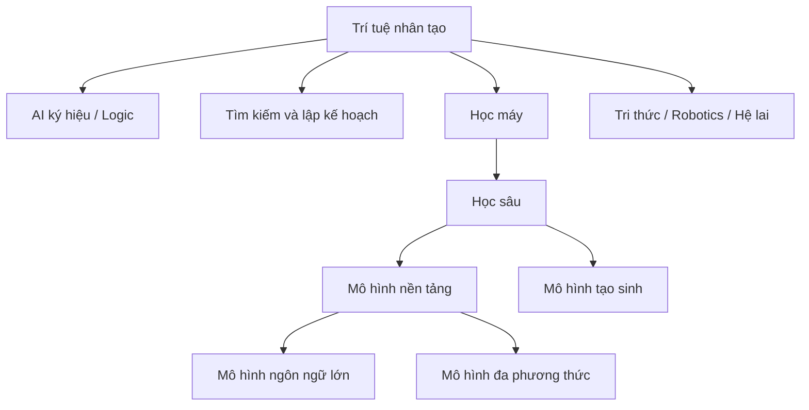

# AI, Học máy, Học sâu và AI tạo sinh khác nhau thế nào?

Các thuật ngữ `AI`, `Machine Learning`, `Deep Learning`, `Generative AI`, `Foundation Model` và `LLM` thường bị dùng lẫn nhau trong truyền thông và cả trong công việc. Điều này dễ tạo một mô hình tư duy sai rằng chúng là các “thế hệ” nối tiếp nhau, và công nghệ mới sẽ thay thế hoàn toàn công nghệ cũ. Thực tế, chúng có quan hệ **tập con, chồng lấn và cách ứng dụng** phức tạp hơn.

## Trí tuệ nhân tạo là phạm vi bao trùm

**Trí tuệ nhân tạo (Artificial Intelligence - AI / 인공지능)** là phạm vi rộng nhất trong nhóm này. AI nghiên cứu các hệ thống có năng lực như nhận thức, suy luận, tìm kiếm, lập kế hoạch, học, xử lý ngôn ngữ và ra quyết định.

Một hệ thống AI không bắt buộc phải học từ dữ liệu. Máy chơi cờ dùng minimax và tìm kiếm, hệ chuyên gia dùng quy tắc, bộ giải ràng buộc dùng các ràng buộc tường minh đều thuộc phạm vi AI.



Sơ đồ chỉ minh họa các quan hệ chính, không phải hệ phân loại tuyệt đối. Mô hình tạo sinh tồn tại từ trước thời đại mô hình nền tảng, và không phải mọi mô hình nền tảng chỉ dùng để sinh nội dung.

## Học máy: hành vi được học từ dữ liệu

**Học máy (Machine Learning - ML / 기계학습)** tập trung vào các thuật toán cải thiện hiệu năng dựa trên dữ liệu hoặc kinh nghiệm.

Ta có tập dữ liệu:

\[
D = \{(x_i, y_i)\}_{i=1}^{n}
\]

và muốn học một hàm:

\[
f_\theta(x) \approx y
\]

trong đó `θ` là các tham số của mô hình.

Mục tiêu quan trọng không phải để mô hình ghi nhớ các mẫu huấn luyện, mà là **khái quát hóa (generalize)** tốt sang dữ liệu chưa thấy nhưng được sinh từ cùng phân phối hoặc một phân phối đủ gần.

Các họ phương pháp phổ biến gồm mô hình tuyến tính, cây quyết định, SVM, láng giềng gần nhất, phương pháp tổ hợp, phân cụm và mạng nơ-ron.

Học máy là một tập con của AI vì học chỉ là một trong nhiều cách tạo hành vi thông minh.

## Học sâu: học máy với biểu diễn nơ-ron nhiều tầng

**Học sâu (Deep Learning - DL / 딥러닝)** là một nhánh của học máy sử dụng mạng nơ-ron với nhiều tầng biến đổi để học biểu diễn phân cấp hoặc biểu diễn phân tán.

Một luồng học máy cổ điển thường có dạng:

```text
Dữ liệu thô
→ Đặc trưng do con người thiết kế
→ Mô hình học máy
→ Dự đoán
```

Trong khi đó, học sâu cố học nhiều phần của biểu diễn trực tiếp từ dữ liệu:

```text
Dữ liệu gần dạng thô
→ Các tầng nơ-ron
→ Biểu diễn đã học
→ Dự đoán / Sinh dữ liệu
```

Học sâu đặc biệt thành công với dữ liệu phi cấu trúc nhiều chiều như ảnh, âm thanh và ngôn ngữ.

Tuy nhiên, học sâu không mặc định tốt hơn trong mọi tình huống. Với dữ liệu dạng bảng nhỏ hoặc bài toán có quy tắc nghiệp vụ rõ, mô hình cây tổ hợp hoặc mô hình học máy cổ điển có thể đơn giản, nhanh và dễ vận hành hơn.

## AI tạo sinh: mô hình tạo ra nội dung hoặc mẫu mới

**AI tạo sinh (Generative AI / 생성형 AI)** tập trung vào các mô hình có thể tạo đầu ra mới dựa trên phân phối dữ liệu đã học.

Một mô hình phân biệt (discriminative classifier) thường quan tâm tới:

\[
P(y\mid x)
\]

trong khi mô hình tạo sinh có thể học phân phối như:

\[
P(x)
\]

hoặc phân phối chung/có điều kiện:

\[
P(x,y), \quad P(x\mid c)
\]

Trong mô hình ngôn ngữ, xác suất của chuỗi có thể được phân rã thành:

\[
P(x_1,\ldots,x_T)=\prod_{t=1}^{T}P(x_t\mid x_{<t})
\]

Mô hình sinh văn bản bằng cách lặp lại việc dự đoán phân phối của token tiếp theo rồi lựa chọn hoặc lấy mẫu token đó.

Mô hình tạo sinh không chỉ là LLM. GAN, VAE, mô hình khuếch tán (diffusion model) và các mô hình tự hồi quy cho ảnh hoặc âm thanh đều thuộc mô hình tạo sinh.

## Mô hình ngôn ngữ lớn (LLM)

**Mô hình ngôn ngữ lớn (Large Language Model - LLM / 대규모 언어 모델)** là mô hình ngôn ngữ ở quy mô lớn, thường dựa trên Transformer, được huấn luyện trên lượng văn bản và mã nguồn rất lớn bằng mục tiêu tự giám sát như dự đoán token tiếp theo.

LLM có thể thực hiện nhiều nhiệm vụ mà không cần huấn luyện một mô hình riêng hoàn toàn cho từng nhiệm vụ vì nhiệm vụ có thể được mô tả bằng ngôn ngữ tự nhiên trong ngữ cảnh.

Một luồng suy luận đơn giản hóa:

```text
Văn bản
→ Bộ tách token (tokenizer)
→ Mã token
→ Vector nhúng
→ Các tầng Transformer
→ Logit
→ Phân phối xác suất
→ Token tiếp theo
```

Lặp lại quá trình này sẽ tạo ra cả chuỗi.

LLM là một loại mô hình tạo sinh và thường cũng là mô hình nền tảng, nhưng không đồng nghĩa với toàn bộ AI tạo sinh.

## Mô hình nền tảng (Foundation Model)

**Mô hình nền tảng (Foundation Model / 기반 모델)** là mô hình được tiền huấn luyện trên dữ liệu rộng và có thể thích nghi cho nhiều nhiệm vụ phía sau.

Ý tưởng trung tâm là tái sử dụng năng lực đã học:

```text
Tiền huấn luyện quy mô lớn
        ↓
Biểu diễn / năng lực tổng quát
        ↓
Lời nhắc | Tinh chỉnh | Truy xuất | Công cụ
        ↓
Nhiều ứng dụng
```

Mô hình ngôn ngữ, mô hình thị giác-ngôn ngữ và mô hình đa phương thức đều có thể là mô hình nền tảng.

## Học có giám sát, không giám sát, tự giám sát và học tăng cường

Đây là **các cách học (learning paradigms)**, không phải “các thế hệ AI”.

### Học có giám sát (supervised learning)

Dữ liệu huấn luyện có nhãn mục tiêu:

\[
(x_i,y_i)
\]

Ví dụ: email → thư rác / không phải thư rác.

### Học không giám sát (unsupervised learning)

Không có nhãn mục tiêu tường minh. Mô hình tìm cấu trúc trong dữ liệu, ví dụ phân cụm (clustering).

### Học tự giám sát (self-supervised learning)

Tín hiệu giám sát được tạo từ chính dữ liệu. Mô hình ngôn ngữ là ví dụ: ngữ cảnh đóng vai đầu vào, token tiếp theo trong văn bản đóng vai mục tiêu.

Học tự giám sát đặc biệt quan trọng vì lượng văn bản quy mô internet không cần con người gán nhãn từng mẫu bằng tay.

### Học tăng cường (Reinforcement Learning - RL)

Tác nhân tương tác với môi trường và nhận phần thưởng. Mục tiêu là học hành vi tối đa hóa tổng phần thưởng kỳ vọng theo thời gian.

RL có thể được kết hợp trong quá trình căn chỉnh LLM, nhưng RL không phải một tập con của LLM.

## AI dự đoán và AI tạo sinh

Một cách phân biệt thực dụng trong thiết kế sản phẩm:

**AI dự đoán (predictive AI)** thường trả về dự đoán có cấu trúc như xác suất, lớp, điểm số hoặc giá trị dự báo.

**AI tạo sinh (generative AI)** tạo sản phẩm phong phú hơn như văn bản, mã nguồn, ảnh hoặc âm thanh.

Ví dụ trong ngân hàng:

```text
Xác suất gian lận       → học máy dự đoán
Điểm tín dụng           → học máy dự đoán
Bản nháp hỗ trợ khách hàng → AI tạo sinh
Tóm tắt tài liệu        → AI tạo sinh
```

Một sản phẩm có thể dùng cả hai. Không nên thay mô hình gian lận chuyên dụng bằng LLM chỉ vì LLM “mới hơn”. Cấu trúc bài toán quyết định phương pháp phù hợp.

## NLP không đồng nghĩa với LLM

**Xử lý ngôn ngữ tự nhiên (Natural Language Processing - NLP / 자연어 처리)** là lĩnh vực xử lý ngôn ngữ con người. NLP tồn tại từ rất lâu trước LLM và bao gồm tách token, phân tích cú pháp, trích xuất thông tin, truy xuất, dịch máy, phân loại và nhiều nhiệm vụ khác.

LLM là một hướng tiếp cận rất mạnh trong NLP, nhưng NLP rộng hơn LLM.

Tương tự:

```text
Thị giác máy tính ≠ CNN
NLP ≠ LLM
AI ≠ ML
ML ≠ Học sâu
AI tạo sinh ≠ Chatbot
Tác nhân ≠ LLM
```

## RAG nằm ở đâu?

**Sinh tăng cường bằng truy xuất (Retrieval-Augmented Generation - RAG / 검색 증강 생성)** thường không phải một họ mô hình. Nó là một kiến trúc hệ thống kết hợp truy xuất với mô hình tạo sinh.

```text
Tri thức bên ngoài
      ↓
Bộ truy xuất ← Truy vấn
      ↓
Ngữ cảnh liên quan
      ↓
LLM
      ↓
Câu trả lời bám nguồn
```

RAG bổ sung tri thức tại thời điểm suy luận thay vì buộc mọi tri thức phải được lưu trong tham số mô hình.

## Tác nhân nằm ở đâu?

Tác nhân cũng là một phép trừu tượng cấp hệ thống, không phải một loại mô hình.

LLM có thể đóng vai trò thành phần ra quyết định trong tác nhân:

```text
Mục tiêu
→ Quan sát
→ Quyết định
→ Công cụ / Hành động
→ Kết quả
→ Cập nhật trạng thái
→ Lặp lại
```

Tác nhân có thể sử dụng RAG, cơ sở dữ liệu, công cụ tìm kiếm, máy tính và nhiều mô hình khác nhau.

## Phân loại theo câu hỏi kỹ thuật

Khi lựa chọn công nghệ, cách phân loại thực dụng hơn là bắt đầu từ câu hỏi:

| Câu hỏi | Nhóm phương pháp thường liên quan |
|---|---|
| Cần tìm đường đi hoặc kế hoạch? | Tìm kiếm, lập kế hoạch |
| Cần quy tắc hoặc ràng buộc tường minh? | AI ký hiệu, giải ràng buộc |
| Cần dự đoán nhãn/điểm từ dữ liệu lịch sử? | Học máy |
| Đầu vào là ảnh/âm thanh/văn bản phức tạp? | Học sâu |
| Cần tạo nội dung? | Mô hình tạo sinh |
| Cần năng lực ngôn ngữ rộng? | LLM / mô hình nền tảng |
| Cần tri thức mới hoặc dữ liệu riêng? | Truy xuất / RAG |
| Cần thực hiện nhiều hành động liên tiếp? | Luồng công việc / tác nhân |
| Cần học từ phần thưởng tuần tự? | Học tăng cường |

Không có quy tắc rằng “dùng AI thì phải dùng LLM”.

## Ví dụ: hệ thống eKYC

Một luồng eKYC có thể kết hợp nhiều nhóm AI:

```text
Kiểm tra chất lượng ảnh giấy tờ → Thị giác máy tính
OCR                            → Thị giác / NLP
Phát hiện khuôn mặt             → Học sâu
Độ tương đồng khuôn mặt         → Học biểu diễn / học metric
Phát hiện tính sống             → Mô hình thị giác
Điểm rủi ro gian lận            → Học máy
Giải thích tài liệu             → LLM
Truy xuất chính sách nội bộ     → RAG
Trợ lý xử lý hồ sơ              → Tác nhân / luồng công việc
```

Gọi toàn bộ hệ thống là “AI” là đúng ở mức bao quát, nhưng ở mức kỹ thuật cần biết từng thành phần đang giải loại bài toán nào.

## Mô hình tư duy (mental model)

Thay vì ghi nhớ hệ phân cấp như các từ khóa thời thượng, hãy dùng ba trục:

```text
1. Bài toán: dự đoán, sinh, tìm kiếm, suy luận hay hành động?
2. Tri thức: nằm trong quy tắc, dữ liệu, tham số hay kho bên ngoài?
3. Cơ chế: logic, tối ưu hóa, truy xuất, lấy mẫu hay tương tác?
```

Một hệ thống hiện đại thường phối hợp nhiều cơ chế.

## Các hiểu lầm thường gặp

### “AI tạo sinh chỉ bắt đầu từ ChatGPT”

Mô hình tạo sinh có lịch sử lâu hơn nhiều. Sự bùng nổ gần đây đến từ mô hình nền tảng, Transformer, quy mô tính toán/dữ liệu và khả năng tiếp cận sản phẩm.

### “Học sâu thay thế học máy”

Học sâu là một phần của học máy. Các phương pháp cổ điển vẫn rất hữu ích, đặc biệt với dữ liệu dạng bảng, ít dữ liệu hoặc khi cần mô hình nền dễ diễn giải.

### “LLM mạnh thì tự biết cơ sở dữ liệu của công ty”

Không. Tri thức riêng hoặc mới phải được cung cấp qua ngữ cảnh, truy xuất, tinh chỉnh phù hợp hoặc quyền truy cập công cụ. Mô hình mạnh hơn không tự động có quyền đọc dữ liệu riêng.

### “Tác nhân là tầng bắt buộc sau RAG”

Không có hệ phân cấp bắt buộc như vậy. Tác nhân có thể dùng hoặc không dùng RAG; RAG có thể tồn tại hoàn toàn mà không có tác nhân.

## Liên kết kiến thức

Chapter này là bản đồ thuật ngữ. Từ đây library đi sâu từng cơ chế: Toán học → Học máy → Mạng nơ-ron → Transformer → LLM → Truy xuất/RAG → Tác nhân, đồng thời giữ các nhánh AI cổ điển, Học tăng cường, Thị giác máy tính và An toàn AI như những miền riêng có liên kết rõ ràng.

Xem thêm: [Trí tuệ nhân tạo là gì?](./00_what_is_artificial_intelligence.md) và [Toán học cho AI](../01_mathematical_foundations/00_mathematics_for_ai.md).