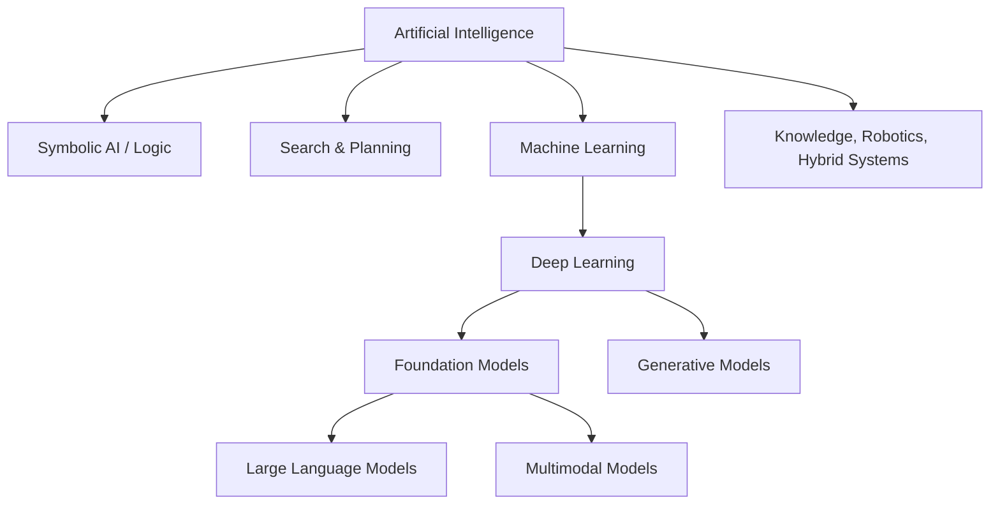

# AI vs Machine Learning vs Deep Learning vs Generative AI

Các thuật ngữ `AI`, `Machine Learning`, `Deep Learning`, `Generative AI`, `Foundation Model` và `LLM` thường được dùng lẫn nhau trong media và cả trong công việc. Điều đó dễ tạo một mental model sai: rằng chúng là các “generation” nối tiếp nhau và cái mới thay thế cái cũ. Thực tế chúng có quan hệ **subset, overlap và application pattern** phức tạp hơn.

## Artificial Intelligence là umbrella field

Artificial Intelligence (AI / 인공지능 / Trí tuệ nhân tạo) là phạm vi rộng nhất trong nhóm này. Nó nghiên cứu system có capability như perception, reasoning, search, planning, learning, language processing và decision making.

Một system AI không bắt buộc phải học từ data. Chess engine dùng minimax/search, expert system dùng rule, constraint solver dùng explicit constraints vẫn thuộc phạm vi AI.



Sơ đồ chỉ minh họa dependency chính, không phải taxonomy tuyệt đối. Generative modeling tồn tại cả trước foundation-model era và không phải mọi foundation model đều chỉ dùng cho generation.

## Machine Learning: behavior được học từ data

Machine Learning (ML / 기계학습 / học máy) tập trung vào algorithms cải thiện performance dựa trên data hoặc experience.

Ta có dataset:

\[
D = \{(x_i, y_i)\}_{i=1}^{n}
\]

và muốn học function:

\[
f_\theta(x) \approx y
\]

trong đó `θ` là parameters.

Điều quan trọng không phải model nhớ training samples mà phải **generalize** tới unseen data cùng một distribution hoặc distribution đủ gần.

Các family phổ biến gồm linear models, trees, SVM, nearest neighbors, ensemble methods, clustering và neural networks.

Machine Learning là subset của AI vì learning chỉ là một cách tạo intelligent behavior.

## Deep Learning: Machine Learning bằng deep neural representations

Deep Learning (DL / 딥러닝 / học sâu) là subset của Machine Learning sử dụng neural networks với nhiều tầng transformation để học hierarchical hoặc distributed representations.

Nếu classical ML pipeline thường trông như:

```text
Raw Data
→ Hand-designed Features
→ ML Model
→ Prediction
```

Deep Learning thường cố học nhiều phần representation trực tiếp:

```text
Raw-ish Data
→ Neural Layers
→ Learned Representations
→ Prediction / Generation
```

Deep Learning đặc biệt thành công với high-dimensional unstructured data như image, audio và language.

Tuy nhiên deep learning không mặc định tốt hơn cho mọi dataset. Với tabular data nhỏ hoặc business rule rõ, tree ensemble hoặc classical model có thể đơn giản, nhanh và dễ vận hành hơn.

## Generative AI: model tạo sample/content mới

**Generative AI (생성형 AI / AI tạo sinh)** tập trung vào model có thể tạo output mới dựa trên learned data distribution.

Một discriminative classifier thường quan tâm tới:

\[
P(y\mid x)
\]

trong khi generative modeling có thể học distribution như:

\[
P(x)
\]

hoặc joint/conditional distribution:

\[
P(x,y), \quad P(x\mid c)
\]

Trong language modeling, sequence probability được factorize:

\[
P(x_1,\ldots,x_T)=\prod_{t=1}^{T}P(x_t\mid x_{<t})
\]

Model sinh text bằng cách lặp lại việc dự đoán distribution của next token rồi chọn/sample token.

Generative model không chỉ là LLM. GAN, VAE, diffusion model và autoregressive image/audio models đều thuộc generative modeling.

## Large Language Model

**Large Language Model (LLM / 대규모 언어 모델)** là language model ở scale lớn, thường dựa trên Transformer, được train trên lượng text/code lớn bằng self-supervised objective như next-token prediction hoặc variant liên quan.

LLM có thể làm nhiều task mà không cần train model riêng cho từng task vì task được biểu diễn bằng natural language context.

Một simplified inference flow:

```text
Text
→ Tokenizer
→ Token IDs
→ Embeddings
→ Transformer Layers
→ Logits
→ Probability Distribution
→ Next Token
```

Lặp lại process này tạo sequence.

LLM là một loại generative/foundation model, không đồng nghĩa với toàn bộ Generative AI.

## Foundation Model

**Foundation Model (기반 모델)** là model pretrained trên broad data và có thể adapt cho nhiều downstream tasks.

Key idea là reuse:

```text
Large-scale Pretraining
        ↓
General Representation / Capability
        ↓
Prompting | Fine-tuning | Retrieval | Tools
        ↓
Many Applications
```

Language model, vision-language model và multimodal model đều có thể là foundation model.

## Supervised, Unsupervised, Self-Supervised và Reinforcement Learning

Đây là learning paradigms, không phải “loại AI theo generation”.

### Supervised Learning

Training data có target label:

\[
(x_i,y_i)
\]

Ví dụ email → spam/not spam.

### Unsupervised Learning

Không có explicit target label. Model tìm structure trong data, ví dụ clustering.

### Self-Supervised Learning

Supervision được tạo từ chính data. Language modeling là ví dụ: context đóng vai input, token tiếp theo trong text đóng vai target.

Self-supervised learning đặc biệt quan trọng vì internet-scale text không cần con người label từng sample thủ công.

### Reinforcement Learning

Agent interaction với environment và nhận reward. Goal là học behavior maximize expected cumulative return.

RL có thể kết hợp với LLM alignment, nhưng RL không phải subset của LLM.

## Predictive AI và Generative AI

Một useful distinction trong product design:

**Predictive AI** thường trả structured prediction như probability, class, score hoặc forecast.

**Generative AI** tạo richer artifact như text, code, image hoặc audio.

Ví dụ banking:

```text
Fraud probability      → predictive ML
Credit score           → predictive ML
Customer support draft → generative AI
Document summarization → generative AI
```

Một product có thể dùng cả hai. LLM không nên thay thế fraud model chỉ vì nó “mới hơn”. Task structure quyết định approach.

## NLP không bằng LLM

Natural Language Processing (NLP / 자연어 처리) là domain xử lý human language. NLP tồn tại trước LLM rất lâu và gồm tokenization, parsing, information extraction, retrieval, translation, classification và nhiều task khác.

LLM là một approach rất mạnh trong NLP nhưng domain NLP rộng hơn LLM.

Tương tự:

```text
Computer Vision ≠ CNN
NLP ≠ LLM
AI ≠ ML
ML ≠ Deep Learning
Generative AI ≠ Chatbot
Agent ≠ LLM
```

## RAG nằm ở đâu?

Retrieval-Augmented Generation (RAG / 검색 증강 생성) thường **không phải một model family**. Nó là system architecture kết hợp retrieval với generative model.

```text
External Knowledge
      ↓
Retriever ← Query
      ↓
Relevant Context
      ↓
LLM
      ↓
Grounded Response
```

RAG bổ sung knowledge tại inference time thay vì bắt tất cả knowledge phải nằm trong model parameters.

## Agent nằm ở đâu?

Agent cũng là system abstraction, không phải model type.

Một LLM có thể đóng vai decision component trong agent:

```text
Goal
→ Observe
→ Decide
→ Tool/Action
→ Result
→ Update State
→ Repeat
```

Agent có thể sử dụng RAG, database, search engine, calculator và nhiều models.

## Một taxonomy theo câu hỏi engineering

Khi chọn technology, taxonomy thực dụng hơn là hỏi:

| Câu hỏi | Nhóm approach thường liên quan |
|---|---|
| Cần tìm path/plan? | Search, Planning |
| Cần explicit rule/constraint? | Symbolic AI, Constraint Solving |
| Cần predict label/score từ historical data? | Machine Learning |
| Input là image/audio/text phức tạp? | Deep Learning |
| Cần generate content? | Generative Model |
| Cần broad natural-language capability? | LLM/Foundation Model |
| Cần current/private knowledge? | Retrieval/RAG |
| Cần thực hiện multi-step actions? | Workflow/Agent |
| Cần học từ sequential reward? | Reinforcement Learning |

Không có rule rằng “dùng AI thì phải dùng LLM”.

## Example: eKYC system

Một eKYC pipeline có thể kết hợp nhiều AI categories:

```text
ID image quality check      → Computer Vision
OCR                         → Vision/NLP
Face detection              → Deep Learning
Face similarity             → Metric/Representation Learning
Liveness detection          → Vision model
Fraud risk score            → Machine Learning
Document explanation        → LLM
Internal policy retrieval   → RAG
Case-handling assistant     → Agent/Workflow
```

Gọi toàn bộ system là “AI” đúng ở level umbrella, nhưng engineering cần biết từng component thuộc loại problem nào.

## Mental Model

Thay vì nhớ hierarchy như buzzword, hãy dùng ba axis:

```text
1. Problem: predict, generate, search, reason hay act?
2. Knowledge: rule, data, parameters hay external store?
3. Mechanism: logic, optimization, retrieval, sampling hay interaction?
```

Một system hiện đại thường phối hợp nhiều mechanism.

## Common Misconceptions

### “Generative AI mới bắt đầu từ ChatGPT”

Generative modeling có lịch sử lâu hơn nhiều. Sự bùng nổ gần đây đến từ foundation models, Transformers, scale và product accessibility.

### “Deep Learning thay thế Machine Learning”

Deep Learning là một phần của ML. Classical methods vẫn rất hữu ích, đặc biệt cho tabular data, low-data settings và interpretable baselines.

### “LLM biết database của công ty nếu model mạnh”

Không. Private/current knowledge phải được đưa qua context, retrieval, fine-tuning phù hợp hoặc tool access. Model strength không tự cấp quyền truy cập dữ liệu.

### “Agent là layer sau RAG”

Không có hierarchy bắt buộc đó. Agent có thể dùng hoặc không dùng RAG; RAG có thể tồn tại hoàn toàn không agentic.

## Knowledge Connection

Chapter này là bản đồ thuật ngữ. Từ đây library sẽ đi sâu từng mechanism: Mathematics → Machine Learning → Neural Networks → Transformer → LLM → Retrieval/RAG → Agent, đồng thời giữ các nhánh Classical AI, Reinforcement Learning, Computer Vision và Safety như các domain độc lập có connection rõ ràng.

Xem thêm: [Artificial Intelligence là gì?](./00_what_is_artificial_intelligence.md) và [Mathematics for AI](../01_mathematical_foundations/00_mathematics_for_ai.md).