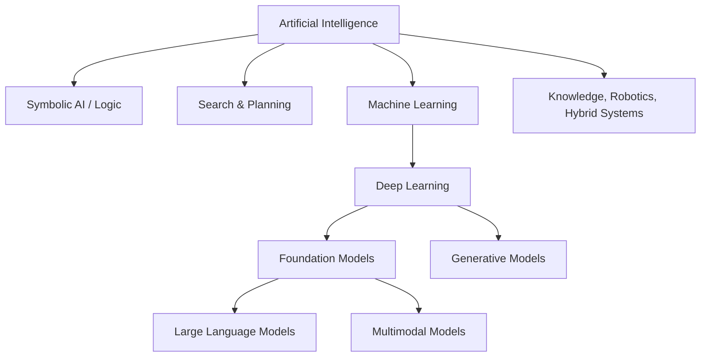

# AI vs Machine học tập (learning / 학습) vs Deep học tập (learning / 학습) vs Generative AI

> **Mạch đọc:** [README](../README.md) là bản đồ owner của **AI vs ML vs DL vs Generative AI**. Route đi từ AI field/problem → ML learned behavior → DL representation/scale → generative modeling/sampling, để bốn nhãn được phân biệt bằng cơ chế và loại dữ liệu cần có.

Các thuật ngữ `AI`, `Machine Learning`, `Deep Learning`, `Generative AI`, `Foundation Model` và `LLM` thường được dùng lẫn nhau trong media và cả trong công việc. Điều đó dễ tạo một mô hình tư duy (mental model / 사고 모델) sai: rằng chúng là các “generation” nối tiếp nhau và cái mới thay thế cái cũ. Thực tế chúng có quan hệ **subset, overlap và ứng dụng (application / 애플리케이션) mẫu (pattern / 패턴)** phức tạp hơn.

## Artificial Intelligence là umbrella trường dữ liệu (field / 필드)

Artificial Intelligence (AI / 인공지능 / Trí tuệ nhân tạo) là phạm vi rộng nhất trong nhóm này. Nó nghiên cứu hệ thống (system / 시스템) có năng lực (capability / 역량) như perception, lập luận (reasoning / 추론), tìm kiếm (search / 검색), planning, học tập (learning / 학습), ngôn ngữ (language / 언어) processing và quyết định (decision / 결정) making.

Một hệ thống (system / 시스템) AI không bắt buộc phải học từ dữ liệu (data / 데이터). Chess engine dùng minimax/tìm kiếm (search / 검색), expert hệ thống (system / 시스템) dùng quy tắc (rule / 규칙), ràng buộc (constraint / 제약조건) solver dùng tường minh (explicit / 명시적) các ràng buộc (constraints / 제약조건들) vẫn thuộc phạm vi AI.


```mermaid
flowchart TD
    AI[Artificial Intelligence]
    AI --> SYM[Symbolic AI / Logic]
    AI --> SEARCH[Search & Planning]
    AI --> ML[Machine Learning]
    AI --> OTHER[Knowledge, Robotics, Hybrid Systems]
    ML --> DL[Deep Learning]
    DL --> FM[Foundation Models]
    FM --> LLM[Large Language Models]
    FM --> MM[Multimodal Models]
    DL --> GEN[Generative Models]
```

Sơ đồ chỉ minh họa phụ thuộc (dependency / 의존성) chính, không phải taxonomy tuyệt đối. Generative modeling tồn tại cả trước foundation-model era và không phải mọi foundation mô hình (model / 모델) đều chỉ dùng cho generation.

> **Chuyển mạch:** Trong **AI vs Machine học tập (learning / 학습) vs Deep học tập (learning / 학습) vs Generative AI**, **Artificial Intelligence là umbrella trường dữ liệu (field / 필드)** nêu điều cần giải thích; **Machine học tập (learning / 학습): hành vi (behavior / 동작) được học từ dữ liệu (data / 데이터)** đối chiếu nó với bằng chứng hoặc nguồn kiểm chứng. Từ đây, **Deep học tập (learning / 학습): Machine học tập (learning / 학습) bằng deep neural representations** sẽ cho biết hệ quả hoặc giới hạn ấy hiện ra ở đâu.

## Machine học tập (learning / 학습): hành vi (behavior / 동작) được học từ dữ liệu (data / 데이터)

Machine học tập (learning / 학습) tập trung vào algorithms cải thiện hiệu năng (performance / 성능) dựa trên dữ liệu (data / 데이터) hoặc experience.

Ta có dataset:

\[
D = \{(x_i, y_i)\}_{i=1}^{n}
\]

và muốn học hàm (function / 함수):

\[
f_\theta(x) \approx y
\]

trong đó `θ` là parameters.

Điều quan trọng không phải mô hình (model / 모델) nhớ huấn luyện (training / 학습) samples mà phải **generalize** tới unseen dữ liệu (data / 데이터) cùng một phân phối (distribution / 분포) hoặc phân phối (distribution / 분포) đủ gần.

Các family phổ biến gồm tuyến tính (linear / 선형) các mô hình (models / 모델들), trees, SVM, nearest neighbors, ensemble methods, clustering và neural networks.

Machine học tập (learning / 학습) là subset của AI vì học tập (learning / 학습) chỉ là một cách tạo intelligent hành vi (behavior / 동작).

> **Chuyển mạch:** Ở chặng này của **AI vs Machine học tập (learning / 학습) vs Deep học tập (learning / 학습) vs Generative AI**, **Machine học tập (learning / 학습): hành vi (behavior / 동작) được học từ dữ liệu (data / 데이터)** nêu điều cần giải thích; **Deep học tập (learning / 학습): Machine học tập (learning / 학습) bằng deep neural representations** đối chiếu nó với bằng chứng hoặc nguồn kiểm chứng. Từ đây, **Generative AI: mô hình (model / 모델) tạo mẫu (sample / 표본)/content mới** sẽ cho biết hệ quả hoặc giới hạn ấy hiện ra ở đâu.

## Deep học tập (learning / 학습): Machine học tập (learning / 학습) bằng deep neural representations

Deep học tập (learning / 학습) là subset của Machine học tập (learning / 학습) sử dụng neural networks với nhiều tầng transformation để học hierarchical hoặc phân tán (distributed / 분산) representations.

Nếu classical ML chuỗi xử lý (pipeline / 파이프라인) thường trông như:

```text
Raw Data
→ Hand-designed Features
→ ML Model
→ Prediction
```

Deep học tập (learning / 학습) thường cố học nhiều phần biểu diễn (representation / 표현) trực tiếp:

```text
Raw-ish Data
→ Neural Layers
→ Learned Representations
→ Prediction / Generation
```

Deep học tập (learning / 학습) đặc biệt thành công với high-dimensional unstructured dữ liệu (data / 데이터) như ảnh (image / 이미지), audio và ngôn ngữ (language / 언어).

Tuy nhiên deep học tập (learning / 학습) không mặc định tốt hơn cho mọi dataset. Với tabular dữ liệu (data / 데이터) nhỏ hoặc nghiệp vụ (business / 비즈니스) quy tắc (rule / 규칙) rõ, cây (tree / 트리) ensemble hoặc classical mô hình (model / 모델) có thể đơn giản, nhanh và dễ vận hành hơn.

> **Chuyển mạch:** Đặt trong câu hỏi lớn của **AI vs Machine học tập (learning / 학습) vs Deep học tập (learning / 학습) vs Generative AI**, **Generative AI: mô hình (model / 모델) tạo mẫu (sample / 표본)/content mới** tiếp nhận điểm tựa từ **Deep học tập (learning / 학습): Machine học tập (learning / 학습) bằng deep neural representations** nhưng đổi góc nhìn sang câu hỏi của chính nó; đọc liền hai mục để thấy mối quan hệ đó. Từ đây, **Large ngôn ngữ (language / 언어) mô hình (model / 모델)** sẽ cho biết hệ quả hoặc giới hạn ấy hiện ra ở đâu.

## Generative AI: mô hình (model / 모델) tạo mẫu (sample / 표본)/content mới

**Generative AI (생성형 AI / AI tạo sinh)** tập trung vào mô hình (model / 모델) có thể tạo đầu ra (output / 출력) mới dựa trên learned dữ liệu (data / 데이터) phân phối (distribution / 분포).

Một discriminative classifier thường quan tâm tới:

\[
P(y\mid x)
\]

trong khi generative modeling có thể học phân phối (distribution / 분포) như:

\[
P(x)
\]

hoặc joint/conditional phân phối (distribution / 분포):

\[
P(x,y), \quad P(x\mid c)
\]

Trong ngôn ngữ (language / 언어) modeling, chuỗi (sequence / 시퀀스) xác suất (probability / 확률) được factorize:

\[
P(x_1,\ldots,x_T)=\prod_{t=1}^{T}P(x_t\mid x_{<t})
\]

Mô hình (model / 모델) sinh văn bản (text / 텍스트) bằng cách lặp lại việc dự đoán phân phối (distribution / 분포) của next đơn vị từ (token / 토큰) rồi chọn/mẫu (sample / 표본) đơn vị từ (token / 토큰).

Generative mô hình (model / 모델) không chỉ là LLM. GAN, VAE, diffusion mô hình (model / 모델) và autoregressive ảnh (image / 이미지)/audio các mô hình (models / 모델들) đều thuộc generative modeling.

> **Chuyển mạch:** Trong **AI vs Machine học tập (learning / 학습) vs Deep học tập (learning / 학습) vs Generative AI**, **Large ngôn ngữ (language / 언어) mô hình (model / 모델)** tiếp nhận điểm tựa từ **Generative AI: mô hình (model / 모델) tạo mẫu (sample / 표본)/content mới** nhưng đổi góc nhìn sang câu hỏi của chính nó; đọc liền hai mục để thấy mối quan hệ đó. Từ đây, **Foundation mô hình (model / 모델)** sẽ cho biết hệ quả hoặc giới hạn ấy hiện ra ở đâu.

## Large ngôn ngữ (language / 언어) mô hình (model / 모델)

**Large ngôn ngữ (language / 언어) mô hình (model / 모델)** là ngôn ngữ (language / 언어) mô hình (model / 모델) ở quy mô (scale / 규모) lớn, thường dựa trên Transformer, được train trên lượng văn bản (text / 텍스트)/mã (code / 코드) lớn bằng self-supervised mục tiêu (objective / 목표) như next-token prediction hoặc variant liên quan.

LLM có thể làm nhiều tác vụ (task / 작업) mà không cần train mô hình (model / 모델) riêng cho từng tác vụ (task / 작업) vì tác vụ (task / 작업) được biểu diễn bằng natural ngôn ngữ (language / 언어) ngữ cảnh (context / 맥락).

Một simplified suy luận (inference / 추론) luồng (flow / 흐름):

```text
Text
→ Tokenizer
→ Token IDs
→ Embeddings
→ Transformer Layers
→ Logits
→ Probability Distribution
→ Next Token
```

Lặp lại tiến trình (process / 프로세스) này tạo chuỗi (sequence / 시퀀스).

LLM là một loại generative/foundation mô hình (model / 모델), không đồng nghĩa với toàn bộ Generative AI.

> **Chuyển mạch:** Ở chặng này của **AI vs Machine học tập (learning / 학습) vs Deep học tập (learning / 학습) vs Generative AI**, **Foundation mô hình (model / 모델)** tiếp nhận điểm tựa từ **Large ngôn ngữ (language / 언어) mô hình (model / 모델)** nhưng đổi góc nhìn sang câu hỏi của chính nó; đọc liền hai mục để thấy mối quan hệ đó. Từ đây, **Supervised, Unsupervised, Self-Supervised và Reinforcement học tập (learning / 학습)** sẽ cho biết hệ quả hoặc giới hạn ấy hiện ra ở đâu.

## Foundation mô hình (model / 모델)

**Foundation mô hình (model / 모델)** là mô hình (model / 모델) pretrained trên broad dữ liệu (data / 데이터) và có thể adapt cho nhiều downstream tasks.

Key idea là reuse:

```text
Large-scale Pretraining
        ↓
General Representation / Capability
        ↓
Prompting | Fine-tuning | Retrieval | Tools
        ↓
Many Applications
```

Ngôn ngữ (language / 언어) mô hình (model / 모델), vision-language mô hình (model / 모델) và multimodal mô hình (model / 모델) đều có thể là foundation mô hình (model / 모델).

> **Chuyển mạch:** Đặt trong câu hỏi lớn của **AI vs Machine học tập (learning / 학습) vs Deep học tập (learning / 학습) vs Generative AI**, **Supervised, Unsupervised, Self-Supervised và Reinforcement học tập (learning / 학습)** tiếp nhận điểm tựa từ **Foundation mô hình (model / 모델)** nhưng đổi góc nhìn sang câu hỏi của chính nó; đọc liền hai mục để thấy mối quan hệ đó. Từ đây, **Predictive AI và Generative AI** sẽ cho biết hệ quả hoặc giới hạn ấy hiện ra ở đâu.

## Supervised, Unsupervised, Self-Supervised và Reinforcement học tập (learning / 학습)

Đây là học tập (learning / 학습) paradigms, không phải “loại AI theo generation”.

### Supervised học tập (learning / 학습)

Dữ liệu huấn luyện (training data / 학습 데이터) có mục tiêu (target / 대상) label:

\[
(x_i,y_i)
\]

Ví dụ email → spam/not spam.

### Unsupervised học tập (learning / 학습)

Không có tường minh (explicit / 명시적) mục tiêu (target / 대상) label. mô hình (model / 모델) tìm cấu trúc (structure / 구조) trong dữ liệu (data / 데이터), ví dụ clustering.

### Self-Supervised học tập (learning / 학습)

Supervision được tạo từ chính dữ liệu (data / 데이터). ngôn ngữ (language / 언어) modeling là ví dụ: ngữ cảnh (context / 맥락) đóng vai đầu vào (input / 입력), đơn vị từ (token / 토큰) tiếp theo trong văn bản (text / 텍스트) đóng vai mục tiêu (target / 대상).

Self-supervised học tập (learning / 학습) đặc biệt quan trọng vì internet-scale văn bản (text / 텍스트) không cần con người label từng mẫu (sample / 표본) thủ công.

### Reinforcement học tập (learning / 학습)

Tác nhân (agent / 에이전트) tương tác (interaction / 상호작용) với môi trường (environment / 환경) và nhận reward. Goal là học hành vi (behavior / 동작) maximize expected cumulative return.

RL có thể kết hợp với LLM alignment, nhưng RL không phải subset của LLM.

> **Chuyển mạch:** Trong **AI vs Machine học tập (learning / 학습) vs Deep học tập (learning / 학습) vs Generative AI**, **Predictive AI và Generative AI** tiếp nhận điểm tựa từ **Supervised, Unsupervised, Self-Supervised và Reinforcement học tập (learning / 학습)** nhưng đổi góc nhìn sang câu hỏi của chính nó; đọc liền hai mục để thấy mối quan hệ đó. Từ đây, **NLP không bằng LLM** sẽ cho biết hệ quả hoặc giới hạn ấy hiện ra ở đâu.

## Predictive AI và Generative AI

Một useful distinction trong sản phẩm (product / 제품) thiết kế (design / 설계):

**Predictive AI** thường trả structured prediction như xác suất (probability / 확률), lớp (class / 클래스), score hoặc forecast.

**Generative AI** tạo richer sản phẩm tạo ra (artifact / 산출물) như văn bản (text / 텍스트), mã (code / 코드), ảnh (image / 이미지) hoặc audio.

Ví dụ banking:

```text
Fraud probability      → predictive ML
Credit score           → predictive ML
Customer support draft → generative AI
Document summarization → generative AI
```

Một sản phẩm (product / 제품) có thể dùng cả hai. LLM không nên thay thế fraud mô hình (model / 모델) chỉ vì nó “mới hơn”. tác vụ (task / 작업) cấu trúc (structure / 구조) quyết định approach.

> **Chuyển mạch:** Ở chặng này của **AI vs Machine học tập (learning / 학습) vs Deep học tập (learning / 학습) vs Generative AI**, **NLP không bằng LLM** tiếp nhận điểm tựa từ **Predictive AI và Generative AI** nhưng đổi góc nhìn sang câu hỏi của chính nó; đọc liền hai mục để thấy mối quan hệ đó. Từ đây, **RAG nằm ở đâu?** sẽ cho biết hệ quả hoặc giới hạn ấy hiện ra ở đâu.

## NLP không bằng LLM

Natural ngôn ngữ (language / 언어) Processing (NLP / 자연어 처리) là lĩnh vực (domain / 도메인) xử lý human ngôn ngữ (language / 언어). NLP tồn tại trước LLM rất lâu và gồm tokenization, parsing, thông tin (information / 정보) extraction, retrieval, translation, classification và nhiều tác vụ (task / 작업) khác.

LLM là một approach rất mạnh trong NLP nhưng lĩnh vực (domain / 도메인) NLP rộng hơn LLM.

Tương tự:

```text
Computer Vision ≠ CNN
NLP ≠ LLM
AI ≠ ML
ML ≠ Deep Learning
Generative AI ≠ Chatbot
Agent ≠ LLM
```

> **Chuyển mạch:** Đặt trong câu hỏi lớn của **AI vs Machine học tập (learning / 학습) vs Deep học tập (learning / 학습) vs Generative AI**, **RAG nằm ở đâu?** tiếp nhận điểm tựa từ **NLP không bằng LLM** nhưng đổi góc nhìn sang câu hỏi của chính nó; đọc liền hai mục để thấy mối quan hệ đó. Từ đây, **Tác nhân (agent / 에이전트) nằm ở đâu?** sẽ cho biết hệ quả hoặc giới hạn ấy hiện ra ở đâu.

## RAG nằm ở đâu?

Retrieval-Augmented Generation (RAG / 검색 증강 생성) thường **không phải một mô hình (model / 모델) family**. Nó là hệ thống (system / 시스템) kiến trúc (architecture / 아키텍처) kết hợp retrieval với generative mô hình (model / 모델).

```text
External Knowledge
      ↓
Retriever ← Query
      ↓
Relevant Context
      ↓
LLM
      ↓
Grounded Response
```

RAG bổ sung kiến thức (knowledge / 지식) tại suy luận (inference / 추론) thời gian (time / 시간) thay vì bắt tất cả kiến thức (knowledge / 지식) phải nằm trong mô hình (model / 모델) parameters.

> **Chuyển mạch:** Trong **AI vs Machine học tập (learning / 학습) vs Deep học tập (learning / 학습) vs Generative AI**, **Tác nhân (agent / 에이전트) nằm ở đâu?** tiếp nhận điểm tựa từ **RAG nằm ở đâu?** nhưng đổi góc nhìn sang câu hỏi của chính nó; đọc liền hai mục để thấy mối quan hệ đó. Từ đây, **Một taxonomy theo câu hỏi kỹ thuật (engineering / 엔지니어링)** sẽ cho biết hệ quả hoặc giới hạn ấy hiện ra ở đâu.

## Tác nhân (agent / 에이전트) nằm ở đâu?

Tác nhân (agent / 에이전트) cũng là hệ thống (system / 시스템) lớp trừu tượng (abstraction / 추상화), không phải mô hình (model / 모델) kiểu (type / 타입).

Một LLM có thể đóng vai quyết định (decision / 결정) thành phần (component / 컴포넌트) trong tác nhân (agent / 에이전트):

```text
Goal
→ Observe
→ Decide
→ Tool/Action
→ Result
→ Update State
→ Repeat
```

Tác nhân (agent / 에이전트) có thể sử dụng RAG, cơ sở dữ liệu (database / 데이터베이스), tìm kiếm (search / 검색) engine, calculator và nhiều các mô hình (models / 모델들).

> **Chuyển mạch:** Ở chặng này của **AI vs Machine học tập (learning / 학습) vs Deep học tập (learning / 학습) vs Generative AI**, **Một taxonomy theo câu hỏi kỹ thuật (engineering / 엔지니어링)** tiếp nhận điểm tựa từ **Tác nhân (agent / 에이전트) nằm ở đâu?** nhưng đổi góc nhìn sang câu hỏi của chính nó; đọc liền hai mục để thấy mối quan hệ đó. Từ đây, **Example: eKYC hệ thống (system / 시스템)** sẽ cho biết hệ quả hoặc giới hạn ấy hiện ra ở đâu.

## Một taxonomy theo câu hỏi kỹ thuật (engineering / 엔지니어링)

Khi chọn technology, taxonomy thực dụng hơn là hỏi:

| Câu hỏi | Nhóm approach thường liên quan |
|---|---|
| Cần tìm đường dẫn (path / 경로)/plan? | tìm kiếm (search / 검색), Planning |
| Cần tường minh (explicit / 명시적) quy tắc (rule / 규칙)/ràng buộc (constraint / 제약조건)? | Symbolic AI, ràng buộc (constraint / 제약조건) Solving |
| Cần predict label/score từ historical dữ liệu (data / 데이터)? | Machine học tập (learning / 학습) |
| đầu vào (input / 입력) là ảnh (image / 이미지)/audio/văn bản (text / 텍스트) phức tạp? | Deep học tập (learning / 학습) |
| Cần generate content? | Generative mô hình (model / 모델) |
| Cần broad natural-language năng lực (capability / 역량)? | LLM/Foundation mô hình (model / 모델) |
| Cần hiện tại (current / 현재)/private kiến thức (knowledge / 지식)? | Retrieval/RAG |
| Cần thực hiện multi-step actions? | Workflow/tác nhân (agent / 에이전트) |
| Cần học từ sequential reward? | Reinforcement học tập (learning / 학습) |

Không có quy tắc (rule / 규칙) rằng “dùng AI thì phải dùng LLM”.

> **Chuyển mạch:** Đặt trong câu hỏi lớn của **AI vs Machine học tập (learning / 학습) vs Deep học tập (learning / 학습) vs Generative AI**, **Một taxonomy theo câu hỏi kỹ thuật (engineering / 엔지니어링)** cho ta quy tắc; **Example: eKYC hệ thống (system / 시스템)** đặt quy tắc ấy vào tình huống cụ thể để thấy nó hoạt động đến đâu. Từ đây, **Mô hình tư duy (mental model / 사고 모델)** sẽ cho biết hệ quả hoặc giới hạn ấy hiện ra ở đâu.

## Example: eKYC hệ thống (system / 시스템)

Một eKYC chuỗi xử lý (pipeline / 파이프라인) có thể kết hợp nhiều AI categories:

```text
ID image quality check      → Computer Vision
OCR                         → Vision/NLP
Face detection              → Deep Learning
Face similarity             → Metric/Representation Learning
Liveness detection          → Vision model
Fraud risk score            → Machine Learning
Document explanation        → LLM
Internal policy retrieval   → RAG
Case-handling assistant     → Agent/Workflow
```

Gọi toàn bộ hệ thống (system / 시스템) là “AI” đúng ở mức (level / 수준) umbrella, nhưng kỹ thuật (engineering / 엔지니어링) cần biết từng thành phần (component / 컴포넌트) thuộc loại bài toán (problem / 문제) nào.

> **Chuyển mạch:** Trong **AI vs Machine học tập (learning / 학습) vs Deep học tập (learning / 학습) vs Generative AI**, **Example: eKYC hệ thống (system / 시스템)** cho ta quy tắc; **Mô hình tư duy (mental model / 사고 모델)** đặt quy tắc ấy vào tình huống cụ thể để thấy nó hoạt động đến đâu. Từ đây, **Dùng chung (common / 공통) Misconceptions** sẽ cho biết hệ quả hoặc giới hạn ấy hiện ra ở đâu.

## Mô hình tư duy (mental model / 사고 모델)

Thay vì nhớ hierarchy như buzzword, hãy dùng ba axis:

```text
1. Problem: predict, generate, search, reason hay act?
2. Knowledge: rule, data, parameters hay external store?
3. Mechanism: logic, optimization, retrieval, sampling hay interaction?
```

Một hệ thống (system / 시스템) hiện đại thường phối hợp nhiều cơ chế (mechanism / 메커니즘).

> **Chuyển mạch:** Ở chặng này của **AI vs Machine học tập (learning / 학습) vs Deep học tập (learning / 학습) vs Generative AI**, **Dùng chung (common / 공통) Misconceptions** gom các mảnh từ **Mô hình tư duy (mental model / 사고 모델)** thành một kết luận có thể mang sang phần kế tiếp. Từ đây, **Liên kết kiến thức (knowledge connection / 지식 연결)** sẽ cho biết hệ quả hoặc giới hạn ấy hiện ra ở đâu.

## Dùng chung (common / 공통) Misconceptions

### “Generative AI mới bắt đầu từ ChatGPT”

Generative modeling có lịch sử lâu hơn nhiều. Sự bùng nổ gần đây đến từ foundation các mô hình (models / 모델들), Transformers, quy mô (scale / 규모) và sản phẩm (product / 제품) khả năng tiếp cận (accessibility / 접근성).

### “Deep học tập (learning / 학습) thay thế Machine học tập (learning / 학습)”

Deep học tập (learning / 학습) là một phần của ML. Classical methods vẫn rất hữu ích, đặc biệt cho tabular dữ liệu (data / 데이터), low-data settings và interpretable baselines.

### “LLM biết cơ sở dữ liệu (database / 데이터베이스) của công ty nếu mô hình (model / 모델) mạnh”

Không. Private/hiện tại (current / 현재) kiến thức (knowledge / 지식) phải được đưa qua ngữ cảnh (context / 맥락), retrieval, fine-tuning phù hợp hoặc công cụ (tool / 도구) truy cập (access / 접근). mô hình (model / 모델) strength không tự cấp quyền truy cập dữ liệu.

### “tác nhân (agent / 에이전트) là tầng (layer / 계층) sau RAG”

Không có hierarchy bắt buộc đó. tác nhân (agent / 에이전트) có thể dùng hoặc không dùng RAG; RAG có thể tồn tại hoàn toàn không agentic.

> **Chuyển mạch:** Đặt trong câu hỏi lớn của **AI vs Machine học tập (learning / 학습) vs Deep học tập (learning / 학습) vs Generative AI**, sau nội dung của **Dùng chung (common / 공통) Misconceptions**, **Liên kết kiến thức (knowledge connection / 지식 연결)** chỉ rõ tài liệu chuẩn và vị trí sở hữu để người học biết phần nào cần quay lại khi muốn đào sâu. Phần còn lại của file dùng kết quả này để khép lại mạch giải thích.

## Liên kết kiến thức (knowledge connection / 지식 연결)

Chapter này là bản đồ thuật ngữ. Từ đây thư viện (library / 라이브러리) sẽ đi sâu từng cơ chế (mechanism / 메커니즘): Mathematics → Machine học tập (learning / 학습) → Neural Networks → Transformer → LLM → Retrieval/RAG → tác nhân (agent / 에이전트), đồng thời giữ các nhánh Classical AI, Reinforcement học tập (learning / 학습), Computer Vision và an toàn (safety / 안전) như các lĩnh vực (domain / 도메인) độc lập có liên kết (connection / 연결) rõ ràng.

Xem thêm: [Artificial Intelligence là gì?](./00_what_is_artificial_intelligence.md) và [Mathematics for AI](../01_mathematical_foundations/00_mathematics_for_ai.md).

> **Bàn giao:** Sau **Liên kết kiến thức (knowledge connection / 지식 연결)**, hãy giữ lại kết luận và ranh giới của mục này; quay về [README](../README.md) khi cần định vị owner hoặc chọn nhánh học tiếp theo.
